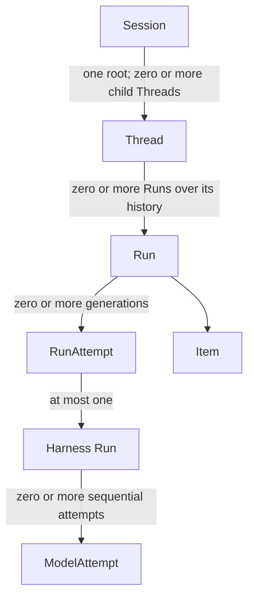

# Agent Interaction and Execution Model

## Design Position

Foundation implements the shared [`Session`, `Thread`, `Run`, and `Item`](../interaction-model.md) interaction model as its durable Agent-work model. This contract is the architecture entry point for the Foundation interaction and execution domain. It maps public interaction identities to durable service authority and process-local execution without redefining the detailed persistence, scheduling, or Harness contracts.

A `Run` is one accepted input-driven advancement of a Thread and the stable durable boundary for scheduling, recovery, state, and outcome. A `RunAttempt` is one replaceable fenced Worker generation inside that Run. One RunAttempt starts at most one process-local Harness Run, and one Harness Run can contain several process-local `ModelAttempt` values. Foundation defines no separate durable `Execution` or `ExecutionAttempt` resource.

This contract owns the identity hierarchy, the distinction between new Agent work and replacement execution, and the cross-layer authority boundaries that every detailed contract preserves. It does not own resource schemas, state machines, database transactions, checkpoint formats, Worker-to-Harness calls, active-control races, or protocol projections.

## Boundaries

| Concern                                                                                         | Owner                                                                                                                                         | Relationship                                                                                                    |
| ----------------------------------------------------------------------------------------------- | --------------------------------------------------------------------------------------------------------------------------------------------- | --------------------------------------------------------------------------------------------------------------- |
| Session, Thread, Run, and Item meaning                                                          | [Platform Interaction Model](../interaction-model.md)                                                                                         | Defines the public concepts that Foundation hosts                                                               |
| Foundation interaction and execution identity mapping                                           | This contract                                                                                                                                 | Distinguishes Thread advancement, durable Run work, replaceable Worker generations, and process-local execution |
| Thread row, Session membership, origin, version, current Run, and selected head                 | [Durable Thread Persistence](11-thread-persistence.md)                                                                                        | Serializes accepted advancement and continuation selection                                                      |
| Run row, lifecycle, lineage, state object, checkpoint publication, sealing, and recovery limits | [Durable Run State](12-run-persistence.md)                                                                                                    | Owns accepted work and its durable state and outcome                                                            |
| RunAttempt row, Worker claim, lease, fence, scheduling, takeover, and planned handoff           | [Run Attempts, Scheduling, and Recovery](13-run-attempt-scheduling-and-recovery.md)                                                           | Owns replaceable execution authority inside one Run                                                             |
| Concrete Harness construction, invocation, collaborators, and safe lifecycle rendezvous         | [Foundation–Harness Runtime Integration](14-harness-runtime-integration.md)                                                                   | Maps one authorized Attempt to at most one process-local Harness Run                                            |
| Start, continue, waiting continuation, fork, and terminal-intent retry                          | [Agent Control: Input and Continuation](18-agent-control-input-and-continuation.md)                                                           | Owns caller- and responder-driven Run acceptance forms                                                          |
| Thread inbox, steer, asynchronous-result delivery, and interrupt                                | [Agent Control: Active Execution](19-agent-control-active-execution.md)                                                                       | Mutates or seals current work without inventing another execution identity                                      |
| Queue-if-busy intent and consumption                                                            | [Agent Control: Queued Submissions](20-agent-control-queued-submissions.md)                                                                   | Keeps future intent outside the Run DAG until atomic consumption accepts a Run                                  |
| Asynchronous child acceptance and result routing                                                | [Async Subagents](34-async-subagents.md)                                                                                                      | Reuses the same identity and advancement rules for child work                                                   |
| Lifecycle facts, Items, replay, and delivery                                                    | [Lifecycle and Stream Persistence](24-lifecycle-and-stream-persistence.md) and [Events, Usage, and Delivery](25-events-usage-and-delivery.md) | Project and deliver execution facts without becoming lifecycle authority                                        |

## Identity and Authority Model

The arrows express identity scope and correlation, not live object containment. Every Run belongs to exactly one Session and Thread. A Run can own zero or more immutable RunAttempts over its lifetime, but at most one selected generation can hold a live lease and authorize Worker mutation. A RunAttempt and Harness Run never replace the Run or Thread identity.

The layers have distinct authority:

| Layer                  | Authoritative fact                                                                        | Not authoritative for                                              |
| ---------------------- | ----------------------------------------------------------------------------------------- | ------------------------------------------------------------------ |
| Thread                 | Current accepted Run and selected continuation head                                       | Worker ownership, checkpoint bytes, or execution progress          |
| Run                    | Accepted Agent work, exact selections, durable state, recovery limits, and sealed outcome | Process-local task, socket, client, adapter, or Harness object     |
| RunAttempt             | One Worker's fenced lease and generation outcome                                          | Accepted input, history lineage, or an independent product outcome |
| Harness Run            | One process-local Agent execution and its observations                                    | Durable acceptance, Worker lease, or Run sealing                   |
| ModelAttempt           | One process-local model-loop invocation                                                   | Host Run or recovery-generation identity                           |
| Item and delivery data | Retained or transported presentation                                                      | Continuation state, scheduling, or execution authority             |

## Identity Allocation Boundary

Identity allocation follows the semantic boundary being crossed:

| Successful operation category                                                                                                                     | Thread identity                                         | Run identity                                                             | RunAttempt identity                                   |
| ------------------------------------------------------------------------------------------------------------------------------------------------- | ------------------------------------------------------- | ------------------------------------------------------------------------ | ----------------------------------------------------- |
| Create an empty root Thread                                                                                                                       | Allocate Thread/Session and selected Environment record | None                                                                     | None                                                  |
| Accept initial root, fork, or Host-managed child Agent work                                                                                       | Create the operation-selected Thread                    | Create its first Run                                                     | None during acceptance                                |
| Accept another semantic advancement of an existing Thread                                                                                         | Preserve and advance the Thread                         | Create a successor or root-like Run under the owning acceptance contract | None during acceptance                                |
| Claim an accepted Run for the first time                                                                                                          | Preserve                                                | Preserve and move into active execution                                  | Create attempt number one                             |
| Recover after retryable Attempt failure or lease expiry                                                                                           | Preserve                                                | Preserve the same non-terminal Run                                       | Create a later fenced Attempt within budget           |
| Resume after a successful planned handoff                                                                                                         | Preserve                                                | Preserve the same running Run                                            | Create a later fenced Attempt under the handoff rules |
| Deliver same-Run steer or asynchronous input, mutate queued intent, publish a checkpoint, emit observations, or perform an internal Harness retry | Allocate no interaction or execution identity           | Allocate no interaction or execution identity                            | Allocate no interaction or execution identity         |

The table defines identity effects only. The owning input, queue, asynchronous-subagent, Thread, Run, and RunAttempt contracts define authorization, eligibility, state transitions, transaction boundaries, and failure behavior. In particular, a queued submission and a Thread inbox entry have their own domain identities but are neither Runs nor RunAttempts.

## Completion and Recovery Boundaries

Durable acceptance, Attempt ownership, process-local Harness progress, checkpoint publication, Run sealing, presentation projection, delivery, usage ingestion, and external settlement are independent facts. No observation at a later or lower layer retroactively proves an earlier authoritative transition. The detailed commit and failure rules belong to their owning contracts.

A replacement RunAttempt resumes the same Run from the latest complete state authorized by the [Run persistence contract](12-run-persistence.md#resume-semantics). Work absent from that state can be re-driven because a process loss does not prove whether an external effect started or completed. The [RunAttempt recovery contract](13-run-attempt-scheduling-and-recovery.md#recovery-and-budget-enforcement) therefore relies on tool- or Capability-owned idempotency or reconciliation when an external effect needs stronger cross-crash guarantees; Foundation does not create a generic tool-dispatch ledger.

## Invariants

1. Session, Thread, Run, and Item retain the shared platform meanings.
2. Every Foundation-managed Agent invocation accepts a Run before Worker execution is claimable.
3. New semantic Agent work creates a Run; replacement execution of the same accepted work creates a RunAttempt under that Run.
4. Foundation defines no separate durable Execution or ExecutionAttempt identity.
5. One RunAttempt starts at most one Harness Run; Harness ModelAttempts remain process-local and allocate no Foundation execution identity.
6. At most one selected RunAttempt lease and fence authorize Worker mutation of a Run at a time.
7. Thread selection, Run state and outcome, RunAttempt authority, Harness observations, and presentation delivery remain distinct facts.
8. Queued submissions, Thread inbox entries, checkpoints, streams, events, Items, traces, and delivery cursors never replace Run or RunAttempt identity.
9. Process-local objects and observations never become durable authority merely through correlation with a Run or RunAttempt.
