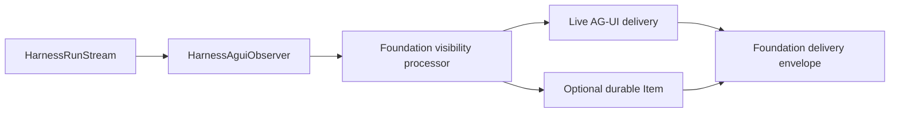
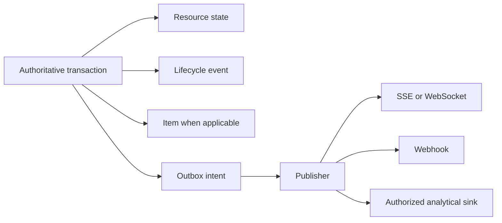

# Events, Interaction Projection, Usage, and Delivery

## Design Position

Foundation owns durable lifecycle events, optional retained interaction Items, delivery envelopes, usage ingestion, artifacts, and replay without turning transport or telemetry into execution authority. Authoritative state transitions and their outbox intents commit together; publishers and subscribers can retry independently.

Harness observations follow the accepted Agent Stream Protocol path. Foundation consumes `HarnessAguiObserver` output and does not implement another Harness-to-AG-UI mapping. A delivered AG-UI event can become a retained interaction projection only through an explicit Host commit; it never becomes a lifecycle fact merely because a subscriber received it.

## Record Layers

| Layer                | Meaning                                                         | Authority                                              |
| -------------------- | --------------------------------------------------------------- | ------------------------------------------------------ |
| Harness source event | Process-local public observation from one Harness Run           | Harness observation only                               |
| AG-UI event          | `HarnessAguiObserver` conversion after optional Host processing | Presentation observation only                          |
| Item                 | User-visible semantic unit within a Turn                        | Durable interaction record when Foundation persists it |
| Lifecycle event      | Fact that a Foundation resource transition committed            | Durable audit and publication fact                     |
| Delivery envelope    | Multiplexed transport record identifying one source class       | Delivery and replay only                               |

Messages, reasoning units permitted by visibility policy, tool calls, commands, file changes, approvals, child activity, plans, errors, and artifacts can become Items. Heartbeats, token fragments, provider-native frames, credentials, private state, arbitrary logs, and unbounded payloads do not automatically become Items.

## Harness Observation Path



One observer belongs to one Harness Run and is consumed by its current worker. The optional Foundation Host processor applies authorization, redaction, visibility, and stable Item projection policy without changing upstream event meaning. Observer accumulation is process-local; Foundation owns any persisted source history, replay cursor, gap, and replay-to-live cutover.

A live-only envelope is explicitly labeled as such. If the same semantic content later commits as an Item, delivery uses the durable Item identity and marks it as retained. It does not silently reuse a transient observer event ID as the Item or lifecycle-event ID.

## Durable Lifecycle Events and Outbox

Every authoritative Session, Thread, Turn, Execution, ExecutionAttempt, checkpoint, pending action, child relationship, Environment operation, cancellation, or reconciliation transition writes a bounded typed lifecycle event in the same transaction. An outbox entry records publication work for that event.



Lifecycle event ordering is monotonic within its owning resource stream, not a global total order. Duplicate publication preserves one event identity. Event content references Items and artifacts rather than copying their large or differently retained payloads.

## Delivery Envelope and Replay

Foundation multiplexes lifecycle and interaction delivery through a common outer envelope with an explicit source kind:

```python
class FoundationDeliveryEnvelope:
    delivery_id: DeliveryId
    source_kind: Literal[
        "lifecycle_event",
        "retained_item",
        "retained_agui_projection",
        "live_agui_observation",
    ]
    source_id: str
    session_id: SessionId | None
    thread_id: ThreadId | None
    turn_id: TurnId | None
    execution_id: ExecutionId | None
    sequence: int
    payload: BoundedSafePayload
```

The schema is conceptual. A cursor is opaque, scoped to authorization, filters, and retention generation, and grants no authority. Reconnect replays retained sources and reports an explicit gap when history expired. It never reconstructs missing Harness continuation from Items, AG-UI data, or lifecycle events.

Streaming routes finish authentication and initial database reads before constructing a response. They use fresh short sessions for later reads and release subscriptions in `finally`. Disconnect never cancels an Execution.

## Durable Usage Ingestion

The Harness owns native `RunUsage`, the run-local attribution ledger, immutable `UsageRecord` values, and bounded `usage_report` delivery. Foundation ingests immutable `UsageRecord` values idempotently by `record_id` and adds durable attribution:

- Workspace and optional Session, Thread, and Turn;
- Execution and originating ExecutionAttempt;
- Harness Run and Agent revision;
- model/provider identity, measures, and pricing coverage from the record.

A `usage_report` ID is a delivery identity, not another usage fact. Reports can overlap through retries or chunk delivery. `HarnessRunResult.usage_records` is a complete detached run-local snapshot and can overlap records already delivered incrementally. Foundation deduplicates all paths by the immutable `record_id` and rejects conflicting content for the same identity.

Terminal `RunUsage` is an aggregate process-local snapshot used for limits and summary display. Foundation does not sum it with UsageRecords, inline-child snapshots, or later resumed-run snapshots. Durable attribution, pricing, budgets, and billing operate from immutable records.

### Late Usage from a Stale Attempt

Attempt fencing prevents a stale worker from changing lifecycle state. It does not erase usage already incurred before lease loss. Foundation can ingest a late immutable UsageRecord under the original ExecutionAttempt identity when its stable record identity and canonical content validate.

Late ingestion:

- cannot create or complete an Item, checkpoint, pending action, or lifecycle transition;
- cannot change Execution or Attempt outcome;
- preserves the stale Attempt attribution and ingestion timestamp;
- remains idempotent by `record_id`;
- can be supplemented by separately identified provider evidence during reconciliation.

This exception prevents lease loss from silently dropping billable usage without weakening lifecycle fencing.

Raw usage, aggregation, pricing revision, budget enforcement, invoice generation, and payment remain separate facts. Changing current prices never rewrites retained raw usage or the pricing revision already applied.

## Artifacts and Large Content

Large model, tool, command, file, or child outputs use object storage only after bounded staging, digest verification, metadata authorization, and database selection. Object keys, file paths, digests, and signed URLs grant no product authority by possession.

Metadata selection and object publication are separate failure points. Unselected uploads are cleanup candidates; selected missing objects fail explicitly. Display data and artifacts never substitute for a checkpoint.

## Observability

OpenTelemetry traces and metrics correlate safe service role, build, Session, Thread, Turn, Execution, Attempt, Harness Run, and provider identities. They omit credentials, authorization headers, plaintext Secrets, raw prompts, model output, tool payloads, and uploaded content by default.

Telemetry is best effort. Its loss cannot erase durable audit, lifecycle, Item, or usage facts, and its presence cannot prove commitment.

## Failure Semantics

| Failure                                            | Outcome                                                                    |
| -------------------------------------------------- | -------------------------------------------------------------------------- |
| State transaction rolls back                       | Associated lifecycle event, Item, and outbox intent do not exist           |
| Outbox publisher crashes after delivery            | Same source identity can be delivered again                                |
| Client disconnects                                 | Execution continues according to durable state                             |
| Replay range expires                               | Client receives an explicit gap and current authorized state               |
| Observer or live delivery fails                    | No lifecycle fact is invented; retained sources remain authoritative       |
| Usage report repeats or overlaps terminal snapshot | `record_id` deduplication prevents double counting                         |
| Stale Attempt supplies valid late usage            | Usage is attributed and retained without lifecycle mutation                |
| Same usage identity has different content          | Ingestion fails closed and emits a security diagnostic                     |
| Object upload and metadata commit diverge          | Cleanup or explicit artifact read failure preserves the selected authority |
| Pricing unavailable                                | Raw usage remains durable; pricing and billing wait independently          |

## Invariants

1. Harness observations, AG-UI events, Items, lifecycle events, and delivery envelopes remain distinct.
2. Foundation uses `HarnessAguiObserver` and does not own a second Harness-to-AG-UI vocabulary.
3. Authoritative transition, lifecycle event, and outbox intent commit together.
4. Delivery and client receipt never define Execution completion.
5. Items, replay, AG-UI data, and lifecycle events never become Harness continuation state.
6. Usage is ingested idempotently by immutable UsageRecord identity, not report or aggregate identity.
7. Late stale-Attempt usage cannot change lifecycle state.
8. Artifact references and signed delivery URLs grant no product authority.
9. Telemetry observes the system and never acts as durable lifecycle authority.
