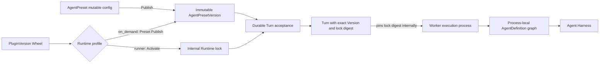

# Agent Management

## Design Position

Foundation exposes `AgentPreset` as the stable Workspace-owned resource for Agent authoring, authorization, lifecycle, and invocation. An `AgentPreset` contains one mutable complete `config`; Publish snapshots that config into an immutable executable `AgentPresetVersion` and atomically makes the new Version active. Foundation does not persist a separate product `Agent` or `AgentRevision`.

A Turn selects one exact `AgentPresetVersion` at durable acceptance. A worker reconstructs process-local Harness `AgentDefinition`, `SubagentDefinition`, `ExecutableAgent`, and plugin objects from that Version. Those Python values are never management resources or durable payloads.

Foundation also owns the deployment-level catalog for trusted Harness Plugin Wheels. Every deployment fixes one Plugin Runtime profile. In the default `on_demand` profile, a Preset selects exact PluginVersions and Workers import compatible artifacts on demand. In the `runner` profile, a Preset selects stable plugin keys and explicit deployment-wide activation chooses the executable PluginVersions. Runtime locks, process-local loaded registries, and Runner processes are internal execution facts rather than management resources.



## Boundaries

| Concern                                                                                   | Owner                                                                                                            | Relationship                                                               |
| ----------------------------------------------------------------------------------------- | ---------------------------------------------------------------------------------------------------------------- | -------------------------------------------------------------------------- |
| Preset identity, config, Versions, lifecycle, Publish, Rollback, and Duplicate            | This document                                                                                                    | Defines the durable Agent management model                                 |
| Plugin identities, Versions, lifecycle, selection, and runner-profile activation commands | This document                                                                                                    | Defines the managed trusted-code product surface                           |
| Wheel validation, Runtime locks, on-demand loading, and Runner switching                  | [Harness Plugin Runtime Loading](26-harness-plugin-artifacts-and-runtime-loading.md)                             | Makes trusted Python extensions available without another product resource |
| Plugin factories, configured instances, ordering, middleware, and Capability contribution | [Harness Plugin System](../agent-harness/05-plugin-system.md)                                                    | Builds concrete process-local plugins from an explicitly selected catalog  |
| Agent execution, state, and process-local subagent graph                                  | Agent Harness                                                                                                    | Receives reconstructed definitions and fresh run bindings                  |
| Turn acceptance, pinning, recovery, and lineage                                           | [Interactions and Turns](13-interactions-turns-and-attempts.md) and [Durable Turn State](14-turn-persistence.md) | Persist the exact selected Version and never re-resolve the mutable Preset |
| Agent input wire, canonicalization, and adapter mapping                                   | [Agent Input](33-agent-input.md)                                                                                 | AgentPresetConfig stores adapter configuration and each Version freezes it |
| Product authorization and executable-code administration                                  | [Foundation IAM](10-identity-and-access-management.md)                                                           | Separates Preset authoring from deployment code authority                  |
| Secret values and run-time eligibility                                                    | [Secret Management](11-secret-management.md)                                                                     | Versions store requirements and references, never plaintext values         |
| Public HTTP paths and common mutation behavior                                            | [Management API](21-management-api.md) and [Platform API Conventions](../api-conventions.md)                     | Expose the resources and commands defined here                             |

`PluginRuntime` is the Worker/Harness Python runtime. It is not an Agent `Environment`: it contains Python, Harness, Pydantic AI, Plugin Wheels, third-party distributions, and an immutable dependency lock; it contains no Prompt, Secret value, Turn state, Agent work files, shell workspace, browser, or Environment resource.

## AgentPreset Resource Model

An `AgentPreset` is the complete user-visible Agent configuration identity:

```python
type AgentPresetSource = Literal["builtin", "custom"]
type AgentPresetLifecycleState = Literal[
    "enabled",
    "disabled",
    "archived",
]


class AgentPreset:
    id: str
    organization_id: str
    workspace_id: str
    source: AgentPresetSource
    name: str
    description: str | None
    lifecycle_state: AgentPresetLifecycleState
    resource_version: int
    config: AgentPresetConfig
    active_version_id: str | None
    config_base_version_id: str | None
    duplicated_from_preset_id: str | None
    duplicated_from_version_id: str | None
    created_by: PrincipalRef | SystemActorRef
    created_at: datetime
    updated_at: datetime
```

`config` is a complete, mutable authoring document. It is not named Draft and is not independently addressable. Saving it changes neither `active_version_id` nor running behavior. `resource_version` is the optimistic concurrency token for mutable Preset state; it is distinct from a published Version number, configuration schema version, package version, and content digest.

`config_base_version_id` records the active Version whose content last matched `config`. `has_unpublished_changes` is a derived comparison between the normalized config and the active Version content; it is not a second validation state.

A custom Preset is created as `enabled` with no active Version. Its complete config is editable immediately, but root invocation fails with `preset_not_published` until the first Publish. An enabled Preset with an active Version is callable.

## AgentPresetConfig

`AgentPresetConfig` is finite Foundation-owned serializable data. It contains the complete behavior needed to publish an executable Version, including:

- instructions and the typed output declaration;
- one exact `model_id` plus concrete Harness `HarnessModelCharacteristics` and native `ModelSettings`;
- Capability, Tool, Skill, Connector, and Environment declarations or exact managed-resource references;
- bounded public protocol metadata, schemas, visibility, client-tool policy, and limits;
- non-secret Secret requirements;
- bounded trusted-adapter keys and configuration;
- the Harness Plugin Configuration Document and, in `on_demand`, exact PluginVersion bindings; and
- named subagent edges to stable child Preset IDs with Harness context policy and usage ceilings.

The config contains no Python class, import target, callable, native Model, Toolset, Capability instance, plugin object, client, credential, plaintext Secret, Environment attachment, runtime mount, `EnvironmentRuntime`, live controller, arbitrary artifact URL, or process-local value. A request cannot carry a broad `config_override`. Per-Turn input, fresh `RunBindings`, and typed execution options can narrow execution or satisfy declared requirements, but cannot replace the model, instructions, output schema, tools, Capabilities, plugins, dependency set, Environment provider contract, or security ceiling.

Saving config performs only request-schema structure, type, size, and bounds validation. Foundation exposes no independent Validate resource, preview state, warning collection, or partially valid config lifecycle. Publish is the sole authoritative resolve-and-build validation path.

The config stores one exact trusted input adapter key and bounded configuration.
Publish validates them against the selected Plugin Runtime profile and freezes
them inside the AgentPresetVersion. The Version carries no declaration of
allowed input block types, media types, sources, deliveries, or per-input limits;
every Version accepts the common [`AgentInput`](33-agent-input.md) wire contract.
Turn acceptance validates and canonicalizes that input, and the Worker verifies
the pinned Runtime lock before invoking the adapter. A replacement TurnAttempt
reuses the same Version, adapter configuration, accepted input, and Runtime lock.

## Protocol Configuration

Every `AgentPresetConfig` embeds one finite `protocol` configuration. It is
Preset-owned authoring data rather than an independently addressable resource,
and it has no separate lifecycle, API, enable switch, or content digest:

```python
class ProtocolConfig:
    schema_version: Literal["1"]
    public_name: str
    public_description: str | None
    output_modes: tuple[str, ...]
    input_data_schema: JsonObject | None
    state_schema: JsonObject | None
    context_schema: JsonObject | None
    client_tools: tuple[ClientToolPolicy, ...]
    event_visibility: tuple[str, ...]
    a2a_skills: tuple[A2ASkillProjection, ...]
    extended_agent_card: ExtendedAgentCardPolicy | None
    limits: ProtocolLimits
```

The bounded nested types are Foundation-owned serializable values. Publish
validates JSON Schemas, public metadata, MIME modes, event names, client-tool
policies, A2A projections, and per-protocol limits against finite registries and
deployment hard ceilings. Configuration can narrow a permitted surface but
cannot expose raw reasoning, credentials, private execution identities,
unregistered events, arbitrary code, or a capability that the deployment does
not support.

`input_data_schema`, when present, is the self-contained JSON Schema Draft
2020-12 contract projected for `AgentInput.structured_content`. Publish validates
and freezes it. Turn acceptance applies it only when `structured_content` is
non-null; absent structured content is always valid. The schema does not restrict
text or binary blocks, media types, sources, or deliveries.

Safe defaults impose no structured-content schema, expose bounded text output
and the standard Run, text, and client-visible tool event families, accept no
client tools, require empty state and context, generate a minimal public-safe A2A
Agent Card, and expose no extended Card. Native and Hosted AG-UI remain available
for every callable Preset. The deployment-wide `gateway.a2a_enabled` setting is
the only A2A availability switch; ProtocolConfig does not enable or disable a
protocol.

Publish copies the normalized ProtocolConfig into the immutable
`AgentPresetVersion`, whose `content_digest` already covers the complete config.
Hosted AG-UI Run and A2A Task acceptance persist the exact
`agent_preset_version_id`; retry, feedback, recovery, and replay therefore use
the same protocol configuration without storing a redundant protocol digest.
Publishing another Version changes Cards and acceptance policy only for later
work. Continuation additionally follows the state and input compatibility rules
of the selected Version.

## Immutable AgentPresetVersion

Publish creates this immutable resource:

```python
class ResolvedSubagentEdge:
    name: str
    child_preset_id: str
    child_preset_version_id: str
    description: str | None
    context: JsonObject
    usage_limits: JsonObject


class ResolvedPluginVersion:
    plugin_id: str
    plugin_version_id: str
    plugin_key: str
    distribution_name: str
    distribution_version: str
    top_level_package: str
    wheel_digest: str


class AgentPresetVersion:
    id: str
    organization_id: str
    workspace_id: str
    agent_preset_id: str
    version_number: int
    plugin_runtime_mode: Literal["on_demand", "runner"]
    config: AgentPresetConfig
    resolved_plugin_versions: tuple[ResolvedPluginVersion, ...]
    runtime_lock_digest: str | None
    resolved_subagents: tuple[ResolvedSubagentEdge, ...]
    content_digest: str
    source_version_id: str | None
    created_by: PrincipalRef | SystemActorRef
    created_at: datetime
```

`version_number` starts at one and increases monotonically within one Preset. It is never reused and is not a CAS token. `content_digest` covers the normalized immutable Version representation, including exact managed-resource and subagent Version references. `source_version_id` records Rollback or Duplicate provenance without creating inheritance.

A Version is complete and executable but carries no mutable lifecycle state. It cannot be patched, archived independently, deleted, overwritten, or replaced. Historical Versions remain readable while their Preset and referencing Turn records are retained.

`plugin_runtime_mode` records the deployment profile under which Publish interpreted the config. In `on_demand`, `resolved_plugin_versions` contains the exact identity, plugin key, distribution identity, top-level package, and Wheel digest for every enabled PluginVersion in the resolved subagent graph and participates in `content_digest`; `runtime_lock_digest` names the immutable lock produced by Publish. In `runner`, the tuple is empty and the lock field is null because the deployment-wide active lock supplies exact distribution selection at Turn acceptance. Worker, Harness, and Foundation service versions remain deployment compatibility facts rather than Preset artifacts.

## Publish and Rollback

Publish synchronously performs the authoritative reconstruction preflight and then atomically:

1. verifies authorization and the Preset `resource_version`;
2. resolves exact managed-resource revisions and each child Preset's current active Version;
3. verifies the finite acyclic subagent graph, profile-specific Plugin selection, plugin factory configuration, ordering, requirements, schemas, and reconstruction compatibility;
4. allocates the next `version_number` and creates the complete immutable Version;
5. updates `active_version_id` and `config_base_version_id` to that Version; and
6. increments `resource_version` and records the audit and outbox facts.

Resolution and process-local build preflight occur outside an open database transaction. The final short transaction rechecks the mutable Preset, selected references, profile-specific Plugin evidence, and concurrency evidence before committing all durable facts. A failure creates no Version, changes no active pointer, and does not rewrite config.

In `on_demand`, Publish requires one exact `plugin_version_id` binding for every enabled plugin key, copies the verified PluginVersion locks into the Version, and verifies that each pure-Python Wheel's declared dependencies are already satisfied by the Worker release. It never resolves `latest` or accesses a package index. In `runner`, Publish accepts no PluginVersion binding and requires every enabled stable plugin key to be present in the deployment's active Plugin catalog. The final transaction rechecks exact PluginVersion identities in `on_demand` and the active Plugin set in `runner`.

Publish always activates its newly created Version. There is no published-but-inactive Preset Version state or separate Preset Activate command. Publishing or rolling back a disabled Preset changes its active Version but does not enable it.

Rollback takes an exact historical `source_version_id`, revalidates that content under current rules, copies it into a new monotonically increasing Version, and atomically activates the new Version. It never moves `active_version_id` backward. If mutable config differs from the current active Version, Rollback fails with `config_has_unpublished_changes`; it has no force option that silently discards edits. On success, config and `config_base_version_id` match the newly created Version.

## Built-in Presets and Duplicate

Every Foundation distribution includes built-in Presets that are immediately executable after registration. A distribution release manifest owns their stable identities and content. In `on_demand`, it supplies exact built-in PluginVersion bindings; in `runner`, it supplies stable plugin keys whose built-in Versions are present in the active catalog. Repeated registration of unchanged content is idempotent; changed manifest content creates the next Version and atomically makes it active. Built-in Presets are read-only to users: they cannot edit config, Publish, Rollback, or Archive them.

Duplicate is the customization boundary for either a built-in or custom Preset. In one atomic operation it:

1. reads the source Preset's exact active Version;
2. creates a new independent custom Preset with copied config;
3. creates its immutable Version 1 with identical content;
4. activates Version 1 and enables the new Preset; and
5. records source Preset and Version provenance.

The duplicate is immediately callable and never follows, overlays, or automatically merges later source changes. A source without an active Version or an archived source cannot be duplicated.

## Preset Lifecycle

Lifecycle and active Version selection are independent:

- `enabled` permits new root invocation when an active Version exists;
- `disabled` preserves config and the active pointer, blocks new root, Trigger, and Schedule acceptance, and still permits config editing, Publish, and Rollback;
- `archived` is read-only, hidden from default collections, and blocks invocation, enablement, config mutation, Publish, Rollback, Duplicate, and selection by newly authored subagent edges.

Enable revalidates the active Version, its exact on-demand PluginVersion locks or the runner active Plugin set, and the complete transitive subagent graph. A Preset without an active Version cannot be enabled for invocation. Disable does not cancel or rewrite accepted Turns. Disable fails with `preset_in_use` while an enabled Preset's active transitive graph references the target; accepted historical Turns do not add another lifecycle block.

Only a disabled custom Preset can be archived. Unarchive changes it to `disabled` and never activates or enables it. Built-in Presets cannot be archived. Neither Presets nor Preset Versions expose hard delete.

## Subagent Composition

A parent config declares each named child edge with a stable child `preset_id`. Parent Publish resolves and stores the exact active `child_preset_version_id`. It rejects a missing, unpublished, disabled, or archived child, duplicate sibling name, incompatible edge policy, unbuildable dependency, or any structural cycle.

Publishing a child later does not change an existing parent Version. The parent adopts the new child behavior only after another parent Publish. An active parent Version may internally execute its pinned historical child Version; this is part of the already published parent graph and is not public non-active Version selection.

The worker recursively reconstructs the exact finite graph into Harness
`SubagentDefinition` and `SubagentCollection` values. Root and child definitions
use the same Harness build and plugin contracts. An asynchronous hosted child
receives its own Thread, Turn, TurnAttempts, fresh `RunBindings`, Environment
attachments, runtime mounts, `EnvironmentRuntime`, exact child Version, and
compatible Runtime lock under [Async Subagents](18-async-subagents.md); an inline
child remains process-local Harness execution.

## Turn Selection and Reconstruction

New root invocation supplies `agent_preset_id` and may supply
`agent_preset_version_id` only as an optimistic active-Version precondition.
Durable acceptance:

1. authorizes the stable Preset resource;
2. requires `lifecycle_state=enabled` and a non-null active Version;
3. requires any supplied `agent_preset_version_id` to equal that active Version;
4. resolves the immutable Preset-owned Runtime lock in `on_demand`, or atomically reads the active deployment Runtime lock in `runner`; and
5. persists `agent_preset_id`, exact `agent_preset_version_id`, and internal `runtime_lock_digest` on the Turn and its initial state envelope.

A caller cannot start new work from a non-active Version. A mismatch returns
`preset_version_not_active`. Trigger and Schedule definitions store only
`agent_preset_id`; each firing resolves the current active Version during its own
Turn acceptance. Long-lived automation that must retain different behavior uses a
duplicated Preset.

Retry, resume after worker loss, waiting feedback lineage, and already accepted asynchronous child work use the Version pinned by their owning Turn or published parent graph. They never resolve mutable config, `active`, or `latest` again. A new continuation Turn may select the then-active Version only when its state compatibility contract accepts the sealed parent state; otherwise the caller creates a fork without implied state migration.

For each TurnAttempt, the Worker:

1. reads the exact Preset Version graph selected by the Turn;
2. verifies and materializes the Turn's exact `runtime_lock_digest` under the [runtime-loading contract](26-harness-plugin-artifacts-and-runtime-loading.md);
3. records that lock digest, Harness version, and bounded selected Plugin distribution identities on the attempt;
4. resolves current credentials, RoleBindings, run grants, Secret eligibility, provider availability, and fresh Environment attachments;
5. adapts those attachments into runtime mounts, constructs one `EnvironmentRuntime`, and reconstructs concrete `HarnessModelCharacteristics`, native `ModelSettings`, fresh native Models, Capabilities, plugins, `AgentDefinition` values, and `RunBindings`; and
6. enters the Harness only after the current TurnAttempt fence authorizes effects.

Deployment code can change between TurnAttempts, but one accepted Turn never silently changes Plugin code or dependencies. Retry, waiting resume, and worker-loss recovery reconstruct the Runtime lock pinned by that Turn. In `on_demand`, a Worker with a conflicting process-local import set declines the Turn before claim; in `runner`, a matching lock-scoped Runner claims it. Current credentials, authorization, Secret eligibility, provider availability, and Environment attachment authority remain fresh per TurnAttempt; each Attempt constructs fresh `RunBindings`, attachments, runtime mounts, and `EnvironmentRuntime`.

## Harness Plugin Configuration

An Agent config embeds the exact Harness-owned Plugin Configuration Document:

```yaml
plugin_configuration:
  schema_version: "1"
  plugins:
    - plugin_id: audit-primary
      plugin_key: acme.audit
      enabled: true
      configuration:
        mode: metadata
```

The ordered entries, unique instance IDs, stable keys, enable flags, and finite JSON configuration retain the meanings defined by the Harness. Several instances may use one key. Foundation neither stores an arbitrary import target nor defines another raw Capability upload format. A Plugin factory can contribute ordinary Pydantic AI Capabilities through `get_capabilities()`.

`on_demand` adds one Foundation-owned `plugin_version_bindings` map outside the Harness document. Each enabled `plugin_key` has exactly one `plugin_version_id`, several configured instances of the same key share that binding, and disabled entries require no binding. `runner` rejects this map because exact selection belongs to deployment activation.

## Plugin Artifact Model

A `Plugin` is one stable deployment-level trusted-code identity. A `PluginVersion` is one immutable standard Python Wheel:

```python
type PluginSource = Literal["builtin", "uploaded"]
type PluginLifecycleState = Literal["available", "archived"]


class Plugin:
    id: str
    source: PluginSource
    plugin_key: str
    distribution_name: str
    top_level_package: str
    active_version_id: str | None
    lifecycle_state: PluginLifecycleState


class PluginVersion:
    id: str
    plugin_id: str
    version: str
    content_digest: str
    artifact_ref: str
    requires_dist: tuple[str, ...]
    status: Literal["ready"]
```

Upload accepts exactly one `.whl`, reads rather than trusts its filename,
validates distribution metadata and requirement syntax, computes the full-byte
digest, and requires exactly one `a13n_harness.plugins` entry point and one unique
top-level Python package. The entry-point name establishes or matches the stable
`plugin_key`. The first successful upload atomically creates the stable Plugin
and its first PluginVersion; later uploads target that Plugin. A Plugin's
canonical normalized distribution name and top-level package are established by
its first successful upload and remain fixed.

`PluginVersion.version` is the normalized PEP 440 `Version` from Wheel metadata. `(plugin_id, version)` is unique. Re-uploading the same version and digest returns the existing Version; the same version with different bytes fails with `plugin_version_conflict`. Upload validates and persists the immutable artifact but neither resolves dependencies nor changes the runtime.

`active_version_id` is meaningful only in `runner`; it remains null in `on_demand`, where exact Preset bindings select Versions without a global deployment head. Upload never changes it in either profile.

Foundation does not accept a raw `.py` file, custom ZIP, direct URL, Git/VCS reference, local path, arbitrary remote Wheel reference, raw Capability class, or Wheel containing several Harness Plugin factories. Plugin code runs with Worker authority in the on-demand Worker interpreter or a runner child; neither profile sandboxes Python or creates a remote-plugin security boundary.

The immutable Wheel and locked dependency artifacts live in authoritative shared object storage or an operator-managed persistent volume. A Worker materializes each content-addressed Runtime lock into a new immutable local directory and verifies every hash before importing on demand or starting a Runner. A container writable layer or one Worker's local directory is never the sole retained artifact source; another Worker or replacement container can rebuild the same Plugin artifacts from retained authority.

Built-in and uploaded Plugins share the same keys, Versions, Preset configuration, and runtime behavior. A release manifest registers built-in identity, exact package version, digest, and whether the Plugin is required or administratively deactivatable. Built-in keys are reserved; uploaded artifacts cannot replace them. Built-in Plugins cannot be uploaded or archived.

Plugin upload and runner-profile deployment operations require executable-code administration authority. In the singleton-Organization OSS distribution, effective Organization Admin authority supplies that permission. A multi-Organization distribution supplies a separate operator boundary and never lets an ordinary tenant Organization Admin change shared code. Preset editors can configure allowed plugin keys; in `on_demand` they can bind authorized PluginVersions while publishing, but cannot Upload or Archive them. They cannot Activate or Deactivate the `runner` catalog.

## Profile-specific Dependency Selection

In `on_demand`, the selected PluginVersion must be a pure-Python Wheel whose `Requires-Python` and every `Requires-Dist` declaration are satisfied by the reviewed Worker release. Worker, Publish, and Turn claim perform no package-index access, installation, or dependency solving. A Plugin can keep private implementation modules beneath its unique top-level package, but cannot introduce another top-level distribution or collide with a top-level package owned by the Worker release. An absent dependency fails with `preset_publish_failed` reason `plugin_worker_dependency_missing` and creates no Preset Version.

In `runner`, Activate jointly resolves all active PluginVersions plus the candidate from their Wheel `Requires-Dist`. It produces an immutable Runtime lock containing the exact normalized distribution versions, artifact identities, and hashes. Resolution uses only operator-configured public or private package indexes. Workers do not access indexes or solve dependencies while claiming Turns.

The current lock is the preferred solution: an activation changes only distributions required by new constraints. Re-activating the already active Version is idempotent and reuses the active lock without index access. Activating a historical immutable PluginVersion is the explicit rollback path for that Plugin; Foundation exposes no separate Runtime rollback or dependency-refresh command.

Platform-owned distributions, including Foundation, Harness, and Pydantic AI, are fixed by the deployment image. Plugin resolution cannot upgrade or downgrade them. Incompatible requirements fail with `plugin_platform_incompatible`; an unsatisfiable joint Plugin set fails activation.

One deployment has exactly one homogeneous Runtime target identified by Python implementation and minor version, operating system, CPU architecture, and Wheel ABI. Every ready Worker matches it. Universal Wheels are eligible; a missing matching Plugin or dependency artifact fails on-demand Publish or runner Activate with `plugin_runtime_incompatible`. Upload can retain an artifact that the selected profile cannot execute.

## Runner-profile Runtime Commands

Activate and Deactivate generate a candidate internal Runtime lock and use the [Worker Runner staging contract](26-harness-plugin-artifacts-and-runtime-loading.md). The active Plugin pointers and active lock digest change only after every currently serviceable Worker has successfully started the candidate Runtime. Failure leaves the previous Plugin selection and lock active.

Activate also reconstructs every enabled Preset's active transitive Version graph that uses the target key against the candidate catalog. A PluginVersion that changes factory configuration compatibility cannot become active while those Presets remain enabled; the command fails before cutover rather than deferring the error to a new Turn.

These commands exist only in `runner`. In `on_demand`, the same stable HTTP routes return `409 plugin_runtime_mode_unsupported`; there is no global activation, deactivation, task receipt, maintenance window, or implicit Worker mutation.

The commands never reload Python modules or restart the Worker container. Each candidate lock starts in a clean Runner process while the old Runner continues serving. At atomic cutover, the old Runner stops claiming new work and drains only attempts it already owns. Later commands may create another candidate while older Runners drain when capacity permits; insufficient capacity fails the new command without interrupting existing attempts.

Draining an owned Attempt uses the common graceful TurnAttempt handoff rather than changing its pinned Runtime. The old Runner keeps heartbeat and lease renewal active until a complete safe checkpoint and `yielded` transaction commit, another authoritative outcome wins, or the applicable drain deadline arrives. A successor creates a fresh Harness Run from the same state and exact historical Runtime lock; activation never substitutes the new active lock into an already accepted Turn.

Activating a historical PluginVersion changes only new Turn acceptance after the ordinary cutover; it does not move accepted Turns to another lock. A Runner crash after cutover is recovered from the same active lock and never causes an implicit rollback.

These commands return a minimal asynchronous receipt rather than a Plugin Runtime or Operation management resource:

```python
type PluginTaskStatus = Literal["running", "succeeded", "failed"]


class PluginTaskReceipt:
    operation_id: str
    status: PluginTaskStatus
    result_refs: tuple[ResourceRef, ...]
    error: SafeFailure | None
```

The accepted command returns `202` with `operation_id` and `running`. `GET /api/v1/operations/{operation_id}` returns only a receipt previously obtained by the
authorized caller. A running receipt has empty results and no error; a failed
receipt has one bounded safe error and no results; a succeeded receipt has no
error and identifies its resulting Plugin and active Version resources when
applicable. There is no Operation collection, Patch, Delete, dependency graph, or
independently mutable lifecycle. Every command requires `Idempotency-Key`;
retrying the same command returns the same receipt identity.

## Plugin Lifecycle and Retention

In `runner`, Deactivate fails with `plugin_in_use` when the key appears anywhere in an enabled Preset's active transitive Version graph. It does not cascade, rewrite Presets, or cancel Turns. Non-terminal Turns do not block Deactivate because their pinned Runtime locks remain reconstructible. Mutable configs and historical non-active Versions also do not block deactivation, but a config referencing an inactive key cannot Publish or Enable.

Successful runner-profile Deactivate publishes a catalog without the key and clears `active_version_id`; it does not mutate any PluginVersion. In `on_demand`, no Deactivate exists; Archive blocks Upload and new Preset binding but retained Preset Versions and Turns continue using exact locks. Only an inactive uploaded Plugin can be archived. Archive hides it from default management collections and also blocks runner-profile Activate. Unarchive restores an inactive manageable Plugin and does not activate a Version.

Plugin, PluginVersion, successful Wheel artifact, runner task receipt evidence, and every Runtime lock referenced by an accepted Turn are retained and expose no hard-delete or Version-overwrite operation. A Runner may exit after its attempts drain, and an on-demand Worker registry disappears at process exit. Worker-local materialization may be evicted when unused; authoritative artifacts remain reconstructible. Failed upload creates no PluginVersion.

## Agent Management API Contract

The AgentPreset `/api/v1` routes are cataloged by [Management API](21-management-api.md). AgentPreset commands are synchronous and return their committed result:

```python
class AgentPresetPublishResult:
    preset: AgentPreset
    version: AgentPresetVersion
```

| Operation                           | Request fields                                                 | Result                                                  |
| ----------------------------------- | -------------------------------------------------------------- | ------------------------------------------------------- |
| Create                              | `name`, optional `description`, complete `config`              | `201` with the complete unpublished custom Preset       |
| Patch metadata                      | `expected_resource_version`, optional `name` and `description` | `200` with the complete Preset                          |
| Replace config                      | `expected_resource_version`, complete `config`                 | `200` with the complete Preset                          |
| Publish                             | `expected_resource_version`                                    | `200` with the complete Preset and new complete Version |
| Rollback                            | `expected_resource_version`, `source_version_id`               | `200` with the complete Preset and new complete Version |
| Duplicate                           | `expected_resource_version`, `name`, optional `description`    | `201` with the complete new Preset                      |
| Enable, Disable, Archive, Unarchive | `expected_resource_version`                                    | `200` with the complete Preset                          |

Create and every command require `Idempotency-Key`. Clients cannot write `source`, `lifecycle_state`, `active_version_id`, `version_number`, Version content, or server audit fields. Preset Versions support only List and Get.

Preset List and Get use the same complete representation, including the mutable config. Version List and Get likewise use the same complete immutable representation, including config, digest, exact references, and audit fields. Both collections use opaque cursor pagination. Version List defaults to descending `version_number` with a stable ID tie-breaker.

Plugin Upload creates or returns an immutable Version synchronously. Runner-profile Activate and Deactivate return the minimal asynchronous receipt defined here because completion depends on artifact resolution and every serviceable Worker. They never report `succeeded` before atomic runtime cutover. `on_demand` exposes no successful runtime command.

## Compatibility

The canonical Foundation v1 resources are `AgentPreset` and `AgentPresetVersion`. Foundation does not expose parallel `/presets`, `/agents`, `/agents/{id}/revisions`, `Agent`, or `AgentRevision` aliases with overlapping meaning. Durable Turn and state schemas use `agent_preset_id` and `agent_preset_version_id` directly. A distribution importing data from another product translates that data before it enters this contract; the accepted Foundation model does not preserve a mutable behavior override or a second Agent identity.

Plugin Runtime mode is part of AgentPresetVersion compatibility. An on-demand config with exact PluginVersion bindings is not reinterpreted as a runner config with stable-key activation, or vice versa. The deployment rejects a mode mismatch rather than migrating mutable config or immutable Versions implicitly.

## Failure Semantics

AgentPreset operations use this bounded domain code set:

| Code                             | Meaning                                                                 |
| -------------------------------- | ----------------------------------------------------------------------- |
| `preset_not_found`               | Preset is absent or concealed                                           |
| `preset_version_not_found`       | Version is absent, concealed, or does not belong to the required Preset |
| `preset_not_published`           | No active Version exists                                                |
| `preset_disabled`                | New root work is blocked                                                |
| `preset_archived`                | The requested operation is unavailable for an archived Preset           |
| `preset_in_use`                  | A lifecycle mutation would invalidate an enabled published graph        |
| `preset_version_not_active`      | Invocation precondition does not match the active Version               |
| `config_has_unpublished_changes` | Rollback would discard mutable config edits                             |
| `preset_publish_failed`          | Resolve-and-build validation failed before commit                       |
| `preset_state_conflict`          | The requested lifecycle transition is not legal                         |

`preset_publish_failed` can include only a bounded safe `reason` and config field path. Schema, authorization, concurrent mutation, and idempotency reuse continue to use `validation_error`, `forbidden`, `resource_version_conflict`, and `idempotency_conflict`.

Plugin operations additionally use bounded artifact, dependency, runtime compatibility, reference, activation, and state-conflict errors. They never return raw package-index responses, Wheel contents, configuration values, import traceback, private filesystem paths, or arbitrary exception text.

## Trade-offs

### Preset as the Stable Resource

Using one stable Preset plus immutable Versions removes the otherwise overlapping Agent, Preset, and AgentRevision identities and matches the product's authoring language. It requires the contract to state explicitly that a Preset is complete Agent configuration rather than a partial template.

### Publish as Immediate Activation

Publish keeps the normal path simple and guarantees that the newest published Version is the active Version. It does not provide a published-but-not-active staging state; validation occurs through the same complete construction path before atomic commit.

### Shared PluginRuntime

`on_demand` preserves the smallest Worker process model and exact per-Preset Plugin selection, but a process that already imported a conflicting Version cannot serve that Turn. A single-Worker deployment therefore provides no finite scheduling guarantee across conflicting locks and may require external Worker replacement.

`runner` keeps one deployment-wide active Plugin set and permits arbitrary compatible lock changes without in-process reload or Worker-container restart. It accepts the cost of temporarily running several Runner processes while attempts pinned to older locks drain, and all active Plugins must still have one jointly solvable dependency set.

### Trusted In-process Plugins

Wheel and entry-point constraints give deterministic packaging and loading, not isolation. This keeps the open-source Worker architecture small while making Plugin administration equivalent to trusted Worker code deployment.

## Invariants

01. `AgentPreset` is the only durable Agent authoring, authorization, lifecycle, and invocation resource; Foundation persists no product `Agent` or `AgentRevision`.
02. Mutable config never executes. Publish alone creates and activates an immutable `AgentPresetVersion`.
03. Every accepted Turn pins one exact Preset Version and never resolves mutable config or `latest` during claim, retry, waiting, or recovery.
04. Public invocation cannot select a non-active Version; a pinned parent graph may use its exact historical child Versions.
05. Version content contains only serializable Foundation data and exact references, never Python objects, credentials, Secret values, arbitrary import targets, or Plugin artifacts.
06. Current credentials, authorization, Secret eligibility, provider availability, `RunBindings`, Environment attachments, runtime mounts, and `EnvironmentRuntime` are resolved or constructed freshly for every TurnAttempt.
07. Preset lifecycle changes never rewrite Versions or accepted Turns.
08. Plugin selection is explicit: on-demand Preset Versions bind exact authorized PluginVersions, runner Presets require the active catalog, and package presence alone enables nothing.
09. Plugin code executes with Worker authority in either the on-demand Worker interpreter or a Runner; every accepted Turn internally pins one exact Runtime lock digest, and every TurnAttempt records the lock it used.
10. `on_demand` Preset Versions bind exact PluginVersions and never resolve `latest`; `runner` Preset Versions use stable keys and Turn acceptance pins the active deployment lock.
11. Runtime commands succeed only in `runner`; `on_demand` conflicts remain eligible before claim and are never silently substituted.
12. No AgentPreset or Plugin Version is mutated, overwritten, or exposed through hard delete.
13. ProtocolConfig is Preset-owned authoring data frozen by AgentPresetVersion; it is not another resource, digest, or per-Preset protocol switch.
