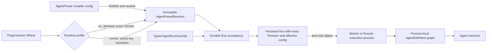

# Agent Management

## Design Position

Foundation exposes `AgentPreset` as the stable Workspace-owned resource for Agent authoring, authorization, lifecycle, and invocation. An `AgentPreset` contains one mutable complete `config`; Publish resolves that config into an immutable executable `AgentPresetRevision` and atomically makes the new Revision active. Foundation does not persist a separate product `Agent` or `AgentRevision`.

A Run selects one exact `AgentPresetRevision` at durable acceptance. A Worker reconstructs process-local Harness `AgentDefinition`, `SubagentDefinition`, `ExecutableAgent`, and Plugin objects from the Revision's frozen effective configuration. Those Python values are never management resources or durable payloads.

Foundation also owns the deployment-level catalog for trusted Harness Plugin Wheels. Every deployment fixes one Plugin Runtime profile. In the default `on_demand` profile, mutable Presets select exact PluginVersions and Workers import compatible artifacts on demand. In the `runner` profile, mutable Presets select stable Plugin keys and deployment-wide activation determines which PluginVersion each key resolves to. Publish freezes exact PluginVersions and one exact Runtime lock into the resulting Revision in both profiles. Runtime locks, process-local loaded registries, and Runner processes are internal execution facts rather than management resources.



## Boundaries

| Concern                                                                                              | Owner                                                                                                        | Relationship                                                                |
| ---------------------------------------------------------------------------------------------------- | ------------------------------------------------------------------------------------------------------------ | --------------------------------------------------------------------------- |
| Preset identity, config, Revisions, lifecycle, Publish, Rollback, Duplicate, and typed Run overrides | This document                                                                                                | Defines the durable Agent management model                                  |
| Plugin identities, Versions, lifecycle, selection, and runner-profile activation commands            | This document                                                                                                | Defines the managed trusted-code product surface                            |
| Wheel validation, Runtime locks, on-demand loading, and Runner switching                             | [Harness Plugin Runtime Loading](26-harness-plugin-artifacts-and-runtime-loading.md)                         | Makes trusted Python extensions available without another product resource  |
| Plugin factories, configured instances, ordering, middleware, and Capability contribution            | [Harness Plugin System](../agent-harness/05-plugin-system.md)                                                | Builds concrete process-local plugins from an explicitly selected catalog   |
| Agent execution, state, and process-local subagent graph                                             | Agent Harness                                                                                                | Receives reconstructed definitions and fresh run bindings                   |
| Run acceptance, persistence, recovery, and lineage                                                   | [Interactions and Runs](13-interactions-runs-and-attempts.md) and [Durable Run State](14-run-persistence.md) | Persist the exact selected Revision and effective config                    |
| Agent input wire, canonicalization, and adapter mapping                                              | [Agent Input](33-agent-input.md)                                                                             | AgentPresetConfig stores adapter configuration and each Revision freezes it |
| Product authorization and executable-code administration                                             | [Foundation IAM](10-identity-and-access-management.md)                                                       | Separates Preset authoring from deployment code authority                   |
| Secret values and run-time eligibility                                                               | [Secret Management](11-secret-management.md)                                                                 | Revisions store requirements and references, never plaintext values         |
| Public HTTP paths and common mutation behavior                                                       | [Management API](21-management-api.md) and [Platform API Conventions](../api-conventions.md)                 | Expose the resources and commands defined here                              |

`PluginRuntime` is the Worker/Harness Python runtime. It is not an Agent `Environment`: it contains Python, Harness, Pydantic AI, Plugin Wheels, third-party distributions, and an immutable dependency lock; it contains no Prompt, Secret value, Run state, Agent work files, shell workspace, browser, or Environment resource.

## AgentPreset Resource Model

An `AgentPreset` is the complete user-visible Agent configuration identity:

```python
type AgentPresetSource = Literal["builtin", "custom"]
type AgentPresetLifecycleState = Literal[
    "enabled",
    "disabled",
    "archived",
]


class AgentPreset:
    id: str
    organization_id: str
    workspace_id: str
    source: AgentPresetSource
    name: str
    description: str | None
    lifecycle_state: AgentPresetLifecycleState
    resource_version: int
    config: AgentPresetConfig
    active_revision_id: str | None
    config_base_revision_id: str | None
    duplicated_from_preset_id: str | None
    duplicated_from_revision_id: str | None
    created_by: PrincipalRef | SystemActorRef
    created_at: datetime
    updated_at: datetime
```

`config` is a complete, mutable authoring document. It is not named Draft and is not independently addressable. Saving it changes neither `active_revision_id` nor running behavior. `resource_version` is the optimistic concurrency token for mutable Preset state; it is distinct from a published Revision number, configuration schema version, package version, and content digest.

`config_base_revision_id` records the active Revision whose authoring content last matched `config`. `has_unpublished_changes` is a derived comparison between normalized config and the active Revision's authoring content; it is not a second validation state.

A custom Preset is created as `enabled` with no active Revision. Its complete config is editable immediately, but root invocation fails with `preset_not_published` until the first Publish. An enabled Preset with an active Revision is callable.

## AgentPresetConfig

`AgentPresetConfig` is finite Foundation-owned serializable data. The following conceptual types define its public domain boundary; referenced resource schemas remain owned by their management documents:

```python
class AgentModelConfig:
    model_config_id: ModelConfigId
    settings: ModelSettings
    characteristics: HarnessModelCharacteristics


class OnDemandPluginSelection:
    instance_name: str
    plugin_version_id: PluginVersionId
    config: JsonObject


class RunnerPluginSelection:
    instance_name: str
    plugin_key: str
    config: JsonObject


class SkillSelection:
    skill_revision_id: SkillRevisionId


class ConnectorSelection:
    connector_revision_id: ConnectorRevisionId
    connection_id: ConnectionId | None
    tools: tuple[str, ...] | None


class EnvironmentSelection:
    environment_revision_id: EnvironmentRevisionId


class ChildEnvironmentPolicy:
    mode: Literal["none", "shared_root", "dedicated"]


class SubagentSelection:
    agent_preset_id: AgentPresetId
    revision: int | None
    description: str | None
    context: DelegationContextPolicy
    usage_limits: UsageLimits | None
    environment: ChildEnvironmentPolicy


class OutputVariant:
    name: str
    description: str | None
    schema: JsonSchema
    resources: dict[str, JsonSchema]

class OutputSpec:
    name: str | None
    description: str | None
    schema: JsonSchema | None
    resources: dict[str, JsonSchema]
    variants: tuple[OutputVariant, ...] | None


class RetryConfig:
    tools: int
    output: int


class InputAdapterConfig:
    adapter_key: str
    config: JsonObject


class AssetPublicationConfig:
    enabled: Literal[True]


class ProtocolConfig:
    schema_version: Literal["1"]
    public_name: str
    public_description: str | None
    output_modes: tuple[str, ...]
    input_data_schema: JsonObject | None
    state_schema: JsonObject | None
    context_schema: JsonObject | None
    client_tools: tuple[ClientToolPolicy, ...]
    event_visibility: tuple[str, ...]
    a2a_skills: tuple[A2ASkillProjection, ...]
    extended_agent_card: ExtendedAgentCardPolicy | None
    limits: ProtocolLimits


class AgentPresetConfig:
    model: AgentModelConfig
    instructions: str
    input_adapter: InputAdapterConfig
    plugins: tuple[OnDemandPluginSelection | RunnerPluginSelection, ...]
    skills: tuple[SkillSelection, ...]
    connectors: dict[str, ConnectorSelection]
    environment: EnvironmentSelection | None
    subagents: dict[str, SubagentSelection]
    client_tools: tuple[ClientToolDefinition, ...]
    output_spec: OutputSpec | None
    retries: RetryConfig | None
    secret_requirements: tuple[SecretRequirement, ...]
    asset_publication: AssetPublicationConfig | None
    protocol: ProtocolConfig
```

The deployment's fixed Plugin Runtime profile determines which Plugin selection variant is legal. `instructions` is the Agent's stable system prompt; Foundation- and Harness-generated runtime context is not stored in this field. `skills` selects exact Skill Revisions rather than a mutable catalog plus defaults. `environment` selects at most one primary exact EnvironmentRevision. Connector and subagent map keys are stable local names within the Agent. Each child edge freezes Harness delegation context, usage ceilings, and its Host Environment association policy. `client_tools` stores only serializable declarations; executable handlers and callbacks remain SDK-local.

`OutputSpec` permits either one top-level `schema` with optional local `resources`, or at least two mutually exclusive `variants`; it never permits nested variants or runtime retrieval of schema resources. `None` means free-text output. `RetryConfig` contains bounded non-negative tool-argument and structured-output model-correction budgets. It does not configure provider transport retry, Worker recovery, whole-Run retry, or business-workflow retry.

The config contains no Python class, import target, callable, native Model, Toolset, Capability instance, Plugin object, client, credential value, plaintext Secret, Environment adapter, current Environment state, entered facade, live controller, arbitrary artifact URL, or process-local value. Python extension code is selected only through `plugins`; Harness Capabilities, Hooks, and Toolsets are constructed internally after importing the selected Wheel and are not Agent Management resources or generic fields. `asset_publication` is the one dedicated platform Capability selection required by the [Asset publication contract](37-asset-management.md#agent-publication-capability), not an extensible Capability list.

Saving config performs only request-schema structure, type, size, and bounds validation. Foundation exposes no independent Validate resource, preview state, warning collection, or partially valid config lifecycle. Publish is the sole authoritative resolve-and-build validation path.

`input_adapter` selects one trusted adapter key and bounded configuration. Publish validates and freezes it inside the Revision. The Revision carries no declaration of allowed input block types, media types, sources, deliveries, or per-input limits; every Revision accepts the common [`AgentInput`](33-agent-input.md) wire contract. Run acceptance validates and canonicalizes that input, and the Worker verifies the pinned Runtime lock before invoking the adapter. A replacement execution attempt reuses the same Revision, adapter configuration, accepted input, and Runtime lock.

When `asset_publication` is present, the trusted Foundation `AssetCapability` exposes `publish_asset`. Each execution attempt binds only its current authorized Environment; the tool fails closed when no readable default binding can supply the selected path. Package presence or general Environment file access does not enable the tool, and the Capability adds no durable Capability-state schema.

## Protocol Configuration

Every `AgentPresetConfig` embeds one finite `protocol` configuration. It is Preset-owned authoring data rather than an independently addressable resource, and it has no separate lifecycle, API, enable switch, or content digest.

The bounded nested types are Foundation-owned serializable values. Publish validates JSON Schemas, public metadata, MIME modes, event names, client-tool policies, A2A projections, and per-protocol limits against finite registries and deployment hard ceilings. Configuration can narrow a permitted surface but cannot expose raw reasoning, credentials, private execution identities, unregistered events, arbitrary code, or a capability that the deployment does not support.

`input_data_schema`, when present, is the self-contained JSON Schema Draft 2020-12 contract projected for `AgentInput.structured_content`. Publish validates and freezes it. Run acceptance applies it only when `structured_content` is non-null; absent structured content is always valid. The schema does not restrict text or binary blocks, media types, sources, or deliveries.

Safe defaults impose no structured-content schema, expose bounded text output and the standard Run, text, and client-visible tool event families, accept no protocol client tools, require empty state and context, generate a minimal public-safe A2A Agent Card, and expose no extended Card. Native and Hosted AG-UI remain available for every callable Preset. The deployment-wide `gateway.a2a_enabled` setting is the only A2A availability switch; ProtocolConfig does not enable or disable a protocol.

Publish freezes normalized ProtocolConfig in the immutable Revision, whose `content_digest` covers the complete config. Hosted AG-UI Run and A2A Task acceptance persist the exact `agent_preset_revision_id`; retry, feedback, recovery, and replay therefore use the same protocol configuration without storing a redundant protocol digest. Publishing another Revision changes Cards and acceptance policy only for later work. Continuation additionally follows the state and input compatibility rules of the selected Revision.

## AgentRunOverride and Effective Configuration

One Run request may carry a finite typed `config_override`. It is request data, not a management resource, and has no identity or lifecycle:

```python
class InlineEnvironmentSelection:
    provider: EnvironmentProviderSpec
    credential_bindings: tuple[EnvironmentCredentialBinding, ...]
    access: EnvironmentAccess = "full"


type EnvironmentOverride = EnvironmentSelection | InlineEnvironmentSelection


class ModelOverride:
    model_config_id: ModelConfigId | None
    settings: ModelSettings | None
    characteristics: HarnessModelCharacteristics | None


class ConnectorOverride:
    connector_revision_id: ConnectorRevisionId | None
    connection_id: ConnectionId | None
    tools: tuple[str, ...] | None
    headers: dict[str, SensitiveString] | None


class SubagentOverride:
    agent_preset_id: AgentPresetId | None
    revision: int | None
    description: str | None
    context: DelegationContextPolicy | None
    usage_limits: UsageLimits | None
    environment: ChildEnvironmentPolicy | None


class RetryOverride:
    tools: int | None
    output: int | None


class AgentRunOverride:
    model: ModelOverride | None
    instructions: str | None
    plugins: tuple[OnDemandPluginSelection | RunnerPluginSelection, ...] | None
    skills: tuple[SkillSelection, ...] | None
    connectors: dict[str, ConnectorOverride | None] | None
    environment: EnvironmentOverride | None
    subagents: dict[str, SubagentOverride | None] | None
    client_tools: tuple[ClientToolDefinition, ...] | None
    output_spec: OutputSpec | None
    retries: RetryOverride | None
```

The wire schema preserves the distinction between an absent field and an explicit null. Top-level absence inherits the selected Revision. Scalar and string fields replace; an empty `instructions` string clears the base prompt. List fields replace as a whole and `[]` clears. `output_spec` replaces as a whole and explicit null selects free text. `environment` replaces the one primary Environment and explicit null clears it. `retries` patches only its explicitly present children, and zero disables the corresponding correction retry.

`connectors` and `subagents` are name-keyed patches. An absent map inherits, an explicit null clears all entries, and `{}` changes nothing. A new name adds an entry, an existing object changes only explicitly present typed fields, and a name mapped to null deletes that entry. Connector changes use one public shape whether they replace a Connection binding, ConnectorRevision, or tool allowlist. Subagent entries may select only managed Presets; inline child Agent definitions are not accepted.

`ConnectorOverride.headers` is available only when the selected trusted Provider's typed override schema declares runtime headers. Header names are bounded and schema-validated; every value is sensitive and is extracted into the encrypted Run payload. It is not a generic Provider-config dictionary and cannot add undeclared credential paths.

An `on_demand` Plugin override selects exact PluginVersion IDs. A `runner` Plugin override selects stable Plugin keys, which acceptance resolves through the active deployment catalog. The final list always resolves to exact PluginVersions and one Runtime lock before acceptance commits.

The caller may select resources it is currently authorized to use even when they were not present in the base Revision. Every replacement remains subject to resource authorization, schema validation, deployment compatibility, and platform security ceilings. Typed sensitive leaves may contain inline credential values; acceptance extracts them into a Run-owned encrypted payload and excludes them from ordinary config projections. No generic arbitrary-path secret bag is accepted.

The resolved non-secret result has this conceptual shape:

```python
class EffectiveAgentConfig:
    schema_version: str
    model: ResolvedAgentModelConfig
    instructions: str
    input_adapter: InputAdapterConfig
    plugins: tuple[ResolvedPluginVersion, ...]
    runtime_lock_digest: str
    skills: tuple[ResolvedSkillSelection, ...]
    connectors: tuple[ResolvedConnectorSelection, ...]
    environment: EnvironmentExecutionConfig | None
    subagents: tuple[ResolvedSubagentEdge, ...]
    client_tools: tuple[ClientToolDefinition, ...]
    output_spec: OutputSpec | None
    retries: RetryConfig | None
    secret_requirements: tuple[SecretRequirement, ...]
    asset_publication: AssetPublicationConfig | None
    protocol: ProtocolConfig
    content_digest: str
```

The resolved types are defined with `AgentPresetRevision` below and use the same exact reconstruction facts. The digest covers the complete normalized snapshot and excludes only sensitive plaintext, which has a separately protected digest in acceptance idempotency evidence.

The SDK may store one local default override on an Agent Handle and merge it with a one-Run override before submission. Foundation receives only the resulting `config_override`, does not persist the SDK merge layers, and never inherits an override from a previous Run or Thread. Input, attachments, timeout, usage budget, metadata, priority, idempotency, and scheduling mode remain Run fields rather than Agent config overrides.

Acceptance merges and resolves the selected Revision and request exactly once, then persists a complete immutable `EffectiveAgentConfig` plus its digest. It does not retain a separately addressable normalized Override. Retry, resume, deferred-action completion, and Worker replacement reconstruct from that exact effective snapshot and never re-read mutable Preset config or reapply merge rules. Serializable client-tool declarations are part of the snapshot; their actual callable handlers remain with the SDK, and a missing handler is surfaced through the durable Action Required contract.

## Immutable AgentPresetRevision

Publish creates this immutable resource:

```python
class ResolvedSubagentEdge:
    name: str
    child_agent_preset_id: AgentPresetId
    child_agent_preset_revision_id: AgentPresetRevisionId
    description: str | None
    context: DelegationContextPolicy
    usage_limits: UsageLimits | None
    environment: ChildEnvironmentPolicy


class ResolvedAgentModelConfig:
    execution: ModelExecutionSnapshot
    settings: ModelSettings
    characteristics: HarnessModelCharacteristics


class ResolvedPluginVersion:
    instance_name: str
    plugin_id: str
    plugin_version_id: str
    plugin_key: str
    distribution_name: str
    distribution_version: str
    top_level_package: str
    wheel_digest: str
    config: JsonObject


class ResolvedSkillSelection:
    skill_revision_id: SkillRevisionId
    skill_name: str
    content_digest: str


class ResolvedConnectorSelection:
    name: str
    connector_revision_id: ConnectorRevisionId
    connection_id: ConnectionId | None
    tools: tuple[FrozenConnectorTool, ...]
    provider_lock: ConnectorProviderContractLock
    sensitive_binding_keys: tuple[str, ...]


class AgentPresetRevision:
    id: str
    organization_id: str
    workspace_id: str
    agent_preset_id: str
    revision_number: int
    plugin_runtime_mode: Literal["on_demand", "runner"]
    config: AgentPresetConfig
    resolved_model: ResolvedAgentModelConfig
    resolved_plugin_versions: tuple[ResolvedPluginVersion, ...]
    runtime_lock_digest: str
    resolved_skills: tuple[ResolvedSkillSelection, ...]
    resolved_connectors: tuple[ResolvedConnectorSelection, ...]
    resolved_environment: EnvironmentExecutionConfig | None
    resolved_subagents: tuple[ResolvedSubagentEdge, ...]
    content_digest: str
    source_revision_id: str | None
    created_by: PrincipalRef | SystemActorRef
    created_at: datetime
```

`revision_number` starts at one and increases monotonically within one Preset. It is never reused and is not a CAS token. `content_digest` covers the normalized immutable Revision representation, including every resolved snapshot, lock, exact managed-resource reference, and subagent Revision. `source_revision_id` records Rollback or Duplicate provenance without creating inheritance.

A Revision is complete and executable but carries no mutable lifecycle state. It cannot be patched, archived independently, deleted, overwritten, or replaced. Historical Revisions remain readable while their Preset and referencing Run records are retained.

`plugin_runtime_mode` records the deployment profile under which Publish interpreted the config. In both profiles, `resolved_plugin_versions` contains every configured instance and its exact PluginVersion, artifact identity, and configuration; `runtime_lock_digest` names the exact immutable lock produced or selected by Publish. In `runner`, Publish resolves every configured `plugin_key` through the deployment's then-active catalog. Later Activate commands never rewrite either field. Worker, Harness, and Foundation service versions remain deployment compatibility facts rather than Preset artifacts.

The other `resolved_*` fields freeze the non-secret Model execution snapshot, exact Skill content and materialization facts, Connector tool contracts and Provider locks, the optional primary Environment lock, and the complete exact child Revision graph. Secret values, current authorization, and live Provider availability are deliberately not frozen. This separation makes the Revision independently reconstructible without turning credentials or mutable operational eligibility into published content.

## Publish and Rollback

Publish synchronously performs the authoritative reconstruction preflight and then atomically:

1. verifies authorization and the Preset `resource_version`;
2. resolves the non-secret Model snapshot, exact managed-resource revisions, PluginVersions, and each unpinned child Preset's current active Revision;
3. verifies the finite acyclic subagent graph, profile-specific Plugin selection, plugin factory configuration, ordering, requirements, schemas, and reconstruction compatibility;
4. allocates the next `revision_number` and creates the complete immutable Revision;
5. updates `active_revision_id` and `config_base_revision_id` to that Revision; and
6. increments `resource_version` and records the audit and outbox facts.

Resolution and process-local build preflight occur outside an open database transaction. The final short transaction rechecks the mutable Preset, selected references, profile-specific Plugin evidence, and concurrency evidence before committing all durable facts. A failure creates no Revision, changes no active pointer, and does not rewrite config.

In `on_demand`, Publish requires one exact `plugin_version_id` for every Plugin instance, copies the verified PluginVersion facts into the Revision, and verifies that each pure-Python Wheel's declared dependencies are already satisfied by the Worker release. It never resolves `latest` or accesses a package index. In `runner`, Publish accepts one stable `plugin_key` per root instance and resolves it through the deployment's active Plugin catalog. Foundation then composes one exact lock for the complete resolved root and child graph from those exact Versions and retained lock evidence; incompatible Version or dependency combinations fail Publish. The final transaction rechecks the exact selected Versions and lock evidence in either profile so a concurrent Activate cannot produce mixed content.

Publish always activates its newly created Revision. There is no published-but-inactive Preset Revision state or separate Preset Activate command. Publishing or rolling back a disabled Preset changes its active Revision but does not enable it.

Rollback takes an exact historical `source_revision_id`, revalidates that content under current rules, copies it into a new monotonically increasing Revision, and atomically activates the new Revision. It never moves `active_revision_id` backward. If mutable config differs from the current active Revision, Rollback fails with `config_has_unpublished_changes`; it has no force option that silently discards edits. On success, config and `config_base_revision_id` match the newly created Revision. Rollback reuses the source's exact PluginVersions and Runtime lock; it never resolves runner Plugin keys through the current active catalog.

## Built-in Presets and Duplicate

Every Foundation distribution includes built-in Presets that are immediately executable after registration. A distribution release manifest owns their stable identities and content. In `on_demand`, it supplies exact built-in PluginVersion selections; in `runner`, it supplies stable Plugin keys whose built-in Versions are present in the active catalog. Registration resolves and freezes exact Versions under the ordinary Publish rules. Repeated registration of unchanged resolved content is idempotent; changed content creates the next Revision and atomically makes it active. Built-in Presets are read-only to users: they cannot edit config, Publish, Rollback, or Archive them.

Duplicate is the customization boundary for either a built-in or custom Preset. In one atomic operation it:

1. reads the source Preset's exact active Revision;
2. creates a new independent custom Preset with copied config;
3. creates its immutable Revision 1 with identical resolved content;
4. activates Revision 1 and enables the new Preset; and
5. records source Preset and Revision provenance.

The duplicate is immediately callable and never follows, overlays, or automatically merges later source changes. A source without an active Revision or an archived source cannot be duplicated.

## Preset Lifecycle

Lifecycle and active Revision selection are independent:

- `enabled` permits new root invocation when an active Revision exists;
- `disabled` preserves config and the active pointer, blocks new root, Trigger, and Schedule acceptance, and still permits config editing, Publish, and Rollback;
- `archived` is read-only, hidden from default collections, and blocks invocation, enablement, config mutation, Publish, Rollback, Duplicate, and selection by newly authored subagent edges.

Enable revalidates the active Revision's retained exact dependencies and complete transitive subagent graph. It does not reinterpret that Revision through the current runner active catalog. A Preset without an active Revision cannot be enabled for invocation. Disable does not cancel or rewrite accepted Runs. Disable fails with `preset_in_use` while an enabled Preset's active transitive graph references the target; accepted historical Runs do not add another lifecycle block.

Only a disabled custom Preset can be archived. Unarchive changes it to `disabled` and never activates or enables it. Built-in Presets cannot be archived. Neither Presets nor Preset Revisions expose hard delete.

## Subagent Composition

A parent config declares each named child edge with a stable child `agent_preset_id`, optional child-local `revision` number, Harness context and usage policy, and one explicit Host Environment policy. Parent Publish resolves an omitted selector to the child's active Revision and stores one exact `child_agent_preset_revision_id`. It rejects a missing, unpublished, disabled, archived, unauthorized, unretained, or unexecutable child, duplicate sibling name, excessive graph size or depth, incompatible Environment policy, unbuildable dependency, or any structural cycle. A `shared_root` edge requires the child and root to freeze the same Provider configuration and lock with no wider child access; `dedicated` uses the child's frozen configuration with new Host state; `none` requires the child not to require an Environment.

Publishing a child later does not change an existing parent Revision. The parent adopts the new child behavior only after another parent Publish. A parent Revision may execute its pinned historical child Revision; exact historical selection is also available to authorized root Runs as described below.

The Worker recursively reconstructs the exact finite graph into Harness `SubagentDefinition` and `SubagentCollection` values. Root and child definitions use the same Harness build and Plugin contracts. A Run Override may patch the managed child roster by stable local name; acceptance recursively resolves and freezes the complete resulting graph before work starts. An asynchronous hosted child receives its own Thread, Run, RunAttempts, fresh `RunBindings`, fresh Environment adapters selected through its frozen Host association policy, the already selected exact child Revision, and a compatible Runtime lock under [Async Subagents](18-async-subagents.md). An inline child remains process-local Harness execution and borrows the active Environment facade. The first version does not accept inline child Agent definitions in Preset configuration or Run overrides.

## Run Selection and Reconstruction

A new root Run always supplies `agent_preset_id`. Omission of `agent_preset_revision_id` selects the active Revision; supplying it selects that exact Revision even when it is historical. SDKs may expose the Preset-local `revision_number` as a convenience but resolve it to the globally unique Revision ID at the wire boundary. An optional `expected_active_revision_id` is a separate optimistic precondition and never doubles as the exact selector.

Durable acceptance:

1. authorizes invocation of the stable Preset and use of every selected managed resource;
2. requires `lifecycle_state=enabled` and, for active selection, a non-null active Revision;
3. validates that an exact Revision belongs to the Preset, remains retained and executable, and satisfies current authorization and compatibility requirements;
4. applies the typed `config_override`, resolves every final resource selection and any runner Plugin key, and validates the complete finite subagent graph;
5. freezes the complete non-secret `EffectiveAgentConfig`, its digest, any encrypted Run-owned sensitive payload, and one exact Runtime lock; and
6. persists `agent_preset_id`, exact `agent_preset_revision_id`, selector kind, effective-config digest, and internal `runtime_lock_digest` on the accepted execution state.

Exact selection never falls back to the active Revision. A retained historical Revision may therefore start new work without duplicating its Preset, but disabling or archiving the stable Preset still blocks new root invocation. Trigger and Schedule definitions store only `agent_preset_id`, accept no config override in the first version, and resolve the current active Revision for each occurrence.

Retry, resume after Worker loss, waiting feedback lineage, and already accepted asynchronous child work use the exact Revision graph and `EffectiveAgentConfig` pinned by their owning Run. They never resolve mutable config, an active Revision, an active Plugin pointer, or an SDK Handle again. A new continuation Run follows the state-compatibility contract owned by the execution model; Agent Management does not imply state migration merely because another Revision is active.

For each execution attempt, the Worker or Runner:

1. reads the accepted Run's exact Revision graph and `EffectiveAgentConfig`;
2. verifies and materializes its exact `runtime_lock_digest` under the [runtime-loading contract](26-harness-plugin-artifacts-and-runtime-loading.md);
3. records that lock digest, Harness version, and bounded selected Plugin distribution identities on the attempt;
4. reauthorizes current credentials, RoleBindings, invocation grants, Secret eligibility, Provider availability, and current Host Environment state without changing the frozen non-secret configuration;
5. constructs the optional fresh primary Environment adapter and default Harness mount, reconstructs concrete `HarnessModelCharacteristics`, native `ModelSettings`, fresh native Models, definition-selected Capabilities, Plugins, `AgentDefinition` values, and `RunBindings`, then appends mandatory Foundation Worker infrastructure Capabilities such as the fenced inbox-delivery hook without changing the accepted model or tool surface; and
6. enters the Harness only after the current execution-attempt fence authorizes effects.

Deployment code can change between attempts, but one accepted Run never silently changes Plugin code, dependencies, managed-resource Revisions, child graph, tool surface, output contract, Environment desired configuration, or retry budgets. In `on_demand`, a Worker with a conflicting process-local import set declines the work before claim; in `runner`, a matching lock-scoped Runner claims it. Current credentials, authorization, Secret eligibility, Provider availability, and Host Environment state remain fresh per attempt; every attempt constructs fresh `RunBindings` and, when selected, one fresh Environment adapter.

## Harness Plugin Configuration

`AgentPresetConfig.plugins` is the one public Plugin configuration surface. Entries are ordered and use unique `instance_name` values. Several instances may select the same Plugin key or Version with different bounded JSON `config`; omission from the list means the Plugin is not configured. Foundation does not expose a second Capability list, enable-flag document, version-binding map, arbitrary import target, or raw Capability upload format.

In `on_demand`, each entry directly selects `plugin_version_id`. In `runner`, each entry selects `plugin_key`; Publish resolves the key to the currently active PluginVersion. Foundation supplies the resolved ordered instances to the Harness Plugin factory. A factory may contribute ordinary Pydantic AI Capabilities, Hooks, middleware, or Toolsets through the Harness interfaces, but those process-local products do not appear in Preset configuration or Run overrides.

## Plugin Artifact Model

A `Plugin` is one stable deployment-level trusted-code identity. A `PluginVersion` is one immutable standard Python Wheel:

```python
type PluginSource = Literal["builtin", "uploaded"]
type PluginLifecycleState = Literal["available", "archived"]


class Plugin:
    id: str
    source: PluginSource
    plugin_key: str
    distribution_name: str
    top_level_package: str
    active_version_id: str | None
    lifecycle_state: PluginLifecycleState


class PluginVersion:
    id: str
    plugin_id: str
    version: str
    content_digest: str
    artifact_ref: str
    requires_dist: tuple[str, ...]
    status: Literal["ready"]
```

Upload accepts exactly one `.whl`, reads rather than trusts its filename, validates distribution metadata and requirement syntax, computes the full-byte digest, and requires exactly one `a13n_harness.plugins` entry point and one unique top-level Python package. The entry-point name establishes or matches the stable `plugin_key`. The first successful upload atomically creates the stable Plugin and its first PluginVersion; later uploads target that Plugin. A Plugin's canonical normalized distribution name and top-level package are established by its first successful upload and remain fixed.

`PluginVersion.version` is the normalized PEP 440 `Version` from Wheel metadata. `(plugin_id, version)` is unique. Re-uploading the same version and digest returns the existing Version; the same version with different bytes fails with `plugin_version_conflict`. Upload validates and persists the immutable artifact but neither resolves dependencies nor changes the runtime.

`active_version_id` is meaningful only in `runner`; it remains null in `on_demand`, where exact Preset bindings select Versions without a global deployment head. Upload never changes it in either profile.

Foundation does not accept a raw `.py` file, custom ZIP, direct URL, Git/VCS reference, local path, arbitrary remote Wheel reference, raw Capability class, or Wheel containing several Harness Plugin factories. Plugin code runs with Worker authority in the on-demand Worker interpreter or a runner child; neither profile sandboxes Python or creates a remote-plugin security boundary.

The immutable Wheel and locked dependency artifacts live in authoritative shared object storage or an operator-managed persistent volume. A Worker materializes each content-addressed Runtime lock into a new immutable local directory and verifies every hash before importing on demand or starting a Runner. A container writable layer or one Worker's local directory is never the sole retained artifact source; another Worker or replacement container can rebuild the same Plugin artifacts from retained authority.

Built-in and uploaded Plugins share the same keys, Versions, Preset configuration, and runtime behavior. A release manifest registers built-in identity, exact package version, digest, and whether the Plugin is required or administratively deactivatable. Built-in keys are reserved; uploaded artifacts cannot replace them. Built-in Plugins cannot be uploaded or archived.

Plugin upload and runner-profile deployment operations require executable-code administration authority. In the singleton-Organization OSS distribution, effective Organization Admin authority supplies that permission. A multi-Organization distribution supplies a separate operator boundary and never lets an ordinary tenant Organization Admin change shared code. Preset editors can configure allowed plugin keys; in `on_demand` they can bind authorized PluginVersions while publishing, but cannot Upload or Archive them. They cannot Activate or Deactivate the `runner` catalog.

## Profile-specific Dependency Selection

In `on_demand`, the selected PluginVersion must be a pure-Python Wheel whose `Requires-Python` and every `Requires-Dist` declaration are satisfied by the reviewed Worker release. Worker, Publish, and Run claim perform no package-index access, installation, or dependency solving. A Plugin can keep private implementation modules beneath its unique top-level package, but cannot introduce another top-level distribution or collide with a top-level package owned by the Worker release. An absent dependency fails with `preset_publish_failed` reason `plugin_worker_dependency_missing` and creates no Preset Revision.

In `runner`, Activate jointly resolves all active PluginVersions plus the candidate from their Wheel `Requires-Dist`. It produces an immutable Runtime lock containing the exact normalized distribution versions, artifact identities, and hashes. Resolution uses only operator-configured public or private package indexes. Workers do not access indexes or solve dependencies while claiming Runs.

The current lock is the preferred solution: an activation changes only distributions required by new constraints. Re-activating the already active Version is idempotent and reuses the active lock without index access. Activating a historical immutable PluginVersion is the explicit rollback path for that Plugin; Foundation exposes no separate Runtime rollback or dependency-refresh command.

Platform-owned distributions, including Foundation, Harness, and Pydantic AI, are fixed by the deployment image. Plugin resolution cannot upgrade or downgrade them. Incompatible requirements fail with `plugin_platform_incompatible`; an unsatisfiable joint Plugin set fails activation.

One deployment has exactly one homogeneous Runtime target identified by Python implementation and minor version, operating system, CPU architecture, and Wheel ABI. Every ready Worker matches it. Universal Wheels are eligible; a missing matching Plugin or dependency artifact fails on-demand Publish or runner Activate with `plugin_runtime_incompatible`. Upload can retain an artifact that the selected profile cannot execute.

## Runner-profile Runtime Commands

Activate and Deactivate generate a candidate internal Runtime lock and use the [Worker Runner staging contract](26-harness-plugin-artifacts-and-runtime-loading.md). The active Plugin pointers and active lock digest change only after every currently serviceable Worker has successfully started the candidate Runtime. Failure leaves the previous Plugin selection and lock active.

Activate validates that the candidate active Plugin set can be resolved, materialized, imported, and started on every currently serviceable Worker. It does not rebuild enabled Presets against the candidate: their active and historical Revisions already own exact locks and remain unchanged. A future Preset Publish or runner Run Override that uses the newly active key performs its own Plugin config and complete Agent build validation and can fail without rolling back activation.

These commands exist only in `runner`. In `on_demand`, the same stable HTTP routes return `409 plugin_runtime_mode_unsupported`; there is no global activation, deactivation, task receipt, maintenance window, or implicit Worker mutation.

The commands never reload Python modules or restart the Worker container. Each candidate lock starts in a clean Runner process while older Runners continue serving. At atomic catalog cutover, the candidate Runner becomes available for newly resolved work. Older Runners continue claiming accepted Runs and new Runs whose selected historical Revision requires their exact locks; they are not limited to attempts already in progress. A Runner may exit when no eligible work needs its lock and the Supervisor can reconstruct it later. Later commands may create another candidate when capacity permits; insufficient capacity fails the new command without interrupting existing attempts.

Activating a historical PluginVersion changes resolution only for future runner Preset Publish and runner Plugin overrides accepted after cutover. It does not change any existing AgentPresetRevision, ordinary Run that inherits such a Revision, or already accepted Run. A Runner crash is recovered from the exact lock required by its work and never causes an implicit Version substitution.

When capacity policy retires a Runner that still owns work, it uses the common graceful attempt-handoff contract. The old Runner keeps heartbeat and lease renewal active until a complete safe checkpoint and `yielded` transaction commit, another authoritative outcome wins, or the applicable drain deadline arrives. A successor reconstructs the exact historical Runtime lock; retirement never substitutes the current active lock.

These commands return a minimal asynchronous receipt rather than a Plugin Runtime or Operation management resource:

```python
type PluginTaskStatus = Literal["running", "succeeded", "failed"]


class PluginTaskReceipt:
    operation_id: str
    status: PluginTaskStatus
    result_refs: tuple[ResourceRef, ...]
    error: SafeFailure | None
```

The accepted command returns `202` with `operation_id` and `running`. `GET /api/v1/operations/{operation_id}` returns only a receipt previously obtained by the authorized caller. A running receipt has empty results and no error; a failed receipt has one bounded safe error and no results; a succeeded receipt has no error and identifies its resulting Plugin and active Version resources when applicable. There is no Operation collection, Patch, Delete, dependency graph, or independently mutable lifecycle. Every command requires `Idempotency-Key`; retrying the same command returns the same receipt identity.

## Plugin Lifecycle and Retention

In `runner`, Deactivate removes a key only from future active-key resolution. It does not cascade, rewrite Presets, invalidate active or historical Revisions, or cancel Runs because every published Revision already retains an exact reconstructible lock. A mutable config that references the inactive key cannot Publish until the key is activated again or the config changes.

Successful runner-profile Deactivate publishes a catalog without the key and clears `active_version_id`; it does not mutate any PluginVersion. In `on_demand`, no Deactivate exists; Archive blocks Upload and new Preset selection but retained Preset Revisions and Runs continue using exact locks. Only an inactive uploaded Plugin can be archived. Archive hides it from default management collections and also blocks runner-profile Activate. Unarchive restores an inactive manageable Plugin and does not activate a Version.

Plugin, PluginVersion, successful Wheel artifact, runner task receipt evidence, and every Runtime lock referenced by an AgentPresetRevision or accepted Run are retained and expose no hard-delete or Version-overwrite operation. A Runner may exit when its lock is not needed by active attempts or queued eligible work, and an on-demand Worker registry disappears at process exit. Worker-local materialization may be evicted when unused; authoritative artifacts remain reconstructible. Failed upload creates no PluginVersion.

## Agent Management API Contract

The AgentPreset `/api/v1` routes are cataloged by [Management API](21-management-api.md). AgentPreset commands are synchronous and return their committed result:

Preset and Revision List or Get authorize `agent_preset.read`; Create authorizes
`agent_preset.create`; metadata or config replacement authorizes
`agent_preset.update`; Publish and Rollback authorize `agent_preset.publish`;
Enable, Disable, Archive, and Unarchive authorize `agent_preset.lifecycle`;
Duplicate authorizes `agent_preset.duplicate`; and new Run acceptance authorizes
`agent_preset.invoke`. Plugin reads authorize `plugin.read`; upload and archive
authorize `plugin.manage`; runner-profile Activate and Deactivate authorize
`plugin.runtime.manage`. The IAM
[stable action registry](10-identity-and-access-management.md#stable-action-registry)
owns their role grants. Publish additionally authorizes every referenced
Workspace resource action, such as `skill.bind` or `secrets.bind`, rather than
treating Preset update permission as ambient access.

```python
class AgentPresetPublishResult:
    preset: AgentPreset
    revision: AgentPresetRevision
```

| Operation                           | Request fields                                                 | Result                                                   |
| ----------------------------------- | -------------------------------------------------------------- | -------------------------------------------------------- |
| Create                              | `name`, optional `description`, complete `config`              | `201` with the complete unpublished custom Preset        |
| Patch metadata                      | `expected_resource_version`, optional `name` and `description` | `200` with the complete Preset                           |
| Replace config                      | `expected_resource_version`, complete `config`                 | `200` with the complete Preset                           |
| Publish                             | `expected_resource_version`                                    | `200` with the complete Preset and new complete Revision |
| Rollback                            | `expected_resource_version`, `source_revision_id`              | `200` with the complete Preset and new complete Revision |
| Duplicate                           | `expected_resource_version`, `name`, optional `description`    | `201` with the complete new Preset                       |
| Enable, Disable, Archive, Unarchive | `expected_resource_version`                                    | `200` with the complete Preset                           |

Create and every command require `Idempotency-Key`. Clients cannot write `source`, `lifecycle_state`, `active_revision_id`, `revision_number`, Revision content, or server audit fields. Preset Revisions support only List and Get.

Preset List and Get use the same complete representation, including the mutable config. Revision List and Get likewise use the same complete immutable representation, including config, resolved snapshots, digests, exact references, and audit fields. Both collections use opaque cursor pagination. Revision List defaults to descending `revision_number` with a stable ID tie-breaker.

Plugin Upload creates or returns an immutable Version synchronously. Runner-profile Activate and Deactivate return the minimal asynchronous receipt defined here because completion depends on artifact resolution and every serviceable Worker. They never report `succeeded` before atomic runtime cutover. `on_demand` exposes no successful runtime command.

## Compatibility

The canonical Foundation v1 resources are `AgentPreset` and `AgentPresetRevision`. Foundation does not expose parallel `/presets`, `/agents`, `/agents/{id}/revisions`, `Agent`, or `AgentRevision` aliases with overlapping meaning. Durable Run and state schemas use `agent_preset_id` and `agent_preset_revision_id` directly. `AgentRunOverride` is accepted request data and `EffectiveAgentConfig` is a Run-owned snapshot; neither creates a second Agent identity. A distribution importing data from another product translates that data before it enters this contract.

Plugin Runtime mode is part of AgentPresetRevision compatibility. An on-demand config with exact PluginVersion selections is not reinterpreted as a runner config with stable-key activation, or vice versa. The deployment rejects a mode mismatch rather than migrating mutable config or immutable Revisions implicitly.

## Failure Semantics

AgentPreset operations use this bounded domain code set:

| Code                             | Meaning                                                                  |
| -------------------------------- | ------------------------------------------------------------------------ |
| `preset_not_found`               | Preset is absent or concealed                                            |
| `preset_revision_not_found`      | Revision is absent, concealed, or does not belong to the required Preset |
| `preset_not_published`           | No active Revision exists                                                |
| `preset_disabled`                | New root work is blocked                                                 |
| `preset_archived`                | The requested operation is unavailable for an archived Preset            |
| `preset_in_use`                  | A lifecycle mutation would invalidate an enabled published graph         |
| `preset_revision_not_executable` | The exact retained Revision cannot currently be executed                 |
| `active_revision_conflict`       | `expected_active_revision_id` does not match the active Revision         |
| `config_has_unpublished_changes` | Rollback would discard mutable config edits                              |
| `preset_publish_failed`          | Resolve-and-build validation failed before commit                        |
| `preset_state_conflict`          | The requested lifecycle transition is not legal                          |

`preset_publish_failed` can include only a bounded safe `reason` and config field path. Schema, authorization, concurrent mutation, and idempotency reuse continue to use `validation_error`, `forbidden`, `resource_version_conflict`, and `idempotency_conflict`.

Plugin operations additionally use bounded artifact, dependency, runtime compatibility, reference, activation, and state-conflict errors. They never return raw package-index responses, Wheel contents, configuration values, import traceback, private filesystem paths, or arbitrary exception text.

## Trade-offs

### Preset as the Stable Resource

Using one stable Preset plus immutable Revisions removes the otherwise overlapping Agent, Preset, and AgentRevision identities and matches the product's authoring language. It requires the contract to state explicitly that a Preset is complete Agent configuration rather than a partial template.

### Publish as Immediate Activation

Publish keeps the normal path simple and guarantees that the newest published Revision is the active Revision. It does not provide a published-but-not-active staging state; validation occurs through the same complete construction path before atomic commit.

### Typed Run Overrides

A finite typed override lets an SDK bind application-specific Model, Plugin, Skill, Connector, Environment, subagent, client-tool, output, and correction behavior without creating another managed Agent resource. Persisting only the resolved effective snapshot simplifies recovery but deliberately does not preserve a reversible audit of which SDK layer supplied each field.

### Shared PluginRuntime

`on_demand` preserves the smallest Worker process model and exact per-Preset Plugin selection, but a process that already imported a conflicting Version cannot serve that Run. A single-Worker deployment therefore provides no finite scheduling guarantee across conflicting locks and may require external Worker replacement.

`runner` keeps one deployment-wide active Plugin set for future key resolution and permits compatible lock changes without in-process reload or Worker-container restart. Published Revisions remain exact, so Supervisors may need to reconstruct and retain several historical lock-scoped Runner processes. All active Plugins must still have one jointly solvable dependency set.

### Trusted In-process Plugins

Wheel and entry-point constraints give deterministic packaging and loading, not isolation. This keeps the open-source Worker architecture small while making Plugin administration equivalent to trusted Worker code deployment.

## Invariants

01. `AgentPreset` is the only durable Agent authoring, authorization, lifecycle, and invocation resource; Foundation persists no product `Agent` or `AgentRevision`.
02. Mutable config never executes. Publish alone creates and activates an immutable `AgentPresetRevision`.
03. Every accepted Run pins one exact Preset Revision and one immutable `EffectiveAgentConfig`; claim, retry, waiting, and recovery never remerge mutable state.
04. Authorized invocation may select the active Revision or one exact retained executable historical Revision; exact selection never falls back.
05. Revision and effective-config content contain only serializable Foundation data and exact references, never Python objects, callable handlers, credential values, arbitrary import targets, or Plugin artifacts.
06. Current credentials, authorization, Secret eligibility, Provider availability, Host Environment state, `RunBindings`, and Environment adapters are resolved or constructed freshly for every execution attempt without changing frozen non-secret configuration.
07. Preset lifecycle changes never rewrite Revisions or accepted Runs.
08. Plugin selection is explicit: on-demand authoring selects exact authorized PluginVersions, runner authoring selects active keys, and Publish freezes exact PluginVersions in both profiles.
09. Plugin code executes with Worker authority in either the on-demand Worker interpreter or a Runner; every Revision and accepted Run pins one exact Runtime lock digest, and every execution attempt records the lock it used.
10. Plugin Activate changes only future runner key resolution. It never changes an existing AgentPresetRevision or accepted Run; adopting a new active PluginVersion in a Preset requires another Publish.
11. Runtime commands succeed only in `runner`; `on_demand` conflicts remain eligible before claim and are never silently substituted.
12. No AgentPreset Revision or PluginVersion is mutated, overwritten, or exposed through hard delete.
13. ProtocolConfig is Preset-owned authoring data frozen by AgentPresetRevision; it is not another resource, digest, or per-Preset protocol switch.
