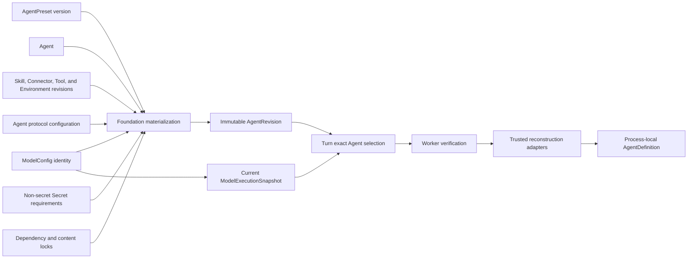
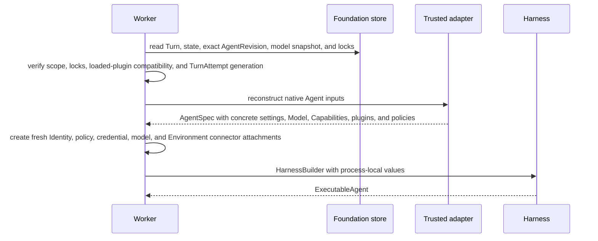

# Agent Revisions and Reconstruction

## Design Position

Foundation stores serializable Agent authoring resources and immutable executable revisions. It does not persist a Harness `AgentDefinition`, Python import target, plugin instance, native Model, Toolset, Capability, callable, client, credential, or provider binding. A worker reconstructs those process-local values through trusted installed adapters after verifying every selected revision and lock.

A Turn selects exact immutable Agent inputs at durable acceptance and freezes
the current model configuration under [Model Management](25-model-management.md).
It never resolves `latest` after acceptance or silently adopts edits made while
accepted, running, or resuming after worker loss. Every Foundation-managed
Agent invocation has this Turn boundary; Foundation defines no separate durable
Agent-work identity.

## Authoring Model

An `Agent` is a stable Workspace-owned resource for authoring, policy, and invocation. It is an authorization target, not an IAM Principal. Its versioned mutable metadata selects one published immutable `AgentRevision`. An `AgentPreset` is a reusable typed authoring input; it is not an executable object and does not override an Agent revision after materialization.

An `AgentRevision` is an independently addressable immutable executable revision associated with one Agent. Its opaque `AgentRevisionId` is the canonical durable reference used by Turns, Triggers, events, and APIs. `agent_id` and positive integer `version` place the revision in its owning Agent lineage but are not a second reference form:

```python
class AgentRevisionRef:
    id: AgentRevisionId
    agent_id: AgentId
    version: int
```

Resolving an Agent ID and version returns this exact reference or fails; it never manufactures a different identity. The complete revision contains only Foundation-owned serializable data and exact references, including:

- logical Agent instructions and typed input/output declarations;
- one exact `model_id` plus concrete Harness model characteristics and native model settings;
- Capability, Tool, Connector, and Environment declarations under their owning
  Foundation schemas plus exact managed Skill revision locks and exposure under
  [Foundation Skill Management](27-skill-management.md#agent-revision-selection);
- non-secret Secret requirements that bind an exact Workspace-owned Secret reference or declare an invoking-User Secret key under [Secret Management](11-secret-management.md);
- direct trusted adapter keys and bounded adapter configuration;
- one versioned Agent protocol configuration for Hosted AG-UI and A2A metadata,
  accepted input schemas, visibility, media modes, client tools, and limits;
- optional Harness plugin configuration under the Harness-owned document contract;
- exact managed Harness plugin package revision IDs and digests selected from the [managed artifact registry](26-harness-plugin-artifacts-and-runtime-loading.md) for every enabled managed plugin key; and
- exact dependency, package, content-digest, and schema compatibility locks.

`model_id` references one mutable Workspace `ModelConfig`. It is an exact
resource identity rather than a model alias or revision. Each new Turn resolves
the current enabled configuration and freezes its non-secret
`ModelExecutionSnapshot`; a Turn cannot override the Agent revision's
`model_id`. The Agent revision continues to own behavior such as temperature,
requested output limits, reasoning effort, tool choice, and structured-output
policy. The ModelConfig owns provider, endpoint, model name, credential
requirement, and advisory capabilities.

An AgentRevision's Environment declaration follows
[Environment Management](19-environment-management.md#environment-selection-and-turn-state):
it stores an ordered set of binding names, model aliases, exact
`EnvironmentRevisionId` requirements, required status, optional default binding,
and runtime-selection policy, never a mutable Environment head or inline
credential value. Turn acceptance can apply a permitted caller topology, then
writes the resulting multi-entry `EnvironmentExecutionConfig` into the Turn's
immutable `state.json` envelope independently from the AgentRevision.

An AgentRevision's managed Skill selection stores the complete available revision
locks, materialization binding, and default exposure. Turn acceptance can apply an
exact-name invocation override only within that available catalog, then writes the
resolved `selected_skill_names` into the Turn's immutable `state.json` envelope.
The override changes neither the AgentRevision nor its dependency locks.

Secret requirements never contain a Secret value. Model credentials are owned
by the selected ModelConfig. Other Agent-owned requirements store an exact
Workspace Secret reference or a validated invoking-User Secret key as defined
by their owning contract. Connector declarations contain no credential or
Provider-private state. Current Secret eligibility, Connection status, values,
credentials, RoleBindings, and run grants are resolved freshly rather than
captured in the immutable revision.

A Foundation authoring API validates concrete Harness model settings under the
selected provider definition but stores no unresolved model alias. A context
budget does not alter provider capability metadata, and a requested native
maximum output remains an Agent behavior setting rather than a ModelConfig
field.

Changing materialized Agent content, protocol configuration, `model_id`, native
model settings, or a dependency lock creates another Agent revision. Editing the referenced
ModelConfig does not create an Agent revision. Prior Agent revisions selected
by retained Turns remain addressable for their documented retention period.

The revision and Turn-state boundaries prevent accepted work from changing
underneath the worker. For example, a Builder can materialize an
`AgentRevision` at version `7` from an exact Preset, `model_id`, Tool, Skill,
Connector, and Environment revisions and then edit either the Agent or the
ModelConfig after accepting a Turn. The worker reconstructs revision `7` and
the model snapshot stored on that Turn. A later successor Turn uses the current
ModelConfig.

## Agent Protocol Configuration

Every AgentRevision carries one immutable versioned protocol configuration. It
customizes Hosted AG-UI and A2A but does not enable or disable a protocol:
Native and Hosted AG-UI are always available, and the deployment-wide A2A total
switch applies uniformly to all Agents.

The conceptual configuration is:

```python
class AgentProtocolConfiguration:
    schema_version: Literal["1"]
    public_name: str
    public_description: str | None
    input_modes: tuple[str, ...]
    output_modes: tuple[str, ...]
    input_data_schema: JsonObject | None
    state_schema: JsonObject | None
    context_schema: JsonObject | None
    client_tools: tuple[ClientToolPolicy, ...]
    event_visibility: tuple[str, ...]
    a2a_skills: tuple[A2ASkillProjection, ...]
    extended_agent_card: ExtendedAgentCardPolicy | None
    limits: ProtocolLimits
```

This is a conceptual Foundation schema, not an AG-UI or A2A wire object.
Foundation materialization validates every embedded JSON Schema, mode, tool,
event selection, skill projection, metadata field, and limit against the
Gateway's finite registries and hard safety ceilings. It rejects arbitrary
protocol extensions, event names, executable targets, credentials, URLs,
Workspace identity, or authorization claims.

When authoring omits optional protocol detail, materialization applies the
safe schema-version default: bounded text input/output, standard Run/text/tool
AG-UI visibility, no client tools, no non-empty state/context, a public-safe A2A
Card projection, and no authenticated extended Card. The default does not hide
or disable the Agent's protocol route.

Builder authority over Agent-owned configuration includes this document;
Workspace Admin inherits that authority. Deployment operators separately own
accepted hostnames, TLS, proxy trust, the hostname-to-default-Agent mapping,
A2A total availability, and global hard limits. Agent content cannot modify
those deployment settings.

Publishing another AgentRevision changes the Card or policy used by later
acceptance. Each Hosted AG-UI Run and A2A Task acceptance freezes the exact
AgentRevision ID and canonical protocol-configuration digest. Worker takeover,
feedback Turns in the same A2A Task, and replay use the frozen values. A later
A2A Task or Hosted continuation can select the current published revision only
through ordinary Foundation continuation compatibility.

## Revision Relationships



Materialization validates resource scope, references, schemas, permission to
bind each resource, dependency compatibility, and all required locks before
committing the immutable revision. The revision records identity and
compatibility, not live authority. Turn acceptance separately validates the
current ModelConfig, resolves the effective managed Skill selection, and writes
that selection and the exact Environment execution configuration into initial
Turn state.
Current credentials, RoleBindings, run grants, Secret eligibility, and runtime
Environment bindings from that configuration are resolved freshly for every
`TurnAttempt` and Harness Run.

## Dependency Locks

An Agent dependency lock identifies every package, external content unit,
adapter, or schema selected by the Agent revision whose change could alter
reconstruction, Capability behavior, state compatibility, security, or output
semantics. It includes exact package or content identities, trusted adapter
keys, selected Connector Provider artifacts, managed Harness plugin package
revision IDs and wheel digests, relevant schema or codec compatibility, and
integrity digests when content is externally materialized.

For every available managed Skill, the dependency lock contains the immutable Skill
revision ID, model-facing name, and normalized content digest. It contains no upload
receipt, GitHub selector, mutable Skill head, object URL, credential selector, or
Environment path.

The Turn state stores only the effective ordered Skill names resolved within those
locks. It does not duplicate revision IDs, digests, package locations, or
materialization status.

The model-provider adapter and schema lock are selected with current
ModelConfig and captured in the Turn-owned `ModelExecutionSnapshot`, not in the
Agent revision.

Package installation or entry-point availability grants no trust. The deployment selects allowed adapter and plugin keys, verifies the exact lock, and imports only those installed targets. When Foundation manages a Harness plugin artifact, materialization resolves an explicit package revision for its key and copies the exact immutable revision ID and digest into the AgentRevision. A durable row never contains an arbitrary module, class, file path, shell command, or remote code URL for execution.

An adapter replacement can reconstruct a retained revision only when it explicitly declares compatibility with that revision and its locks. Name similarity, newer package versions, or a current default does not satisfy a missing lock.

## Worker Reconstruction



Reconstruction is deterministic with respect to the Agent revision, Turn-owned
model snapshot, effective Skill selection, and declared locks. Live authority
and provider reachability are intentionally fresh. The worker assigns a stable
`AgentInstanceRef` to each independently advancing root, delegated child Agent,
or fork history. A replacement worker preserves that reference for the same
Thread but uses a new `TurnAttempt`, transient Harness Run correlation, and
fresh bindings.

The worker validates the complete definition before starting model or tool
work. It validates the Turn's effective Skill names against the selected
AgentRevision, verifies the corresponding exact revisions and package objects, then
uses the [Skill Worker materialization contract](27-skill-management.md#worker-materialization-and-harness-use)
to populate explicit Environment-backed roots and construct the run override
before Harness model exposure. It reconstructs Harness `HarnessModelCharacteristics` and
native `ModelSettings` from the revision's concrete behavior settings and the
Turn's model snapshot, without alias or current-configuration lookup. After
claim and before Harness entry, it ensures that every managed plugin lock is
either absent from the interpreter and loadable on demand or exactly matches
the process-local loaded-plugin registry. It does not partially execute a
revision whose output schema, Capability state codec, plugin contract, model
adapter, Environment connector, or dependency lock is incompatible.

## Continuation Compatibility

A Thread preserves one independently advancing Agent lineage. A new Turn that continues the Thread sets `parent_turn_id` to the exact sealed previous Turn and initializes from that parent's state. Selecting another Agent revision for the new Turn is allowed only when the new revision explicitly accepts the parent's Agent, Capability, output, Environment-state, and plugin compatibility facts. Otherwise the caller creates an explicit fork with a new lineage and no implied state migration.

Editing an Agent or publishing another revision never mutates an existing Turn, Item, state checkpoint, pending fact, or asynchronous child relationship. A later TurnAttempt for the same Turn reconstructs the revision selected when the Turn was accepted. A new continuation, fork, or retry Turn can select another revision only through an explicit authorized request and compatibility check.

## Failure Semantics

| Failure                                           | Outcome                                                                         |
| ------------------------------------------------- | ------------------------------------------------------------------------------- |
| Missing revision or lock                          | Turn fails before Harness construction                                          |
| Content digest or package lock mismatch           | Turn fails closed and records bounded incompatibility evidence                  |
| Managed Skill package or materialization mismatch | Turn fails before Skill instructions or paths reach the model                   |
| Worker already pins a conflicting plugin revision | The claimed Attempt fails preparation as retryable within the Turn budget       |
| Unknown adapter or plugin key                     | Revision is not reconstructed; no ambient import fallback occurs                |
| Required `RunModelResolver` unavailable           | Turn fails before native model inference                                        |
| Credential or policy unavailable                  | Fresh binding fails; the immutable revision is not rewritten                    |
| Checkpoint incompatible with revision             | Continuation fails before Harness entry; display history is not substituted     |
| Attempt lease expires during reconstruction       | A Worker takeover creates a new generation; no process-local object is restored |

## Invariants

01. A Turn stores one exact `AgentRevisionId` and one accepted model execution
    snapshot, while its immutable state envelope stores the exact Environment
    execution configuration and effective managed Skill names; the worker resolves
    neither a mutable Agent head, current model configuration, nor another Skill
    default at claim time.
02. A revision contains serializable Foundation data and references only, never live Python objects or credentials.
03. Dependency locks and content digests are verified before Harness construction.
04. Package presence does not authorize an adapter, plugin, Capability, provider, or import target.
05. Every TurnAttempt reconstructs fresh authority and bindings without mutating the selected revision.
06. Replacement workers preserve stable Thread identity and change TurnAttempt generation and transient Harness Run correlation.
07. A retained checkpoint is used only under explicitly compatible Agent and state contracts.
08. Connector tool contracts and Provider artifacts are frozen by the Agent
    revision; model and Connector credentials remain fresh per TurnAttempt.
09. Managed Harness plugin selection freezes the exact package revision and
    digest; a Worker loads only that revision and never replaces a conflicting
    imported module in place.
10. AgentRevision freezes the available managed Skill revisions, names, digests,
    and defaults; Turn state freezes the effective names, and Worker materialization
    completes and verifies before Harness Skill exposure.
11. AgentRevision freezes one validated protocol configuration; every Hosted
    AG-UI Run and A2A Task acceptance records its exact revision and digest.
