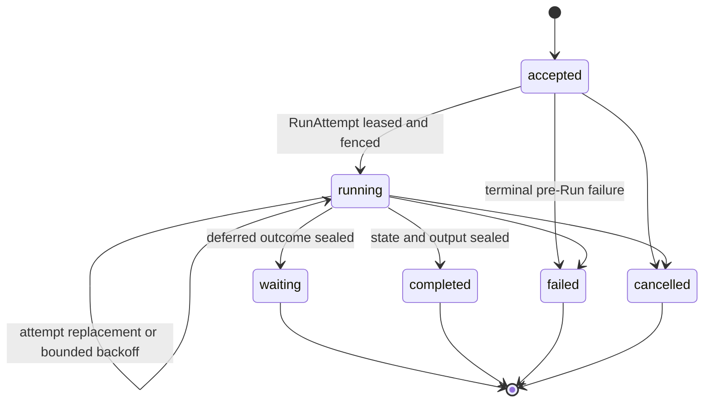
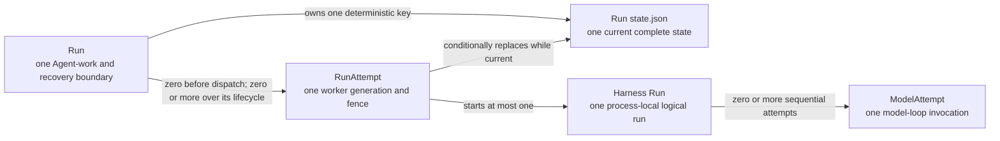
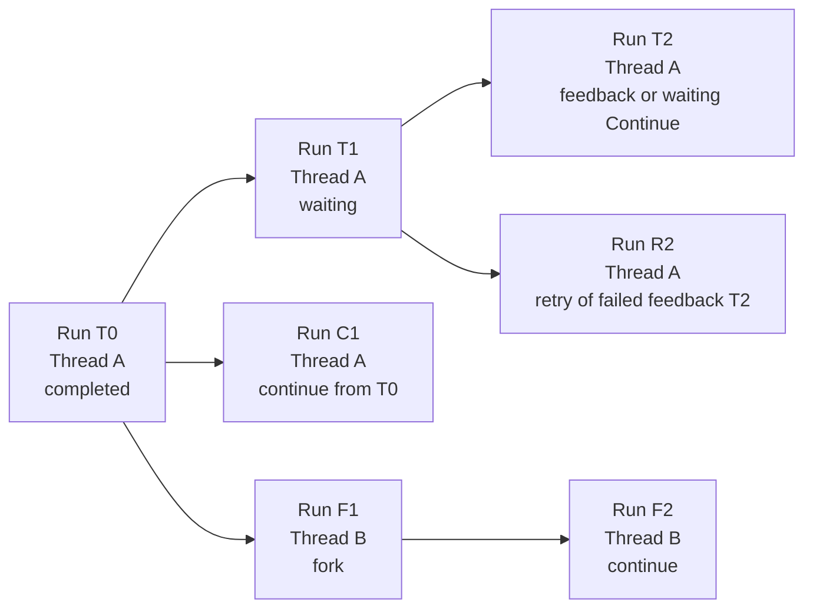
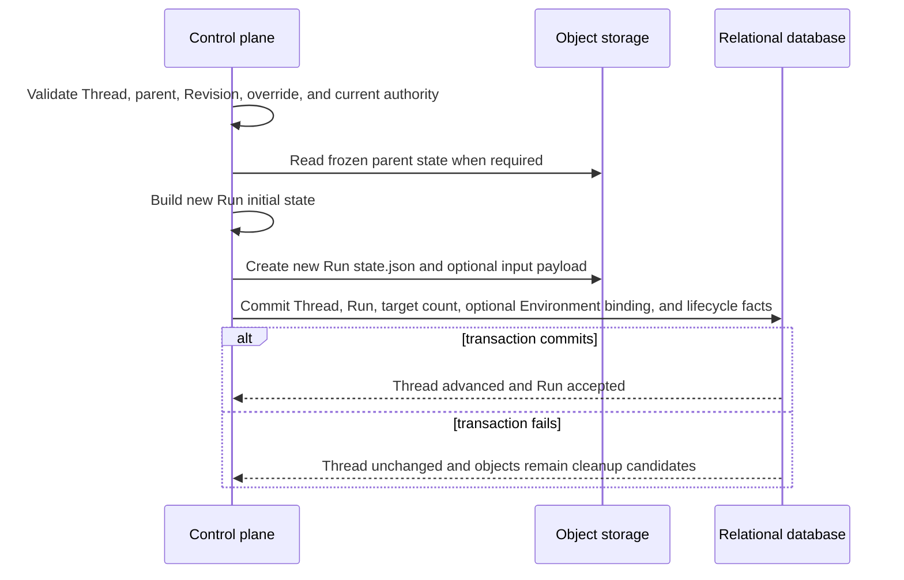

# Durable Run State

## Design Position

| Dimension               | Core question                              | Foundation choice                                                                                                                                                                                                                                                                 |
| ----------------------- | ------------------------------------------ | --------------------------------------------------------------------------------------------------------------------------------------------------------------------------------------------------------------------------------------------------------------------------------- |
| Identity and boundary   | When are Run and RunAttempt created?       | The [Agent interaction and execution model](10-agent-interaction-and-execution-model.md#identity-allocation-boundary) owns the allocation distinction: accepted semantic work creates a Run, while first or replacement Worker execution creates a `RunAttempt` under that Run    |
| Logical history         | How do Runs form history?                  | `parent_run_id` forms a Git-like DAG; the independent Thread row selects current and continuation-head Runs, continue preserves Thread identity, and fork creates a new Thread                                                                                                    |
| Persistence             | Where is a Run persisted?                  | Run metadata lives in the relational database; resumable state and large Run inputs and outputs live in object storage                                                                                                                                                            |
| Stored data             | What does a Run persist?                   | The Run row holds metadata, exact Agent selection, effective-config digest, and protected object references; `RunStateEnvelope` holds complete immutable `EffectiveAgentConfig` plus Harness and Host continuation state; `RunPayloadEnvelope` holds large Run inputs and outputs |
| State advancement       | Which service instance can commit updates? | At most one worker service instance is lease-authorized through the current fenced `RunAttempt`; only its relational and conditional object writes can commit, while stale or partitioned instances are rejected                                                                  |
| Completion and recovery | How do checkpoint, seal, and resume work?  | Checkpoint publication conditionally overwrites the object at the same key; relational sealing selects the exact candidate digest; recovery reads the complete checkpoint from the latest conditionally committed version of that same state object                               |

Foundation Service persists each accepted Thread advancement as one relational `Run` row. The Run is the durable Agent-work, scheduling, recovery, and Git-like history boundary; it owns the parent edge, input, exact selections, finite recovery budget, lifecycle, and sealed outcome.

[Durable Thread Persistence](11-thread-persistence.md) separately owns the versioned Thread row. Run acceptance atomically creates or advances that row, and Run outcome commit verifies that the sealing Run remains current and either selects a new continuation head or preserves the prior head. A Run row does not infer Thread existence, current selection, or head state by timestamp.

Each Run also owns one complete state object at a tenant- and Run-derived key. The control plane initializes it from a new root state or the selected parent's frozen state. The current fenced `RunAttempt` conditionally replaces it at complete Harness state boundaries, and sealing makes it immutable. Foundation stores no separate `base_state`, `result_state`, or selectable checkpoint history.

Worker recovery can resume the same Run from its latest valid state object; `continue` and `fork` instead initialize a new Run from frozen parent state. The [Agent interaction and execution model](10-agent-interaction-and-execution-model.md#identity-allocation-boundary) owns that identity distinction, while [RunAttempt allocation](13-run-attempt-scheduling-and-recovery.md#runattempt-allocation-within-a-run) owns creation of each Worker generation. No state write for the new Run mutates the parent.

This is a Foundation Host policy above the Harness state API. Harness exports complete detached state but does not select or authorize a durable recovery point; Foundation selects only the conditionally committed value at the Run's deterministic state key.

The shared [interaction model](../interaction-model.md) owns `Session`, `Thread`, `Run`, and `Item` meaning. Every Foundation-managed Agent invocation, including schedules, webhooks, and asynchronous children, accepts a Run; non-Agent maintenance uses its owning domain's work model. [`RunAttempt`](13-run-attempt-scheduling-and-recovery.md) remains a subordinate worker generation, and Foundation defines no generic `Execution` resource.

## Boundaries

| Concern                                                                     | Owner                                                                                                   | Contract                                                                                                 |
| --------------------------------------------------------------------------- | ------------------------------------------------------------------------------------------------------- | -------------------------------------------------------------------------------------------------------- |
| Session, Thread, Run, and Item meaning                                      | [Platform Interaction Model](../interaction-model.md)                                                   | Defines public identity and relationships                                                                |
| Thread row, Session membership, version, current Run, and continuation head | [Durable Thread Persistence](11-thread-persistence.md)                                                  | Serializes accepted advancement and selects the exact resumable history head                             |
| Portable messages, Capability namespaces, Environment data, and Thread ID   | [Harness State](../agent-harness/10-snapshot-and-resume.md)                                             | Supplies detached state without Host authority                                                           |
| Run row, parent edge, state selection, and outcome                          | Foundation Run domain                                                                                   | Forms the authoritative interaction history and Run-level recovery boundary                              |
| Effective Agent configuration                                               | [Agent Management](28-agent-management.md#agentrunoverride-and-effective-configuration)                 | Owns the complete non-secret snapshot merged and resolved once at Run acceptance                         |
| Connectivity selections and protected Ingress context                       | [External Connectivity](40-connectivity/README.md)                                                      | Define accepted outbound accounts, remote endpoints, native action scope, and protected external context |
| Environment selection, execution configuration, and Run binding             | [Environment Management](29-environment-management.md#accepted-execution-configuration-and-run-binding) | Defines the optional exact existing-target connection and its immutable relational Run binding           |
| Effective managed Skill selection                                           | [Foundation Skill Management](31-skill-management.md#agent-selection-and-run-locking)                   | Defines AgentRevision binding policy and exact ordered Skill locks inside effective config               |
| Managed Asset identity, content, publication, and deletion                  | [Asset Management](32-asset-management.md)                                                              | Supplies immutable `asset_id` references used inside accepted input, output, or retained presentation    |
| Run scheduling fields and recovery-limit state                              | Foundation Run domain                                                                                   | Stores durable eligibility and finite limits that Attempt admission consumes                             |
| Worker generation, lease, and stale-writer fencing                          | [Run Attempts, Scheduling, and Recovery](13-run-attempt-scheduling-and-recovery.md)                     | Authorizes one worker generation and preserves its immutable attempt audit                               |
| Current complete Run state                                                  | One deterministic Run state object                                                                      | Stores active Harness and Host state; waiting or completed sealing selects its exact frozen identity     |
| Object storage operations                                                   | [Object storage](03-storage.md#object-storage)                                                          | Supplies atomic whole-object publication and expected-version replacement                                |
| Lifecycle events, stream messages, and Items                                | [Lifecycle and Stream Persistence](24-lifecycle-and-stream-persistence.md)                              | Stores ordered facts, transports live observations, and retains presentation projections                 |
| Thread inbox entries and active steering                                    | [Agent Control: Active Execution](19-agent-control-active-execution.md)                                 | Persists accepted active-Run input and couples consumption to one complete state checkpoint              |
| Pending calls and approvals                                                 | Waiting Run plus its frozen Run state                                                                   | Stores a bounded relational summary and the complete deferred value without a separate table             |
| Tool work between complete checkpoints                                      | Latest complete Run state plus any tool-specific durable protocol                                       | Generic recovery cannot reconstruct it; effectful tools own cross-crash idempotency or reconciliation    |
| Credentials and invocation authority                                        | Foundation Secret and policy boundaries                                                                 | Resolves fresh authority; plaintext credentials never enter Run state                                    |

## Durable Run Model

The following Python-like schema is conceptual. It defines durable field meaning rather than a public wire representation or concrete ORM class.

```python
type RunLineageKind = Literal["root", "continue", "fork"]
type RunInputKind = Literal[
    "agent_input",
    "waiting_feedback",
    "waiting_continue",
    "async_subagent_result",
]
type RunStatus = Literal[
    "accepted",
    "running",
    "waiting",
    "completed",
    "failed",
    "cancelled",
]
type RunWaitReason = Literal[
    "approval",
    "client_tool",
    "user_input",
    "multiple",
]
type PendingCallKind = Literal[
    "approval",
    "client_tool",
    "user_input",
]


class RunPayloadObjectRef:
    object_key: str
    digest_sha256: str
    size_bytes: int
    content_type: str
    schema_version: str


class EncryptedRunConfigPayloadRef:
    object_key: str
    ciphertext_digest_sha256: str
    protected_value_digest_sha256: str
    size_bytes: int
    encryption_key_id: str
    schema_version: str


class PendingCallSummary:
    call_id: str
    kind: PendingCallKind
    tool_name: str | None
    provider_type: str | None
    arguments_digest_sha256: str | None
    presentation: JsonObject | None


class RunPendingSummary:
    schema_version: Literal["1"]
    calls: tuple[PendingCallSummary, ...]
    resolution_policy: Literal["all"]


class RecoveryUsage:
    schema_version: Literal["1"]
    model_requests: int
    input_tokens: int
    output_tokens: int
    tool_invocations: int
    billable_units: dict[str, int]


class RecoveryUsageLimit:
    schema_version: Literal["1"]
    model_requests: int | None
    input_tokens: int | None
    output_tokens: int | None
    tool_invocations: int | None
    billable_units: dict[str, int]


class RecoveryBudget:
    policy_version: str
    max_recovery_attempts: int
    max_handoffs: int
    recovery_deadline_at: datetime | None
    max_usage: RecoveryUsageLimit | None


class SealedRunState:
    digest_sha256: str
    size_bytes: int
    content_type: str
    envelope_schema_version: str
    harness_schema_version: str
    checkpoint_seq: int
    committed_by_run_attempt_id: str | None


class Run:
    id: str
    version: int
    tenant_id: str
    authority_principal: PrincipalRef

    session_id: str
    thread_id: str
    parent_run_id: str | None
    retry_of_run_id: str | None
    lineage_kind: RunLineageKind

    trigger_type: str
    trigger_entity_type: str | None
    trigger_entity_id: str | None
    parent_agent_instance_id: str | None
    delegation_id: str | None
    parent_tool_call_id: str | None

    agent_id: AgentId
    agent_revision_id: AgentRevisionId
    effective_agent_config_digest: str
    encrypted_config_payload: EncryptedRunConfigPayloadRef | None
    runtime_lock_digest: str
    model_execution_observation: ModelExecutionObservation
    connector_connection_selections: tuple[ConnectorConnectionRunSelection, ...]
    mcp_connection_selections: tuple[MCPConnectionRunSelection, ...]
    ingress_context: IngressRunContext | None

    priority: int
    queue_name: str
    available_at: datetime
    current_run_attempt_id: str | None
    next_attempt_fence: int

    recovery_budget: RecoveryBudget
    attempts_started: int
    recovery_attempts_started: int
    handoffs_completed: int
    usage_charged: RecoveryUsage

    idempotency_key: str | None
    request_fingerprint: str

    status: RunStatus
    wait_reason: RunWaitReason | None
    input_kind: RunInputKind
    input: JsonValue | None
    input_object: RunPayloadObjectRef | None
    input_text: str | None
    output: JsonValue | None
    output_object: RunPayloadObjectRef | None
    output_text: str | None
    failure: SafeFailure | None
    pending: RunPendingSummary | None
    sealed_state: SealedRunState | None

    created_at: datetime
    updated_at: datetime
    started_at: datetime | None
    waiting_at: datetime | None
    completed_at: datetime | None
    sealed_at: datetime | None
```

`RunPendingSummary` is a bounded read and query projection, not a collection of mutable action rows. `resolution_policy="all"` means one accepted feedback or explicit waiting Continue finalizes the complete frozen set; partial responses never mutate this summary. The exact request values remain in the sealed Run state.

`id` is the Foundation-owned Run identity and follows [Platform Data Conventions](../data-conventions.md). `version` is the positive Run object version used for compare-and-swap relational mutation. The state object key is derived from `tenant_id` and `id`; it is not duplicated in the row and is never accepted from a caller.

`authority_principal`, `session_id`, `thread_id`, `parent_run_id`, `retry_of_run_id`, lineage, `input_kind`, accepted input, `agent_id`, `agent_revision_id`, effective-config digest, protected sensitive payload reference, `runtime_lock_digest`, `model_execution_observation`, ConnectorConnection selections, MCPConnection selections, Ingress Run context, accepted recovery policy, idempotency identity, and request fingerprint are immutable after acceptance. Every version of the Run state must carry `run_id` and `thread_id` equal to the owning Run. Foundation rejects another identity rather than rewriting it during read.

`authority_principal` is the User or Service Account identity whose current product authority and principal-owned resource eligibility govern the Run. It is not necessarily the actor that later claims, retries, consumes queued work, or performs an internal reconciliation step. The Run stores only the stable `PrincipalRef`; it stores no browser session, API key, bearer value, credential ID, credential boundary, RoleBinding, role key, permission set, or authorization decision. Public acceptance, native Ingress acceptance, asynchronous child acceptance, waiting continuation, retry, and automatic successor acceptance assign or inherit this field under their owning contracts. No Run uses `system` as an authority Principal; an internal system actor remains audit attribution and must act for an explicit persisted User or Service Account.

The [Model Management contract](30-model-management.md) owns `ModelExecutionSnapshot` and `ModelExecutionObservation`. The complete non-secret snapshot, final merged settings, and characteristics live inside `EffectiveAgentConfig.model` and are reused by every replacement RunAttempt. The selected Model supplies its single API at acceptance; discovery descriptions, parameter schemas, and mutable Model defaults are not replay inputs. The safe observation is the smaller relational and public-history projection. Neither value is Harness continuation state.

The [Environment Management contract](29-environment-management.md#accepted-execution-configuration-and-run-binding) owns the optional primary `EnvironmentExecutionConfig` inside `EffectiveAgentConfig`, the separate immutable `RunEnvironmentBinding`, and their global `EnvironmentTarget` reference. It resolves one exact named revision or inline existing-target connection, exact Provider package lock, canonical target identity, access ceiling, and non-secret credential references. Every replacement RunAttempt reuses that complete connection and the same binding, resolves current eligible credentials, and constructs a fresh attach-only Environment adapter. Replacement does not add another target active count.

The [Foundation Skill Management contract](31-skill-management.md#agent-selection-and-run-locking) owns effective managed Skill selection. Run acceptance either resolves the AgentRevision's frozen Skill bindings or whole-replaces them through `AgentRunOverride.skills`, then stores the final exact ordered locks in `EffectiveAgentConfig.skills`. An unpinned AgentRevision binding resolves its stable Skill identity's current Revision only at this acceptance boundary. Every replacement RunAttempt reuses the resulting locks.

The [Connector Providers and Connector Connections contract](40-connectivity/03-connectors-and-connections.md#assignment-and-effective-selection) defines `ConnectorConnectionRunSelection`; [Remote MCP Connections](40-connectivity/06-remote-mcp-connections.md#tool-discovery-and-run-selection) defines `MCPConnectionRunSelection`; and [Agent-Facing External Tools](40-connectivity/04-agent-facing-tools.md) defines `IngressRunContext` and runtime discovery semantics. A Run with no selected Connector tools or user Remote MCP tools stores empty selection tuples. Only a Run created from Ingress input stores `ingress_context`. These selections retain all-tools or explicit-name scopes and deferred-loading policy, without tool schemas or catalog digests. A later compatible Ingress Steer retains that context and accepted selections. Replacement Attempts discover current definitions under the same source and tool scope.

`sealed_state` is absent while the Run is active. A `waiting` or `completed` sealing transaction always records the exact digest, size, schema versions, and checkpoint sequence of the state object frozen with the Run. A Worker-originated `failed` Run can record a complete state prepared under its fence or leave `sealed_state` null. An interrupt-driven `cancelled` Run always leaves it null because interrupt performs no object I/O. After any seal, no later object value is authoritative; only a recorded `sealed_state` selects bytes as part of the Run outcome. When a sealed state is present, its fields identify the exact terminal bytes without introducing a second base or result object. `committed_by_run_attempt_id` is null only when a relational fail-closed decision seals a Run without an attempt-originated state change.

Every Run can own zero or more immutable `RunAttempt` values over its lifetime, with at most one current and lease-authorized attempt. The [RunAttempt allocation contract](13-run-attempt-scheduling-and-recovery.md#runattempt-allocation-within-a-run) owns when those generations are created.

`RecoveryBudget` is the accepted recovery-policy snapshot. `max_recovery_attempts` includes the first Attempt and every successor created after retryable failure or expired-lease takeover; a successor created after a planned handoff does not consume it. `max_handoffs` bounds successful planned handoffs independently. `attempts_started` counts every Attempt for audit, `recovery_attempts_started` counts only Attempts charged to the recovery budget, and `handoffs_completed` counts committed `yielded` transitions. `recovery_deadline_at` is a fixed UTC deadline, and `usage_charged` aggregates every Attempt, including known usage from yielded or failed work. Every counter and limit is non-negative. Missing required usage is never treated as zero; if durable usage evidence is insufficient to prove that a configured ceiling remains, no new Attempt is admitted. The Run row is the sole authority for whether another Attempt or planned handoff is permitted.

The exact `AgentId`, `AgentRevisionId`, complete `EffectiveAgentConfig`, protected sensitive payload, and internal Plugin Runtime lock digest are fixed at Run acceptance. The selected Revision supplies the base Agent behavior; a typed override is merged and resolved exactly once. Worker resume never resolves the Agent head, another current Revision, another Runtime lock, or current managed-resource heads. An ordinary compatible continuation is another Run and resolves its selected AgentRevision and optional typed override, including every unpinned Skill binding. Authenticated waiting feedback, explicit waiting Continue, and Retry preserve the source Run's exact Revision, effective config, protected payload, and Runtime lock, but their new acceptance still enforces current lifecycle gates. A fork either preserves that complete selection or resolves an explicitly selected compatible Agent/Revision/override according to the public fork contract.

The request fingerprint covers the exact selector semantics, normalized non-secret effective configuration, and `protected_value_digest_sha256` when sensitive typed leaves are present. It never includes or logs plaintext. Retry and resume reuse the stored encrypted payload and never reapply override merge rules.

Exactly one of `input` and `input_object` is present. `input_kind` selects its owning protocol: `agent_input` stores the accepted [`AgentInput`](17-agent-input.md#agent-input-protocol), `waiting_feedback` stores the complete normalized [`WaitingRunFeedback`](18-agent-control-input-and-continuation.md#deferred-interaction), `waiting_continue` stores the composite [`WaitingRunContinueInput`](18-agent-control-input-and-continuation.md#waiting-continue-with-defaults), and `async_subagent_result` stores the exact [`AsyncSubagentResultInboxPayload`](34-async-subagents.md#asynchronous-child-runs) whose consumption accepted the Run. Start, ordinary continue, continue from, and fork use `agent_input`; feedback uses `waiting_feedback`; waiting Continue uses `waiting_continue`; eligible automatic inactive-Thread child-result delivery uses `async_subagent_result`; retry copies the source Run's exact kind and value. `retry_of_run_id` is present only for retry and names the same-Thread failed or cancelled Run that was current when its accepted intent was copied. It is correlation, not another state or history edge.

At most one of `output` and `output_object` is present, and neither is present before a completed outcome. The `JsonValue` annotation is the storage encoding, not an open input schema. Inline values are bounded structured data suitable for direct Run reads. Oversized payloads use immutable objects. Retry copies the exact accepted descriptor value, publishes a new Run-owned payload envelope when that JSON is object-backed, and lets execution reacquire any required binary source for the new Run. `input_text` and `output_text` are optional bounded derived projections and never replace exact data, accepted source descriptions, or the complete message history.

An Asset-backed input stores its exact immutable `asset_id` inside accepted `AgentInput`; it does not copy Asset bytes or create an Asset snapshot. A completed output can contain a bounded [`AssetRef`](32-asset-management.md#asset-model) inside its owning JSON value. Foundation creates no Run-to-Asset relation or Run-owned Asset list. Retry preserves the same input Asset ID, while output references remain ordinary immutable outcome data.

`waiting` is a sealed Run outcome. It contains a bounded `pending` summary; the frozen Run state contains the authoritative deferred requests and effective client-tool surface. Authenticated Feedback or explicit waiting Continue is the accepted input of a new Run whose `parent_run_id` names the waiting Run and whose state is initialized from that waiting state. Pending Thread-inbox delivery remains outside that input and binds to the successor under its separate FIFO.

### Run Lifecycle



`accepted` means the complete Run row, accepted input, exact selections, recovery budget, scheduling fields, and initial complete state object are durable; no attempt is current; and a Worker may claim the Run once `available_at` is reached. It is only the initial pre-claim scheduling state. Once the first Attempt is created, that Run never returns to `accepted`. It is not a queued user-input entry, and Run defines no `queued` state.

`running` means execution of this Run has begun and the Run remains active. It normally selects one non-terminal `RunAttempt`; during retryable backoff or after a planned handoff it can temporarily have no current Attempt. An expired selected lease grants no worker authority while awaiting transactional takeover. `started_at` records the first Harness Run entry and never changes during recovery or planned handoff.

`waiting`, `completed`, `failed`, and `cancelled` are sealed outcomes. `sealed_at` and any available `sealed_state` are selected in the same relational transaction. A sealed Run never changes any column and its state key is never overwritten.

The Run remains the budget and lifecycle authority after attempt failure or lease expiry. The [Run Attempt recovery contract](13-run-attempt-scheduling-and-recovery.md#recovery-and-budget-enforcement) keeps structurally resumable, in-budget work `running` across replacement attempts and seals invalid, incompatible, non-retryable, or exhausted work as `failed`.

### Key Entity Relationships



The cross-layer identity-allocation decision is owned by the [Agent Interaction and Execution Model](10-agent-interaction-and-execution-model.md#identity-allocation-boundary). The RunAttempt contract owns how a Worker claim allocates a particular generation.

## Relational Run Table

The conceptual `Run` materializes as one row in `runs`; supported relational backends preserve the same validation and query semantics.

| Column group            | Columns                                                                                                                                                                                                                                        | Relational shape and contract                                                                                                          |
| ----------------------- | ---------------------------------------------------------------------------------------------------------------------------------------------------------------------------------------------------------------------------------------------- | -------------------------------------------------------------------------------------------------------------------------------------- |
| Identity                | `id`, `version`, `tenant_id`                                                                                                                                                                                                                   | Opaque text IDs and a positive integer CAS version; `id` is the primary key                                                            |
| Execution authority     | `authority_principal_type`, `authority_principal_id`                                                                                                                                                                                           | Immutable User or Service Account represented by this Run; never a credential or role snapshot                                         |
| Interaction lineage     | `session_id`, `thread_id`, `parent_run_id`, `retry_of_run_id`, `lineage_kind`                                                                                                                                                                  | Immutable state-source edge plus optional same-Thread terminal-intent retry correlation                                                |
| Scheduling              | `priority`, `queue_name`, `available_at`, `current_run_attempt_id`, `next_attempt_fence`                                                                                                                                                       | Durable claim order and the sole current worker generation                                                                             |
| Recovery budget         | `recovery_policy_version`, `max_recovery_attempts`, `max_handoffs`, `recovery_deadline_at`, `max_usage_json`, `attempts_started`, `recovery_attempts_started`, `handoffs_completed`, `usage_charged_json`                                      | Accepted finite limits, complete Attempt audit count, and atomically charged recovery, handoff, and usage consumption                  |
| Idempotency             | `idempotency_key`, `request_fingerprint`                                                                                                                                                                                                       | Optional retry-safe acceptance identity and exact bounded request fingerprint                                                          |
| Source correlation      | `trigger_type`, `trigger_entity_type`, `trigger_entity_id`, `parent_agent_instance_id`, `delegation_id`, `parent_tool_call_id`                                                                                                                 | Bounded typed correlation; never state-lineage authority                                                                               |
| Agent selection         | `agent_id`, `agent_revision_id`, `effective_agent_config_digest`, `runtime_lock_digest`                                                                                                                                                        | Stable Agent, exact immutable Revision, complete effective-config identity, and internal Plugin Runtime lock selected at acceptance    |
| Sensitive override      | encrypted config payload object fields and protected-value digest                                                                                                                                                                              | Optional Run-owned ciphertext reference; never a Secret resource or ordinary projection                                                |
| Model observation       | `model_execution_observation_json`                                                                                                                                                                                                             | Safe retained Model attribution; the complete snapshot remains inside state-owned effective configuration                              |
| Connectivity acceptance | `connector_connection_selections_json`, `mcp_connection_selections_json`, `ingress_context_json`                                                                                                                                               | Immutable account, endpoint, and tool-scope selections plus optional protected Ingress target and native action allowlist              |
| Lifecycle               | `status`, `wait_reason`, `pending_json`                                                                                                                                                                                                        | Enum-constrained state; bounded pending summary exists exactly for `waiting`                                                           |
| Input                   | `input_kind`, `input_json`, `input_object_key`, `input_object_digest_sha256`, `input_object_size_bytes`, `input_object_content_type`, `input_object_schema_version`, `input_text`                                                              | Exactly one protocol-valid accepted input as inline JSON or an immutable object reference; explicit owner and optional text projection |
| Output                  | `output_json`, `output_object_key`, `output_object_digest_sha256`, `output_object_size_bytes`, `output_object_content_type`, `output_object_schema_version`, `output_text`                                                                     | Exactly one representation for completed Runs; absent otherwise                                                                        |
| Failure                 | `failure_json`                                                                                                                                                                                                                                 | Bounded safe structured failure only; no raw exception                                                                                 |
| Sealed state            | `sealed_state_digest_sha256`, `sealed_state_size_bytes`, `sealed_state_content_type`, `sealed_state_envelope_schema_version`, `sealed_state_harness_schema_version`, `sealed_state_checkpoint_seq`, `sealed_state_committed_by_run_attempt_id` | Exact frozen state identity for waiting/completed and valid failure snapshots; object key is derived rather than stored                |
| Time                    | `created_at`, `updated_at`, `started_at`, `waiting_at`, `completed_at`, `sealed_at`                                                                                                                                                            | UTC instants; lifecycle checks govern nullability                                                                                      |

Object-reference columns form all-or-none groups. Bounded values are validated before relational mutation; object keys and digests grant no authority.

When `EffectiveAgentConfig.environment` is non-null, one row in `run_environment_bindings` references the Run and records its Foundation-generated binding ID, fixed `workspace` mount name, optional source EnvironmentRevision, global `EnvironmentTarget` reference, provider key, and matching execution-config digest. A Run with no Environment has no such row. The complete connection remains owned by the Run state rather than duplicated as another mutable relational configuration. The target row owns protected target identity and the transactionally maintained count of bound Runs whose status is `accepted` or `running`.

## Git-Like Run DAG

`parent_run_id` names the exact sealed Run whose frozen state initialized the new Run. It is the sole interaction-history edge. The operation-specific acceptance rules are owned by [Agent Control: Input and Continuation](18-agent-control-input-and-continuation.md#acceptance-and-lineage).



The lineage rules are:

1. A root Run has `parent_run_id=null` and `lineage_kind=root`. The first Run of a new Thread initializes state with `HarnessState.new(thread_id=thread.id)`. An ordinary root-like Run accepted later in an existing Thread is permitted only for explicit or queued ordinary input while `head_run_id=null` after the current Run failed or was cancelled; Retry of a failed root separately repeats root lineage under rule 5. An async result from that terminal root lineage is suppressed rather than accepted. The trusted Host transformation constructs empty state while preserving that Thread's exact `thread_id`.
2. A continuation has `lineage_kind=continue`, uses a completed parent in the same Thread, and initializes its state from the parent's frozen state while preserving `thread_id`. Ordinary Continue and eligible automatic asynchronous-result acceptance select the current completed head; Continue From can explicitly reselect any retained and readable completed historical Run in that Thread.
3. Authenticated Feedback and explicit waiting Continue have `lineage_kind=continue`, use the exact waiting parent, initialize state from that parent's frozen deferred state, and preserve `thread_id`.
4. A fork has `lineage_kind=fork`, uses a completed parent, allocates the new Thread ID, transforms its frozen Harness state with `HarnessState.fork(thread_id=new_thread_id)`, clears portable Environment state, retains only eligible non-Environment Host continuation, and initializes a new state with that ID.
5. A retry names its failed or cancelled source in `retry_of_run_id`, copies that source's `parent_run_id`, `lineage_kind`, `input_kind`, and accepted input, and repeats the same state initialization without using the terminal source as a parent or inheriting its child relationships and results.
6. A child Agent that starts with independent empty history is a root of its own Thread. Structural or causal parentage uses trigger and delegation fields.
7. Worker resume preserves the Run, Thread, parent edge, and state key. It does not add a DAG node.
8. Failed and cancelled Runs remain queryable but are not eligible parents.

The independent Thread row serializes every accepted advancement. Several retained Runs can share the same `(thread_id, parent_run_id)` and represent historical sibling continuations, but at most one Run in the Thread can be `accepted` or `running`. Acceptance locks the Thread, verifies its exact version and operation-specific current/head selection, then advances it atomically with the new Run. An explicit fork creates a new Thread row and first Run in the same transaction.

A lineage read follows `parent_run_id` from an explicitly selected head. It is tenant-scoped, cycle-safe, and bounded. Created time and event order are not lineage authority.

The relational implementation uses one bounded recursive query, verifies that traversal reaches a root without a cycle or truncation, and returns at most 1,000 Run rows. Its recursive step runs once per ancestor. For `A` ancestors before a fork and `L` ancestors in the fork's local lineage, it visits `A + L + 1` rows in one database round trip, with `O(A + L)` work and temporary path state.

The public route, response, authorization, and failure contract are owned by [Run Lineage Read](16-management-api.md#run-lineage-read).

## Run State Object

Each accepted Run owns one `RunStateEnvelope`. It combines Harness portable state with Host continuation required to resume the same Run or initialize a new Run from a selected parent. It contains data and correlation, never current authority.

```python
type RunStateCheckpointKind = Literal[
    "initial",
    "progress",
    "waiting",
    "completed",
]
type RunInputDisposition = Literal["pending", "applied"]


class DeferredContinuationState:
    schema_version: Literal["1"]
    requests: JsonObject
    effective_client_tool_surface: JsonValue | None
    effective_surface_digest_sha256: str | None


class ConsumedThreadInboxEntry:
    inbox_entry_id: ThreadInboxEntryId
    kind: ThreadInboxKind


class HostContinuationState:
    schema_version: Literal["1"]
    deferred: DeferredContinuationState | None
    consumed_inbox_entries: tuple[ConsumedThreadInboxEntry, ...] = ()


class RunStateOutcomeCandidate:
    outcome: Literal["waiting", "completed"]
    wait_reason: RunWaitReason | None
    pending: RunPendingSummary | None
    output: JsonValue | None
    output_object: RunPayloadObjectRef | None
    output_text: str | None


class RunStateEnvelope:
    schema_version: Literal["1"]
    run_id: str
    thread_id: str
    checkpoint_seq: int
    checkpoint_kind: RunStateCheckpointKind
    input_disposition: RunInputDisposition
    last_checkpoint_run_attempt_id: str | None
    last_checkpoint_fence: int

    agent_id: AgentId
    agent_revision_id: AgentRevisionId
    effective_agent_config: EffectiveAgentConfig
    runtime_lock_digest: str
    harness_schema_version: str
    harness: HarnessState
    host: HostContinuationState
    outcome_candidate: RunStateOutcomeCandidate | None
```

This is the complete serialized outer schema. `HarnessState` is encoded through its owning public adapter and carries the same `thread_id`. `checkpoint_seq` starts at zero and increases monotonically for each successful semantic state replacement. The initial value has `checkpoint_kind=initial`, `input_disposition=pending`, no attempt identity, fence zero, and no outcome candidate.

`effective_agent_config` is the complete non-secret snapshot resolved and authorized at Run acceptance. Its Model, instructions, exact Plugin lock, Skill locks, managed ConnectorConnection and MCPConnection tool configuration, optional Environment, subagent graph, client tools, output contract, and correction budgets remain byte-for-byte equivalent across every checkpoint replacement for that Run. The Run's separate Connectivity selections and protected Ingress context are the final source and tool-scope authority after trusted overlays. They do not freeze discovered external schemas. A Worker reauthorizes mutable references required by their owning contracts, resolves fresh eligible credential values, and opens live bindings, but cannot rewrite either accepted configuration. Exact Skill packages remain internally readable for reconstruction of that accepted Run after Skill deletion.

The optional Environment entry inside `effective_agent_config` contains the exact existing-target connection, global target reference, credential references, access ceiling, and exact locks. Its digest must match the Run's immutable relational Environment binding. The target row persists only global identity, active membership, retirement, and bounded keepalive coordination; it is not complete current Provider state or a Thread-associated lifecycle value. Portable Harness Environment state never replaces or retargets the accepted connection.

The first checkpoint after the accepted Run input has crossed a complete Harness input boundary sets `input_disposition=applied`. Every later progress or outcome checkpoint retains `applied`. This field prevents a later attempt from injecting the same accepted input twice: a pending initial state receives the Run input; an applied state resumes directly from its exported Harness and Host state. For `waiting_feedback` and `waiting_continue`, Foundation does not publish that first applied checkpoint until the isolated first model request and any resulting complete tool batch have reached the safe delivery hook. For `waiting_continue`, the one pending input application covers the complete default deferred results and the new `AgentInput` supplied to the same first model request. A crash before that checkpoint replays the complete feedback input, including both waiting-Continue components; recovery from an applied checkpoint supplies none of it again. Waiting-derived Thread-inbox delivery has separate receipts and remains pending in PostgreSQL until the Foundation-owned hook makes it eligible.

`checkpoint_kind=progress` contains no outcome candidate. `checkpoint_kind=waiting` or `completed` contains the matching complete `outcome_candidate`. A waiting candidate has a non-empty pending summary, no output, and complete deferred state in `host.deferred`. A completed candidate has an output representation, no pending summary, and no deferred state. The candidate is durable preparation for the relational outcome transaction; it is not a sealed Run outcome by itself.

`requests` is the exact serialized native Pydantic `DeferredToolRequests` value; Foundation classifies its approval, client-tool, and structured-user-input calls in the relational summary without reconstructing the native value from that summary. Its call IDs and kinds exactly equal the waiting pending summary. Foundation defines no additional provider-owned pending kind or Host-request collection. Provider-native public-message continuation remains a Harness/model-integration capability and does not become a Foundation waiting reason. Asynchronous child results remain independent Thread-inbox entries and never enter deferred state, impersonate the original spawn call, or enter `DeferredToolResume`.

`consumed_inbox_entries` is the bounded receipt set for [`thread_inbox`](19-agent-control-active-execution.md#thread-inbox) entries incorporated into this Run. Each receipt correlates the exact inbox identity and kind with Harness or Host state already present in the same envelope. Replacement Attempts of this Run preserve the receipts. A new Run does not inherit its parent's receipts; it records only inbox entries consumed by that new Run's own acceptance.

`RunStateEnvelope` contains no Asset publication ledger, receipt, reference list, or Asset Capability namespace. When a successful `publish_asset` tool result has crossed a complete Harness checkpoint, its `AssetRef` can already appear in ordinary `harness` message history. The independent Asset row and selected content object remain publication authority whether or not that tool result was checkpointed.

The envelope separates four state classes:

| State class                   | Contents                                                                                                                                   | Restore rule                                                                                  |
| ----------------------------- | ------------------------------------------------------------------------------------------------------------------------------------------ | --------------------------------------------------------------------------------------------- |
| Effective Agent configuration | Exact non-secret Model, Plugin, Skill, managed external-tool configuration, Environment, subagent, client-tool, output, and retry snapshot | Immutable for the Run; references and current authority are revalidated before reconstruction |
| Harness portable state        | Thread ID, messages, Capability namespaces, and portable provider-defined Environment data                                                 | Validated by Harness and owning codecs after fresh mounts are selected                        |
| Host continuation state       | Optional complete native deferred-request values, effective client surface, and consumed inbox receipts                                    | Validated and consumed by Foundation before or around Harness entry                           |

The envelope contains data and correlation only; current policy, credentials, live resources, and process-local objects are resolved afresh.

Fork portability is determined by Harness state and each owning deferred-value contract. Harness portable Environment state contains no credentials, clients, or live adapters and is not Foundation attachment authority. Each new Run independently freezes or explicitly preserves its complete `EffectiveAgentConfig`, clears portable Environment state, and creates its own immutable binding to the inherited or explicitly selected customer-owned target.

### State Initialization Matrix

| Concern                                                                              | Start                                                | Ordinary Continue                                                                      | Waiting Feedback or Continue                                                     | Fork                                                                                                                         |
| ------------------------------------------------------------------------------------ | ---------------------------------------------------- | -------------------------------------------------------------------------------------- | -------------------------------------------------------------------------------- | ---------------------------------------------------------------------------------------------------------------------------- |
| Run and state identity                                                               | Allocate a Run and deterministic Run-owned state key | Allocate a Run and key; name the completed head, or no parent under the null-head rule | Allocate a Run and key; name the exact waiting Run                               | Allocate a Run, Thread, and key; name the completed source                                                                   |
| Harness state                                                                        | Create `HarnessState.new(thread_id=thread.id)`       | Copy the frozen parent, or create empty state with the existing `thread_id`            | Copy frozen waiting state and preserve `thread_id`                               | Apply `source_state.fork(thread_id=new_thread_id)`, clear Environment state, and use the new `thread_id`                     |
| Host deferred continuation                                                           | Start empty                                          | Start empty after clearing the parent outcome, or empty with no parent                 | Retain exact pending requests until the complete default or supplied set applies | Clear source outcome and deferred data                                                                                       |
| Accepted input                                                                       | Store new `AgentInput` as pending                    | Store new `AgentInput` as pending                                                      | Store `WaitingRunFeedback` or composite `WaitingRunContinueInput` as pending     | Store new `AgentInput` as pending                                                                                            |
| Effective Agent configuration                                                        | Resolve selected Revision and typed override         | Resolve selected Revision and typed override; validate portable state                  | Copy the waiting parent's exact effective config and reauthorize it              | Preserve source config unless an explicit compatible selection is supplied; bind the inherited or replacement target exactly |
| Definition and integration                                                           | Freeze effective config and exact Runtime lock       | Freeze effective config and validate compatibility                                     | Preserve the waiting parent's exact Revision and Runtime lock                    | Preserve source selection unless an explicit compatible selection is supplied                                                |
| Policy, Secrets, `RunBindings`, attach-only Environment adapters, tools, and clients | Resolve fresh                                        | Resolve fresh and reauthorize retained selectors                                       | Resolve fresh and reauthorize retained selectors                                 | Resolve fresh and reauthorize retained selectors                                                                             |

Initialization of a new Run always writes a complete Run-owned envelope with `checkpoint_seq=0`. It does not reference the parent state as a base, retain the parent's outcome candidate as the new Run's outcome, or create another state field on the new Run. Parent state is only immutable source data for this initialization. It clears the parent's consumed-inbox receipts after applying any inbox value explicitly selected by the accepting operation; the new Run records only inbox entries that it consumes itself.

An explicit Retry repeats the source Run's row in this matrix: it copies the source's `parent_run_id`, `lineage_kind`, complete accepted input kind and value, AgentRevision, `EffectiveAgentConfig`, protected sensitive payload, and Runtime lock, then rebuilds a complete state from the same eligible parent. It records `retry_of_run_id`, accepts no invocation override, inherits no child relationship or inbox result originating from the terminal source, and resolves current authority, fresh live resources, and a fresh recovery budget.

### State Key, Conditional Writes, and Fencing

The state key is deterministic and stable for the lifetime of the Run:

```text
tenants/{tenant_id}/runs/{run_id}/state.json
```

The content type is `application/vnd.converge.run-state+json`. Object metadata records `schema-version`, `run-id`, `thread-id`, `checkpoint-seq`, `writer-fence`, and the lowercase SHA-256 digest of the canonical body. Object stat supplies exact byte size and the opaque current object version.

Acceptance publishes the initial object create-only. A current attempt does not write until it has conditionally claimed the current object version for its monotonic Run fence. Every state replacement then supplies the exact object version returned by the claim or previous successful write. The replacement is visible as the complete new object or not visible at all.

Before each write, Foundation verifies that the Run remains unsealed and that the attempt ID, fence, lease, tenant, and Run state version are current. It holds no database transaction across object I/O. Expected-version replacement serializes the object writes: after a newer attempt claims the key, an older attempt's known object version can no longer overwrite it. A conflict causes a fresh read of Run and object authority; it is never retried as an unconditional put.

Foundation exposes no checkpoint object ID and never selects an older object version. A storage backend can retain physical versions internally, but those versions are backup or provider implementation details, not application-visible checkpoint objects. Logically, one Run has one key and one current state.

### Resume Semantics

Foundation writes state only after `HarnessRunStream.export_state()` produces a complete structurally valid state and Host continuation has been serialized under its bounds. Raw token deltas, incomplete private graph nodes, live `RunBindings`, Environment adapters, entered facades, and process-local handles never enter the object.

After the [RunAttempt allocation contract](13-run-attempt-scheduling-and-recovery.md#runattempt-allocation-within-a-run) authorizes a later generation for the same Run, the Worker claims the existing state key, validates the envelope and its owned state codecs, verifies the unchanged `RunEnvironmentBinding`, reconstructs fresh `RunBindings` and an attach-only Environment adapter for the same frozen target, and resumes:

- `input_disposition=pending` starts from the initialized state and supplies the Run's exact accepted input; for `waiting_continue`, that one application supplies both the normalized default `DeferredToolResume` and the accepted `AgentInput` to the first model request;
- `input_disposition=applied` resumes from the checkpoint without supplying the accepted input again;
- a valid waiting or completed outcome candidate can be committed idempotently without repeating model or tool work when its relational outcome was not yet sealed.

The same resume rule applies after a predecessor Attempt commits `yielded`. Recovery reads the latest valid complete value at the deterministic key; it does not require that value to have been written by the yield path or selected by a separate relational checkpoint reference.

`input_disposition` governs only whether accepted semantic input crosses the Harness input boundary again. It is not evidence that an `environment_path` file should be rewritten. Same-Run file rematerialization is derived from existing charged model-request usage under the [Agent Input contract](17-agent-input.md#binary-source-and-delivery).

The resume point is the current state object, not an event cursor, latest object listing result, lifecycle timestamp, retained Item, or state from another Run. If work occurred after the last successful conditional write, that work is not part of the resume point. The [Run Attempt recovery contract](13-run-attempt-scheduling-and-recovery.md#recovery-and-budget-enforcement) owns unresolved tool-call handling after that boundary.

## Object Storage Schemas

All JSON objects serialize as UTF-8 RFC 8785 canonical JSON after typed values are converted to declared JSON strings. Digests and sizes cover those exact bytes. Non-finite numbers and duplicate object keys are invalid.

Foundation Run persistence uses these serialized object types:

| Object type          | Content type                                | Owner                                                   |
| -------------------- | ------------------------------------------- | ------------------------------------------------------- |
| `RunStateEnvelope`   | `application/vnd.converge.run-state+json`   | One deterministic, conditionally replaced Run state key |
| `RunPayloadEnvelope` | `application/vnd.converge.run-payload+json` | Immutable oversized Run input or output                 |

[Lifecycle and Stream Persistence](24-lifecycle-and-stream-persistence.md) separately owns `RunReplaySnapshot`.

### Run Payload Object

```python
class RunPayloadEnvelope:
    schema_version: Literal["1"]
    run_id: str
    payload_kind: Literal["input", "output"]
    payload_schema_version: str
    payload: JsonValue
```

For `payload_kind="input"`, `payload_schema_version` is the exact owning `AgentInput`, waiting-feedback, waiting-continue, or asynchronous-result schema version and `payload` is that protocol's complete accepted JSON value. It is not an independent extensible payload schema.

The object key is content-addressed beneath the Run:

```text
tenants/{tenant_id}/runs/{run_id}/payloads/{payload_kind}/{digest_sha256}.json
```

[`BinaryContent`](17-agent-input.md#binary-source-and-delivery) in an accepted input retains only its normalized URL or Environment-path source description or exact immutable `asset_id`. Run payload objects never contain inline file bytes, an Asset body snapshot, or a public object-storage reference.

### Retention

Retention never removes a state or Run payload object while a retained Run or successor depends on it. A parent state remains frozen and reachable while any successor or lineage policy requires it. Reference-aware deletion of those state and payload objects never relies on object age alone. URL and Environment-path source bytes remain outside Foundation persistence. Asset bytes follow the independent [Asset deletion and retention contract](32-asset-management.md#deletion-and-retention); a Run reference does not pin or restore a deleted Asset.

## Run Acceptance, Checkpoint, and Outcome Commit

Run acceptance creates or advances the Thread row together with the Run row and its initial state as one externally indivisible acceptance operation:

1. determine the operation's exact `authority_principal`, validate that Principal's current status and authorization together with Thread version, current/head selection, lineage, exact Revision, typed override, and any parent state; for an inline Environment, derive the pure target identity and resolve its ID through an idempotent short target upsert; then build the complete Run-owned initial state containing `EffectiveAgentConfig` and prepare any encrypted sensitive payload;
2. publish object-backed input, optional encrypted config payload, and `state.json` create-only;
3. in one short transaction, insert or advance the Thread, lock and revalidate the Environment target when required, insert the `accepted` Run and its optional immutable `RunEnvironmentBinding`, increment that target's active-Run count exactly once, and commit required lifecycle facts, idempotency evidence, and outbox intents.



### Checkpoint Triggers and Refresh

During an active Harness Run, Foundation requests a progress checkpoint only at a complete public state boundary:

1. after the accepted Run input has crossed the Harness input boundary and before the first model request, except that waiting Feedback and waiting Continue defer their first applied checkpoint until the isolated first-request hook boundary;
2. when the complete [inbox-consumption flow](19-agent-control-active-execution.md#unified-fifo-delivery-and-state-commitment) requires durable incorporation before the Agent can act on accepted delivery;
3. after a complete tool batch and its results have entered the next complete message boundary, before another model request;
4. between internal `ModelAttempt` values when the Harness exposes a new complete normalized state.

A waiting or completed Harness outcome always triggers its matching outcome checkpoint. Raw stream deltas, an in-flight model response, an incomplete tool batch, an active inline child, a lease heartbeat, and elapsed time alone never trigger state publication. Adjacent progress triggers with no Harness or Host state change are coalesced rather than creating duplicate checkpoints.

A graceful-handoff request reaches state persistence only at a complete boundary selected by [Foundation–Harness Runtime Integration](14-harness-runtime-integration.md#safe-boundaries-and-corresponding-hooks). At that boundary, state persistence publishes or reuses one ordinary complete progress checkpoint; [RunAttempt planned handoff](13-run-attempt-scheduling-and-recovery.md#graceful-handoff-transaction) owns request observation, continued lease authority, local quiescence, and the `yielded` transaction.

During execution, a checkpoint operation:

1. exports complete Harness state and builds bounded Host state;
2. validates current Run, attempt, fence, lease, and expected object version;
3. conditionally replaces the same `state.json` with the next checkpoint sequence and matching metadata;
4. treats only the returned object version as the next valid write token.

When the checkpoint incorporates Thread inbox entries, the complete envelope contains their `ConsumedThreadInboxEntry` receipts. The active-control contract owns their relational consumption, recovery, and terminal-race semantics; this contract owns only the complete state representation and conditional object write.

Checkpoint writes do not create a Run row, attempt row, lifecycle transition, or historical checkpoint selector. A failed or unknown put is reconciled by `stat` and exact body validation before any retry.

A graceful handoff creates no checkpoint identity or relational checkpoint selection. State persistence only confirms that the complete safe boundary is the latest conditionally published value at the ordinary Run key; the RunAttempt contract owns every subsequent handoff decision and failure path.

A waiting outcome and a completed outcome without a prepared queued successor commit in this order:

1. publish any immutable object-backed output;
2. conditionally replace `state.json` with a complete matching outcome candidate;
3. in one short transaction, revalidate current Run and `RunAttempt`, satisfy the [active-control outcome precondition](19-agent-control-active-execution.md#completion-and-control-races), reconcile inbox receipts from the selected state, select the candidate's exact digest and checkpoint sequence as `sealed_state`, copy its bounded output or pending summary into the Run row, terminalize the attempt, charge known usage, append lifecycle facts, verify that this Run is still the Thread's current Run, decrement its Environment target once when bound, seal it, select it as the continuation head, and increment the Thread version;
4. after commit, reject every later write to the state key.

A Run outcome commit applies the [active-control outcome precondition and pending-delivery disposition](19-agent-control-active-execution.md#completion-and-control-races). This contract selects receipts already present in the complete state and seals the matching Run candidate; the active-control contract owns completed-outcome blocking, waiting rollover, suppression, and supersession of Thread inbox entries.

A completed outcome with queued intent can instead use the [state-first combined handoff](20-agent-control-queued-submissions.md#completion-time-combined-handoff). Run persistence publishes the source outcome candidate and, when consumption remains eligible, the prospective successor's complete initial state before that transaction; it permits no accepted successor without valid initial state. The queued-submission contract owns detached preflight, queue ordering, three-way failure classification, atomic consumption or terminal queue failure with source sealing, and fallback recovery; the [Thread contract](11-thread-persistence.md#head-and-current-runs) owns the resulting head, current, and version effects.

A transaction that seals a Run as failed or cancelled retains its immutable effective configuration and safe model observation. It decrements the bound Environment target once when the old status was `accepted` or `running`, and applies the terminal inbox and asynchronous-result disposition owned by [Active Execution](19-agent-control-active-execution.md) and [Async Subagents](34-async-subagents.md) rather than defining those lifecycles in Run persistence.

Every transaction that both seals one active Run and accepts a successor applies the source decrement and successor increment together after locking affected targets in stable target-ID order. This can have net zero when both bindings reference the same target, but both Run membership facts still change atomically. Run status replay computes no second delta. The complete active-count, idle, reactivation, and lock-order contract is owned by [Environment Management](29-environment-management.md#active-run-accounting-and-target-lifecycle).

If the object write succeeds but the relational transaction does not commit, the Run remains active and the outcome candidate remains a valid resumable state, not a sealed outcome. The current attempt or an authorized later attempt can retry the exact relational commit after reconciliation. Object timestamps or listings never authorize that adoption.

A Worker-originated failed outcome can select a complete state already prepared under its current fence. An interrupt-driven cancelled outcome performs no object I/O and selects no new sealed state; its `sealed_state` is null. Either terminal transaction verifies that the Run remains current, preserves it as the Thread's current Run, preserves the prior continuation head, and increments the Thread version. Neither outcome makes that Run eligible as a parent.

## Accounting Boundary

A separate accounting contract owns Run acceptance audit, usage aggregation, pricing revisions, and settlement lifecycle. Those records may correlate by `run_id` but never select Run state, mutate a sealed Run, or authorize another attempt.

## Relational Constraints and Queries

The `runs` table follows the [Relational Schema Lifecycle](04-relational-schema.md) and preserves these constraints:

1. `id` is the primary key, `(tenant_id, id)` is unique so parent references remain same-tenant, `(tenant_id, thread_id)` references one durable Thread in the same tenant and Session, and a present retry source references a Run in that same tenant and Thread.
2. `authority_principal_type` is `user` or `service_account`; acceptance validates that the referenced Principal belongs to the Run tenant and is eligible for its Workspace. The polymorphic reference has no universal Principal foreign key, so every Attempt repeats domain referential and authorization validation. Immutable acceptance fields never change; versions, fences, checkpoint sequences, sizes, and recovery counters satisfy their positive or non-negative field bounds.
3. Input has exactly one inline or object-backed representation and matches `input_kind`. `retry_of_run_id` is null for start, ordinary or waiting Continue, continue from, feedback, automatic asynchronous-result acceptance, and fork and otherwise names a same-Thread failed or cancelled Run that was current at retry acceptance and whose accepted kind and value match the retry. Outcome fields satisfy their status-specific nullability, and output exists only for `completed`.
4. Every present sealed-state digest matches the selected envelope identity, checkpoint, and outcome candidate. It is required for `waiting` and `completed`; a `failed` Run can omit it, and an interrupt-driven `cancelled` Run does omit it. Sealed rows reject all relational updates. Active-control preconditions and inbox disposition follow the owning [race contract](19-agent-control-active-execution.md#completion-and-control-races).
5. `current_run_attempt_id` is absent for `accepted` and sealed Runs and can exist only for `running`. A `running` Run may omit it during bounded retry backoff. Active updates require expected Run version; attempt-originated updates also require the current attempt, fence, and lease.
6. Ordinary Continue and eligible automatic asynchronous-result acceptance use the completed head when present; only ordinary Continue's null-head form after a failed or cancelled current Run can have no parent and use root lineage. The async path requires a completed head and a result that did not originate from a failed or cancelled Run. Continue From and fork require a completed parent. Waiting Feedback and waiting Continue require the exact waiting parent and consume one complete normalized resolution batch; waiting Continue additionally carries one `AgentInput`. Retry copies the terminal source's eligible state-parent edge; failed and cancelled Runs are never themselves eligible parents.
7. `recovery_attempts_started` does not exceed `max_recovery_attempts`, and `handoffs_completed` does not exceed `max_handoffs`; the total `attempts_started` remains the complete audit count. Recovery, handoff, deadline, and usage limits remain Run-owned authority.

The accepted access paths are:

| Access path                              | Index or uniqueness contract                                                                                                     |
| ---------------------------------------- | -------------------------------------------------------------------------------------------------------------------------------- |
| Worker claim and retry scan              | `(tenant_id, queue_name, status, available_at, priority, created_at, id)` for `accepted` and current-attempt-free `running` Runs |
| Idempotent acceptance                    | Unique `(tenant_id, idempotency_key)` when the key exists                                                                        |
| Session activity                         | `(tenant_id, session_id, created_at, id)`                                                                                        |
| Thread activity and stable paging        | `(tenant_id, thread_id, created_at, id)`                                                                                         |
| DAG successor traversal                  | `(tenant_id, parent_run_id, id)`                                                                                                 |
| Retry correlation                        | `(tenant_id, retry_of_run_id, id)`                                                                                               |
| DAG ancestor traversal                   | Unique `(tenant_id, id)` parent lookup at each recursive step                                                                    |
| One active Run per Thread                | Partial unique `(tenant_id, thread_id)` for `accepted` and `running`                                                             |
| One live or selected root Run per Thread | Partial unique `(tenant_id, thread_id)` for `accepted`, `running`, `waiting`, and `completed` when parent is null                |

## Security and Protection

Run input, output, Asset references, Thread inbox payloads and consumption receipts, effective Agent configuration, encrypted override payload, Harness state, Capability state, Environment connections and bindings, pending summaries, deferred requests, and Run-scoped audit and usage records are sensitive tenant data. Relational and object reads are tenant-scoped and reauthorized. External resource IDs and private endpoints are protected connection data; binding IDs, Asset IDs, object keys, and Run IDs grant no access by possession.

State and payload objects use authenticated integrity verification and deployment-approved encryption at rest. Plaintext credentials, bearer authorization, Secret values, and ephemeral credential leases never enter a Run row, state object, event, Item, error, trace, or ordinary log.

Fork, continuation, automatic asynchronous-result acceptance, feedback, retry, and Worker resume re-evaluate the persisted `authority_principal` or the newly authenticated Principal selected by the owning acceptance operation, together with current policy, RoleBindings, effective-config reference eligibility, Provider availability, tool grants, Principal-owned Connections and Secrets, and Environment compatibility. The immutable Principal reference says whose current authority is evaluated; it is not an allow decision. Persisted state is data and correlation, not authority. Unknown Capability payloads survive only under their own forward-compatible rules and are never executed through generic fallback; portable Environment-state payloads never select, replace, or retarget the exact Foundation Environment binding.

## Failure and Recovery Semantics

| Failure or interruption                                                                  | Durable outcome                                                                                          | Recovery rule                                                                                                                                                                          |
| ---------------------------------------------------------------------------------------- | -------------------------------------------------------------------------------------------------------- | -------------------------------------------------------------------------------------------------------------------------------------------------------------------------------------- |
| Initial state or input publication fails                                                 | No Run is accepted                                                                                       | Retry under the acceptance idempotency contract                                                                                                                                        |
| Inline target upsert commits but Run acceptance fails                                    | No Run or binding exists; zero-count target is an unreferenced cleanup candidate                         | A later identical admission reuses it, or Environment target retention safely retires and deletes it                                                                                   |
| Initial objects publish but relational acceptance fails                                  | Objects are non-authoritative orphans                                                                    | Cleanup removes them after proving no accepted Run owns the key                                                                                                                        |
| Queued successor state publishes but combined completion rolls back                      | Source remains active under its existing outcome candidate; queue remains queued and no successor exists | Retry ordinary source completion under current race rules; clean or reuse only objects whose ownership can be proved                                                                   |
| Locked handoff facts prove permanent queued-intent invalidity                            | Source completes and the queued submission terminally fails in one commit; no successor exists           | Preserve bounded queue-failure evidence; later recovery considers the next queued entry                                                                                                |
| Conditional state write conflicts                                                        | Existing complete state remains visible                                                                  | Re-read Run and object versions; stale writers stop                                                                                                                                    |
| State write response is lost                                                             | Replacement effect is unknown                                                                            | Reconcile by deterministic key, metadata, and opaque version before retrying                                                                                                           |
| Terminal candidate writes but relational seal fails                                      | Run remains active; candidate is a resumable prepared state                                              | Current or later authorized attempt can retry exact sealing after reconciliation                                                                                                       |
| State containing inbox receipts writes but row consumption does not commit               | The object is prepared but inbox consumption is not yet durable                                          | Follow the [active-control race and reconciliation contract](19-agent-control-active-execution.md#completion-and-control-races)                                                        |
| Stale `RunAttempt` writes state, lifecycle, usage, pending data, or outcome              | Write is rejected by Run and object fencing                                                              | Current attempt continues; stale work is cancelled best-effort                                                                                                                         |
| A state write prepared before sealing reaches storage after the seal                     | The object outcome can be unknown but is not selected                                                    | The sealed relational outcome remains authoritative; no inbox or continuation fact adopts the object-only write                                                                        |
| Worker disappears after a committed checkpoint                                           | Latest state remains at the same key                                                                     | After lease expiry, a Worker's transactional takeover creates a later fenced attempt that reconstructs fresh `RunBindings` and an attach-only Environment adapter for the same binding |
| Worker disappears after uncheckpointed work                                              | Only the prior checkpoint is recoverable                                                                 | The replacement attempt resumes from that checkpoint; absent model or tool work can be re-driven, and generic recovery cannot determine its external outcome                           |
| Handoff checkpoint commits but the yield transaction does not                            | The new value remains the active Run's latest complete checkpoint                                        | The current Attempt can retry yield while its lease remains valid; after process loss, ordinary lease-expiry recovery uses the same state                                              |
| Recovery budget is exhausted                                                             | Run seals as `failed`                                                                                    | The sealed Run receives no later Attempt; see [RunAttempt allocation](13-run-attempt-scheduling-and-recovery.md#runattempt-allocation-within-a-run)                                    |
| Required state, schema, or codec is permanently incompatible                             | No model or tool work starts                                                                             | Apply an explicit compatible reader or fail the Run                                                                                                                                    |
| Frozen artifact or dependency is temporarily unavailable                                 | Selected state remains unchanged                                                                         | Apply bounded backoff only when policy classifies the condition retryable and budget remains                                                                                           |
| State object is confirmed missing or fails integrity validation                          | Run seals as `failed` without selecting invalid state bytes                                              | Freeze the exact deterministic key, record a bounded failure, and never substitute listing results                                                                                     |
| Waiting Feedback or Continue is invalid or mismatches frozen deferred requests           | Waiting Run remains unchanged                                                                            | Reject input; do not create a new Run                                                                                                                                                  |
| A required parent is absent, unauthorized, unsealed, or ineligible                       | Run acceptance fails                                                                                     | Caller re-reads authorized history and chooses an eligible operation                                                                                                                   |
| Persisted authority Principal is absent, disabled, cross-tenant, or no longer authorized | Acceptance or Attempt preparation fails closed; no other Principal is substituted                        | Restore that Principal's legitimate authority or accept distinct work through an operation that explicitly selects a new authenticated Principal                                       |
| Write is initiated after Run sealing                                                     | Frozen state and outcome remain unchanged                                                                | Reject before object I/O even if the caller has process-local bytes or a stale object version                                                                                          |

Cancellation before durable acceptance creates no Run. Interrupt after acceptance seals the Run without selecting in-flight state and does not make the Run an eligible parent. A lost client response after possible acceptance is reconciled through the API idempotency contract.

## Compatibility

The compatibility axes remain independent:

| Version                                     | Owner                                |
| ------------------------------------------- | ------------------------------------ |
| Run domain object version                   | Foundation Run mutation contract     |
| Run authority Principal kind and identity   | Foundation IAM and Run acceptance    |
| Relational schema revision                  | Foundation Service migration history |
| `RunStateEnvelope.schema_version`           | Foundation Run state contract        |
| Run payload object schema version           | Foundation Run payload contract      |
| `HarnessState.schema_version`               | Agent Harness                        |
| Capability state version                    | Owning Capability                    |
| `EnvironmentExecutionConfig.schema_version` | Foundation Environment Connections   |
| Agent definition revision                   | Foundation immutable Agent domain    |
| Model execution snapshot schema             | Foundation Model Management domain   |

An unknown required state, payload, Harness, Capability, Environment connection, or provider-lock version fails explicitly unless its owner supplies a compatible reader or migration. A sealed parent state is never rewritten for compatibility with a new Run; initialization reads and transforms it into the new Run-owned state. An active Run migration, when supported, is another fenced conditional replacement of the same key.

Relational migrations never reinterpret state bytes through current defaults. Adding a source kind is additive only when old readers preserve it as unknown without executing or authorizing it.

## Trade-offs

One stable state key removes the duplicated base/result state model and makes a Run's current recovery value direct. It also introduces durable writes during execution and makes conditional-write fencing part of recovery correctness.

Each new Run owns a complete state copy, so initialization cost grows with the retained Thread state. Checkpointing reduces repeated model and tool work but cannot make external effects exactly once; unresolved calls follow the [Run Attempt recovery contract](13-run-attempt-scheduling-and-recovery.md#recovery-and-budget-enforcement).

## Invariants

01. The Run is Foundation's durable Agent-work and recovery boundary; each Run owns one deterministic state key and no base, result, or selectable checkpoint-history object.
02. Start, ordinary or waiting Continue, continue from, feedback, eligible automatic asynchronous-result acceptance, fork, and retry initialize a complete Run-owned state without mutating or aliasing the parent key. A null-head root-like Continue initializes empty state under the existing Thread ID; automatic asynchronous-result acceptance requires a completed head, and a result from a failed or cancelled origin never initializes a Run.
03. Only the current leased and fenced `RunAttempt` can conditionally replace active state; `checkpoint_seq` and expected object versions prevent stale overwrite.
04. `input_disposition` prevents accepted input from being injected twice.
05. A consumed Thread inbox entry is represented in complete Run state by its stable receipt; the active-control contract owns relational reconciliation and delivery.
06. `parent_run_id` is the sole semantic history edge. Waiting Feedback or Continue creates another Run rather than mutating the sealed parent; `retry_of_run_id` records copied terminal intent without becoming another history edge or reviving child results suppressed by that terminal source.
07. Waiting and completed outcomes become authoritative only when relational sealing selects the matching state candidate; the sealed Run and state are immutable.
08. Persisted state restores data and correlation, never current authority. Events, Items, streams, accounting records, listings, and worker memory never select state.
09. Every accepted Run stores one complete non-secret `EffectiveAgentConfig` in `state.json` and one immutable safe model observation for history; a replacement attempt never reads mutable Agent or Model configuration as a fallback, while every outbound model request deliberately resolves the selected Model's current Provider configuration and lifecycle.
10. Every accepted Run row stores the matching effective-config digest and optional encrypted sensitive payload reference; checkpoint replacement cannot change either or reapply override merge rules.
11. `accepted` exists only before the first Attempt. Replacement Attempts and retry backoff keep the same Run `running`; a `failed` Run is sealed and never returns to `accepted`.
12. Several retained same-Thread Runs can share one completed parent; only the Thread's selected head and current Run determine the active continuation branch, and at most one Run in that Thread is active.
13. Before a Thread has selected any waiting or completed head, several failed or cancelled root-lineage Runs can precede another root-like acceptance; at most one root-lineage Run can be active or selected as waiting or completed.
14. A queued-submission combined handoff cannot accept a successor Run unless that successor's complete initial state is already valid; permanent invalidity can instead atomically seal the source and fail the queue entry without a successor. The queue and Thread contracts own those effects.
15. Graceful Attempt handoff conditionally updates the same state key and adds no checkpoint resource or selector; `yielded` releases execution authority without sealing the Run.
16. Asset references remain inside the accepted input, output, Harness messages, or retained Items that own them; `state.json` has no Asset-specific authority or publication state, and Run persistence defines no Asset link table.
17. Accepting a bound Run and leaving the `accepted`/`running` set update its Environment target membership in the same transaction as the Run status; Attempt replacement never changes that membership.
18. Every Run persists exactly one User or Service Account `authority_principal`; every attempt re-evaluates that Principal's current authority, and no credential, role, permission set, internal worker, queue consumer, or system actor can replace it implicitly.
