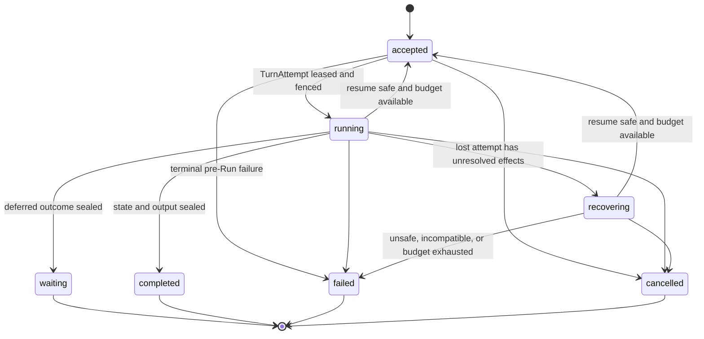
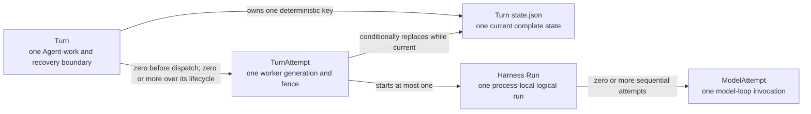
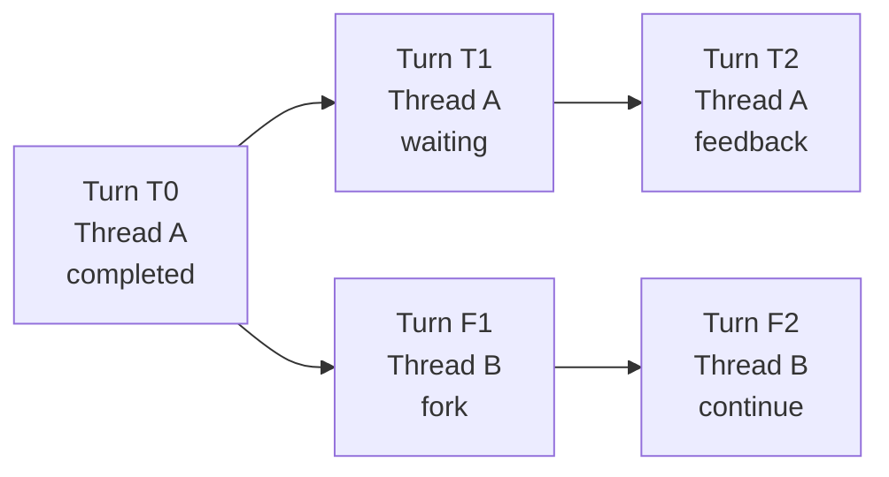
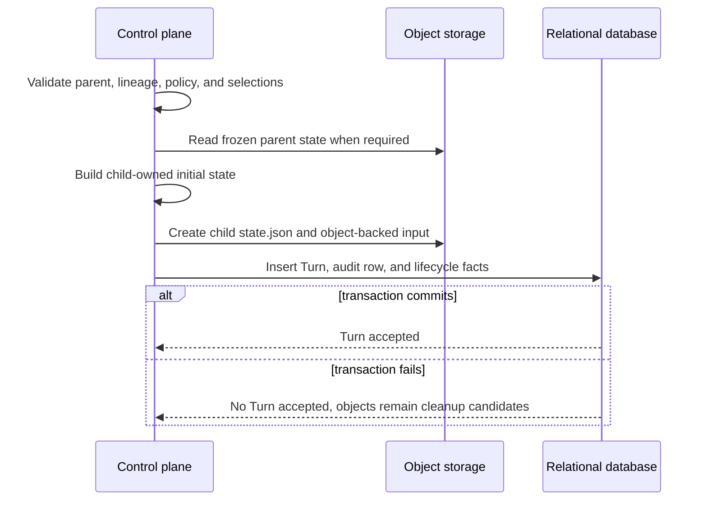

# Durable Turn State

## Design Position

Foundation Service persists exactly one relational `Turn` row as the durable
Agent-work identity, schedulable aggregate, recovery boundary, and Git-like
history node for one accepted advancement of a Thread. The Turn owns its
immutable parent edge, accepted input, exact definition selections, scheduling,
finite recovery budget, lifecycle, and sealed outcome.

Each accepted Turn also owns exactly one complete state object at a key derived
from its tenant and Turn identity. The control plane initializes that object
from a new root state or from the immutable state of the selected parent Turn.
During execution, the current fenced `TurnAttempt` conditionally replaces the
same object at complete Harness state boundaries. The object becomes immutable
when the Turn seals. Foundation does not persist a separate `base_state`,
`result_state`, or application-selectable checkpoint history.

Worker recovery creates a new fenced `TurnAttempt`, loads the same Turn's latest
valid state object, reconstructs fresh authority and bindings, and resumes from
that state. `continue` and `fork` instead create a child Turn and initialize a
new child-owned state object from the frozen parent state. No child state write
mutates the parent.

This is a Foundation Host persistence policy built on the Harness state API.
The Harness exports complete detached state but does not choose, publish, or
authorize a durable recovery point. Foundation selects the latest conditionally
committed value at the Turn's deterministic state key; Redis observations,
events, Items, object listings, and worker memory never participate in that
selection.

The shared [interaction model](../interaction-model.md) continues to own
`Session`, `Thread`, `Turn`, and `Item` meaning. Continuation and fork create
another Turn. An approval, deferred external result, or provider continuation
seals the current Turn as `waiting`; authenticated feedback advances the Thread
through another Turn.

Every Foundation operation that invokes an Agent first selects or creates a
Thread and accepts a Turn. Scheduled triggers, webhooks, and asynchronous child
Agents are Turn trigger and lineage variants, not standalone executions.
Reconciliation and maintenance work that does not invoke an Agent uses its
owning domain's work model. [`TurnAttempt`](13-turn-attempt-persistence.md)
remains a subordinate worker-generation and fencing record; Foundation defines
no generic `Execution` resource or `executions` table.

## Boundaries

| Concern                                                                   | Owner                                                                      | Contract                                                                                       |
| ------------------------------------------------------------------------- | -------------------------------------------------------------------------- | ---------------------------------------------------------------------------------------------- |
| Session, Thread, Turn, and Item meaning                                   | [Platform Interaction Model](../interaction-model.md)                      | Defines public identity and relationships                                                      |
| Portable messages, Capability namespaces, Environment data, and Thread ID | [Harness State](../agent-harness/10-snapshot-and-resume.md)                | Supplies detached state without Host authority                                                 |
| Turn row, parent edge, state selection, and outcome                       | Foundation Turn domain                                                     | Forms the authoritative interaction history and Turn-level recovery boundary                   |
| Scheduling, recovery budget, and current-attempt selection                | Foundation Turn domain                                                     | Authorizes initial dispatch, bounded recovery, and one sealed outcome                          |
| Worker generation, lease, and stale-writer fencing                        | [Turn Attempt Persistence](13-turn-attempt-persistence.md)                 | Authorizes one worker generation and preserves its immutable attempt audit                     |
| Current complete Turn state                                               | One deterministic Turn state object                                        | Stores the latest conditionally committed Harness and Host state; freezes when the Turn seals  |
| Provider resource launch, reattachment, and non-portable continuation     | Foundation Host state and selected provider integration                    | Reconstructs fresh bindings without becoming Harness state                                     |
| Object storage operations                                                 | [Object storage](02-storage.md#object-storage)                             | Supplies atomic whole-object publication and expected-version replacement                      |
| Lifecycle events, stream messages, and Items                              | [Lifecycle and Stream Persistence](14-lifecycle-and-stream-persistence.md) | Stores ordered facts, transports live observations, and retains presentation projections       |
| Turn-scoped audit and usage management                                    | Dedicated Turn auxiliary relational table                                  | Stores audit and usage fields by `turn_id` without acquiring Turn lifecycle or state authority |
| Pending calls and approvals                                               | Waiting Turn plus its frozen Turn state                                    | Stores a bounded relational summary and the complete deferred value without a separate table   |
| Tool and provider effect evidence                                         | `TurnAttempt` summary plus provider integration                            | Reconciles resume safety without a generic receipt table                                       |
| Credentials and invocation authority                                      | Foundation Secret and policy boundaries                                    | Resolves fresh authority; plaintext credentials never enter Turn state                         |

A Turn record is a logical wide aggregate, not a requirement to inline every
byte in one relational row. Bounded query and lifecycle fields live in the
relational record. The complete current Agent state lives at one deterministic
object key. Turn-scoped audit and usage data live in one dedicated relational
table keyed by `turn_id`. Pending data is embedded in the waiting Turn and its
state; effect evidence is embedded in the owning attempt; Items and stream
replay use Redis and object storage rather than relational tables.

## Durable Turn Model

The following Python-like schema is conceptual. It defines durable field
meaning rather than a public wire representation or concrete ORM class.

```python
type TurnLineageKind = Literal["root", "continue", "fork"]
type TurnStatus = Literal[
    "accepted",
    "running",
    "recovering",
    "waiting",
    "completed",
    "failed",
    "cancelled",
]
type TurnWaitReason = Literal[
    "approval",
    "external_tool_result",
    "provider_continuation",
    "multiple",
]
type PendingCallKind = Literal[
    "approval",
    "external_tool_result",
    "provider_continuation",
]


class TurnPayloadObjectRef:
    object_key: str
    digest_sha256: str
    size_bytes: int
    content_type: str
    schema_version: str


class PendingCallSummary:
    call_id: str
    kind: PendingCallKind
    tool_name: str | None
    provider_type: str | None
    arguments_digest_sha256: str | None
    presentation: JsonObject | None


class TurnPendingSummary:
    schema_version: Literal["1"]
    calls: tuple[PendingCallSummary, ...]
    resolution_policy: Literal["all"]


class RecoveryUsage:
    schema_version: Literal["1"]
    model_requests: int
    input_tokens: int
    output_tokens: int
    tool_invocations: int
    billable_units: dict[str, int]


class RecoveryUsageLimit:
    schema_version: Literal["1"]
    model_requests: int | None
    input_tokens: int | None
    output_tokens: int | None
    tool_invocations: int | None
    billable_units: dict[str, int]


class RecoveryBudget:
    policy_version: str
    max_attempts: int
    recovery_deadline_at: datetime | None
    max_usage: RecoveryUsageLimit | None


class SealedTurnState:
    digest_sha256: str
    size_bytes: int
    content_type: str
    envelope_schema_version: str
    harness_schema_version: str
    checkpoint_seq: int
    committed_by_turn_attempt_id: str | None


class Turn:
    id: str
    version: int
    tenant_id: str

    session_id: str
    thread_id: str
    parent_turn_id: str | None
    lineage_kind: TurnLineageKind

    trigger_type: str
    trigger_entity_type: str | None
    trigger_entity_id: str | None
    parent_agent_instance_id: str | None
    delegation_id: str | None
    parent_tool_call_id: str | None

    definition_id: str
    definition_version: int
    dependency_lock_digest: str
    model_integration_id: str | None
    model_integration_version: int | None

    priority: int
    queue_name: str
    available_at: datetime
    current_turn_attempt_id: str | None
    next_attempt_fence: int

    recovery_budget: RecoveryBudget
    attempts_started: int
    usage_charged: RecoveryUsage

    idempotency_key: str | None
    request_fingerprint: str

    status: TurnStatus
    wait_reason: TurnWaitReason | None
    input: JsonValue | None
    input_object: TurnPayloadObjectRef | None
    input_text: str | None
    output: JsonValue | None
    output_object: TurnPayloadObjectRef | None
    output_text: str | None
    failure: SafeFailure | None
    pending: TurnPendingSummary | None
    sealed_state: SealedTurnState | None

    created_at: datetime
    updated_at: datetime
    started_at: datetime | None
    waiting_at: datetime | None
    completed_at: datetime | None
    sealed_at: datetime | None
```

`id` is the Foundation-owned Turn identity and follows
[Platform Data Conventions](../data-conventions.md). `version` is the positive
Turn object version used for compare-and-swap relational mutation. The state
object key is derived from `tenant_id` and `id`; it is not duplicated in the
row and is never accepted from a caller.

`session_id`, `thread_id`, `parent_turn_id`, lineage, accepted input, definition
selections, accepted recovery policy, idempotency identity, and request
fingerprint are immutable after acceptance. Every version of the Turn state
must carry `turn_id` and `thread_id` equal to the owning Turn. Foundation
rejects another identity rather than rewriting it during read.

`sealed_state` is absent while the Turn is active. The sealing transaction
records the exact digest, size, schema versions, and checkpoint sequence of the
state object that becomes frozen with the Turn. The deterministic key plus
these fields identifies the exact terminal bytes without introducing a second
base or result object. `committed_by_turn_attempt_id` is null only when a
control-plane failure or cancellation seals a Turn without an attempt-originated
state change.

Every Turn can own zero attempts before dispatch and one or more immutable
`TurnAttempt` values over its lifetime. At most one attempt is current and
lease-authorized. A waiting outcome is not resumed in place: authenticated
feedback is accepted as another Turn with another state key and another Harness
Run.

`RecoveryBudget` is the accepted recovery-policy snapshot. `max_attempts`
includes the first attempt. `recovery_deadline_at` is a fixed UTC deadline;
`usage_charged` aggregates every attempt, including known usage from failed or
lost work. Every counter and limit is non-negative. A null limit is unbounded,
and missing usage is not treated as zero when the selected provider can
reconcile it. The Turn row is the sole authority for whether another attempt
may be created.

The exact definition revision, dependency lock, and selected model integration
are fixed at Turn acceptance. Resume never resolves an unqualified `latest`
definition or integration. A compatible continuation under another revision is
another Turn and records that revision directly.

Exactly one of `input` and `input_object` is present. At most one of `output`
and `output_object` is present, and neither is present before a completed
outcome. Inline values are bounded structured data suitable for direct Turn
reads. Oversized payloads use immutable objects. `input_text` and `output_text`
are optional bounded derived projections and never replace exact data or the
complete message history.

`waiting` is a sealed Turn outcome. It contains a bounded `pending` summary;
the frozen Turn state contains the authoritative deferred requests, effective
client-tool surface, and Host provider continuation. Authenticated feedback is
the accepted input of a child Turn initialized from that waiting state.
Foundation creates no pending-call or approval table.

### Turn Lifecycle



`accepted` means the complete Turn row, accepted input, exact selections,
recovery budget, scheduling fields, and initial or resumed state object are
durable; no attempt is current; and the scheduler may claim the Turn once
`available_at` is reached. It is both the initial scheduling state and the
state to which resume-safe work returns. It is not a queued user-input entry,
and Turn defines no `queued` state.

`running` means a current `TurnAttempt` is leased and fenced. `started_at`
records the first Harness Run entry and never changes during recovery.
`recovering` is a durable scheduling barrier after a lost attempt while
provider-owned evidence resolves whether the latest checkpoint can be resumed
safely. No attempt is current or claimable in `recovering`.

`waiting`, `completed`, `failed`, and `cancelled` are sealed outcomes.
`sealed_at` and `sealed_state` are selected in the same relational transaction.
A sealed Turn never changes any column and its state key is never overwritten.

Worker or lease loss terminalizes the current `TurnAttempt` as `lost`, clears
the current-attempt selection, charges known usage, and evaluates the Turn-owned
recovery budget and effect evidence. Resume-safe work returns to `accepted`;
unresolved effects move the Turn to `recovering`; unsafe or exhausted recovery
seals it as `failed`. A later attempt starts from the latest valid state at the
same Turn key with fresh bindings. It restores no live client, controller,
credential, socket, process handle, lease, or worker-local cursor.

### Key Entity Relationships



The first dispatch creates the initial `TurnAttempt`. Worker or lease loss can
create a later attempt under the same Turn only while the recovery budget and
effect reconciliation permit. Every later attempt claims and loads the same
Turn state key. Continuation, authenticated waiting feedback, and fork create
another Turn and another state key.

Every terminal `TurnAttempt` remains an immutable audit record. Attempt history
preserves worker generation, lease and fence correlation, Harness Run
correlation, timing, failure provenance, usage, bounded effect evidence, and
recovery-budget consumption without owning a second state record.

## Relational Turn Table

The conceptual `Turn` materializes as exactly one row in `turns`. PostgreSQL
uses `JSONB` for bounded structured values and timezone-aware timestamps. A
supported local relational backend preserves the same validation and query
semantics through equivalent types.

| Column group         | Columns                                                                                                                                                                                                                                         | Relational shape and contract                                                                    |
| -------------------- | ----------------------------------------------------------------------------------------------------------------------------------------------------------------------------------------------------------------------------------------------- | ------------------------------------------------------------------------------------------------ |
| Identity             | `id`, `version`, `tenant_id`                                                                                                                                                                                                                    | Opaque text IDs and a positive integer CAS version; `id` is the primary key                      |
| Interaction lineage  | `session_id`, `thread_id`, `parent_turn_id`, `lineage_kind`                                                                                                                                                                                     | Immutable after acceptance; parent is null only for a root                                       |
| Scheduling           | `priority`, `queue_name`, `available_at`, `current_turn_attempt_id`, `next_attempt_fence`                                                                                                                                                       | Durable claim order and the sole current worker generation                                       |
| Recovery budget      | `recovery_policy_version`, `max_attempts`, `recovery_deadline_at`, `max_usage_json`, `attempts_started`, `usage_charged_json`                                                                                                                   | Accepted finite limits and atomically charged consumption                                        |
| Idempotency          | `idempotency_key`, `request_fingerprint`                                                                                                                                                                                                        | Optional retry-safe acceptance identity and exact bounded request fingerprint                    |
| Trigger correlation  | `trigger_type`, `trigger_entity_type`, `trigger_entity_id`, `parent_agent_instance_id`, `delegation_id`, `parent_tool_call_id`                                                                                                                  | Bounded typed correlation; never state-lineage authority                                         |
| Definition selection | `definition_id`, `definition_version`, `dependency_lock_digest`, `model_integration_id`, `model_integration_version`                                                                                                                            | Exact immutable revisions selected at acceptance                                                 |
| Lifecycle            | `status`, `wait_reason`, `pending_json`                                                                                                                                                                                                         | Enum-constrained state; bounded pending summary exists exactly for `waiting`                     |
| Input                | `input_json`, `input_object_key`, `input_object_digest_sha256`, `input_object_size_bytes`, `input_object_content_type`, `input_object_schema_version`, `input_text`                                                                             | Exactly one inline JSON value or immutable object reference; optional text projection            |
| Output               | `output_json`, `output_object_key`, `output_object_digest_sha256`, `output_object_size_bytes`, `output_object_content_type`, `output_object_schema_version`, `output_text`                                                                      | Exactly one representation for completed Turns; absent otherwise                                 |
| Failure              | `failure_json`                                                                                                                                                                                                                                  | Bounded safe structured failure only; no raw exception                                           |
| Sealed state         | `sealed_state_digest_sha256`, `sealed_state_size_bytes`, `sealed_state_content_type`, `sealed_state_envelope_schema_version`, `sealed_state_harness_schema_version`, `sealed_state_checkpoint_seq`, `sealed_state_committed_by_turn_attempt_id` | Exact frozen state identity present only after sealing; object key is derived rather than stored |
| Time                 | `created_at`, `updated_at`, `started_at`, `waiting_at`, `completed_at`, `sealed_at`                                                                                                                                                             | UTC instants; lifecycle checks govern nullability                                                |

Object-reference columns form all-or-none groups. Inline JSON, text
projections, failures, trigger metadata, and every enum value are bounded
before the database transaction and constrained again at the domain write
boundary. Object keys and digests are data, not bearer authority.

The Turn row is mutable only while `sealed_at` is null. Every mutation uses the
expected positive `version`, increments it exactly once, and validates the
current `TurnAttempt` fence when worker activity originated the mutation. The
outcome transaction selects a terminal status, records the exact frozen state,
writes outcome-specific fields, and increments `version` atomically.

## Git-Like Turn DAG

`parent_turn_id` names the exact sealed Turn whose frozen state initialized the
new Turn. It is the sole interaction-history edge.



The lineage rules are:

1. A root Turn has `parent_turn_id=null`, `lineage_kind=root`, and a child-owned
   state initialized with `HarnessState.new()`.
2. An ordinary continuation has `lineage_kind=continue`, uses a completed
   parent in the same Thread, and initializes its state from the parent's frozen
   state while preserving `thread_id`.
3. Authenticated feedback has `lineage_kind=continue`, uses the exact waiting
   parent, initializes its state from that parent's frozen deferred state, and
   preserves `thread_id`.
4. A fork has `lineage_kind=fork`, uses a completed parent, transforms its
   frozen Harness state with `HarnessState.fork()`, retains only portable Host
   continuation, and initializes a new state with the new `thread_id`.
5. A child Agent that starts with independent empty history is a root of its own
   Thread. Structural or causal parentage uses trigger and delegation fields.
6. Worker resume preserves the Turn, Thread, parent edge, and state key. It does
   not add a DAG node.
7. Failed and cancelled Turns remain queryable but are not eligible parents.

Foundation serializes successful advancement of one Thread. At most one Turn
with a given `(thread_id, parent_turn_id)` can be active or seal as `waiting` or
`completed`; failed and cancelled siblings do not block a later accepted
advancement from the same eligible parent. Acceptance locks or conditionally
updates the selected parent and fails with a conflict if another advancing
child already won. An explicit fork creates a new Thread.

A lineage read follows `parent_turn_id` from an explicitly selected head. It is
tenant-scoped, cycle-safe, and bounded. Created time and event order are not
lineage authority.

### Turn Lineage Read API

Foundation exposes the exact ancestor path of one caller-selected Turn through:

```http
GET /api/v1/turns/{turn_id}/lineage
```

The route follows the shared [API conventions](../api-conventions.md). It does
not infer a latest Turn or accept a Thread selector as a substitute for the
head. Its direct response has this conceptual shape:

```python
class TurnLineageItem:
    turn_id: str
    session_id: str
    thread_id: str
    parent_turn_id: str | None
    lineage_kind: TurnLineageKind
    status: TurnStatus
    depth_from_head: int
    created_at: datetime


class TurnLineage:
    head_turn_id: str
    items: tuple[TurnLineageItem, ...]
```

`items` is ordered from root to the selected head. The head has
`depth_from_head=0`; its parent has depth `1`. The path crosses Session and
Thread boundaries when a retained `parent_turn_id` does, so selecting a Turn in
a forked Thread includes the exact pre-fork ancestors. It never includes a
sibling, another child of an ancestor, or a descendant of the selected head.

The service authorizes the selected head and every ancestor under the current
tenant, principal, visibility, archival, and retention policy. Absence or
concealed denial of the head returns `404 turn_not_found`. A missing or
unauthorized ancestor, a cycle, or a path deeper than 1,000 Turns returns
`409 turn_lineage_invalid` with safe reason `missing_parent`, `cycle`, or
`max_depth`; the route never returns a complete-looking prefix. The complete
bounded path is one direct response and is not cursor-paginated.

The relational implementation uses one recursive query rather than issuing one
query per ancestor. The following SQL is conceptual; equivalent SQLAlchemy and
supported local-backend forms preserve the same predicates and failures:

```sql
WITH RECURSIVE lineage AS (
    SELECT
        t.id,
        t.parent_turn_id,
        t.session_id,
        t.thread_id,
        t.lineage_kind,
        t.status,
        t.created_at,
        0 AS depth_from_head,
        ARRAY[t.id] AS visited,
        FALSE AS cycle
    FROM turns AS t
    WHERE t.tenant_id = :tenant_id
      AND t.id = :head_turn_id

    UNION ALL

    SELECT
        parent.id,
        parent.parent_turn_id,
        parent.session_id,
        parent.thread_id,
        parent.lineage_kind,
        parent.status,
        parent.created_at,
        child.depth_from_head + 1,
        child.visited || parent.id,
        parent.id = ANY(child.visited)
    FROM lineage AS child
    JOIN turns AS parent
      ON parent.tenant_id = :tenant_id
     AND parent.id = child.parent_turn_id
    WHERE child.cycle = FALSE
      AND child.depth_from_head < 999
)
SELECT *
FROM lineage
ORDER BY depth_from_head DESC;
```

The implementation separately proves that traversal reached a root and that no
cycle or depth truncation occurred. Authorization is applied as part of the
relational predicate or an equivalently non-bypassable repository boundary.

If the selected head has `A` ancestors before its fork point and `L` ancestors
in its local forked lineage, traversal visits `A + L + 1` Turn rows. One
database round trip avoids an N+1 query pattern, but work and temporary path
state remain `O(A + L)`. Reading a Turn forked from a deep history therefore
costs proportionally to the number of Turns before the fork.

## Turn State Object

Each accepted Turn owns one `TurnStateEnvelope`. It combines Harness portable
state with Host continuation required to resume the same Turn or initialize a
child Turn. It contains data and correlation, never current authority.

```python
type ContinuationScope = Literal["same_thread", "portable"]
type TurnStateCheckpointKind = Literal[
    "initial",
    "progress",
    "waiting",
    "completed",
]
type TurnInputDisposition = Literal["pending", "applied"]


class ContinuationChildObjectRef:
    object_key: str
    digest_sha256: str
    size_bytes: int
    content_type: str
    schema_version: str


class EntityRevisionRef:
    entity_type: str
    entity_id: str
    version: int
    digest_sha256: str


class ProviderContinuationEntry:
    resource_kind: str
    binding_id: str
    provider_type: str
    state_version: str
    continuation_scope: ContinuationScope
    required: bool
    observed_generation: str | None
    inline_payload: JsonValue | None
    provider_payload_object: ContinuationChildObjectRef | None


class ProviderPendingRequest:
    call_id: str
    provider_type: str
    request_schema_version: str
    request: JsonObject


class DeferredContinuationState:
    schema_version: Literal["1"]
    requests: JsonObject
    effective_client_tool_surface: JsonValue | None
    effective_surface_digest_sha256: str | None
    provider_requests: tuple[ProviderPendingRequest, ...]


class HostContinuationState:
    schema_version: Literal["1"]
    desired_environment_topology: EntityRevisionRef | None
    provider_entries: tuple[ProviderContinuationEntry, ...]
    deferred: DeferredContinuationState | None


class TurnStateOutcomeCandidate:
    outcome: Literal["waiting", "completed"]
    wait_reason: TurnWaitReason | None
    pending: TurnPendingSummary | None
    output: JsonValue | None
    output_object: TurnPayloadObjectRef | None
    output_text: str | None


class TurnStateEnvelope:
    schema_version: Literal["1"]
    turn_id: str
    thread_id: str
    checkpoint_seq: int
    checkpoint_kind: TurnStateCheckpointKind
    input_disposition: TurnInputDisposition
    last_checkpoint_turn_attempt_id: str | None
    last_checkpoint_fence: int

    definition_id: str
    definition_version: int
    dependency_lock_digest: str
    harness_schema_version: str
    harness: HarnessState
    host: HostContinuationState
    outcome_candidate: TurnStateOutcomeCandidate | None
```

This is the complete serialized outer schema. `HarnessState` is encoded through
its owning public adapter and carries the same `thread_id`. `checkpoint_seq`
starts at zero and increases monotonically for each successful semantic state
replacement. The initial value has `checkpoint_kind=initial`,
`input_disposition=pending`, no attempt identity, fence zero, and no outcome
candidate.

The first checkpoint after the accepted Turn input has crossed the Harness
input boundary sets `input_disposition=applied`. Every later progress or outcome
checkpoint retains `applied`. This field prevents a later attempt from injecting
the same accepted input twice: a pending initial state receives the Turn input;
an applied state resumes directly from its exported Harness and Host state.

`checkpoint_kind=progress` contains no outcome candidate.
`checkpoint_kind=waiting` or `completed` contains the matching complete
`outcome_candidate`. A waiting candidate has a non-empty pending summary, no
output, and complete deferred state in `host.deferred`. A completed candidate
has an output representation, no pending summary, and no deferred state. The
candidate is durable preparation for the relational outcome transaction; it is
not a sealed Turn outcome by itself.

Provider payloads remain provider-owned JSON under `state_version`. Exactly one
of a provider entry's `inline_payload` and `provider_payload_object` can be
present. A required entry has one; an optional entry can request fresh
materialization. `provider_requests` carries only Host/provider suspension
values not represented by Pydantic deferred requests. Its call IDs and those
inside `requests` are disjoint, and their union equals the waiting pending
summary.

The envelope separates two state classes:

| State class             | Contents                                                                                                                          | Restore rule                                                                                  |
| ----------------------- | --------------------------------------------------------------------------------------------------------------------------------- | --------------------------------------------------------------------------------------------- |
| Harness portable state  | Thread ID, messages, Capability namespaces, portable Environment binding data                                                     | Validated by Harness and owning codecs after fresh bindings exist                             |
| Host continuation state | Desired-topology revision, provider launch or reattachment data, and optional complete deferred request and client-surface values | Validated and consumed by Foundation and selected integrations before or around Harness entry |

The envelope never contains a live Python object, plugin, Model, Toolset,
Capability, client, socket, process handle, Environment controller, plaintext
credential, bearer token, lease, readiness observation, or worker-local output
cursor. Credential authority is resolved freshly through Secret and policy
boundaries.

`continuation_scope` bounds child initialization:

| Scope         | Permitted reuse                                                                                         |
| ------------- | ------------------------------------------------------------------------------------------------------- |
| `same_thread` | A child Turn preserving `thread_id`                                                                     |
| `portable`    | A child in the same Thread or an explicit fork after current authorization and compatibility validation |

Fork drops entries that are not portable. A missing optional entry causes fresh
provider materialization. A required entry that is unavailable, incompatible,
malformed, or unauthorized fails before model or tool work.

### State Initialization and Resume Matrix

| Concern                                       | Root Turn                                                   | Continue or waiting-feedback Turn                                                    | Fork Turn                                                                       | Later attempt for the same Turn                               |
| --------------------------------------------- | ----------------------------------------------------------- | ------------------------------------------------------------------------------------ | ------------------------------------------------------------------------------- | ------------------------------------------------------------- |
| Turn and state identity                       | Allocate a Turn and deterministic child-owned state key     | Allocate a child Turn and new key; name the exact sealed parent                      | Allocate a child Turn, new Thread, and new key                                  | Preserve Turn, Thread, parent edge, and state key             |
| Harness state                                 | Create `HarnessState.new()`                                 | Copy the parent's frozen Harness state and preserve `thread_id`                      | Apply `HarnessState.fork()` and use its new `thread_id`                         | Load the latest valid state at the same key                   |
| Host provider continuation                    | Build from desired topology and current provider selections | Retain eligible entries; waiting feedback retains the exact deferred value initially | Retain only eligible `portable` entries; clear parent outcome and deferred data | Validate state entries against fresh provider resources       |
| Accepted input                                | Store on the Turn; initial state marks it pending           | Store child input on the Turn; initial state marks it pending                        | Store child input on the Turn; initial state marks it pending                   | Apply only when pending; otherwise resume without reinjection |
| Definition and integration                    | Pin exact child selections                                  | Pin exact child selections and validate inherited data                               | Pin exact child selections and validate portable inherited data                 | Reuse exact selections pinned on the Turn                     |
| Policy, Secrets, bindings, tools, and clients | Resolve fresh for the Harness Run                           | Resolve fresh and reauthorize retained selectors                                     | Resolve fresh and reauthorize retained portable selectors                       | Resolve fresh; state never grants current authority           |

Child initialization always writes a complete child-owned envelope with
`checkpoint_seq=0`. It does not reference the parent state as a base, retain the
parent's outcome candidate as the child's outcome, or create another state
field on the child Turn. Parent state is only immutable source data for this
initialization.

### State Key, Conditional Writes, and Fencing

The state key is deterministic and stable for the lifetime of the Turn:

```text
tenants/{tenant_id}/turns/{turn_id}/state.json
```

The content type is `application/vnd.converge.turn-state+json`. Object metadata
records `schema-version`, `turn-id`, `thread-id`, `checkpoint-seq`,
`writer-fence`, and the lowercase SHA-256 digest of the canonical body. Object
stat supplies exact byte size and the opaque current object version.

Acceptance publishes the initial object create-only. A current attempt does not
write until it has conditionally claimed the current object version for its
monotonic Turn fence. Every state replacement then supplies the exact object
version returned by the claim or previous successful write. The replacement is
visible as the complete new object or not visible at all.

Before each write, Foundation verifies that the Turn remains unsealed and that
the attempt ID, fence, lease, tenant, and Turn version are current. It holds no
database transaction across object I/O. Expected-version replacement serializes
the object writes: after a newer attempt claims the key, an older attempt's
known object version can no longer overwrite it. A conflict causes a fresh Turn
and object-state decision; it is never retried as an unconditional put.

Foundation exposes no checkpoint object ID and never selects an older object
version. A storage backend can retain physical versions internally, but those
versions are backup or provider implementation details, not application-visible
checkpoint objects. Logically, one Turn has one key and one current state.

### Resume Semantics

Foundation writes state only after `HarnessRunStream.export_state()` produces a
complete structurally valid state and Host continuation has been serialized
under its bounds. Raw token deltas, incomplete private graph nodes, live
bindings, and process-local handles never enter the object.

When a current attempt is lost, Foundation first fences it and reconciles any
possibly dispatched side effect. A later attempt can be created only after that
decision and budget validation. It claims the existing state key, validates the
envelope and provider continuation, reconstructs fresh bindings, and resumes:

- `input_disposition=pending` starts from the initialized state and supplies
  the Turn's exact accepted input;
- `input_disposition=applied` resumes from the checkpoint without supplying the
  accepted input again;
- a valid waiting or completed outcome candidate can be committed idempotently
  without repeating model or tool work when its relational outcome was not yet
  sealed.

The resume point is the current state object, not an event cursor, latest object
listing result, lifecycle timestamp, retained Item, or state from another Turn.
If work occurred after the last successful conditional write, that work is not
part of the resume point. Unknown effects in that interval follow the provider
reconciliation contract and can block automatic resume.

## Other Object Storage Schemas

All JSON objects serialize as UTF-8 RFC 8785 canonical JSON after typed values
are converted to declared JSON strings. Digests and sizes cover those exact
bytes. Non-finite numbers and duplicate object keys are invalid.

Foundation Turn persistence uses these serialized object types:

| Object type                           | Content type                                                  | Owner                                                    |
| ------------------------------------- | ------------------------------------------------------------- | -------------------------------------------------------- |
| `TurnStateEnvelope`                   | `application/vnd.converge.turn-state+json`                    | One deterministic, conditionally replaced Turn state key |
| `TurnPayloadEnvelope`                 | `application/vnd.converge.turn-payload+json`                  | Immutable oversized Turn input or output                 |
| `ProviderContinuationPayloadEnvelope` | `application/vnd.converge.provider-continuation-payload+json` | Immutable nested payload referenced by Host continuation |

[Lifecycle and Stream Persistence](14-lifecycle-and-stream-persistence.md)
separately owns `TurnReplaySnapshot`.

### Turn Payload Object

```python
class TurnPayloadEnvelope:
    schema_version: Literal["1"]
    turn_id: str
    payload_kind: Literal["input", "output"]
    payload_schema_version: str
    payload: JsonValue
```

The object key is content-addressed beneath the Turn:

```text
tenants/{tenant_id}/turns/{turn_id}/payloads/{payload_kind}/{digest_sha256}.json
```

Exactly one of inline JSON and a payload object is present for input. Output has
one representation only for `completed`. Attachments and file bodies remain
separate artifact objects referenced by the structured payload.

### Provider Continuation Payload Object

```python
class ProviderContinuationPayloadEnvelope:
    schema_version: Literal["1"]
    owner_turn_id: str
    provider_type: str
    payload_schema_version: str
    payload: JsonValue
```

Provider payload keys are content-addressed beneath their owner:

```text
tenants/{tenant_id}/turns/{turn_id}/provider-continuations/{provider_type_digest_sha256}/{digest_sha256}.json
```

The selected provider owns `payload_schema_version` and payload meaning.
Foundation preserves the value as versioned JSON and never interprets an
unknown provider through generic fallback. Plaintext credentials and bearer
tokens remain forbidden.

### Reachability and Retention

An object-backed input and initial Turn state publish before Turn acceptance.
Nested provider payload objects publish before the state that references them.
If relational acceptance fails, the create-only child state and input objects
are non-authoritative orphans eligible for bounded cleanup.

The Turn state key itself is authoritative only for an accepted Turn. A
waiting or completed outcome candidate becomes a sealed outcome only when the
relational transaction records the matching digest and checkpoint sequence.
Object listing, key order, last-modified time, and provider version history
never discover an input, state edge, checkpoint, or outcome.

Retention never removes a state or nested provider object while a retained Turn
or descendant depends on it. A parent state remains frozen and reachable while
any child or lineage policy requires it. Reference-aware deletion traverses
nested provider payload references and never relies on object age alone.

## Turn Acceptance, Checkpoint, and Outcome Commit

Turn acceptance creates the Turn row and its initial state as one externally
indivisible acceptance operation:

1. validate the authorized parent and lineage operation;
2. allocate `turn_id` and derive its state key;
3. read and validate the frozen parent state when continuing or forking, then
   build a complete child-owned initial state; root builds new state;
4. publish object-backed input and the initial state create-only;
5. in one short transaction, insert the Turn as `accepted`, insert its
   `turn_audit_usage` row, and append required lifecycle facts;
6. commit all relational facts together or roll them back.



A standalone non-Agent work record follows its owning domain and creates no
empty Turn. User input waiting in an intake queue is not a Turn until this
acceptance operation commits.

### Checkpoint Triggers and Refresh

During an active Harness Run, Foundation requests a progress checkpoint only
at a complete public state boundary:

1. after the accepted Turn input has crossed the Harness input boundary and
   before the first model request;
2. after a complete tool batch and its results have entered the next complete
   message boundary, before another model request;
3. between internal `ModelAttempt` values when the Harness exposes a new
   complete normalized state.

A waiting or completed Harness outcome always triggers its matching outcome
checkpoint. Raw stream deltas, an in-flight model response, an incomplete tool
batch, an active inline child, a lease heartbeat, and elapsed time alone never
trigger state publication. Adjacent progress triggers with no Harness or Host
state change are coalesced rather than creating duplicate checkpoints.

During execution, a checkpoint operation:

1. exports complete Harness state and builds bounded Host state;
2. publishes any new immutable nested provider payload before the state that
   references it;
3. validates current Turn, attempt, fence, lease, and expected object version;
4. conditionally replaces the same `state.json` with the next checkpoint
   sequence and matching metadata;
5. treats only the returned object version as the next valid write token.

Checkpoint writes do not create a Turn row, attempt row, lifecycle transition,
or historical checkpoint selector. A failed or unknown put is reconciled by
`stat` and exact body validation before any retry.

A waiting or completed outcome commits in this order:

1. publish any immutable object-backed output or nested provider payload;
2. conditionally replace `state.json` with a complete matching outcome
   candidate;
3. in one short transaction, revalidate current Turn and `TurnAttempt`, select
   the candidate's exact digest and checkpoint sequence as `sealed_state`, copy
   its bounded output or pending summary into the Turn row, terminalize the
   attempt, charge known usage, append lifecycle facts, and seal the Turn;
4. after commit, reject every later write to the state key.

If the object write succeeds but the relational transaction does not commit,
the Turn remains active and the outcome candidate remains a valid resumable
state, not a sealed outcome. The current attempt or an authorized later attempt
can retry the exact relational commit after reconciliation. Object timestamps
or listings never authorize that adoption.

A failed or cancelled outcome freezes the latest valid state by recording its
digest and checkpoint sequence while sealing the relational outcome. It does
not make that state eligible as a parent.

## Pending, Events, Items, and Effects

| Associated data                    | Persistence meaning                                                                                                                            |
| ---------------------------------- | ---------------------------------------------------------------------------------------------------------------------------------------------- |
| Pending client calls and approvals | `pending_json` stores the bounded waiting summary; frozen Turn state stores exact deferred requests; child input stores authenticated feedback |
| Lifecycle events                   | `lifecycle_events` appends ordered facts in the owning Turn transaction                                                                        |
| Stream events and Items            | One Turn Redis Stream carries live messages; one immutable replay snapshot stores retained presentation                                        |
| Tool and provider effects          | Bounded evidence lives in `turn_attempts.effect_evidence_json`; provider-specific ledgers remain provider-owned                                |
| Audit and usage                    | One `turn_audit_usage` row stores Turn-scoped audit context and accounting aggregates                                                          |

Waiting feedback is validated against both `pending_json` and the exact
deferred value in the frozen parent state. The acceptance transaction creates
or idempotently returns the one permitted child Turn. The sealed waiting parent
is never updated with a mutable resolution status.

No lifecycle event, Redis entry, replay object, Item, accounting row, or effect
summary can replace the Turn state, prove a provider-native side effect, or
authorize another attempt.

## Turn Audit and Usage Separation

Exactly one `turn_audit_usage` row exists for each accepted Turn:

```python
class TurnAcceptanceAuditContext:
    schema_version: Literal["1"]
    request_id: str
    idempotency_key_digest: str | None
    authentication_method: str
    policy_decision_id: str | None


class TurnUsageAggregate:
    schema_version: Literal["1"]
    source_attempt_ids: tuple[str, ...]
    counters: dict[str, int]
    billable_units: dict[str, int]
    finalized: bool
```

| Column group           | Columns                                                                                        | Contract                                                                                  |
| ---------------------- | ---------------------------------------------------------------------------------------------- | ----------------------------------------------------------------------------------------- |
| Identity               | `turn_id`, `tenant_id`, `version`                                                              | `turn_id` is the primary key and same-tenant foreign key; `version` is positive CAS state |
| Acceptance audit       | `accepted_actor_type`, `accepted_actor_id`, `acceptance_context_json`                          | Bounded authenticated actor and request provenance                                        |
| Attempt correlation    | `last_turn_attempt_id`                                                                         | Most recent attempt represented by the aggregates; query correlation only                 |
| Usage                  | `model_usage_json`, `tool_usage_json`, `provider_usage_json`, `recovery_usage_projection_json` | Bounded additive aggregates plus a non-authoritative projection of Turn-charged usage     |
| Pricing and settlement | `pricing_revision_id`, `settlement_status`, `settlement_id`, `settlement_error_json`           | Independent pricing snapshot and settlement lifecycle                                     |
| Time                   | `created_at`, `updated_at`, `settled_at`                                                       | UTC accounting observations                                                               |

The row is inserted with Turn acceptance. Attempt usage updates require stable
source IDs and the current attempt fence while execution is active; later
pricing and settlement updates use their own idempotency and CAS contract and
cannot mutate the sealed Turn. `recovery_usage_projection_json` can lag and
cannot grant or block another attempt.

## Relational Constraints and Queries

The `turns` table follows the
[Relational Schema Lifecycle](03-relational-schema.md) and preserves these
constraints:

01. `id` is the primary key. `(tenant_id, id)` is also unique so the parent
    foreign key is same-tenant.
02. Row versions, definition versions, model-integration versions when present,
    checkpoint sequences, and object sizes are valid non-negative or positive
    values according to their field contracts.
03. Tenant, Session, Thread, parent, lineage kind, trigger, definition,
    accepted input, recovery policy, idempotency identity, and request
    fingerprint never change after insertion.
04. Input has exactly one inline or object-backed representation. Output has
    exactly one representation only for `completed`.
05. `wait_reason`, non-empty `pending_json`, and `waiting_at` exist exactly for
    `waiting`; output and `completed_at` exist exactly for `completed`; failure
    exists exactly for `failed`; `sealed_at` and the complete sealed-state group
    exist exactly for every sealed status.
06. A waiting or completed sealed-state digest matches a state envelope with the
    same outcome candidate, Turn ID, Thread ID, and relational output or pending
    fields. Failed and cancelled Turns are never eligible parents.
07. Updates require expected `version`; attempt-originated updates also require
    the current attempt, fence, and lease. Every update to a sealed row is
    rejected.
08. `current_turn_attempt_id` is present exactly for `running`, names the one
    current attempt of the same Turn and tenant, and is absent for `accepted`,
    `recovering`, and every sealed status.
09. Ordinary continuation and fork require a completed parent. Waiting feedback
    requires the exact waiting parent and consumes all pending calls.
10. `attempts_started` is non-negative and no greater than `max_attempts`.
    `max_attempts` and `next_attempt_fence` are positive; every usage counter
    and configured usage limit is non-negative.

The accepted access paths are:

| Access path                       | Index or uniqueness contract                                                                                                                        |
| --------------------------------- | --------------------------------------------------------------------------------------------------------------------------------------------------- |
| Scheduler claim                   | `(tenant_id, queue_name, status, available_at, priority, created_at, id)` for `accepted`                                                            |
| Idempotent acceptance             | Unique `(tenant_id, idempotency_key)` when the key exists                                                                                           |
| Session activity                  | `(tenant_id, session_id, created_at, id)`                                                                                                           |
| Thread activity and stable paging | `(tenant_id, thread_id, created_at, id)`                                                                                                            |
| DAG child traversal               | `(tenant_id, parent_turn_id, id)`                                                                                                                   |
| DAG ancestor traversal            | Unique `(tenant_id, id)` parent lookup at each recursive step                                                                                       |
| One active Turn per Thread        | Partial unique `(tenant_id, thread_id)` for `accepted`, `running`, and `recovering`                                                                 |
| One winning child per state edge  | Partial unique `(tenant_id, thread_id, parent_turn_id)` for `accepted`, `running`, `recovering`, `waiting`, and `completed` when parent is non-null |
| One root history per Thread       | Partial unique `(tenant_id, thread_id)` for `accepted`, `running`, `recovering`, `waiting`, and `completed` when parent is null                     |

The default Thread history query selects an explicit waiting or completed head
and follows its parent chain. Session activity can separately include active,
failed, cancelled, child-Thread, and causal records. Created-time ordering and
Session membership never invent a state edge.

## Security and Protection

Turn input, output, Harness state, Capability state, Environment state, provider
continuation, pending summaries, deferred requests, and Turn-scoped audit and
usage records are sensitive tenant data. Relational and object reads are
tenant-scoped and reauthorized. Object keys and Turn IDs grant no access by
possession.

State and payload objects use authenticated integrity verification and
deployment-approved encryption at rest. Plaintext credentials, bearer
authorization, Secret values, and ephemeral credential leases never enter a
Turn row, state object, event, Item, error, trace, or ordinary log.

Fork, continuation, and resume re-evaluate current policy, definition
eligibility, provider availability, Capability composition, tool grants,
Environment topology, and resource compatibility. Persisted state is data and
correlation, not authority. Unknown Capability or provider payloads survive
only under their own forward-compatible rules and are never executed or
attached by generic fallback.

## Failure and Recovery Semantics

| Failure or interruption                                                      | Durable outcome                                              | Recovery rule                                                                                         |
| ---------------------------------------------------------------------------- | ------------------------------------------------------------ | ----------------------------------------------------------------------------------------------------- |
| Initial state or input publication fails                                     | No Turn is accepted                                          | Retry under the acceptance idempotency contract                                                       |
| Initial objects publish but relational acceptance fails                      | Objects are non-authoritative orphans                        | Cleanup removes them after proving no accepted Turn owns the key                                      |
| Conditional state write conflicts                                            | Existing complete state remains visible                      | Re-read Turn and object versions; stale writers stop                                                  |
| State write response is lost                                                 | Replacement effect is unknown                                | Reconcile by deterministic key, metadata, and opaque version before retrying                          |
| Terminal candidate writes but relational seal fails                          | Turn remains active; candidate is a resumable prepared state | Current or later authorized attempt can retry exact sealing after reconciliation                      |
| Stale `TurnAttempt` writes state, lifecycle, usage, pending data, or outcome | Write is rejected by Turn and object fencing                 | Current attempt continues; stale work is cancelled best-effort                                        |
| Worker disappears after a committed checkpoint                               | Latest state remains at the same key                         | Later fenced attempt reconstructs fresh bindings and resumes according to `input_disposition`         |
| Worker disappears after uncheckpointed work                                  | Only the prior checkpoint is recoverable                     | Reconcile possible side effects before resume; never infer missing progress from events               |
| Recovery budget is exhausted                                                 | Turn seals as `failed`                                       | Product retry creates another Turn from an eligible parent                                            |
| Required state or provider data is incompatible or unavailable               | No model or tool work starts                                 | Apply an explicit compatible reader or fail the Turn                                                  |
| State object is missing or fails integrity validation                        | Turn remains authoritative but unreadable                    | Fail closed and restore that exact key from protected recovery data; never substitute listing results |
| Waiting feedback is invalid or mismatches frozen deferred requests           | Waiting Turn remains unchanged                               | Reject input; do not create a child Turn                                                              |
| Parent is absent, unauthorized, unsealed, ineligible, cyclic, or advanced    | Acceptance or lineage read fails                             | Caller re-reads authorized history or requests an explicit fork                                       |
| Write is attempted after Turn sealing                                        | Frozen state and outcome remain unchanged                    | Reject even if the caller has process-local bytes or a stale object version                           |

Cancellation before durable acceptance creates no Turn. Cancellation after
acceptance follows the Turn lifecycle and freezes the latest valid state but
does not make the Turn an eligible parent. A lost client response after possible
acceptance is reconciled through the API idempotency contract.

Checkpoint resume is semantic continuation, not deterministic replay. Work
after the last checkpoint can be repeated and can consume more usage. Unknown
or non-idempotent effects block automatic resume until their provider or Host
reconciliation contract establishes a safe next action.

## Compatibility

The compatibility axes remain independent:

| Version                                  | Owner                                    |
| ---------------------------------------- | ---------------------------------------- |
| Turn domain object version               | Foundation Turn mutation contract        |
| Relational schema revision               | Foundation Service migration history     |
| `TurnStateEnvelope.schema_version`       | Foundation Turn state contract           |
| Turn payload object schema version       | Foundation Turn payload contract         |
| `HarnessState.schema_version`            | Agent Harness                            |
| Capability state version                 | Owning Capability                        |
| Environment state version                | Owning Environment provider              |
| Host provider continuation version       | Selected Foundation provider integration |
| Definition and model-integration version | Foundation immutable revision domains    |

An unknown required state, payload, Harness, Capability, Environment, or
provider version fails explicitly unless its owner supplies a compatible
reader or migration. A sealed parent state is never rewritten for child
compatibility; child initialization reads and transforms it into the new
child-owned state. An active Turn migration, when supported, is another fenced
conditional replacement of the same key.

Relational migrations never reinterpret state bytes through current defaults.
Adding a provider resource kind or trigger kind is additive only when old
readers preserve it as unknown without attaching, executing, or authorizing it.

## Trade-offs

One stable state key removes the duplicated base/result state model and makes a
Turn's current recovery value direct. It also introduces durable writes during
execution and makes conditional-write fencing part of recovery correctness.

| Dimension                 | Foundation choice                                                                                                 |
| ------------------------- | ----------------------------------------------------------------------------------------------------------------- |
| State ownership           | One Turn owns one current state key; parent state is initialization input, not a child field                      |
| Checkpoint storage        | Replace the same key; do not create or select an application-visible checkpoint history                           |
| Recovery computation      | Resume from the latest complete state, reducing repeated model and tool work                                      |
| Concurrency               | Require object expected-version replacement plus current `TurnAttempt` fencing                                    |
| Historical rollback       | Not supported through Turn state; protected storage versions remain backup concerns                               |
| Child initialization cost | Read and serialize a complete child state, so long Thread histories can be copied into each advancing Turn        |
| External side effects     | Reconcile the interval after the last checkpoint because state persistence alone cannot make effects exactly once |

Keeping only `parent_turn_id` makes ordinary acceptance and child reads small,
but an exact lineage query must recursively visit every ancestor. A fork from a
deep source therefore has lineage-read cost linear in the number of pre-fork
Turns even though traversal uses one bounded relational query.

## Invariants

01. Foundation has one durable Agent-work and recovery boundary: the Turn.
02. Every accepted Turn owns exactly one deterministic `state.json` key.
03. A Turn stores no separate `base_state`, `result_state`, or selectable
    checkpoint-history reference.
04. Root constructs new state; continue initializes child state from the frozen
    parent state; fork transforms frozen parent state into a new Thread.
05. Child initialization writes a complete child-owned state and never mutates
    or aliases the parent key.
06. During an active Turn, only the current leased and fenced `TurnAttempt` can
    conditionally replace the state key.
07. `checkpoint_seq` increases monotonically, and object expected-version
    replacement prevents a stale known version from overwriting a newer one.
08. `input_disposition` determines whether the exact accepted Turn input is
    supplied or has already been applied; recovery never injects it twice.
09. A later attempt preserves the Turn, Thread, parent edge, accepted input,
    exact selections, and state key while reconstructing fresh authority.
10. Waiting is a sealed Turn outcome. Authenticated feedback creates a child
    Turn rather than mutating or resuming the waiting Turn.
11. Every Turn advances exactly one Thread, and every state version carries
    that Turn's `turn_id` and `thread_id`.
12. `parent_turn_id` is the sole semantic history edge; cause, delegation,
    attempt, event, and time relationships never substitute for it.
13. Failed and cancelled Turns never advance committed Thread history.
14. A stale attempt cannot advance state, Turn lifecycle, events, pending
    summary, usage, effect evidence, or outcome.
15. A waiting or completed outcome becomes authoritative only after its state
    candidate and relational seal identify the same digest and checkpoint.
16. A sealed Turn row and its state key are immutable.
17. Lifecycle events, Redis entries, Items, replay objects, accounting records,
    object listings, provider metadata, and worker memory never select state.
18. Harness portable data and Host provider continuation remain distinct parts
    of the complete Turn state envelope.
19. Persisted state restores data and correlation, never credentials, current
    policy, provider attachment authority, a live resource, or permission to
    repeat an unknown side effect.
20. Turn-scoped audit and usage fields live in exactly one
    `turn_audit_usage` row and never become another state authority.
21. A waiting Turn embeds one bounded pending summary and freezes the complete
    deferred value in its state; Foundation has no pending table.
22. Foundation has no generic `Execution`, relational Item, stream-replay,
    tool-receipt, or provider-receipt table.
23. A lineage read starts from one explicit head, follows only
    `parent_turn_id` across Session and Thread boundaries, excludes siblings,
    and fails rather than returning a partial path.
