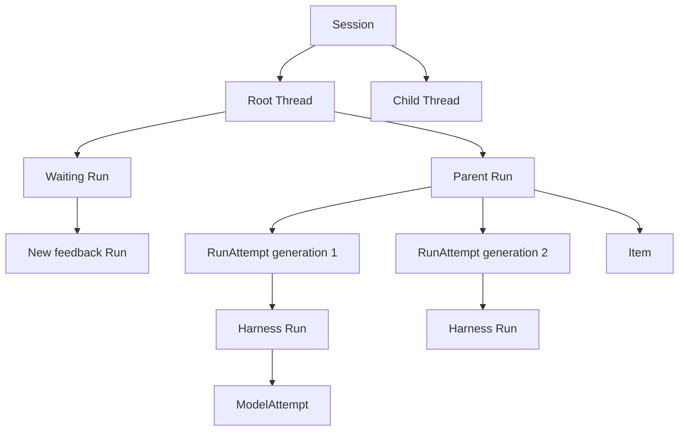

# Interactions, Runs, and Attempts

## Design Position

Foundation implements the shared [`Session`, `Thread`, `Run`, and `Item`](../interaction-model.md) interaction model directly as its durable Agent-work model. A `Run` is one accepted scheduling, recovery, state, and terminal-outcome boundary. A `RunAttempt` is one replaceable fenced worker generation for that Run. Foundation defines no separate durable `Execution` or `ExecutionAttempt` resource.

Every Foundation-managed AgentPreset invocation, including an interactive request, schedule, webhook, service request, asynchronous child, or eligible inactive-Thread asynchronous-result continuation, accepts a Run before work is claimable. Acceptance pins one exact immutable AgentPresetRevision, one complete `EffectiveAgentConfig`, and one internal Plugin Runtime lock. Worker loss and recoverable infrastructure failure create later RunAttempts under the same non-terminal Run without re-resolving any selection or reapplying override merge rules. Atomic authenticated feedback for a waiting Run, explicit waiting Continue with defaults, another explicit continuation, eligible automatic asynchronous-result acceptance, consumption of queued intent, a fork, and retry of terminal intent create another Run rather than reopening the sealed parent. A result originating from a failed or cancelled spawning Run is terminally suppressed and allocates no successor.

[Durable Thread Persistence](24-thread-persistence.md) owns the independent Thread row, Session membership, origin, version, current Run, and selected continuation head. [Durable Run State](14-run-persistence.md) owns Run fields, lifecycle, state-object publication, sealing, lineage, and recovery budget. [Durable Run Attempt Persistence](15-run-attempt-persistence.md) owns RunAttempt fields, leases, fences, dispatch evidence, and attempt outcomes. This document owns only the interaction-to-runtime mapping and the boundaries that those detailed contracts must preserve.

[Agent Control: Input and Continuation](34-agent-control-input-and-continuation.md) owns start, the existing-Thread Run request and immediate branches, atomic waiting feedback and waiting Continue, fork, and retry. [Async Subagents](18-async-subagents.md) owns active delivery or automatic successor acceptance for asynchronous results. [Agent Control: Active Execution](35-agent-control-active-execution.md) owns the Thread inbox FIFO, waiting binding and rollover, active delivery, interrupt, and their Agent-work semantics. [Agent Control: Queued Submissions](36-agent-control-queued-submissions.md) owns the existing-Thread route's queue-if-busy branch, editable future Run intent, and its atomic conversion into an accepted continuation or root-like Run.

## Relationships

The diagram shows identity and lineage, not live object containment. Every Run belongs to exactly one Session and Thread. A Run can own zero or more immutable RunAttempts over its lifetime, but at most one leased generation can authorize worker mutation at a time. One RunAttempt starts at most one Harness Run; one Harness Run can contain several process-local `ModelAttempt` values.

Items and replay data are projections of a Run and never become continuation state. A Thread inbox entry is durable inbound work but never becomes another Run or RunAttempt identity. A queued submission likewise creates neither identity until its consumption transaction accepts a Run. A Harness Run, model request, Redis entry, Item, or delivery cursor never replaces Run or RunAttempt identity.

## Run and RunAttempt Lifecycle Boundary

A Run begins as `accepted`. A Worker's first successful claim creates a new RunAttempt, selects it as the current generation, and moves the Run to `running`. A replacement Worker's short transaction marks an expired prior Attempt `failed`, creates and selects the next generation within budget, and leaves the same Run `running`. A retryable Attempt failure can temporarily leave that running Run without a current Attempt until `available_at`. At a complete safe boundary, a draining owner can instead terminalize its Attempt as `yielded`, clear the current selection, and make the same running Run available for a planned-handoff successor. A waiting or completed Harness outcome first publishes a complete matching state candidate and then atomically verifies that the Run remains the Thread's current Run, seals it, and selects it as the Thread head. A completed outcome can additionally prepublish a queued successor's complete initial state and, in the same sealing transaction, consume the first queued submission, accept that successor, and select it as Thread current. Failed or cancelled sealing leaves that Run current and preserves the prior head.

`waiting`, `completed`, `failed`, and `cancelled` are sealed Run outcomes. They are never returned to `accepted` or `running`. Pending feedback does not reopen a waiting Run: once the full supplied or default feedback set is authenticated and accepted, Foundation accepts a new Run whose `parent_run_id` names that waiting Run and leaves the parent unchanged. Thread-inbox delivery can remain pending across the waiting seal and binds to that direct successor rather than entering feedback.

A RunAttempt is an immutable audit record after it reaches `succeeded`, `yielded`, `failed`, or `cancelled`. `yielded` is a planned release of worker authority and does not seal the Run or express a Harness result. `failed` is generation-terminal and does not by itself mean the Run failed; Foundation defines no separate Attempt `lost` state. Replacing an Attempt creates a new generation with a fresh lease, Harness Run, Environment connector scope, attachments, runtime mounts, Host-retained `EnvironmentRuntime`, clients, credentials, and `RunBindings`. It reconnects the targets frozen in Run state and never restores another process's task, socket, database session, live connector handle, attachment, Environment runtime, or Harness Run.

## State and Checkpoint Boundary

Each Run owns one deterministic object-storage state key. A checkpoint operation conditionally replaces the complete object at that same key under the current RunAttempt fence. Foundation exposes no separate checkpoint resource, checkpoint ID, base-state object, result-state object, or selectable checkpoint history.

The relational Run record stores the exact digest, size, schema versions, checkpoint sequence, and committing RunAttempt of a sealed state. State publication alone does not seal the Run; the generation-fenced relational transition selects the exact published candidate. Partial messages, raw stream deltas, provider history, Items, process memory, and tool fragments are never continuation state.

Planned handoff adds no state object, row, history selector, or Attempt-bound checkpoint reference. Before yielding, the owner confirms that its complete safe-boundary state is the latest successful conditional value at the same key. The successor reads that key through the ordinary recovery rules regardless of whether the latest checkpoint was written specifically for drain.

## Durable Agent Tool Dispatch Boundary

Before dispatching an Agent tool call, Foundation records the invocation identity and bounded request summary under the current RunAttempt fence. A complete checkpoint records matching tool results through Harness state. After a replacement Attempt owns the lease, its Worker compares those two durable facts outside a database transaction: every dispatched invocation absent from the latest complete checkpoint becomes bounded `unknown_outcome` context committed on that new Attempt before Harness entry.

The next Agent may inspect that context and decide whether to issue another ordinary invocation. Foundation never automatically replays the prior call and never treats missing receipts, logs, heartbeats, or telemetry as proof that the call failed or had no effect. Foundation persists no RunAttempt-wide generic dispatch phase; model requests, run-local Environment setup, managed Skill materialization, and other Host preparation do not need a phase surrogate.

The explicit [`publish_asset` Capability tool](37-asset-management.md#agent-publication-capability) uses this same dispatch boundary. Its committed Asset row records the producing RunAttempt and invocation identity; Run state gains no Asset receipt or publication namespace. If the Asset commits but its result is absent from the latest complete checkpoint, replacement preserves the ordinary `unknown_outcome` and never publishes another Asset automatically.

## RunAttempt and Harness Mapping

One RunAttempt starts at most one logical Harness Run. Before Harness entry, the worker resolves exact immutable revisions, reuses the Run-owned model execution snapshot, creates fresh run Capabilities, resolves fresh credentials, opens fresh Environment connector attachments from the exact desired mount configuration in Run state, adapts them into fresh `EnvironmentRuntimeMount` values, constructs and retains one `EnvironmentRuntime`, and supplies it through fresh `RunBindings`. Each connector keeps the already-running resource alive only while its attachment scope and the Harness run are active and closes its process-local clients afterward.

As soon as the Harness supplies its Run identity and before the worker publishes the first live observation, the worker binds `harness_run_id` immutably to the current RunAttempt under the attempt fence. That durable binding provides provenance and authorization correlation; it does not define the Run-scoped Redis Stream, whose stable identity and replay contract are owned by [Lifecycle and Stream Persistence](17-lifecycle-and-stream-persistence.md).

Bounded connector transport retries and internal Harness recovery remain within the Harness Run and do not allocate another RunAttempt. Conversely, durable worker replacement, including a planned handoff after `yielded`, always allocates another RunAttempt and another Harness Run.

After durable claim, each traced RunAttempt starts one parentless `foundation.run_attempt` root under the [Service observability contract](38-observability.md#runattempt-trace-lifecycle). `harness.run` remains the existing child owner. Replacement Attempts create separate traces and correlate through stable domain IDs plus best-effort span links; a Thread Trace groups those bounded traces and never becomes another durable interaction resource.

## Invariants

01. Session, Thread, Run, and Item retain the shared platform meanings.
02. Every hosted Thread is an independent versioned relational resource whose current Run and continuation head are never inferred from Run timestamps; current-Run status determines whether the Thread has active work.
03. Run owns accepted schedulable Agent work, exact AgentPresetRevision, immutable `EffectiveAgentConfig`, Runtime-lock selection, lineage, state, recovery budget, and durable outcome.
04. RunAttempt owns one replaceable fenced worker generation and starts at most one Harness Run.
05. Foundation defines no separate durable Execution or ExecutionAttempt resource.
06. Waiting feedback, waiting Continue, ordinary continuation, eligible automatic inactive-Thread asynchronous-result delivery, queued-submission consumption, fork, and terminal retry create another Run rather than reopening a sealed Run; an async result from a failed or cancelled origin creates none.
07. Only the current RunAttempt can conditionally publish state or commit a Run transition.
08. The current RunAttempt durably binds its immutable Harness Run identity before the first live observation is published.
09. Every Agent tool invocation is recorded durably under the current fence before dispatch.
10. Absence of a receipt, event, or telemetry signal never proves Agent tool-call failure.
11. Foundation resumes from complete Run state, projects unmatched Agent tool calls as `unknown_outcome`, and never automatically replays them.
12. Terminal Run and RunAttempt records are immutable; retry and feedback create explicit successor records.
13. Cancellation records intent and never implies rollback of external effects.
14. A new Run freezes current model configuration once; replacement RunAttempts reuse that snapshot and resolve only fresh credential values.
15. A replacement RunAttempt reuses the exact desired Environment mount configuration in Run state, opens fresh connector attachments, creates fresh runtime mounts and one Host-retained `EnvironmentRuntime`, and creates no Environment connection lease.
16. Ordinary steer and asynchronous results share one Thread FIFO. Running delivery becomes consumed only through fenced complete-state evidence; waiting delivery binds to the direct successor but remains invisible until its first request reaches the Foundation-owned awaited delivery hook; interrupt seals the active Run as cancelled, suppresses its own child results, and supersedes other pending delivery bound to it.
17. A queued submission owns no execution state or lease; only its atomic consumption creates the Run whose later RunAttempts own execution.
18. A completed outcome can use state-first preparation and one combined transaction to seal the source, consume the first queued submission, and accept its successor after eligible inbox delivery drains. Preparation or validation failure never blocks source completion: the queue remains durable for terminal recovery scanning. Waiting state blocks drain until Feedback, waiting Continue, Retry, or explicit branch selection progresses the Thread.
19. `yielded` terminalizes only one RunAttempt; the Run stays `running`, may temporarily have no current Attempt, and keeps the same state and stream identities.
20. Planned-handoff recovery creates a fresh Harness Run from the latest complete same-key state and never binds recovery to a handoff-specific checkpoint record.
21. Asset publication uses ordinary fenced Agent tool dispatch and independent Asset authority; it creates no RunAssetLink or Asset-specific continuation state.
