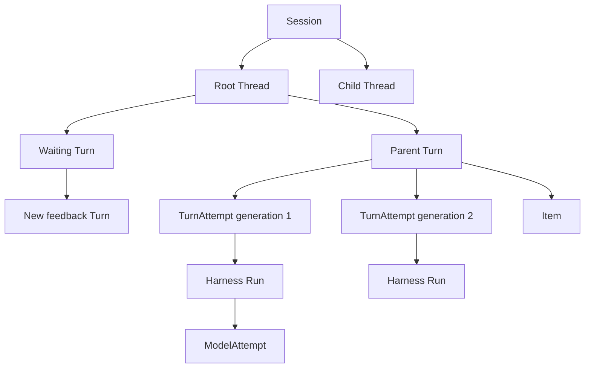
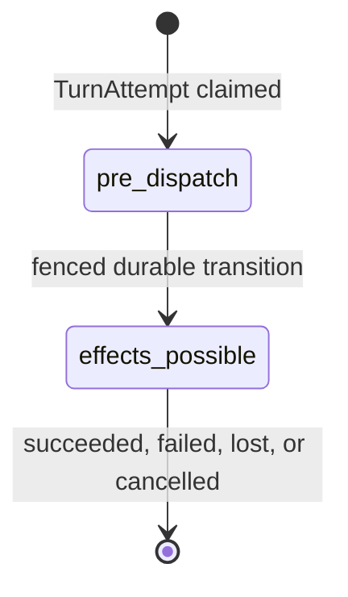

# Interactions, Turns, and Attempts

## Design Position

Foundation implements the shared [`Session`, `Thread`, `Turn`, and `Item`](../interaction-model.md) interaction model directly as its durable Agent-work model. A `Turn` is one accepted scheduling, recovery, state, and terminal-outcome boundary. A `TurnAttempt` is one replaceable fenced worker generation for that Turn. Foundation defines no separate durable `Execution` or `ExecutionAttempt` resource.

Every Foundation-managed Agent invocation, including an interactive request, schedule, webhook, service request, or asynchronous child, accepts a Turn before work is claimable. Worker loss and recoverable infrastructure failure create later TurnAttempts under the same non-terminal Turn. Authenticated feedback for a waiting Turn, an explicit continuation, a fork, and retry of terminal intent create another Turn rather than reopening the sealed parent.

[Durable Thread Persistence](24-thread-persistence.md) owns the independent Thread row, Session membership, origin, version, active Turn, and selected continuation head. [Durable Turn State](14-turn-persistence.md) owns Turn fields, lifecycle, state-object publication, sealing, lineage, and recovery budget. [Durable Turn Attempt Persistence](15-turn-attempt-persistence.md) owns TurnAttempt fields, leases, fences, dispatch evidence, and attempt outcomes. This document owns only the interaction-to-runtime mapping and the boundaries that those detailed contracts must preserve.

## Relationships

The diagram shows identity and lineage, not live object containment. Every Turn belongs to exactly one Session and Thread. A Turn can own zero or more immutable TurnAttempts over its lifetime, but at most one leased generation can authorize worker mutation at a time. One TurnAttempt starts at most one Harness Run; one Harness Run can contain several process-local `ModelAttempt` values.

Items and replay data are projections of a Turn and never become continuation state. A Harness Run, model request, Redis entry, Item, or delivery cursor never replaces Turn or TurnAttempt identity.

## Acceptance and Lineage

Turn acceptance authenticates and authorizes the caller or internal principal, validates the selected Session and Thread, resolves exact revisions and policy, applies the scoped idempotency contract, publishes the initial Turn state, and atomically creates or advances the versioned Thread together with the accepted Turn and its lifecycle publication intent. The Turn becomes schedulable only after the complete initial state object is durably available.

The accepted operation chooses exactly one lineage form:

- a root invocation creates a root Turn for a selected or newly created Session and Thread;
- ordinary continuation accepts a new Turn that preserves `thread_id`, selects the Thread's exact completed `head_turn_id` as `parent_turn_id`, and initializes state from that parent;
- authenticated feedback accepts a new Turn that sets `parent_turn_id` to the exact sealed waiting Turn and consumes its complete pending set;
- fork atomically accepts a new Turn and independent Thread row, sets `parent_turn_id` to the selected completed source Turn, and applies the Harness fork contract; and
- retry of terminal intent creates an explicit successor Turn, advances the same Thread under its version, and never mutates the terminal record.

The same principal, scope, idempotency key, and canonical request return the original acceptance receipt. Reuse with different content conflicts. A lost response after possible acceptance remains unknown until the caller repeats the same key or reads authoritative Turn state.

## Turn and TurnAttempt Lifecycle Boundary

A Turn begins as `accepted`. Claiming work creates a new TurnAttempt, selects it as the current generation, and moves the Turn to `running`. A recoverable lost attempt returns the same Turn to `accepted` within its durable recovery budget. A waiting or completed Harness outcome first publishes a complete matching state candidate and then atomically seals the Turn, clears the Thread's active Turn, selects the waiting or completed Turn as the Thread head, and increments the Thread version.

`waiting`, `completed`, `failed`, and `cancelled` are sealed Turn outcomes. They are never returned to `accepted` or `running`. Pending feedback does not reopen a waiting Turn: once the full feedback set is authenticated and accepted, Foundation accepts a new Turn whose `parent_turn_id` names that waiting Turn and leaves the parent unchanged.

A TurnAttempt is an immutable audit record after it reaches `succeeded`, `failed`, `lost`, or `cancelled`. Replacing an attempt creates a new generation with a fresh lease, Harness Run, Environment attachment, controller, clients, credentials, and bindings. It never restores another process's task, socket, database session, live provider handle, controller, or Harness Run.

## State and Checkpoint Boundary

Each Turn owns one deterministic object-storage state key. A checkpoint operation conditionally replaces the complete object at that same key under the current TurnAttempt fence. Foundation exposes no separate checkpoint resource, checkpoint ID, base-state object, result-state object, or selectable checkpoint history.

The relational Turn record stores the exact digest, size, schema versions, checkpoint sequence, and committing TurnAttempt of a sealed state. State publication alone does not seal the Turn; the generation-fenced relational transition selects the exact published candidate. Partial messages, raw stream deltas, provider history, Items, process memory, and tool fragments are never continuation state.

## Durable Dispatch Boundary

Each TurnAttempt begins with `dispatch_phase="pre_dispatch"`. While pre-dispatch, the worker may read durable inputs, verify locks, reconstruct pure process-local values, and perform work that cannot cause an external effect. Immediately before the first potentially effectful Environment, Harness, model, tool, provider, client, or other boundary, the worker commits `dispatch_phase="effects_possible"` under its generation fence.

If a worker is lost after `effects_possible`, Foundation resumes only from the latest complete conditionally committed Turn state. Every durably dispatched Agent tool call without a matching result in that state becomes bounded `unknown_outcome` context for the next TurnAttempt. The next Agent may choose a new invocation, but Foundation never automatically replays the prior call and never treats missing receipts or telemetry as proof of failure.

Environment management and other non-Agent provider operations retain their owning idempotency and exact-reconciliation contracts. Their evidence can gate use of the affected resource without converting an unmatched Agent tool call into a generic business-reconciliation state.

## TurnAttempt and Harness Mapping

One TurnAttempt starts at most one logical Harness Run. Before Harness entry, the worker resolves exact immutable revisions, creates fresh run Capabilities, acquires fresh Environment attachments, and builds fresh `RunBindings`.

As soon as the Harness supplies its Run identity and before the worker publishes the first live observation, the worker binds `harness_run_id` immutably to the current TurnAttempt under the attempt fence. That durable binding provides provenance and authorization correlation; it does not define the Turn-scoped Redis Stream, whose stable identity and replay contract are owned by [Lifecycle and Stream Persistence](17-lifecycle-and-stream-persistence.md).

Provider transport retries and internal Harness recovery remain within the Harness Run and do not allocate another TurnAttempt. Conversely, durable worker replacement always allocates another TurnAttempt and another Harness Run.

## Cancellation and Unknown Outcomes

Cancellation is durable intent followed by cooperative enforcement. A worker checks cancellation before expensive or effectful boundaries and attempts a fenced outcome commit. Cancellation never claims rollback of model, tool, child, Environment, provider, or client effects.

A stale TurnAttempt cannot publish Turn state, mutate Thread active/head selection, publish pending work, retain Items, commit lifecycle transitions, or select terminal outcomes. Late immutable usage evidence can retain its original attempt attribution under the usage contract, but it cannot mutate Turn lifecycle.

Exactly one legal generation-fenced transition wins a cancellation, waiting, or completion race. A losing local result remains diagnostic only.

## Invariants

01. Session, Thread, Turn, and Item retain the shared platform meanings.
02. Every hosted Thread is an independent versioned relational resource whose active Turn and continuation head are never inferred from Turn timestamps.
03. Turn owns accepted schedulable Agent work, lineage, state, recovery budget, and durable outcome.
04. TurnAttempt owns one replaceable fenced worker generation and starts at most one Harness Run.
05. Foundation defines no separate durable Execution or ExecutionAttempt resource.
06. Waiting feedback, continuation, fork, and terminal retry create another Turn rather than reopening a sealed Turn.
07. Only the current TurnAttempt can conditionally publish state or commit a Turn transition.
08. The current TurnAttempt durably binds its immutable Harness Run identity before the first live observation is published.
09. `effects_possible` is committed before any operation that may cause an external effect.
10. Absence of a receipt, event, or telemetry signal never proves pre-dispatch safety or Agent tool-call failure.
11. Foundation resumes from complete Turn state, projects unmatched Agent tool calls as `unknown_outcome`, and never automatically replays them.
12. Terminal Turn and TurnAttempt records are immutable; retry and feedback create explicit successor records.
13. Cancellation records intent and never implies rollback of external effects.
