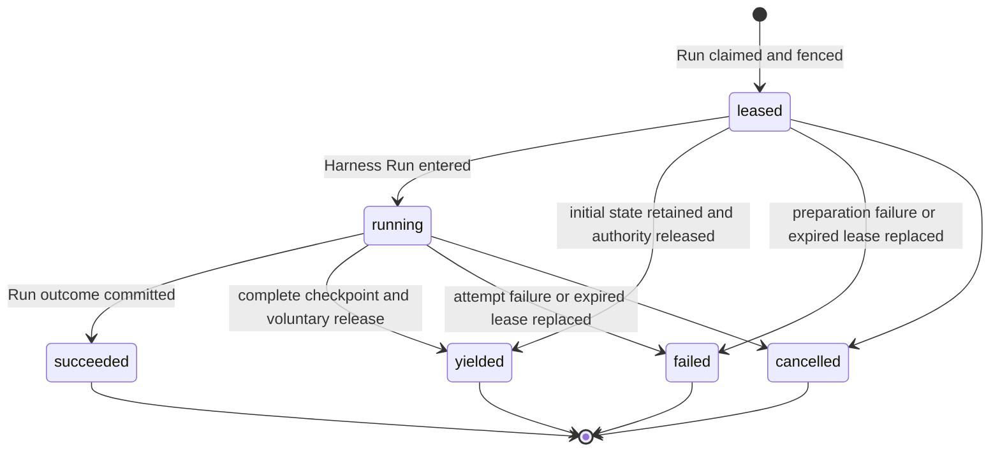
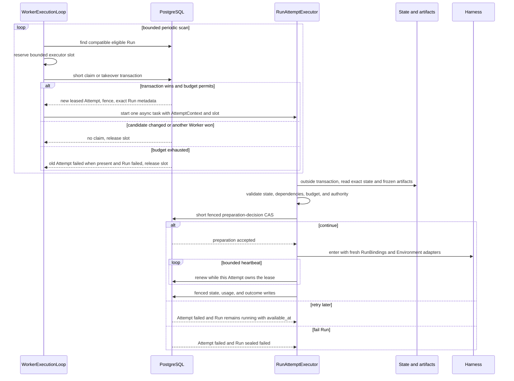
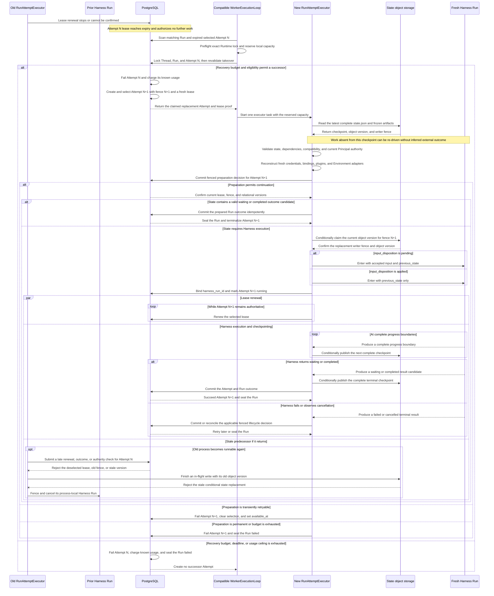

# Run Attempts, Scheduling, and Recovery

## Design Position

Foundation Service uses the `Run` as its only durable schedulable Agent-work identity. Every Foundation-managed operation that invokes an Agent first selects or creates a Session and Thread and accepts a Run. Scheduled triggers, webhooks, and asynchronous child Agents differ only by Run trigger and lineage data. The independent Thread row and its allocation or advancement are owned by [Durable Thread Persistence](11-thread-persistence.md).

Reconciliation or maintenance work that does not invoke an Agent belongs to its owning domain and does not manufacture a Run or `RunAttempt`. If such a workflow invokes an Agent, that invocation is ordinary Run work. Foundation defines no generic `Execution` resource or `executions` table.

Every non-draining `WorkerExecutionLoop` performs the same bounded relational Run scan, Runtime preflight, local-capacity admission, and transactional claim or takeover through its configured Plugin Runtime profile. It reserves one bounded local execution slot before claim so that a successful claim always has process-local capacity. A winning claim immediately starts exactly one `RunAttemptExecutor` as an async task in the claiming execution process; it does not run the Attempt inline in the scan loop and does not create another OS thread. The executor owns preparation, lease renewal, Harness execution, active-control reconciliation, fenced publication, and finalization for that Attempt.

`WorkerExecutionLoop` and `RunAttemptExecutor` are process-local component names, not durable resources or public Python API commitments. In the on-demand profile both run in the Worker process. In the runner profile they run in the same lock-scoped Runner child process, while the Supervisor owns only Runner lifecycle and claim gating. Adding Worker replicas adds competing consumers of the relational claim contract; it does not create a separate Run Scheduler, recovery controller, or Redis dispatch authority. PostgreSQL remains authoritative for Run eligibility, Attempt generations, leases, fences, recovery budgets, and outcomes.

## Core Model

A Run is the stable logical-work identity and durable recovery boundary for one accepted Agent advancement. A `RunAttempt` is one replaceable generation of execution authority within that boundary. Restarting, migrating, or recovering a worker does not create new logical work. When replacement execution is required, a later Worker claim creates another `RunAttempt` under the same Run.

| Resource     | Responsibilities                                                                                                                                                                                                                                                                                                                                                                                                                                 |
| ------------ | ------------------------------------------------------------------------------------------------------------------------------------------------------------------------------------------------------------------------------------------------------------------------------------------------------------------------------------------------------------------------------------------------------------------------------------------------ |
| `Thread`     | Owns Session membership, origin, version, the current Run (the most recently accepted Run), and selected continuation head. Current-Run status determines whether work is active. The Thread serializes whether another Run can be accepted but does not schedule or execute that Run.                                                                                                                                                           |
| `Run`        | Owns the accepted Agent-work identity, input, lineage, exact AgentRevision, immutable `EffectiveAgentConfig`, Runtime lock selection, safe model observation, scheduling, recovery budget and consumption, current-attempt selection, current state, and durable outcome. It is the sole authority for whether another attempt may be created.                                                                                                   |
| `RunAttempt` | Owns one worker generation's lease, fence, Worker build and Harness Run correlation, safe model observation, usage, failure or planned-handoff audit, and generation outcome. It does not own accepted input, lineage, model configuration, state, durable outcome, credentials, live bindings, tool invocation history, or presentation data, and it cannot independently authorize a successor. Terminal attempts are immutable audit records. |

## Boundaries

| Concern                                                | Owner                                                                            | Contract                                                                                                                       |
| ------------------------------------------------------ | -------------------------------------------------------------------------------- | ------------------------------------------------------------------------------------------------------------------------------ |
| Run status, scheduling fields, and recovery budget     | [Durable Run State](12-run-persistence.md)                                       | Defines the stable Run lifecycle and the limits consumed by Attempt generations                                                |
| Plugin Runtime preflight and execution profile         | [Managed Harness Plugins and Runtime](36-managed-harness-plugins-and-runtime.md) | Defines on-demand import compatibility and lock-scoped Runner materialization                                                  |
| Model-loop retries inside one Harness Run              | Agent Harness                                                                    | Remain process-local `ModelAttempt` values and never allocate another `RunAttempt`                                             |
| Attempt execution, Harness callbacks, and live control | [Foundation–Harness Runtime Integration](14-harness-runtime-integration.md)      | Defines the executor tasks, `RunAttemptControl`, `HarnessDriver`, public Harness calls, mandatory Capability, and private gate |
| Lifecycle history                                      | [Lifecycle and Stream Persistence](24-lifecycle-and-stream-persistence.md)       | Records ordered facts without becoming Run or attempt authority                                                                |
| Thread inbox acceptance and consumption                | [Agent Control: Active Execution](19-agent-control-active-execution.md)          | Supplies durable steer and asynchronous-result entries plus state-coupled same-Run consumption                                 |
| Environment target active membership and keepalive     | [Environment Management](29-environment-management.md)                           | Counts accepted/running Runs, not Attempt generations; owns target lock order and Keeper execution                             |
| Agent tool crash behavior                              | Latest complete Run state plus the owning tool or Capability domain              | Defines no generic invocation ledger; effectful tools own cross-crash idempotency or durable task reconciliation               |

## RunAttempt Allocation Within a Run

The [Agent Interaction and Execution Model](10-agent-interaction-and-execution-model.md#identity-allocation-boundary) owns the cross-layer decision to create a Thread, Run, or RunAttempt. This contract begins with an already accepted, unsealed Run and owns how a successful Worker claim allocates one particular Attempt generation. Run acceptance creates no Attempt; the first later claim creates attempt number one.

A later Attempt preserves the Run ID, Session, Thread, parent edge, accepted input, exact AgentRevision, `EffectiveAgentConfig`, Runtime lock selection, recovery policy, and deterministic state key. It receives a new Attempt ID, attempt number, fence, lease, Worker generation, fresh credentials and bindings, and, after entry, a fresh Harness Run. Creating it changes neither Thread references nor Thread version.

| Claim case                                       | Prior Run and Attempt state                                                           | Allocation and budget effect                                                                                                                             |
| ------------------------------------------------ | ------------------------------------------------------------------------------------- | -------------------------------------------------------------------------------------------------------------------------------------------------------- |
| First claim                                      | Run is `accepted` with no current Attempt                                             | Create leased attempt number one, increment `attempts_started` and `recovery_attempts_started`, select it, and move the Run to `running`                 |
| Retry after a known retryable generation failure | Run is `running` without a current Attempt; the prior generation is terminal `failed` | Create a later leased Attempt that replaces the prior generation and increment both Attempt counters                                                     |
| Expired-lease takeover                           | Run is `running` and selects an expired non-terminal Attempt                          | Atomically fail and charge the old Attempt, then create and select a later leased Attempt within recovery budget                                         |
| Successor after planned handoff                  | Run is `running` without a current Attempt; the highest generation is `yielded`       | Create a later leased Attempt with `recovery_reason="planned_handoff"`; increment `attempts_started` without consuming another recovery or handoff count |

Every claim revalidates the exact Run eligibility, budget, compatibility, and authority rules defined below. A caller- or responder-driven successor, fork, queued-submission consumption, or terminal-intent Retry is new semantic work and therefore creates another Run under its owning acceptance contract rather than entering this allocation path.

The first claim's `accepted -> running` transition does not change Environment target active membership. Attempt replacement, retryable backoff, takeover, and planned handoff likewise leave the same Run counted once. Any claim, preparation, recovery, or cancellation transaction that instead seals an `accepted` or `running` Run decrements its bound target exactly once in that same transaction under the [target lock order](29-environment-management.md#active-run-accounting-and-target-lifecycle).

## Durable Model

The following Python-like schema is conceptual. JSON values are bounded before persistence. `RecoveryUsage` and the Run-owned budget fields are defined by [Durable Run State](12-run-persistence.md#durable-run-model).

```python
type RunAttemptStatus = Literal[
    "leased",
    "running",
    "succeeded",
    "yielded",
    "failed",
    "cancelled",
]
type RunAttemptYieldReason = Literal[
    "service_drain",
    "runner_rotation",
]


class RunAttempt:
    id: str
    version: int
    tenant_id: str
    run_id: str
    attempt_number: int
    fence: int
    status: RunAttemptStatus

    replaces_run_attempt_id: str | None
    recovery_reason: str | None
    worker_id: str
    worker_generation: str
    worker_build_id: str
    runtime_lock_digest: str
    harness_run_id: str | None
    model_execution_observation: ModelExecutionObservation

    lease_token_digest: str
    lease_expires_at: datetime
    heartbeat_at: datetime

    usage: RecoveryUsage
    yield_reason: RunAttemptYieldReason | None
    failure: SafeFailure | None

    created_at: datetime
    claimed_at: datetime
    started_at: datetime | None
    finished_at: datetime | None
    updated_at: datetime
```

`attempt_number` and `fence` increase monotonically within one Run and are never reused. `replaces_run_attempt_id` names the immediately superseded attempt when the new attempt is a recovery generation. It is null on the first attempt.

`RunAttempt` stores no generic Agent tool invocation collection, dispatch disposition, result-correlation collection, or recovery projection. Foundation performs no synchronous PostgreSQL write solely because Harness is about to dispatch a tool call. Tool-call observations can still carry process-local correlation into streams, traces, logs, or a tool-specific protocol, but none of those values becomes generic RunAttempt recovery authority.

A tool call and its result become recoverable only through a complete Run state checkpoint. If a Worker disappears before that checkpoint, the successor cannot distinguish work that never started from work that partially or fully completed without returning. It resumes from the previous complete state and can re-drive model or tool work. A provider or Capability that needs stronger behavior owns an idempotency key, provider operation identity, receipt, or durable task ledger in its own domain; Foundation does not query provider business state before admitting another attempt.

`worker_generation` uniquely identifies one Worker process lifetime. `worker_build_id` identifies the immutable Foundation Service build artifact running that process; replicas of the same artifact therefore share one build ID. Neither value grants authority without the selected lease and fence. `worker_build_id` is distinct from the Run-pinned `PluginRuntimeLock.worker_release`: the former records which service build executed this generation, while the latter remains the historical Worker dependency baseline selected for the Run.

## RunAttempt Lifecycle



`succeeded`, `yielded`, `failed`, and `cancelled` are terminal. `yielded` means the executor voluntarily stopped at a complete recoverable boundary, committed its known usage and released execution authority while the Run remained `running`. It is expected placement change, not failure, cancellation, or a Harness result. `failed` means only that this worker generation can no longer produce an authoritative result. It does not by itself mean that the Run failed: an in-budget retryable failure leaves the Run `running` and allows a later attempt. An owning executor can commit that fact directly; otherwise a later Worker's takeover transaction commits it after the lease expires. Foundation defines no separate `lost` attempt state.

Loss of outcome certainty at the attempt boundary means that the whole attempt can no longer continue and produce an authoritative Run result. Foundation does not create another Attempt merely because one process-local tool call fails or has an uncertain outcome; replacement still follows the lease, failure, and handoff rules below.

`leased` is the pre-Run preparation state. Worker claim acknowledgement is a transport observation, not another durable phase. While an attempt is `leased`, `harness_run_id` and `started_at` are null. The executor may read and validate state and immutable artifacts, resolve current authority and credentials, and construct fresh run-local dependencies outside database transactions. It cannot dispatch an Agent model or tool call before Harness entry. Entering the Harness Run atomically records `harness_run_id` and `started_at` and changes the attempt to `running`.

A `leased` Attempt can yield before Harness entry by retaining the already complete initial or imported Run state. A `running` Attempt can yield only after the [Run state contract](12-run-persistence.md#checkpoint-triggers-and-refresh) confirms a complete safe boundary and the local Harness execution is fenced from further model, tool, or child dispatch. A yielded Attempt has a `yield_reason`, has no `failure`, and has `harness_run_id` and `started_at` exactly when it had entered Harness before yielding.

## `run_attempts` Relational Schema

Each worker generation is one `run_attempts` row:

| Column group      | Columns                                                                                      | Contract                                                                                                                             |
| ----------------- | -------------------------------------------------------------------------------------------- | ------------------------------------------------------------------------------------------------------------------------------------ |
| Identity          | `id`, `version`, `tenant_id`, `run_id`, `attempt_number`, `fence`, `status`                  | Unique attempt identity, positive CAS version, and monotonically increasing generation within the Run                                |
| Recovery lineage  | `replaces_run_attempt_id`, `recovery_reason`                                                 | Names the immediately superseded attempt and bounded recovery reason                                                                 |
| Worker and run    | `worker_id`, `worker_generation`, `worker_build_id`, `runtime_lock_digest`, `harness_run_id` | Execution-process and immutable service-build correlation, exact Run-pinned Runtime lock, and at most one Harness Run ID after entry |
| Model observation | `model_execution_observation_json`                                                           | Immutable safe model ID, provider type, and model name copied from the Run at claim                                                  |
| Lease             | `lease_token_digest`, `lease_expires_at`, `heartbeat_at`                                     | Opaque lease proof, expiry, and last durable renewal                                                                                 |
| Usage and outcome | `usage_json`, `yield_reason`, `failure_json`                                                 | Attempt-local accounting plus mutually constrained planned-handoff or safe-failure provenance                                        |
| Time              | `created_at`, `claimed_at`, `started_at`, `finished_at`, `updated_at`                        | UTC lifecycle observations                                                                                                           |

Once terminal, every attempt column is immutable.

`usage.model_requests` is monotonic durable execution evidence, not only a terminal accounting total. After all required input preparation and immediately before each provider model request, the executor increments it in a short fenced Attempt update; the provider request does not start unless that update commits. The update does not claim that the provider received or completed the request. When an Attempt is terminalized or replaced, its known usage is charged into `Run.usage_charged` in the same transaction. Consequently, `Run.usage_charged.model_requests > 0` proves that a prior Attempt crossed a model boundary after input preparation without adding a separate input-file materialization field.

`usage.tool_invocations` is aggregate known usage reported by Harness and committed with a complete checkpoint or Attempt outcome. It is not a dispatch authorization record and does not require a PostgreSQL update before each tool call. A crash can therefore omit uncheckpointed tool invocation usage; recovery budgets constrain durable known usage rather than claiming exact accounting of external effects.

## Current Attempt Authority

`Run.current_run_attempt_id` selects the sole `RunAttempt` whose lease may authorize work for a `running` Run. The selected attempt is the complete lease record: it owns the worker identity and generation, monotonic fence, lease proof, and lease expiry. A worker is authorized only while the Run still selects that non-terminal attempt and the caller matches its worker generation, fence, lease proof, and unexpired lease.

Every `WorkerExecutionLoop` periodically scans bounded, deterministically ordered relational candidates through its configured Plugin Runtime profile. An on-demand loop preflights the exact candidate lock against its process-local registry before claim; a runner Supervisor ensures a matching Runner exists and that Runner's loop scans only an equal `runtime_lock_digest`. A candidate is exactly one of:

- an `accepted` Run with no current attempt and `available_at <= now`;
- a `running` Run with no current attempt after a retryable failed generation and `available_at <= now`;
- a `running` Run with no current attempt whose highest-numbered generation is `yielded` and `available_at <= now`; or
- a `running` Run whose selected `leased` or `running` attempt has an expired lease.

A yielded candidate has reason-specific scheduling eligibility in addition to ordinary Runtime and state compatibility preflight. After `yield_reason="service_drain"`, a compatible claimant whose immutable `worker_build_id` differs from the yielded Attempt may claim immediately. A same-build claimant skips it until the finite positive `handoff_preference_window` has elapsed from `finished_at`, then may claim as a capacity fallback. The default window equals one RunAttempt lease duration. After `yield_reason="runner_rotation"`, any compatible non-draining execution loop whose Runtime lock matches exactly may claim immediately, regardless of `worker_build_id`.

Build difference is neither authority nor compatibility proof. Every claimant still passes the exact Runtime, state-schema, Harness, Plugin, Skill, Environment connection and attachment-capability, codec, and artifact compatibility checks and wins the transactional lease and fence. The preference chooses no specific Worker; it only lets compatible new-build capacity win during rolling service overlap while retaining bounded same-build fallback. It does not delay initial claim, retryable-failure recovery, expired-lease takeover, or Runner rotation. A draining Worker claims no candidate.

Before attempting the claim transaction, the execution loop reserves one slot from its bounded local `RunAttemptExecutor` capacity. It releases the slot when the claim loses or no Attempt is created. When the claim succeeds, ownership of that slot transfers to the new executor until its complete cleanup finishes. A loop with no slot does not claim and later queue the Attempt in process memory; the Run remains available to other compatible claimants. The slot is admission control only and never grants or extends RunAttempt authority.

There is no separate scheduler claim, recovery controller, or Redis ownership handoff. A `WorkerExecutionLoop` establishes or replaces the current selection in one short transaction that:

1. locks or conditionally updates the candidate Run and, when present, its exact selected attempt;
2. revalidates the candidate shape, Thread current selection, Run status, `available_at`, lease expiry, fixed recovery deadline, applicable recovery or handoff count, aggregate known usage, and any reason-specific build-preference eligibility;
3. when taking over an expired lease, terminalizes the selected old attempt as `failed` with a bounded lease-expiry reason, disables its lease, and charges its known usage;
4. if the fixed deadline or aggregate usage ceiling no longer permits any successor, or a failure or expiry replacement no longer fits the recovery budget, creates no attempt and seals the Run as `failed` with its terminal Thread update and bound Environment-target decrement in the same transaction; a yielded predecessor is already within the handoff budget consumed by its yield and does not consume recovery budget;
5. otherwise allocates `attempt_number=attempts_started+1` and the next monotonic fence, inserts the new `leased` attempt, increments `attempts_started`, increments `recovery_attempts_started` only for the first generation or a failure or expiry replacement, and selects it as `current_run_attempt_id`; a successor to `yielded` records `recovery_reason="planned_handoff"`, and every new Attempt copies the claimant's immutable `worker_build_id`;
6. changes an initially `accepted` Run to `running`, leaves a replacement Run `running`, and appends the corresponding lifecycle facts.

The Run row lock or equivalent compare-and-swap plus attempt-number and fence uniqueness admits exactly one winner. A competing Worker that observes a changed Run version, current attempt, or lease condition creates nothing and resumes its scan. The transaction performs no object, artifact, policy-provider, model, Ingress, ConnectorProvider, MCP, Secret-store, Environment, or other external I/O.

Operational admission control, queue names, priority, and fairness may order or delay scans. They never form another ownership authority. Redis may carry domain-owned Run-stream data and Thread-control wakeups, but no Redis value discovers, creates, transfers, or completes a RunAttempt or consumes a Thread inbox entry.

### Claim, Preparation, and Run Sequence



After commit, the winning execution loop schedules the executor as its next local action and resumes scanning only according to its remaining capacity. `AttemptContext` is a claim-derived process-local context. Its immutable correlation includes tenant, Thread, Run, Attempt, Worker identity and generation, build identity, Runtime lock, fence, lease proof, and fixed policy deadlines; it initializes the expected relational versions and lease deadline that the executor advances only from successful fenced operations or authoritative rereads. It contains no database session, transaction, Harness object, credential, or independent authority; every authoritative operation still revalidates PostgreSQL.

The executor performs state and dependency preparation outside database transactions while its child renewal activity keeps the lease current. When Service tracing is enabled, that committed claim starts the parentless RunAttempt root defined by [Observability](38-observability.md). Before model or tool work, the executor conditionally claims the Run's current state object version for its fence. It then enters the Harness Run through another short fenced transaction: it verifies the current leased attempt and the expected Attempt version returned by the preparation decision, records `harness_run_id` and `started_at`, changes the attempt to `running`, sets the Run's `started_at` if this is its first Harness Run, and appends the attempt lifecycle fact. The Run remains `running`.

Heartbeat and lease renewal update only the selected attempt, but their conditional update verifies the authority rule above in the same relational transaction. Like every worker-originated durable mutation, they supply `tenant_id`, `run_id`, `run_attempt_id`, fence, lease proof, and expected Run version. They cannot revive a terminal or deselected generation. A state write additionally supplies the current opaque object version and conditionally replaces the same deterministic state key.

The same fence covers Attempt preparation and outcome, Run state replacement and sealing, lifecycle and retained-Item publication, waiting feedback, child acceptance or result incorporation, and terminal Thread updates. Lease renewal proves only that the selected Worker generation remains alive and authorized to publish; it does not commit Agent progress, extend credential lifetime, or make process memory recoverable. An executor that cannot confirm current ownership terminally fences its process-local control gate, stops model and tool work, cancels its Harness stream, and suppresses authoritative publication. It may still emit bounded non-authoritative telemetry naming its stale Attempt.

Immutable usage evidence for already incurred work may arrive later under its original RunAttempt attribution as defined by [Events, Usage, and Delivery](25-events-usage-and-delivery.md), but it cannot restore an Attempt or advance Run lifecycle. Each successful claim starts a separate parentless RunAttempt trace under [Observability](38-observability.md); takeover never reopens or completes the prior Worker's root span.

Drain readiness failure and claim gating do not change this rule. From the first process-local handoff request through safe-boundary waiting, checkpoint publication and reconciliation, local Run quiescence, and yield-transaction preparation, the selected Attempt continues its normal heartbeat and lease renewal. Renewal and yield use the same Attempt CAS and fence authority, so their conditional updates serialize: after yield commits, a late renewal fails because the Attempt is terminal and deselected. A yield CAS conflict does not release authority; while the old Attempt still passes the authority check it keeps renewing and either retries yield or commits the authoritative outcome that won the race.

The [Run outcome contract](12-run-persistence.md#run-acceptance-checkpoint-and-outcome-commit) owns state-candidate selection, Run sealing, and the complete cross-resource transaction. From the RunAttempt side, that same fenced commit terminalizes the selected Attempt, disables its lease, charges its known usage, clears the Run's current-attempt selection, and appends Attempt lifecycle facts. A waiting or completed Run outcome records the Attempt as `succeeded`; failed or cancelled outcomes record the applicable generation-terminal status.

The [active-control contract](19-agent-control-active-execution.md#completion-and-control-races) owns Thread inbox preconditions and disposition, while the [queued-submission contract](20-agent-control-queued-submissions.md#completion-time-combined-handoff) owns a combined completed outcome and successor acceptance. Such a transaction can terminalize this Attempt, but it creates no Attempt for the successor Run; only a later ordinary claim does so.

A known attempt failure commits atomically with its Run decision and charges known usage. A retryable in-budget failure terminalizes the current attempt as `failed`, clears `current_run_attempt_id`, leaves the Run `running`, leaves its Environment target count unchanged, and sets its bounded `available_at`; a later Worker scan may create the next attempt. A non-retryable or exhausted failure additionally decrements the bound target, seals the Run as `failed`, and applies the active-control contract's terminal inbox disposition in the same transaction. Neither path returns the Run to `accepted`. A failure before Harness entry leaves `harness_run_id` and `started_at` null.

## Graceful Handoff Transaction

During shutdown, a control process stops accepting product mutations and streaming connections before stopping its publishers and domain-owned control work. An on-demand Worker stops scanning; a runner Supervisor gates every child scan. Complete role ordering is owned by [Runtime Configuration and Deployment](01-runtime-configuration-and-deployment.md#drain-and-shutdown).

SIGTERM, deployment drain, or controlled Runner rotation sets a `yield_requested` flag only in the owning process. It does not add a Run or Attempt column, make the Worker stale, or stop heartbeat and lease renewal. The executor may begin a planned handoff only when `handoffs_completed < max_handoffs`; an exhausted handoff budget makes it continue ordinary execution until a normal outcome or the drain deadline.

At a safe Harness boundary, the owner first confirms that the complete current Harness and Host state is conditionally present at the Run's ordinary deterministic `state.json` key. It may reuse an already equivalent complete checkpoint. Foundation attachment adapters publish no provider target state; the immutable Run binding remains relational authority. The state contract creates no handoff-specific object, row, object key, or checkpoint identity, and the yield transaction does not store or validate checkpoint metadata. An unknown object-write result is reconciled by the ordinary object stat and body rules. Until the owner can confirm that this safe-point state is durable, it keeps renewing and does not submit `yielded`.

After that confirmation, the `RunAttemptExecutor` establishes a process-local terminal fence for the old Harness Run when one exists, preventing another model request, tool call, child dispatch, or state mutation. It closes any Run stream, attachments, and process-local Runtime while its renewal activity keeps the Attempt lease current. It then opens one short transaction, locks Thread, Run, and RunAttempt in the canonical order, and revalidates the latest Attempt version, current Run selection, unexpired lease proof, worker generation, fence, `running` Run status, non-terminal Attempt status, and absence of an already committed cancellation or normal outcome.

The winning transaction atomically:

1. changes the Attempt to `yielded`, sets `finished_at` and `yield_reason`, and leaves `failure` null;
2. charges all currently known Attempt usage into the Run;
3. increments `Run.handoffs_completed`;
4. clears `Run.current_run_attempt_id`, preserves `Run.status=running`, and sets `Run.available_at=now`; and
5. appends the `run_attempt.yielded` lifecycle fact and its outbox intent.

Only after this transaction commits does the old executor stop heartbeat and lease renewal and issue a best-effort Redis reconciliation wakeup. If the transaction loses to outcome or cancellation, the executor abandons yield and observes that authoritative result. If it fails for another reason while the old Attempt remains authoritative, the executor continues renewal, reconciles the latest state, and retries or commits another legal authoritative result.

If the drain deadline arrives before any terminal transaction commits, the executor abandons graceful handoff, stops renewing, fences local execution, and exits. The Attempt remains authoritative until its recorded lease actually expires; only then may an ordinary takeover transaction fail it and allocate a higher fence. A checkpoint written before a failed yield or process crash remains an ordinary valid latest checkpoint and never implies that the Attempt was yielded.

## Recovery and Budget Enforcement

Only the Run row authorizes another attempt under its accepted recovery, handoff, elapsed-time, and usage limits. A first or failure/expiry replacement claim consumes `recovery_attempts_started`; a successful yield consumes `handoffs_completed`, and its planned-handoff successor consumes neither another handoff nor recovery count. Every claim still increments `attempts_started` for complete audit history. Claim and takeover consume their applicable authority before external preparation begins; preparation never reserves a future generation.

### Lease-Expiry Recovery Sequence

The following sequence makes the ordinary cross-Worker lease-expiry recovery path explicit. It uses the same relational claim authority and deterministic state key as every other Attempt; it introduces no recovery controller, recovery queue, or second checkpoint selector. The `input_disposition` branches summarize the [Run resume contract](12-run-persistence.md#resume-semantics), which owns their complete semantics.



After any new attempt owns the lease, its executor reads the exact state, attempt history, immutable artifacts, and the Run's immutable `authority_principal` outside a database transaction and satisfies the [active-control recovery contract](19-agent-control-active-execution.md#unified-fifo-delivery-and-state-commitment). It admits Harness entry only when all of these conditions hold:

- the latest complete state object passes key, tenant, Run, Thread, digest, size, envelope, checkpoint, AgentRevision, Runtime lock, and required Harness, Capability, and Host codec validation;
- the applicable fixed recovery or handoff count, elapsed-time, and known-usage ceilings still permit this already-created attempt after all durable usage charges;
- the exact AgentRevision, `EffectiveAgentConfig`, Runtime lock, managed Harness Plugin and Skill artifacts, accepted MCP tool snapshot and Connectivity selections, `RunEnvironmentBinding`, Environment attachment-capability lock, and other frozen dependency locks are present, digest-valid, and compatible; and
- the Run's persisted authority Principal remains active in the same tenant, and its current Workspace and principal policy, RoleBindings, Agent invocation authority, Connection and MCPConnection ownership or eligibility, Ingress action authority, Environment provider selection, and required Secret metadata authorize the reconstruction and intended uses.

Attempt preparation is an internal operation over already accepted work. It does not replay the accepting browser session or API key and does not substitute the claiming Worker, queue consumer, administrator, or `system` audit actor as the Run Principal. Revoking the original request credential blocks later requests made with that credential but does not erase the accepted Run; disabling the persisted Principal or removing its required current grants fails the Attempt closed.

The executor then uses one short fenced compare-and-swap transaction to revalidate that the same Run still selects its unexpired `leased` attempt and to commit exactly one preparation decision:

- **continue**: preserve the Run and attempt as active and permit fresh reconstruction and Harness entry;
- **retry later**: terminalize the attempt as `failed`, charge known usage, clear the current selection, keep the Run `running`, and set a bounded `available_at`, but only for an explicitly retryable condition while budget remains; or
- **fail the Run**: terminalize the attempt as `failed`, charge known usage, clear the current selection, decrement the bound Environment target, seal the Run as `failed`, retain it as the Thread's current Run, preserve the prior head, and increment the Thread version.

Every Run-failure path records bounded `failure`, sets `sealed_at`, clears the current Attempt selection, freezes the deterministic state key, decrements the bound Environment target when the old Run was active, retains the failed Run as the Thread's current Run, preserves the prior continuation head, increments the Thread version, and appends Attempt and Run lifecycle facts as applicable. It records `sealed_state` only when exact valid state metadata is already available under the Run state contract.

A permanent state, integrity, schema, codec, artifact, lock, compatibility, or authority failure takes the final path. An exhausted applicable recovery or handoff count, deadline, or usage budget also takes the final path. A transient object-store or immutable-artifact availability failure can take the retry-later path only when policy classifies it retryable and all remaining budget checks pass. If the Worker dies during preparation, its lease eventually expires and another Worker's ordinary takeover transaction replaces that attempt.

Recovery does not probe model reachability, inspect Provider business state, or validate the customer-owned target. Model reachability and attachment to the exact target frozen in `RunEnvironmentBinding` are outcomes of the newly owned Attempt, not recovery admission checks.

A later Attempt receives a new ID, fence, lease, fresh `RunBindings`, a fresh attach-only Environment adapter for the same immutable Run binding, and a Harness Run, then follows the [Run resume contract](12-run-persistence.md#resume-semantics) against the same Run state key. Foundation imports only the selected complete state and does not add synthetic results or generic recovery context for tool work absent from that state.

The Agent decides its next action through ordinary model output. A re-driven or later tool call receives its ordinary tool-call and invocation identity. Foundation does not guarantee cross-Attempt idempotency-key reuse; a tool that requires it must define and persist that key through its own contract.

## RunAttempt Execution Boundary

After claim succeeds, [Foundation–Harness Runtime Integration](14-harness-runtime-integration.md) owns the executor's structured async lifetime: the executor root task, its `LeaseMonitor` and `ControlWatcher` child tasks, one non-task `RunAttemptControl` facade with a private gate, one non-task `HarnessDriver` running in the root task, exact Agent reconstruction, fresh collaborators and Environment adapters, sole stream ownership and consumption, fenced publication, and finalization. [Agent Control: Active Execution](19-agent-control-active-execution.md) owns what the watcher reconciles from PostgreSQL and when a Redis signal may be acknowledged. [Environment Management](29-environment-management.md) owns exact-target connection resolution, the immutable Run binding, and attach-only adapter construction. This contract defines no second integration profile.

RunAttempt authority imposes four constraints on that integration: only the current leased and fenced Attempt may enter and publish; exactly one executor owns that Attempt in the claiming process; the executor binds at most one `harness_run_id` before its first live observation; and no database session or lock spans reconstruction, provider calls, Harness work, streaming, waits, or cleanup. The executor's child activities cannot outlive its structured scope. A replacement Attempt receives fresh process-local values and never restores another Worker's task, socket, client, adapter, entered facade, `HarnessDriver`, `RunAttemptControl`, private gate, or subscriber. Active-control hooks follow their [owning FIFO and waiting-delivery contract](19-agent-control-active-execution.md), and Redis remains only a wakeup optimization.

## Retry Semantics

Retries remain owned by the layer that knows the failed boundary:

- bounded attachment transport retries remain inside the fresh Environment adapter under Provider and Host policy and never invoke target lifecycle operations;
- Harness semantic recovery creates another ModelAttempt inside one Harness Run;
- eligible pending inbox delivery that can no longer enter the current native Run prevents completed sealing and follows the active-control recovery rule;
- Foundation creates another RunAttempt only after the prior Attempt failed, yielded, or lost its lease, and only under the Run's applicable budget;
- retrying sealed terminal intent creates a successor Run rather than reopening the original;
- a recovered Agent decision is an ordinary new tool call, not a replay command; and
- Foundation does not guarantee reuse of a prior invocation or idempotency key across RunAttempts.

Backoff uses the Run's exact durable `available_at`; Worker or process restart does not reset it. `attempts_started` counts RunAttempts separately from Harness ModelAttempts and ConnectorProvider retries. Recovery and planned-handoff limits are independent within the same Run-owned deadline and usage ceilings.

## Failure Semantics

| Failure                                                          | Durable outcome                                                                                                                    |
| ---------------------------------------------------------------- | ---------------------------------------------------------------------------------------------------------------------------------- |
| Concurrent Workers scan the same Run                             | Exactly one claim or takeover transaction creates the next Attempt; losers create nothing.                                         |
| No compatible execution loop can serve the Run's Runtime lock    | The Run remains eligible or the claimed Attempt follows bounded preparation failure; no Runtime is substituted.                    |
| Worker crashes before claim commit                               | The transaction commits no partial Attempt ownership.                                                                              |
| Worker crashes after claim or during preparation                 | Its lease expires; a later takeover fails it and creates at most one successor within budget.                                      |
| Local executor capacity is full                                  | The execution loop does not claim; compatible capacity may claim the still-eligible Run.                                           |
| Lease renewal loses or cannot confirm authority                  | The executor terminally fences local control, cancels its task tree and Harness stream, and publishes no authoritative result.     |
| Redis control watcher fails                                      | The executor remains correct through mandatory PostgreSQL checks; an unrecoverable child-task failure cancels the executor safely. |
| Worker crashes after uncheckpointed Agent tool work              | The successor resumes from prior complete state; generic recovery cannot determine the external outcome, so work can be re-driven. |
| Worker drains while model, tool, or inline-child work is active  | It keeps renewing and waits for a complete safe boundary; no second Worker may execute the Run.                                    |
| Checkpoint publication or reconciliation spans heartbeats        | The selected Attempt keeps renewing; checkpoint work does not release authority.                                                   |
| Yield races with renewal                                         | The shared Attempt CAS serializes them; after yield commits, late renewal is rejected.                                             |
| Yield fails while the old owner remains authoritative            | The owner keeps renewing and retries or commits another legal result; failure alone causes no takeover.                            |
| Drain deadline arrives before yield                              | The owner stops renewal and exits; takeover remains forbidden until recorded lease expiry.                                         |
| New-build and same-build Workers see a service-drain yield       | Compatible new build may claim immediately; same build waits for the bounded preference window.                                    |
| Preparation finds a retryable dependency outage                  | The Attempt fails; the Run remains `running` with bounded `available_at` while budget remains.                                     |
| Preparation finds permanent incompatibility or revoked authority | The Attempt and Run fail before Harness model or tool work starts.                                                                 |
| Redis live data flow is unavailable                              | Relational ownership and Thread inbox remain intact; no signal replaces a claim or domain fact.                                    |

## Relational Constraints

The `run_attempts` table follows the [Relational Schema Lifecycle](04-relational-schema.md) and preserves these constraints:

01. `(tenant_id, id)` is unique, and the attempt tenant equals its Run tenant.
02. Attempt number, fence, and row version are positive.
03. `(tenant_id, run_id, attempt_number)` and `(tenant_id, run_id, fence)` are unique.
04. `replaces_run_attempt_id`, when present, belongs to the same Run and has a smaller attempt number.
05. `current_run_attempt_id`, when present on a Run, names that Run's only selected non-terminal attempt; only an unexpired matching lease authorizes work.
06. Worker scan and takeover use `(status, lease_expires_at, run_id)` on non-terminal attempts and the Run's scheduling index.
07. A `leased` attempt has null `harness_run_id` and `started_at`. A `running` attempt has both. A terminal attempt has both exactly when it entered a Harness Run; `failed`, `cancelled`, or `yielded` directly from `leased` retains both as null.
08. Terminal attempts have `finished_at`, no renewable lease, and immutable columns.
09. `yield_reason` is non-null exactly for `yielded`; a yielded Attempt has null `failure`, leaves its Run `running`, and is not selected as current.
10. Every Attempt has a non-empty immutable `worker_build_id` copied from the claiming process.
11. Terminal attempt history cannot be deleted while referenced by a sealed Run state, lifecycle event, usage record, successor attempt, or retained [Asset provenance](32-asset-management.md#assets-relational-schema).

## Compatibility and Trade-offs

Run row version, relational migration revision, recovery-policy version, and Worker build identity format are independent. Harness and provider compatibility remain governed by their owning contracts. Unknown required policy versions fail closed before recovery. After a service-drain yield, a different `worker_build_id` supplies only scheduling preference; it never proves compatibility, grants authority, or replaces the Run-pinned Runtime lock. Runner rotation has no build-preference delay. Relational migrations do not reinterpret terminal attempt records through current defaults.

Keeping attempts as immutable audit rows increases relational retention but preserves worker, lease, usage, failure, and recovery provenance. Folding work identity and scheduling into the Run removes a second one-to-one lifecycle and its coordination transactions.

## Invariants

01. One `RunAttempt` is one worker generation and starts at most one Harness Run.
02. Attempt number and fence increase monotonically, are never reused, and at most one attempt is current and lease-authorized for a Run.
03. Every worker-originated durable write validates the current attempt, fence, lease, tenant, Run status, and expected Run version.
04. The current Attempt fence authorizes state and outcome writes that carry Thread-inbox evidence; the active-control and asynchronous-subagent contracts own exact consumption, rollover, suppression, and supersession semantics.
05. Only a Worker's short Run claim or takeover transaction can authorize a later attempt; after the first claim the same Run remains `running`, and its budget must permit the new generation.
06. A later attempt receives fresh worker and Harness identities while resuming the same Run state under the Run persistence contract.
07. Foundation stores no generic per-invocation dispatch ledger. A replacement Attempt resumes from the exact selected complete state and cannot reconstruct tool work absent from it; tools requiring cross-crash duplicate suppression or reconciliation own that durable protocol.
08. Attempt `failed` is generation-terminal and does not imply Run `failed`; Run `failed` is sealed and never receives another attempt.
09. Terminal attempt rows are immutable audit records.
10. Any transaction that accepts a successor Run creates no successor RunAttempt; only a later claim allocates its first generation.
11. Drain or Runner rotation gates new claims but does not weaken current Attempt authority: heartbeat and renewal continue until a terminal commit succeeds or the drain deadline is reached.
12. `yielded` is an Attempt terminal state, never a Harness result or Run terminal state; it preserves one complete latest `state.json` and permits a fresh planned-handoff Attempt under the same running Run.
13. Yield and lease renewal serialize through the same selected Attempt CAS and fence. A failed yield CAS never by itself stops renewal or permits another Worker to execute the Run.
14. `attempts_started` counts every generation, `recovery_attempts_started` counts the first and failure/expiry generations, and `handoffs_completed` counts successful planned yields.
15. Every Attempt executes for its Run's immutable authority Principal and re-evaluates that Principal's current status and grants before Harness entry; an internal claimant never becomes the product Principal.
16. Every `WorkerExecutionLoop` uses the same bounded relational scan and transactional claim or takeover contract; PostgreSQL owns eligibility and Attempt state, while Redis owns no scheduling or inbox-consumption fact.
17. Object, artifact, authorization, Environment, model, tool, and other external I/O never occurs inside a claim, takeover, or preparation-decision transaction.
18. `accepted` is pre-first-attempt only. Replacement and backoff keep the same Run `running`; a sealed failed Run never returns to `accepted`.
19. An on-demand Worker claims only after exact additive compatibility preflight, and a Runner claims only an equal Runtime lock digest; neither scheduling nor recovery substitutes another Runtime.
20. Service-drain build preference is bounded and advisory: compatibility and transactional claim remain mandatory, and same-build capacity becomes eligible after `handoff_preference_window`. Runner rotation has no build-preference delay.
21. Every Attempt owner participates in the Harness-integration and active-control reconciliation points defined by their owning contracts; Redis consumer progress is only a wakeup optimization.
22. A claim requires a pre-reserved bounded local execution slot and starts exactly one process-local `RunAttemptExecutor` async task; it never creates another OS thread or a durable Execution resource.
23. The execution slot, both child tasks, `HarnessDriver`, `HarnessRunStream`, `RunAttemptControl`, Capability, and private gate are released only after the executor's bounded structured cleanup finishes.
24. RunAttempt allocation, replacement, retryable backoff, and handoff never add another Environment target count; only a new Run acceptance increments and only leaving `accepted` or `running` decrements.
