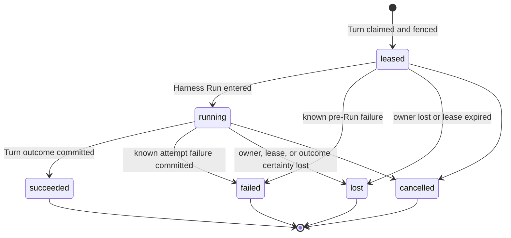

# Durable Turn Attempt Persistence

## Design Position

Foundation Service uses the `Turn` as its only durable schedulable Agent-work
identity. Every operation that invokes an Agent first selects or creates a
Session and Thread and accepts a Turn. Scheduled triggers, webhooks, and
asynchronous child Agents therefore differ by Turn trigger and lineage data,
not by allocating a second durable work abstraction.

Foundation persists one `turn_attempts` row for each worker generation
authorized to advance a Turn. A `TurnAttempt` owns one worker lease and fence,
at most one process-local Harness Run correlation, and immutable audit facts
for that generation. The owning Turn holds scheduling state, current-attempt
selection, recovery limits and consumption, accepted input, current state, and
the durable outcome.

Reconciliation or maintenance work that does not invoke an Agent belongs to
its owning domain and does not manufacture a Turn or `TurnAttempt`. If such a
workflow invokes an Agent, that invocation is ordinary Turn work. Foundation
defines no generic `Execution` resource or `executions` table.

State persistence never creates another `TurnAttempt` or a selectable
checkpoint history. After worker or lease loss, Foundation fences the lost
attempt, reconciles its effect disposition, charges the Turn-owned recovery
budget, and creates a later attempt only when resuming the owning Turn's latest
complete state is safe.

## Boundaries

| Concern                                                           | Owner                                                                      | Contract                                                                                       |
| ----------------------------------------------------------------- | -------------------------------------------------------------------------- | ---------------------------------------------------------------------------------------------- |
| Agent-work identity, input, current state, scheduling, and budget | [Turn persistence](12-turn-persistence.md)                                 | Supplies the deterministic state key and decides whether another attempt may be leased         |
| Worker identity, lease, fence, Harness Run, and attempt outcome   | `turn_attempts`                                                            | Authorizes one worker generation and preserves its immutable audit history                     |
| Model-loop retries inside one Harness Run                         | Agent Harness                                                              | Remain process-local `ModelAttempt` values and never allocate another `TurnAttempt`            |
| Lifecycle history                                                 | [Lifecycle and Stream Persistence](14-lifecycle-and-stream-persistence.md) | Records ordered facts without becoming Turn or attempt authority                               |
| Provider-native operation truth                                   | Selected provider integration                                              | Reconciles idempotency or unknown effects; an attempt stores only bounded disposition evidence |
| Non-Agent reconciliation and maintenance                          | Owning Foundation domain                                                   | Uses that domain's job, ledger, or control model rather than `TurnAttempt`                     |

A `TurnAttempt` contains no accepted input, parent edge, state body, plaintext
credential, provider client, live Environment binding, process handle, stream
body, user-visible Item, or competing Turn outcome.

## Durable Model

The following Python-like schema is conceptual. JSON values are bounded before
relational writes and use the same validated shape on PostgreSQL and SQLite.
`RecoveryUsage` and the Turn-owned budget fields are defined by
[Durable Turn State](12-turn-persistence.md#durable-turn-model).

```python
type TurnAttemptStatus = Literal[
    "leased",
    "running",
    "succeeded",
    "failed",
    "lost",
    "cancelled",
]
type EffectDisposition = Literal[
    "none_observed",
    "resume_safe",
    "reconciliation_required",
    "reconciled_safe",
    "terminal_unknown",
]


class TurnAttemptEffectEvidence:
    schema_version: Literal["1"]
    invocation_id: str
    tool_call_id: str | None
    provider_type: str
    effect_class: str
    idempotency_key_digest: str | None
    provider_operation_ref: str | None
    disposition: EffectDisposition
    observed_at: datetime


class TurnAttempt:
    id: str
    version: int
    tenant_id: str
    turn_id: str
    attempt_number: int
    fence: int
    status: TurnAttemptStatus

    replaces_turn_attempt_id: str | None
    recovery_reason: str | None
    worker_id: str
    worker_generation: str
    run_id: str | None

    lease_token_digest: str
    lease_expires_at: datetime
    heartbeat_at: datetime

    effect_disposition: EffectDisposition
    effect_evidence: tuple[TurnAttemptEffectEvidence, ...]
    usage: RecoveryUsage
    failure: SafeFailure | None

    created_at: datetime
    claimed_at: datetime
    started_at: datetime | None
    finished_at: datetime | None
    updated_at: datetime
```

`attempt_number` and `fence` increase monotonically within one Turn and are
never reused. `replaces_turn_attempt_id` names the immediately superseded
attempt when the new attempt is a recovery generation. It is null on the first
attempt.

`effect_evidence` stores stable invocation correlation, effect classification,
provider operation references, and bounded disposition. It contains no
arbitrary request or response body. A provider that needs an authoritative
task ledger, idempotency record, or receipt owns that data in its own domain;
Foundation defines no generic tool/provider receipt table.

## TurnAttempt Lifecycle



`succeeded`, `failed`, `lost`, and `cancelled` are terminal. `failed` means a
current authorized worker committed a known failure. `lost` means lease,
ownership, or outcome certainty was lost. A resume-safe failure can move the
Turn back to `accepted` within its budget; an uncertain loss moves the Turn to
`recovering` until provider-owned evidence resolves the recovery decision.

`leased` is the only pre-Run attempt state. Worker claim acknowledgement is a
transport observation, not another durable phase. While an attempt is
`leased`, `run_id` and `started_at` are null and the worker cannot dispatch
model, tool, or attempt-owned provider effects. Entering the Harness Run
atomically records `run_id` and `started_at` and changes the attempt to
`running`. Provider provisioning performed outside the attempt remains
governed by its own operation ledger and reconciliation contract.

## `turn_attempts` Relational Schema

Each worker generation is one `turn_attempts` row:

| Column group      | Columns                                                                      | Contract                                                                                               |
| ----------------- | ---------------------------------------------------------------------------- | ------------------------------------------------------------------------------------------------------ |
| Identity          | `id`, `version`, `tenant_id`, `turn_id`, `attempt_number`, `fence`, `status` | Unique attempt identity, positive CAS version, and monotonically increasing generation within the Turn |
| Recovery lineage  | `replaces_turn_attempt_id`, `recovery_reason`                                | Names the immediately superseded attempt and bounded recovery reason                                   |
| Worker and run    | `worker_id`, `worker_generation`, `run_id`                                   | Worker process correlation and at most one Harness Run ID after entry                                  |
| Lease             | `lease_token_digest`, `lease_expires_at`, `heartbeat_at`                     | Opaque lease proof, expiry, and last durable renewal                                                   |
| Effects           | `effect_disposition`, `effect_evidence_json`                                 | Bounded reconciliation summary; not Turn state or a generic receipt ledger                             |
| Usage and failure | `usage_json`, `failure_json`                                                 | Attempt-local accounting and safe failure provenance                                                   |
| Time              | `created_at`, `claimed_at`, `started_at`, `finished_at`, `updated_at`        | UTC lifecycle observations                                                                             |

An attempt may change only while it is the current `leased` or `running`
fenced generation selected by its Turn. Owner or lease loss fences and
terminalizes it as `lost` with the evidence and usage known at that decision.
Once terminal, every attempt column is immutable. Later provider
reconciliation records its decision as a lifecycle fact and advances the Turn;
it does not rewrite the lost attempt.

## Dispatch, Fencing, and Completion

Creating an attempt is one short transaction that:

1. locks or conditionally updates an unsealed Turn;
2. verifies `status=accepted`, `available_at`, the fixed recovery deadline,
   `attempts_started < max_attempts`, and aggregate usage limits;
3. allocates `attempt_number=attempts_started+1` and the next monotonic fence;
4. inserts the leased attempt, increments `attempts_started`, selects
   `current_turn_attempt_id`, and changes the Turn to `running`;
5. appends the corresponding Turn and `TurnAttempt` lifecycle facts.

Before model, tool, or attempt-owned provider effects, the worker conditionally
claims the Turn's current state object version for its fence. It then enters the
Harness Run through another short fenced transaction: it verifies the current
leased attempt, records `run_id` and `started_at`, changes the attempt to
`running`, sets the Turn's `started_at` if this is its first Harness Run, and
appends the attempt lifecycle fact. The Turn remains `running`.

Every worker-originated durable mutation supplies `tenant_id`, `turn_id`,
`turn_attempt_id`, fence, and expected Turn version. It succeeds only while
the attempt is current, non-terminal, lease-valid, and selected by a `running`
Turn. Extending a lease updates only the current attempt and cannot revive a
superseded generation. A state write additionally supplies the current opaque
object version and conditionally replaces the same deterministic state key.

A waiting or completed outcome transaction validates the current running
attempt and Turn versions, selects the already written state outcome candidate
by its exact digest and checkpoint sequence, seals the Turn, terminalizes the
attempt as `succeeded`, clears
`current_turn_attempt_id`, charges known usage, and appends lifecycle facts.
Failed or cancelled Turn commits terminalize a current attempt when one exists.
State and payload publication required by the Turn occurs before the
transaction as defined by the Turn contract.

A known attempt failure is committed with its Turn transition and charged
usage. A resume-safe failure with remaining budget returns the Turn to
`accepted`; a failure requiring effect reconciliation moves it to `recovering`;
a non-retryable or exhausted failure seals it as `failed`. A failure before
Harness entry has no attempt-owned effects and leaves `run_id` and `started_at`
null.

## Recovery and Budget Enforcement

The Turn row is the sole durable authority for attempt-count, elapsed-time, and
usage recovery limits. Harness configuration, worker retry loops, queue
delivery counts, provider metadata, attempt rows, and lifecycle events cannot
grant another attempt.

When a current lease expires or worker loss is proven, the control plane fences
and terminalizes the attempt as `lost`, clears `current_turn_attempt_id`, and
charges all usage established at that point. The same transaction evaluates
available effect evidence:

- when resume safety is established and the budget remains available, the Turn
  returns to `accepted` with a bounded `available_at`;
- when a possibly dispatched mutation still requires provider reconciliation,
  the Turn enters `recovering`; or
- when recovery is unsafe or exhausted, the Turn seals as `failed`.

While the Turn is `recovering`, no attempt is current or claimable. The owning
provider ledger and adapter resolve every possibly dispatched mutation. A
recovery decision transaction records the bounded disposition in a lifecycle
event, charges newly established usage, verifies the limits again, and either
returns the Turn to `accepted` or seals it as `failed`. A terminally unknown
effect is never treated as rollback or resume safety.

The next worker receives a new attempt ID, fence, lease, fresh bindings, and
fresh Harness Run. It claims and reads the same Turn state key. When that state
marks the accepted input as pending, the worker supplies the Turn's exact input;
otherwise it resumes without injecting that input again. No event cursor,
replay snapshot, effect summary, or worker-local memory becomes Harness state.

## Relational Constraints and Access Paths

The `turn_attempts` table follows the
[Relational Schema Lifecycle](03-relational-schema.md) and preserves these
constraints:

1. `(tenant_id, id)` is unique, and the attempt tenant equals its Turn tenant.
2. Attempt number, fence, and row version are positive.
3. `(tenant_id, turn_id, attempt_number)` and
   `(tenant_id, turn_id, fence)` are unique.
4. `replaces_turn_attempt_id`, when present, belongs to the same Turn and has a
   smaller attempt number.
5. `current_turn_attempt_id`, when present on a Turn, names that Turn's only
   lease-owning non-terminal attempt.
6. Lease repair uses
   `(status, lease_expires_at, turn_id)` on non-terminal attempts.
7. A `leased` attempt has null `run_id` and `started_at`. A `running` attempt
   has both. A terminal attempt has both exactly when it entered a Harness Run;
   `failed`, `lost`, or `cancelled` directly from `leased` retains both as null.
8. Terminal attempts have `finished_at`, no renewable lease, and immutable
   columns.
9. Terminal attempt history cannot be deleted while referenced by a sealed Turn
   state, lifecycle event, usage record, or successor attempt.

The scheduler claim index lives on `turns` as
`(tenant_id, queue_name, status, available_at, priority, created_at, id)` for
`status=accepted`. Queue notification is only a wake-up; this relational index
remains dispatch authority.

## Failure Semantics

| Failure                                       | Durable outcome                                               | Rule                                                                                 |
| --------------------------------------------- | ------------------------------------------------------------- | ------------------------------------------------------------------------------------ |
| Turn acceptance fails                         | No Turn or attempt is accepted                                | Retry only under the same API idempotency contract                                   |
| Scheduler wake-up is lost                     | `accepted` Turn remains authoritative                         | Scheduler scans the relational claim index                                           |
| Worker disappears before Harness entry        | `leased` attempt becomes `lost` with no attempt effects       | Recovery can allocate a later attempt within budget                                  |
| Worker disappears after possible mutation     | Attempt becomes `lost`; Turn can enter `recovering`           | Provider evidence must establish resume safety; unknown is never treated as rollback |
| State claim or checkpoint write conflicts     | Existing object version remains current                       | Re-read Turn and object authority; stale attempts stop                               |
| Stale worker writes                           | Write fails its attempt, fence, lease, and version checks     | Current generation continues; stale work is cancelled best-effort                    |
| Budget or deadline is exhausted               | Turn seals as `failed`                                        | Product retry allocates another Turn, not another attempt                            |
| Terminal commit succeeds but response is lost | Existing Turn, attempt, and lifecycle facts are authoritative | Re-read by Turn ID or acceptance idempotency key                                     |

## Compatibility and Trade-offs

Turn object version, relational migration revision, recovery-policy version,
effect-evidence schema version, Harness version, and provider-ledger version
are independent. Unknown required policy or evidence versions fail closed
before dispatch or recovery. Relational migrations do not reinterpret a
terminal attempt's historical evidence through current defaults.

Keeping attempts as immutable audit rows increases relational retention but
preserves worker, lease, usage, failure, and recovery provenance. Folding work
identity and scheduling into the Turn removes a second one-to-one lifecycle and
its coordination transactions. The cost is deliberate: all Agent work must
have Thread and Turn identity, while non-Agent background work must use an
owning domain abstraction instead of this scheduler contract.

Keeping effect evidence bounded in the attempt row avoids a universal receipt
table. Providers requiring stronger task or side-effect truth own a specialized
durable ledger and reconciliation adapter.

## Invariants

01. One Turn is one durable schedulable Agent-work identity; one `TurnAttempt`
    is one worker generation and starts at most one Harness Run.
02. Every operation that invokes an Agent belongs to a Session, Thread, and
    accepted Turn; Foundation defines no standalone Agent execution.
03. The Turn row is the sole authority for scheduling, current-attempt
    selection, and attempt-count, elapsed-time, and usage recovery limits.
04. Attempt number and fence increase monotonically and are never reused.
05. At most one attempt is current and lease-authorized for a Turn.
06. Every worker-originated durable write validates the current attempt, fence,
    lease, tenant, Turn status, and expected Turn version.
07. A later attempt claims the same deterministic Turn state key and resumes
    from its latest complete state; it never reconstructs progress from live
    events or worker-local memory.
08. Unknown side effects block automatic recovery until the owning provider
    establishes a safe disposition.
09. Terminal attempt rows are immutable audit records.
10. Foundation has no generic `Execution` resource, `executions` table, or
    tool/provider receipt table.
11. Non-Agent reconciliation and maintenance use their owning domain's work
    model and never allocate a `TurnAttempt`.
