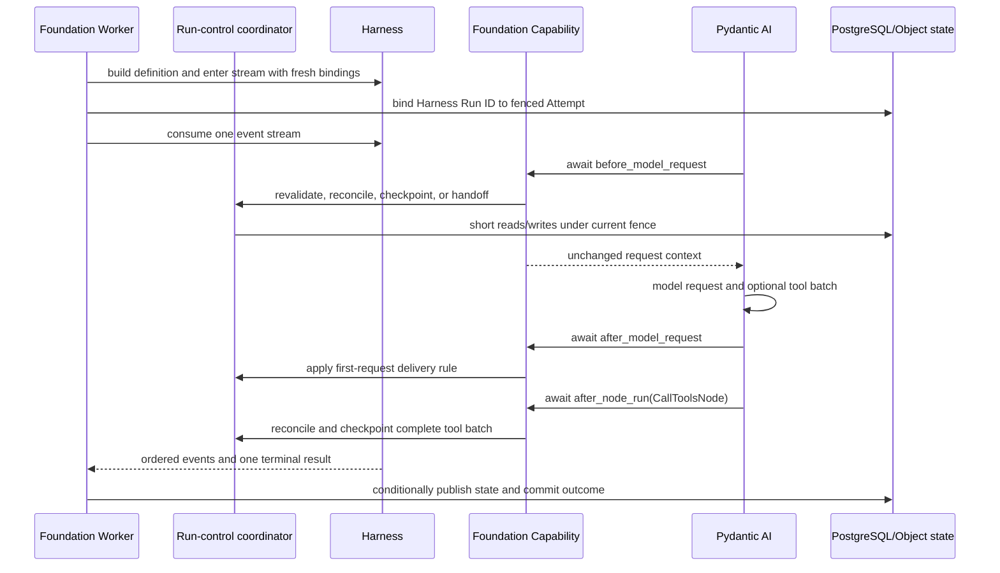

# Foundation–Harness Runtime Integration

## Design Position

Foundation Service embeds Agent Harness in the selected Worker execution loop. The two components share one trusted Python process and one async task tree; they do not communicate through an internal network API, RPC protocol, queue, or serialized callback registry. Harness owns process-local Agent composition, Pydantic AI execution, complete portable state export, and the canonical event/result stream. Foundation owns durable Run and RunAttempt authority, current credentials and policy, Environment selection, checkpoint publication, active control, recovery, and terminal lifecycle commits.

Foundation invokes Harness only through its public construction, run, state, and stream APIs. Harness invokes Foundation-owned behavior through explicit fresh typed collaborators and one mandatory Foundation-owned Pydantic Capability. That Capability is direct trusted Worker composition, not a managed Harness plugin and not caller-selectable Agent content.

This contract owns the concrete integration profile. The generic public Harness surfaces remain owned by [Public API and Packaging](../agent-harness/14-public-api-and-packaging.md), [Execution Context and Lifecycle](../agent-harness/06-execution-context-and-lifecycle.md), and [Harness State and Resume](../agent-harness/10-snapshot-and-resume.md). Foundation persistence and scheduling remain owned by [Durable Run State](12-run-persistence.md) and [Run Attempts, Scheduling, and Recovery](13-run-attempt-scheduling-and-recovery.md).

## Boundaries

| Concern                                                                                       | Owner                                    | Integration rule                                                                               |
| --------------------------------------------------------------------------------------------- | ---------------------------------------- | ---------------------------------------------------------------------------------------------- |
| Agent definition, Capability composition, Pydantic model/tool loop, and process-local cleanup | Harness                                  | Foundation supplies trusted constructed values and does not inspect private graph state        |
| Run, RunAttempt, lease, fence, recovery budget, and terminal lifecycle                        | Foundation                               | No Harness value creates, transfers, or proves durable authority                               |
| Complete portable messages, Capability state, and Environment state envelopes                 | Harness                                  | Export is detached observation with no persistence side effect                                 |
| Durable checkpoint selection and conditional publication                                      | Foundation                               | Only the current fenced Attempt may publish or select `state.json`                             |
| Model, input, context, Environment, and policy collaborators                                  | Foundation through public Harness fields | Values are fresh for the logical Harness Run and never restored from `HarnessState`            |
| Agent-loop lifecycle rendezvous                                                               | Pydantic Capability hooks                | One direct Foundation-owned Capability delegates to the current fenced run-control coordinator |
| Outer semantic-input/event/result middleware                                                  | Harness plugins                          | Plugins remain separate from Foundation control and cannot replace its mandatory Capability    |
| Live events and terminal result                                                               | Harness stream to Foundation             | Backpressured process-local observations; Foundation decides what becomes durable or public    |
| Thread-control wakeup                                                                         | Foundation Redis contract                | Foundation-internal hint containing no business payload; not a Harness communication channel   |

## Security Boundary

### Data and Lifecycle

Only bounded typed values cross the integration boundary. Foundation copies serializable metadata into immutable views, redacts events under the Harness and Foundation observation policies, and persists only the schemas owned by the applicable Foundation contracts. A callback never retains `RunContext`, `AgentContext`, a node, response, or entered Environment beyond the logical Harness Run that supplied it.

Harness state export does not commit progress, a Harness terminal result does not seal a Run, a Harness event does not consume a Thread inbox entry, and a successful enqueue does not prove durable delivery. The corresponding Foundation conditional object write and relational transaction remain the only authoritative transitions.

No database session or transaction is held while a model request, tool call, inline child, external I/O operation, object-store operation, sleep, or streaming response is active. A control callback may perform several short Foundation reads or transactions around external work, but closes each session before crossing those boundaries.

## Integration Surface Classification

Foundation uses four distinct kinds of Harness surface. They are not interchangeable.

| Kind                             | Examples                                                                                              | Invocation owner                                                                      | Purpose                                                                                                  |
| -------------------------------- | ----------------------------------------------------------------------------------------------------- | ------------------------------------------------------------------------------------- | -------------------------------------------------------------------------------------------------------- |
| Direct construction and run API  | `HarnessBuilder.build()`, `ExecutableAgent.stream()`                                                  | Foundation calls Harness                                                              | Build the exact process-local Agent and enter one logical Harness Run                                    |
| Explicit typed run collaborators | `RunInputFactory`, `RunModelResolver`, `ModelContextMiddleware`, `RunBindings`, Environment arguments | Harness awaits or reads a Foundation-supplied value at its documented lifecycle point | Supply universal or run-scoped input, model, context, identity, policy, and Environment values           |
| Native Capability hooks          | `for_run()`, `before_model_request()`, `after_model_request()`, `after_node_run()`                    | Pydantic AI awaits the direct Foundation-owned Capability                             | Reconcile Foundation control and rendezvous at complete Agent-loop boundaries                            |
| Harness plugin middleware        | `AbstractHarnessPlugin.for_run()` and `wrap_run()`                                                    | Harness binds configured or direct plugins                                            | Transform the outer semantic-input/event/result boundary and optionally contribute ordinary Capabilities |

`RunInputFactory`, `RunModelResolver`, and `ModelContextMiddleware` are typed collaborators, not lifecycle hooks and not plugins:

- `RunInputFactory` runs exactly once after fresh Environment entry and before input normalization, plugin binding, or Pydantic execution. Foundation uses it only when accepted `AgentInput` must be materialized through the entered Environment; immediate native input and `input_factory` are mutually exclusive.
- `RunModelResolver` is called only when the selected Agent uses a logical string model ID. It resolves the current authorized native Model and credentials; it is not called before every model request when a concrete Model is already selected.
- `ModelContextMiddleware` is the existing fresh Host wrapper around dynamic model-context projection. Foundation defines no parallel model-context binding. It contributes bounded context and does not own Run control, persistence, or authorization.
- `RunBindings.capabilities` carries documented feature-specific fresh run Capabilities such as policy or resource collaborators. The mandatory Foundation control Capability is instead direct `AgentDefinition.capabilities` composition, so Agent or plugin configuration cannot omit it.

Foundation does not define a generic Tool Dispatch Barrier. It does not require every hosted function tool to be managed and does not map checkpoint persistence to `InvocationPolicyCapability.evaluator`. Harness invocation policy remains a process-local tool authorization and preparation feature; tools that require cross-crash duplicate suppression or reconciliation own an idempotency key or tool-specific durable task protocol.

The callback parameter contracts are the existing Harness types:

```python
type RunInputFactory = Callable[
    [RunPreparationContext],
    Awaitable[RunInputValue],
]


class RunModelResolver(Protocol):
    def __call__(
        self,
        context: ModelResolutionContext[AgentContext],
        model_id: str,
    ) -> Awaitable[Model]: ...


class ModelContextMiddleware(Protocol):
    async def wrap_model_context(
        self,
        ctx: AgentContext,
        request: ModelContextProjectionRequest,
        handler: ModelContextNext,
    ) -> ModelContextProjection: ...
```

`RunPreparationContext` contains only the Harness Run ID, current `AgentInstanceContext`, entered Environment facade, and immutable safe metadata. `ModelResolutionContext` supplies the current `AgentContext` and native Pydantic resolution state; `model_id` is the logical string being resolved. `ModelContextProjectionRequest` classifies an input or tool-results boundary and carries only its typed origin and tool-call correlation. `handler` is the next projection layer, not a general Foundation service locator.

## Definition Construction

After claim and compatibility preflight, the current Worker reconstructs one process-local `AgentDefinition` from the Run-pinned immutable configuration. It then:

1. reconstructs the accepted Agent specification, exact managed plugin set, Skill and subagent composition, output contract, and model selection;
2. creates one Attempt-scoped Foundation run-control coordinator containing only live references to the current Worker services and immutable `(tenant_id, run_id, run_attempt_id, fence, worker_generation)` correlation;
3. inserts one direct `FoundationRunControlCapability` with ID `a13n.foundation.run-control` into `AgentDefinition.capabilities` before building the executable;
4. requires the Harness build to validate finalized Capability identity and ordering, rejecting a duplicate reserved ID or an incompatible outer wrapper; and
5. calls `HarnessBuilder.build(definition)`.

The control Capability contributes no instructions, model settings, Toolset, native tool, output type, or model-facing description. Its ordering is `CapabilityOrdering(position="outermost")`, and Foundation supplies it before plugin-contributed Capabilities at the same tier. It observes the effective downstream response or node result, returns those values unchanged, and performs Foundation control only through its Attempt-scoped coordinator.

The following code is normative in lifecycle shape, while concrete package names for the Foundation-private adapter may differ:

```python
@dataclass
class FoundationRunControlCapability(
    AbstractCapability[AgentContext]
):
    coordinator: FoundationRunControlCoordinator
    id: str = "a13n.foundation.run-control"

    def get_ordering(self) -> CapabilityOrdering:
        return CapabilityOrdering(position="outermost")

    async def for_run(
        self,
        ctx: RunContext[AgentContext],
    ) -> AbstractCapability[AgentContext]:
        return await self.coordinator.bind_model_attempt(ctx)

    async def before_model_request(
        self,
        ctx: RunContext[AgentContext],
        request_context: ModelRequestContext,
    ) -> ModelRequestContext:
        await self.coordinator.before_model_request(
            ctx,
            request_context,
        )
        return request_context

    async def after_model_request(
        self,
        ctx: RunContext[AgentContext],
        *,
        request_context: ModelRequestContext,
        response: ModelResponse,
    ) -> ModelResponse:
        await self.coordinator.after_model_response(ctx, response)
        return response

    async def after_node_run(
        self,
        ctx: RunContext[AgentContext],
        *,
        node: AgentNode[AgentContext],
        result: NodeResult[AgentContext],
    ) -> NodeResult[AgentContext]:
        if isinstance(node, CallToolsNode):
            await self.coordinator.after_tool_batch(ctx, result)
        return result
```

Pydantic calls `for_run()` once for each internal `ModelAttempt`, not once for the outer logical Harness Run. Each returned active Capability is fresh for that ModelAttempt, binds back to the same logical-run coordinator, validates exact `AgentContext` identity, and carries no durable authority by itself. Rebinding after Harness semantic recovery is idempotent and does not reset Thread-inbox receipts, checkpoint sequence, first-request state, or the Foundation RunAttempt fence.

## Run Invocation

Foundation uses `ExecutableAgent.stream()` rather than `run()` because it must consume the canonical event stream, expose live control, and select complete state during execution. One Foundation task is the sole stream consumer.

The following table is the Foundation-to-Harness input mapping for `stream()`. Harness-to-Foundation output, including ordinary stream events, terminal results, and their checkpoint mapping, is defined by [Asynchronous Communication](#asynchronous-communication).

| Argument or field               | Foundation source                                                | Contract                                                                                                      |
| ------------------------------- | ---------------------------------------------------------------- | ------------------------------------------------------------------------------------------------------------- |
| `input`                         | Already materialized accepted `AgentInput` mapping               | Used only when no Environment-dependent acquisition is required                                               |
| `input_factory`                 | Foundation async materializer                                    | Used instead of `input`; called once after Environment entry and receives only `RunPreparationContext`        |
| `bindings.instance`             | Current Agent instance, actor, and lineage                       | Fresh immutable identity for this logical Harness Run                                                         |
| `bindings.model_resolver`       | Current ModelConfig and provider adapter                         | Resolves a logical string to one authorized native Model or fails closed                                      |
| `bindings.capabilities`         | Fresh documented feature collaborators                           | Optional run policy, credentials, grants, or feature ports; never the mandatory Foundation control Capability |
| `bindings.metadata`             | Bounded safe correlation                                         | Non-authoritative IDs and classifications only; no secrets or live objects                                    |
| `bindings.model_context`        | Foundation `ModelContextMiddleware`                              | Bounded current Host context projection without message or durable-state authority                            |
| `bindings.observation`          | Current trace and scope policy                                   | Bounded Harness observation correlation, separate from arbitrary metadata                                     |
| `environment` or `environments` | Fresh adapters constructed from current Foundation Host state    | Entered by Harness; restored portable state cannot replace current authority                                  |
| `default_environment`           | Accepted mount selection                                         | Names one supplied mount and grants no additional access                                                      |
| `previous_state`                | Latest valid Harness value from the Run's committed `state.json` | Detached continuation input; never a lease, credential, or current-state selector by itself                   |
| `deferred_resume`               | Accepted waiting Feedback or Continue resolution                 | Native Pydantic deferred correlation, separate from user input                                                |
| `usage` and `usage_limits`      | Current Attempt accumulator and accepted finite policy           | Shared across internal `ModelAttempt` values; Foundation durable charging remains separate                    |

Illustrative Foundation invocation:

```python
definition = reconstruct_agent_definition(run_state)
definition = definition.with_updates(
    capabilities=(
        FoundationRunControlCapability(coordinator),
        *definition.capabilities,
    )
)
agent = harness_builder.build(definition)

bindings = RunBindings(
    instance=instance_context,
    model_resolver=model_resolver,
    capabilities=feature_run_capabilities,
    metadata=safe_metadata,
    model_context=model_context_middleware,
    observation=observation_context,
)

async with agent.stream(
    input=native_input,
    bindings=bindings,
    environments=fresh_environments,
    default_environment=default_environment,
    previous_state=committed_state.harness,
    deferred_resume=deferred_resume,
    usage=run_usage,
    usage_limits=usage_limits,
) as stream:
    coordinator.bind_stream(stream)
    async for event in stream:
        await project_harness_event(event)
```

When `input_factory` is present, the example omits `input`. Foundation binds the Harness Run ID to the current Attempt after stream entry and before publishing the first live observation, as required by the Attempt contract.

## Asynchronous Communication

| Direction                            | Mechanism                                                                         | Purpose                                                                        | Content and authority                                                                                                   |
| ------------------------------------ | --------------------------------------------------------------------------------- | ------------------------------------------------------------------------------ | ----------------------------------------------------------------------------------------------------------------------- |
| Foundation to Harness                | Awaited `stream()` entry and single-consumer iteration                            | Start and drive one logical Run                                                | Typed run arguments and fresh live collaborators; Foundation retains durable authority                                  |
| Harness to Foundation                | `HarnessStreamEvent` async iterator                                               | Observe model, tool, extension, usage, and terminal progress with backpressure | Typed process-local observations; no event is a durable Foundation transition                                           |
| Harness/Pydantic to Foundation       | Awaited methods on `FoundationRunControlCapability`                               | Reconcile control and checkpoint at model/node boundaries                      | Current `RunContext`, typed request/response/node boundary, and Attempt-scoped coordinator closure                      |
| Harness to Foundation collaborator   | Awaited `RunInputFactory`, `RunModelResolver`, and `ModelContextMiddleware` calls | Materialize input, resolve current Model, and project bounded context          | Only the typed parameters of the owning public interface; failures stop the dependent boundary                          |
| Foundation to active Harness Run     | `HarnessRunStream.steer()`, `cancel()`, and state export                          | Deliver accepted live input, interrupt local work, or capture complete state   | Process-local control only; enqueue IDs and cancellation are not durable receipts or lifecycle commits                  |
| Foundation control process to Worker | Thread-scoped Redis wake signal                                                   | Reduce reconciliation latency                                                  | Thread identity and safe correlation only; Worker re-reads PostgreSQL and never forwards Redis payload as Harness input |

The stream has one consumer and natural backpressure. Foundation decouples client delivery by projecting into its own bounded durable or live channels; it never creates a second consumer or asks Harness to provide replay. Callback calls are in-task awaited calls, not messages placed on Redis, a background queue, or an unbounded task set.

### Harness Stream Output and Result Mapping

Foundation consumes every `HarnessStreamEvent` once. Native model/tool events and `HarnessExtensionEvent` values are projected according to [Events, Usage, and Delivery](25-events-usage-and-delivery.md). At most one terminal `HarnessRunResultEvent` supplies the complete waiting, completed, failed, or cancelled result candidate mapped under [Durable Run State](12-run-persistence.md). Event arrival order, absence, or prior client delivery never replaces the conditional checkpoint and outcome transactions.

When a model response invokes tools, the complete post-tool checkpoint is published from awaited `after_node_run()` on the successfully completed `CallToolsNode`. When a model response invokes no tools and terminates the logical Harness Run, Foundation publishes the complete terminal checkpoint from `HarnessRunResultEvent`, not from `after_model_request()`.

Harness usage snapshots are process-local evidence. Foundation attributes and durably charges usage under the current RunAttempt contract. A late immutable usage record may be admitted under its original Attempt identity, but it cannot restore control authority or change a terminal lifecycle decision.



## Foundation Capability Hook Contract

### Hook Order and Purpose

| Hook                                   | Pydantic boundary                                                               | Foundation work                                                                                                                                                                                  | Not permitted                                                                                                                     |
| -------------------------------------- | ------------------------------------------------------------------------------- | ------------------------------------------------------------------------------------------------------------------------------------------------------------------------------------------------ | --------------------------------------------------------------------------------------------------------------------------------- |
| `for_run()`                            | Once before hooks for each internal `ModelAttempt`                              | Return a fresh active Capability bound to the same logical-run coordinator; validate reserved ID, context, Attempt correlation, and compatible run attachment                                    | Durable reads that outlive preparation, model/tool execution, or replacing accepted Agent content                                 |
| `before_model_request()`               | Awaited before each provider model request                                      | Revalidate current ownership; reconcile ordinary eligible Thread inbox delivery; publish a dirty complete prior boundary when required; honor a pending planned handoff before new provider I/O  | Holding a database session across the provider call, editing the accepted model, or creating a tool-dispatch ledger               |
| `after_model_request()`                | Awaited after a complete model response and before downstream response handling | Inspect the effective response only for the waiting-successor first-request gate; when the first response has no tool calls, reconcile and enqueue the eligible FIFO before ordinary termination | Treating the response alone as a complete tool boundary, persisting a generic tool-dispatch record, or claiming provider rollback |
| `after_node_run()` for `CallToolsNode` | Awaited after the complete tool-handling node succeeds                          | Reconcile eligible delivery, export complete state, publish the post-tool checkpoint, and honor planned handoff before another node begins                                                       | Running before or between individual tool calls, inferring exactly-once effects, or requiring tools to be managed                 |

Foundation uses awaited `after_node_run()` for a successfully completed `CallToolsNode` as the canonical post-tool checkpoint hook. At that boundary, all results for the tool batch are present in complete public message history, so Foundation exports the complete Harness state and publishes `state.json`. If the model invokes no tools and the logical Harness Run terminates, Foundation checkpoints the complete terminal state from `HarnessRunResultEvent`; `after_model_request()` remains limited to the waiting-successor first-request delivery gate and never publishes terminal state.

Foundation does not use a generic `before_tool_execute()` or `after_tool_execute()` hook for persistence. Tool-specific Capabilities may use those public hooks for their own policy or durable-task protocol, but that behavior is not the Foundation Run checkpoint contract.

For each Foundation callback, the internal operation order is:

1. validate that the active Capability, `AgentContext`, Harness Run, RunAttempt, coordinator, and reserved Capability ID still match;
2. enter the process-local run-control critical section and reject a terminally fenced coordinator;
3. perform bounded durable rereads and current lease/fence checks using short sessions;
4. reconcile eligible Thread inbox work in its authoritative FIFO and enqueue only accepted adapted values;
5. when the boundary requires persistence, export one complete Harness state, assemble bounded Host state and receipts, conditionally publish `state.json`, then commit any relational receipt transition in a separate short transaction;
6. if planned handoff is pending and the safe-boundary conditions hold, request local Harness cancellation before releasing the critical section so no later Foundation control operation or new model request is admitted; and
7. return the original Pydantic request, response, or node result unchanged unless cancellation or a classified Foundation failure terminates the local run.

The callback may release and reacquire the process-local critical section only through a coordinator operation that preserves FIFO order and terminal fencing. It never keeps a relational session open while awaiting object storage, Harness enqueue, state export, model/tool work, or another external service.

### Waiting-Successor First-Request Gate

For a successor created from waiting Feedback or waiting Continue, Foundation withholds every waiting-derived Thread inbox entry from the first model request. The Capability records the first request across internal `ModelAttempt` rebinding and applies this rule:

- if the first response contains no tool calls, `after_model_request()` reconciles and enqueues the eligible FIFO before response handling can terminate;
- if the first response contains tool calls, `after_model_request()` records that the gate remains closed and `after_node_run(CallToolsNode)` acts only after the complete tool batch;
- an ordinary next request or ordinary terminal path receives the eligible enqueue, while a deferred or HITL terminal result receives none and lets Foundation seal waiting and roll pending entries forward; and
- Pydantic `RunContext.enqueue(..., priority="asap")` supplies native delivery. Its enqueue ID and `EnqueuedMessagesEvent` are process-local evidence only; durable consumption still requires a complete same-Run checkpoint and Foundation receipt transaction.

The first-request gate is based on the first model request and its complete tool batch, not on the internal `ModelAttempt` count.

### Failure Semantics

All Foundation Capability hooks and typed collaborators are awaited. They create no fire-and-forget persistence, detached callback task, or best-effort durable mutation.

| Failure boundary                                 | Required behavior                                                                                                                                        |
| ------------------------------------------------ | -------------------------------------------------------------------------------------------------------------------------------------------------------- |
| `for_run()` or collaborator binding fails        | No dependent model or tool work begins; Attempt preparation or execution records the safe classified failure                                             |
| `before_model_request()` fails                   | The provider request does not begin; no later hook is assumed to run; the last confirmed checkpoint remains authoritative                                |
| `after_model_request()` fails                    | Provider work may already have occurred; no rollback or non-execution claim is made, and replacement starts from the last confirmed complete checkpoint  |
| `after_node_run(CallToolsNode)` fails            | Tool effects may already have occurred; no generic replay or duplicate-suppression claim is made, and tool-specific reconciliation remains authoritative |
| Enqueue or state export fails                    | No inbox row is marked consumed and no handoff is committed from the unconfirmed candidate                                                               |
| Conditional state publication is lost or unknown | Foundation reconciles the exact object version and body before retrying; the hook does not guess success                                                 |
| Lease or fence is lost                           | The coordinator terminally fences local control, requests Harness cancellation, and suppresses every authoritative Foundation write                      |
| External task cancellation                       | Cancellation propagates after bounded cleanup and cannot be converted into success by a Capability or plugin                                             |
| Hook exception contains unsafe detail            | Foundation records a stable bounded error code and excludes raw credentials, payloads, provider bodies, and callback representations                     |

Hook retries are not an implicit Pydantic model retry. A repeated safe-boundary callback must be idempotent against the same durable inbox receipt, checkpoint sequence, object version, and RunAttempt fence. Failure after model or tool work does not rewind that external work.

## Run-Control Critical Section and Planned Handoff

### Meaning of the Run-Control Barrier

The phrases “run-control barrier” and “run-control gate” refer to one Foundation-owned process-local async critical section attached to the active RunAttempt. It serializes:

- durable Thread-inbox reconciliation and calls to `HarnessRunStream.steer()`;
- complete state export, Host receipt assembly, and checkpoint publication;
- interrupt and planned-handoff cancellation requests;
- terminal outcome selection and local stream finalization; and
- coordinator registration, terminal fencing, and cleanup.

It is not a Harness or Pydantic hook, not a distributed lock, not a database transaction, not a Tool Dispatch Barrier, and not a general pause mechanism. Acquiring it does not interrupt an active provider stream, tool call, inline child, input factory, or state publication. It only prevents concurrent Foundation control operations from crossing one another once execution has reached a separately defined safe boundary.

Consequently, “acquire the run-control barrier and then call `export_state()`” is insufficient. State export is valid for handoff only when both conditions hold:

1. execution is at a complete safe boundary exposed by the direct Host path or an awaited Capability hook; and
2. the coordinator holds the run-control critical section, remains current under its lease and fence, and admits no concurrent enqueue, checkpoint, interrupt, or terminal decision.

### Safe Boundaries and Corresponding Hooks

| Boundary                                                                           | Harness surface                                                                           | Handoff meaning                                                                                                                  |
| ---------------------------------------------------------------------------------- | ----------------------------------------------------------------------------------------- | -------------------------------------------------------------------------------------------------------------------------------- |
| After stream entry and input preparation, before first iteration starts model work | Host calls `HarnessRunStream.export_state()` while it exclusively owns the entered stream | Initial complete state can be published without a Capability hook                                                                |
| Immediately before any later model request                                         | `FoundationRunControlCapability.before_model_request()`                                   | Prior messages and completed nodes form a complete boundary; a pending handoff can checkpoint and cancel before new provider I/O |
| After a complete tool batch                                                        | `FoundationRunControlCapability.after_node_run()` with `CallToolsNode`                    | All results for that node are in the complete public boundary; a pending handoff can checkpoint and cancel before the next node  |
| Waiting or completed terminal result                                               | `HarnessRunResultEvent` consumed by the Worker                                            | Foundation commits the ordinary outcome rather than converting it to `yielded`                                                   |

`after_model_request()` is not by itself a planned-handoff checkpoint hook. Although the provider response is complete, downstream tool handling, output validation, deferred classification, or terminal normalization may still be pending. It exists in this integration for the waiting-successor first-request gate. A handoff requested during a model response waits for the next `before_model_request()`, complete `CallToolsNode` boundary, or ordinary terminal result.

Inside an awaited Capability hook, the Capability exports through `AgentContext.export_state(complete_messages)` using the complete public message sequence for that boundary. Outside the inner Pydantic callback, the Worker may use `HarnessRunStream.export_state()` while the stream is entered and the coordinator has established the same quiescent condition. Neither method persists data. A callback must not recursively call a stream method whose completion depends on the callback returning; the coordinator selects the non-reentrant export path.

### Planned-Handoff Flow

1. Drain or Runner rotation sets one process-local handoff request on the current coordinator. The Attempt continues heartbeat and lease renewal.
2. If model, tool, inline-child, input, enqueue, or checkpoint work is active, Foundation waits. The request does not make that work safe and does not invoke state export concurrently.
3. At the next eligible direct boundary, `before_model_request()`, or `after_node_run(CallToolsNode)`, the awaited Foundation Capability enters the run-control critical section and revalidates current Attempt, lease, fence, handoff budget, and absence of a winning interrupt or terminal decision.
4. The callback reconciles required inbox work, exports complete Harness and Host state, and conditionally publishes or confirms the matching `state.json`. A published checkpoint remains an ordinary recovery checkpoint and contains no handoff marker.
5. After checkpoint confirmation, the coordinator terminally closes admission for steering and new checkpoint work and calls the public idempotent `HarnessRunStream.cancel()` path before releasing the boundary. This cancellation is process-local quiescence, not the durable `cancelled` Run outcome.
6. The Worker leaves the stream context, closes Runtime resources, and attempts the short fenced `yielded` transaction while continuing lease renewal. It commits `yield_reason="service_drain"` or `"runner_rotation"` only when the same Attempt still owns the Run and no ordinary outcome, interrupt, or failure has won.
7. Only a successful `yielded` commit stops renewal and makes the still-running Run eligible for a planned-handoff successor. A failed yield CAS does not free the Run; the Worker reconciles the winning durable state.

If checkpoint publication cannot be confirmed, Foundation does not cancel the local run solely for handoff and does not commit `yielded`; it retains the lease and retries at a later safe boundary until the drain deadline. If the deadline arrives first, the Worker fences local work, stops renewal, and exits. Another Worker may take over only after the recorded lease expires.

## Compatibility

Foundation pins a compatible Harness release and exact Runtime lock in the accepted Run configuration. Changes to any of the following require coordinated spec, implementation, compatibility, and test updates:

- a public Harness run argument or `RunBindings` field used here;
- the Pydantic Capability hook signature or ordering behavior relied on by the mandatory control Capability;
- the complete-message semantics of `AgentContext.export_state()` or `HarnessRunStream.export_state()`;
- the stream cancellation or terminal-result contract used for planned handoff; or
- the Foundation-private coordinator boundary schema and its stable failure classifications.

Adding a new Foundation callback requires an owning lifecycle boundary, exact input types, ordering, authority checks, cancellation behavior, failure semantics, and proof that it cannot be expressed by an existing typed collaborator or Capability hook. A plugin callback, metadata key, or free-form callable registry is never added as a shortcut.

## Invariants

01. Foundation and Harness communicate in one trusted process through public Harness APIs, explicit typed collaborators, the canonical stream, and one direct mandatory Capability; there is no internal RPC or queue boundary.
02. Harness state, events, results, enqueue IDs, metadata, and callbacks grant no durable authority.
03. The current Foundation RunAttempt lease and fence are revalidated before every authoritative callback effect.
04. `RunInputFactory`, `RunModelResolver`, and `ModelContextMiddleware` remain explicit typed collaborators, not plugins or generic Capability hooks.
05. The Foundation control Capability is direct Worker composition with a reserved type and ID; managed plugins cannot select or replace it.
06. Every Foundation hook and collaborator is awaited, cancellation-aware, bounded, and free of detached durable work.
07. No database session or transaction spans model, tool, child, object-store, sleep, or streaming work.
08. The run-control critical section serializes Foundation control but creates no execution safe point by itself.
09. Planned handoff uses `before_model_request()`, `after_node_run(CallToolsNode)`, a pre-model direct boundary, or an ordinary terminal result; there is no handoff-specific Harness hook.
10. `after_model_request()` owns only the first-request delivery decision and is not by itself a post-tool checkpoint or handoff boundary.
11. State export is complete observation without persistence; only a confirmed Foundation checkpoint and fenced relational transition are durable.
12. Foundation defines no generic Tool Dispatch Barrier, tool invocation ledger, or requirement that every hosted function tool be managed.
13. Tool effects completed before a hook failure or crash are not rolled back; duplicate suppression and reconciliation remain tool- or provider-owned.
14. A terminal Harness result competes with planned handoff as an ordinary durable outcome and is never rewritten to `yielded` merely because drain was requested.
