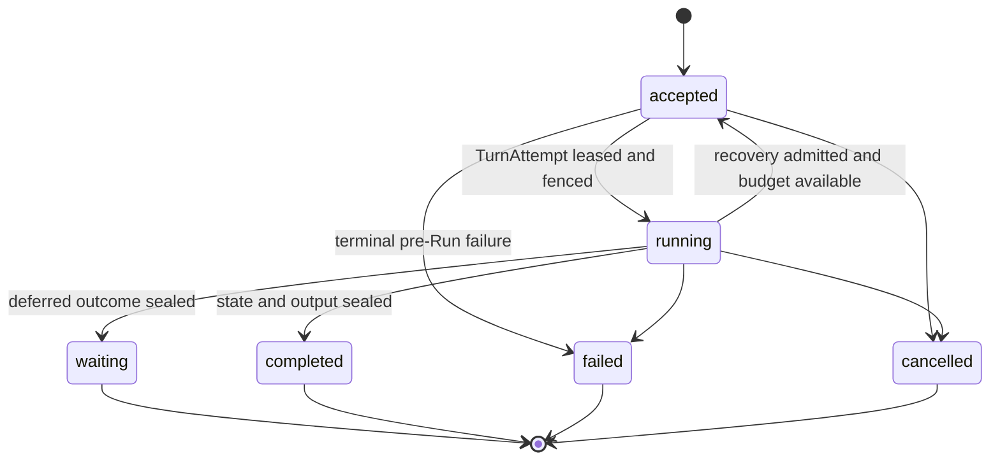
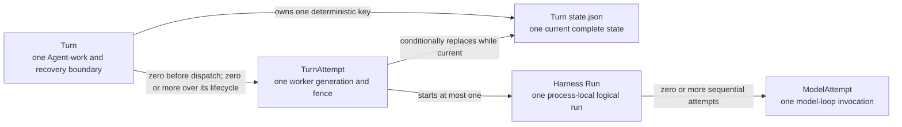
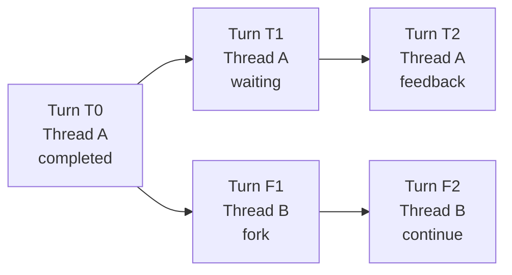

# Durable Turn State

## Design Position

| Dimension               | Core question                              | Foundation choice                                                                                                                                                                                                                                   |
| ----------------------- | ------------------------------------------ | --------------------------------------------------------------------------------------------------------------------------------------------------------------------------------------------------------------------------------------------------- |
| Identity and boundary   | When are Turn and TurnAttempt created?     | Accepting a new Agent request creates a Turn. Starting or restarting a worker for that same accepted request creates a `TurnAttempt` under the existing Turn; its input, parent, selections, and state key do not change                            |
| Logical history         | How do Turns form history?                 | `parent_turn_id` forms a Git-like DAG; the independent Thread row selects current and continuation-head Turns, continue preserves Thread identity, and fork creates a new Thread                                                                    |
| Persistence             | Where is a Turn persisted?                 | Turn metadata lives in the relational database; resumable state and large Turn inputs and outputs live in object storage                                                                                                                            |
| Stored data             | What does a Turn persist?                  | The Turn row holds metadata and object references; `TurnStateEnvelope` holds Harness and Host continuation state; `TurnPayloadEnvelope` holds large Turn inputs and outputs                                                                         |
| State advancement       | Which service instance can commit updates? | At most one worker service instance is lease-authorized through the current fenced `TurnAttempt`; only its relational and conditional object writes can commit, while stale or partitioned instances are rejected                                   |
| Completion and recovery | How do checkpoint, seal, and resume work?  | Checkpoint publication conditionally overwrites the object at the same key; relational sealing selects the exact candidate digest; recovery reads the complete checkpoint from the latest conditionally committed version of that same state object |

Foundation Service persists each accepted Thread advancement as one relational
`Turn` row. The Turn is the durable Agent-work, scheduling, recovery, and
Git-like history boundary; it owns the parent edge, input, exact selections,
finite recovery budget, lifecycle, and sealed outcome.

[Durable Thread Persistence](24-thread-persistence.md) separately owns the
versioned Thread row. Turn acceptance atomically creates or advances that row,
and Turn outcome commit verifies that the sealing Turn remains current and
either selects a new continuation head or preserves the prior head. A Turn row
does not infer Thread existence, current selection, or head state by timestamp.

Each Turn also owns one complete state object at a tenant- and Turn-derived key.
The control plane initializes it from a new root state or the selected parent's
frozen state. The current fenced `TurnAttempt` conditionally replaces it at
complete Harness state boundaries, and sealing makes it immutable. Foundation
stores no separate `base_state`, `result_state`, or selectable checkpoint
history.

Worker recovery can resume the same Turn from its latest valid state object;
`continue` and `fork` instead initialize a new Turn from frozen parent state.
The [Turn Attempt contract](15-turn-attempt-persistence.md#turn-and-turnattempt-allocation-boundary)
owns the complete identity-allocation boundary. No state write for the new Turn
mutates the parent.

This is a Foundation Host policy above the Harness state API. Harness exports
complete detached state but does not select or authorize a durable recovery
point; Foundation selects only the conditionally committed value at the Turn's
deterministic state key.

The shared [interaction model](../interaction-model.md) owns `Session`,
`Thread`, `Turn`, and `Item` meaning. Every Foundation-managed Agent invocation,
including schedules, webhooks, and asynchronous children, accepts a Turn;
non-Agent maintenance uses its owning domain's work model.
[`TurnAttempt`](15-turn-attempt-persistence.md) remains a subordinate worker
generation, and Foundation defines no generic `Execution` resource.

## Boundaries

| Concern                                                                      | Owner                                                                              | Contract                                                                                      |
| ---------------------------------------------------------------------------- | ---------------------------------------------------------------------------------- | --------------------------------------------------------------------------------------------- |
| Session, Thread, Turn, and Item meaning                                      | [Platform Interaction Model](../interaction-model.md)                              | Defines public identity and relationships                                                     |
| Thread row, Session membership, version, current Turn, and continuation head | [Durable Thread Persistence](24-thread-persistence.md)                             | Serializes accepted advancement and selects the exact resumable history head                  |
| Portable messages, Capability namespaces, Environment data, and Thread ID    | [Harness State](../agent-harness/10-snapshot-and-resume.md)                        | Supplies detached state without Host authority                                                |
| Turn row, parent edge, state selection, and outcome                          | Foundation Turn domain                                                             | Forms the authoritative interaction history and Turn-level recovery boundary                  |
| Connector selections and accepted Trigger source                             | [Connectors, Connections, and Triggers](23-connectors-connections-and-triggers.md) | Defines the exact Connector-owned facts frozen at Turn acceptance                             |
| Scheduling, recovery budget, and current-attempt selection                   | Foundation Turn domain                                                             | Authorizes initial dispatch, bounded recovery, and one sealed outcome                         |
| Worker generation, lease, and stale-writer fencing                           | [Turn Attempt Persistence](15-turn-attempt-persistence.md)                         | Authorizes one worker generation and preserves its immutable attempt audit                    |
| Current complete Turn state                                                  | One deterministic Turn state object                                                | Stores the latest conditionally committed Harness and Host state; freezes when the Turn seals |
| Provider resource launch, reattachment, and non-portable continuation        | Foundation Host state and selected provider integration                            | Reconstructs fresh bindings without becoming Harness state                                    |
| Object storage operations                                                    | [Object storage](03-storage.md#object-storage)                                     | Supplies atomic whole-object publication and expected-version replacement                     |
| Lifecycle events, stream messages, and Items                                 | [Lifecycle and Stream Persistence](17-lifecycle-and-stream-persistence.md)         | Stores ordered facts, transports live observations, and retains presentation projections      |
| Pending calls and approvals                                                  | Waiting Turn plus its frozen Turn state                                            | Stores a bounded relational summary and the complete deferred value without a separate table  |
| Unresolved Agent tool calls                                                  | `TurnAttempt` dispatch summary plus fresh Host model context                       | Preserves `unknown_outcome` without replaying the call or blocking semantic resume            |
| Credentials and invocation authority                                         | Foundation Secret and policy boundaries                                            | Resolves fresh authority; plaintext credentials never enter Turn state                        |

## Durable Turn Model

The following Python-like schema is conceptual. It defines durable field
meaning rather than a public wire representation or concrete ORM class.

```python
type TurnLineageKind = Literal["root", "continue", "fork"]
type TurnStatus = Literal[
    "accepted",
    "running",
    "waiting",
    "completed",
    "failed",
    "cancelled",
]
type TurnWaitReason = Literal[
    "approval",
    "external_tool_result",
    "provider_continuation",
    "multiple",
]
type PendingCallKind = Literal[
    "approval",
    "external_tool_result",
    "provider_continuation",
]


class TurnPayloadObjectRef:
    object_key: str
    digest_sha256: str
    size_bytes: int
    content_type: str
    schema_version: str


class PendingCallSummary:
    call_id: str
    kind: PendingCallKind
    tool_name: str | None
    provider_type: str | None
    arguments_digest_sha256: str | None
    presentation: JsonObject | None


class TurnPendingSummary:
    schema_version: Literal["1"]
    calls: tuple[PendingCallSummary, ...]
    resolution_policy: Literal["all"]


class RecoveryUsage:
    schema_version: Literal["1"]
    model_requests: int
    input_tokens: int
    output_tokens: int
    tool_invocations: int
    billable_units: dict[str, int]


class RecoveryUsageLimit:
    schema_version: Literal["1"]
    model_requests: int | None
    input_tokens: int | None
    output_tokens: int | None
    tool_invocations: int | None
    billable_units: dict[str, int]


class RecoveryBudget:
    policy_version: str
    max_attempts: int
    recovery_deadline_at: datetime | None
    max_usage: RecoveryUsageLimit | None


class SealedTurnState:
    digest_sha256: str
    size_bytes: int
    content_type: str
    envelope_schema_version: str
    harness_schema_version: str
    checkpoint_seq: int
    committed_by_turn_attempt_id: str | None


class Turn:
    id: str
    version: int
    tenant_id: str

    session_id: str
    thread_id: str
    parent_turn_id: str | None
    lineage_kind: TurnLineageKind

    trigger_type: str
    trigger_entity_type: str | None
    trigger_entity_id: str | None
    parent_agent_instance_id: str | None
    delegation_id: str | None
    parent_tool_call_id: str | None

    agent_revision_id: AgentRevisionId
    connector_selections: tuple[ConnectorTurnSelection, ...]
    accepted_trigger: AcceptedTriggerSource | None

    priority: int
    queue_name: str
    available_at: datetime
    current_turn_attempt_id: str | None
    next_attempt_fence: int

    recovery_budget: RecoveryBudget
    attempts_started: int
    usage_charged: RecoveryUsage

    idempotency_key: str | None
    request_fingerprint: str

    status: TurnStatus
    wait_reason: TurnWaitReason | None
    input: JsonValue | None
    input_object: TurnPayloadObjectRef | None
    input_text: str | None
    output: JsonValue | None
    output_object: TurnPayloadObjectRef | None
    output_text: str | None
    failure: SafeFailure | None
    pending: TurnPendingSummary | None
    sealed_state: SealedTurnState | None

    created_at: datetime
    updated_at: datetime
    started_at: datetime | None
    waiting_at: datetime | None
    completed_at: datetime | None
    sealed_at: datetime | None
```

`id` is the Foundation-owned Turn identity and follows
[Platform Data Conventions](../data-conventions.md). `version` is the positive
Turn object version used for compare-and-swap relational mutation. The state
object key is derived from `tenant_id` and `id`; it is not duplicated in the
row and is never accepted from a caller.

`session_id`, `thread_id`, `parent_turn_id`, lineage, accepted input,
`agent_revision_id`, Connector selections, accepted Trigger source, accepted recovery policy,
idempotency identity, and request fingerprint are immutable after acceptance.
Every version of the Turn state must carry `turn_id` and `thread_id` equal to
the owning Turn. Foundation rejects another identity rather than rewriting it
during read.

The [Connector contract](23-connectors-connections-and-triggers.md#connection-selection-and-turnattempt-preparation)
defines `ConnectorTurnSelection` and `AcceptedTriggerSource`. A Turn with no
Connector declarations stores an empty `connector_selections`; only a Turn
accepted from a managed Trigger stores `accepted_trigger`, and its
`trigger_entity_id` equals that accepted Trigger ID.

`sealed_state` is absent while the Turn is active. The sealing transaction
records the exact digest, size, schema versions, and checkpoint sequence of the
state object that becomes frozen with the Turn. The deterministic key plus
these fields identifies the exact terminal bytes without introducing a second
base or result object. `committed_by_turn_attempt_id` is null only when a
control-plane failure or cancellation seals a Turn without an attempt-originated
state change.

Every Turn can own zero or more immutable `TurnAttempt` values over its
lifetime, with at most one current and lease-authorized attempt. The
[allocation contract](15-turn-attempt-persistence.md#turn-and-turnattempt-allocation-boundary)
owns when those attempts are created.

`RecoveryBudget` is the accepted recovery-policy snapshot. `max_attempts`
includes the first attempt. `recovery_deadline_at` is a fixed UTC deadline;
`usage_charged` aggregates every attempt, including known usage from failed or
lost work. Every counter and limit is non-negative. A null limit is unbounded,
and missing usage is not treated as zero when the selected provider can
reconcile it. The Turn row is the sole authority for whether another attempt
may be created.

The exact `AgentRevisionId` is fixed at Turn acceptance. The selected immutable
Agent revision owns its dependency locks and exact model-integration revision;
the Turn does not duplicate or override either selection. Resume never resolves
an unqualified `latest` Agent or integration. A compatible continuation under
another Agent revision is another Turn and records that revision ID directly.

Exactly one of `input` and `input_object` is present. At most one of `output`
and `output_object` is present, and neither is present before a completed
outcome. Inline values are bounded structured data suitable for direct Turn
reads. Oversized payloads use immutable objects. `input_text` and `output_text`
are optional bounded derived projections and never replace exact data or the
complete message history.

`waiting` is a sealed Turn outcome. It contains a bounded `pending` summary;
the frozen Turn state contains the authoritative deferred requests, effective
client-tool surface, and Host provider continuation. Authenticated feedback is
the accepted input of a new Turn whose `parent_turn_id` names the waiting Turn
and whose state is initialized from that waiting state.

### Turn Lifecycle



`accepted` means the complete Turn row, accepted input, exact selections,
recovery budget, scheduling fields, and initial or resumed state object are
durable; no attempt is current; and the scheduler may claim the Turn once
`available_at` is reached. It is both the initial scheduling state and the
state to which resume-safe work returns. It is not a queued user-input entry,
and Turn defines no `queued` state.

`running` means a current `TurnAttempt` is leased and fenced. `started_at`
records the first Harness Run entry and never changes during recovery.

`waiting`, `completed`, `failed`, and `cancelled` are sealed outcomes.
`sealed_at` and `sealed_state` are selected in the same relational transaction.
A sealed Turn never changes any column and its state key is never overwritten.

The Turn remains the budget and lifecycle authority after attempt failure or
loss. The [Turn Attempt recovery contract](15-turn-attempt-persistence.md#recovery-and-budget-enforcement)
returns structurally resumable, in-budget work to `accepted` and seals invalid,
incompatible, non-retryable, or exhausted work as `failed`.

### Key Entity Relationships



The complete identity-allocation decision table is owned by
[Turn Attempt Persistence](15-turn-attempt-persistence.md#turn-and-turnattempt-allocation-boundary).

## Relational Turn Table

The conceptual `Turn` materializes as one row in `turns`; supported relational
backends preserve the same validation and query semantics.

| Column group         | Columns                                                                                                                                                                                                                                         | Relational shape and contract                                                                    |
| -------------------- | ----------------------------------------------------------------------------------------------------------------------------------------------------------------------------------------------------------------------------------------------- | ------------------------------------------------------------------------------------------------ |
| Identity             | `id`, `version`, `tenant_id`                                                                                                                                                                                                                    | Opaque text IDs and a positive integer CAS version; `id` is the primary key                      |
| Interaction lineage  | `session_id`, `thread_id`, `parent_turn_id`, `lineage_kind`                                                                                                                                                                                     | Immutable after acceptance; parent is null only for a root                                       |
| Scheduling           | `priority`, `queue_name`, `available_at`, `current_turn_attempt_id`, `next_attempt_fence`                                                                                                                                                       | Durable claim order and the sole current worker generation                                       |
| Recovery budget      | `recovery_policy_version`, `max_attempts`, `recovery_deadline_at`, `max_usage_json`, `attempts_started`, `usage_charged_json`                                                                                                                   | Accepted finite limits and atomically charged consumption                                        |
| Idempotency          | `idempotency_key`, `request_fingerprint`                                                                                                                                                                                                        | Optional retry-safe acceptance identity and exact bounded request fingerprint                    |
| Trigger correlation  | `trigger_type`, `trigger_entity_type`, `trigger_entity_id`, `parent_agent_instance_id`, `delegation_id`, `parent_tool_call_id`                                                                                                                  | Bounded typed correlation; never state-lineage authority                                         |
| Agent selection      | `agent_revision_id`                                                                                                                                                                                                                             | Exact immutable Agent revision selected at acceptance; it owns integration and dependency locks  |
| Connector acceptance | `connector_selections_json`, `accepted_trigger_json`                                                                                                                                                                                            | Bounded immutable Connector selections and optional exact Trigger occurrence                     |
| Lifecycle            | `status`, `wait_reason`, `pending_json`                                                                                                                                                                                                         | Enum-constrained state; bounded pending summary exists exactly for `waiting`                     |
| Input                | `input_json`, `input_object_key`, `input_object_digest_sha256`, `input_object_size_bytes`, `input_object_content_type`, `input_object_schema_version`, `input_text`                                                                             | Exactly one inline JSON value or immutable object reference; optional text projection            |
| Output               | `output_json`, `output_object_key`, `output_object_digest_sha256`, `output_object_size_bytes`, `output_object_content_type`, `output_object_schema_version`, `output_text`                                                                      | Exactly one representation for completed Turns; absent otherwise                                 |
| Failure              | `failure_json`                                                                                                                                                                                                                                  | Bounded safe structured failure only; no raw exception                                           |
| Sealed state         | `sealed_state_digest_sha256`, `sealed_state_size_bytes`, `sealed_state_content_type`, `sealed_state_envelope_schema_version`, `sealed_state_harness_schema_version`, `sealed_state_checkpoint_seq`, `sealed_state_committed_by_turn_attempt_id` | Exact frozen state identity present only after sealing; object key is derived rather than stored |
| Time                 | `created_at`, `updated_at`, `started_at`, `waiting_at`, `completed_at`, `sealed_at`                                                                                                                                                             | UTC instants; lifecycle checks govern nullability                                                |

Object-reference columns form all-or-none groups. Bounded values are validated
before relational mutation; object keys and digests grant no authority.

## Git-Like Turn DAG

`parent_turn_id` names the exact sealed Turn whose frozen state initialized the
new Turn. It is the sole interaction-history edge.



The lineage rules are:

1. A root Turn has `parent_turn_id=null`, `lineage_kind=root`, and a Turn-owned
   state initialized with `HarnessState.new()`.
2. An ordinary continuation has `lineage_kind=continue`, uses a completed
   parent in the same Thread, and initializes its state from the parent's frozen
   state while preserving `thread_id`.
3. Authenticated feedback has `lineage_kind=continue`, uses the exact waiting
   parent, initializes its state from that parent's frozen deferred state, and
   preserves `thread_id`.
4. A fork has `lineage_kind=fork`, uses a completed parent, transforms its
   frozen Harness state with `HarnessState.fork()`, retains only portable Host
   continuation, and initializes a new state with the new `thread_id`.
5. A child Agent that starts with independent empty history is a root of its own
   Thread. Structural or causal parentage uses trigger and delegation fields.
6. Worker resume preserves the Turn, Thread, parent edge, and state key. It does
   not add a DAG node.
7. Failed and cancelled Turns remain queryable but are not eligible parents.

The independent Thread row serializes every accepted advancement. At most one
Turn with a given `(thread_id, parent_turn_id)` can be active or seal as
`waiting` or `completed`; failed and cancelled siblings do not block a later
accepted advancement from the same eligible parent. Acceptance locks the
Thread, verifies its exact version, current selection, and continuation head,
then advances it atomically with the new Turn. An explicit fork creates a new
Thread row and first Turn in the same transaction.

A lineage read follows `parent_turn_id` from an explicitly selected head. It is
tenant-scoped, cycle-safe, and bounded. Created time and event order are not
lineage authority.

The relational implementation uses one bounded recursive query, verifies that
traversal reaches a root without a cycle or truncation, and returns at most
1,000 Turn rows. Its recursive step runs once per ancestor. For `A` ancestors
before a fork and `L` ancestors in the fork's local lineage, it visits
`A + L + 1` rows in one database round trip, with `O(A + L)` work and temporary
path state.

The public route, response, authorization, and failure contract are owned by
[Turn Lineage Read](21-management-api.md#turn-lineage-read).

## Turn State Object

Each accepted Turn owns one `TurnStateEnvelope`. It combines Harness portable
state with Host continuation required to resume the same Turn or initialize a
new Turn from a selected parent. It contains data and correlation, never current
authority.

```python
type ContinuationScope = Literal["same_thread", "portable"]
type TurnStateCheckpointKind = Literal[
    "initial",
    "progress",
    "waiting",
    "completed",
]
type TurnInputDisposition = Literal["pending", "applied"]


class EntityRevisionRef:
    entity_type: str
    entity_id: str
    version: int
    digest_sha256: str


class ProviderContinuationEntry:
    resource_kind: str
    binding_id: str
    provider_type: str
    state_version: str
    continuation_scope: ContinuationScope
    required: bool
    observed_generation: str | None
    payload: JsonValue | None


class ProviderPendingRequest:
    call_id: str
    provider_type: str
    request_schema_version: str
    request: JsonObject


class DeferredContinuationState:
    schema_version: Literal["1"]
    requests: JsonObject
    effective_client_tool_surface: JsonValue | None
    effective_surface_digest_sha256: str | None
    provider_requests: tuple[ProviderPendingRequest, ...]


class HostContinuationState:
    schema_version: Literal["1"]
    desired_environment_topology: EntityRevisionRef | None
    provider_entries: tuple[ProviderContinuationEntry, ...]
    deferred: DeferredContinuationState | None


class TurnStateOutcomeCandidate:
    outcome: Literal["waiting", "completed"]
    wait_reason: TurnWaitReason | None
    pending: TurnPendingSummary | None
    output: JsonValue | None
    output_object: TurnPayloadObjectRef | None
    output_text: str | None


class TurnStateEnvelope:
    schema_version: Literal["1"]
    turn_id: str
    thread_id: str
    checkpoint_seq: int
    checkpoint_kind: TurnStateCheckpointKind
    input_disposition: TurnInputDisposition
    last_checkpoint_turn_attempt_id: str | None
    last_checkpoint_fence: int

    agent_revision_id: AgentRevisionId
    harness_schema_version: str
    harness: HarnessState
    host: HostContinuationState
    outcome_candidate: TurnStateOutcomeCandidate | None
```

This is the complete serialized outer schema. `HarnessState` is encoded through
its owning public adapter and carries the same `thread_id`. `checkpoint_seq`
starts at zero and increases monotonically for each successful semantic state
replacement. The initial value has `checkpoint_kind=initial`,
`input_disposition=pending`, no attempt identity, fence zero, and no outcome
candidate.

The first checkpoint after the accepted Turn input has crossed the Harness
input boundary sets `input_disposition=applied`. Every later progress or outcome
checkpoint retains `applied`. This field prevents a later attempt from injecting
the same accepted input twice: a pending initial state receives the Turn input;
an applied state resumes directly from its exported Harness and Host state.

`checkpoint_kind=progress` contains no outcome candidate.
`checkpoint_kind=waiting` or `completed` contains the matching complete
`outcome_candidate`. A waiting candidate has a non-empty pending summary, no
output, and complete deferred state in `host.deferred`. A completed candidate
has an output representation, no pending summary, and no deferred state. The
candidate is durable preparation for the relational outcome transaction; it is
not a sealed Turn outcome by itself.

Each `ProviderContinuationEntry.payload` is bounded provider-owned JSON
interpreted under `state_version` and stored inline in `TurnStateEnvelope`; it
is recovery data, not authoritative provider resource state. A required entry
has a payload; an optional entry can omit it and request fresh materialization.
`provider_requests` carries only
Host/provider suspension values not represented by Pydantic deferred requests.
Its call IDs and those inside `requests` are disjoint, and their union equals
the waiting pending summary.

The envelope separates two state classes:

| State class             | Contents                                                                                                                         | Restore rule                                                                                  |
| ----------------------- | -------------------------------------------------------------------------------------------------------------------------------- | --------------------------------------------------------------------------------------------- |
| Harness portable state  | Thread ID, messages, Capability namespaces, portable Environment binding data                                                    | Validated by Harness and owning codecs after fresh bindings exist                             |
| Host continuation state | Desired-topology version, provider launch or reattachment data, and optional complete deferred request and client-surface values | Validated and consumed by Foundation and selected integrations before or around Harness entry |

The envelope contains data and correlation only; current policy, credentials,
live resources, and process-local objects are resolved afresh.

`continuation_scope` bounds initialization of a new Turn:

| Scope         | Permitted reuse                                                                                            |
| ------------- | ---------------------------------------------------------------------------------------------------------- |
| `same_thread` | A new Turn preserving `thread_id` and naming the exact previous Turn through `parent_turn_id`              |
| `portable`    | A new Turn in the same Thread or an explicit fork after current authorization and compatibility validation |

Fork drops entries that are not portable. A missing optional entry causes fresh
provider materialization. A required entry that is unavailable, incompatible,
malformed, or unauthorized fails before model or tool work.

### State Initialization Matrix

| Concern                                       | Root Turn                                                   | Continue or waiting-feedback Turn                                                    | Fork Turn                                                                       |
| --------------------------------------------- | ----------------------------------------------------------- | ------------------------------------------------------------------------------------ | ------------------------------------------------------------------------------- |
| Turn and state identity                       | Allocate a Turn and deterministic Turn-owned state key      | Allocate a new Turn and new key; name the exact sealed parent                        | Allocate a new Turn, new Thread, and new key                                    |
| Harness state                                 | Create `HarnessState.new()`                                 | Copy the parent's frozen Harness state and preserve `thread_id`                      | Apply `HarnessState.fork()` and use its new `thread_id`                         |
| Host provider continuation                    | Build from desired topology and current provider selections | Retain eligible entries; waiting feedback retains the exact deferred value initially | Retain only eligible `portable` entries; clear parent outcome and deferred data |
| Accepted input                                | Store on the Turn; initial state marks it pending           | Store new input on the new Turn; initial state marks it pending                      | Store new input on the new Turn; initial state marks it pending                 |
| Definition and integration                    | Pin exact Turn selections                                   | Pin exact selections for the new Turn and validate inherited data                    | Pin exact selections for the new Turn and validate portable inherited data      |
| Policy, Secrets, bindings, tools, and clients | Resolve fresh for the Harness Run                           | Resolve fresh and reauthorize retained selectors                                     | Resolve fresh and reauthorize retained portable selectors                       |

Initialization of a new Turn always writes a complete Turn-owned envelope with
`checkpoint_seq=0`. It does not reference the parent state as a base, retain the
parent's outcome candidate as the new Turn's outcome, or create another state
field on the new Turn. Parent state is only immutable source data for this
initialization.

### State Key, Conditional Writes, and Fencing

The state key is deterministic and stable for the lifetime of the Turn:

```text
tenants/{tenant_id}/turns/{turn_id}/state.json
```

The content type is `application/vnd.converge.turn-state+json`. Object metadata
records `schema-version`, `turn-id`, `thread-id`, `checkpoint-seq`,
`writer-fence`, and the lowercase SHA-256 digest of the canonical body. Object
stat supplies exact byte size and the opaque current object version.

Acceptance publishes the initial object create-only. A current attempt does not
write until it has conditionally claimed the current object version for its
monotonic Turn fence. Every state replacement then supplies the exact object
version returned by the claim or previous successful write. The replacement is
visible as the complete new object or not visible at all.

Before each write, Foundation verifies that the Turn remains unsealed and that
the attempt ID, fence, lease, tenant, and Turn version are current. It holds no
database transaction across object I/O. Expected-version replacement serializes
the object writes: after a newer attempt claims the key, an older attempt's
known object version can no longer overwrite it. A conflict causes a fresh read
of Turn and object authority; it is never retried as an unconditional put.

Foundation exposes no checkpoint object ID and never selects an older object
version. A storage backend can retain physical versions internally, but those
versions are backup or provider implementation details, not application-visible
checkpoint objects. Logically, one Turn has one key and one current state.

### Resume Semantics

Foundation writes state only after `HarnessRunStream.export_state()` produces a
complete structurally valid state and Host continuation has been serialized
under its bounds. Raw token deltas, incomplete private graph nodes, live
bindings, and process-local handles never enter the object.

After the [Turn Attempt allocation contract](15-turn-attempt-persistence.md#turn-and-turnattempt-allocation-boundary)
authorizes a later attempt for the same Turn, the worker claims the existing
state key, validates the envelope and provider continuation, reconstructs fresh
bindings, and resumes:

- `input_disposition=pending` starts from the initialized state and supplies
  the Turn's exact accepted input;
- `input_disposition=applied` resumes from the checkpoint without supplying the
  accepted input again;
- a valid waiting or completed outcome candidate can be committed idempotently
  without repeating model or tool work when its relational outcome was not yet
  sealed.

The resume point is the current state object, not an event cursor, latest object
listing result, lifecycle timestamp, retained Item, or state from another Turn.
If work occurred after the last successful conditional write, that work is not
part of the resume point. The
[Turn Attempt recovery contract](15-turn-attempt-persistence.md#recovery-and-budget-enforcement)
owns unresolved tool-call handling after that boundary.

## Object Storage Schemas

All JSON objects serialize as UTF-8 RFC 8785 canonical JSON after typed values
are converted to declared JSON strings. Digests and sizes cover those exact
bytes. Non-finite numbers and duplicate object keys are invalid.

Foundation Turn persistence uses these serialized object types:

| Object type           | Content type                                 | Owner                                                    |
| --------------------- | -------------------------------------------- | -------------------------------------------------------- |
| `TurnStateEnvelope`   | `application/vnd.converge.turn-state+json`   | One deterministic, conditionally replaced Turn state key |
| `TurnPayloadEnvelope` | `application/vnd.converge.turn-payload+json` | Immutable oversized Turn input or output                 |

[Lifecycle and Stream Persistence](17-lifecycle-and-stream-persistence.md)
separately owns `TurnReplaySnapshot`.

### Turn Payload Object

```python
class TurnPayloadEnvelope:
    schema_version: Literal["1"]
    turn_id: str
    payload_kind: Literal["input", "output"]
    payload_schema_version: str
    payload: JsonValue
```

The object key is content-addressed beneath the Turn:

```text
tenants/{tenant_id}/turns/{turn_id}/payloads/{payload_kind}/{digest_sha256}.json
```

Attachments and file bodies remain separate artifact objects referenced by the
structured payload.

### Retention

Retention never removes a state or Turn payload object while a retained Turn or
successor depends on it. A parent state remains frozen and reachable while any
successor or lineage policy requires it. Reference-aware deletion never relies
on object age alone.

## Turn Acceptance, Checkpoint, and Outcome Commit

Turn acceptance creates or advances the Thread row together with the Turn row
and its initial state as one externally indivisible acceptance operation:

1. validate authorization, Thread version, current/head selection, lineage,
   selections, and any parent state, then build the complete Turn-owned initial
   state;
2. publish object-backed input and `state.json` create-only;
3. in one short transaction, insert or advance the Thread, insert the `accepted`
   Turn, and commit required lifecycle facts, idempotency evidence, and outbox
   intents.

```mermaid
sequenceDiagram
    participant Control as Control plane
    participant Objects as Object storage
    participant DB as Relational database

    Control->>Control: Validate Thread version, parent, policy, and selections
    Control->>Objects: Read frozen parent state when required
    Control->>Control: Build new Turn initial state
    Control->>Objects: Create new Turn state.json and object-backed input
    Control->>DB: Commit Thread advancement, Turn, and lifecycle facts
    alt transaction commits
        DB-->>Control: Thread advanced and Turn accepted
    else transaction fails
        DB-->>Control: Thread unchanged; objects remain cleanup candidates
    end
```

### Checkpoint Triggers and Refresh

During an active Harness Run, Foundation requests a progress checkpoint only
at a complete public state boundary:

1. after the accepted Turn input has crossed the Harness input boundary and
   before the first model request;
2. after a complete tool batch and its results have entered the next complete
   message boundary, before another model request;
3. between internal `ModelAttempt` values when the Harness exposes a new
   complete normalized state.

A waiting or completed Harness outcome always triggers its matching outcome
checkpoint. Raw stream deltas, an in-flight model response, an incomplete tool
batch, an active inline child, a lease heartbeat, and elapsed time alone never
trigger state publication. Adjacent progress triggers with no Harness or Host
state change are coalesced rather than creating duplicate checkpoints.

During execution, a checkpoint operation:

1. exports complete Harness state and builds bounded Host state;
2. validates current Turn, attempt, fence, lease, and expected object version;
3. conditionally replaces the same `state.json` with the next checkpoint
   sequence and matching metadata;
4. treats only the returned object version as the next valid write token.

Checkpoint writes do not create a Turn row, attempt row, lifecycle transition,
or historical checkpoint selector. A failed or unknown put is reconciled by
`stat` and exact body validation before any retry.

A waiting or completed outcome commits in this order:

1. publish any immutable object-backed output;
2. conditionally replace `state.json` with a complete matching outcome
   candidate;
3. in one short transaction, revalidate current Turn and `TurnAttempt`, select
   the candidate's exact digest and checkpoint sequence as `sealed_state`, copy
   its bounded output or pending summary into the Turn row, terminalize the
   attempt, charge known usage, append lifecycle facts, verify that this Turn is
   still the Thread's current Turn, seal it, select it as the continuation head,
   and increment the Thread version;
4. after commit, reject every later write to the state key.

If the object write succeeds but the relational transaction does not commit,
the Turn remains active and the outcome candidate remains a valid resumable
state, not a sealed outcome. The current attempt or an authorized later attempt
can retry the exact relational commit after reconciliation. Object timestamps
or listings never authorize that adoption.

A failed or cancelled outcome freezes the latest valid state by recording its
digest and checkpoint sequence while sealing the relational outcome. The same
transaction verifies that the Turn remains current, preserves it as the
Thread's current Turn, preserves the prior continuation head, and increments
the Thread version. It does not make that state eligible as a parent.

## Accounting Boundary

A separate accounting contract owns Turn acceptance audit, usage aggregation,
pricing revisions, and settlement lifecycle. Those records may correlate by
`turn_id` but never select Turn state, mutate a sealed Turn, or authorize
another attempt.

## Relational Constraints and Queries

The `turns` table follows the
[Relational Schema Lifecycle](04-relational-schema.md) and preserves these
constraints:

1. `id` is the primary key, `(tenant_id, id)` is unique so parent references
   remain same-tenant, and `(tenant_id, thread_id)` references one durable
   Thread in the same tenant and Session.
2. Immutable acceptance fields never change; versions, fences, checkpoint
   sequences, sizes, and recovery counters satisfy their positive or
   non-negative field bounds.
3. Input has exactly one inline or object-backed representation. Outcome fields
   satisfy their status-specific nullability, and output exists only for
   `completed`.
4. Every sealed-state digest matches the selected envelope identity, checkpoint,
   and outcome candidate. Sealed rows reject all updates.
5. `current_turn_attempt_id` exists exactly for `running`. Active updates require
   expected Turn version; attempt-originated updates also require the current
   attempt, fence, and lease.
6. Continue and fork require a completed parent. Waiting feedback requires the
   exact waiting parent and consumes all pending calls. Failed and cancelled
   Turns are never eligible parents.
7. `attempts_started` does not exceed `max_attempts`; attempt, deadline, and
   usage limits remain Turn-owned recovery authority.

The accepted access paths are:

| Access path                          | Index or uniqueness contract                                                                                                          |
| ------------------------------------ | ------------------------------------------------------------------------------------------------------------------------------------- |
| Scheduler claim                      | `(tenant_id, queue_name, status, available_at, priority, created_at, id)` for `accepted`                                              |
| Idempotent acceptance                | Unique `(tenant_id, idempotency_key)` when the key exists                                                                             |
| Session activity                     | `(tenant_id, session_id, created_at, id)`                                                                                             |
| Thread activity and stable paging    | `(tenant_id, thread_id, created_at, id)`                                                                                              |
| DAG successor traversal              | `(tenant_id, parent_turn_id, id)`                                                                                                     |
| DAG ancestor traversal               | Unique `(tenant_id, id)` parent lookup at each recursive step                                                                         |
| One active Turn per Thread           | Partial unique `(tenant_id, thread_id)` for `accepted` and `running`                                                                  |
| One winning successor per state edge | Partial unique `(tenant_id, thread_id, parent_turn_id)` for `accepted`, `running`, `waiting`, and `completed` when parent is non-null |
| One root history per Thread          | Partial unique `(tenant_id, thread_id)` for `accepted`, `running`, `waiting`, and `completed` when parent is null                     |

## Security and Protection

Turn input, output, Harness state, Capability state, Environment state, provider
continuation, pending summaries, deferred requests, and Turn-scoped audit and
usage records are sensitive tenant data. Relational and object reads are
tenant-scoped and reauthorized. Object keys and Turn IDs grant no access by
possession.

State and payload objects use authenticated integrity verification and
deployment-approved encryption at rest. Plaintext credentials, bearer
authorization, Secret values, and ephemeral credential leases never enter a
Turn row, state object, event, Item, error, trace, or ordinary log.

Fork, continuation, and resume re-evaluate current policy, definition
eligibility, provider availability, Capability composition, tool grants,
Environment topology, and resource compatibility. Persisted state is data and
correlation, not authority. Unknown Capability or provider payloads survive
only under their own forward-compatible rules and are never executed or
attached by generic fallback.

## Failure and Recovery Semantics

| Failure or interruption                                                      | Durable outcome                                              | Recovery rule                                                                                                                                     |
| ---------------------------------------------------------------------------- | ------------------------------------------------------------ | ------------------------------------------------------------------------------------------------------------------------------------------------- |
| Initial state or input publication fails                                     | No Turn is accepted                                          | Retry under the acceptance idempotency contract                                                                                                   |
| Initial objects publish but relational acceptance fails                      | Objects are non-authoritative orphans                        | Cleanup removes them after proving no accepted Turn owns the key                                                                                  |
| Conditional state write conflicts                                            | Existing complete state remains visible                      | Re-read Turn and object versions; stale writers stop                                                                                              |
| State write response is lost                                                 | Replacement effect is unknown                                | Reconcile by deterministic key, metadata, and opaque version before retrying                                                                      |
| Terminal candidate writes but relational seal fails                          | Turn remains active; candidate is a resumable prepared state | Current or later authorized attempt can retry exact sealing after reconciliation                                                                  |
| Stale `TurnAttempt` writes state, lifecycle, usage, pending data, or outcome | Write is rejected by Turn and object fencing                 | Current attempt continues; stale work is cancelled best-effort                                                                                    |
| Worker disappears after a committed checkpoint                               | Latest state remains at the same key                         | Later fenced attempt reconstructs fresh bindings and resumes according to `input_disposition`                                                     |
| Worker disappears after uncheckpointed work                                  | Only the prior checkpoint is recoverable                     | Mark durably dispatched Agent tool calls without recorded results as `unknown_outcome`, then let a later attempt resume within budget             |
| Recovery budget is exhausted                                                 | Turn seals as `failed`                                       | The sealed Turn receives no later attempt; see the [allocation boundary](15-turn-attempt-persistence.md#turn-and-turnattempt-allocation-boundary) |
| Required state or provider data is incompatible or unavailable               | No model or tool work starts                                 | Apply an explicit compatible reader or fail the Turn                                                                                              |
| State object is missing or fails integrity validation                        | Turn remains authoritative but unreadable                    | Fail closed and restore that exact key from protected recovery data; never substitute listing results                                             |
| Waiting feedback is invalid or mismatches frozen deferred requests           | Waiting Turn remains unchanged                               | Reject input; do not create a new Turn                                                                                                            |
| Parent is absent, unauthorized, unsealed, ineligible, or advanced            | Turn acceptance fails                                        | Caller re-reads authorized history or requests an explicit fork                                                                                   |
| Write is attempted after Turn sealing                                        | Frozen state and outcome remain unchanged                    | Reject even if the caller has process-local bytes or a stale object version                                                                       |

Cancellation before durable acceptance creates no Turn. Cancellation after
acceptance follows the Turn lifecycle and freezes the latest valid state but
does not make the Turn an eligible parent. A lost client response after possible
acceptance is reconciled through the API idempotency contract.

## Compatibility

The compatibility axes remain independent:

| Version                                  | Owner                                    |
| ---------------------------------------- | ---------------------------------------- |
| Turn domain object version               | Foundation Turn mutation contract        |
| Relational schema revision               | Foundation Service migration history     |
| `TurnStateEnvelope.schema_version`       | Foundation Turn state contract           |
| Turn payload object schema version       | Foundation Turn payload contract         |
| `HarnessState.schema_version`            | Agent Harness                            |
| Capability state version                 | Owning Capability                        |
| Environment state version                | Owning Environment provider              |
| Host provider continuation version       | Selected Foundation provider integration |
| Definition and model-integration version | Foundation immutable revision domains    |

An unknown required state, payload, Harness, Capability, Environment, or
provider version fails explicitly unless its owner supplies a compatible
reader or migration. A sealed parent state is never rewritten for compatibility
with a new Turn; initialization reads and transforms it into the new Turn-owned
state. An active Turn migration, when supported, is another fenced
conditional replacement of the same key.

Relational migrations never reinterpret state bytes through current defaults.
Adding a provider resource kind or trigger kind is additive only when old
readers preserve it as unknown without attaching, executing, or authorizing it.

## Trade-offs

One stable state key removes the duplicated base/result state model and makes a
Turn's current recovery value direct. It also introduces durable writes during
execution and makes conditional-write fencing part of recovery correctness.

Each new Turn owns a complete state copy, so initialization cost grows with the
retained Thread state. Checkpointing reduces repeated model and tool work but
cannot make external effects exactly once; unresolved calls follow the
[Turn Attempt recovery contract](15-turn-attempt-persistence.md#recovery-and-budget-enforcement).

## Invariants

1. The Turn is Foundation's durable Agent-work and recovery boundary; each Turn
   owns one deterministic state key and no base, result, or selectable
   checkpoint-history object.
2. Root, continue, and fork initialize a complete Turn-owned state without
   mutating or aliasing the parent key.
3. Only the current leased and fenced `TurnAttempt` can conditionally replace
   active state; `checkpoint_seq` and expected object versions prevent stale
   overwrite.
4. `input_disposition` prevents accepted input from being injected twice.
5. `parent_turn_id` is the sole semantic history edge. Waiting feedback creates
   another Turn rather than mutating the sealed parent.
6. Waiting and completed outcomes become authoritative only when relational
   sealing selects the matching state candidate; the sealed Turn and state are
   immutable.
7. Persisted state restores data and correlation, never current authority.
   Events, Items, streams, accounting records, listings, and worker memory never
   select state.
