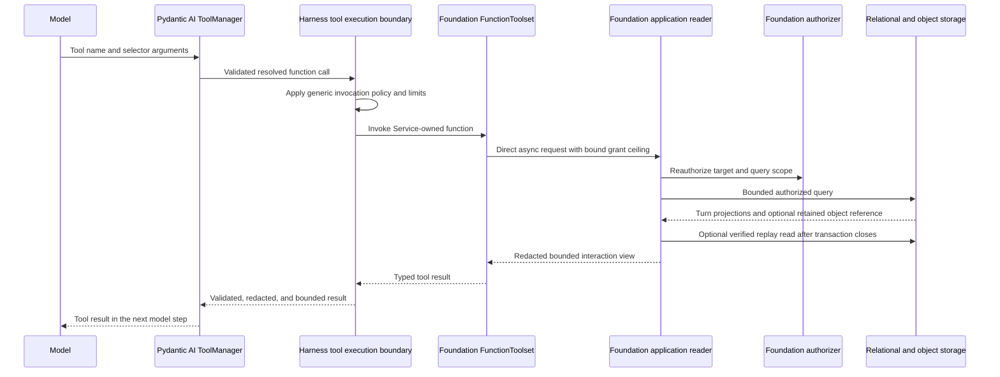

# Agent Interaction History Retrieval

## Design Position

Foundation Service provides an optional `foundation.interaction_read`
Capability that lets an Agent discover and read prior authorized interaction
history, including history in another Thread or Session. The Capability, its
model tools, authorization policy, query application service, and persistence
adapters are owned by Foundation Service. It uses the existing public Harness
plugin, Capability, and Toolset extension boundaries without adding a
Foundation-specific contract to the Harness.

The model-facing Toolset calls a narrow Foundation application interface in the
same process. It does not call a Foundation HTTP route, use a Foundation SDK, or
mint a service credential for a request back into the same service. The
execution process wires the same domain authorization, repositories, and
storage capabilities used by other Foundation application paths.

The Capability is read-only and progressively discloses bounded interaction
views. It reads Turn query projections from the relational store and, when
authorized detail is requested, user-visible Items from the retained replay
projection. It never treats replay, search text, timestamps, or model-provided
identifiers as interaction or authorization authority.

## Boundaries

| Concern                                                  | Owner                                                                                                       | Contract                                                                                             |
| -------------------------------------------------------- | ----------------------------------------------------------------------------------------------------------- | ---------------------------------------------------------------------------------------------------- |
| Session, Thread, Turn, and Item meaning                  | [Platform Interaction Model](../interaction-model.md)                                                       | Supplies the shared interaction hierarchy and identity rules                                         |
| Turn lineage, exact input/output, and state              | [Durable Turn State](12-turn-persistence.md)                                                                | Remains the authoritative interaction history and state boundary                                     |
| Live and retained user-visible Items                     | [Lifecycle and Stream Persistence](14-lifecycle-and-stream-persistence.md)                                  | Supplies bounded presentation data without becoming Turn-state authority                             |
| Definition-selected retrieval policy                     | Foundation definition revision                                                                              | Stores a serializable maximum scope and content policy, never a Python object or current grant       |
| Process-local plugin, Capability, Toolset, and read port | Foundation Service trusted reconstruction                                                                   | Contributes tools through existing Harness extension points and binds one fresh run collaborator     |
| Current read authorization                               | Foundation Host or product policy                                                                           | Intersects definition, Turn, principal, visibility, and retention policy on every operation          |
| Query and result projection                              | Foundation interaction-read application service                                                             | Executes authorized reads, verifies retained objects, redacts content, and enforces bounds           |
| Tool invocation boundary                                 | Harness and Pydantic AI                                                                                     | Invokes the native Toolset and applies the ordinary tool lifecycle, limits, and observation contract |
| Public HTTP or SDK access                                | Owning Foundation API contract, when separately defined                                                     | Is not required or invoked by this process-local Capability                                          |
| Agent UI current-Session browsing                        | [Agent UI Session contract](../agent-ui/04-sessions-environments-and-state.md#read-only-session-capability) | Remains a separate local-Host Capability and is unchanged by this contract                           |

This contract introduces no relational table, object type, lifecycle state, or
public HTTP route. Session and Thread discovery is a projection over authorized
Turns; it is not an authoritative enumeration of empty Sessions or Threads.
Exact Turn state objects, provider state, and audit records remain outside
the retrieval surface.

## Definition Policy and Run Authority

The following Python-like schemas are conceptual. They define Foundation-owned
meaning rather than public API or Harness wire values.

```python
type InteractionReadScope = Literal[
    "current_session",
    "authorized_sessions",
]
type InteractionReadContent = Literal[
    "turn_summaries",
    "visible_items",
]


class InteractionReadPolicy:
    schema_version: Literal["1"]
    scope: InteractionReadScope
    content: InteractionReadContent
    max_page_size: int
    max_snippet_chars: int
    max_item_chars: int
```

The immutable Foundation definition revision either omits this policy or
selects one exact version. Omission means that the Capability and its tools are
absent. `scope`, `content`, and every numeric value are ceilings: the current
run and service hard limits can narrow them but cannot widen them.

`current_session` restricts every result to the current Turn's trusted
`session_id`. `authorized_sessions` permits discovery across Sessions only
where the current authenticated principal and product policy authorize the
requested read. The policy does not contain tenant IDs, user IDs, bearer
tokens, credentials, or a durable list of authorized Session IDs.

Before the first model request, the worker derives a fresh
process-local read grant from all of these inputs:

1. the exact definition revision and its `InteractionReadPolicy`;
2. the current Agent instance identity and accepted Turn correlation;
3. any Turn-level scope reduction selected by the trusted caller;
4. current tenant, principal, product, visibility, archival, and retention
   policy;
5. service hard limits and the current Turn-attempt or Harness Run deadline.

The effective scope is the intersection of those inputs. The grant is a ceiling
and correlation value, not a snapshot entitlement. Every tool call and every
cursor page reauthorizes the selected Session, Thread, and Turn under current
policy before returning data. Revocation therefore fails closed during a run.

The grant and its reader are process-local. They never enter the Foundation
definition document, `RunBindings.metadata`, `HarnessState`, a Turn
state object, an event, an Item, or a tool argument. Persisted identifiers and
model-supplied filters are selectors only.

## Service-Owned Harness Composition

Trusted Foundation reconstruction installs one Foundation-owned Harness plugin
when the definition selects `InteractionReadPolicy`. The plugin contributes the
ordinary native Capability and Toolset that define the model surface. During
run binding, it returns a fresh instance holding only a narrow authorized
interaction-read port for that run. The contributed Capability resolves that
exact run-bound plugin by stable ID and expected type before exposing its
Toolset.

This composition has three consequences:

1. Foundation serializes only its policy and reconstructs every Python object
   from trusted installed code and the exact dependency lock.
2. The service does not place an arbitrary custom Capability in
   `RunBindings.capabilities`; it uses existing definition/plugin contribution
   and run-binding behavior.
3. The Harness imports no Foundation Service module and owns no Session, Turn,
   authorization, repository, or storage behavior for this feature.

If a selected policy cannot bind its exact trusted plugin, read port, principal,
or required storage capabilities, execution fails before model or tool work.
The worker never silently omits selected tools, substitutes an HTTP client, or
continues with a broader or stale grant.

## Composition and Invocation Lifecycle

The following Python-like pseudocode is conceptual. It fixes component
ownership and ordering but does not require a private class layout or another
Harness API.

### Agent construction

The trusted Foundation reconstruction adapter places the Service-owned plugin
in the process-local `AgentDefinition.plugins` collection. It does not encode
the Plugin or Capability as a Foundation definition payload:

```python
def reconstruct_agent(revision, services) -> AgentDefinition:
    plugins = []
    if policy := revision.interaction_read_policy:
        plugins.append(
            FoundationInteractionReadPlugin(
                plugin_id="foundation.interaction-read",
                policy=policy,
                authorizer=services.interaction_authorizer,
                reader_factory=services.interaction_reader_factory,
            )
        )

    return AgentDefinition(
        agent=reconstruct_agent_spec(revision),
        output_type=reconstruct_output(revision),
        plugins=tuple(plugins),
    )
```

Harness Agent construction applies the ordinary public plugin and Capability
composition sequence:

```python
agent_plugins = tuple(
    plugin.for_agent()
    for plugin in definition.plugins
)
plugin_capabilities = tuple(
    capability
    for plugin in agent_plugins
    for capability in plugin.get_capabilities()
)

pydantic_agent = Agent.from_spec(
    definition.agent,
    capabilities=(
        *mandatory_harness_capabilities,
        *definition.capabilities,
        *plugin_capabilities,
    ),
)
```

The Agent-bound interaction plugin is immutable and reentrant. It retains the
definition policy and factories but no principal grant, authorized reader,
database session, or other run-scoped object. Its contributed Capability
retains only immutable model-surface configuration and the stable plugin ID
needed for typed run lookup.

`get_capabilities()` is an Agent-construction operation. A run-bound plugin
replacement cannot add another Capability, remove the selected Capability, or
replace its stable tool contract. Run binding supplies only the fresh
collaborator required by the already constructed Capability.

### Run binding and Toolset materialization

For every logical Harness Run, the Harness creates one fresh `AgentContext`,
binds every Agent plugin through `for_run()`, validates that each replacement
preserves its exact concrete type and plugin ID, and freezes the complete
run-bound plugin context before Pydantic Agent execution begins:

```python
context = AgentContext(
    instance=trusted_instance,
    thread_id=trusted_thread_id,
    plugins=unbound_plugin_context,
    ...,
)

run_plugins = tuple(
    await plugin.for_run(context)
    for plugin in agent_plugins
)
context.plugins.freeze(run_plugins)

await pydantic_agent.run_stream_events(
    input,
    deps=context,
    capabilities=standard_run_attachments,
)
```

The Service-owned plugin derives the run grant in `for_run()` and returns a
fresh same-type instance holding one bound `InteractionHistoryReader`. The
reader retains the grant ceiling and narrow application dependencies, not an
open storage resource.

After plugin binding, the interaction Capability materializes its Toolset by
requiring both the stable plugin ID and expected Service-owned plugin type:

```python
async def interaction_toolset_for_run(
    ctx: RunContext[AgentContext],
) -> FunctionToolset:
    plugin = ctx.deps.plugins.require(
        "foundation.interaction-read",
        FoundationInteractionReadPlugin,
    )
    reader = plugin.require_bound_reader()
    return InteractionReadToolset(reader).as_function_toolset()
```

The interaction reader does not enter `RunBindings.capabilities`.
`standard_run_attachments` can still contain exact Harness-documented Host
attachments such as a general invocation policy; none of them carries or
widens interaction-data authority.

### Tool invocation

Pydantic AI owns final Toolset composition, tool-schema publication to the
model, argument validation, tool-name resolution, and ToolManager dispatch.
The Harness mandatory
[tool execution boundary](../agent-harness/07-tool-execution.md#execution-pipeline)
wraps the resulting function Toolset. A selected call therefore follows this
order:

```text
model tool call
  -> Pydantic AI ToolManager
  -> mandatory Harness tool execution boundary
  -> Foundation InteractionReadToolset function
  -> bound InteractionHistoryReader
  -> Foundation authorization and repositories
```

The Harness boundary owns generic tool invocation policy, approval when
configured, argument and result controls, observation, redaction, and output
bounds. The Foundation reader independently owns interaction-data scope,
current reauthorization, visibility, retention, and query filtering. A Harness
invocation allow never grants access to a Session, Thread, or Turn, and a
Foundation data authorization result never bypasses the Harness tool boundary.

The FunctionToolset method translates validated model selectors into one typed
application request and directly awaits the bound reader:

```python
async def search_interaction_turns(ctx, query, session_id, cursor, limit):
    request = SearchInteractionTurns(
        query=query,
        session_id=session_id,
        cursor=cursor,
        limit=limit,
    )
    return await bound_reader.search_turns(request)
```

The model supplies only selectors and query values. The Toolset does not accept
a grant, principal, tenant, reader, repository, object key, or Service endpoint
from tool arguments.

## Process-Local Read Interface

The Toolset invokes an asynchronous Foundation application interface directly:

```python
class InteractionHistoryReader(Protocol):
    async def list_sessions(...) -> InteractionSessionPage: ...
    async def list_threads(...) -> InteractionThreadPage: ...
    async def search_turns(...) -> InteractionTurnMatchPage: ...
    async def list_turns(...) -> InteractionTurnPage: ...
    async def read_turn(...) -> InteractionTurnDetail: ...
```

The concrete method signatures are internal and can evolve with the service;
the model tool contract below is the stable Agent-visible surface. The reader
accepts a trusted run grant separately from model arguments. Its query methods
apply authorization as part of the database predicate or an equivalently
non-bypassable repository boundary, before ordering, pagination, aggregation,
snippet construction, or object-key selection. It never reads a broad result
set and filters unauthorized rows afterward.

Each method owns short-lived resources. A relational phase opens a fresh short
session and closes it before object storage, model execution, another tool
call, or other external I/O. Reading retained Items first authorizes the Turn
and selects the exact immutable replay reference or deterministic locator,
then closes the relational session before opening object storage. The object
reader verifies size, digest, content type, metadata, and schema before
projecting Items. No `AsyncSession`, transaction, object stream, or mutable
repository unit is retained on the run-bound plugin.

## Model Tool Contract

The Capability exposes this initial tool set. Names are stable within policy
schema version `1`.

| Tool                        | Model-supplied selectors                                                 | Bounded result                                                                  |
| --------------------------- | ------------------------------------------------------------------------ | ------------------------------------------------------------------------------- |
| `list_interaction_sessions` | Optional opaque cursor and limit                                         | Authorized Session activity summaries derived from Turns, newest activity first |
| `list_interaction_threads`  | Session selector, optional cursor and limit                              | Authorized Thread summaries with recent Turn status and activity                |
| `search_interaction_turns`  | Query text, optional Session/Thread selectors, optional cursor and limit | Matching Turn references, status, timestamps, and bounded input/output snippets |
| `list_thread_turns`         | Thread selector, optional Session selector, optional cursor and limit    | Turn summaries with parent, lineage, status, and bounded input/output snippets  |
| `read_interaction_turn`     | Turn selector, optional Item cursor and limit                            | One Turn detail plus one bounded page of authorized retained user-visible Items |

Every page uses an opaque cursor bound to the effective run scope, normalized
filters, order, and policy version. A cursor grants no access, cannot change a
filter, and is reauthorized on every use. Tool limits can request a smaller page
but cannot exceed the policy or service ceiling.

`list_interaction_sessions` returns only Sessions represented by at least one
authorized Turn. `list_interaction_threads` and `list_thread_turns` report
explicit IDs and statuses; they do not invent a Thread head or state edge from
timestamps. The Turn parent relationship remains `parent_turn_id`.

`search_interaction_turns` searches only the bounded `input_text` and
`output_text` projections owned by the Turn record. It supports Unicode query
text without requiring language-specific token boundaries. It does not scan
Turn state objects, retained replay objects, hidden provider frames, raw tool
payloads, audit data, or object-store listings. Search matches are discovery
hints and never replace an exact Turn read.

`read_interaction_turn` returns Turn identity, lineage, status, safe failure or
waiting summary when applicable, bounded input/output projections, and retained
Items allowed by the content policy. `turn_summaries` returns no Items.
`visible_items` returns only the current product projection's user-visible
Items. Hidden reasoning, raw model/provider frames, credentials, Secret values,
Turn state, provider launch state, deferred request bodies, effect
evidence, audit/usage records, and internal events are never
returned.

The current unsealed Turn is never readable through this Capability. Another
unsealed Turn can appear only as a status summary; its partial Redis stream and
mutable presentation are not returned. A sealed Turn can return retained Items
only from a complete verified `TurnReplaySnapshot`. If retained presentation is
unavailable, the response says so explicitly and does not reconstruct Items
from Turn state, lifecycle events, or partial Redis data.

Every string, collection, snippet, Item, page, and total tool result is bounded
before it reaches model context. Oversized Item content is represented by a
bounded preview and an explicit omission marker; the model cannot request an
object key, filesystem path, Turn state body, or unbounded byte range.

## Authorized Read Flow



The optional object read is a separate bounded phase. The diagram does not
imply one transaction across policy I/O, object I/O, or Harness execution.

## Failure Semantics

| Failure                                                          | Tool-visible outcome                                                     | Rule                                                                           |
| ---------------------------------------------------------------- | ------------------------------------------------------------------------ | ------------------------------------------------------------------------------ |
| Capability policy is absent                                      | Tools are absent                                                         | Model content cannot enable the Capability                                     |
| Selected plugin, grant, identity, or reader cannot bind          | Turn fails before model work                                             | No silent downgrade or self-HTTP fallback                                      |
| Session, Thread, or Turn is absent or concealed                  | Bounded not-found-or-forbidden tool failure                              | Outcome does not reveal whether the selector exists outside scope              |
| Scope is revoked or narrowed after run start                     | Current operation fails closed or returns only the still-authorized page | A prior grant or cursor never preserves revoked access                         |
| Cursor is malformed, expired, or bound to another query or scope | Typed invalid-cursor tool failure                                        | The reader does not restart at an implicit first page                          |
| Query or requested limit exceeds a bound                         | Typed validation failure before storage access                           | The model cannot trade more arguments for wider disclosure                     |
| Relational or authorization dependency is unavailable            | Bounded retryable tool failure                                           | No unfiltered cache, object listing, or alternate backend fallback             |
| Replay object is absent, incomplete, corrupt, or unsupported     | Turn detail identifies retained Items as unavailable                     | The reader does not return a complete-looking partial history                  |
| Tool call is cancelled or exceeds its deadline                   | Cancellation or bounded timeout failure                                  | Sessions and streams close before propagation; no mutation exists to reconcile |

Tool failures contain safe codes and bounded explanations. They expose no SQL,
private object key, policy rule, principal attributes, raw exception, or
cross-tenant existence signal.

## Compatibility and Trade-offs

The definition policy schema version, model tool names and argument schemas,
and result semantics form one Agent-visible compatibility line. A breaking tool
change requires another policy schema version and a new immutable definition
revision. Additive result fields remain safe only when model and adapter
readers ignore unknown fields. The process-local reader interface and concrete
repository implementation are internal and can change without a compatibility
version when the observable tool, authority, and failure contracts remain the
same.

Direct in-process calls avoid self-HTTP latency, duplicate transport
authentication, short-lived execution tokens, and another serialization
boundary. The cost is that every execution role enabling the Capability must
wire the Foundation authorization, relational, and object-storage application
dependencies and preserve short resource lifetimes.

Using existing Turn text projections keeps search aligned with the durable Turn
contract and introduces no second conversation index or Item table. The cost is
that search does not cover every retained Item or hidden execution observation.
Progressive list, search, Turn-summary, and Item-page tools keep model context
bounded, at the cost of additional tool round trips for long histories.

## Invariants

01. `foundation.interaction_read` is owned and implemented by Foundation
    Service; it introduces no Foundation-specific Harness contract.
02. The Capability calls a Foundation application reader in process and never
    calls the service's own HTTP API or SDK.
03. An immutable definition revision stores only serializable retrieval policy;
    trusted reconstruction creates every plugin, Capability, Toolset, and
    collaborator.
04. A selected policy binds through an existing definition/plugin Capability
    path and never requires an arbitrary custom value in
    `RunBindings.capabilities`.
05. The trusted reconstruction adapter places the Service-owned plugin in
    `AgentDefinition.plugins`; Agent construction calls `for_agent()` and
    `get_capabilities()` before the resulting Capability enters
    `Agent.from_spec()`.
06. Plugin `for_run()` binding and complete run-plugin-context publication
    finish before the interaction Capability materializes its Toolset; the
    Capability resolves the bound plugin by stable ID and expected type.
07. Every model-selected interaction call passes through Pydantic AI's final
    ToolManager and the mandatory Harness tool execution boundary before the
    Service-owned FunctionToolset invokes its bound reader.
08. The effective read scope is the intersection of definition, Turn,
    principal, tenant, product, visibility, retention, and service-limit
    policy.
09. Model arguments, identifiers, metadata, object keys, and cursors never
    widen scope or grant authority.
10. Every operation and page reauthorizes before filtering, pagination,
    aggregation, snippet construction, or object selection can disclose data.
11. A run-bound plugin retains no database session, transaction, object stream,
    credential, or mutable repository unit across tool calls.
12. Turn rows and parent edges remain interaction authority; text projections
    and retained Items remain bounded read projections.
13. The Capability never returns Harness or Host Turn state, Capability state,
    provider state, credentials, hidden frames, effect evidence, or audit data.
14. Current partial execution is unreadable, and missing retained replay is
    reported explicitly rather than reconstructed from another source.
15. Every tool result is bounded, redacted, cancellation-aware, and read-only.
16. This contract adds no relational table, object type, lifecycle state, or
    public HTTP route.
