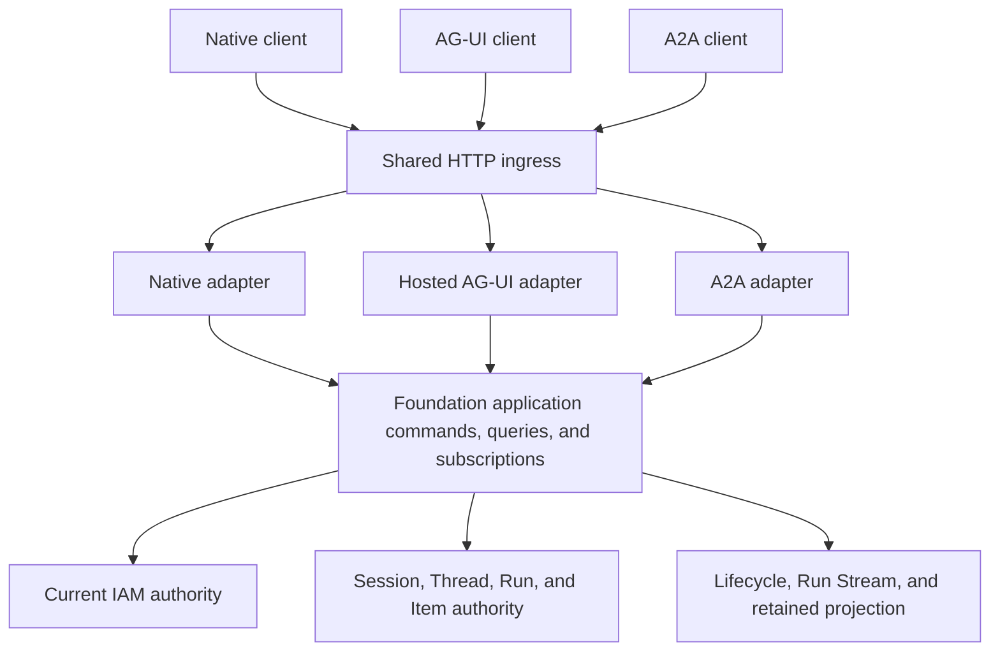

# Foundation Service Protocol Gateway

## Design Position

Foundation Service Protocol Gateway is the public protocol boundary of the `control` and `all` roles. It exposes Foundation-owned Native APIs, hosted AG-UI, and A2A without introducing another interaction model, execution authority, or independently deployed proxy. Each adapter validates and maps its own wire protocol, then calls the same Foundation application commands, queries, and authorized subscription ports.

The [External Connectivity subsystem](40-connectivity/README.md) owns provider event ingress on `connectivity` and `all` roles. Its in-process a13n MCP tool groups execute inside Workers or Runners and have no HTTP listener. Neither is a Protocol Gateway adapter or Native `/api/v1` operation.

The Gateway does not own Agent execution, Run scheduling, persistence, or authorization policy. The durable [`Session`, `Thread`, `Run`, and `Item`](../interaction-model.md) model, current [IAM](33-identity-and-access-management.md), and the owning domain use case remain authoritative regardless of which protocol accepted or delivered the operation.

## Boundaries

| Concern                                               | Owner                                                                                                                               | Gateway relationship                                                                                                 |
| ----------------------------------------------------- | ----------------------------------------------------------------------------------------------------------------------------------- | -------------------------------------------------------------------------------------------------------------------- |
| Host, proxy, Origin, request ID, admission, and drain | [HTTP ingress](05-http-ingress-and-request-contract.md)                                                                             | Applies before protocol-specific handling                                                                            |
| Native resources and commands                         | [Management API](16-management-api.md) and owning domains                                                                           | Gateway composes the routes without redefining them                                                                  |
| Common accepted Agent input                           | [Agent Input](17-agent-input.md)                                                                                                    | Adapters map protocol-native input into one canonical accepted value                                                 |
| Run acceptance, feedback, and cancellation            | [Agent Control](18-agent-control-input-and-continuation.md) and [Active Execution](19-agent-control-active-execution.md)            | Adapters invoke the same durable commands as Native clients                                                          |
| Native Run replay and notifications                   | [Native Streaming and Notifications](21-native-streaming-and-notifications.md)                                                      | Gateway supplies SSE and WebSocket transports                                                                        |
| Hosted AG-UI input and delivery                       | [Hosted AG-UI](22-hosted-ag-ui.md)                                                                                                  | Gateway maps standard input and events to Foundation operations                                                      |
| A2A discovery, Task projection, and delivery          | [A2A](23-a2a.md)                                                                                                                    | Gateway implements the selected A2A binding                                                                          |
| SDK and CLI consumption                               | [Service SDKs and Clients](37-service-sdks-and-clients.md)                                                                          | Clients consume public protocols only                                                                                |
| Durable interaction identity and Run lifecycle        | [Agent Interaction and Execution Model](10-agent-interaction-and-execution-model.md) and [Durable Run State](12-run-persistence.md) | Protocol responses report but never replace durable facts                                                            |
| Stream sources and retained projection                | [Lifecycle and Stream Persistence](24-lifecycle-and-stream-persistence.md)                                                          | Protocol delivery reads authorized projections                                                                       |
| Agent protocol metadata and policy                    | [Agent Management](28-agent-management.md#protocol-configuration)                                                                   | Acceptance freezes the selected Agent Revision and protocol configuration                                            |
| Managed Environment connections and Run bindings      | [Environment Management](29-environment-management.md) and the shared Environment Provider contracts                                | Gateway can expose Foundation management APIs but owns no attachment, target keepalive, or provider-target lifecycle |

The Gateway never calls ORM repositories, Redis keys, object keys, Worker private interfaces, or Harness execution directly from a transport adapter. Application use cases own short transactions, current authorization, durable mutation, and subscription selection.

## Protocol Surfaces

Only `control` and `all` roles expose the protocols owned by this Gateway. A `worker` exposes no Native, AG-UI, A2A, browser, or product-stream route.

| Surface      | Namespace                                                  | Availability                                                               | Primary callers                                  |
| ------------ | ---------------------------------------------------------- | -------------------------------------------------------------------------- | ------------------------------------------------ |
| Native API   | `/api/v1`                                                  | Always present on `control` and `all`                                      | SDKs and remote CLI                              |
| Hosted AG-UI | `/ag-ui/v1`                                                | Always present on `control` and `all`                                      | Standard AG-UI clients and third-party frontends |
| A2A          | direct `/a2a/v1/agents/{agent_id}` plus hostname discovery | Controlled only by deployment-wide `a2a_enabled`, which defaults to `true` | Remote Agents and Agent platforms                |

There is no Agent-level enable switch for Native, AG-UI, or A2A. Every callable Agent has Native and Hosted AG-UI surfaces. When `a2a_enabled=true`, every callable Agent also has a direct A2A base URL and direct Agent Card URL. Agent protocol configuration controls bounded metadata, input schema, client tool surface, visibility, media modes, and limits; it does not run a protocol on or off.

When `a2a_enabled=false`, the process does not mount A2A discovery, runtime, streaming, or push-notification routes and does not start A2A delivery components. The setting is immutable effective runtime configuration and does not select another distribution. Native and Hosted AG-UI remain unchanged.

## Adapter Contract

Each adapter owns only:

- protocol version and content negotiation;
- request and response schema validation;
- external-to-Foundation identity binding;
- command, query, and subscription mapping;
- protocol-specific event projection and transport encoding; and
- translation between owning-domain failures and the protocol's error model.

Adapters normalize wire requests into typed interaction commands, including explicit omitted/default versus null Environment intent. HTTP schemas remain at the protocol boundary. Application failures carry explicit categories and safe codes; adapters select HTTP status and headers or the protocol error representation without inferring categories from code suffixes or message text.

Adapters share application use cases instead of calling one another. AG-UI is not reconstructed from a Native envelope, A2A is not reconstructed from an AG-UI event, and no standard protocol handler creates a second Run acceptance path. A request that cannot map exactly to an accepted Foundation operation fails before mutation.

Native `POST /api/v1/threads/{thread_id}/runs` advances a waiting head with defaults only when the caller explicitly supplies `waiting_resolution.mode="defaults"`; omission retains queue-if-busy behavior. Hosted AG-UI and A2A set that application option only for their documented “new message abandons current HITL” mapping. Explicit feedback remains a separate command. No adapter infers default abandonment merely because a Thread is waiting.

## Identity and Acceptance

External protocol identifiers provide correlation only. They never grant authority and never replace Foundation IDs:

| External value       | Foundation relationship                                             |
| -------------------- | ------------------------------------------------------------------- |
| AG-UI `threadId`     | Persisted adapter binding to one authorized Session and root Thread |
| AG-UI `runId`        | Persisted adapter binding to one accepted Run                       |
| A2A Context ID       | Persisted binding to one authorized Session and root Thread         |
| A2A Task ID          | Persisted projection binding over one or more Runs in that Thread   |
| Native stream cursor | Delivery continuation evidence only                                 |

Every new command authenticates its caller, resolves the current resource, and authorizes the owning action. Every subscription attachment and continuation reauthorizes its current scope. A persisted external binding narrows lookup but does not preserve an earlier authorization decision.

Run acceptance freezes the exact `agent_revision_id`—whose content includes the normalized protocol configuration—together with the normalized client tool surface, the owning operation's canonical accepted input kind and value, and other owning-domain inputs required by the selected protocol. Ordinary semantic input uses [`AgentInput`](17-agent-input.md); other acceptance forms retain their distinct owning-domain protocols. Later Agent metadata edits or Revision creation do not rewrite an accepted Run or Task. Worker replacement changes RunAttempt and Harness Run identity without changing the accepted protocol correlation.

## Security and Admission

Native browser sessions, bearer API keys, AG-UI credentials, and A2A security schemes all resolve to the existing Foundation `PrincipalRef` and credential context. Foundation defines no protocol-specific Principal or credential type. Protocol compatibility never bypasses organization predicates, resource actions, credential boundaries, CSRF or Origin requirements, or current revocation.

All public requests and streams are bounded by deployment configuration and safe common defaults for body size, uploaded content, metadata, nesting, connections, subscriptions, duration, queue depth, event size, and rate. Distribution policy can reduce or raise documented operational bounds without changing protocol identity or weakening hard safety ceilings.

Public projections exclude Secrets, credentials, raw prompts, private model or tool payloads, provider state, internal object keys, RunAttempt fences, Worker identity, Redis locators, and unprocessed reasoning. A protocol-specific allowlist owns every custom event or extension. Unknown client-supplied fields, extensions, or capabilities fail according to the selected protocol rather than reaching the Harness or model as opaque metadata.

## Streaming and Resource Lifetime

Every SSE, WebSocket, and A2A streaming route completes authentication, authorization, and initial relational reads in a closed short session before constructing the streaming response. Later reads use fresh bounded sessions. No database session or transaction spans a stream, external call, wait, or background delivery.

Each attachment owns bounded queues and closes its Redis subscription, tasks, and network resources when the client disconnects or the process drains. Disconnect ends only that delivery attachment. It never cancels, fails, seals, or reopens a Run or A2A Task. Cancellation is an explicit authorized command through the owning application use case.

## Errors and Compatibility

Native `/api/v1` uses the shared Foundation error envelope. Hosted AG-UI and A2A preserve their upstream wire errors and content types. A common internal failure therefore can have different public encodings without acquiring different domain meaning.

Native compatibility follows `/api/v1`. Hosted AG-UI compatibility follows the AG-UI profile pinned by the selected Harness release group. A2A compatibility follows the declared A2A protocol version and binding. An adapter advertises only capabilities that are completely implemented and enabled by its owning configuration; OpenAPI, Agent Card, SDK, and runtime behavior cannot disagree.

## Failure Semantics

| Failure                                    | Observable outcome                                                                            | Durable consequence                   |
| ------------------------------------------ | --------------------------------------------------------------------------------------------- | ------------------------------------- |
| Protocol validation or negotiation fails   | Protocol-specific bounded rejection                                                           | No command is accepted                |
| Authentication or authorization fails      | Safe denial or concealed not-found                                                            | No unauthorized read or mutation      |
| Response is lost after acceptance          | Caller reconciles through idempotency or authoritative read                                   | Accepted Run remains durable          |
| Stream source or delivery dependency fails | Attachment ends with protocol-specific retry or gap evidence                                  | Run lifecycle is unchanged            |
| Slow client exceeds its queue              | Only that attachment is closed                                                                | Worker and other subscribers continue |
| Process drains                             | New work and streams are rejected; existing attachments close under their reconnect contracts | Accepted work remains recoverable     |

## Invariants

1. Protocol Gateway is a Foundation Service boundary, not another service or lifecycle authority.
2. Native, Hosted AG-UI, and A2A adapters call the same Foundation application commands, queries, and subscriptions.
3. Native and Hosted AG-UI are always present on `control` and `all`; A2A has exactly one deployment-wide switch, defaults on, and has no Agent-level enable switch.
4. External IDs, cursors, URLs, and protocol receipts grant no authority.
5. Transport delivery, durable acceptance, execution, and terminal commitment remain independent facts.
6. A streaming dependency graph contains no yielded database session.
7. Disconnect never implies cancellation.
8. Every advertised capability has a complete implementation and compatible security, lifecycle, and failure semantics.
