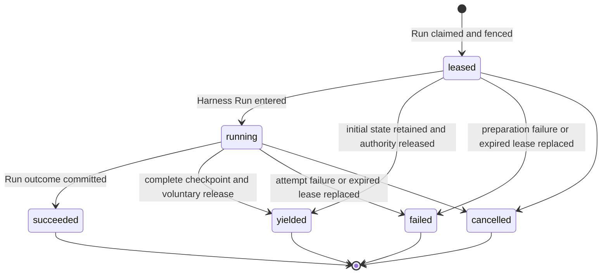

# Durable Run Attempt Persistence

## Design Position

Foundation Service uses the `Run` as its only durable schedulable Agent-work identity. Every Foundation-managed operation that invokes an Agent first selects or creates a Session and Thread and accepts a Run. Scheduled triggers, webhooks, and asynchronous child Agents differ only by Run trigger and lineage data. The independent Thread row and its allocation or advancement are owned by [Durable Thread Persistence](24-thread-persistence.md).

Reconciliation or maintenance work that does not invoke an Agent belongs to its owning domain and does not manufacture a Run or `RunAttempt`. If such a workflow invokes an Agent, that invocation is ordinary Run work. Foundation defines no generic `Execution` resource or `executions` table.

## Core Model

A Run is the stable logical-work identity and durable recovery boundary for one accepted Agent advancement. A `RunAttempt` is one replaceable generation of execution authority within that boundary. Restarting, migrating, or recovering a worker does not create new logical work. When replacement execution is required, a later Worker claim creates another `RunAttempt` under the same Run.

| Resource     | Responsibilities                                                                                                                                                                                                                                                                                                                                                                                                                                 |
| ------------ | ------------------------------------------------------------------------------------------------------------------------------------------------------------------------------------------------------------------------------------------------------------------------------------------------------------------------------------------------------------------------------------------------------------------------------------------------ |
| `Thread`     | Owns Session membership, origin, version, the current Run (the most recently accepted Run), and selected continuation head. Current-Run status determines whether work is active. The Thread serializes whether another Run can be accepted but does not schedule or execute that Run.                                                                                                                                                           |
| `Run`        | Owns the accepted Agent-work identity, input, lineage, exact AgentPresetRevision, immutable `EffectiveAgentConfig`, Runtime lock selection, safe model observation, scheduling, recovery budget and consumption, current-attempt selection, current state, and durable outcome. It is the sole authority for whether another attempt may be created.                                                                                             |
| `RunAttempt` | Owns one worker generation's lease, fence, Worker build and Harness Run correlation, safe model observation, usage, failure or planned-handoff audit, and generation outcome. It does not own accepted input, lineage, model configuration, state, durable outcome, credentials, live bindings, tool invocation history, or presentation data, and it cannot independently authorize a successor. Terminal attempts are immutable audit records. |

## Boundaries

| Concern                                           | Owner                                                                        | Contract                                                                                                         |
| ------------------------------------------------- | ---------------------------------------------------------------------------- | ---------------------------------------------------------------------------------------------------------------- |
| Model-loop retries inside one Harness Run         | Agent Harness                                                                | Remain process-local `ModelAttempt` values and never allocate another `RunAttempt`                               |
| Harness construction, callbacks, and live control | [Foundation–Harness Runtime Integration](16a-harness-runtime-integration.md) | Uses public Harness APIs, fresh typed collaborators, one mandatory Capability, and a process-local control gate  |
| Lifecycle history                                 | [Lifecycle and Stream Persistence](17-lifecycle-and-stream-persistence.md)   | Records ordered facts without becoming Run or attempt authority                                                  |
| Thread inbox acceptance and consumption           | [Agent Control: Active Execution](35-agent-control-active-execution.md)      | Supplies durable steer and asynchronous-result entries plus state-coupled same-Run consumption                   |
| Agent tool crash behavior                         | Latest complete Run state plus the owning tool or Capability domain          | Defines no generic invocation ledger; effectful tools own cross-crash idempotency or durable task reconciliation |

## Run and RunAttempt Allocation Boundary

A new `Run` records acceptance of one input-driven Thread advancement under the [Agent control input and continuation contract](34-agent-control-input-and-continuation.md) or the automatic inactive-Thread result path in [Async Subagents](18-async-subagents.md#delivery-to-an-inactive-thread). The latter path is unavailable when the result's spawning Run failed or was cancelled. A new `RunAttempt` records a worker generation authorized to advance an already accepted, unsealed Run. Creating a Run therefore does not create an attempt in the same transaction: the Run first becomes `accepted`, and a later Worker scan and claim creates attempt number one.

A later attempt preserves the Run ID, Session, Thread, parent edge, accepted input, exact AgentPresetRevision, `EffectiveAgentConfig`, Runtime lock selection, recovery policy, and deterministic state key. It receives a new attempt ID, attempt number, fence, lease, worker generation, fresh credentials and bindings, and, after entry, a fresh Harness Run. By contrast, start, continuation from the selected head or an explicit historical Run, root-like existing-Thread input with no selected head, atomic waiting feedback, eligible automatic asynchronous-result acceptance, fork, and an authorized retry of sealed intent allocate another Run and another state key.

Initial root, fork, and child acceptance create a Thread with its first Run. Continuation, root-like existing-Thread acceptance, eligible automatic asynchronous-result acceptance, queued-submission consumption, feedback, and retry advance an existing Thread version. Active-Run asynchronous-result delivery, suppression, enqueuing, editing, deleting, or reordering a queued submission allocates neither identity. Creating another RunAttempt under the same current Run changes neither Thread references nor Thread version.

The allocation decision is normative. Only the successful operations listed below allocate a new identity. Every other event allocates neither identity; it may preserve, mutate, or terminalize an existing Run or `RunAttempt` under its owning lifecycle contract.

| Successful operation                                                                                                                                                                                                                                                                                                         | Run allocation                                                                                                                                | RunAttempt allocation                                                                                                                                                                                        |
| ---------------------------------------------------------------------------------------------------------------------------------------------------------------------------------------------------------------------------------------------------------------------------------------------------------------------------- | --------------------------------------------------------------------------------------------------------------------------------------------- | ------------------------------------------------------------------------------------------------------------------------------------------------------------------------------------------------------------ |
| Accept a root Agent invocation, including an independent schedule, webhook, service request, or Host-managed asynchronous child; or accept root-like direct or queued ordinary intent after failed or cancelled work                                                                                                         | Create a root Run with `parent_run_id=null`; only initial acceptance also creates the Thread                                                  | Allocate none during acceptance; the first successful claim creates attempt number one                                                                                                                       |
| Accept a continuation through ordinary input, explicit Continue From, queued-submission consumption or asynchronous-result delivery from a completed head, a schedule, webhook, or service request from an eligible completed parent; authenticated feedback from the exact waiting parent; or compatible revision selection | Create a new Run with `lineage_kind=continue` and `parent_run_id` naming that parent                                                          | Allocate none during acceptance; the first successful claim creates attempt number one                                                                                                                       |
| Accept an explicit fork from an eligible completed parent                                                                                                                                                                                                                                                                    | Create a new Run with `lineage_kind=fork` and `parent_run_id` naming that parent                                                              | Allocate none during acceptance; the first successful claim creates attempt number one                                                                                                                       |
| Accept an authorized product retry of sealed failed or cancelled intent                                                                                                                                                                                                                                                      | Create another Run that copies the source's input kind, accepted value, lineage, and eligible state-parent edge and records `retry_of_run_id` | Allocate none during acceptance; the first successful claim creates attempt number one                                                                                                                       |
| Claim an eligible active Run                                                                                                                                                                                                                                                                                                 | Preserve the Run                                                                                                                              | Create `attempts_started + 1`: attempt number one from `accepted`, or a later generation while the same Run remains `running` after a failed generation, backoff, expired-lease takeover, or planned handoff |

## Durable Model

The following Python-like schema is conceptual. JSON values are bounded before persistence. `RecoveryUsage` and the Run-owned budget fields are defined by [Durable Run State](14-run-persistence.md#durable-run-model).

```python
type RunAttemptStatus = Literal[
    "leased",
    "running",
    "succeeded",
    "yielded",
    "failed",
    "cancelled",
]
type RunAttemptYieldReason = Literal[
    "service_drain",
    "runner_rotation",
]


class RunAttempt:
    id: str
    version: int
    tenant_id: str
    run_id: str
    attempt_number: int
    fence: int
    status: RunAttemptStatus

    replaces_run_attempt_id: str | None
    recovery_reason: str | None
    worker_id: str
    worker_generation: str
    worker_build_id: str
    runtime_lock_digest: str
    harness_run_id: str | None
    model_execution_observation: ModelExecutionObservation

    lease_token_digest: str
    lease_expires_at: datetime
    heartbeat_at: datetime

    usage: RecoveryUsage
    yield_reason: RunAttemptYieldReason | None
    failure: SafeFailure | None

    created_at: datetime
    claimed_at: datetime
    started_at: datetime | None
    finished_at: datetime | None
    updated_at: datetime
```

`attempt_number` and `fence` increase monotonically within one Run and are never reused. `replaces_run_attempt_id` names the immediately superseded attempt when the new attempt is a recovery generation. It is null on the first attempt.

`RunAttempt` stores no generic Agent tool invocation collection, dispatch disposition, result-correlation collection, or recovery projection. Foundation performs no synchronous PostgreSQL write solely because Harness is about to dispatch a tool call. Tool-call observations can still carry process-local correlation into streams, traces, logs, or a tool-specific protocol, but none of those values becomes generic RunAttempt recovery authority.

A tool call and its result become recoverable only through a complete Run state checkpoint. If a Worker disappears before that checkpoint, the successor cannot distinguish work that never started from work that partially or fully completed without returning. It resumes from the previous complete state and can re-drive model or tool work. A provider or Capability that needs stronger behavior owns an idempotency key, provider operation identity, receipt, or durable task ledger in its own domain; Foundation does not query provider business state before admitting another attempt.

`worker_generation` uniquely identifies one Worker process lifetime. `worker_build_id` identifies the immutable Foundation Service build artifact running that process; replicas of the same artifact therefore share one build ID. Neither value grants authority without the selected lease and fence. `worker_build_id` is distinct from the Run-pinned `PluginRuntimeLock.worker_release`: the former records which service build executed this generation, while the latter remains the historical Worker dependency baseline selected for the Run.

## RunAttempt Lifecycle



`succeeded`, `yielded`, `failed`, and `cancelled` are terminal. `yielded` means the Worker voluntarily stopped at a complete recoverable boundary, committed its known usage and released execution authority while the Run remained `running`. It is expected placement change, not failure, cancellation, or a Harness result. `failed` means only that this worker generation can no longer produce an authoritative result. It does not by itself mean that the Run failed: an in-budget retryable failure leaves the Run `running` and allows a later attempt. An owning worker can commit that fact directly; otherwise a later Worker's takeover transaction commits it after the lease expires. Foundation defines no separate `lost` attempt state.

Loss of outcome certainty at the attempt boundary means that the whole attempt can no longer continue and produce an authoritative Run result. Foundation does not create another Attempt merely because one process-local tool call fails or has an uncertain outcome; replacement still follows the lease, failure, and handoff rules below.

`leased` is the pre-Run preparation state. Worker claim acknowledgement is a transport observation, not another durable phase. While an attempt is `leased`, `harness_run_id` and `started_at` are null. The worker may read and validate state and immutable artifacts, resolve current authority and credentials, and construct fresh run-local dependencies outside database transactions. It cannot dispatch an Agent model or tool call before Harness entry. Entering the Harness Run atomically records `harness_run_id` and `started_at` and changes the attempt to `running`.

A `leased` Attempt can yield before Harness entry by retaining the already complete initial or imported Run state. A `running` Attempt can yield only after the [Run state contract](14-run-persistence.md#checkpoint-triggers-and-refresh) confirms a complete safe boundary and the local Harness execution is fenced from further model, tool, or child dispatch. A yielded Attempt has a `yield_reason`, has no `failure`, and has `harness_run_id` and `started_at` exactly when it had entered Harness before yielding.

## `run_attempts` Relational Schema

Each worker generation is one `run_attempts` row:

| Column group      | Columns                                                                                      | Contract                                                                                                                             |
| ----------------- | -------------------------------------------------------------------------------------------- | ------------------------------------------------------------------------------------------------------------------------------------ |
| Identity          | `id`, `version`, `tenant_id`, `run_id`, `attempt_number`, `fence`, `status`                  | Unique attempt identity, positive CAS version, and monotonically increasing generation within the Run                                |
| Recovery lineage  | `replaces_run_attempt_id`, `recovery_reason`                                                 | Names the immediately superseded attempt and bounded recovery reason                                                                 |
| Worker and run    | `worker_id`, `worker_generation`, `worker_build_id`, `runtime_lock_digest`, `harness_run_id` | Execution-process and immutable service-build correlation, exact Run-pinned Runtime lock, and at most one Harness Run ID after entry |
| Model observation | `model_execution_observation_json`                                                           | Immutable safe model ID, provider type, and model name copied from the Run at claim                                                  |
| Lease             | `lease_token_digest`, `lease_expires_at`, `heartbeat_at`                                     | Opaque lease proof, expiry, and last durable renewal                                                                                 |
| Usage and outcome | `usage_json`, `yield_reason`, `failure_json`                                                 | Attempt-local accounting plus mutually constrained planned-handoff or safe-failure provenance                                        |
| Time              | `created_at`, `claimed_at`, `started_at`, `finished_at`, `updated_at`                        | UTC lifecycle observations                                                                                                           |

Once terminal, every attempt column is immutable.

`usage.model_requests` is monotonic durable execution evidence, not only a terminal accounting total. After all required input preparation and immediately before each provider model request, the Worker increments it in a short fenced Attempt update; the provider request does not start unless that update commits. The update does not claim that the provider received or completed the request. When an Attempt is terminalized or replaced, its known usage is charged into `Run.usage_charged` in the same transaction. Consequently, `Run.usage_charged.model_requests > 0` proves that a prior Attempt crossed a model boundary after input preparation without adding a separate input-file materialization field.

`usage.tool_invocations` is aggregate known usage reported by Harness and committed with a complete checkpoint or Attempt outcome. It is not a dispatch authorization record and does not require a PostgreSQL update before each tool call. A crash can therefore omit uncheckpointed tool invocation usage; recovery budgets constrain durable known usage rather than claiming exact accounting of external effects.

## Current Attempt Authority

`Run.current_run_attempt_id` selects the sole `RunAttempt` whose lease may authorize work for a `running` Run. The selected attempt is the complete lease record: it owns the worker identity and generation, monotonic fence, lease proof, and lease expiry. A worker is authorized only while the Run still selects that non-terminal attempt and the caller matches its worker generation, fence, lease proof, and unexpired lease.

Every Worker periodically scans bounded, deterministically ordered relational candidates through its configured Plugin Runtime profile. An on-demand Worker preflights the exact candidate lock against its process-local registry before claim; a runner Supervisor ensures a matching Runner exists and that Runner scans only an equal `runtime_lock_digest`. A candidate is exactly one of:

- an `accepted` Run with no current attempt and `available_at <= now`;
- a `running` Run with no current attempt after a retryable failed generation and `available_at <= now`;
- a `running` Run with no current attempt whose highest-numbered generation is `yielded` and `available_at <= now`; or
- a `running` Run whose selected `leased` or `running` attempt has an expired lease.

There is no separate scheduler claim, recovery controller, or Redis ownership handoff. A Worker establishes or replaces the current selection in one short transaction that:

1. locks or conditionally updates the candidate Run and, when present, its exact selected attempt;
2. revalidates the candidate shape, Thread current selection, Run status, `available_at`, lease expiry, fixed recovery deadline, applicable recovery or handoff count, aggregate known usage, and any reason-specific build-preference eligibility;
3. when taking over an expired lease, terminalizes the selected old attempt as `failed` with a bounded lease-expiry reason, disables its lease, and charges its known usage;
4. if the fixed deadline or aggregate usage ceiling no longer permits any successor, or a failure or expiry replacement no longer fits the recovery budget, creates no attempt and seals the Run as `failed` with its terminal Thread update in the same transaction; a yielded predecessor is already within the handoff budget consumed by its yield and does not consume recovery budget;
5. otherwise allocates `attempt_number=attempts_started+1` and the next monotonic fence, inserts the new `leased` attempt, increments `attempts_started`, increments `recovery_attempts_started` only for the first generation or a failure or expiry replacement, and selects it as `current_run_attempt_id`; a successor to `yielded` records `recovery_reason="planned_handoff"`, and every new Attempt copies the claimant's immutable `worker_build_id`;
6. changes an initially `accepted` Run to `running`, leaves a replacement Run `running`, and appends the corresponding lifecycle facts.

The Run row lock or equivalent compare-and-swap plus attempt-number and fence uniqueness admits exactly one winner. A competing Worker that observes a changed Run version, current attempt, or lease condition creates nothing and resumes its scan. The transaction performs no object, artifact, policy-provider, or other external read.

After commit, the winning Worker performs state and dependency preparation outside database transactions while renewing the lease. When Service tracing is enabled, that committed claim starts the parentless RunAttempt root defined by [Observability](38-observability.md). Before model or tool work, it conditionally claims the Run's current state object version for its fence. It then enters the Harness Run through another short fenced transaction: it verifies the current leased attempt and the expected Attempt version returned by the preparation decision, records `harness_run_id` and `started_at`, changes the attempt to `running`, sets the Run's `started_at` if this is its first Harness Run, and appends the attempt lifecycle fact. The Run remains `running`.

Heartbeat and lease renewal update only the selected attempt, but their conditional update verifies the authority rule above in the same relational transaction. Like every worker-originated durable mutation, they supply `tenant_id`, `run_id`, `run_attempt_id`, fence, lease proof, and expected Run version. They cannot revive a terminal or deselected generation. A state write additionally supplies the current opaque object version and conditionally replaces the same deterministic state key.

Drain readiness failure and claim gating do not change this rule. From the first process-local handoff request through safe-boundary waiting, checkpoint publication and reconciliation, local Run quiescence, and yield-transaction preparation, the selected Attempt continues its normal heartbeat and lease renewal. Renewal and yield use the same Attempt CAS and fence authority, so their conditional updates serialize: after yield commits, a late renewal fails because the Attempt is terminal and deselected. A yield CAS conflict does not release authority; while the old Attempt still passes the authority check it keeps renewing and either retries yield or commits the authoritative outcome that won the race.

A waiting or completed outcome transaction validates the current running attempt, Run version, and Thread current selection, satisfies the [active-control outcome precondition](35-agent-control-active-execution.md#completion-and-control-races), reconciles receipts from the selected state, selects that outcome candidate by its exact digest and checkpoint sequence, seals the Run, terminalizes the attempt as `succeeded`, clears `current_run_attempt_id`, charges known usage, and appends lifecycle facts. A completed transaction additionally proves that no eligible pending inbox delivery remains bound to the Run. A waiting transaction instead rolls every unconsumed bound delivery to that waiting Run as source for its direct successor. An ordinary outcome retains this Run as Thread current, selects it as Thread head, and increments the Thread version.

A completed outcome can instead use the queued-submission contract's [state-first combined handoff](36-agent-control-queued-submissions.md#completion-time-combined-handoff). The exact same fenced transaction terminalizes this attempt and seals its Run, then consumes the first queued submission, inserts an already-state-backed successor Run as `accepted`, selects the completed Run as head and the successor as current, increments the Thread version twice, and increments the queue version once. No RunAttempt is created for the successor in that transaction; a later ordinary claim creates its first generation.

Failed or cancelled Run commits terminalize a current attempt when one exists, atomically suppress every still-pending async result originating from that Run, supersede other still-pending inbox delivery bound to it, retain that terminal Run as current, preserve the prior head, and increment the Thread version. State and payload publication required by the Run, including a combined successor's complete initial state, occurs before the transaction as defined by the Run contract; direct interrupt requires no state publication.

A known attempt failure commits atomically with its Run decision and charges known usage. A retryable in-budget failure terminalizes the current attempt as `failed`, clears `current_run_attempt_id`, leaves the Run `running`, and sets its bounded `available_at`; a later Worker scan may create the next attempt. A non-retryable or exhausted failure additionally seals the Run as `failed` and applies the active-control contract's terminal inbox disposition. Neither path returns the Run to `accepted`. A failure before Harness entry leaves `harness_run_id` and `started_at` null.

## Graceful Handoff Transaction

SIGTERM, deployment drain, or controlled Runner rotation sets a `yield_requested` flag only in the owning process. It does not add a Run or Attempt column, make the Worker stale, or stop heartbeat and lease renewal. The Worker may begin a planned handoff only when `handoffs_completed < max_handoffs`; an exhausted handoff budget makes it continue ordinary execution until a normal outcome or the drain deadline.

At a safe Harness boundary, the owner first confirms that the complete current Harness, Host, and portable Environment state is conditionally present at the Run's ordinary deterministic `state.json` key. It may reuse an already equivalent complete checkpoint. The state contract creates no handoff-specific object, row, object key, or checkpoint identity, and the yield transaction does not store or validate checkpoint metadata. An unknown object-write result is reconciled by the ordinary object stat and body rules. Until the owner can confirm that this safe-point state is durable, it keeps renewing and does not submit `yielded`.

After that confirmation, the Worker establishes a process-local terminal fence for the old Harness Run when one exists, preventing another model request, tool call, child dispatch, or state mutation. It closes any Run stream, attachments, and process-local Runtime while continuing to renew the Attempt lease. It then opens one short transaction, locks Thread, Run, and RunAttempt in the canonical order, and revalidates the latest Attempt version, current Run selection, unexpired lease proof, worker generation, fence, `running` Run status, non-terminal Attempt status, and absence of an already committed cancellation or normal outcome.

The winning transaction atomically:

1. changes the Attempt to `yielded`, sets `finished_at` and `yield_reason`, and leaves `failure` null;
2. charges all currently known Attempt usage into the Run;
3. increments `Run.handoffs_completed`;
4. clears `Run.current_run_attempt_id`, preserves `Run.status=running`, and sets `Run.available_at=now`; and
5. appends the `run_attempt.yielded` lifecycle fact and its outbox intent.

Only after this transaction commits does the old owner stop heartbeat and lease renewal and issue a best-effort Redis reconciliation wakeup. If the transaction loses to outcome or cancellation, the Worker abandons yield and observes that authoritative result. If it fails for another reason while the old Attempt remains authoritative, the Worker continues renewal, reconciles the latest state, and retries or commits another legal authoritative result.

If the drain deadline arrives before any terminal transaction commits, the Worker abandons graceful handoff, stops renewing, fences local execution, and exits. The Attempt remains authoritative until its recorded lease actually expires; only then may an ordinary takeover transaction fail it and allocate a higher fence. A checkpoint written before a failed yield or process crash remains an ordinary valid latest checkpoint and never implies that the Attempt was yielded.

## Recovery and Budget Enforcement

Only the Run row authorizes another attempt under its accepted recovery, handoff, elapsed-time, and usage limits. A first or failure/expiry replacement claim consumes `recovery_attempts_started`; a successful yield consumes `handoffs_completed`, and its planned-handoff successor consumes neither another handoff nor recovery count. Every claim still increments `attempts_started` for complete audit history. Claim and takeover consume their applicable authority before external preparation begins; preparation never reserves a future generation.

After any new attempt owns the lease, its Worker reads the exact state, attempt history, immutable artifacts, and the Run's immutable `authority_principal` outside a database transaction and satisfies the [active-control recovery contract](35-agent-control-active-execution.md#unified-fifo-delivery-and-state-commitment). It admits Harness entry only when all of these conditions hold:

- the latest complete state object passes key, tenant, Run, Thread, digest, size, envelope, checkpoint, AgentPresetRevision, Runtime lock, and required Harness, Capability, Host, and Environment-state codec validation;
- the applicable fixed recovery or handoff count, elapsed-time, and known-usage ceilings still permit this already-created attempt after all durable usage charges;
- the exact AgentPresetRevision, `EffectiveAgentConfig`, Runtime lock, managed Harness Plugin and Skill artifacts, Connector contracts, Environment Provider locks, and other frozen dependency locks are present, digest-valid, and compatible; and
- the Run's persisted authority Principal remains active in the same tenant, and its current Workspace and principal policy, RoleBindings, AgentPreset invocation authority, Connection ownership or eligibility, Environment provider selection, and required Secret metadata authorize the reconstruction and intended uses.

Attempt preparation is an internal operation over already accepted work. It does not replay the accepting browser session or API key and does not substitute the claiming Worker, queue consumer, administrator, or `system` audit actor as the Run Principal. Revoking the original request credential blocks later requests made with that credential but does not erase the accepted Run; disabling the persisted Principal or removing its required current grants fails the Attempt closed.

The Worker then uses one short fenced compare-and-swap transaction to revalidate that the same Run still selects its unexpired `leased` attempt and to commit exactly one preparation decision:

- **continue**: preserve the Run and attempt as active and permit fresh reconstruction and Harness entry;
- **retry later**: terminalize the attempt as `failed`, charge known usage, clear the current selection, keep the Run `running`, and set a bounded `available_at`, but only for an explicitly retryable condition while budget remains; or
- **fail the Run**: terminalize the attempt as `failed`, charge known usage, clear the current selection, seal the Run as `failed`, retain it as the Thread's current Run, preserve the prior head, and increment the Thread version.

Every Run-failure path records bounded `failure`, sets `sealed_at`, clears the current Attempt selection, freezes the deterministic state key, retains the failed Run as the Thread's current Run, preserves the prior continuation head, increments the Thread version, and appends Attempt and Run lifecycle facts as applicable. It records `sealed_state` only when exact valid state metadata is already available under the Run state contract.

A permanent state, integrity, schema, codec, artifact, lock, compatibility, or authority failure takes the final path. An exhausted applicable recovery or handoff count, deadline, or usage budget also takes the final path. A transient object-store or immutable-artifact availability failure can take the retry-later path only when policy classifies it retryable and all remaining budget checks pass. If the Worker dies during preparation, its lease eventually expires and another Worker's ordinary takeover transaction replaces that attempt.

Recovery does not probe model reachability, inspect Provider business state, validate a backing target, or re-enter a prior Environment. Model reachability and fresh Environment entry from current Host state are outcomes of the newly owned Attempt, not recovery admission checks.

A later Attempt receives a new ID, fence, lease, fresh `RunBindings`, fresh Environment adapters selected from current Host state, and a Harness Run, then follows the [Run resume contract](14-run-persistence.md#resume-semantics) against the same Run state key. Foundation imports only the selected complete state and does not add synthetic results or generic recovery context for tool work absent from that state.

The Agent decides its next action through ordinary model output. A re-driven or later tool call receives its ordinary tool-call and invocation identity. Foundation does not guarantee cross-Attempt idempotency-key reuse; a tool that requires it must define and persist that key through its own contract.

## Relational Constraints

The `run_attempts` table follows the [Relational Schema Lifecycle](04-relational-schema.md) and preserves these constraints:

01. `(tenant_id, id)` is unique, and the attempt tenant equals its Run tenant.
02. Attempt number, fence, and row version are positive.
03. `(tenant_id, run_id, attempt_number)` and `(tenant_id, run_id, fence)` are unique.
04. `replaces_run_attempt_id`, when present, belongs to the same Run and has a smaller attempt number.
05. `current_run_attempt_id`, when present on a Run, names that Run's only selected non-terminal attempt; only an unexpired matching lease authorizes work.
06. Worker scan and takeover use `(status, lease_expires_at, run_id)` on non-terminal attempts and the Run's scheduling index.
07. A `leased` attempt has null `harness_run_id` and `started_at`. A `running` attempt has both. A terminal attempt has both exactly when it entered a Harness Run; `failed`, `cancelled`, or `yielded` directly from `leased` retains both as null.
08. Terminal attempts have `finished_at`, no renewable lease, and immutable columns.
09. `yield_reason` is non-null exactly for `yielded`; a yielded Attempt has null `failure`, leaves its Run `running`, and is not selected as current.
10. Every Attempt has a non-empty immutable `worker_build_id` copied from the claiming process.
11. Terminal attempt history cannot be deleted while referenced by a sealed Run state, lifecycle event, usage record, successor attempt, or retained [Asset provenance](37-asset-management.md#assets-relational-schema).

## Compatibility and Trade-offs

Run row version, relational migration revision, recovery-policy version, and Worker build identity format are independent. Harness and provider compatibility remain governed by their owning contracts. Unknown required policy versions fail closed before recovery. After a service-drain yield, a different `worker_build_id` supplies only scheduling preference; it never proves compatibility, grants authority, or replaces the Run-pinned Runtime lock. Runner rotation has no build-preference delay. Relational migrations do not reinterpret terminal attempt records through current defaults.

Keeping attempts as immutable audit rows increases relational retention but preserves worker, lease, usage, failure, and recovery provenance. Folding work identity and scheduling into the Run removes a second one-to-one lifecycle and its coordination transactions.

## Invariants

01. One `RunAttempt` is one worker generation and starts at most one Harness Run.
02. Attempt number and fence increase monotonically, are never reused, and at most one attempt is current and lease-authorized for a Run.
03. Every worker-originated durable write validates the current attempt, fence, lease, tenant, Run status, and expected Run version.
04. A Worker marks same-Run ordinary steer or asynchronous-result entries consumed only under the current Attempt fence and with exact complete-state evidence; waiting/completed sealing can reconcile the same receipts, while failed/cancelled sealing suppresses own-origin async results and supersedes other still-pending entries bound to that Run.
05. Only a Worker's short Run claim or takeover transaction can authorize a later attempt; after the first claim the same Run remains `running`, and its budget must permit the new generation.
06. A later attempt receives fresh worker and Harness identities while resuming the same Run state under the Run persistence contract.
07. Foundation stores no generic per-invocation dispatch ledger. A replacement Attempt resumes from the exact selected complete state and cannot reconstruct tool work absent from it; tools requiring cross-crash duplicate suppression or reconciliation own that durable protocol.
08. Attempt `failed` is generation-terminal and does not imply Run `failed`; Run `failed` is sealed and never receives another attempt.
09. Terminal attempt rows are immutable audit records.
10. A completion-time combined queue handoff can terminalize the source RunAttempt and accept its already-state-backed successor in one relational transaction, but the successor receives no RunAttempt until a later claim.
11. Drain or Runner rotation gates new claims but does not weaken current Attempt authority: heartbeat and renewal continue until a terminal commit succeeds or the drain deadline is reached.
12. `yielded` is an Attempt terminal state, never a Harness result or Run terminal state; it preserves one complete latest `state.json` and permits a fresh planned-handoff Attempt under the same running Run.
13. Yield and lease renewal serialize through the same selected Attempt CAS and fence. A failed yield CAS never by itself stops renewal or permits another Worker to execute the Run.
14. `attempts_started` counts every generation, `recovery_attempts_started` counts the first and failure/expiry generations, and `handoffs_completed` counts successful planned yields.
15. Every Attempt executes for its Run's immutable authority Principal and re-evaluates that Principal's current status and grants before Harness entry; an internal claimant never becomes the product Principal.
