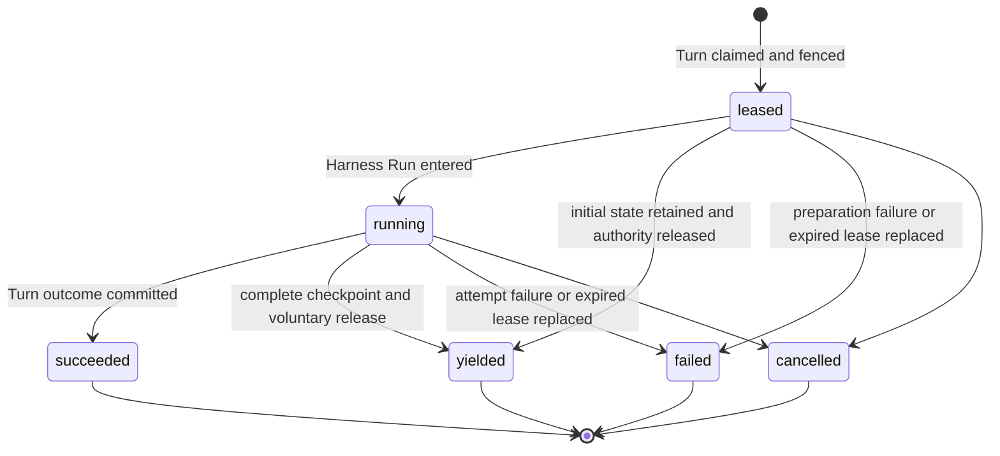

# Durable Turn Attempt Persistence

## Design Position

Foundation Service uses the `Turn` as its only durable schedulable Agent-work
identity. Every Foundation-managed operation that invokes an Agent first
selects or creates a Session and Thread and accepts a Turn. Scheduled triggers,
webhooks, and asynchronous child Agents differ only by Turn trigger and lineage
data. The independent Thread row and its allocation or advancement are owned by
[Durable Thread Persistence](24-thread-persistence.md).

Reconciliation or maintenance work that does not invoke an Agent belongs to
its owning domain and does not manufacture a Turn or `TurnAttempt`. If such a
workflow invokes an Agent, that invocation is ordinary Turn work. Foundation
defines no generic `Execution` resource or `executions` table.

## Core Model

A Turn is the stable logical-work identity and durable recovery boundary for
one accepted Agent advancement. A `TurnAttempt` is one replaceable generation
of execution authority within that boundary. Restarting, migrating, or
recovering a worker does not create new logical work. When replacement
execution is required, a later Worker claim creates another `TurnAttempt`
under the same Turn.

| Resource      | Responsibilities                                                                                                                                                                                                                                                                                                                                                                                                                          |
| ------------- | ----------------------------------------------------------------------------------------------------------------------------------------------------------------------------------------------------------------------------------------------------------------------------------------------------------------------------------------------------------------------------------------------------------------------------------------- |
| `Thread`      | Owns Session membership, origin, version, the current Turn (the most recently accepted Turn), and selected continuation head. Current-Turn status determines whether work is active. The Thread serializes whether another Turn can be accepted but does not schedule or execute that Turn.                                                                                                                                               |
| `Turn`        | Owns the accepted Agent-work identity, input, lineage, exact AgentPresetVersion and Runtime lock selection, accepted model execution snapshot, safe model observation, scheduling, recovery budget and consumption, current-attempt selection, current state, and durable outcome. It is the sole authority for whether another attempt may be created.                                                                                   |
| `TurnAttempt` | Owns one worker generation's lease, fence, Worker build and Harness Run correlation, safe model observation, bounded dispatch, usage, failure or planned-handoff audit, and generation outcome. It does not own accepted input, lineage, model configuration, state, durable outcome, credentials, live bindings, or presentation data, and it cannot independently authorize a successor. Terminal attempts are immutable audit records. |

## Boundaries

| Concern                                    | Owner                                                                      | Contract                                                                                          |
| ------------------------------------------ | -------------------------------------------------------------------------- | ------------------------------------------------------------------------------------------------- |
| Model-loop retries inside one Harness Run  | Agent Harness                                                              | Remain process-local `ModelAttempt` values and never allocate another `TurnAttempt`               |
| Lifecycle history                          | [Lifecycle and Stream Persistence](17-lifecycle-and-stream-persistence.md) | Records ordered facts without becoming Turn or attempt authority                                  |
| Thread inbox acceptance and consumption    | [Agent Control: Active Execution](35-agent-control-active-execution.md)    | Supplies durable steer entries and requires current-attempt fencing for same-Turn consumption     |
| Agent tool dispatch and result correlation | Foundation Host dispatch integration plus selected Harness state           | Durably identifies calls with no recorded result without deciding their external business outcome |
| Recovery notice shown to the Agent         | Fresh Harness `ModelContextRunBinding` supplied by Foundation              | Projects bounded `unknown_outcome` facts without editing imported Harness messages                |

## Turn and TurnAttempt Allocation Boundary

A new `Turn` records acceptance of one input-driven Thread advancement under
the [Agent control input and continuation
contract](34-agent-control-input-and-continuation.md). A new `TurnAttempt`
records a worker generation authorized to advance an already accepted,
unsealed Turn. Creating a Turn therefore does not create an attempt in the same
transaction: the Turn first becomes `accepted`, and a later Worker scan and
claim creates attempt number one.

A later attempt preserves the Turn ID, Session, Thread, parent edge, accepted
input, exact AgentPresetVersion and Runtime lock selection, model execution
snapshot, recovery policy, and deterministic state key. It receives a new
attempt ID, attempt number, fence, lease, worker generation, fresh credentials
and bindings, and, after entry, a fresh Harness Run. By contrast, start,
continuation from the selected head or an explicit historical Turn, root-like
existing-Thread input with no selected head, atomic waiting feedback, fork, and
an authorized retry of sealed intent allocate another Turn and another state
key.

Initial root, fork, and child acceptance create a Thread with its first Turn.
Continuation, root-like existing-Thread acceptance, queued-submission
consumption, feedback, and retry advance an existing Thread version. Enqueuing,
editing, deleting, or reordering a queued submission allocates neither identity.
Creating another TurnAttempt under the same current Turn changes neither Thread
references nor Thread version.

The allocation decision is normative. Only the successful operations listed
below allocate a new identity. Every other event allocates neither identity; it
may preserve, mutate, or terminalize an existing Turn or `TurnAttempt` under its
owning lifecycle contract.

| Successful operation                                                                                                                                                                                                                                                                                                | Turn allocation                                                                                                                                 | TurnAttempt allocation                                                                                                                                                                                        |
| ------------------------------------------------------------------------------------------------------------------------------------------------------------------------------------------------------------------------------------------------------------------------------------------------------------------- | ----------------------------------------------------------------------------------------------------------------------------------------------- | ------------------------------------------------------------------------------------------------------------------------------------------------------------------------------------------------------------- |
| Accept a root Agent invocation, including an independent schedule, webhook, service request, or Host-managed asynchronous child; or accept root-like direct or queued input in an existing Thread whose head remains null after failed or cancelled work                                                            | Create a root Turn with `parent_turn_id=null`; only initial acceptance also creates the Thread                                                  | Allocate none during acceptance; the first successful claim creates attempt number one                                                                                                                        |
| Accept a continuation through ordinary input, explicit Continue From, queued-submission consumption from a completed head, a schedule, webhook, or service request from an eligible completed parent; authenticated feedback from the exact waiting parent; or a compatible continuation selecting another revision | Create a new Turn with `lineage_kind=continue` and `parent_turn_id` naming that parent                                                          | Allocate none during acceptance; the first successful claim creates attempt number one                                                                                                                        |
| Accept an explicit fork from an eligible completed parent                                                                                                                                                                                                                                                           | Create a new Turn with `lineage_kind=fork` and `parent_turn_id` naming that parent                                                              | Allocate none during acceptance; the first successful claim creates attempt number one                                                                                                                        |
| Accept an authorized product retry of sealed failed or cancelled intent                                                                                                                                                                                                                                             | Create another Turn that copies the source's input kind, accepted value, lineage, and eligible state-parent edge and records `retry_of_turn_id` | Allocate none during acceptance; the first successful claim creates attempt number one                                                                                                                        |
| Claim an eligible active Turn                                                                                                                                                                                                                                                                                       | Preserve the Turn                                                                                                                               | Create `attempts_started + 1`: attempt number one from `accepted`, or a later generation while the same Turn remains `running` after a failed generation, backoff, expired-lease takeover, or planned handoff |

## Durable Model

The following Python-like schema is conceptual. JSON values are bounded before
persistence. `RecoveryUsage` and the Turn-owned budget fields are defined by
[Durable Turn State](14-turn-persistence.md#durable-turn-model).

```python
type TurnAttemptStatus = Literal[
    "leased",
    "running",
    "succeeded",
    "yielded",
    "failed",
    "cancelled",
]
type TurnAttemptYieldReason = Literal[
    "service_drain",
    "runner_rotation",
]
type ToolInvocationDisposition = Literal[
    "dispatch_recorded",
    "result_recorded",
]


class TurnAttemptToolInvocation:
    schema_version: Literal["1"]
    invocation_id: str
    tool_call_id: str
    tool_id: str
    tool_name: str
    provider_type: str | None
    effect_class: str
    model_arguments: JsonObject
    arguments_digest_sha256: str
    idempotency_key_digest: str | None
    provider_operation_ref: str | None
    disposition: ToolInvocationDisposition
    observed_at: datetime


class TurnAttemptUnknownOutcome:
    schema_version: Literal["1"]
    source_turn_attempt_id: str
    invocation_id: str
    tool_call_id: str
    tool_id: str
    tool_name: str
    model_arguments: JsonObject
    arguments_digest_sha256: str


class TurnAttempt:
    id: str
    version: int
    tenant_id: str
    turn_id: str
    attempt_number: int
    fence: int
    status: TurnAttemptStatus

    replaces_turn_attempt_id: str | None
    recovery_reason: str | None
    worker_id: str
    worker_generation: str
    worker_build_id: str
    runtime_lock_digest: str
    run_id: str | None
    model_execution_observation: ModelExecutionObservation

    lease_token_digest: str
    lease_expires_at: datetime
    heartbeat_at: datetime

    tool_invocations: tuple[TurnAttemptToolInvocation, ...]
    recovery_unknown_outcomes: tuple[TurnAttemptUnknownOutcome, ...]
    usage: RecoveryUsage
    yield_reason: TurnAttemptYieldReason | None
    failure: SafeFailure | None

    created_at: datetime
    claimed_at: datetime
    started_at: datetime | None
    finished_at: datetime | None
    updated_at: datetime
```

`attempt_number` and `fence` increase monotonically within one Turn and are
never reused. `replaces_turn_attempt_id` names the immediately superseded
attempt when the new attempt is a recovery generation. It is null on the first
attempt.

`tool_invocations` is the bounded Host dispatch record for Agent tools whose
effects can outlive the worker. Before external dispatch, the selected
Foundation integration records `dispatch_recorded` under the current attempt
fence. `model_arguments` is the exact bounded JSON argument value produced by
the model before credential injection, and its digest binds later context to
that request. It contains no credential or provider response body.

`result_recorded` means the matching tool result is present in a complete state
conditionally committed by the current attempt. A replacement Worker also
compares all prior dispatch records with the latest complete Turn state because
a crash can occur between state publication and relational result correlation.
Every unmatched record becomes a bounded `TurnAttemptUnknownOutcome` on the new
attempt before Harness entry. Recording before dispatch deliberately permits a
false-positive unknown outcome when the worker dies before the provider call;
it never permits an effectful dispatch without durable correlation. An
externally effectful tool that cannot provide this Foundation-managed boundary
is rejected before dispatch in the durable hosted profile.

`recovery_unknown_outcomes` starts empty. The fenced preparation decision leaves
it empty on the first attempt and on replacements with no unmatched calls, or
sets it to the bounded result derived from prior attempts and the exact state
version selected by the new lease owner. It contains no credentials, provider
response body, or claim that the prior operation succeeded or failed.

A provider that needs an authoritative task ledger, idempotency record, or
receipt owns that data in its own domain. Foundation stores only the bounded
request and correlation needed to inform a later Agent; it defines no generic
provider receipt table and does not query provider business state before
admitting another attempt.

`worker_generation` uniquely identifies one Worker process lifetime.
`worker_build_id` identifies the immutable Foundation Service build artifact
running that process; replicas of the same artifact therefore share one build
ID. Neither value grants authority without the selected lease and fence.
`worker_build_id` is distinct from the Turn-pinned
`PluginRuntimeLock.worker_release`: the former records which service build
executed this generation, while the latter remains the historical Worker
dependency baseline selected for the Turn.

## TurnAttempt Lifecycle



`succeeded`, `yielded`, `failed`, and `cancelled` are terminal. `yielded` means
the Worker voluntarily stopped at a complete recoverable boundary, committed
its known usage and released execution authority while the Turn remained
`running`. It is expected placement change, not failure, cancellation, or a
Harness result. `failed` means only that this worker generation can no longer
produce an authoritative result. It does not by itself mean that the Turn
failed: an in-budget retryable failure leaves the Turn `running` and allows a
later attempt. An owning worker can commit that fact directly; otherwise a
later Worker's takeover transaction commits it after the lease expires.
Foundation defines no separate `lost` attempt state.

Loss of outcome certainty at the attempt boundary means that the whole attempt
can no longer continue and produce an authoritative Turn result. One Agent tool
call classified as `unknown_outcome` does not cause attempt failure or trigger
replacement by itself.

`leased` is the pre-Run preparation state. Worker claim acknowledgement is a
transport observation, not another durable phase. While an attempt is
`leased`, `run_id` and `started_at` are null. The worker may read and validate
state and immutable artifacts, resolve current authority and credentials, and
construct fresh run-local dependencies outside database transactions. It
cannot dispatch an Agent model or tool call before Harness entry. Entering the
Harness Run atomically records `run_id` and `started_at` and changes the attempt
to `running`.

A `leased` Attempt can yield before Harness entry by retaining the already
complete initial or imported Turn state. A `running` Attempt can yield only
after the [Turn state contract](14-turn-persistence.md#checkpoint-triggers-and-refresh)
confirms a complete safe boundary and the local Harness execution is fenced
from further model, tool, or child dispatch. A yielded Attempt has a
`yield_reason`, has no `failure`, and has `run_id` and `started_at` exactly when
it had entered Harness before yielding.

## `turn_attempts` Relational Schema

Each worker generation is one `turn_attempts` row:

| Column group      | Columns                                                                              | Contract                                                                                                                              |
| ----------------- | ------------------------------------------------------------------------------------ | ------------------------------------------------------------------------------------------------------------------------------------- |
| Identity          | `id`, `version`, `tenant_id`, `turn_id`, `attempt_number`, `fence`, `status`         | Unique attempt identity, positive CAS version, and monotonically increasing generation within the Turn                                |
| Recovery lineage  | `replaces_turn_attempt_id`, `recovery_reason`                                        | Names the immediately superseded attempt and bounded recovery reason                                                                  |
| Worker and run    | `worker_id`, `worker_generation`, `worker_build_id`, `runtime_lock_digest`, `run_id` | Execution-process and immutable service-build correlation, exact Turn-pinned Runtime lock, and at most one Harness Run ID after entry |
| Model observation | `model_execution_observation_json`                                                   | Immutable safe model ID, provider type, and model name copied from the Turn at claim                                                  |
| Lease             | `lease_token_digest`, `lease_expires_at`, `heartbeat_at`                             | Opaque lease proof, expiry, and last durable renewal                                                                                  |
| Tool dispatch     | `tool_invocations_json`                                                              | Bounded dispatch and result-correlation records; not a provider receipt ledger                                                        |
| Recovery context  | `recovery_unknown_outcomes_json`                                                     | Bounded unmatched prior Agent tool calls selected during fenced preparation                                                           |
| Usage and outcome | `usage_json`, `yield_reason`, `failure_json`                                         | Attempt-local accounting plus mutually constrained planned-handoff or safe-failure provenance                                         |
| Time              | `created_at`, `claimed_at`, `started_at`, `finished_at`, `updated_at`                | UTC lifecycle observations                                                                                                            |

Once terminal, every attempt column is immutable.

`usage.model_requests` is monotonic durable execution evidence, not only a
terminal accounting total. After all required input preparation and immediately
before each provider model request, the Worker increments it in a short fenced
Attempt update; the provider request does not start unless that update commits.
The update does not claim that the provider received or completed the request.
When an Attempt is terminalized or replaced, its known usage is charged into
`Turn.usage_charged` in the same transaction. Consequently,
`Turn.usage_charged.model_requests > 0` proves that a prior Attempt crossed a
model boundary after input preparation without adding a separate input-file
materialization field.

## Current Attempt Authority

`Turn.current_turn_attempt_id` selects the sole `TurnAttempt` whose lease may
authorize work for a `running` Turn. The selected attempt is the complete lease
record: it owns the worker identity and generation, monotonic fence, lease
proof, and lease expiry. A worker is authorized only while the Turn still
selects that non-terminal attempt and the caller matches its worker generation,
fence, lease proof, and unexpired lease.

Every Worker periodically scans bounded, deterministically ordered relational
candidates through its configured Plugin Runtime profile. An on-demand Worker
preflights the exact candidate lock against its process-local registry before
claim; a runner Supervisor ensures a matching Runner exists and that Runner scans
only an equal `runtime_lock_digest`. A candidate is exactly one of:

- an `accepted` Turn with no current attempt and `available_at <= now`;
- a `running` Turn with no current attempt after a retryable failed generation
  and `available_at <= now`;
- a `running` Turn with no current attempt whose highest-numbered generation is
  `yielded` and `available_at <= now`; or
- a `running` Turn whose selected `leased` or `running` attempt has an expired
  lease.

There is no separate scheduler claim, recovery controller, or Redis ownership
handoff. A Worker establishes or replaces the current selection in one short
transaction that:

1. locks or conditionally updates the candidate Turn and, when present, its
   exact selected attempt;
2. revalidates the candidate shape, Thread current selection, Turn status,
   `available_at`, lease expiry, fixed recovery deadline, applicable recovery
   or handoff count, aggregate known usage, and build-preference eligibility;
3. when taking over an expired lease, terminalizes the selected old attempt as
   `failed` with a bounded lease-expiry reason, disables its lease, and charges
   its known usage;
4. if the fixed deadline or aggregate usage ceiling no longer permits any
   successor, or a failure or expiry replacement no longer fits the recovery
   budget, creates no attempt and seals the Turn as `failed` with its terminal
   Thread update in the same transaction; a yielded predecessor is already
   within the handoff budget consumed by its yield and does not consume recovery
   budget;
5. otherwise allocates `attempt_number=attempts_started+1` and the next
   monotonic fence, inserts the new `leased` attempt, increments
   `attempts_started`, increments `recovery_attempts_started` only for the first
   generation or a failure or expiry replacement, and selects it as
   `current_turn_attempt_id`; a successor to `yielded` records
   `recovery_reason="planned_handoff"`, and every new Attempt copies the
   claimant's immutable `worker_build_id`;
6. changes an initially `accepted` Turn to `running`, leaves a replacement Turn
   `running`, and appends the corresponding lifecycle facts.

The Turn row lock or equivalent compare-and-swap plus attempt-number and fence
uniqueness admits exactly one winner. A competing Worker that observes a changed
Turn version, current attempt, or lease condition creates nothing and resumes
its scan. The transaction performs no object, artifact, policy-provider, or
other external read.

After commit, the winning Worker performs state and dependency preparation
outside database transactions while renewing the lease. Before model or tool
work, it conditionally claims the Turn's current state object version for its
fence. It then enters the Harness Run through another short fenced transaction:
it verifies the current leased attempt and the expected Attempt version returned
by the preparation decision, records `run_id` and `started_at`, changes the
attempt to `running`, sets the Turn's `started_at` if this is its first Harness
Run, and appends the attempt lifecycle fact. The Turn remains `running`.

Heartbeat and lease renewal update only the selected attempt, but their
conditional update verifies the authority rule above in the same relational
transaction. Like every worker-originated durable mutation, they supply
`tenant_id`, `turn_id`, `turn_attempt_id`, fence, lease proof, and expected Turn
version. They cannot revive a terminal or deselected generation. A state write
additionally supplies the current opaque object version and conditionally
replaces the same deterministic state key.

Drain readiness failure and claim gating do not change this rule. From the
first process-local handoff request through safe-boundary waiting, checkpoint
publication and reconciliation, local Run quiescence, and yield-transaction
preparation, the selected Attempt continues its normal heartbeat and lease
renewal. Renewal and yield use the same Attempt CAS and fence authority, so
their conditional updates serialize: after yield commits, a late renewal fails
because the Attempt is terminal and deselected. A yield CAS conflict does not
release authority; while the old Attempt still passes the authority check it
keeps renewing and either retries yield or commits the authoritative outcome
that won the race.

A waiting or completed outcome transaction validates the current running
attempt, Turn version, and Thread current selection, satisfies the
[active-control outcome
precondition](35-agent-control-active-execution.md#completion-and-control-races),
selects the already written state outcome candidate by its exact digest and
checkpoint sequence, seals the Turn, terminalizes the attempt as `succeeded`,
clears `current_turn_attempt_id`, charges known usage, and appends lifecycle
facts. An ordinary outcome retains this Turn as Thread current, selects it as
Thread head, and increments the Thread version.

A completed outcome can instead use the queued-submission contract's
[state-first combined
handoff](36-agent-control-queued-submissions.md#completion-time-combined-handoff).
The exact same fenced transaction terminalizes this attempt and seals its Turn,
then consumes the first queued submission, inserts an already-state-backed
successor Turn as `accepted`, selects the completed Turn as head and the
successor as current, increments the Thread version twice, and increments the
queue version once. No TurnAttempt is created for the successor in that
transaction; a later ordinary claim creates its first generation.

Failed or cancelled Turn commits terminalize a current attempt when one exists,
retain that terminal Turn as current, preserve the prior head, and increment
the Thread version. State and payload publication required by the Turn,
including a combined successor's complete initial state, occurs before the
transaction as defined by the Turn contract; direct interrupt requires no state
publication.

A known attempt failure commits atomically with its Turn decision and charges
known usage. A retryable in-budget failure terminalizes the current attempt as
`failed`, clears `current_turn_attempt_id`, leaves the Turn `running`, and sets
its bounded `available_at`; a later Worker scan may create the next attempt. A
non-retryable or exhausted failure additionally seals the Turn as `failed` and
applies the active-control contract's terminal inbox disposition. Neither path
returns the Turn to `accepted`. A failure before Harness entry has no
attempt-owned tool dispatch and leaves `run_id` and `started_at` null.

## Graceful Handoff Transaction

SIGTERM, deployment drain, or controlled Runner rotation sets a
`yield_requested` flag only in the owning process. It does not add a Turn or
Attempt column, make the Worker stale, or stop heartbeat and lease renewal. The
Worker may begin a planned handoff only when `handoffs_completed < max_handoffs`; an exhausted handoff budget makes it continue ordinary execution
until a normal outcome or the drain deadline.

At a safe Harness boundary, the owner first confirms that the complete current
Harness, Host, and portable Environment state is conditionally present at the
Turn's ordinary deterministic `state.json` key. It may reuse an already
equivalent complete checkpoint. The state contract creates no handoff-specific
object, row, object key, or checkpoint identity, and the yield transaction does
not store or validate checkpoint metadata. An unknown object-write result is
reconciled by the ordinary object stat and body rules. Until the owner can
confirm that this safe-point state is durable, it keeps renewing and does not
submit `yielded`.

After that confirmation, the Worker establishes a process-local terminal fence
for the old Harness Run when one exists, preventing another model request, tool
call, child dispatch, or state mutation. It closes any Run stream, attachments,
and process-local Runtime while continuing to renew the Attempt lease. It then
opens one short transaction, locks Thread, Turn, and TurnAttempt in the
canonical order, and revalidates the latest Attempt version, current Turn
selection, unexpired lease proof, worker generation, fence, `running` Turn
status, non-terminal Attempt status, and absence of an already committed
cancellation or normal outcome.

The winning transaction atomically:

1. changes the Attempt to `yielded`, sets `finished_at` and `yield_reason`, and
   leaves `failure` null;
2. charges all currently known Attempt usage into the Turn;
3. increments `Turn.handoffs_completed`;
4. clears `Turn.current_turn_attempt_id`, preserves `Turn.status=running`, and
   sets `Turn.available_at=now`; and
5. appends the `turn_attempt.yielded` lifecycle fact and its outbox intent.

Only after this transaction commits does the old owner stop heartbeat and
lease renewal and issue a best-effort Redis reconciliation wakeup. If the
transaction loses to outcome or cancellation, the Worker abandons yield and
observes that authoritative result. If it fails for another reason while the
old Attempt remains authoritative, the Worker continues renewal, reconciles
the latest state, and retries or commits another legal authoritative result.

If the drain deadline arrives before any terminal transaction commits, the
Worker abandons graceful handoff, stops renewing, fences local execution, and
exits. The Attempt remains authoritative until its recorded lease actually
expires; only then may an ordinary takeover transaction fail it and allocate a
higher fence. A checkpoint written before a failed yield or process crash
remains an ordinary valid latest checkpoint and never implies that the Attempt
was yielded.

## Recovery and Budget Enforcement

Only the Turn row authorizes another attempt under its accepted recovery,
handoff, elapsed-time, and usage limits. A first or failure/expiry replacement
claim consumes `recovery_attempts_started`; a successful yield consumes
`handoffs_completed`, and its planned-handoff successor consumes neither
another handoff nor recovery count. Every claim still increments
`attempts_started` for complete audit history. Claim and takeover consume their
applicable authority before external preparation begins; preparation never
reserves a future generation.

After any new attempt owns the lease, its Worker reads the exact state, attempt
history, immutable artifacts, and current authorization outside a database
transaction and satisfies the
[active-control recovery contract](35-agent-control-active-execution.md#steer-consumption-and-state-commitment).
It admits Harness entry only when all of these conditions hold:

- the latest complete state object passes key, tenant, Turn, Thread, digest,
  size, envelope, checkpoint, AgentPresetVersion, Runtime lock, and required Harness, Capability,
  Host, and Environment-state codec validation;
- every prior Agent tool dispatch without a matching result in that exact state
  can be represented within the bounded `recovery_unknown_outcomes` schema;
- the applicable fixed recovery or handoff count, elapsed-time, and known-usage
  ceilings still permit this already-created attempt after all durable usage
  charges;
- the exact AgentPresetVersion and Runtime lock, structurally decodable model execution snapshot,
  state-owned Environment execution configuration, managed Harness plugin and Skill artifacts,
  Connector contracts, Environment connector locks, and other frozen dependency
  locks are present, digest-valid, and compatible; and
- current Workspace and principal policy, RoleBindings, Connection eligibility,
  Environment provider selection, and required Secret metadata authorize the
  reconstruction and intended uses.

The Worker then uses one short fenced compare-and-swap transaction to revalidate
that the same Turn still selects its unexpired `leased` attempt and to commit
exactly one preparation decision:

- **continue**: store the bounded `recovery_unknown_outcomes`, preserve the
  Turn and attempt as active, and permit fresh reconstruction and Harness entry;
- **retry later**: terminalize the attempt as `failed`, charge known usage,
  clear the current selection, keep the Turn `running`, and set a bounded
  `available_at`, but only for an explicitly retryable condition while budget
  remains; or
- **fail the Turn**: terminalize the attempt as `failed`, charge known usage,
  clear the current selection, seal the Turn as `failed`, retain it as the
  Thread's current Turn, preserve the prior head, and increment the Thread
  version.

Every Turn-failure path records bounded `failure`, sets `sealed_at`, clears the
active model execution snapshot and current Attempt selection, freezes the
deterministic state key, retains the failed Turn as the Thread's current Turn,
preserves the prior continuation head, increments the Thread version, and
appends Attempt and Turn lifecycle facts as applicable. It records
`sealed_state` only when exact valid state metadata is already available under
the Turn state contract.

A permanent state, integrity, schema, codec, artifact, lock, compatibility, or
authority failure takes the final path. An exhausted applicable recovery or
handoff count, deadline, or usage budget also takes the final path. A transient
object-store or immutable-artifact availability failure can take the
retry-later path only when policy classifies it retryable and all remaining
budget checks pass. If the Worker dies during preparation, its lease eventually
expires and another Worker's ordinary takeover transaction replaces that
attempt.

Recovery does not probe model reachability, inspect provider business state,
validate or reconcile a prior Sandbox, or reconnect a prior Environment
resource. Model reachability and fresh Environment connection are outcomes of
the newly owned attempt, not recovery admission checks.

One representable `unknown_outcome` alone never blocks recovery and does not
assert that the operation failed, succeeded, rolled back, or is safe to repeat. A later
attempt receives a new ID, fence, lease, fresh `RunBindings`, Environment attachments,
runtime mounts, `EnvironmentRuntime`, and Harness Run, then follows the
[Turn resume contract](14-turn-persistence.md#resume-semantics)
against the same Turn state key.

For each eligible model request of the recovered Harness Run, Foundation
supplies a fresh bounded `ModelContextRunBinding` projection containing every
relevant `unknown_outcome`. Each entry identifies the prior invocation, tool,
model arguments and digest, and states that the operation may have fully
completed, partially completed, or not executed. It does not edit imported
Harness messages or synthesize a provider result.

The Agent decides its next action through ordinary model output. Any subsequent
tool call receives a new tool-call and invocation identity under the ordinary
Harness dispatch contract. Foundation neither replays the prior request nor
guarantees idempotency-key reuse across `TurnAttempt` values.

## Relational Constraints

The `turn_attempts` table follows the
[Relational Schema Lifecycle](04-relational-schema.md) and preserves these
constraints:

01. `(tenant_id, id)` is unique, and the attempt tenant equals its Turn tenant.
02. Attempt number, fence, and row version are positive.
03. `(tenant_id, turn_id, attempt_number)` and
    `(tenant_id, turn_id, fence)` are unique.
04. `replaces_turn_attempt_id`, when present, belongs to the same Turn and has a
    smaller attempt number.
05. `current_turn_attempt_id`, when present on a Turn, names that Turn's only
    selected non-terminal attempt; only an unexpired matching lease authorizes
    work.
06. Worker scan and takeover use
    `(status, lease_expires_at, turn_id)` on non-terminal attempts and the Turn's
    scheduling index.
07. A `leased` attempt has null `run_id` and `started_at`. A `running` attempt
    has both. A terminal attempt has both exactly when it entered a Harness Run;
    `failed`, `cancelled`, or `yielded` directly from `leased` retains both as
    null.
08. Terminal attempts have `finished_at`, no renewable lease, and immutable
    columns.
09. `yield_reason` is non-null exactly for `yielded`; a yielded Attempt has null
    `failure`, leaves its Turn `running`, and is not selected as current.
10. Every Attempt has a non-empty immutable `worker_build_id` copied from the
    claiming process.
11. Terminal attempt history cannot be deleted while referenced by a sealed Turn
    state, lifecycle event, usage record, or successor attempt.

## Compatibility and Trade-offs

Turn row version, relational migration revision, recovery-policy version,
Worker build identity format, and tool-invocation-record schema version are
independent. Harness and provider compatibility remain governed by their owning
contracts. Unknown required policy or invocation-record versions fail closed
before dispatch or recovery. A different `worker_build_id` is only a scheduling
preference; it never proves compatibility, grants authority, or replaces the
Turn-pinned Runtime lock. Relational migrations do not reinterpret terminal
attempt records through current defaults.

Keeping attempts as immutable audit rows increases relational retention but
preserves worker, lease, usage, failure, and recovery provenance. Folding work
identity and scheduling into the Turn removes a second one-to-one lifecycle and
its coordination transactions.

## Invariants

01. One `TurnAttempt` is one worker generation and starts at most one Harness
    Run.
02. Attempt number and fence increase monotonically, are never reused, and at
    most one attempt is current and lease-authorized for a Turn.
03. Every worker-originated durable write validates the current attempt, fence,
    lease, tenant, Turn status, and expected Turn version.
04. A Worker marks same-Turn steer entries consumed only under the current
    Attempt fence and with exact complete-state evidence.
05. Only a Worker's short Turn claim or takeover transaction can authorize a
    later attempt; after the first claim the same Turn remains `running`, and its
    budget must permit the new generation.
06. A later attempt receives fresh worker and Harness identities while resuming
    the same Turn state under the Turn persistence contract.
07. A durably dispatched Agent tool call without a result in the exact selected
    state is preserved as `unknown_outcome` on the replacement attempt and
    projected to the next Agent. Foundation never replays the prior request or
    guarantees cross-attempt idempotency-key reuse.
08. Attempt `failed` is generation-terminal and does not imply Turn `failed`;
    Turn `failed` is sealed and never receives another attempt.
09. Terminal attempt rows are immutable audit records.
10. A completion-time combined queue handoff can terminalize the source
    TurnAttempt and accept its already-state-backed successor in one relational
    transaction, but the successor receives no TurnAttempt until a later claim.
11. Drain or Runner rotation gates new claims but does not weaken current
    Attempt authority: heartbeat and renewal continue until a terminal commit
    succeeds or the drain deadline is reached.
12. `yielded` is an Attempt terminal state, never a Harness result or Turn
    terminal state; it preserves one complete latest `state.json` and permits a
    fresh planned-handoff Attempt under the same running Turn.
13. Yield and lease renewal serialize through the same selected Attempt CAS and
    fence. A failed yield CAS never by itself stops renewal or permits another
    Worker to execute the Turn.
14. `attempts_started` counts every generation,
    `recovery_attempts_started` counts the first and failure/expiry generations,
    and `handoffs_completed` counts successful planned yields.
