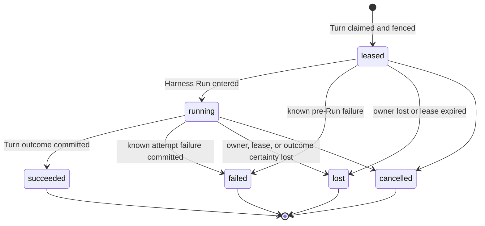

# Durable Turn Attempt Persistence

## Design Position

Foundation Service uses the `Turn` as its only durable schedulable Agent-work
identity. Every Foundation-managed operation that invokes an Agent first
selects or creates a Session and Thread and accepts a Turn. Scheduled triggers,
webhooks, and asynchronous child Agents differ only by Turn trigger and lineage
data. The independent Thread row and its allocation or advancement are owned by
[Durable Thread Persistence](24-thread-persistence.md).

Reconciliation or maintenance work that does not invoke an Agent belongs to
its owning domain and does not manufacture a Turn or `TurnAttempt`. If such a
workflow invokes an Agent, that invocation is ordinary Turn work. Foundation
defines no generic `Execution` resource or `executions` table.

## Core Model

A Turn is the stable logical-work identity and durable recovery boundary for
one accepted Agent advancement. A `TurnAttempt` is one replaceable generation
of execution authority within that boundary. Restarting, migrating, or
recovering a worker does not create new logical work. When replacement
execution is required, a later authorized claim creates another `TurnAttempt`
under the same Turn.

| Resource      | Responsibilities                                                                                                                                                                                                                                                                                                                                                                                                    |
| ------------- | ------------------------------------------------------------------------------------------------------------------------------------------------------------------------------------------------------------------------------------------------------------------------------------------------------------------------------------------------------------------------------------------------------------------- |
| `Thread`      | Owns Session membership, origin, version, the current Turn (the most recently accepted Turn), and selected continuation head. Current-Turn status determines whether work is active. The Thread serializes whether another Turn can be accepted but does not schedule or execute that Turn.                                                                                                                         |
| `Turn`        | Owns the accepted Agent-work identity, input, lineage, exact AgentRevision selection, accepted model execution snapshot, safe model observation, scheduling, recovery budget and consumption, current-attempt selection, current state, and durable outcome. It is the sole authority for whether another attempt may be created.                                                                                   |
| `TurnAttempt` | Owns one worker generation's lease, fence, worker and Harness Run correlation, safe model observation, bounded dispatch, usage and failure audit, and generation outcome. It does not own accepted input, lineage, model configuration, state, durable outcome, credentials, live bindings, or presentation data, and it cannot independently authorize a successor. Terminal attempts are immutable audit records. |

## Boundaries

| Concern                                    | Owner                                                                      | Contract                                                                                          |
| ------------------------------------------ | -------------------------------------------------------------------------- | ------------------------------------------------------------------------------------------------- |
| Model-loop retries inside one Harness Run  | Agent Harness                                                              | Remain process-local `ModelAttempt` values and never allocate another `TurnAttempt`               |
| Lifecycle history                          | [Lifecycle and Stream Persistence](17-lifecycle-and-stream-persistence.md) | Records ordered facts without becoming Turn or attempt authority                                  |
| Agent tool dispatch and result correlation | Foundation Host dispatch integration plus selected Harness state           | Durably identifies calls with no recorded result without deciding their external business outcome |
| Recovery notice shown to the Agent         | Fresh Harness `ModelContextRunBinding` supplied by Foundation              | Projects bounded `unknown_outcome` facts without editing imported Harness messages                |
| Non-Agent reconciliation and maintenance   | Owning Foundation domain                                                   | Uses that domain's job, ledger, or control model rather than `TurnAttempt`                        |

## Turn and TurnAttempt Allocation Boundary

A new `Turn` records acceptance of a new input-driven advancement of one
Thread. A new `TurnAttempt` records a worker generation authorized to advance
an already accepted, unsealed Turn. Creating a Turn therefore does not create
an attempt in the same transaction: the Turn first becomes `accepted`, and a
later scheduler claim creates attempt number one.

A later attempt preserves the Turn ID, Session, Thread, parent edge, accepted
input, exact AgentRevision selection, model execution snapshot, recovery policy,
and deterministic state key. It receives a new attempt ID, attempt number,
fence, lease, worker generation, fresh credentials and bindings, and, after
entry, a fresh Harness Run. By contrast,
root acceptance, continuation, authenticated waiting feedback, fork, and an
authorized retry of sealed intent allocate another Turn and another state key.

Root, fork, and child acceptance create a Thread with its first Turn;
continuation, feedback, and retry advance an existing Thread version. Creating
another TurnAttempt under the same current Turn changes neither Thread references
nor Thread version.

The allocation decision is normative. Only the successful operations listed
below allocate a new identity. Every other event allocates neither identity; it
may preserve, mutate, or terminalize an existing Turn or `TurnAttempt` under its
owning lifecycle contract.

| Successful operation                                                                                                                                                                                                                     | Turn allocation                                                                          | TurnAttempt allocation                                                                                                                                                                |
| ---------------------------------------------------------------------------------------------------------------------------------------------------------------------------------------------------------------------------------------- | ---------------------------------------------------------------------------------------- | ------------------------------------------------------------------------------------------------------------------------------------------------------------------------------------- |
| Accept a root Agent invocation, including an independent schedule, webhook, service request, or Host-managed asynchronous child                                                                                                          | Create a root Turn                                                                       | Allocate none during acceptance; the first successful claim creates attempt number one                                                                                                |
| Accept a continuation through ordinary input or a schedule, webhook, or service request from an eligible completed parent; authenticated feedback from the exact waiting parent; or a compatible continuation selecting another revision | Create a new Turn with `lineage_kind=continue` and `parent_turn_id` naming that parent   | Allocate none during acceptance; the first successful claim creates attempt number one                                                                                                |
| Accept an explicit fork from an eligible completed parent                                                                                                                                                                                | Create a new Turn with `lineage_kind=fork` and `parent_turn_id` naming that parent       | Allocate none during acceptance; the first successful claim creates attempt number one                                                                                                |
| Accept an authorized product retry of sealed failed or cancelled intent                                                                                                                                                                  | Create another Turn through the ordinary parent, lineage, policy, and idempotency checks | Allocate none during acceptance; the first successful claim creates attempt number one                                                                                                |
| Claim an eligible `accepted` Turn                                                                                                                                                                                                        | Preserve the Turn                                                                        | Create `attempts_started + 1`: attempt number one on the first claim, or a later generation only after the prior attempt is terminal and the Turn returns to `accepted` within budget |

## Durable Model

The following Python-like schema is conceptual. JSON values are bounded before
persistence. `RecoveryUsage` and the Turn-owned budget fields are defined by
[Durable Turn State](14-turn-persistence.md#durable-turn-model).

```python
type TurnAttemptStatus = Literal[
    "leased",
    "running",
    "succeeded",
    "failed",
    "lost",
    "cancelled",
]
type ToolInvocationDisposition = Literal[
    "dispatch_recorded",
    "result_recorded",
    "unknown_outcome",
]


class TurnAttemptToolInvocation:
    schema_version: Literal["1"]
    invocation_id: str
    tool_call_id: str
    tool_id: str
    tool_name: str
    provider_type: str | None
    effect_class: str
    model_arguments: JsonObject
    arguments_digest_sha256: str
    idempotency_key_digest: str | None
    provider_operation_ref: str | None
    disposition: ToolInvocationDisposition
    observed_at: datetime


class TurnAttempt:
    id: str
    version: int
    tenant_id: str
    turn_id: str
    attempt_number: int
    fence: int
    status: TurnAttemptStatus

    replaces_turn_attempt_id: str | None
    recovery_reason: str | None
    worker_id: str
    worker_generation: str
    run_id: str | None
    model_execution_observation: ModelExecutionObservation

    lease_token_digest: str
    lease_expires_at: datetime
    heartbeat_at: datetime

    tool_invocations: tuple[TurnAttemptToolInvocation, ...]
    usage: RecoveryUsage
    failure: SafeFailure | None

    created_at: datetime
    claimed_at: datetime
    started_at: datetime | None
    finished_at: datetime | None
    updated_at: datetime
```

`attempt_number` and `fence` increase monotonically within one Turn and are
never reused. `replaces_turn_attempt_id` names the immediately superseded
attempt when the new attempt is a recovery generation. It is null on the first
attempt.

`tool_invocations` is the bounded Host dispatch record for Agent tools whose
effects can outlive the worker. Before external dispatch, the selected
Foundation integration records `dispatch_recorded` under the current attempt
fence. `model_arguments` is the exact bounded JSON argument value produced by
the model before credential injection, and its digest binds later context to
that request. It contains no credential or provider response body.

`result_recorded` means the matching tool result is present in the selected
complete Harness state. If the attempt is lost while a dispatch record has no
such result, the loss transaction preserves it as `unknown_outcome`. Recording
before dispatch deliberately permits a false-positive unknown outcome when the
worker dies before the provider call; it never permits an effectful dispatch
without durable correlation. An externally effectful tool that cannot provide
this Foundation-managed boundary is rejected before dispatch in the durable
hosted profile.

A provider that needs an authoritative task ledger, idempotency record, or
receipt owns that data in its own domain. Foundation stores only the bounded
request and correlation needed to inform a later Agent; it defines no generic
provider receipt table and does not query provider business state before
admitting another attempt.

## TurnAttempt Lifecycle



`succeeded`, `failed`, `lost`, and `cancelled` are terminal. `failed` means a
current authorized worker committed a known failure. `lost` means lease,
ownership, or outcome certainty was lost. A failed or lost attempt can move the
Turn back to `accepted` within its budget when its selected complete state is
valid.

`leased` is the only pre-Run attempt state. Worker claim acknowledgement is a
transport observation, not another durable phase. While an attempt is
`leased`, `run_id` and `started_at` are null and the worker cannot dispatch
model, tool, or attempt-owned provider effects. Entering the Harness Run
atomically records `run_id` and `started_at` and changes the attempt to
`running`.

## `turn_attempts` Relational Schema

Each worker generation is one `turn_attempts` row:

| Column group      | Columns                                                                      | Contract                                                                                               |
| ----------------- | ---------------------------------------------------------------------------- | ------------------------------------------------------------------------------------------------------ |
| Identity          | `id`, `version`, `tenant_id`, `turn_id`, `attempt_number`, `fence`, `status` | Unique attempt identity, positive CAS version, and monotonically increasing generation within the Turn |
| Recovery lineage  | `replaces_turn_attempt_id`, `recovery_reason`                                | Names the immediately superseded attempt and bounded recovery reason                                   |
| Worker and run    | `worker_id`, `worker_generation`, `run_id`                                   | Worker process correlation and at most one Harness Run ID after entry                                  |
| Model observation | `model_execution_observation_json`                                           | Immutable safe model ID, provider type, and model name copied from the Turn at claim                   |
| Lease             | `lease_token_digest`, `lease_expires_at`, `heartbeat_at`                     | Opaque lease proof, expiry, and last durable renewal                                                   |
| Tool dispatch     | `tool_invocations_json`                                                      | Bounded dispatch, result-correlation, and `unknown_outcome` records; not a provider receipt ledger     |
| Usage and failure | `usage_json`, `failure_json`                                                 | Attempt-local accounting and safe failure provenance                                                   |
| Time              | `created_at`, `claimed_at`, `started_at`, `finished_at`, `updated_at`        | UTC lifecycle observations                                                                             |

Once terminal, every attempt column is immutable.

## Current Attempt Authority

`Turn.current_turn_attempt_id` selects the sole `TurnAttempt` whose lease may
authorize work for a `running` Turn. The selected attempt is the complete lease
record: it owns the worker identity and generation, monotonic fence, lease
proof, and lease expiry. A worker is authorized only while the Turn still
selects that non-terminal attempt and the caller matches its worker generation,
fence, lease proof, and unexpired lease.

Establishing or releasing the current selection always changes the Turn and
attempt in the same short transaction. A claim establishes it in one short
transaction that:

1. locks or conditionally updates an unsealed Turn;
2. verifies `status=accepted`, `available_at`, the fixed recovery deadline,
   `attempts_started < max_attempts`, and aggregate usage limits;
3. allocates `attempt_number=attempts_started+1` and the next monotonic fence;
4. inserts the leased attempt, increments `attempts_started`, selects
   `current_turn_attempt_id`, and changes the Turn to `running`;
5. appends the corresponding Turn and `TurnAttempt` lifecycle facts.

Before model, tool, or attempt-owned provider effects, the worker conditionally
claims the Turn's current state object version for its fence. It then enters the
Harness Run through another short fenced transaction: it verifies the current
leased attempt, records `run_id` and `started_at`, changes the attempt to
`running`, sets the Turn's `started_at` if this is its first Harness Run, and
appends the attempt lifecycle fact. The Turn remains `running`.

Heartbeat and lease renewal update only the selected attempt, but their
conditional update verifies the authority rule above in the same relational
transaction. Like every worker-originated durable mutation, they supply
`tenant_id`, `turn_id`, `turn_attempt_id`, fence, lease proof, and expected Turn
version. They cannot revive a terminal or deselected generation. A state write
additionally supplies the current opaque object version and conditionally
replaces the same deterministic state key.

A waiting or completed outcome transaction validates the current running
attempt, Turn version, and Thread current selection, selects the already written
state outcome candidate by its exact digest and checkpoint sequence, seals the
Turn, terminalizes the attempt as `succeeded`, clears
`current_turn_attempt_id`, retains this Turn as the Thread's current Turn,
selects it as the Thread head, increments the Thread version, charges known
usage, and appends lifecycle facts. Failed or cancelled Turn commits
terminalize a current attempt when one exists, retain that terminal Turn as
current, preserve the prior head, and increment the Thread version. State and
payload publication required by the Turn occurs before the transaction as
defined by the Turn contract.

A known attempt failure commits atomically with its Turn transition and charges
known usage. A failure before Harness entry has no attempt-owned tool dispatch
and leaves `run_id` and `started_at` null.

## Recovery and Budget Enforcement

Only the Turn row authorizes another attempt under its accepted attempt-count,
elapsed-time, and usage limits.

When a current lease expires or worker loss is proven, the control plane fences
and terminalizes the attempt as `lost`, clears `current_turn_attempt_id`, and
charges all usage established at that point. It compares the attempt's durable
dispatch records with the selected complete Harness state. Each dispatched
Agent tool call without a matching recorded result becomes
`unknown_outcome`; this is deterministic Foundation state correlation, not an
inspection of provider business state.

The same transaction then:

- returns the Turn to `accepted` with a bounded `available_at` when the selected
  state is valid and the recovery budget remains available; or
- seals the Turn as `failed`, retains it as the Thread's current Turn, preserves
  the prior head, and increments the Thread version when state is invalid or
  incompatible, preparation is non-retryable, or the recovery budget is
  exhausted.

An `unknown_outcome` alone never blocks a later claim and does not assert that
the operation failed, succeeded, rolled back, or is safe to repeat. A later
attempt receives a new ID, fence, lease, fresh bindings, and fresh Harness Run,
then follows the [Turn resume contract](14-turn-persistence.md#resume-semantics)
against the same Turn state key.

For each eligible model request of the recovered Harness Run, Foundation
supplies a fresh bounded `ModelContextRunBinding` projection containing every
relevant `unknown_outcome`. Each entry identifies the prior invocation, tool,
model arguments and digest, and states that the operation may have fully
completed, partially completed, or not executed. It does not edit imported
Harness messages or synthesize a provider result.

The Agent decides its next action through ordinary model output. Any subsequent
tool call receives a new tool-call and invocation identity under the ordinary
Harness dispatch contract. Foundation neither replays the prior request nor
guarantees idempotency-key reuse across `TurnAttempt` values.

## Relational Constraints

The `turn_attempts` table follows the
[Relational Schema Lifecycle](04-relational-schema.md) and preserves these
constraints:

1. `(tenant_id, id)` is unique, and the attempt tenant equals its Turn tenant.
2. Attempt number, fence, and row version are positive.
3. `(tenant_id, turn_id, attempt_number)` and
   `(tenant_id, turn_id, fence)` are unique.
4. `replaces_turn_attempt_id`, when present, belongs to the same Turn and has a
   smaller attempt number.
5. `current_turn_attempt_id`, when present on a Turn, names that Turn's only
   lease-owning non-terminal attempt.
6. Lease repair uses
   `(status, lease_expires_at, turn_id)` on non-terminal attempts.
7. A `leased` attempt has null `run_id` and `started_at`. A `running` attempt
   has both. A terminal attempt has both exactly when it entered a Harness Run;
   `failed`, `lost`, or `cancelled` directly from `leased` retains both as null.
8. Terminal attempts have `finished_at`, no renewable lease, and immutable
   columns.
9. Terminal attempt history cannot be deleted while referenced by a sealed Turn
   state, lifecycle event, usage record, or successor attempt.

## Compatibility and Trade-offs

Turn row version, relational migration revision, recovery-policy version, and
tool-invocation-record schema version are independent. Harness and provider
compatibility remain governed by their owning contracts. Unknown required
policy or invocation-record versions fail closed before dispatch or recovery.
Relational migrations do not reinterpret terminal attempt records through
current defaults.

Keeping attempts as immutable audit rows increases relational retention but
preserves worker, lease, usage, failure, and recovery provenance. Folding work
identity and scheduling into the Turn removes a second one-to-one lifecycle and
its coordination transactions.

## Invariants

1. One `TurnAttempt` is one worker generation and starts at most one Harness
   Run.
2. Attempt number and fence increase monotonically, are never reused, and at
   most one attempt is current and lease-authorized for a Turn.
3. Every worker-originated durable write validates the current attempt, fence,
   lease, tenant, Turn status, and expected Turn version.
4. Only the Turn row can authorize a later attempt after the prior attempt is
   terminal, the Turn has returned to `accepted`, and its budget permits work.
5. A later attempt receives fresh worker and Harness identities while resuming
   the same Turn state under the Turn persistence contract.
6. A durably dispatched Agent tool call without a result is preserved as
   `unknown_outcome` and projected to the next Agent. Foundation never replays
   the prior request or guarantees cross-attempt idempotency-key reuse.
7. Terminal attempt rows are immutable audit records.
