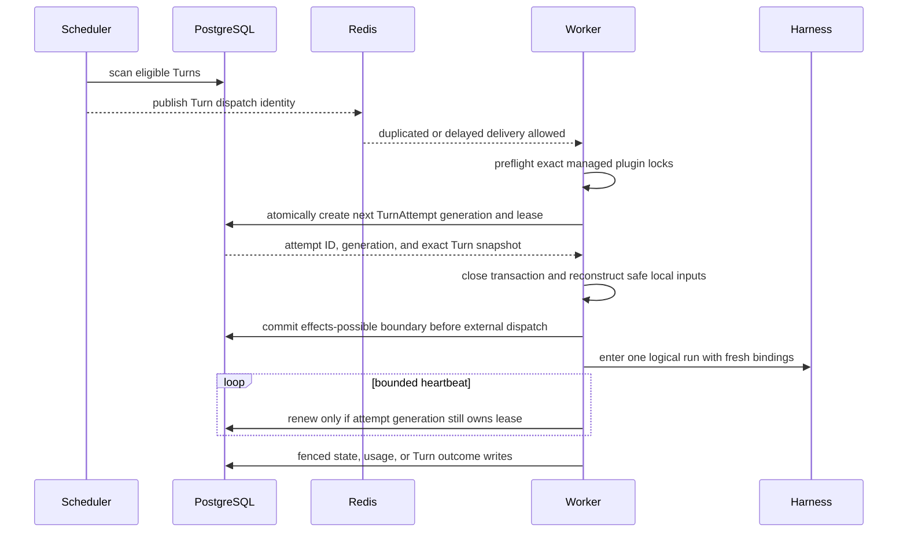

# Scheduling, Workers, and Recovery

## Design Position

Foundation scheduling converts durable eligible Turn state into fenced TurnAttempt ownership. PostgreSQL remains authoritative for eligibility, attempt generations, leases, dispatch phase, recovery budget, and Turn outcomes. Redis carries distributed discovery and coordination signals, but no Redis message creates or transfers durable TurnAttempt ownership.

Workers are process-role loops, not durable product owners. A deployment scales the `worker` role by adding processes or replicas that compete through the same claim contract. [Durable Thread Persistence](24-thread-persistence.md) owns current-Turn and continuation-head selection; [Durable Turn State](14-turn-persistence.md) owns schedulable Turn state and budget; [Durable Turn Attempt Persistence](15-turn-attempt-persistence.md) owns the attempt lease, fence, and loss transaction.

## Scheduling Contract

A Turn is eligible when it is `accepted`, `next_eligible_at` has passed, its
recovery budget permits another claim, no live TurnAttempt owns it, its exact
Agent dependencies and frozen model execution snapshot remain resolvable, and
current policy permits the transition. The scheduler uses bounded deterministic
scans and idempotently records Redis dispatch intent under the shared
[durable operation contract](06-durable-operations-and-outbox.md).

A Redis dispatch message contains only enough identity to prompt a fresh durable claim. Receiving, duplicating, delaying, reordering, acknowledging, or losing that message cannot create, complete, cancel, or transfer a TurnAttempt. Missing or failed publication remains recoverable from durable eligible state and its outbox intent. Operational admission control and fairness can delay eligibility but do not create another queue authority.

## Claim and Lease

Before claim, the Worker reads the exact AgentRevision plugin locks and applies the [on-demand loading contract](26-harness-plugin-artifacts-and-runtime-loading.md). A Worker whose interpreter already pins a conflicting revision declines the work without creating a TurnAttempt. Missing compatible capacity does not change durable eligibility.

A claim transaction verifies eligibility and budget; allocates the next TurnAttempt generation; records worker identity and lease expiration; selects the attempt as current; and moves the Turn to `running`. The worker closes the transaction before reconstruction or external I/O.

Lease renewal proves only current ownership liveness. It does not commit progress, extend credential lifetime, or make process memory recoverable. A renewal that cannot confirm current ownership causes the worker to cancel local work and suppress authoritative publication.

## Fencing

Every worker-originated lifecycle mutation includes the Turn ID, TurnAttempt ID, fence, and generation. It succeeds only when that attempt still owns the live lease and the requested transition remains legal.

Fencing applies to:

- attempt state, dispatch phase, heartbeat, and outcome;
- Turn state-object conditional replacement and sealing;
- lifecycle events and retained Item publication;
- pending-action acceptance;
- Environment desired and effective observations;
- child acceptance and result incorporation; and
- terminal Turn outcomes and their atomic Thread current/head update.

Usage ingestion has the narrow exception defined by [Events, Usage, and Delivery](20-events-usage-and-delivery.md): an immutable UsageRecord that proves already incurred usage can arrive after lease loss under its original TurnAttempt attribution, but it cannot advance Turn lifecycle.

A stale worker may publish bounded non-authoritative telemetry identifying its stale TurnAttempt. It cannot publish a lifecycle event, retained Item, state object, or outcome that consumers could mistake for current product state.

## Worker Run Boundary

After claim, a worker reads exact immutable inputs and the Turn's accepted
model execution snapshot in bounded sessions, verifies dependency locks and
the exact process-local plugin provenance established by preflight, resolves
fresh eligible credential values, and reconstructs safe process-local Agent values.
Agent-specific plugin construction occurs during reconstruction and creates
fresh instances from the loaded factory. The worker never re-resolves current
ModelConfig. Before invoking any potentially effectful Environment, provider,
Harness, model, tool, or client boundary, it commits the TurnAttempt's
`effects_possible` phase.

The worker uses the shared Environment Provider contract to create or resume resources and acquire fresh attachments, then imports the Harness Python package and calls its public process-local API. It is the sole consumer of the `HarnessRunStream` and the owning `HarnessAguiObserver`. Database sessions and locks never span reconstruction I/O, provider calls, Harness work, queue waits, sleeps, event streaming, or cleanup.

As soon as the Harness supplies its Run identity and before the first live observation is published, the worker binds `harness_run_id` immutably to the current TurnAttempt under its fence. Live messages then enter the Turn-scoped Redis Stream owned by [Lifecycle and Stream Persistence](17-lifecycle-and-stream-persistence.md); the Harness Run binding remains provenance rather than stream authority.

## Lease Loss and Recovery

A reconciler detects an expired lease under a lock that verifies the current TurnAttempt generation. Recovery uses the latest valid conditionally committed Turn state and the attempt's durable dispatch summary:

| Evidence                                                                     | Recovery                                                                                                      |
| ---------------------------------------------------------------------------- | ------------------------------------------------------------------------------------------------------------- |
| TurnAttempt remained `pre_dispatch`                                          | Turn can return to `accepted` automatically within budget                                                     |
| Complete conditionally committed Turn state exists                           | A later TurnAttempt resumes from that state                                                                   |
| Agent tool dispatch has no matching result in the committed state            | Record `unknown_outcome`; a later TurnAttempt shows it to the Agent and never replays the call automatically  |
| Environment-management or other non-Agent provider operation remains unknown | The owning domain applies its exact idempotency or reconciliation contract before depending on that operation |
| Selected revision, model snapshot, or state is permanently incompatible      | Turn seals as `failed` with a bounded durable reason                                                          |
| Recovery budget is exhausted                                                 | Turn seals as `failed`; no later TurnAttempt is admitted                                                      |

Every recovery path that seals a Turn as failed atomically verifies and retains
that Turn as its Thread's current selection, preserves the prior continuation
head, and advances the Thread version. Returning the same Turn to `accepted` for
another TurnAttempt leaves Thread selection and version unchanged.

The `pre_dispatch` conclusion comes from the fenced TurnAttempt record, not from missing logs, receipts, heartbeats, or telemetry. For Agent tool calls, Foundation compares durable dispatch records with the complete committed Harness state and classifies every unmatched call as `unknown_outcome`; it does not inspect provider business state before admitting another TurnAttempt. Lack of evidence never becomes proof of no side effect.

Replacement work creates a new TurnAttempt, Harness Run, Environment attachment, controller, credentials, and provider clients. It never restores another process's live task, session, socket, dispatcher, controller, attachment, or stream subscriber.

## Retry Semantics

Retries remain owned by the layer that knows the failed boundary:

- provider transport retries remain in the provider or Pydantic contract;
- Harness semantic recovery creates another ModelAttempt inside one Harness Run;
- Foundation recovery creates another TurnAttempt only after a durable loss, backoff, or retry decision under the same Turn budget;
- retrying terminal intent creates a successor Turn rather than reopening the sealed original;
- a post-recovery Agent decision is expressed as an ordinary new tool call, not a replay command; and
- Foundation does not guarantee cross-attempt reuse of the prior invocation's request or idempotency key.

Backoff uses the Turn's exact durable `next_eligible_at`. Scheduler restart does not reset it. The Turn recovery budget counts TurnAttempts separately from ModelAttempts and provider retries.

## Shutdown and Drain

A control process stops accepting new product work before stopping ingress and reconcilers. A worker process stops claiming Turns, continues bounded active work until its drain deadline, and either commits an authoritative transition or relinquishes ownership for lease recovery. Complete role drain behavior is owned by [Runtime Configuration and Deployment](01-runtime-configuration-and-deployment.md#drain-and-shutdown).

Shutdown never extends a lease indefinitely or marks unfinished local work successful. Worker-only processes never migrate. Role overlap during rollout remains safe through leases, fencing, and idempotency.

## Failure Semantics

| Failure                                 | Durable outcome                                                                                                                      |
| --------------------------------------- | ------------------------------------------------------------------------------------------------------------------------------------ |
| Coordination unavailable                | Accepted Turns remain durable; discovery and new claims can be delayed until coordination recovers                                   |
| Duplicate queue message                 | At most one new TurnAttempt generation succeeds                                                                                      |
| Worker has a conflicting loaded plugin  | Worker declines claim; exact work remains eligible for compatible or replacement capacity                                            |
| Worker crashes before claim commit      | No TurnAttempt ownership exists                                                                                                      |
| Worker crashes while `pre_dispatch`     | Lease expires; safe automatic recovery is permitted within the Turn budget                                                           |
| Worker crashes after `effects_possible` | Lease expires; unmatched Agent tool calls become `unknown_outcome`, while non-Agent operations follow their owning recovery contract |
| Heartbeat arrives after lease expiry    | Worker is stale even if it reconnects                                                                                                |
| Stale worker submits lifecycle result   | Fenced commit is rejected                                                                                                            |
| Scheduler scans concurrently            | Claim serialization prevents duplicate live ownership                                                                                |

## Invariants

01. PostgreSQL, not coordination delivery, owns Turn eligibility and TurnAttempt state.
02. At most one live TurnAttempt generation owns a Turn.
03. Redis delivery never creates, completes, or transfers a TurnAttempt.
04. Every worker-originated lifecycle mutation verifies the current generation and fence.
05. Worker activity and external I/O occur outside database transactions.
06. `effects_possible` is a durable conservative boundary, not an inference from receipts.
07. Replacement TurnAttempts use fresh process-local values and only complete conditionally committed Turn state.
08. Unknown Agent tool outcomes are shown to the next Agent rather than blindly replayed; non-Agent domains retain their owning reconciliation contracts.
09. Waiting and terminal Turns are sealed; feedback or retry creates another Turn.
10. Terminal Turn sealing atomically updates the owning Thread under the same fence.
11. Late immutable usage evidence cannot mutate Turn lifecycle state.
12. A worker claims a Turn only after every managed plugin package lock is verified against or loaded into its process-local registry.
