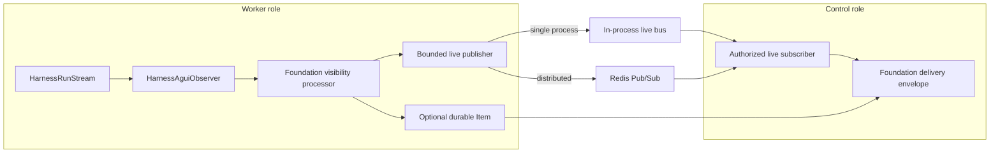

# Events, Interaction Projection, Usage, and Delivery

## Design Position

Foundation owns durable lifecycle events, optional retained interaction Items, delivery envelopes, raw usage ingestion, and replay without turning transport or telemetry into execution authority. State and outbox atomicity follows the shared [durable operation contract](06-durable-operations-and-outbox.md); this document owns the resulting event, projection, delivery, and replay meaning.

Harness observations follow the accepted Agent Stream Protocol path. Foundation consumes `HarnessAguiObserver` output and does not implement another Harness-to-AG-UI mapping. A delivered AG-UI event can become a retained interaction projection only through an explicit Host commit; it never becomes a lifecycle fact merely because a subscriber received it.

## Record Layers

| Layer                | Meaning                                                         | Authority                                              |
| -------------------- | --------------------------------------------------------------- | ------------------------------------------------------ |
| Harness source event | Process-local public observation from one Harness Run           | Harness observation only                               |
| AG-UI event          | `HarnessAguiObserver` conversion after optional Host processing | Presentation observation only                          |
| Item                 | User-visible semantic unit within a Turn                        | Durable interaction record when Foundation persists it |
| Lifecycle event      | Fact that a Foundation resource transition committed            | Durable audit and publication fact                     |
| Delivery envelope    | Multiplexed transport record identifying one source class       | Delivery and replay only                               |

Messages, reasoning units permitted by visibility policy, tool calls, commands, file changes, approvals, child activity, plans, errors, and references to bounded object-backed content can become Items. Heartbeats, token fragments, provider-native frames, credentials, private state, arbitrary logs, and unbounded payloads do not automatically become Items.

## Harness Observation Path



One observer belongs to one Harness Run and is consumed by its current worker. The optional Foundation Host processor applies authorization, redaction, visibility, and stable Item projection policy without changing upstream event meaning. The processor emits only bounded safe live payloads; credentials, private state, arbitrary logs, and unbounded content never enter the live transport.

In an `all` single-process deployment, a bounded in-process bus carries live observations to the ingress component. In a distributed deployment, the worker publishes them through Redis Pub/Sub and the control replica holding an authorized client connection subscribes to the exact Harness Run stream durably bound to the current ExecutionAttempt. Pub/Sub is broadcast rather than consumer-group work distribution: every control replica with an authorized local subscriber for that stream can receive the same observation. Redis channel possession, naming, or receipt grants no product authority; control authenticates and authorizes the client against current Foundation state before attaching the subscription.

The live channel is keyed by Harness Run identity and carries the envelope's process-local sequence. A replacement ExecutionAttempt creates a new Harness Run and therefore a different channel and live stream. Redis Pub/Sub is at-most-once: subscriber absence or transport failure can lose live observations, and the worker never delays Harness execution waiting for a live subscriber. Worker publication queues, control subscription queues, and client connection queues are bounded. A detected sequence discontinuity, queue overflow, subscriber failure, Redis disconnect, or client disconnect ends the affected live attachment with an explicit live-gap indication. Undetected loss remains possible and is repaired only by later retained Items or lifecycle state, never by replaying token fragments. Observer accumulation remains process-local, while Foundation owns any persisted source history, replay cursor, retained gap, and replay-to-live cutover.

The connection-scoped `live_gap` indication identifies the Harness Run stream, the last delivered sequence when known, and a bounded reason. It is transport control rather than a retained `FoundationDeliveryEnvelope`; it does not advance a durable cursor or imply that the Execution stopped. A client responds by reading authorized current state and waiting for retained Items or lifecycle delivery rather than requesting token-fragment replay.

A live-only envelope is explicitly labeled as such. If the same semantic content later commits as an Item, delivery uses the durable Item identity and marks it as retained. It does not silently reuse a transient observer event ID as the Item or lifecycle-event ID.

## Durable Lifecycle Events

Every authoritative Session, Thread, Turn, Execution, ExecutionAttempt, checkpoint, pending action, child relationship, Environment operation, cancellation, or reconciliation transition writes the bounded typed lifecycle event required by its owning domain. The event and publication intent follow the atomicity, retry, and duplicate-delivery rules in [Durable Operations and Outbox](06-durable-operations-and-outbox.md).

Lifecycle event ordering is monotonic within its owning resource stream, not a global total order. Duplicate publication preserves one event identity. Event content references owning resources and Items rather than copying large or differently retained payloads. A lifecycle event records a committed resource transition; it is not inferred from Redis presence, subscriber receipt, or telemetry.

The durable lifecycle record is conceptually:

```python
class LifecycleEvent:
    id: LifecycleEventId
    organization_id: OrganizationId
    workspace_id: WorkspaceId
    stream_resource_ref: ResourceRef
    stream_sequence: int
    event_type: str
    event_schema_version: int
    subject_ref: ResourceRef
    actor_ref: PrincipalRef | None
    source_attempt_id: ExecutionAttemptId | None
    source_attempt_generation: int | None
    resource_version: int | None
    payload: BoundedSafePayload
    committed_at: datetime
```

`stream_resource_ref` identifies the resource whose lifecycle is ordered; its `stream_sequence` increases monotonically for that resource. `subject_ref` identifies the resource changed by the event and normally equals the stream resource. An Attempt-originated event carries the exact Attempt ID and generation; a control-plane action omits them. `actor_ref` is the authenticated User or Service Account when a Principal initiated the transition and is absent for an internal system transition. The payload contains only bounded transition-specific facts and safe references.

The minimum event families are:

| Family             | Required transition examples                                                                                                         | Required safe payload                                                                                  |
| ------------------ | ------------------------------------------------------------------------------------------------------------------------------------ | ------------------------------------------------------------------------------------------------------ |
| Interaction        | `session.created`, `thread.created`, `turn.accepted`, `item.committed`                                                               | Parent references, resulting resource version, and Item reference without Item body                    |
| Execution          | `execution.accepted`, `execution.running`, `execution.waiting`, `execution.completed`, `execution.failed`, `execution.cancelled`     | Previous and resulting status, wait or bounded outcome code, and selected checkpoint/result references |
| Attempt/checkpoint | `execution_attempt.claimed`, `execution_attempt.closed`, `execution_attempt.lost`, `checkpoint.selected`                             | Attempt ID, generation, dispatch phase, bounded outcome code, and selected checkpoint reference        |
| Deferred work      | `pending_action.opened`, `pending_action.completed`, `pending_action.rejected`, `pending_action.expired`, `pending_action.cancelled` | Pending-action ID, kind, previous/resulting status, and response Item reference; no native envelope    |
| Children           | `child_execution.accepted`, `child_result.available`, `child_result.selected`                                                        | Relationship, parent, child, target Execution, and selected checkpoint references                      |
| Environment        | `environment_operation.accepted`, `environment_operation.resolved`                                                                   | Environment and operation IDs, action, previous/resulting status, and bounded outcome code             |
| Reconciliation     | `reconciliation.required`, `reconciliation.resolved`                                                                                 | Affected resource, original operation or Attempt, bounded reason, and resolution code                  |

Event-type meaning and its existing payload fields are stable within `/api/v1`. New event types and additive optional payload fields are compatible; changing the meaning of an existing type or required field is incompatible. Security audit events remain owned by the [IAM contract](10-identity-and-access-management.md#security_audit_events) and are not lifecycle events.

Event and retained-Item publication specializes the shared outbox with source kinds `lifecycle_event` and `retained_item`, and destination kinds `delivery_stream`, `webhook`, and `authorized_sink`. One source has separate destination records because those destinations complete independently. The internal `delivery_stream` destination retries and alerts while its source remains retained; it does not dead-letter replayable data. A bounded webhook or authorized-sink policy can dead-letter its own destination record without changing source authority.

Publishing to `delivery_stream` atomically creates or selects the retained `FoundationDeliveryEnvelope` under uniqueness of Workspace stream generation, source kind, and source ID. The same transaction allocates its monotonic Workspace sequence. A retry therefore reuses the original delivery ID and sequence instead of appending a second retained envelope for the same source.

For example, when an Execution completes, its terminal state, lifecycle event, and outbox intent commit in one transaction. If the publisher delivers the event and crashes before recording delivery progress, it retries the same event identity. The subscriber may observe a duplicate, but it cannot miss the terminal event because state committed without publication intent.

## Delivery Envelope and Replay

Foundation multiplexes lifecycle and interaction delivery through a common outer envelope with an explicit source kind:

```python
class FoundationDeliveryEnvelope:
    delivery_id: DeliveryId
    source_kind: Literal[
        "lifecycle_event",
        "retained_item",
        "live_agui_observation",
    ]
    source_id: str
    stream_kind: Literal["workspace_retained", "harness_live"]
    stream_id: str
    stream_generation: int
    session_id: SessionId | None
    thread_id: ThreadId | None
    turn_id: TurnId | None
    execution_id: ExecutionId | None
    sequence: int
    payload: BoundedSafePayload
```

The schema is conceptual. Retained lifecycle events and Items enter one durable stream per Workspace. Their `stream_id` is the Workspace ID, `stream_generation` identifies the current retention generation, and `sequence` increases monotonically in that stream. Replaying a retained source in the same stream generation preserves its delivery ID and sequence. Resource-scoped subscriptions filter this Workspace stream, so omitted sequence values are expected and do not imply a gap.

A live AG-UI envelope instead uses `stream_kind="harness_live"`, the Harness Run ID as `stream_id`, generation `1`, and a process-local sequence. A replacement Attempt creates another Harness Run and therefore another live stream identity. Live envelopes are explicitly non-replayable and never advance a durable cursor. Redis Pub/Sub carries but does not retain or authorize them. A cursor covers only a Workspace retained stream, is opaque, scoped to authorization and filters, and grants no authority.

Reconnect replays retained lifecycle events and Items and reports `replay_gap` when the cursor generation differs or its sequence precedes the retained floor. The gap response includes the current generation, retained floor, high watermark, and authorized resource links required to rebuild current state; it does not synthesize the missing history. Live AG-UI observations are not silently promoted into another retained record class. Replay never reconstructs missing Harness continuation from Items, AG-UI data, or lifecycle events.

Replay-to-live cutover follows one observable contract:

1. authenticate, authorize, and register a bounded subscription buffer without retaining a database session;
2. capture the retained Workspace high watermark in a short read;
3. replay authorized retained envelopes through that watermark;
4. release buffered retained envelopes above the watermark in sequence order, deduplicating by delivery identity;
5. deliver later retained envelopes and non-replayable live observations until disconnect.

Buffer overflow terminates the stream with an explicit gap rather than silently dropping retained data. There is no ordering claim between a process-local live observation and a concurrent durable envelope beyond the order in which that connection delivers them.

For example, a worker can stream token observations while a model response is in progress and later commit one final message Item. A client that reconnects after the commit replays that Item and applicable lifecycle events, not the earlier token fragments. If the client disconnected before any Item committed, Foundation does not invent a retained AG-UI projection to make the fragment stream appear durable.

Streaming routes follow the [HTTP streaming contract](05-http-ingress-and-request-contract.md#streaming-connections). Disconnect never cancels an Execution.

## Durable Usage Ingestion

The Harness owns native `RunUsage`, the run-local attribution ledger, immutable `UsageRecord` values, and bounded `usage_report` delivery. Foundation ingests immutable `UsageRecord` values idempotently by `record_id` and adds durable attribution:

- Organization, Workspace, and optional Session, Thread, and Turn;
- Execution and originating ExecutionAttempt;
- Harness Run and Agent revision;
- model/provider identity and measures from the record.

A `usage_report` ID is a delivery identity, not another usage fact. Reports can overlap through retries or chunk delivery. `HarnessRunResult.usage_records` is a complete detached run-local snapshot and can overlap records already delivered incrementally. Foundation deduplicates all paths by the immutable `record_id` and rejects conflicting content for the same identity.

Terminal `RunUsage` is an aggregate process-local snapshot used for operational limits and summary display. Foundation does not sum it with UsageRecords, inline-child snapshots, or later resumed-run snapshots. Durable attribution operates from immutable records. Harness model records already carry the applied build-time pricing revision, rule, status, and cost source; Foundation may add negotiated or settlement projections without changing record identity or content.

### Late Usage from a Stale Attempt

Attempt fencing prevents a stale worker from changing lifecycle state. It does not erase usage already incurred before lease loss. Foundation can ingest a late immutable UsageRecord under the original ExecutionAttempt identity when its stable record identity and canonical content validate.

Late ingestion:

- cannot create or complete an Item, checkpoint, pending action, or lifecycle transition;
- cannot change Execution or Attempt outcome;
- preserves the stale Attempt attribution and ingestion timestamp;
- remains idempotent by `record_id`;
- can be supplemented by separately identified provider evidence during reconciliation.

This exception prevents lease loss from silently dropping attributable usage without weakening lifecycle fencing.

## Large Content

Large model, tool, command, file, or child outputs use object storage only after bounded staging, digest verification, authorization through the owning resource, and database selection. They remain content of that Item or other owning record and have no independent product identity. Object keys, file paths, digests, and signed URLs grant no product authority by possession.

For example, a command result that exceeds the inline Item limit is staged as an object and selected by the same transaction that commits the Item reference. An unselected upload is a cleanup candidate. A selected missing object produces an explicit content-read failure; Foundation does not reinterpret it as a missing Item or use it as continuation state.

## Observability

OpenTelemetry traces and metrics correlate safe service role, build, Session, Thread, Turn, Execution, Attempt, Harness Run, and provider identities. They omit credentials, authorization headers, plaintext Secrets, raw prompts, model output, tool payloads, and uploaded content by default.

Telemetry is best effort. Its loss cannot erase durable audit, lifecycle, Item, or usage facts, and its presence cannot prove commitment.

## Failure Semantics

| Failure                                            | Outcome                                                                                                          |
| -------------------------------------------------- | ---------------------------------------------------------------------------------------------------------------- |
| Publisher lease expires                            | A new generation retries; stale completion is fenced                                                             |
| Webhook or sink delivery exhausts retries          | Destination record is dead-lettered; source remains replayable                                                   |
| Client disconnects                                 | Execution continues according to durable state                                                                   |
| Replay range expires                               | Client receives an explicit gap and current authorized state                                                     |
| Replay-to-live buffer overflows                    | Stream closes with an explicit gap rather than omitting retained envelopes                                       |
| In-process or Redis live transport fails           | Detected loss ends the attachment with `live_gap`; Execution continues and retained sources remain authoritative |
| Usage report repeats or overlaps terminal snapshot | `record_id` deduplication prevents double counting                                                               |
| Stale Attempt supplies valid late usage            | Usage is attributed and retained without lifecycle mutation                                                      |
| Same usage identity has different content          | Ingestion fails closed and emits a security diagnostic                                                           |
| Object upload and owning-record commit diverge     | Cleanup or an explicit content-read failure preserves owning-record authority                                    |
| Harness pricing is disabled, declined, or fails    | Raw usage remains durable and ordinary Foundation operation is unaffected                                        |

## Invariants

01. Harness observations, AG-UI events, Items, lifecycle events, and delivery envelopes remain distinct.
02. Foundation uses `HarnessAguiObserver` and does not own a second Harness-to-AG-UI vocabulary.
03. A lifecycle event represents a committed transition and is never inferred from transport delivery.
04. Delivery and client receipt never define Execution completion.
05. Items, replay, AG-UI data, and lifecycle events never become Harness continuation state.
06. Usage is ingested idempotently by immutable UsageRecord identity, not report or aggregate identity.
07. Late stale-Attempt usage cannot change lifecycle state.
08. Object references and signed delivery URLs grant no product authority.
09. Telemetry observes the system and never acts as durable lifecycle authority.
10. Retained delivery sequence is Workspace-scoped; live observation sequence is process-local and non-replayable.
11. Distributed live observations travel worker-to-control through Redis Pub/Sub without becoming durable or authoritative.
