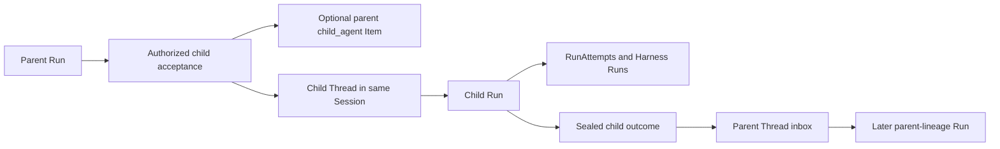
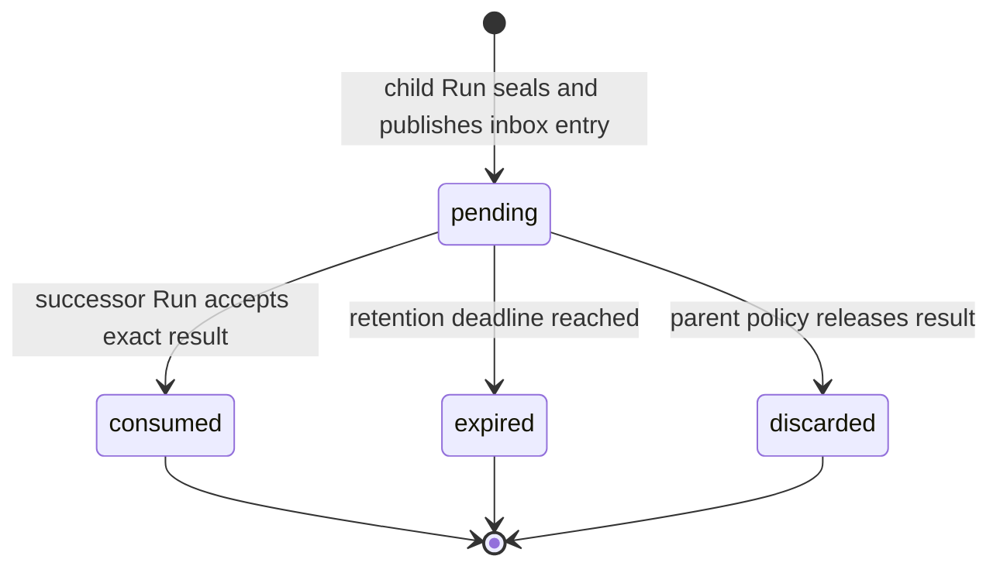

# Async Subagents

## Design Position

An asynchronous subagent is an independent child Run in its own child Thread under the same Session. It has its own RunAttempts, Harness Runs, state key, cancellation, fresh `RunBindings`, Environment attachments, runtime mounts, `EnvironmentRuntime`, usage, retained replay, and result delivery through the parent Thread inbox. The Harness continues to own native Pydantic deferred values and blocking inline delegation; Foundation does not encode pending authority in `HarnessState` or reinterpret asynchronous submission as an unfinished Pydantic tool call.

[Agent Control: Input and Continuation](34-agent-control-input-and-continuation.md#deferred-interaction) owns approval, client-tool execution, structured user input, and the common atomic waiting-feedback contract. This document owns asynchronous child acceptance, independent execution, the `async_subagent_result` inbox payload, and the child result's participation in that common feedback boundary without treating the child as a native Pydantic deferred call. [Agent Control: Active Execution](35-agent-control-active-execution.md#thread-inbox) owns the common Thread inbox row, ordering, status, and Redis wakeup contract.

## Asynchronous Child Runs



The relationship and child-specific inbox payload are durable internal domain values. The common Thread inbox records delivery status without becoming a generic public inbox resource:

```python
class ChildRunRelationship:
    id: ChildRunRelationshipId
    parent_run_id: RunId
    parent_run_attempt_id: RunAttemptId
    parent_run_attempt_generation: int
    child_run_id: RunId
    child_thread_id: ThreadId
    spawn_operation_id: str
    parent_mode: Literal["continue", "wait_for_result"]
    cancellation_policy: Literal["independent", "request_child_cancel"]
    result_visibility: Literal[
        "parent_run",
        "parent_thread",
        "session",
    ]
    created_at: datetime


class AsyncSubagentResultInboxPayload:
    schema_version: Literal["1"]
    relationship_id: ChildRunRelationshipId
    child_run_id: RunId
    terminal_status: Literal["completed", "failed", "cancelled"]
    terminal_result_item_id: ItemId | None
    result_payload: BoundedSafePayload | None
    result_digest: str | None
```

`spawn_operation_id` is the opaque idempotency identity of the accepted parent tool operation. It makes lost child-acceptance acknowledgement safe: the same parent operation returns the same relationship and child Run. `parent_mode` determines whether the parent continues independently or seals as waiting for the result. `cancellation_policy` can request cooperative child cancellation but never claims rollback. `result_visibility` is an upper bound checked against current authorization on every read or incorporation.

A Host-managed spawn is an ordinary completed parent tool operation. Its retained Item names the accepted child Thread and Run. It is not a deferred request, and child completion never fills the original spawn tool-call ID.

Child acceptance verifies the current parent Run and RunAttempt generation, authorizes the stable child AgentPreset declared by the parent Version, intersects delegation and run grants, selects the exact child AgentPresetVersion already resolved in that parent Version, and pins the parent Run's Runtime lock. It then creates a versioned child Thread under the same Session, initializes the child Run state, and records the relationship. Acceptance atomically commits the child Thread, its first Run, and the relationship under the parent's idempotent operation identity even when acknowledgement is lost. The Thread row and advancement semantics follow [Durable Thread Persistence](24-thread-persistence.md).

Parent termination never silently cancels an independently continuing child. The relationship explicitly owns cancellation propagation, result visibility, retention, and delivery policy. The relationship and child Run status represent the pre-result state; Foundation creates no empty or `waiting` inbox row before the child seals.

## Result Delivery

Child outcome and parent delivery advance independently. A sealed child outcome is immutable. The child sealing transaction inserts exactly one `pending` Thread inbox entry with `kind="async_subagent_result"` and one `AsyncSubagentResultInboxPayload` naming the relationship. The inbox entry records whether that exact result remains pending, is consumed into one later parent-lineage Run, expires, or is explicitly discarded. It has no target-Run steer sequence and does not mutate or lock the parent Thread merely to establish cross-kind order. After commit, Foundation best-effort appends a reconcile-Thread signal to the parent Thread's control Stream. Redis failure delays observation but neither removes the result nor creates another delivery authority.



Transport notification does not change this state. The exact child result can be offered repeatedly while its inbox entry remains `pending`; only the transaction that initializes and accepts a successor Run from a valid parent edge can advance it to `consumed`. That transaction records the target Run and initialized state digest in the common inbox consumption fields, so worker loss cannot incorporate the result into the same parent lineage twice.

If a parent sealed as waiting for the child, result availability can supply an exact `complete` entry in the atomic [deferred-interaction feedback](34-agent-control-input-and-continuation.md#deferred-interaction) that accepts a new Run in the same Thread with `parent_run_id` naming that waiting Run. The next Worker projects the child result through the Host-owned fresh-run input seam; it does not place the result in `DeferredToolResume` or reuse the original spawn call ID. If the batch omits the child entry, its accepted outcome is `no_response`; that closes the current waiting batch but does not cancel the child, consume its inbox entry, or discard a result that later becomes available. If the parent completed independently, the inbox entry likewise remains pending for an explicitly selected later Run rather than reopening terminal state or becoming active steering.

Result content is bounded and authorized at read and incorporation time. Larger content uses an authorized Item-owned reference under the [large-content contract](20-events-usage-and-delivery.md#large-content). Delivery never transfers the child's credentials, provider resource state, live Environment attachment, private Capability state, or complete trace.

## Cancellation and Failure

| Condition                                 | Outcome                                                                         |
| ----------------------------------------- | ------------------------------------------------------------------------------- |
| Child acknowledgement lost                | Same operation identity returns the existing child Run                          |
| Child fails                               | Sealed failure is frozen and delivered under parent policy                      |
| Parent worker lost after child acceptance | Child remains durable; the relationship and later inbox entry preserve delivery |
| Successor acceptance outcome is unknown   | Idempotent acceptance determines whether the exact inbox entry was consumed     |

## Invariants

1. An asynchronous child is an independent Run in an independent Thread under the same Session.
2. Child acceptance, completion, Thread-inbox publication, notification, successor acceptance, and result consumption are separate facts.
3. One terminal child result is incorporated into a parent lineage at most once.
4. Parent or child cancellation follows explicit durable policy and never implies rollback of effects.
5. Child acceptance pins the exact child AgentPresetVersion and compatible Runtime lock without resolving mutable Preset state after acceptance.
6. Waiting child feedback is Host-owned fresh-run input; it never satisfies the asynchronous spawn call or enters native `DeferredToolResume`.
