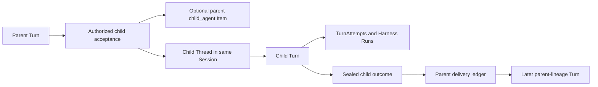
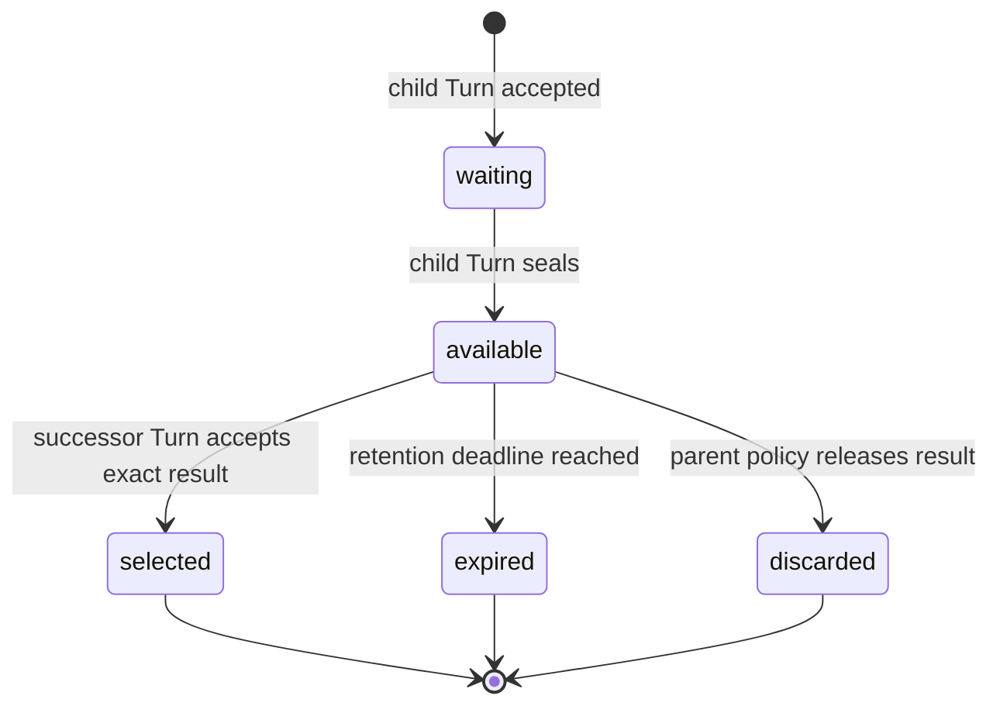

# Async Subagents

## Design Position

An asynchronous subagent is an independent child Turn in its own child Thread under the same Session. It has its own TurnAttempts, Harness Runs, state key, cancellation, Environment attachments, usage, retained replay, and result-delivery state. The Harness continues to own native Pydantic deferred values and blocking inline delegation; Foundation does not encode pending authority in `HarnessState` or reinterpret asynchronous submission as an unfinished Pydantic tool call.

[Agent Control: Input and Continuation](34-agent-control-input-and-continuation.md#deferred-interaction)
owns approval, client-tool execution, structured user input, and the common
pending-action feedback contract. This document owns asynchronous child
acceptance, independent execution, retained result delivery, and the child
result's participation in that common feedback boundary.

## Asynchronous Child Turns



The relationship and result delivery are durable internal records rather than new public top-level resources:

```python
class ChildTurnRelationship:
    id: ChildTurnRelationshipId
    parent_turn_id: TurnId
    parent_turn_attempt_id: TurnAttemptId
    parent_turn_attempt_generation: int
    child_turn_id: TurnId
    child_thread_id: ThreadId
    spawn_operation_id: str
    parent_mode: Literal["continue", "wait_for_result"]
    cancellation_policy: Literal["independent", "request_child_cancel"]
    result_visibility: Literal[
        "parent_turn",
        "parent_thread",
        "session",
    ]
    created_at: datetime


class ChildResultDelivery:
    relationship_id: ChildTurnRelationshipId
    child_turn_id: TurnId
    terminal_status: TurnStatus | None
    terminal_result_item_id: ItemId | None
    result_payload: BoundedSafePayload | None
    result_digest: str | None
    status: Literal[
        "waiting",
        "available",
        "selected",
        "expired",
        "discarded",
    ]
    selected_target_turn_id: TurnId | None
    selected_target_state_digest: str | None
    available_at: datetime | None
    expires_at: datetime | None
    finalized_at: datetime | None
```

`spawn_operation_id` is the opaque idempotency identity of the accepted parent tool operation. It makes lost child-acceptance acknowledgement safe: the same parent operation returns the same relationship and child Turn. `parent_mode` determines whether the parent continues independently or seals as waiting for the result. `cancellation_policy` can request cooperative child cancellation but never claims rollback. `result_visibility` is an upper bound checked against current authorization on every read or incorporation.

A Host-managed spawn is an ordinary completed parent tool operation. Its retained Item names the accepted child Thread and Turn. It is not a deferred request, and child completion never fills the original spawn tool-call ID.

Child acceptance verifies the current parent Turn and TurnAttempt generation,
authorizes the stable child AgentPreset declared by the parent Version, intersects
delegation and run grants, selects the exact child AgentPresetVersion already
resolved in that parent Version, and pins the parent Turn's Runtime lock. It then
creates a versioned child Thread under the same Session, initializes the child
Turn state, and records the relationship. Acceptance atomically commits the
child Thread, its first Turn, and the relationship under the parent's idempotent
operation identity even when acknowledgement is lost. The Thread row and
advancement semantics follow [Durable Thread Persistence](24-thread-persistence.md).

Parent termination never silently cancels an independently continuing child. The relationship explicitly owns cancellation propagation, result visibility, retention, and delivery policy.

## Result Delivery

Child outcome and parent delivery advance independently. A sealed child outcome is immutable. A delivery ledger records whether that exact outcome is waiting, available, selected into one later parent-lineage Turn, expired, or discarded.



Transport notification does not change this state. The exact child result can be offered repeatedly while it remains `available`; only the transaction that initializes and accepts a successor Turn from a valid parent edge can advance it to `selected`. That transaction records the target Turn and initialized state digest, so worker loss cannot incorporate the result into the same parent lineage twice.

If a parent sealed as waiting for the child, result availability supplies the exact internal feedback required by the [deferred-interaction contract](34-agent-control-input-and-continuation.md#deferred-interaction) to accept a new Turn in the same Thread with `parent_turn_id` naming that waiting Turn. If the parent completed independently, the result remains available for an explicitly selected later Turn rather than reopening terminal state.

Result content is bounded and authorized at read and incorporation time. Larger content uses an authorized Item-owned reference under the [large-content contract](20-events-usage-and-delivery.md#large-content). Delivery never transfers the child's credentials, provider resource state, live Environment attachment, private Capability state, or complete trace.

## Cancellation and Failure

| Condition                                 | Outcome                                                                |
| ----------------------------------------- | ---------------------------------------------------------------------- |
| Child acknowledgement lost                | Same operation identity returns the existing child Turn                |
| Child fails                               | Sealed failure is frozen and delivered under parent policy             |
| Parent worker lost after child acceptance | Child remains durable; delivery ledger preserves the relationship      |
| Successor acceptance outcome is unknown   | Idempotent acceptance determines whether the exact result was selected |

## Invariants

1. An asynchronous child is an independent Turn in an independent Thread under the same Session.
2. Child acceptance, completion, notification, successor acceptance, and result selection are separate facts.
3. One terminal child result is incorporated into a parent lineage at most once.
4. Parent or child cancellation follows explicit durable policy and never implies rollback of effects.
5. Child acceptance pins the exact child AgentPresetVersion and compatible Runtime lock without resolving mutable Preset state after acceptance.
