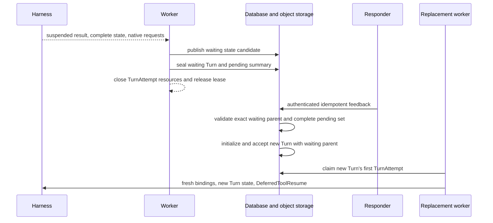
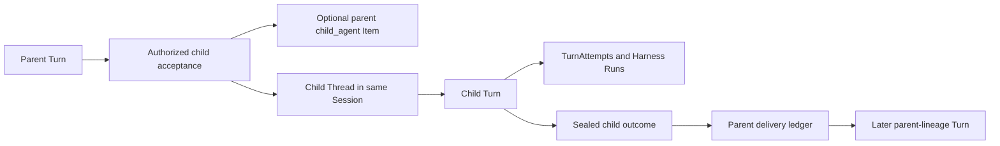
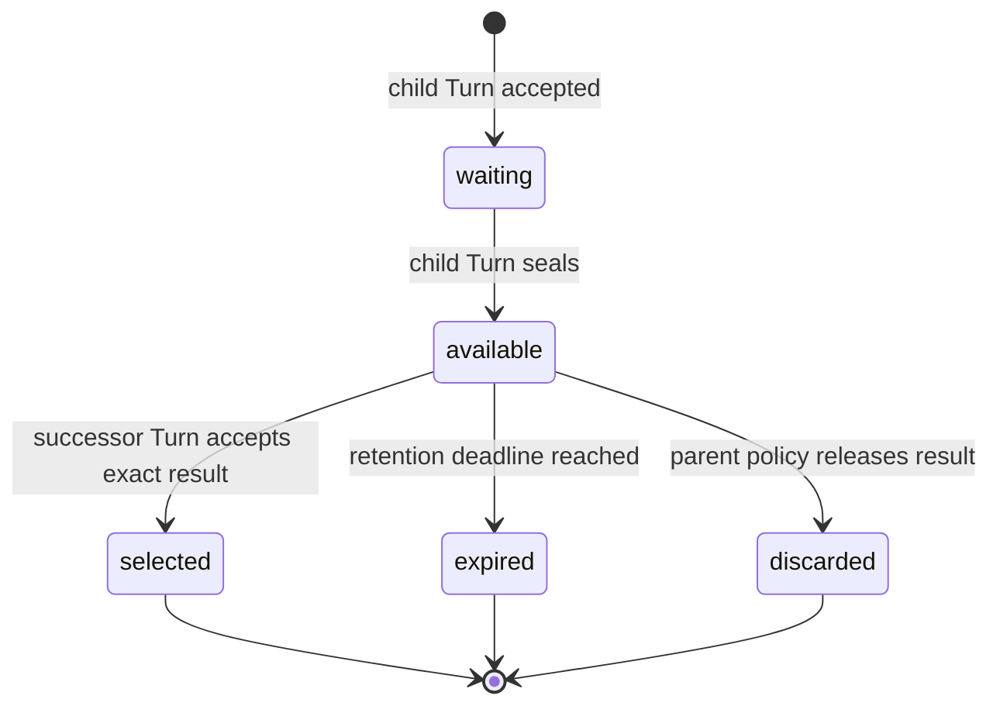

# Deferred Actions and Asynchronous Children

## Design Position

Foundation turns Harness suspension and Host-managed child work into durable Turn lifecycles without retaining a worker across human or external waits. Approval, client-tool execution, structured user input, and awaited child results are frozen pending facts inside one sealed waiting Turn and its complete state object. They are not independent mutable resources or relational rows.

Authenticated feedback never reopens the waiting Turn. Once the exact pending set has a complete authorized resolution, Foundation accepts a new Turn whose `parent_turn_id` names the waiting Turn and whose state is initialized from that parent's sealed state. The new Turn receives a fresh TurnAttempt and Harness Run when scheduled.

An asynchronous subagent is an independent child Turn in its own child Thread under the same Session. It has its own TurnAttempts, Harness Runs, state key, cancellation, Environment attachments, usage, retained replay, and result-delivery state. The Harness continues to own native Pydantic deferred values and blocking inline delegation; Foundation does not encode pending authority in `HarnessState` or reinterpret asynchronous submission as an unfinished Pydantic tool call.

## Pending Actions

Pending kinds remain distinct:

- `approval` asks an authorized human or service to permit a proposed action;
- `client_tool` asks an external client to perform a named effect and return its native result;
- `user_input` requests structured information without authorizing another effect; and
- `child_result` waits for the exact immutable outcome of one accepted asynchronous child Turn.

The exact requests live in `TurnStateEnvelope.host.deferred`; the Turn row stores only the matching bounded `TurnPendingSummary` owned by [Durable Turn State](14-turn-persistence.md#turn-state-object). Feedback supplies resolutions against that immutable request set:

```python
class PendingResolution:
    call_id: str
    kind: PendingCallKind
    result: JsonValue


class WaitingTurnFeedback:
    waiting_turn_id: TurnId
    sealed_state_digest_sha256: str
    resolutions: tuple[PendingResolution, ...]
```

The native deferred envelope preserves the complete request and suspended message/tool-surface identity. It carries no credential or ambient authority. Foundation separately authorizes who may inspect, approve, reject, execute, answer, or incorporate each call.

Feedback names the exact waiting Turn and sealed-state digest, covers every pending call exactly once under `resolution_policy="all"`, and uses the native result type required by that call kind. Approval denial is a native approval result, not a mutation of the parent pending summary. Expiration and cancellation create no successful resolution and no new Turn. Scoped idempotency maps repeated equivalent feedback to the same accepted new Turn; different content conflicts.

## Suspension and Feedback Turn



Suspension first conditionally publishes the complete waiting state candidate at the Turn's deterministic state key. One fenced relational transition then verifies that the Turn remains current, seals it, terminalizes the source TurnAttempt, copies the bounded pending summary to the Turn row, selects the exact state digest and checkpoint sequence, retains the waiting Turn as current, selects it as the Thread head, increments Thread version, and commits lifecycle facts. The worker closes Harness, Environment, credential, provider, socket, and database resources.

Feedback authenticates the responder, authorizes every exact pending action in the frozen request set, checks expiration and the expected Thread and pending-action versions, and applies an idempotency key. The waiting parent remains immutable. Once the complete set is resolved, Foundation initializes a new Turn in the same Thread from the parent's sealed state and, in one short transaction, revalidates the Thread's waiting head, current Turn, and version, sets `parent_turn_id` to that waiting Turn, records the consumed pending identities, selects the new Turn as current, increments Thread version, accepts the new Turn, and associates any response Items with it. Its `accepted` status makes it the sole active Turn.

The replacement worker reconstructs the exact Agent revision and tool surface, supplies fresh bindings, and passes the authoritative request and complete results through native `DeferredToolResume`. Approval and external execution remain separate facts: approval does not prove the client effect occurred, and client success does not retroactively prove approval.

Invalid, incomplete, stale, expired, or unauthorized feedback creates no new Turn and leaves the waiting parent unchanged.

## Asynchronous Child Turns



The relationship and result delivery are durable internal records rather than new public top-level resources:

```python
class ChildTurnRelationship:
    id: ChildTurnRelationshipId
    parent_turn_id: TurnId
    parent_turn_attempt_id: TurnAttemptId
    parent_turn_attempt_generation: int
    child_turn_id: TurnId
    child_thread_id: ThreadId
    spawn_operation_id: str
    parent_mode: Literal["continue", "wait_for_result"]
    cancellation_policy: Literal["independent", "request_child_cancel"]
    result_visibility: Literal[
        "parent_turn",
        "parent_thread",
        "session",
    ]
    created_at: datetime


class ChildResultDelivery:
    relationship_id: ChildTurnRelationshipId
    child_turn_id: TurnId
    terminal_status: TurnStatus | None
    terminal_result_item_id: ItemId | None
    result_payload: BoundedSafePayload | None
    result_digest: str | None
    status: Literal[
        "waiting",
        "available",
        "selected",
        "expired",
        "discarded",
    ]
    selected_target_turn_id: TurnId | None
    selected_target_state_digest: str | None
    available_at: datetime | None
    expires_at: datetime | None
    finalized_at: datetime | None
```

`spawn_operation_id` is the opaque idempotency identity of the accepted parent tool operation. It makes lost child-acceptance acknowledgement safe: the same parent operation returns the same relationship and child Turn. `parent_mode` determines whether the parent continues independently or seals as waiting for the result. `cancellation_policy` can request cooperative child cancellation but never claims rollback. `result_visibility` is an upper bound checked against current authorization on every read or incorporation.

A Host-managed spawn is an ordinary completed parent tool operation. Its retained Item names the accepted child Thread and Turn. It is not a deferred request, and child completion never fills the original spawn tool-call ID.

Child acceptance verifies the current parent Turn and TurnAttempt generation, authorizes the exact declared child definition, intersects delegation and run grants, selects the child Agent revision, creates a versioned child Thread under the same Session, initializes the child Turn state, and records the relationship. Acceptance atomically commits the child Thread, its first Turn, and the relationship under the parent's idempotent operation identity even when acknowledgement is lost. The Thread row and advancement semantics follow [Durable Thread Persistence](24-thread-persistence.md).

Parent termination never silently cancels an independently continuing child. The relationship explicitly owns cancellation propagation, result visibility, retention, and delivery policy.

## Result Delivery

Child outcome and parent delivery advance independently. A sealed child outcome is immutable. A delivery ledger records whether that exact outcome is waiting, available, selected into one later parent-lineage Turn, expired, or discarded.



Transport notification does not change this state. The exact child result can be offered repeatedly while it remains `available`; only the transaction that initializes and accepts a successor Turn from a valid parent edge can advance it to `selected`. That transaction records the target Turn and initialized state digest, so worker loss cannot incorporate the result into the same parent lineage twice.

If a parent sealed as waiting for the child, result availability supplies the exact internal feedback needed to accept a new Turn in the same Thread with `parent_turn_id` naming that waiting Turn. If the parent completed independently, the result remains available for an explicitly selected later Turn rather than reopening terminal state.

Result content is bounded and authorized at read and incorporation time. Larger content uses an authorized Item-owned reference under the [large-content contract](20-events-usage-and-delivery.md#large-content). Delivery never transfers the child's credentials, provider resource state, live Environment attachment, private Capability state, or complete trace.

## Cancellation and Failure

| Condition                                     | Outcome                                                                |
| --------------------------------------------- | ---------------------------------------------------------------------- |
| Worker lost after waiting commit              | Waiting Turn remains sealed without worker ownership                   |
| Feedback duplicated                           | Original feedback or the new Turn's acceptance receipt is returned     |
| Feedback targets stale or closed action       | Request conflicts without changing the waiting Turn                    |
| Feedback responder unauthorized               | Request is denied without disclosing private pending content           |
| Resume surface differs from suspended surface | New feedback Turn fails before Harness resume                          |
| Child acknowledgement lost                    | Same operation identity returns the existing child Turn                |
| Child fails                                   | Sealed failure is frozen and delivered under parent policy             |
| Parent worker lost after child acceptance     | Child remains durable; delivery ledger preserves the relationship      |
| Successor acceptance outcome is unknown       | Idempotent acceptance determines whether the exact result was selected |

## Invariants

1. Waiting for approval, client tools, user input, or child completion holds no TurnAttempt lease.
2. A waiting Turn is sealed; feedback and awaited child delivery create a new Turn whose `parent_turn_id` names the waiting Turn rather than reopening it.
3. Pending requests and feedback remain native typed values associated with one exact sealed waiting state.
4. Every feedback continuation receives a fresh TurnAttempt and Harness Run under the new Turn.
5. Approval and external client effect are independent facts.
6. An asynchronous child is an independent Turn in an independent Thread under the same Session.
7. Child acceptance, completion, notification, successor acceptance, and result selection are separate facts.
8. One terminal child result is incorporated into a parent lineage at most once.
9. Parent or child cancellation follows explicit durable policy and never implies rollback of effects.
