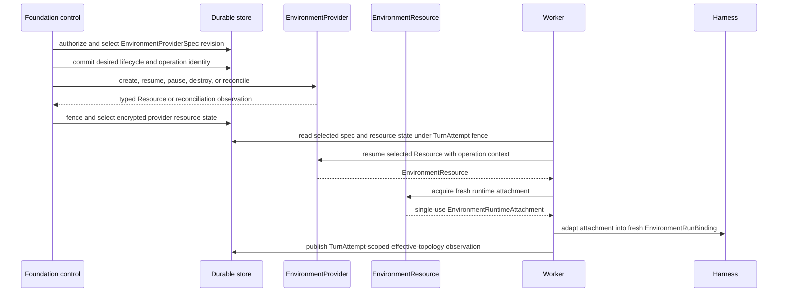

# Environment Resource Management

## Design Position

Foundation is a complete durable Host of [`a13n-environment-provider`](../agent-environment-provider/README.md). It owns Organization and Workspace Environment resources, desired provider specifications and revisions, lifecycle policy, operation fencing, encrypted provider resource-state persistence, retries, reconciliation, management APIs, and lifecycle events under the shared [durable operation contract](06-durable-operations-and-outbox.md).

Foundation does not define another provider framework. Provider configuration, lifecycle effects, exact-operation reconciliation, reusable Resources, and fresh runtime attachments use the canonical `EnvironmentProviderSpec`, `EnvironmentProviderResourceState`, `EnvironmentProvider`, `EnvironmentResource`, and `EnvironmentRuntimeAttachment` contracts.

The Harness owns attachment-to-binding adaptation, run-scoped topology, provider-neutral operations, and portable Environment state. Agent-envd owns EIP daemon behavior. These layers retain distinct identities and lifetimes.

## Boundaries

| Concern                                                            | Owner                                     |
| ------------------------------------------------------------------ | ----------------------------------------- |
| Workspace authorization and allowed provider configuration         | Foundation authorizer                     |
| Durable Environment product resource and revision                  | Foundation control plane                  |
| Provider specification schema and factory                          | Environment Provider package              |
| Durable operation identity, fencing, retry, and lifecycle decision | Foundation                                |
| Create, resume, pause, destroy, and exact-operation reconcile      | Selected `EnvironmentProvider`            |
| Provider-owned resource-state meaning                              | Selected provider                         |
| Resource-state encryption, retention, and authoritative selection  | Foundation                                |
| Live provider client and reusable resource scope                   | `EnvironmentResource`                     |
| Fresh single-use process-local attachment                          | `EnvironmentRuntimeAttachment`            |
| Attachment-to-binding adaptation and run topology                  | Harness                                   |
| File, shell, process, output, and port operations                  | Harness over Direct Local or EIP          |
| Product RoleBindings and browser authentication                    | Foundation or product gateway, never envd |

Provider discovery and schema validity establish availability only. They do not authorize a Workspace, Agent, Turn, or TurnAttempt to select that provider.

## Durable Foundation State

Foundation persists only Host-owned product and envelope facts:

```python
class EnvironmentResource:
    id: EnvironmentResourceId
    organization_id: OrganizationId
    workspace_id: WorkspaceId
    version: int
    provider_spec_revision_ref: EnvironmentProviderSpecRevisionRef
    desired_phase: EnvironmentDesiredPhase
    selected_resource_state: EncryptedProviderResourceStateEnvelope | None
    current_operation_id: EnvironmentOperationId | None
    created_at: datetime
    updated_at: datetime


class EnvironmentOperation:
    id: EnvironmentOperationId
    environment_resource_id: EnvironmentResourceId
    action: EnvironmentManagementAction
    generation: int
    status: EnvironmentOperationStatus
    provider_operation_context: EnvironmentOperationContext
    result_state_digest: str | None
```

The encrypted state envelope contains the exact provider key, provider state version, ciphertext for one `EnvironmentProviderResourceState`, and Host metadata required for selection and retention. Foundation treats the provider data as sensitive opaque content. It never copies provider state into `HarnessState`, Items, ordinary events, model context, or API responses.

Foundation does not persist a generic incarnation that combines product Environment identity, provider resource identity, Harness binding revision, envd generation, or EIP session identity. Those values have different owners and fencing rules. A TurnAttempt-scoped effective-topology projection can record which bindings were successfully published for diagnosis and recovery, but it is an observation rather than provider lifecycle authority.

## Management and Run Flow



Provider effects and Foundation commits are independent. Every effectful Provider call uses one durable Foundation operation identity and the provider package's `EnvironmentOperationContext`. A successful provider response does not commit Foundation state; a failed database commit does not undo the provider effect.

The worker crosses its durable `effects_possible` boundary before invoking a Provider operation or transferring an attachment. A replacement TurnAttempt uses selected provider state to resume or reconcile through the Provider and acquires a new attachment. It never restores a prior live `EnvironmentResource`, attachment, Harness controller, EIP session, or socket.

## Dynamic Topology

Foundation stores authorized desired topology separately from provider lifecycle state. During an entered Harness Run, the current worker can materialize an authorized desired change and publish it through the paired `EnvironmentTopologyController`. Desired acceptance, provider resource operation, effective Harness publication, and teardown are separate fenced facts.

The TurnAttempt-scoped effective projection contains safe binding identity, revision, availability, and selected Environment-resource references. It cannot replace `EnvironmentProviderResourceState`, grant attachment authority, or prove provider cleanup.

## Reconciliation

An uncertain create, resume, pause, or destroy operation is reconciled through the Provider package's typed exact-operation boundary. Foundation supplies the original operation identity, action, resource correlation, attempt number, and authoritative selected provider state. The Provider returns running, paused, absent, or still-unknown evidence.

Foundation commits only the transition supported by that evidence. It never creates a private provider-inspection adapter, never infers absence from a missing receipt, and never silently selects a different provider resource. A still-unknown result remains durable and blocks unsafe replay until later evidence or an authorized operator decision resolves it.

## agent-envd Boundary

For Docker, E2B, and compatible EIP-backed providers, the Provider package owns envd bootstrap or attachment construction and the low-level client owns EIP session behavior. Envd authenticates the exact EIP peer and enforces daemon generation, methods, filesystem, process, network, and resource limits.

Envd does not query Organization or Workspace RoleBindings, Agent revisions, Turn state, or Foundation tables. EIP operation IDs and receipts are daemon-observed evidence; they do not prove Foundation checkpoint or Turn completion. Browser clients never receive envd attachment credentials or raw transfer handles.

## Failure Semantics

| Failure                                       | Durable handling                                                                |
| --------------------------------------------- | ------------------------------------------------------------------------------- |
| Provider unavailable before dispatch          | TurnAttempt fails; policy returns the Turn to `accepted` or seals it `failed`   |
| Provider operation has uncertain outcome      | Environment operation remains reconcilable; Turn cannot assume absence          |
| Resource succeeds but Foundation commit fails | Same operation identity drives Provider reconciliation                          |
| TurnAttempt loses fence during provider work  | Result cannot advance Turn; Environment operation evidence remains reconcilable |
| Attachment acquisition or transfer fails      | Attachment is discarded; reusable resource state remains separately managed     |
| Envd generation changes                       | Prior EIP handles are stale; a fresh attachment and binding are required        |
| Harness topology publication fails            | Provider resource and effective publication remain separate facts               |
| Teardown fails                                | Turn outcome and provider cleanup remain independently reconcilable             |

## Compatibility

Foundation versions its Environment product resource and provider-spec revision references. Provider specification schema, provider resource-state codec, Provider package release, Harness binding contract, EIP version, and Foundation API evolve independently. An incompatible provider state fails before resume and never falls back to another provider or a new resource without an explicit lifecycle decision.

## Invariants

1. Foundation hosts the shared Environment Provider contract and does not define a parallel provider lifecycle model.
2. Provider specification, provider resource state, Provider Resource, runtime attachment, Harness state, binding identity, envd generation, and EIP session remain distinct.
3. Provider state is encrypted sensitive Host data and never model-visible.
4. Every effectful management call carries one durable operation identity suitable for exact reconciliation.
5. Runtime attachments are fresh, single-use, process-local, and never persisted.
6. Effective topology is a TurnAttempt-scoped Host observation, not provider lifecycle authority.
7. Envd enforces EIP operations without querying product RoleBindings.
8. Provider effect, Foundation state commit, Harness publication, Turn completion, and teardown are independent facts.
