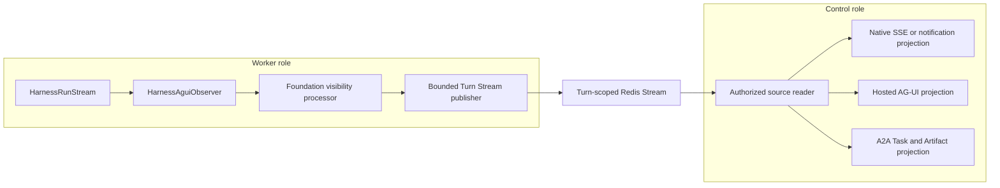

# Events, Interaction Projection, Usage, and Delivery

## Design Position

Foundation owns durable lifecycle publication, optional retained interaction projection, raw usage ingestion, large-content selection, and external delivery without turning transport or telemetry into Turn authority. [Lifecycle and Stream Persistence](17-lifecycle-and-stream-persistence.md) owns the lifecycle-event schema, the stable Turn-scoped Redis Stream, Redis replay cursors, retained Items, and the immutable `TurnReplaySnapshot`. This document owns usage attribution, external destination delivery, large content, and observability consequences of those records.

[Foundation Hook Notifications](20a-hook-notifications.md) owns the public Hook-name registry, durable subscription matching, external channel eligibility, and Webhook flow. Hook routing reuses the records and delivery envelope defined here rather than creating another event log or transport authority. Native Turn SSE, lifecycle reads, and best-effort notifications remain owned by [Native Streaming and Notifications](29-native-streaming-and-notifications.md).

Harness observations follow the accepted Agent Stream Protocol path. Foundation consumes `HarnessAguiObserver` output and does not implement another Harness-to-AG-UI mapping. A live message or delivered envelope becomes authoritative only through the owning Turn, lifecycle-event, retained-Item, or usage commit.

## Record Layers

| Layer                | Meaning                                                         | Authority                                           |
| -------------------- | --------------------------------------------------------------- | --------------------------------------------------- |
| Harness source event | Process-local public observation from one Harness Run           | Harness observation only                            |
| AG-UI event          | `HarnessAguiObserver` conversion after optional Host processing | Presentation observation only                       |
| Turn Stream entry    | Bounded Turn-scoped live or lifecycle projection in Redis       | Transport and bounded replay only                   |
| Item                 | User-visible semantic unit within a Turn                        | Retained projection in `TurnReplaySnapshot`         |
| Lifecycle event      | Fact that a Foundation resource transition committed            | Relational audit and publication fact               |
| Native notification  | Lightweight subscribed resource wake-up                         | Best-effort delivery only                           |
| UsageRecord          | Immutable incurred-usage fact                                   | Durable usage attribution after validated ingestion |
| Destination record   | Delivery progress for one authorized Webhook destination        | Delivery only; never source lifecycle authority     |

Messages, permitted reasoning units, tool calls, commands, file changes, approvals, child activity, plans, errors, and bounded content references can become retained Items. Heartbeats, credentials, private state, arbitrary logs, and unbounded payloads do not automatically become Items.

## Harness Observation and Turn Stream



One observer belongs to one Harness Run and is consumed by its current worker. The Foundation visibility processor applies authorization, redaction, and stable Item projection policy without changing upstream event meaning. Credentials, private state, arbitrary logs, and unbounded content never enter the Turn Stream.

Before publishing its first live observation, the worker durably binds the immutable Harness Run identity to the current TurnAttempt. It then appends bounded messages to the one stable tenant-scoped Redis Stream owned by the Turn. Replacement TurnAttempts create fresh Harness Runs but continue the same Turn Stream; every entry carries exact TurnAttempt and Harness Run provenance.

Expected planned handoff is a Foundation Attempt transition, not a Harness Run outcome. Closing the old process-local stream for `turn_attempt.yielded` emits no AG-UI `RUN_FINISHED`, `RUN_ERROR`, or synthetic cancelled result, does not close the Turn Stream, and does not repeat `turn.running`. The successor's fresh Harness Run continues observations in the same Turn Stream under new Attempt and Run provenance.

Redis Stream entry IDs are bounded live replay cursors, not product authority. Stream possession and cursor knowledge grant no access. Control authenticates and authorizes the caller against current Foundation state before reading or subscribing, and it releases all database sessions before streaming.

The [Protocol Gateway](28-protocol-gateway.md) owns each public wire projection. Native Turn SSE preserves the Turn Stream cursor; Hosted AG-UI assigns its own retained delivery cursor; A2A exposes current Task state rather than a Native cursor. The best-effort Native notification WebSocket carries only wake-up metadata and has no retained delivery source. None of these projections changes the source event or Item.

Bounded queues and explicit overflow handling prevent a slow client from blocking Harness work. When the retained Redis prefix is unavailable, control returns the explicit replay-gap semantics defined by the stream owner. Once a Turn seals with a complete, nonempty stream within the retention bounds, Foundation publishes its immutable `TurnReplaySnapshot`; reconnect and retained reads use the snapshot rather than reconstructing presentation from relational rows, object listings, telemetry, or Harness state. An incomplete, trimmed, empty, or oversized stream reports retained replay as unavailable.

## Lifecycle Publication and External Destinations

Every authoritative Turn and TurnAttempt transition writes the bounded typed lifecycle event required by [Lifecycle and Stream Persistence](17-lifecycle-and-stream-persistence.md). Waiting pending data remains owned by its sealed Turn and state, while child relationships and Connector or Trigger operations retain their owning domain records and outbox intents without extending the lifecycle entity registry implicitly. Event publication follows the atomicity, retry, and duplicate-delivery rules in [Durable Operations and Outbox](06-durable-operations-and-outbox.md).

Each lifecycle resource has one contiguous `resource_seq`; the Workspace feed has a separate database-assigned cursor that is monotonic but not a causal order. Duplicate publication preserves one event identity. Event content references owning resources and retained Items rather than copying differently retained payloads. Redis presence, subscriber receipt, and telemetry never manufacture a lifecycle fact.

External Webhook delivery specializes the shared Outbox. One lifecycle source creates one Outbox row for each matching HookSubscription version because each delivery completes independently from source commitment and from other subscriptions. A bounded destination policy can exhaust retries and dead-letter its own row without changing the source lifecycle event, Turn Stream, retained snapshot, or Turn outcome.

Durable Hook subscription delivery is limited to committed lifecycle events. Live-only Turn Stream entries and Items use authorized Turn SSE and never create Outbox rows merely because a subscriber selected their Hook names. Native notification WebSocket frames remain coarse, best-effort wake-ups rather than Hook payload delivery.

The delivery envelope is conceptually:

```python
class FoundationDeliveryEnvelope:
    delivery_id: DeliveryId
    hook_subscription_id: HookSubscriptionId
    hook_name: str
    hook_schema_version: str
    source_kind: Literal["lifecycle_event"]
    source_id: str
    workspace_id: WorkspaceId
    resource_type: Literal["turn", "turn_attempt"]
    resource_id: str
    resource_seq: int
    resource_version: int
    session_id: SessionId | None
    thread_id: ThreadId | None
    turn_id: TurnId | None
    turn_attempt_id: TurnAttemptId | None
    harness_run_id: HarnessRunId | None
    occurred_at: datetime
    payload: BoundedSafePayload
```

The schema is conceptual. `hook_name` is one exact name from the Hook registry, and `hook_schema_version` versions that Hook payload independently from the source storage and Native transport schemas. A lifecycle event uses its stable relational identity. `resource_type`, `resource_id`, `resource_seq`, and `resource_version` are the delivery names for the source lifecycle event's `entity_type`, `entity_id`, `resource_seq`, and `entity_version`. Optional correlation is absent rather than inferred when the source does not own it. Turn SSE and Native notification frames never use this envelope.

`resource_seq` is contiguous only within one `(workspace_id, resource_type, resource_id)` lifecycle stream and is the value used to identify stale, duplicate, and missing resource events. `resource_version` identifies the resource state version produced by the source mutation; it can skip and is not used for gap detection.

Re-delivery of the same source to the same subscription preserves `delivery_id`. Webhook delivery is not ordered, including between consecutive events for the same resource and subscription. Parallel publishers, retry backoff, response loss, and redrive can all deliver a later `resource_seq` before an earlier one. Source commitment, Turn Stream append, retained-snapshot publication, destination acknowledgement, and client receipt are separate facts.

Streaming routes follow the [HTTP streaming contract](05-http-ingress-and-request-contract.md#streaming-connections). Disconnect never cancels or seals a Turn.

The old combined Workspace SSE/WebSocket delivery surface does not exist. Durable Workspace lifecycle reads, detailed Turn SSE, and best-effort Native notifications use the distinct contracts in [Native Streaming and Notifications](29-native-streaming-and-notifications.md).

## Durable Usage Ingestion

The Harness owns native `RunUsage`, the run-local attribution ledger, immutable `UsageRecord` values, and bounded `usage_report` delivery. Foundation ingests immutable `UsageRecord` values idempotently by `record_id` and adds durable attribution:

- Organization, Workspace, Session, Thread, and Turn;
- originating TurnAttempt and Harness Run;
- stable AgentPreset, exact AgentPresetVersion, and Runtime lock digest; and
- accepted `model_id`, provider type, and model name from the TurnAttempt observation, plus model/provider identity and measures from the record.

A `usage_report` ID is a delivery identity, not another usage fact. Reports can overlap through retries or chunk delivery. `HarnessRunResult.usage_records` is a complete detached run-local snapshot and can overlap records already delivered incrementally. Foundation deduplicates all paths by immutable `record_id` and rejects conflicting content for the same identity.

Terminal `RunUsage` is an aggregate process-local snapshot used for operational limits and summary display. Foundation does not sum it with UsageRecords, inline-child snapshots, or later TurnAttempt snapshots. Durable attribution operates from immutable records. Harness model records already carry the applied build-time pricing revision, rule, status, and cost source; Foundation may add negotiated or settlement projections without changing record identity or content.

### Late Usage from a Terminal or Stale TurnAttempt

TurnAttempt fencing prevents a stale worker from changing lifecycle state. It does not erase usage already incurred before lease loss or a committed planned handoff. Foundation can ingest a late immutable UsageRecord under the original failed, yielded, or otherwise terminal TurnAttempt identity when its stable record identity and canonical content validate.

Late ingestion:

- cannot publish Turn state, a retained Item, waiting pending data, or lifecycle transition;
- cannot change Turn or TurnAttempt outcome;
- preserves the original TurnAttempt attribution and ingestion timestamp;
- remains idempotent by `record_id`; and
- can be supplemented by separately identified provider evidence under an owning reconciliation contract.

This exception prevents lease loss from silently dropping attributable usage without weakening lifecycle fencing.

## Large Content

Large model, tool, command, file, or child outputs use object storage only after bounded staging, digest verification, authorization through the owning Turn or Item, and durable selection. They remain content of that owning record and have no independent product identity. Object keys, file paths, digests, and signed URLs grant no product authority by possession.

For example, a command result that exceeds the inline Item limit is staged as an object and selected before the immutable Turn replay snapshot references it. An unselected upload is a cleanup candidate. A selected missing object produces an explicit content-read failure; Foundation does not reinterpret it as a missing Item or use it as continuation state.

## Observability

OpenTelemetry traces and metrics correlate safe service role, `worker_build_id`, worker generation, Session, Thread, Turn, TurnAttempt, Harness Run, and provider identities. They omit credentials, authorization headers, plaintext Secrets, raw prompts, model output, tool payloads, and uploaded content by default.

Telemetry is best effort. Its loss cannot erase durable audit, lifecycle, retained Item, state, or usage facts, and its presence cannot prove commitment.

## Failure Semantics

| Failure                                            | Outcome                                                                                            |
| -------------------------------------------------- | -------------------------------------------------------------------------------------------------- |
| Turn Stream append outcome is unknown              | Reconcile by stable event identity; never infer Turn commitment from Redis                         |
| Redis retention no longer covers requested cursor  | Return the explicit replay gap or immutable Turn snapshot according to the owning stream contract  |
| Subscriber or client buffer overflows              | End the affected attachment explicitly; Harness work and Turn authority continue                   |
| Replay snapshot publication fails                  | Sealed Turn remains authoritative; retry deterministic create-only publication                     |
| Webhook delivery exhausts retries                  | Destination record is dead-lettered; source remains authoritative                                  |
| Webhook events arrive out of resource order        | Receiver persists the delivery and reconciles the resource-scoped lifecycle API before applying it |
| Client disconnects                                 | Turn continues according to durable state                                                          |
| Usage report repeats or overlaps terminal snapshot | `record_id` deduplication prevents double counting                                                 |
| Stale TurnAttempt supplies valid late usage        | Usage is attributed and retained without lifecycle mutation                                        |
| Yielded Run cleanup reaches its protocol observer  | No public terminal AG-UI event is fabricated; the running Turn Stream remains open                 |
| Same usage identity has different content          | Ingestion fails closed and emits a security diagnostic                                             |
| Object upload and owning-record commit diverge     | Cleanup or an explicit content-read failure preserves owning-record authority                      |
| Harness pricing is disabled, declined, or fails    | Raw usage remains durable and ordinary Foundation operation is unaffected                          |

## Invariants

01. Harness observations, AG-UI events, Turn Stream entries, Items, lifecycle events, and delivery envelopes remain distinct.
02. Foundation uses `HarnessAguiObserver` and does not own a second Harness-to-AG-UI vocabulary.
03. One Turn uses one stable Redis Stream across all its TurnAttempts.
04. A lifecycle event represents a committed transition and is never inferred from transport delivery.
05. Turn Stream entries, Items, replay snapshots, and lifecycle events never become Harness continuation state.
06. Source commitment, stream append, retained-snapshot publication, external delivery, and client receipt are separate facts.
07. Usage is ingested idempotently by immutable UsageRecord identity, not report or aggregate identity.
08. Late stale-TurnAttempt usage cannot change lifecycle state.
09. Object references and signed delivery URLs grant no product authority.
10. Telemetry observes the system and never acts as durable lifecycle authority.
11. Live-only Turn Stream entries and Items never create durable Hook-delivery intents; durable subscriptions select committed lifecycle events only.
12. Native, Hosted AG-UI, and A2A delivery are independent projections over shared Foundation facts and never translate through one another.
13. A Webhook envelope identifies its resource sequence and version, but the Webhook transport makes no ordering or exactly-once-processing guarantee.
14. Planned handoff has an internal `turn_attempt.yielded` lifecycle fact but no AG-UI Run terminal event and no Turn Stream boundary.
