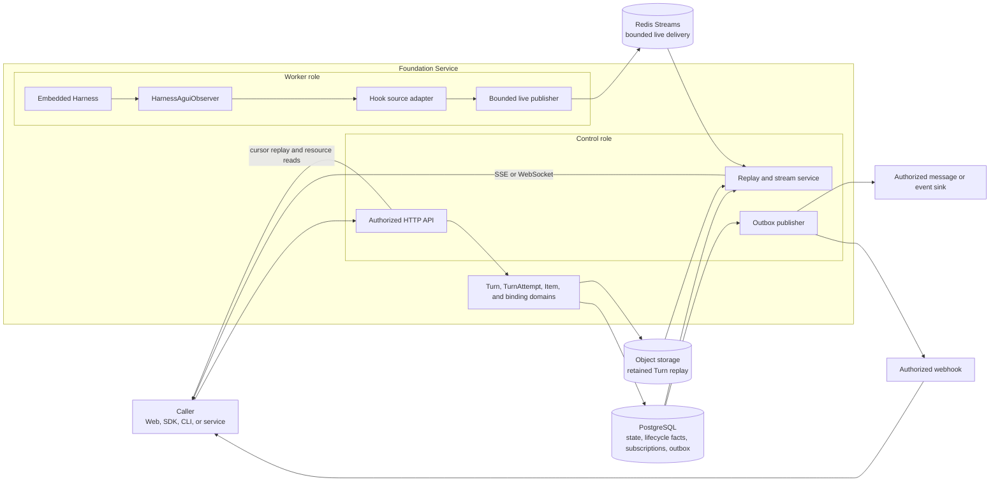
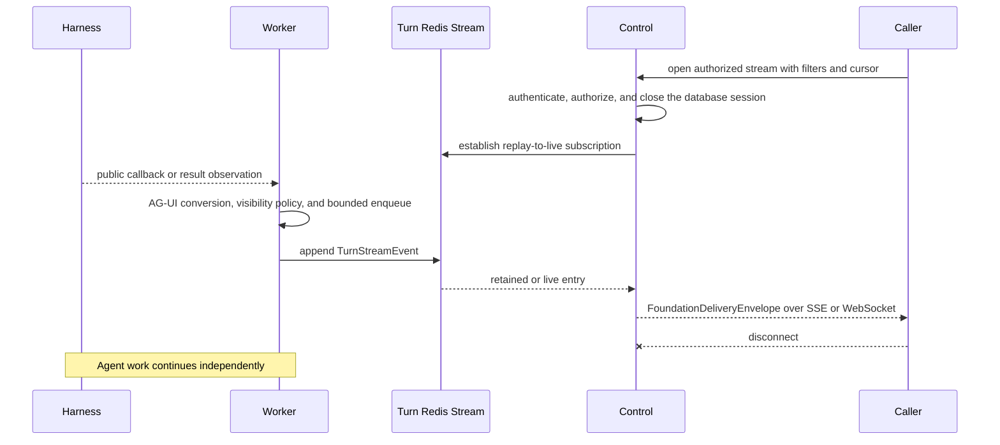
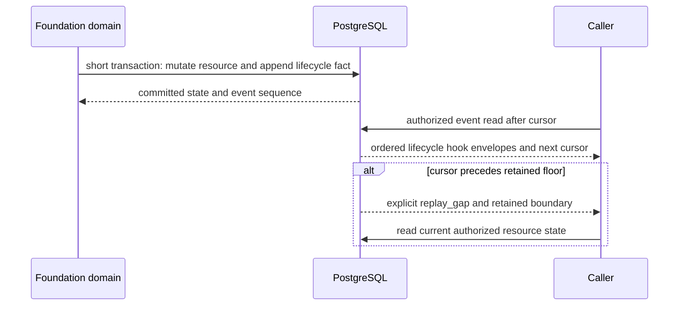
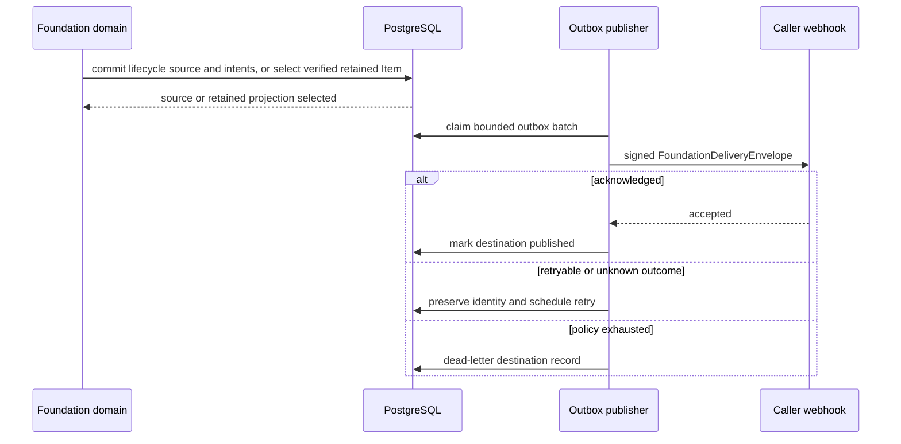

# Foundation Hook Notifications

## Design Position

A Foundation hook is a stable, filterable notification name for an existing
Foundation fact or public run observation. It is not a remote execution
extension point, another Agent loop, or another lifecycle authority. The Worker
embeds Harness in-process, consumes its public callbacks through
`HarnessAguiObserver`, and combines those process-local observations with
Foundation-owned lifecycle and projection sources.

Hook delivery preserves the authority of its source:

- a Harness or Environment-binding callback is a live observation;
- a Turn or TurnAttempt hook represents a committed relational lifecycle fact;
- an Item hook represents a presentation projection; and
- delivery acknowledgement records transport progress only.

No caller-supplied callback executes inside the Harness call stack. Foundation
does not offer a synchronous remote pre-hook or post-hook protocol. A business
decision that must stop Agent progress uses the owning authorization or deferred
interaction contract rather than a blocking webhook.

## Overall Architecture



The Worker invokes Harness through its public process-local API rather than a
Foundation SDK or network hop. The Hook source adapter assigns Foundation
correlation and routing names without changing the meaning of an AG-UI event.
The [Lifecycle and Stream Persistence](17-lifecycle-and-stream-persistence.md)
contract owns PostgreSQL lifecycle facts, the Turn-scoped Redis Stream, and
retained replay. [Events, Interaction Projection, Usage, and
Delivery](20-events-usage-and-delivery.md) owns the common delivery envelope and
source-authority separation. [Durable Operations and
Outbox](06-durable-operations-and-outbox.md) owns reliable external publication.

## Boundaries and Hook Model

| Concern                                           | Owner                              | Hook relationship                                               |
| ------------------------------------------------- | ---------------------------------- | --------------------------------------------------------------- |
| Model, tool, and Harness Run observation          | Harness and Pydantic AI            | Supplies process-local source observations                      |
| Harness-to-AG-UI conversion                       | Agent Stream Protocol              | Supplies standard AG-UI types and complete `CUSTOM` fallback    |
| Turn and TurnAttempt state                        | Foundation owning domain           | Supplies authoritative committed lifecycle facts                |
| Item state                                        | Foundation presentation projection | Supplies retained, non-lifecycle semantic units                 |
| External Environment resource lifecycle           | External provider and user         | Is not a Foundation lifecycle source                            |
| Environment connection and active binding         | Foundation Environment connector   | Supplies process-local binding observations only                |
| Hook name registry and subscription matching      | This contract                      | Selects existing source semantics without changing them         |
| Transport, retry, and destination acknowledgement | Foundation delivery                | Never changes the source fact or Agent outcome                  |
| Caller business workflow                          | Caller                             | Reacts to notifications and reconciles from authoritative reads |

Every delivered hook uses the common `FoundationDeliveryEnvelope`. This
contract owns the finite hook-name registry; the delivery contract owns the
envelope fields and transport meaning. Common correlation includes the
Workspace and, when applicable, Session, Thread, Turn, TurnAttempt, Harness Run,
source, schema version, occurrence time, and delivery identity. A field is
absent rather than guessed when its source does not own that correlation.

Hook names use lowercase dot-separated segments. Names beginning with `turn.`
and `turn_attempt.` preserve the exact Foundation lifecycle-event names. Names
beginning with `agui.` preserve the exact AG-UI event type in lowercase. A
`CUSTOM` event retains its exact custom name and public payload rather than being
translated into another Foundation event vocabulary.

### Durable Hook Subscriptions

SSE, WebSocket, and replay clients select filters per authorized request. An
external webhook or message sink instead uses a durable Workspace-scoped hook
subscription. The following schema is conceptual:

```python
class HookSubscription:
    id: str
    version: int
    workspace_id: str
    status: Literal["active", "paused"]
    hook_names: tuple[str, ...]
    session_id: str | None
    thread_id: str | None
    turn_id: str | None
    destination_kind: Literal["webhook", "authorized_sink"]
    destination_ref: str
    created_at: datetime
    updated_at: datetime
```

`hook_names` is a non-empty bounded set of exact registry names. Scope filters
are optional, tenant-consistent, and conjunctive. A subscription never contains
an endpoint credential, signing Secret, broker credential, or raw callback URL
inside an event or outbox record. `destination_ref` selects one exact immutable,
separately authorized destination configuration; Secret values remain in the
owning Secret boundary.

Creating, changing, pausing, or deleting a subscription uses ordinary
Workspace authorization and optimistic concurrency. Workspace limits keep the
active matching destination set bounded for every source. For a lifecycle
event, the subscription state observed by the source transaction determines
which outbox intents are created. For a retained Item, the projection worker
first verifies the immutable replay snapshot and then idempotently commits the
matching intents by Item and destination identity. A later subscription change
does not retract an intent or retroactively deliver older sources. Authorized
redrive reuses the original delivery identity.

Only committed lifecycle events and immutable retained Items are eligible for
durable subscription delivery. Live-only Turn Stream entries, token deltas,
diagnostics, Environment-binding observations, and telemetry never create
outbox intents.

## Notification Methods

### Live SSE and WebSocket Stream

SSE and WebSocket expose the same authorized Workspace delivery stream and
filter semantics. SSE is the ordinary unidirectional client surface. WebSocket
supports clients that need the same envelope on a long-lived bidirectional
transport; it does not gain execution or cancellation authority.



The Worker performs no caller network I/O while processing a Harness callback.
Bounded queues isolate Harness progress from Redis and client speed. Overflow or
a slow client closes the affected attachment or produces an explicit replay
gap; it never cancels or seals the Turn. Live-only AG-UI observations do not
advance the durable lifecycle replay cursor.

### Durable Replay and Polling

Lifecycle hooks are readable through the Workspace or resource-scoped event
collections. Callers use the opaque replay cursor for catch-up, audit, and
reconciliation. Resource reads remain the final authority for current state.



Replay ordering is monotonic within the owning retained stream, not a global
causal order. A caller deduplicates by stable source identity and does not infer
missing state transitions from timestamps or transport order.

### Webhook Delivery

Webhook delivery applies only to a matching active durable subscription. A
lifecycle source and one outbox intent per destination commit atomically. A
retained Item receives idempotent delivery intents only after its immutable
snapshot validates. In both cases, the HTTP request occurs later outside every
source transaction and Agent execution scope.



Webhook requests carry a bounded timestamp and signature over the canonical
request bytes. Receivers validate freshness and signature, then deduplicate by
`delivery_id` or stable source identity before applying effects. Delivery is at
least once. A successful HTTP acknowledgement proves only destination receipt;
it does not prove that a user processed the event.

Destination URL validation, redirect policy, address resolution, network
egress policy, body and response limits, deadlines, TLS verification, and Secret
resolution fail closed against server-side request forgery and credential
disclosure. Response bodies and endpoint errors are reduced to bounded safe
delivery diagnostics.

### Authorized Message or Event Sink

An authorized sink consumes the same durable envelope and outbox state machine
as a webhook. The sink adapter owns provider authentication, partition or topic
selection, acknowledgement mapping, and bounded provider retry. Foundation
preserves the source and delivery identities across retries and makes no
exactly-once claim. A sink acknowledgement remains independent from consumer
processing.

### SDK Notification Surface

Foundation SDKs expose idiomatic asynchronous iterators, callbacks, or polling
helpers over the HTTP stream and replay APIs. These are client conveniences,
not another delivery method or event schema. An SDK callback runs in the caller
process and cannot block the Foundation Worker or Harness Run.

## Hook Sources and Trigger Semantics

### Harness and Agent Stream Protocol Hooks

The Worker consumes each public Harness stream item once through
`HarnessAguiObserver`. Standard AG-UI mappings retain their upstream type and
payload. Observations without a standard mapping retain the exact `CUSTOM` name
and public source representation. Foundation adds only envelope correlation,
authorization, visibility processing, Item projection, retention, and delivery.

| Hook name or family                                                 | Trigger                                                                 | Information                                                                                 |
| ------------------------------------------------------------------- | ----------------------------------------------------------------------- | ------------------------------------------------------------------------------------------- |
| `agui.text_message_start`                                           | Assistant text part begins                                              | Thread, Run, message and part correlation, role, timestamp                                  |
| `agui.text_message_content`                                         | Assistant text delta arrives                                            | Correlation and bounded text delta under visibility policy                                  |
| `agui.text_message_end`                                             | Assistant text part ends                                                | Correlation and completion boundary; no Turn-completion claim                               |
| `agui.reasoning_*`                                                  | Public reasoning part starts, changes, or ends                          | Correlation and policy-permitted public reasoning fields                                    |
| `agui.tool_call_start`, `agui.tool_call_args`, `agui.tool_call_end` | A complete model-requested tool call is assembled                       | Tool-call identity, public tool name, and policy-permitted arguments; not dispatch evidence |
| `agui.tool_call_result`                                             | A successful public tool return is observed                             | Tool-call identity and policy-permitted result; not a provider receipt                      |
| `agui.run_finished`                                                 | Harness emits a successful terminal result after run cleanup            | Harness Run identity and JSON-safe result when representable; not durable Turn completion   |
| `agui.run_error`                                                    | Harness emits a failed or cancelled terminal result after run cleanup   | Harness Run identity and bounded public failure or cancellation code                        |
| `agui.custom`                                                       | A public Harness or Pydantic observation has no direct standard mapping | Exact custom name, source correlation, source sequence, occurrence time, and public payload |

`agui.tool_call_start` describes the standard AG-UI presentation lifecycle of a
fully assembled model request. It does not mean that Foundation has authorized
or dispatched the tool. Durable dispatch evidence remains owned by the current
TurnAttempt. Likewise, `agui.run_finished` and `agui.run_error` are
process-local Harness outcomes until Foundation commits the owning Turn and
TurnAttempt transitions.

Important `agui.custom` names include:

| Custom name               | Trigger and meaning                                                                                        | Information                                                                                                       |
| ------------------------- | ---------------------------------------------------------------------------------------------------------- | ----------------------------------------------------------------------------------------------------------------- |
| `a13n.harness.run_result` | Harness suspends with deferred calls or approvals                                                          | Run correlation and bounded public deferred summary; complete continuation authority remains in sealed Turn state |
| `a13n.harness.lifecycle`  | Harness observes a model-request boundary                                                                  | Request index and ID, started/completed/failed action, message count or bounded safe error code                   |
| `a13n.harness.invocation` | Managed-tool preparation, authorization, approval, dispatch, result-safety, or unknown-outcome observation | Invocation, tool-call and tool correlation, phase, bounded status and safe evidence                               |
| `a13n.harness.delegation` | Inline or Host-managed delegation observation                                                              | Invocation and child correlation, selected subagent, action, bounded status                                       |
| `a13n.harness.usage`      | Harness emits a bounded usage report                                                                       | Stable report and record identities, chunk position, bounded usage records                                        |
| `a13n.harness.context`    | Context or Environment-topology observation changes                                                        | Bounded source-owned context change without credential or private state                                           |
| `a13n.harness.state`      | Harness emits a public state observation                                                                   | Bounded revisioned delta; not a durable Foundation state commit                                                   |
| `a13n.harness.recovery`   | Internal ModelAttempt recovery progresses                                                                  | Interrupted boundary, backoff, restart, exhaustion, or cancellation observation                                   |
| `a13n.harness.diagnostic` | Harness emits safe implementation detail                                                                   | Bounded public diagnostic without lifecycle authority                                                             |
| `a13n.pydantic_ai.*`      | Another public Pydantic event has no standard AG-UI mapping                                                | Exact public event kind and serialized public source representation                                               |

All Harness-derived hooks use SSE or WebSocket only. A caller that needs a
reliable business completion notification subscribes to the corresponding
Foundation `turn.*` hook rather than `agui.run_*`.

### Foundation Turn Hooks

Turn hooks originate only from the relational transition that owns the fact.
The transition and required lifecycle event commit in the same short
transaction. The exact Turn state machine and fields remain owned by [Durable
Turn State](14-turn-persistence.md#turn-lifecycle).

| Hook name        | Trigger                                                                                | Information                                                                                                                                     |
| ---------------- | -------------------------------------------------------------------------------------- | ----------------------------------------------------------------------------------------------------------------------------------------------- |
| `turn.accepted`  | A complete Turn, accepted input, selections, scheduling data, and initial state commit | Session, Thread, Turn, parent and lineage correlation, Agent revision, safe trigger correlation, resource version, availability and commit time |
| `turn.running`   | The first TurnAttempt is leased and fenced and the Turn leaves `accepted`              | Turn version, current TurnAttempt, claim time, safe Agent/model observation                                                                     |
| `turn.waiting`   | A deferred result and complete waiting state are sealed                                | Wait reason, bounded pending-action summary, sealed time and authorized resource links; no full deferred payload                                |
| `turn.completed` | Complete state and output are sealed successfully                                      | Output or object reference under content policy, final Item references, usage summary reference, version and sealed time                        |
| `turn.failed`    | A terminal pre-run or running failure seals the Turn                                   | Bounded `SafeFailure`, final attempt correlation, version and sealed time                                                                       |
| `turn.cancelled` | Authorized cancellation or normalized run cancellation seals the Turn                  | Cancellation actor or source when safe, reason code, final attempt correlation, version and sealed time                                         |

Every accepted asynchronous child is an ordinary child Turn. Its `turn.*`
hooks carry parent Agent instance, delegation, parent tool-call, Session, Thread,
and parent-Turn correlation when authorized; Foundation defines no competing
`child_run.*` lifecycle.

### Foundation TurnAttempt Hooks

TurnAttempt hooks describe one fenced Worker generation. Attempt failure does
not imply Turn failure. A replacement attempt emits another
`turn_attempt.leased` while the Turn can remain `running`. The exact authority,
lease, fence, dispatch, and recovery behavior remain owned by [Durable
TurnAttempt Persistence](15-turn-attempt-persistence.md#turnattempt-lifecycle).

| Hook name                | Trigger                                                                                          | Information                                                                                                                     |
| ------------------------ | ------------------------------------------------------------------------------------------------ | ------------------------------------------------------------------------------------------------------------------------------- |
| `turn_attempt.leased`    | A Worker transactionally creates or replaces the current fenced attempt                          | Turn and attempt identity, attempt number, fence, replacement correlation, bounded recovery reason, lease expiry and claim time |
| `turn_attempt.running`   | Harness Run entry atomically binds `run_id` and start time                                       | Attempt version, Harness Run identity, safe model observation and start time                                                    |
| `turn_attempt.succeeded` | The current attempt commits the owning Turn outcome                                              | Attempt and Turn correlation, bounded usage summary, finish time and resulting Turn hook identity when available                |
| `turn_attempt.failed`    | Preparation, run, lease replacement, or fenced publication failure makes the generation terminal | Bounded `SafeFailure`, recovery reason, unknown-outcome count, replacement eligibility and finish time                          |
| `turn_attempt.cancelled` | Cancellation makes the current generation terminal                                               | Bounded cancellation reason, Turn cancellation correlation and finish time                                                      |

Agent tool dispatch and result-correlation records remain bounded evidence on
the owning TurnAttempt. They can appear through Harness live observations and
authorized TurnAttempt reads, but Foundation does not create another generic
durable tool lifecycle or provider-receipt hook. An unmatched dispatched call is
reported as `unknown_outcome` in replacement-attempt context and never replayed
automatically.

### Item Projection Hooks

Items are presentation projections, not Turn lifecycle facts. Foundation emits
their incremental changes through the Turn Stream. When a complete retained
snapshot exists, a terminal Item can also be selected for durable webhook or
sink delivery by immutable Item identity.

| Hook name          | Trigger                                                          | Information                                                                                                         |
| ------------------ | ---------------------------------------------------------------- | ------------------------------------------------------------------------------------------------------------------- |
| `item.completed`   | One semantic Item closes successfully                            | Item identity and kind, parent Item, first and last stream cursors, bounded content or authorized content reference |
| `item.failed`      | One semantic Item closes with a presentation failure             | Item identity and kind, parent Item, cursors and bounded safe failure projection                                    |
| `item.interrupted` | One semantic Item remains incomplete at the closed Turn boundary | Item identity and kind, parent Item, cursors and bounded interruption projection                                    |

An Item hook never proves model, tool, provider, or Turn completion. Webhook and
sink delivery occurs only from the immutable retained Item; a live Item change
uses the stream and is not promoted into the Outbox.

### Environment and Sandbox-Related Hooks

Foundation owns the lifecycle of its process-local connection and active
binding, not the lifecycle of an external Environment or Sandbox. The Worker can
emit these live observations:

| Hook name                       | Trigger                                                                                        | Information                                                                                            |
| ------------------------------- | ---------------------------------------------------------------------------------------------- | ------------------------------------------------------------------------------------------------------ |
| `environment.binding.started`   | A fenced TurnAttempt begins connecting its exact Environment configuration                     | Environment and revision identity, connector/provider key, TurnAttempt correlation and occurrence time |
| `environment.binding.ready`     | The connector validates the existing resource and returns a compatible attachment              | Correlation plus bounded safe capability and readiness summary                                         |
| `environment.binding.failed`    | Connection, authorization, compatibility, or attachment validation fails                       | Correlation and bounded safe failure code; no target credential or provider body                       |
| `environment.keep_alive.failed` | Active-run keep-alive exhausts its bounded retry policy                                        | Correlation, bounded safe failure and terminal Attempt classification                                  |
| `environment.binding.closed`    | Binding closes after Harness completion, cancellation, lease loss, failure, or Worker shutdown | Correlation and bounded close reason; no claim about external resource state                           |

These hooks are live SSE or WebSocket observations only. Foundation emits no
`sandbox.created`, `sandbox.started`, `sandbox.paused`, `sandbox.resumed`,
`sandbox.stopped`, or `sandbox.deleted` hook because it never owns or performs
those transitions. A missing, stopped, paused, incompatible, or concurrently
unavailable external resource ultimately appears through
`environment.binding.failed` and the authoritative TurnAttempt outcome. The
boundary remains owned by [Environment Configuration and Runtime
Bindings](19-environment-management.md#turnattempt-runtime-binding).

## Execution, Backpressure, and Blocking

| Processing boundary                               | Effect on Agent progress                                                                                                           |
| ------------------------------------------------- | ---------------------------------------------------------------------------------------------------------------------------------- |
| Harness callback adaptation                       | Performs only bounded in-process conversion and enqueue; never invokes a caller                                                    |
| Redis publication and live client delivery        | Uses bounded decoupling; failure or overflow affects observation availability, not Turn authority                                  |
| Lifecycle event and matching Outbox intent commit | Blocks only the owning short state transaction; the transition is not visible as committed until both exist                        |
| Webhook or sink network delivery                  | Runs asynchronously after commit and never blocks Harness, tool, Turn, or API acceptance                                           |
| SDK callback execution                            | Runs in the caller process and cannot block Foundation execution                                                                   |
| Human, client-tool, or external approval          | Seals the Turn as `waiting`, releases run resources, and resumes through a newly accepted Turn rather than holding a callback open |

A Hook subscription cannot modify input, output, tool arguments, tool results,
Turn state, or retry policy. A failed subscriber, publisher, webhook, or sink
never changes the already committed source outcome. Foundation does not hold a
database session or transaction across Harness execution, Redis subscription,
webhook delivery, sink publication, or an external wait.

## Complete Hook Catalog

The following table is the public Foundation hook routing registry.
Subscription configuration contains exact names supported by the selected API
version.

| Hook name                        | Source                                | Trigger time                                              | Notification methods                               | Information summary                                                |
| -------------------------------- | ------------------------------------- | --------------------------------------------------------- | -------------------------------------------------- | ------------------------------------------------------------------ |
| `agui.text_message_start`        | Harness through Agent Stream Protocol | Public assistant text begins                              | SSE, WebSocket                                     | Run/message/part correlation, role, time                           |
| `agui.text_message_content`      | Harness through Agent Stream Protocol | Public assistant text delta                               | SSE, WebSocket                                     | Correlation and bounded visible delta                              |
| `agui.text_message_end`          | Harness through Agent Stream Protocol | Public assistant text ends                                | SSE, WebSocket                                     | Correlation and part completion                                    |
| `agui.reasoning_message_start`   | Harness through Agent Stream Protocol | Public reasoning begins                                   | SSE, WebSocket                                     | Run/message/part correlation and time                              |
| `agui.reasoning_message_content` | Harness through Agent Stream Protocol | Public reasoning delta                                    | SSE, WebSocket                                     | Correlation and policy-permitted reasoning delta                   |
| `agui.reasoning_encrypted_value` | Harness through Agent Stream Protocol | Public encrypted reasoning value is observed              | SSE, WebSocket                                     | Correlation and policy-permitted encrypted value                   |
| `agui.reasoning_message_end`     | Harness through Agent Stream Protocol | Public reasoning ends                                     | SSE, WebSocket                                     | Correlation and reasoning-part completion                          |
| `agui.tool_call_start`           | Harness through Agent Stream Protocol | Complete requested tool call begins AG-UI projection      | SSE, WebSocket                                     | Tool-call ID and public tool name                                  |
| `agui.tool_call_args`            | Harness through Agent Stream Protocol | Complete public tool arguments are projected              | SSE, WebSocket                                     | Tool-call ID and policy-permitted arguments                        |
| `agui.tool_call_end`             | Harness through Agent Stream Protocol | Requested tool call projection closes                     | SSE, WebSocket                                     | Tool-call correlation; not dispatch proof                          |
| `agui.tool_call_result`          | Harness through Agent Stream Protocol | Successful public tool return is observed                 | SSE, WebSocket                                     | Tool-call correlation and visible result                           |
| `agui.run_finished`              | Harness through Agent Stream Protocol | Successful terminal Harness result after cleanup          | SSE, WebSocket                                     | Run identity and JSON-safe result when available                   |
| `agui.run_error`                 | Harness through Agent Stream Protocol | Failed or cancelled terminal Harness result after cleanup | SSE, WebSocket                                     | Run identity and bounded public code                               |
| `agui.custom`                    | Harness through Agent Stream Protocol | Public observation lacks a standard AG-UI mapping         | SSE, WebSocket                                     | Exact custom name, source correlation, sequence and public payload |
| `turn.accepted`                  | Foundation Turn domain                | Turn acceptance commits                                   | SSE, WebSocket, replay API, webhook, sink          | Turn lineage, selections, version and scheduling summary           |
| `turn.running`                   | Foundation Turn domain                | First Attempt is leased and the Turn leaves `accepted`    | SSE, WebSocket, replay API, webhook, sink          | Current Attempt, claim time and safe model observation             |
| `turn.waiting`                   | Foundation Turn domain                | Deferred outcome and waiting state seal                   | SSE, WebSocket, replay API, webhook, sink          | Wait reason and bounded pending summary                            |
| `turn.completed`                 | Foundation Turn domain                | Output and final state seal                               | SSE, WebSocket, replay API, webhook, sink          | Output/reference, Items, version and sealed time                   |
| `turn.failed`                    | Foundation Turn domain                | Terminal failure seals Turn                               | SSE, WebSocket, replay API, webhook, sink          | Safe failure, final Attempt and sealed time                        |
| `turn.cancelled`                 | Foundation Turn domain                | Cancellation seals Turn                                   | SSE, WebSocket, replay API, webhook, sink          | Safe cancellation, actor/source and sealed time                    |
| `turn_attempt.leased`            | Foundation TurnAttempt domain         | Worker generation is claimed and fenced                   | SSE, WebSocket, replay API, webhook, sink          | Attempt number, fence, replacement, lease and recovery summary     |
| `turn_attempt.running`           | Foundation TurnAttempt domain         | Harness Run identity commits                              | SSE, WebSocket, replay API, webhook, sink          | Attempt/Run correlation, model observation and start time          |
| `turn_attempt.succeeded`         | Foundation TurnAttempt domain         | Attempt commits owning Turn outcome                       | SSE, WebSocket, replay API, webhook, sink          | Usage summary, finish time and Turn correlation                    |
| `turn_attempt.failed`            | Foundation TurnAttempt domain         | Attempt generation becomes terminal failed                | SSE, WebSocket, replay API, webhook, sink          | Safe failure, recovery and unknown-outcome summary                 |
| `turn_attempt.cancelled`         | Foundation TurnAttempt domain         | Attempt generation becomes terminal cancelled             | SSE, WebSocket, replay API, webhook, sink          | Safe cancellation and finish time                                  |
| `item.completed`                 | Foundation Item projection            | Retained semantic Item closes successfully                | SSE, WebSocket; webhook or sink from retained Item | Item identity, kind, parent, cursors and bounded content/reference |
| `item.failed`                    | Foundation Item projection            | Retained semantic Item closes failed                      | SSE, WebSocket; webhook or sink from retained Item | Item correlation and safe failure projection                       |
| `item.interrupted`               | Foundation Item projection            | Closed Turn retains an incomplete Item                    | SSE, WebSocket; webhook or sink from retained Item | Item correlation and interruption projection                       |
| `environment.binding.started`    | Foundation Environment connector      | Exact TurnAttempt connection begins                       | SSE, WebSocket                                     | Environment/revision/provider and Attempt correlation              |
| `environment.binding.ready`      | Foundation Environment connector      | Compatible attachment is ready                            | SSE, WebSocket                                     | Correlation and safe readiness/capability summary                  |
| `environment.binding.failed`     | Foundation Environment connector      | Connection or validation fails                            | SSE, WebSocket                                     | Correlation and bounded safe failure                               |
| `environment.keep_alive.failed`  | Foundation Environment connector      | Bounded keep-alive retries exhaust                        | SSE, WebSocket                                     | Correlation, safe failure and terminal Attempt classification      |
| `environment.binding.closed`     | Foundation Environment connector      | Active binding scope closes                               | SSE, WebSocket                                     | Correlation and bounded close reason                               |

## Failure Semantics

| Failure                                                              | Observable outcome                                                                            | Source authority                                        |
| -------------------------------------------------------------------- | --------------------------------------------------------------------------------------------- | ------------------------------------------------------- |
| Harness callback conversion or visibility processing fails           | Affected live observation is unavailable and the Worker emits a safe diagnostic when possible | Does not invent or roll back a Harness or Turn outcome  |
| Redis append outcome is unknown                                      | Publisher reconciles by stable event identity or reports a replay gap                         | PostgreSQL and Harness state remain unchanged           |
| Live client is slow or disconnects                                   | Attachment closes; caller reconnects with its cursor when retained                            | Agent and Turn continue                                 |
| Lifecycle mutation cannot append its required event or Outbox intent | Entire short transaction rolls back                                                           | No lifecycle hook exists                                |
| Webhook or sink delivery is duplicated                               | Receiver deduplicates by stable delivery or source identity                                   | Source fact remains single and immutable                |
| Webhook or sink retries exhaust                                      | Destination record becomes dead-lettered and is eligible for authorized redrive               | Source lifecycle or Item remains unchanged              |
| Subscription changes race with source commitment                     | Locked transaction order selects whether an intent exists                                     | No partial or retroactive match is inferred             |
| Replay cursor precedes retention                                     | API returns explicit `replay_gap` and retained boundary                                       | Caller reads current authorized resources and snapshots |

## Compatibility

Hook names, hook payload schemas, subscription matching, signature input,
delivery identity, and channel eligibility are compatibility contracts. Adding
a hook name or an optional payload field is additive. Renaming a hook, changing
its source authority, moving a live-only hook to durable delivery, weakening
redaction, or changing duplicate and ordering semantics requires an incompatible
API or explicit migration contract.

AG-UI payload compatibility follows the selected Agent Stream Protocol release.
Foundation preserves unknown additive AG-UI and `CUSTOM` variants on the live
stream without automatically making them eligible for durable subscriptions.

## Invariants

01. A Hook notification preserves the authority and semantics of its source; it
    never manufactures a lifecycle transition.
02. No external Hook subscriber executes inside the Harness or Worker call
    stack.
03. All webhook and sink delivery occurs after source commitment through the
    shared Outbox and is at least once.
04. Only committed lifecycle events and immutable retained Items are eligible
    for durable Hook subscriptions.
05. Harness, Environment-binding, and live Item observations use bounded stream
    delivery and cannot block or cancel Agent execution.
06. `agui.run_finished` is not `turn.completed`, and `agui.run_error` is not
    `turn.failed` or `turn.cancelled` until Foundation commits that fact.
07. Attempt failure does not imply Turn failure; replacement attempts retain
    their own Hook identities and correlation.
08. Foundation emits no external Sandbox lifecycle Hook because it owns no
    external Sandbox lifecycle.
09. Hook payloads, destinations, logs, and diagnostics contain no credentials,
    Secret values, arbitrary provider bodies, private state, or unbounded
    content.
10. Subscriber receipt, delivery acknowledgement, and end-user processing are
    independent from source commitment and from one another.
