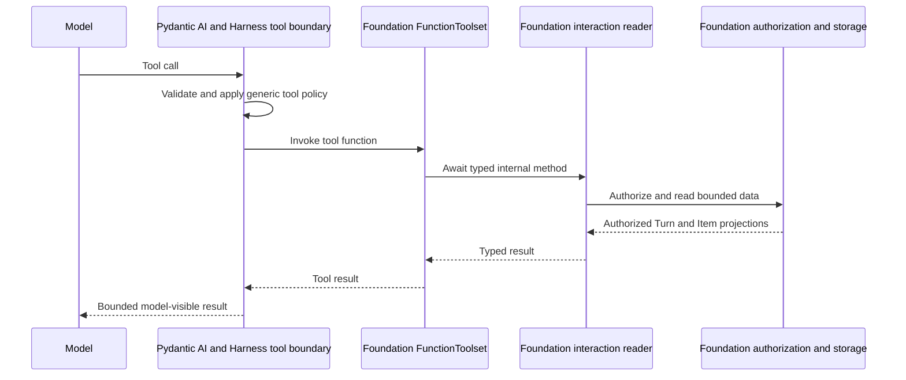

# Agent Interaction History Retrieval

## Design Position

Foundation Service provides an optional `foundation.interaction_read` Capability
for reading authorized interaction history, including other Threads or Sessions.
Foundation owns the policy, plugin, Capability, Toolset, authorization, internal
reader, and storage adapters. It uses existing Harness extension points; Harness
does not import Foundation code or define a Foundation-specific contract.

The Capability is read-only. Its tools call an asynchronous Foundation reader
directly in process, not through the service's HTTP API or SDK. This contract adds
no relational table, object type, lifecycle state, or public route.

## Authority and Data Boundaries

| Data or decision        | Authority                                                                                                                                               |
| ----------------------- | ------------------------------------------------------------------------------------------------------------------------------------------------------- |
| Interaction identity    | The [Platform Interaction Model](../interaction-model.md) defines Session, Thread, Turn, and Item. Their identifiers select data but grant no access.   |
| Thread resource         | [Durable Thread Persistence](24-thread-persistence.md) owns Session membership, origin, version, active Turn, and selected continuation head.           |
| Turn history            | [Durable Turn State](14-turn-persistence.md) owns Turn lineage, status, exact input, and exact output.                                                  |
| Retained Items          | [Lifecycle and Stream Persistence](17-lifecycle-and-stream-persistence.md) owns complete `TurnReplaySnapshot` objects. They are projections, not state. |
| Read access and shaping | The Foundation reader applies current authorization, filters queries, verifies retained objects, and returns a safe bounded projection.                 |

## Definition Policy and Run Grant

An immutable Agent revision can contain this conceptual policy:

```python
class InteractionReadPolicy:
    schema_version: Literal["1"]
    scope: Literal["current_session", "authorized_sessions"]
    content: Literal["turn_summaries", "visible_items"]
    max_page_size: int
    max_snippet_chars: int
    max_item_chars: int
```

Without the policy, the Capability and its tools are absent. The fields set upper
bounds:

- `current_session` allows only the accepted Turn's trusted `session_id`;
- `authorized_sessions` also allows Sessions permitted by current principal and
  product policy;
- `turn_summaries` excludes Items; `visible_items` allows authorized user-visible
  Items;
- run and service limits can reduce numeric limits but cannot increase them.

The definition stores no tenant or user identity, credential, token, or Session
allowlist.

At run start, Foundation creates a process-local grant from:

```text
definition policy
  ∩ trusted Turn restrictions
  ∩ current tenant, principal, product, visibility, archive, and retention policy
  ∩ service limits and run deadline
```

The reader checks current authorization again on every call and page. The grant
and cursors are not access tokens. The grant is never persisted or exposed to the
model.

## Composition and Invocation

The plugin is loaded and called in five steps:

| Step | Action                                                                                                                                                   |
| ---- | -------------------------------------------------------------------------------------------------------------------------------------------------------- |
| 1    | Foundation reconstructs the definition, creates the interaction-read plugin from policy and trusted factories, and adds it to `AgentDefinition.plugins`. |
| 2    | During Agent construction, Harness calls `for_agent()` and `get_capabilities()`. The plugin contributes the interaction-read Capability.                 |
| 3    | Before each run, Harness calls `for_run()`. Foundation creates the run grant and reader and returns them in a fresh bound plugin.                        |
| 4    | The Capability resolves that bound plugin and builds a fixed `FunctionToolset` over its reader.                                                          |
| 5    | Pydantic AI dispatches a model tool call through the Harness tool boundary; the tool function then awaits the reader directly.                           |

Conceptual pseudocode:

```python
# Foundation reconstructs the Agent definition.
plugin = InteractionReadPlugin(policy, authorizer, reader_factory)
definition = AgentDefinition(..., plugins=(*other_plugins, plugin))

# Harness constructs the Agent once.
agent_plugin = plugin.for_agent()
capabilities = agent_plugin.get_capabilities()
agent = Agent.from_spec(
    definition.agent,
    capabilities=(
        *mandatory_harness_capabilities,
        *definition.capabilities,
        *capabilities,
    ),
)

# Harness binds Foundation dependencies for one run.
bound_plugin = await agent_plugin.for_run(run_context)
# After validating all replacements, Harness freezes them in ctx.deps.plugins.

# During Pydantic run binding, the Capability resolves the bound plugin.
plugin = ctx.deps.plugins.require(
    "foundation.interaction_read",
    InteractionReadPlugin,
)
toolset = interaction_read_capability.build_toolset(plugin.reader)

# Every tool is a thin in-process call.
async def read_interaction_turn(args):
    return await plugin.reader.read_turn(args)
```

Capabilities and tool schemas are fixed when the Agent is constructed. Run
binding only supplies the grant and reader for that run. The reader lives in the
bound Foundation plugin, not in custom `RunBindings.capabilities`.



Harness decides whether the tool may run. Foundation separately decides which
interaction data that call may read. Neither decision replaces the other.

## Model Tool Contract

Policy schema version `1` exposes these tools:

| Tool                        | Required semantic data                                                                                                                                  | Source entity and fields                                                                                                                                                                                                                                                                            |
| --------------------------- | ------------------------------------------------------------------------------------------------------------------------------------------------------- | --------------------------------------------------------------------------------------------------------------------------------------------------------------------------------------------------------------------------------------------------------------------------------------------------- |
| `list_interaction_sessions` | A cursor/limit-bounded page of authorized Sessions, ordered by latest Turn activity                                                                     | Authorized `Turn` rows grouped by `session_id`; use Turn status and activity timestamps                                                                                                                                                                                                             |
| `list_interaction_threads`  | A cursor/limit-bounded page of authorized Threads in one selected Session, including recent Turn status and activity                                    | Authorized `Thread` rows filtered by `session_id`; join only the exact `latest_turn_id` for status and activity                                                                                                                                                                                     |
| `search_interaction_turns`  | A cursor/limit-bounded page of Turn references, status, timestamps, and input/output snippets matching a query and optional Session or Thread filter    | Authorized `Turn` rows; search only `input_text` and `output_text`, and return `id`, `session_id`, `thread_id`, status, and timestamps                                                                                                                                                              |
| `list_thread_turns`         | A cursor/limit-bounded page of one selected Thread's Turn lineage, status, timestamps, and input/output snippets, optionally constrained to one Session | Authorized `Turn` rows filtered by `thread_id` and optional `session_id`; use `id`, `parent_turn_id`, status, timestamps, `input_text`, and `output_text`                                                                                                                                           |
| `read_interaction_turn`     | One selected Turn's identity, lineage, status, failure or waiting summary, bounded input/output text, and an optional Item-cursor/limit-bounded page    | The authorized `Turn` row supplies identity, `parent_turn_id`, status, timestamps, failure, pending summary, `input_text`, and `output_text`; verified `TurnReplaySnapshot.items` from the derived `tenants/{tenant_id}/turns/{turn_id}/replay/version-1.json` supplies retained Items when allowed |

None of these tools reads Turn `state.json`, exact input or output bodies, payload
objects, `TurnReplaySnapshot.events`, Redis streams, or object listings.

The FunctionToolset validates each tool's arguments and forwards them to the
run-bound reader. The reader owns authorization, search, pagination, projection,
and replay rules.

## Internal Reader Contract

All tools use the same asynchronous `InteractionHistoryReader`. Its methods
follow these rules:

1. Authorize the target and query scope before filtering, ordering, aggregation,
   pagination, snippet construction, or object selection. Never fetch a broader
   unauthorized result and filter it afterward.
2. Derive Session listings from authorized Turn rows, but read Thread listings
   from authorized durable Thread rows and join only their explicit Turn
   references. Search only bounded Turn `input_text` and `output_text`, with
   Unicode-friendly matching. Do not infer a Thread resource, head, active Turn,
   latest Turn, or state edge from timestamps.
3. Do not read the current unsealed Turn. Other unsealed Turns can appear only as
   status summaries. Return Items only from a complete verified
   `TurnReplaySnapshot`; report unavailable replay instead of reconstructing it.
4. Exclude hidden reasoning, raw provider frames, credentials, Secrets, Turn or
   Capability state, deferred or effect data, audit data, and internal events.
   Bound every page and nested value; replace oversized Item content with a
   marked preview.
5. Bind opaque cursors to the effective scope, filters, order, and policy version,
   and reauthorize each page. A cursor never preserves access after revocation.
6. Open a fresh short relational session for each operation and close it before
   object I/O. For Items, first authorize the Turn and select its replay locator,
   then verify the object's size, digest, content type, metadata, and schema. Keep
   no database session, transaction, object stream, credential, or mutable unit
   of work between calls.

## Failure Semantics

| Failure                                                    | Outcome                                                                                          |
| ---------------------------------------------------------- | ------------------------------------------------------------------------------------------------ |
| The plugin, grant, reader, or required storage cannot bind | The run fails before model work; there is no HTTP fallback or silent tool omission.              |
| A target is absent or unauthorized                         | Return the same bounded not-found-or-forbidden failure without revealing its existence.          |
| Authorization is revoked or unavailable                    | The current call fails closed; dependency failures may be retryable.                             |
| A cursor is invalid or belongs to another scope/query      | Return an invalid-cursor failure; do not restart at the first page.                              |
| Replay is missing, incomplete, corrupt, or unsupported     | Return Turn detail with Items marked unavailable; never return complete-looking partial history. |

Generic argument validation, cancellation, deadlines, redaction, and result-size
failures follow the Harness tool execution contract. Failures expose bounded safe
codes, not storage details, policy rules, principal attributes, raw exceptions,
or cross-tenant existence signals.

## Compatibility and Trade-offs

Policy version `1`, tool names and arguments, and result semantics form one
model-visible compatibility line. Breaking changes require a new policy version
and immutable Agent revision. Additive result fields are compatible only
when readers ignore unknown fields. Internal reader and repository code can
change without a version when observable behavior and authority stay the same.

Direct calls avoid self-HTTP latency, transport authentication, and duplicate
serialization. Each execution role that enables the Capability must therefore
have Foundation authorization and storage dependencies available.

Using existing Turn text and replay objects avoids a new conversation index or
Item table. Search does not cover retained Items or hidden execution data, and
long histories require multiple tool calls.

## Invariants

1. Foundation owns `foundation.interaction_read`; Harness only provides its
   existing extension and tool-execution contracts.
2. Definitions persist only policy. Agent construction adds the Capability, and
   each run binds a fresh grant and reader before tools are materialized.
3. Every tool call crosses the Harness tool boundary and then calls the bound
   Foundation reader in process, never through HTTP, an SDK, or custom
   `RunBindings.capabilities`.
4. The reader reauthorizes every operation and page. Model arguments,
   identifiers, metadata, object keys, and cursors grant no access.
5. Thread rows remain Thread-resource authority, Turn rows remain history
   authority, Items come only from verified replay, and current partial or
   hidden Turn state is never exposed.
6. A bound plugin keeps no open storage resource, credential, or mutable unit of
   work between calls.
7. Every result is read-only, bounded, redacted, cancellation-aware, and explicit
   when retained Items are unavailable.
8. This contract adds no relational table, object type, lifecycle state, or
   public HTTP route.
