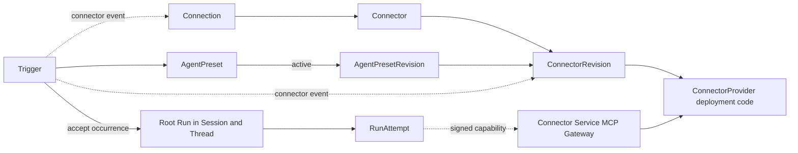
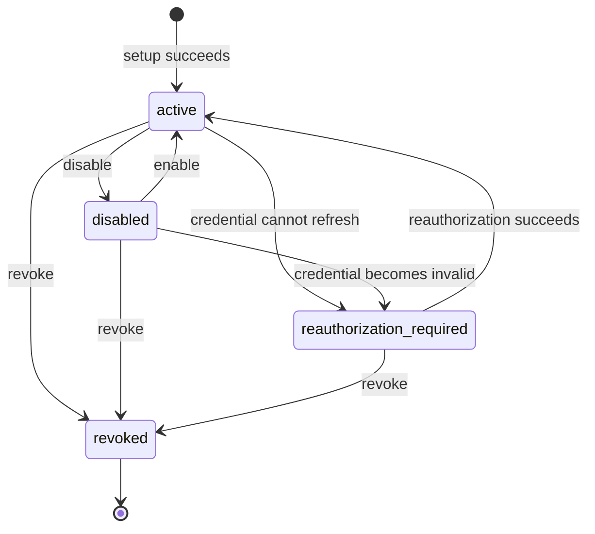
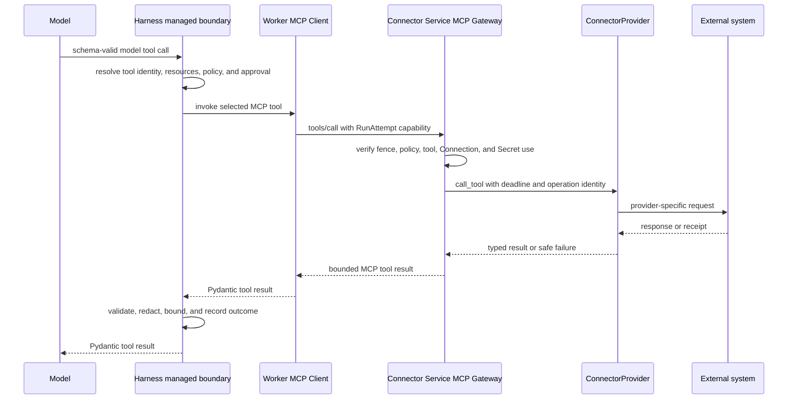
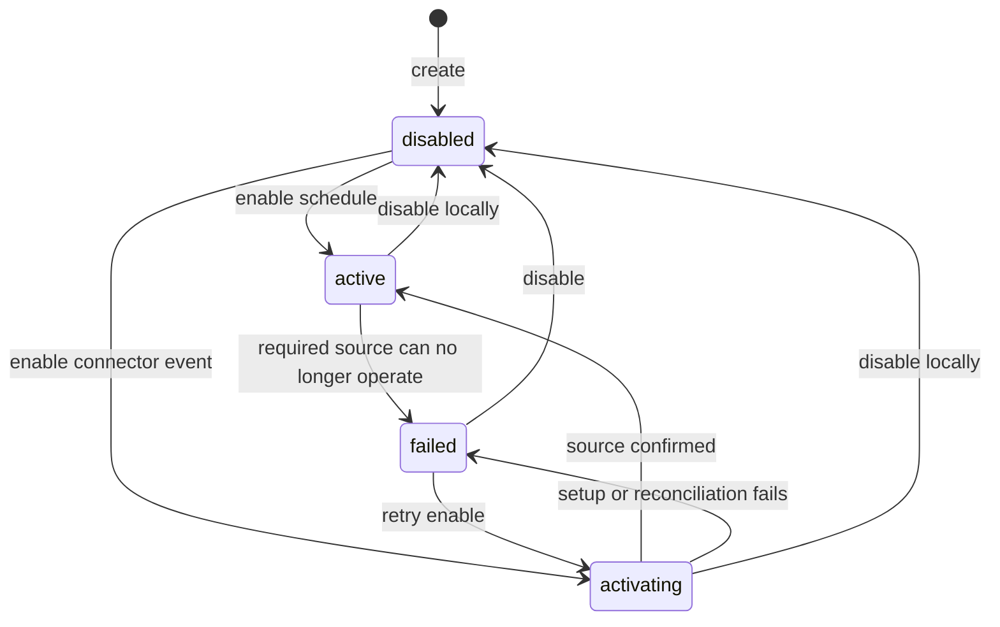

# Connectors, Connections, and Triggers

## Design Position

Foundation owns durable Connector configuration, account authorization, managed
MCP tool projection, and unattended Trigger acceptance without turning provider
code or external event delivery into product authority. A `ConnectorProvider`
is trusted deployment code. `Connector`, `ConnectorRevision`, `Connection`, and
`Trigger` are Foundation-owned Workspace data. `ConnectorRevision`, like
`AgentPresetRevision`, is an independently addressable immutable Revision; the
other three resources have explicit mutable lifecycles.

An AgentPresetRevision selects exact Connector revisions and freezes Provider tool
contracts and semantic locks. Run acceptance applies any typed name-keyed override
and fixes every resolved Connection identity and exact tool contract in the
effective configuration. Each RunAttempt obtains current
authorization and a fenced short-lived Connector capability. The Worker exposes
those tools to Harness through a Foundation-hosted MCP server rather than loading
or calling ConnectorProvider code itself.

A Trigger targets one stable `AgentPreset` and submits each unique schedule or
Connector-event occurrence through the common root [Run
acceptance](34-agent-control-input-and-continuation.md#acceptance-and-lineage)
contract. Acceptance resolves the Preset's then-active Revision and Runtime lock,
stores both on the Run, and selects or creates the Session and root Thread;
Trigger does not own another Agent runtime, queue, or retry lifecycle.

Provider packages are an OSS extension surface. Installing a package makes it
available for discovery, not trusted for import or execution. Deployment trust,
Agent dependency locks, current IAM, run grants, managed Secrets, and provider
compatibility remain independent checks.

## Boundaries

| Concern                                                                                 | Owner                                                                                                                                 | Relationship                                                                                      |
| --------------------------------------------------------------------------------------- | ------------------------------------------------------------------------------------------------------------------------------------- | ------------------------------------------------------------------------------------------------- |
| Provider discovery, metadata, configuration, tools, authorization, and event adaptation | This document                                                                                                                         | Defines the public deployment extension contract                                                  |
| Connector, ConnectorRevision, Connection, and Trigger resources                         | This document                                                                                                                         | Owns identity, fields, lifecycles, and compatibility                                              |
| AgentPreset, AgentPresetRevision, and Runtime lock                                      | [Agent Management](12-agent-management.md)                                                                                            | Select a stable invocation target and freeze exact executable content                             |
| Tool composition, schema validation, managed authorization, and result safety           | [Harness Tool Execution](../agent-harness/07-tool-execution.md)                                                                       | Harness consumes MCP tools through native Pydantic composition and its managed execution boundary |
| Connector MCP transport, Provider execution, and event ingress                          | This document and [Runtime](01-runtime-configuration-and-deployment.md)                                                               | The Connector Service owns the `connector` data-plane role                                        |
| Principal, RoleBinding, and built-in role mapping                                       | [Foundation IAM](10-identity-and-access-management.md)                                                                                | Reauthorizes management, Trigger acceptance, and every RunAttempt                                 |
| Connector product actions and run-grant requirements                                    | This document                                                                                                                         | Defines resource-specific authority checked through Foundation IAM                                |
| Secret encryption and owner lifecycle                                                   | [Secret Management](11-secret-management.md)                                                                                          | Stores Connection and Trigger credential material without public plaintext reads                  |
| Session, Thread, Run, and RunAttempt lifecycle                                          | [Interactions, Runs, and Attempts](13-interactions-runs-and-attempts.md)                                                              | Runs Trigger and interactive work through the same accepted lifecycle                             |
| Thread creation and versioned advancement                                               | [Durable Thread Persistence](24-thread-persistence.md)                                                                                | Commits an independent Thread row with the accepted root Run                                      |
| Run selections and durable Trigger correlation                                          | [Durable Run State](14-run-persistence.md)                                                                                            | Persists immutable acceptance facts reused by replacement RunAttempts                             |
| Lifecycle publication and outbound delivery                                             | [Lifecycle and Stream Persistence](17-lifecycle-and-stream-persistence.md) and [Events and Delivery](20-events-usage-and-delivery.md) | Publishes committed resource and Run facts independently from inbound events                      |
| Management route catalog and shared HTTP behavior                                       | [Management API](21-management-api.md) and [HTTP Ingress](05-http-ingress-and-request-contract.md)                                    | Management stays under `/api/v1`; MCP and Connector event ingress use the Connector Service       |

The Connector domain has exactly four core concepts:



`ConnectorProvider` is not a database resource. `Trigger` is a separate
Foundation domain resource and does not become a fifth Connector concept. Inline
Agent Connector declarations, transient Connection setup records, provider event
state, occurrence deduplication, and resolved Run selections are not
independently addressable product resources.

## Provider Trust and Discovery

The Connector Service discovers Connector providers only from the Python entry-point group
`a13n_service.connector_providers`. The entry-point name is the stable
`provider_key`; the loaded object does not repeat that key. Foundation performs
no filesystem scan, ambient module import, remote code download, or API-driven
package installation.

Discovery does not grant trust. Deployment configuration selects each permitted
`provider_key` together with its exact trusted distribution or artifact identity.
Connector or all-in-one startup enumerates entry-point metadata without importing
unselected targets, matches selected keys to their trusted artifacts, and imports
only exact matches. An absent selected provider, duplicate selected key, artifact
mismatch, or selected provider import or initialization failure prevents that
process from becoming ready. Control and Worker processes never import
ConnectorProvider code. Unselected entry points are ignored and never imported.

Connector and Trigger APIs cannot install, upgrade, remove, enable, or upload
Provider code. Adding or replacing a provider requires changing the deployment
artifact and trust selection and restarting the service; hot loading is not part
of the contract. Repository, operating-system, image, and deployment permissions
remain the code-installation boundary and create no new Foundation role.

A historical ConnectorRevision can name a `provider_key` not selected by the
current deployment. The service remains available, but authoring or execution
that requires the revision fails explicitly as `provider_unavailable` or
`provider_not_trusted`; Foundation never substitutes a similarly named or newer
Provider. AgentPresetRevisions additionally lock the Provider's semantic
`contract_version` used to interpret their tool selections. The deployment image and
package lock own the exact installed distribution; durable Agent data does not
retain wheel, module, or class identity. A replacement artifact reconstructs a
retained declaration only when it exposes the same `provider_key` and
`contract_version`.

Python dependency resolution and artifact construction occur before service
startup. Foundation does not resolve conflicting package requirements at runtime.

## Provider Metadata and Capabilities

One loaded Provider supplies deterministic, bounded, non-secret metadata through
code rather than a second manifest. Its metadata includes:

- a display name and description;
- one semantic `contract_version` for reconstructing frozen Agent declarations;
- supported `provider_config_version` values and JSON Schemas for Connector
  configuration;
- whether it implements `tools`, `connections`, and `events`;
- supported Connection setup modes and their write-only input descriptions; and
- `webhook` or `polling` delivery when events are supported.

Metadata reads perform no external I/O. Secret fields never appear in ordinary
Connector configuration schemas. Every schema, configuration object, provider
state object, tool declaration, argument, result, and event payload is subject to
Foundation hard bounds for size, depth, count, and time.

The public extension contract has a small base `ConnectorProvider` containing
metadata and `validate_config`. Optional runtime-checkable capability protocols
add tool, Connection, and event operations. A Provider implements only the
protocols it advertises; metadata and structural capability checks must agree at
startup. The following names describe the stable responsibilities; concrete
Python value classes remain typed process-local values rather than durable
resources:

| Capability    | Provider operations                                                                                                                                                              | Required semantics                                                                                |
| ------------- | -------------------------------------------------------------------------------------------------------------------------------------------------------------------------------- | ------------------------------------------------------------------------------------------------- |
| Configuration | `validate_config`                                                                                                                                                                | Local deterministic validation for an exact provider config version; no external I/O              |
| Tools         | `list_tools`, `call_tool`                                                                                                                                                        | Discover complete managed definitions and dispatch one selected provider tool asynchronously      |
| Connections   | `connection_spec`, `start_connection`, `complete_connection`, `refresh_connection`, `revoke_connection`, `validate_connection`                                                   | Describe setup, return internal credential material, and validate local revision compatibility    |
| Events        | `list_events`, `validate_event_config`, `start_event_source`, `stop_event_source`, `renew_event_source`, `reconcile_event_source`, and the declared webhook or polling operation | Adapt external event contracts while preserving stable occurrence identity and operation evidence |

`validate_config`, `validate_connection`, and `validate_event_config` are local and
perform no external I/O. Effectful methods are asynchronous, receive a bounded
Foundation context with a stable operation identity and deadline, and return
typed safe material or failures. A Provider registers no HTTP route, writes no
Foundation database row, reads no arbitrary Secret, and returns no credential to
a public API.

A normal Provider calls its external system directly from the Connector Service.
The Connector MCP Gateway is the single Foundation MCP server boundary and calls
the Provider's `list_tools` and `call_tool` operations directly. A Provider does
not register an MCP or HTTP route. The built-in general MCP Provider follows the
same contract but delegates discovery and calls to an external MCP server.

## Connector and ConnectorRevision

The conceptual durable schemas are not wire or ORM models:

```python
class Connector:
    id: ConnectorId
    organization_id: OrganizationId
    workspace_id: WorkspaceId
    name: str
    description: str | None
    enabled: bool
    version: int
    created_by: PrincipalRef
    created_at: datetime
    updated_at: datetime


class ConnectorRevision:
    id: ConnectorRevisionId
    organization_id: OrganizationId
    workspace_id: WorkspaceId
    connector_id: ConnectorId
    version: int
    provider_key: str
    provider_config_version: str
    config: BoundedJsonObject
    created_by: PrincipalRef
    created_at: datetime
```

Connector is the stable authorization, display, and global enablement resource.
Its mutable `name`, `description`, and `enabled` fields use
`expected_version`. Its `version` protects those mutable fields and is not
configuration history. A disabled Connector denies new tool calls, Connection
setup, event acceptance, and Trigger activation without rewriting retained
revisions or AgentPresetRevisions.

ConnectorRevision is immutable. Its `version` begins at `1` and increases
monotonically within one Connector. Creation asks the Connector Service to
validate the exact Provider and config version before Control commits the
revision; Control does not import Provider code. An exact semantic no-op creates
no new revision.
Restoring old configuration copies it into a higher version rather than moving a
current pointer. The revision contains no Secret, Connection, frozen tool contract,
Python target, package version, or mutable Connector metadata.

Provider selection may change in a later ConnectorRevision. Existing Connections
remain associated with their immutable `provider_key` and are incompatible by
default; they require reauthorization or an explicit Provider migration. Retained
AgentPresetRevisions continue selecting their original ConnectorRevision and never
adopt the newer Provider implicitly.

Connector creation atomically creates the stable resource and version `1`.
Individual revisions cannot be patched or deleted. A Connector can be deleted
only when no AgentPresetRevision or Trigger selects any of its revisions and it owns no
Connection. Deletion removes its otherwise unreferenced revisions; deployed or
historically referenced Connectors are disabled instead.

Preinstalled and API-created Connectors use the same resources and invariants.
Their origin does not create `built_in` or `custom` resource kinds.

## Connection

A Connection represents one external account authorization for a Connector. It
does not select tools or bind one ConnectorRevision.

```python
class ConnectionAccount:
    external_id: str
    display_name: str


class Connection:
    id: ConnectionId
    organization_id: OrganizationId
    workspace_id: WorkspaceId
    connector_id: ConnectorId
    principal_ref: PrincipalRef | None
    name: str
    provider_key: str
    provider_state_version: str
    provider_state: BoundedJsonObject
    account: ConnectionAccount
    status: Literal[
        "active",
        "disabled",
        "reauthorization_required",
        "revoked",
    ]
    expires_at: datetime | None
    version: int
    created_by: PrincipalRef
    created_at: datetime
    updated_at: datetime
```

A non-null `principal_ref` makes the Connection personal to that current User or
Service Account. A null value makes it Workspace-shared. This reuses IAM
Principals and introduces no Connection-owner role. Personal Connection use
requires exact Principal equality; shared Connection use requires current
Workspace authority plus the applicable invocation authority. Agent work uses
its run grants; direct standard MCP work uses `connector.invoke`. An owner
reference or account display value never grants credential use.

`provider_key`, owner, tenant, and Connector identity are immutable. Moving a
Connection between Principals or between personal and shared ownership requires
revocation and a new Connection. `provider_state` is bounded Provider-defined
non-secret account state, interpreted under `provider_state_version`; account and
installation identifiers belong there. OAuth tokens, API keys, passwords,
cookies, and signing values are managed Secrets owned by the Connection.

The lifecycle is:



`active` means eligible for a current attempt, not continuously healthy. A
refreshable access-token expiry does not change status. A transient refresh or
upstream failure fails the current operation and leaves the status active; a
definitive invalid grant moves it to `reauthorization_required`. `disabled` is
reversible and retains credential material. `revoked` is terminal.

Connection setup is a Foundation-owned expiring operation, not a product
resource. It binds the initiating Principal, Workspace, ConnectorRevision,
Provider, OAuth state, PKCE state, callback correlation, and idempotency evidence.
Sensitive provisional values are encrypted, the setup can complete successfully
once, and callback replay cannot create a second Connection. Manual input is
write-only. Foundation creates the Connection and its initial Secrets as one
complete local result only after setup succeeds; it never commits an active
Connection missing required credential material.

Control owns the setup operation, OAuth `state` validation, replay protection,
Connection state transition, and Managed Secret persistence. The public OAuth
callback terminates at Control because it is a low-frequency management
lifecycle transition rather than Connector tool or event data-plane traffic.
Control invokes the Connector Service over an authenticated internal boundary to
run Provider-specific `start_connection` and `complete_connection` behavior,
including authorization-URL construction, authorization-code exchange, and
normalization of the resulting account and credential material. Control does not
load the Provider, and the Worker does not participate in setup.

Every effectful setup step has a Foundation-owned stable operation identity.
`complete_connection` uses an identity derived from the setup operation rather
than from an individual HTTP request. Foundation commits `completing` before the
external call; after a process loss, recovery replays that same operation identity
and the Provider must return or recover the same external result. It never starts
a second authorization because a callback response was lost. No relational
session or transaction spans the internal Connector Service call or external
OAuth exchange. Authorization codes, tokens, and other credential material never
enter ordinary logs, audit payloads, traces, or errors.

Reauthorization updates the same `reauthorization_required` Connection. A revoked
Connection is never reused. Credential refresh replaces Connection-owned Secret
values without advancing Connection `version` when no public Connection field
changes; a provider-state, account, expiry, or status change advances it once.

Revocation attempts the external issuer operation and commits terminal local
`revoked` regardless of external success, failure, or unknown result. On confirmed
success Foundation deletes Connection-owned Secret ciphertext in that commit. On
failure or an unknown result, it retains the encrypted credential material only
for bounded external-cleanup reconciliation under the original stable operation
identity; the revoked Connection cannot expose or use it for any Connector
operation. Successful reconciliation deletes the retained material. External
uncertainty never restores local authority.

At use time Foundation checks the exact Connector, current Connection status,
Principal eligibility, Provider key, provider-state version, selected
ConnectorRevision configuration, applicable product authorization, and Secret
eligibility. Agent work additionally checks its run grants; standard MCP work
checks `connector.invoke`. The Provider performs only its local
provider-specific compatibility check. No layer silently chooses another
Connection.

## Agent Connector Declarations

Agent authoring discovers Provider tools through the Connector Service for one
ConnectorRevision and, only when discovery itself requires authentication, one
explicitly chosen Connection. The client selects returned Provider tool names;
it cannot submit replacement schemas or policy metadata. Discovery Connection
use is authorized but does not implicitly bind that Connection into the
AgentPresetRevision.

`AgentPresetConfig.connectors` is a map keyed by a stable local name rather than a ConnectorBinding resource. The conceptual authoring shape is:

```python
class ConnectorSelection:
    connector_revision_id: ConnectorRevisionId
    connection_id: ConnectionId | None
    tools: tuple[str, ...] | None


class ConnectorProviderContractLock:
    provider_key: str
    contract_version: str
```

An explicit `tools` tuple is a non-empty unique allowlist of Provider tool names. Publish calls `list_tools` through the Connector Service and rejects an unknown name. `tools=None` means all tools returned by the compatible Provider during Publish. The resulting AgentPresetRevision freezes the exact tool names, descriptions, JSON Schemas, effects, output policy, and Provider contract lock required to reconstruct the surface.

The Provider contract lock makes the selected definitions interpretable under one semantic contract. A compatible Provider can change its current catalog without mutating a retained AgentPresetRevision. Adopting another tool or schema requires another Publish or a typed Run override. Final visible-name and schema compatibility are validated through native Pydantic MCP composition before the first model request.

## Connection Selection and RunAttempt Preparation

The Connector-owned immutable Run facts are conceptual serializable values:

```python
class ConnectorRunSelection:
    name: str
    connector_revision_id: ConnectorRevisionId
    connection_id: ConnectionId | None
    tools: tuple[FrozenConnectorTool, ...]
    provider_lock: ConnectorProviderContractLock
    sensitive_binding_keys: tuple[str, ...]


class AcceptedTriggerSource:
    trigger_id: TriggerId
    trigger_version: int
    source_kind: Literal["schedule", "connector_event"]
    occurrence_key: str
```

`name` binds the selection to the stable local Connector name in the accepted effective Agent configuration. `tools` is the exact non-empty frozen Provider tool contract available for the Run. `occurrence_key` is the canonical bounded schedule or Provider-event uniqueness value. These values are protected acceptance metadata, not independent resources. The Run persistence contract owns their durable placement and immutability.

An Agent Connector declaration can pin a Connection. The exact Run authority Principal
must remain eligible to use it; pinning a personal Connection does not grant
another Principal access. When no Connection is pinned and the Provider requires
one, Run acceptance resolves in this order:

1. exactly one active, compatible personal Connection owned by the invoking
   Principal;
2. when none exists, exactly one active, compatible Workspace-shared Connection.

Zero candidates fail as `connection_required`; several candidates at the selected level fail as `connection_ambiguous`. A connectionless declaration rejects a Connection.

A typed Run override patches Connector entries by stable local name. It can replace a Connection binding while reusing the base Revision's frozen tool contract, or select another ConnectorRevision or tool allowlist and rerun discovery before acceptance. A name mapped to null deletes the entry; an explicit null map clears all entries. The caller may add an authorized Connector not present in the base Revision.

`ConnectorOverride.headers` is accepted only when the trusted Provider's typed override schema declares runtime headers. Header names are bounded and schema-validated; values are sensitive and move into the encrypted Run payload rather than ordinary configuration or reads.

Before its final acceptance transaction, Foundation verifies every frozen or newly discovered Provider contract and resolves the final Connection. Provider I/O holds no relational session or transaction. The final short transaction rechecks the accepted Preset Revision, Connector, Connection, and authorization conditions and freezes one `ConnectorRunSelection` per name inside `EffectiveAgentConfig.connectors`.

Replacement RunAttempts reuse those selections and never choose a substitute account or recalculate the tool catalog. An explicit successor Run inherits its selected Revision unless its typed override changes the Connector map.

Every RunAttempt validates the complete AgentPresetRevision and Run selections
before the first model request:

- each exact ConnectorRevision and Provider lock remains reconstructable;
- every Connector remains enabled;
- every resolved Connection remains currently authorized, active, Provider- and
  revision-compatible, and eligible for fresh Secret use; and
- every effective tool remains available under the exact Provider contract.

One failure rejects the RunAttempt before the first model request. Foundation does
not omit an unavailable Connector and run a smaller tool surface because that
would change the meaning of the selected AgentPresetRevision.

## RunAttempt Connector Capability

For each declaration, Foundation signs one short-lived Connector capability for
the current RunAttempt. It is a transport credential derived from existing
durable facts, not a database resource, Product API resource, Binding, or new
lifecycle. Its claims include:

```text
workspace_id
connector_id
connector_revision_id
connection_id or connectionless marker
agent_preset_revision_id
run_id
run_attempt_id
attempt_fence
  connector_name
  effective_tool_names
provider_contract_version
expires_at
```

The Worker cannot choose or replace those claims. It supplies the capability as
`Authorization: Bearer <signed-connector-capability>` through the MCP client's
dynamic header boundary. The Connector Service verifies signature, expiry,
tenant and path identity, current RunAttempt ownership, attempt fence, current
resource state, and exact allowed tool on every request. A URL or model argument
never carries the capability.

A replacement RunAttempt receives a newly signed capability over the same
Run selections. Its new Attempt ID and fence invalidate every old capability,
so a stale Worker cannot resume Connector side effects. The durable Run,
ConnectorRunSelection, RunAttempt generation, and fence remain authority; no
MCP session or capability registry replaces them.

## MCP Tool Projection and Dispatch

The Worker reconstructs one local MCP Client capability for each Agent Connector
declaration, using the logical Connector server URL, `native=False`,
`local=True`, and the RunAttempt-scoped authorization header. The Harness runs
the MCP Client in the Worker process through native Pydantic composition; the
Worker never imports or calls ConnectorProvider code.

The Connector Service hosts one stateless Streamable HTTP MCP Gateway for many
logical Connector servers. One stable Connector ID selects one logical server;
the signed capability selects the exact ConnectorRevision, Connection, Run,
Attempt, and effective tools. The Gateway implements `initialize`, `tools/list`,
and `tools/call`. It provides neither `stdio` nor the legacy SSE transport and
does not persist `Mcp-Session-Id` as Foundation execution identity.

For `tools/list`, the Gateway resolves the exact Provider, calls
`Provider.list_tools`, verifies the locked contract, filters the result to
the frozen effective tool contract, verifies that the Provider remains compatible, and returns those definitions. For `tools/call`, it additionally validates the selected name and
arguments, materializes the exact Connection Secret only after authorization,
and calls `Provider.call_tool` under bounded deadline, input, output, and
structure limits.



Immediately before dispatch, the Connector Service checks current policy,
Connector state, Connection state, Provider compatibility, credential
eligibility, Attempt ownership, and fence again. Credential material is resolved
only after schema validation and authorization and is absent from the
AgentPresetRevision, model arguments, `HarnessState`, ordinary events, logs, and
traces. Provider external I/O spans no database session or transaction;
Foundation uses separate short reads and fenced writes around it.

Provider availability, Connector disablement, Connection ineligibility, lock
incompatibility, or surface mismatch before the first model request is a
RunAttempt failure.
An upstream timeout, rate limit, transient refresh failure, externally removed
tool, invalid provider result, or call-time compatibility loss is one explicit
tool failure that the Agent may handle. `initialize` and `tools/list` can retry
only while they remain side-effect free. `tools/call` is not automatically
retried because an external side effect can succeed before its response is lost.
Cancellation propagates best effort without claiming rollback.

## Standard MCP Client Surface

The same Connector Service also supports standard Streamable HTTP MCP Clients
such as developer tools and desktop applications:

```text
Harness MCP Client
  POST /internal/mcp/connectors/{connector_id}
  Authorization: Bearer <RunAttempt capability>

Standard MCP Client
  POST /mcp/connectors/{connector_id}
  Authorization: Bearer <Personal or Service Account API Key>
  X-Foundation-Connection-Id: <optional exact connection>
```

The standard surface authenticates the existing Workspace-bound API Key as its
User or Service Account Principal and authorizes `connector.invoke` from current
RoleBindings on every request. Workspace `runner`, `builder`, and `admin` include
that action; `viewer` does not. An AgentPreset-scoped Runner binding authorizes
only that AgentPreset and does not grant direct Workspace Connector invocation.
Foundation adds no Connector-specific permission toggle to the API Key.

This surface uses the Connector's highest current ConnectorRevision and the
Provider's current compatible tool catalog; it has no AgentPreset, Run, or
RunAttempt selection. An optional `X-Foundation-Connection-Id` selects one exact
currently eligible Connection. Without it, Foundation selects exactly one
eligible personal Connection, otherwise exactly one eligible Workspace-shared
Connection; absence or ambiguity fails explicitly. A caller-supplied subject
header cannot replace the API Key Principal.

Standard MCP invocation is subject to bounded security audit and operational
telemetry but creates no Session, Thread, Run, RunAttempt, Harness
`UsageRecord`, MCPClient, MCPBinding, or durable MCP session resource. Both MCP
surfaces share Provider routing, Connection Secret, policy, result limits, error
mapping, and audit behavior. Foundation exposes no parallel JSON
`call_connector_tool` route.

## Trigger Model

A Trigger is a mutable Workspace resource with one stable Preset target and one typed
source:

```python
class Trigger:
    id: TriggerId
    organization_id: OrganizationId
    workspace_id: WorkspaceId
    name: str
    description: str | None
    principal_ref: PrincipalRef
    agent_preset_id: AgentPresetId
    source: ScheduleTriggerSource | ConnectorEventTriggerSource
    input_template: BoundedJsonObject
    provider_state_version: str | None
    provider_state: BoundedJsonObject | None
    status: Literal["disabled", "activating", "active", "failed"]
    status_reason: str | None
    version: int
    created_by: PrincipalRef
    created_at: datetime
    updated_at: datetime


class ScheduleTriggerSource:
    kind: Literal["schedule"]
    type: Literal["cron", "interval"]
    expression: str | None
    timezone: str | None
    interval_seconds: int | None


class ConnectorEventTriggerSource:
    kind: Literal["connector_event"]
    connector_revision_id: ConnectorRevisionId
    connection_id: ConnectionId
    event_type: str
    provider_event_config_version: str
    config: BoundedJsonObject
```

`principal_ref` is the existing User or Service Account whose current authority
is evaluated for each occurrence. It is not the external webhook sender. The
creating caller can bind only itself as a User; a Workspace Admin can instead
bind an eligible Service Account and cannot bind another User. The target is one
stable AgentPreset. Each firing resolves that Preset's current active Revision
during durable Run acceptance; it never reads mutable config or accepts a
caller-selected historical Revision. The Connector-event Connection is exact because an
unattended Trigger cannot choose an account interactively. It authorizes event
ingress only and does not override the resolved AgentPresetRevision's tool Connections.

A cron schedule has exactly five fields and an explicit IANA time zone. An
interval uses a positive integer `interval_seconds` and no cron or time-zone
fields. Deployment policy imposes a finite minimum interval. Schedule evaluation
uses UTC instants while retaining the selected IANA zone for cron meaning.

The Trigger has no immutable TriggerRevision. A successful occurrence acceptance
stores the exact Trigger ID and version, target AgentPreset ID, resolved active
AgentPresetRevision, occurrence identity, expanded input, and resolved Connector
selections with its root Run. Updating the Trigger or publishing another Preset
Revision cannot alter that retained work.

## Trigger Lifecycle and Event Sources

Every Trigger is created disabled. Behavior-changing fields, including source,
Principal, AgentPreset, and input template, can be changed only while disabled
and require `expected_version`; name and description can change in any
non-deleted state.



For a schedule, enablement commits active schedule state without external I/O. For
a Connector event, Foundation commits `activating` and a stable operation identity
before Control invokes the Connector Service. The Service calls the Provider to
register its Connector event endpoint or start polling and returns bounded
non-secret source material plus Secret values. Control commits safe Provider
state and Trigger-owned encrypted Secrets before marking the Trigger active.

Event-source create, renew, and stop operations use stable identities. Providers
pass them to external idempotency facilities or use them to inspect exact external
state. A lost response is reconciled through `reconcile_event_source`; Foundation
does not blindly create another subscription. An unresolved outcome leaves the
Trigger non-active with a safe reason.

Disablement first commits local `disabled`, which immediately prevents schedule
claims and event acceptance, then performs bounded external cleanup. Cleanup
failure or uncertainty cannot reactivate local ingress and remains reconcilable.
A disabled Trigger can be deleted only when no Run was accepted from it and
no source cleanup is unresolved. Otherwise it remains as retained historical
metadata.

Trigger status describes source admission, not the health or outcome of prior
Runs. Agent failures do not change Trigger status. A `status_reason` is a
bounded stable code and never contains a Provider payload, signature, credential,
or traceback.

Connector-event provider state is owned by the Trigger and interpreted under a
Provider-defined state version. It is not caller-mutable or a public
EventSubscription resource. Event callback signing values and polling credentials
are Trigger-owned managed Secrets. Tool-only Providers implement no event methods.

## Trigger Input and Occurrence Acceptance

The Trigger input template is a bounded JSON object. A placeholder can replace a
complete JSON value; string interpolation, Jinja, JSONPath, executable code, and
arbitrary expressions are not supported. Connector-event templates can select
`{{ event }}`, `{{ event.data }}`, `{{ event.type }}`, or
`{{ event.occurred_at }}`. Schedule templates can select `{{ scheduled_at }}`.

Foundation compiles the template at Trigger creation or update and validates the
possible expanded structure against the target Preset's current active Revision
[`ProtocolConfig.input_data_schema`](12-agent-management.md#protocol-configuration)
when present. At occurrence acceptance it resolves the then-active
AgentPresetRevision and Runtime lock, revalidates the bounded expanded value
against that frozen optional schema, and constructs an `AgentInput` with empty
`content` and that value in `structured_content`. Provider event data is
untrusted Agent input and cannot add a content block, binary source, delivery
preference, tool, Connection, Secret, Principal, policy, or run grant.

Each Provider-normalized event contains a stable external `event_id`, type,
optional occurrence time, receipt time, and bounded data. The Connector Service
bounds webhook body and headers before Provider-specific signature verification,
or invokes the Provider's bounded polling operation. It then submits only the
verified normalized occurrence to Control's internal Trigger acceptance boundary.
Polling advances safe Provider cursor state only after Control acknowledges a
bounded page; event identities make a repeated page safe after a crash.

Occurrence uniqueness is:

- `(trigger_id, provider_event_id)` for a Connector event; and
- `(trigger_id, scheduled_for)` for a schedule.

Control occurrence handling invokes the common root Run acceptance operation. It
validates and publishes the initial root state, then its short acceptance
transaction rechecks Trigger state, current Principal and stable Preset
authorization, resolves the exact active Preset Revision and profile-selected Runtime lock, verifies
Provider and Connection eligibility and Agent Connector resolution, and checks the
unique occurrence key. That transaction commits the versioned root Thread row,
root Run, Session relationship, exact Preset Revision and Runtime lock, resolved
Connection selections, Trigger source metadata, lifecycle events, and outbox
intents. A duplicate returns the prior
Run receipt or a successful webhook acknowledgement and creates no second
Thread or Run.

Connector Service ingress is at-least-once and Control Run acceptance is
at-most-once for one
unique occurrence. Neither claim makes model, tool, or external side effects
exactly once. If downtime spans several schedule instants, Foundation accepts only
the latest missed instant and advances to the next future instant; it does not
create an unbounded catch-up burst.

Each occurrence creates an independent root Run through the common Session and
Thread allocation policy. It does not implicitly continue a prior Trigger Run
or share its model history. Trigger does not add parallel, drop, or serialize
modes; the Agent workload, Workspace admission, and common Worker claim policy
own concurrency and queueing. A Trigger occurrence is not a separate public
TriggerActivation resource, and its Provider source is not a separate public
EventSubscription.

The signed webhook request authenticates the external source only. Connector
Service authentication to Control authorizes only submission of the verified
occurrence and cannot create a Run by possession of a Trigger ID. Before
acceptance, Control reauthorizes the Trigger's stored Principal for the stable
AgentPreset, ConnectorRevision, Connection, and required Secret use. The
accepted Run copies that exact `principal_ref` into its immutable
`authority_principal`; neither the external sender nor Connector Service becomes
the Run Principal. Revoked authority, disabled resources, absent Provider
compatibility, or ambiguous resolved Agent Connections fail closed and create
no partially authorized Run.

## Management and Ingress Surfaces

The [Management API](21-management-api.md) owns exact `/api/v1` resource,
command, discovery, and OAuth callback paths. This document owns the standard
and internal MCP paths and the Connector event ingress boundary. The Connector
contract exposes these management operation groups:

- read-only trusted Provider catalog and Provider metadata;
- atomic Connector plus initial-revision create, Connector reads and metadata
  update, constrained delete, and immutable revision create/read;
- explicit tool and event discovery for one ConnectorRevision and authorized
  optional Connection;
- Connection setup, metadata reads, rename, disable, enable, refresh,
  reauthorize, and terminal revoke; and
- Trigger create/read/update/delete plus enable and disable commands.

The stable product actions are:

| Action                | Meaning                                                                         |
| --------------------- | ------------------------------------------------------------------------------- |
| `connector.read`      | Read safe Provider catalog, Connector, revision, and tool metadata              |
| `connector.create`    | Create a Workspace Connector and its first revision                             |
| `connector.configure` | Create another immutable revision or change stable Connector lifecycle metadata |
| `connector.invoke`    | Invoke a Connector directly through the standard MCP surface                    |
| `connection.read`     | Read a safe eligible Connection projection                                      |
| `connection.manage`   | Establish, refresh, disable, reauthorize, or revoke an eligible Connection      |
| `trigger.read`        | Read safe Trigger configuration and lifecycle status                            |
| `trigger.configure`   | Create, update, enable, disable, reconcile, or delete a Trigger                 |

Model-triggerable Connector work additionally requires the run grants
`connector.use`, `secret.use`, and `tool.call`. Each grant names the selected
resource and allowed operation; no role name enters Harness. Effective authority
intersects the accepted AgentPresetRevision, resolved Connection, current Run authority Principal and
RoleBindings, current resource status, and current grants. Trigger acceptance
performs the same invocation authorization for its stored Principal before
accepting a Run.

Standard MCP Client work is not Agent work and uses no run grant. It requires
`connector.invoke`, current Connector and Connection eligibility, exact API Key
credential boundary, and current Principal authorization. Possession of an API
Key, Connector ID, or Connection ID alone grants nothing.

Creates and stateful commands accept the shared idempotency contract. Mutable
resource changes use `expected_version`. Collection reads are bounded,
deterministically ordered, cursor-paginated, and reauthorized. Public responses
expose safe account, status, compatibility, and Provider metadata but no Secret,
raw Provider state, OAuth callback value, webhook signature, or unredacted
Provider error.

Connection OAuth callback and Connector-event webhook ingress are bounded
external protocol endpoints, not alternate management APIs. Control receives the
OAuth callback under `/api/v1` and validates the exact expiring setup state before
asking the Connector Service to complete Provider-specific exchange. The
Connector Service receives webhook or polling data, verifies and normalizes it,
then submits one occurrence to Control's internal acceptance boundary. A callback
or webhook URL, Trigger ID, delivery ID, cursor, or setup ID grants no authority
by possession. Webhook success means the occurrence was durably accepted or
already known; it does not wait for the Run or Agent to finish.

## Failure Semantics

| Failure                                                                              | Observable outcome                                                                    | Retry or reconciliation                                                                           |
| ------------------------------------------------------------------------------------ | ------------------------------------------------------------------------------------- | ------------------------------------------------------------------------------------------------- |
| Provider package is installed but not trusted                                        | Provider is not imported; resource operation fails safely                             | Deployment explicitly selects the exact artifact and restarts                                     |
| Selected Provider fails import or trusted artifact verification                      | Service does not become ready                                                         | Repair the deployment; no runtime fallback is selected                                            |
| Connector Service is unavailable or incompatible                                     | MCP, setup, discovery, or Connector-event operation fails closed                      | Restore a compatible ready Connector Service; Control and Worker do not load the Provider locally |
| Historical revision names an unavailable Provider                                    | Authoring or RunAttempt fails `provider_unavailable` before use                       | Restore an explicitly compatible trusted Provider or select a new revision for new work           |
| Provider rejects config or state compatibility                                       | Revision, Connection, Trigger, or RunAttempt operation fails without reinterpretation | Caller supplies valid configuration or creates a compatible immutable revision                    |
| Connection is absent or ambiguous at Run acceptance                                  | No Run is accepted                                                                    | Caller changes the Preset or supplies an authorized typed Connector override                      |
| Selected Connection later becomes disabled, revoked, unauthorized, or incompatible   | RunAttempt fails before Harness entry or a call fails before dispatch                 | Restore the same eligible Connection when reversible; no substitute is chosen                     |
| Transient credential refresh or upstream failure                                     | Current tool or Trigger operation fails safely; Connection remains active             | Retry only under the owning idempotency and deadline policy                                       |
| Credential cannot refresh definitively                                               | Connection becomes `reauthorization_required`                                         | Complete reauthorization for the same Connection                                                  |
| Provider tool times out, rate-limits, disappears, or returns invalid data            | One bounded managed tool failure reaches the Agent                                    | Agent or Host policy decides whether another explicit call is safe                                |
| RunAttempt capability is expired, malformed, stale, or fenced out                    | MCP request is rejected before Provider dispatch                                      | The current Attempt obtains or uses its own valid capability; the old Worker cannot retry         |
| `tools/call` response is lost after possible Provider side effect                    | Tool outcome is unknown and is not automatically replayed                             | Agent or caller reconciles external state before another explicit call                            |
| Connector is disabled                                                                | New setup, tool dispatch, event acceptance, and Trigger activation fail closed        | Re-enable the same Connector through authorized CAS mutation                                      |
| Event signature or normalized payload is invalid                                     | No occurrence or Run is committed; safe ingress rejection is recorded operationally   | Sender corrects the request; Foundation never logs the raw payload or signature                   |
| Event-source operation outcome is unknown                                            | Trigger remains non-active or cleanup remains unresolved                              | Reconcile the same stable operation identity; do not create a second source blindly               |
| Event or schedule occurrence repeats                                                 | Existing acceptance is reused; no second Run is created                               | Acknowledge the duplicate without changing its identity                                           |
| Trigger Principal or target authority is revoked                                     | No new Run is accepted                                                                | Restore current authority or reconfigure the disabled Trigger                                     |
| Connector, Connection, or Trigger delete is still referenced or has retained history | `409` conflict and no deletion                                                        | Disable the resource and retain exact history                                                     |

Errors follow the shared bounded shape and use stable distinctions such as
`provider_unavailable`, `provider_not_trusted`,
`provider_config_incompatible`, `connector_disabled`,
`connector_invoke_forbidden`, `connector_service_unavailable`,
`connection_required`, `connection_ambiguous`, `connection_disabled`,
`connection_reauthorization_required`, `connection_revoked`,
`connection_incompatible`, `tool_not_found`,
`tool_contract_incompatible`, `provider_timeout`,
`provider_rate_limited`, `connector_capability_invalid`,
`connector_capability_fenced`, `trigger_not_active`,
`trigger_source_incompatible`, `event_signature_invalid`,
`event_payload_invalid`, and `event_source_unavailable`. Safe details never
contain a Secret, Provider payload, traceback, private path, or model/tool content.

## Compatibility

The following version axes have separate owners and meanings:

| Version                         | Owner and meaning                                                       |
| ------------------------------- | ----------------------------------------------------------------------- |
| `Connector.version`             | CAS for mutable Connector metadata and enablement                       |
| `ConnectorRevision.version`     | Immutable monotonic configuration history within one Connector          |
| `provider_config_version`       | Provider-owned interpretation of ConnectorRevision `config`             |
| `Connection.version`            | CAS for public mutable Connection state                                 |
| `provider_state_version`        | Provider-owned interpretation of non-secret Connection or Trigger state |
| `provider_event_config_version` | Provider-owned interpretation of Trigger event-selection config         |
| `Trigger.version`               | CAS for mutable Trigger definition and lifecycle                        |
| `contract_version`              | Provider-owned semantic compatibility for frozen Agent declarations     |
| Agent Provider contract lock    | Exact `provider_key` plus `contract_version` reconstruction requirement |
| HTTP `/api/v1`                  | Public management wire compatibility under Platform API Conventions     |
| MCP protocol and paths          | Standard and internal Connector MCP transport compatibility             |

No version substitutes for another. A Provider upgrade can support old config,
state, and event versions explicitly, while a frozen Agent declaration requires
an exact Provider contract lock; absence of that declared compatibility fails
rather than applying current defaults. Explicit Agent tool-name allowlists change
only through a new AgentPresetRevision or typed Run override; an all-tools declaration resolves and freezes its definitions at that boundary. Publishing that Revision or changing a Trigger
affects only later occurrence acceptance because every Run retains the selected
Trigger version, exact Preset Revision, Runtime lock, Connector selections, and
expanded input.

Adding a Provider capability, safe optional response field, event type, or config
version is additive. Removing a required Provider method, reinterpreting an
existing config or state version, weakening trust or authorization, changing a
status meaning, or changing an existing command's side-effect boundary is
incompatible while durable data relies on it.

## Trade-offs

The Connector Service adds one MCP service hop between distributed Workers and
Provider code. Foundation accepts that cost to keep one standard MCP boundary,
support ordinary MCP Clients, scale Connector traffic independently, and prevent
Workers or Control from importing Provider code. The `all` role preserves a
single-process OSS deployment while still using the same loopback MCP contract.

Trusted Providers remain part of the Connector Service process trust boundary,
so exact deployment artifact selection and durable semantic contract locks are
mandatory and API-based code installation is excluded.

Keeping Connector configuration immutable while Connection authorization remains
current permits safe config history and credential rotation without copying Secret
material into revisions. It requires explicit compatibility checks whenever a
Provider or account interpretation changes.

Using Trigger plus the common Run lifecycle rather than public EventSubscription
and TriggerActivation resources keeps one durable Agent-work lifecycle and one
observable Run identity. In exchange, Foundation does not expose Connector
events as a general-purpose customer event bus; external event consumption
independent of Agent work is outside this contract.

Stable AgentPreset targets let unattended work adopt newly published active
Revisions, while exact Run pinning and fail-closed Connection ambiguity preserve
accepted-work reproducibility. Choosing between several accounts remains an
explicit authoring action.

## Invariants

01. ConnectorProvider is trusted deployment code discovered by one fixed entry-point group and loaded only by `connector` or `all`; package presence alone never grants import or execution authority.
02. Connector, ConnectorRevision, Connection, and Trigger are tenant-consistent Workspace data, while only ConnectorRevision and AgentPresetRevision are immutable revisions.
03. ConnectorRevision contains bounded non-secret Provider configuration and never contains a credential, code target, live object, or frozen tool contract.
04. Connection credential material exists only in Connection-owned managed Secrets; public Connection data contains bounded non-secret account and Provider state.
05. AgentPresetRevision freezes exact ConnectorRevision references, Provider tool contracts, and Provider semantic locks without storing live authority.
06. A typed Run override may patch Connector entries by stable local name; acceptance freezes final exact contracts and Connection selections once in `EffectiveAgentConfig`.
07. Every RunAttempt obtains current IAM, run grants, Provider compatibility, Connection eligibility, credential use, and a short-lived fenced Connector capability before Harness dispatch.
08. Connector tools enter the model only through the Connector Service MCP Gateway, native Pydantic MCP composition, and the mandatory Harness managed-tool boundary; Worker and Control do not call Providers directly.
09. Provider or external I/O spans no Foundation database session or transaction, and unknown external outcomes retain exact operation identity for reconciliation.
10. Trigger is an independent resource that targets one stable AgentPreset; each occurrence accepts a root Run pinned to the then-active AgentPresetRevision and Runtime lock through the common Session and Thread contract.
11. A Connector-event Trigger selects one exact ConnectorRevision and Connection for ingress; that Connection never overrides the target Agent's tool selections.
12. Each unique Trigger occurrence accepts at most one Run, while event delivery and Agent side effects remain independently retryable and are not claimed exactly once.
13. Trigger input is bounded untrusted data and cannot create a Principal, permission, run grant, tool, Connection, or Secret authority.
14. Event source state belongs to its Trigger; no public EventSubscription or TriggerActivation duplicates the Trigger or Run lifecycle.
15. Disabling or revoking a resource prevents new authority without rewriting retained ConnectorRevision, AgentPresetRevision, Trigger-version, Run, event, or audit facts.
16. OAuth callback and durable Connection setup authority remain in Control, while Provider-specific OAuth operations execute only in Connector Service.
17. Connector event webhook and polling data enter Connector Service, and only verified normalized occurrences cross into Control Run acceptance.
18. Standard MCP invocation requires current `connector.invoke` authority and creates no Agent or MCP-session lifecycle resource.
