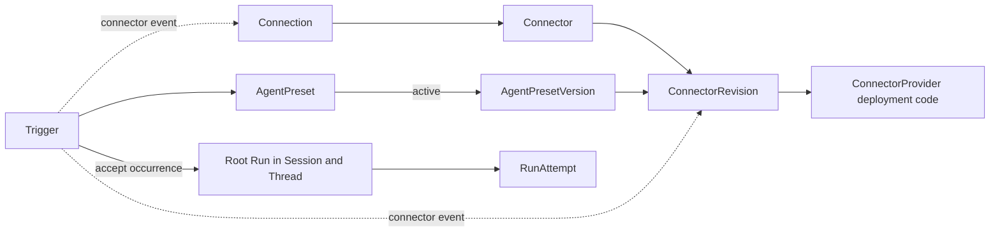
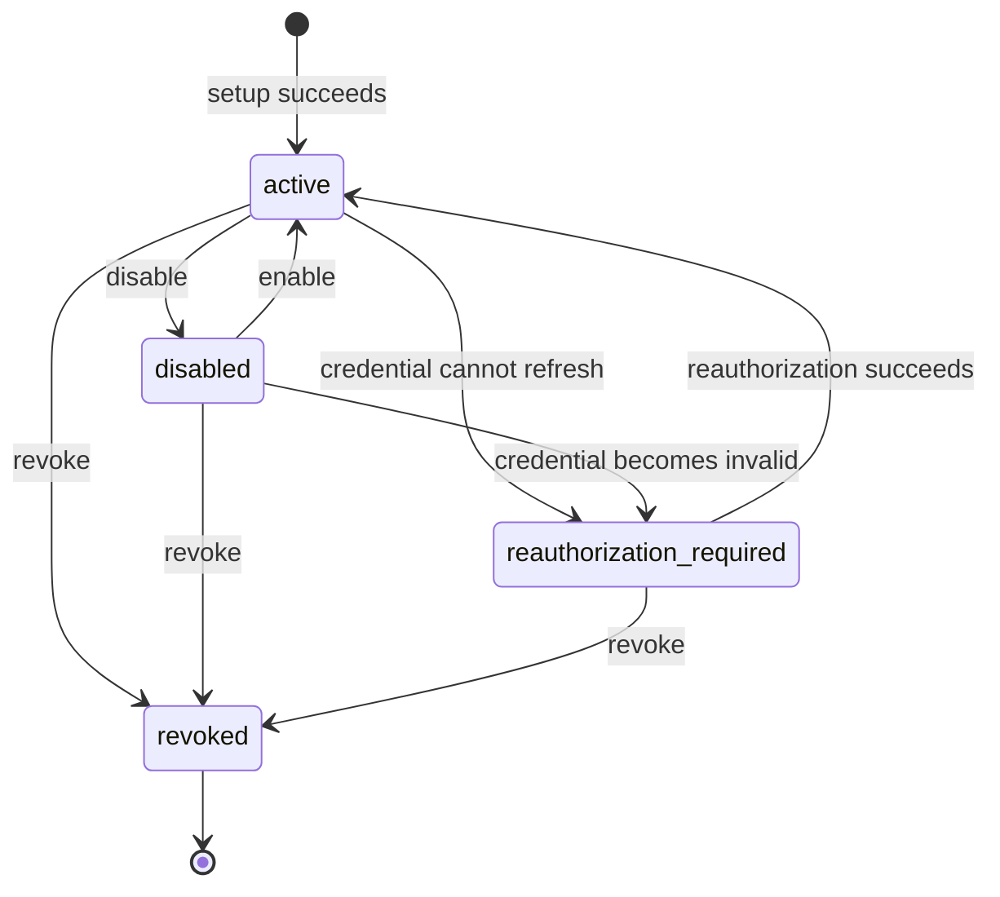
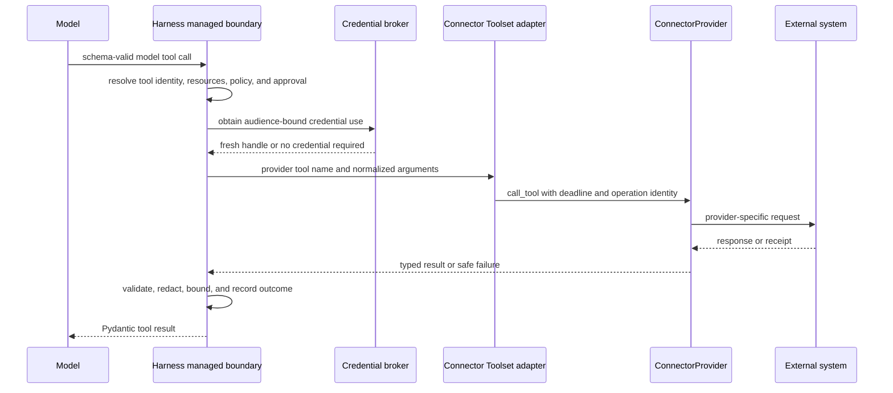
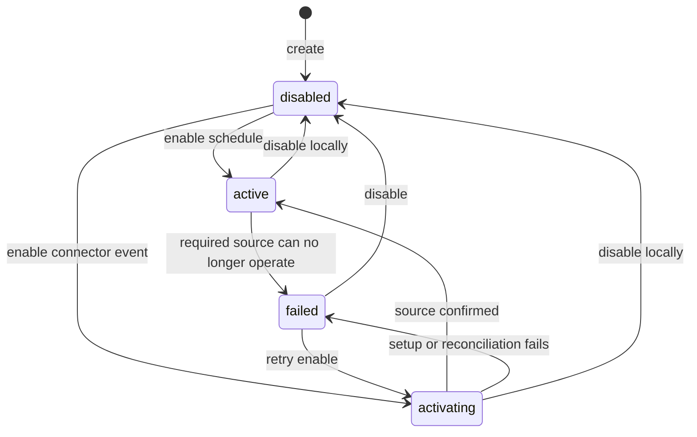

# Connectors, Connections, and Triggers

## Design Position

Foundation owns durable Connector configuration, account authorization, managed tool projection, and unattended Trigger acceptance without turning provider code or external event delivery into product authority. A `ConnectorProvider` is trusted deployment code. `Connector`, `ConnectorRevision`, `Connection`, and `Trigger` are Foundation-owned Workspace data. `ConnectorRevision`, like `AgentPresetVersion`, is an independently addressable immutable Version; the other three resources have explicit mutable lifecycles.

An AgentPresetVersion selects exact Connector revisions and freezes its complete model-visible tool contract. A Run fixes every resolved Connection identity, while each RunAttempt obtains current authorization and credential use. A Trigger targets one stable `AgentPreset` and submits each unique schedule or Connector-event occurrence through the common root [Run acceptance](34-agent-control-input-and-continuation.md#acceptance-and-lineage) contract. Acceptance resolves the Preset's then-active Version and Runtime lock, stores both on the Run, and selects or creates the Session and root Thread; Trigger does not own another Agent runtime, queue, or retry lifecycle.

Provider packages are an OSS extension surface. Installing a package makes it available for discovery, not trusted for import or execution. Deployment trust, Agent dependency locks, current IAM, run grants, managed Secrets, and provider compatibility remain independent checks.

## Boundaries

| Concern                                                                                 | Owner                                                                                                                                 | Relationship                                                                     |
| --------------------------------------------------------------------------------------- | ------------------------------------------------------------------------------------------------------------------------------------- | -------------------------------------------------------------------------------- |
| Provider discovery, metadata, configuration, tools, authorization, and event adaptation | This document                                                                                                                         | Defines the public deployment extension contract                                 |
| Connector, ConnectorRevision, Connection, and Trigger resources                         | This document                                                                                                                         | Owns identity, fields, lifecycles, and compatibility                             |
| AgentPreset, AgentPresetVersion, and Runtime lock                                       | [Agent Management](12-agent-management.md)                                                                                            | Select a stable invocation target and freeze exact executable content            |
| Tool composition, schema validation, managed authorization, and result safety           | [Harness Tool Execution](../agent-harness/07-tool-execution.md)                                                                       | Foundation reconstructs one managed Toolset over the accepted Harness boundary   |
| Principal, RoleBinding, and built-in role mapping                                       | [Foundation IAM](10-identity-and-access-management.md)                                                                                | Reauthorizes management, Trigger acceptance, and every RunAttempt                |
| Connector product actions and run-grant requirements                                    | This document                                                                                                                         | Defines resource-specific authority checked through Foundation IAM               |
| Secret encryption and owner lifecycle                                                   | [Secret Management](11-secret-management.md)                                                                                          | Stores Connection and Trigger credential material without public plaintext reads |
| Session, Thread, Run, and RunAttempt lifecycle                                          | [Interactions, Runs, and Attempts](13-interactions-runs-and-attempts.md)                                                              | Runs Trigger and interactive work through the same accepted lifecycle            |
| Thread creation and versioned advancement                                               | [Durable Thread Persistence](24-thread-persistence.md)                                                                                | Commits an independent Thread row with the accepted root Run                     |
| Run selections and durable Trigger correlation                                          | [Durable Run State](14-run-persistence.md)                                                                                            | Persists immutable acceptance facts reused by replacement RunAttempts            |
| Lifecycle publication and outbound delivery                                             | [Lifecycle and Stream Persistence](17-lifecycle-and-stream-persistence.md) and [Events and Delivery](20-events-usage-and-delivery.md) | Publishes committed resource and Run facts independently from inbound events     |
| Public route catalog and shared HTTP behavior                                           | [Management API](21-management-api.md)                                                                                                | Exposes resources and commands under `/api/v1`                                   |

The Connector domain has exactly four core concepts:



`ConnectorProvider` is not a database resource. `Trigger` is a separate Foundation domain resource and does not become a fifth Connector concept. Inline Agent Connector declarations, transient Connection setup records, provider event state, occurrence deduplication, and resolved Run selections are not independently addressable product resources.

## Provider Trust and Discovery

Foundation discovers Connector providers only from the Python entry-point group `a13n_service.connector_providers`. The entry-point name is the stable `provider_key`; the loaded object does not repeat that key. Foundation performs no filesystem scan, ambient module import, remote code download, or API-driven package installation.

Discovery does not grant trust. Deployment configuration selects each permitted `provider_key` together with its exact trusted distribution or artifact identity. Startup enumerates entry-point metadata without importing unselected targets, matches selected keys to their trusted artifacts, and imports only exact matches. An absent selected provider, duplicate selected key, artifact mismatch, or selected provider import or initialization failure prevents readiness. Unselected entry points are ignored and never imported.

Connector and Trigger APIs cannot install, upgrade, remove, enable, or upload Provider code. Adding or replacing a provider requires changing the deployment artifact and trust selection and restarting the service; hot loading is not part of the contract. Repository, operating-system, image, and deployment permissions remain the code-installation boundary and create no new Foundation role.

A historical ConnectorRevision can name a `provider_key` not selected by the current deployment. The service remains available, but authoring or execution that requires the revision fails explicitly as `provider_unavailable` or `provider_not_trusted`; Foundation never substitutes a similarly named or newer Provider. AgentPresetVersions additionally lock the exact provider artifact used to materialize their tools. A replacement artifact reconstructs a retained revision only when it explicitly declares compatibility with that lock.

Python dependency resolution and artifact construction occur before service startup. Foundation does not resolve conflicting package requirements at runtime.

## Provider Metadata and Capabilities

One loaded Provider supplies deterministic, bounded, non-secret metadata through code rather than a second manifest. Its metadata includes:

- a display name and description;
- supported `provider_config_version` values and JSON Schemas for Connector configuration;
- whether it implements `tools`, `connections`, and `events`;
- supported Connection setup modes and their write-only input descriptions; and
- `webhook` or `polling` delivery when events are supported.

Metadata reads perform no external I/O. Secret fields never appear in ordinary Connector configuration schemas. Every schema, configuration object, provider state object, tool declaration, argument, result, and event payload is subject to Foundation hard bounds for size, depth, count, and time.

The public Provider object is one extension point with capability-specific method groups. The following names describe the stable responsibilities; concrete Python value classes remain typed process-local values rather than durable resources:

| Capability    | Provider operations                                                                                                                                                              | Required semantics                                                                                |
| ------------- | -------------------------------------------------------------------------------------------------------------------------------------------------------------------------------- | ------------------------------------------------------------------------------------------------- |
| Configuration | `validate_config`                                                                                                                                                                | Local deterministic validation for an exact provider config version; no external I/O              |
| Tools         | `list_tools`, `call_tool`                                                                                                                                                        | Discover complete managed definitions and dispatch one selected provider tool asynchronously      |
| Connections   | `connection_spec`, `start_connection`, `complete_connection`, `refresh_connection`, `revoke_connection`, `validate_connection`                                                   | Describe setup, return internal credential material, and validate local revision compatibility    |
| Events        | `list_events`, `validate_event_config`, `start_event_source`, `stop_event_source`, `renew_event_source`, `reconcile_event_source`, and the declared webhook or polling operation | Adapt external event contracts while preserving stable occurrence identity and operation evidence |

`validate_config`, `validate_connection`, and `validate_event_config` are local and perform no external I/O. Effectful methods are asynchronous, receive a bounded Foundation context with a stable operation identity and deadline, and return typed safe material or failures. A Provider registers no HTTP route, writes no Foundation database row, reads no arbitrary Secret, and returns no credential to a public API.

A normal Provider calls its external system directly. Foundation projects its tools through an in-process Toolset adapter and does not require an HTTP loopback or a separate MCP server. The built-in general MCP Provider follows the same contract but delegates discovery and calls to an external MCP server.

## Connector and ConnectorRevision

The conceptual durable schemas are not wire or ORM models:

```python
class Connector:
    id: ConnectorId
    organization_id: OrganizationId
    workspace_id: WorkspaceId
    name: str
    description: str | None
    enabled: bool
    version: int
    created_by: PrincipalRef
    created_at: datetime
    updated_at: datetime


class ConnectorRevision:
    id: ConnectorRevisionId
    organization_id: OrganizationId
    workspace_id: WorkspaceId
    connector_id: ConnectorId
    version: int
    provider_key: str
    provider_config_version: str
    config: BoundedJsonObject
    created_by: PrincipalRef
    created_at: datetime
```

Connector is the stable authorization, display, and global enablement resource. Its mutable `name`, `description`, and `enabled` fields use `expected_version`. Its `version` protects those mutable fields and is not configuration history. A disabled Connector denies new tool calls, Connection setup, event acceptance, and Trigger activation without rewriting retained revisions or AgentPresetVersions.

ConnectorRevision is immutable. Its `version` begins at `1` and increases monotonically within one Connector. Creation validates the exact Provider and config version before commit. An exact semantic no-op creates no new revision. Restoring old configuration copies it into a higher version rather than moving a current pointer. The revision contains no Secret, Connection, frozen tool contract, Python target, package version, or mutable Connector metadata.

Provider selection may change in a later ConnectorRevision. Existing Connections remain associated with their immutable `provider_key` and are incompatible by default; they require reauthorization or an explicit Provider migration. Retained AgentPresetVersions continue selecting their original ConnectorRevision and never adopt the newer Provider implicitly.

Connector creation atomically creates the stable resource and version `1`. Individual revisions cannot be patched or deleted. A Connector can be deleted only when no AgentPresetVersion or Trigger selects any of its revisions and it owns no Connection. Deletion removes its otherwise unreferenced revisions; deployed or historically referenced Connectors are disabled instead.

Preinstalled and API-created Connectors use the same resources and invariants. Their origin does not create `built_in` or `custom` resource kinds.

## Connection

A Connection represents one external account authorization for a Connector. It does not select tools or bind one ConnectorRevision.

```python
class ConnectionAccount:
    external_id: str
    display_name: str


class Connection:
    id: ConnectionId
    organization_id: OrganizationId
    workspace_id: WorkspaceId
    connector_id: ConnectorId
    principal_ref: PrincipalRef | None
    name: str
    provider_key: str
    provider_state_version: str
    provider_state: BoundedJsonObject
    account: ConnectionAccount
    status: Literal[
        "active",
        "disabled",
        "reauthorization_required",
        "revoked",
    ]
    expires_at: datetime | None
    version: int
    created_by: PrincipalRef
    created_at: datetime
    updated_at: datetime
```

A non-null `principal_ref` makes the Connection personal to that current User or Service Account. A null value makes it Workspace-shared. This reuses IAM Principals and introduces no Connection-owner role. Personal Connection use requires exact Principal equality; shared Connection use requires current Workspace and Agent run authority. An owner reference or account display value never grants credential use.

`provider_key`, owner, tenant, and Connector identity are immutable. Moving a Connection between Principals or between personal and shared ownership requires revocation and a new Connection. `provider_state` is bounded Provider-defined non-secret account state, interpreted under `provider_state_version`; account and installation identifiers belong there. OAuth tokens, API keys, passwords, cookies, and signing values are managed Secrets owned by the Connection.

The lifecycle is:



`active` means eligible for a current attempt, not continuously healthy. A refreshable access-token expiry does not change status. A transient refresh or upstream failure fails the current operation and leaves the status active; a definitive invalid grant moves it to `reauthorization_required`. `disabled` is reversible and retains credential material. `revoked` is terminal.

Connection setup is a Foundation-owned expiring operation, not a product resource. It binds the initiating Principal, Workspace, ConnectorRevision, Provider, OAuth state, PKCE state, callback correlation, and idempotency evidence. Sensitive provisional values are encrypted, the setup can complete successfully once, and callback replay cannot create a second Connection. Manual input is write-only. Foundation creates the Connection and its initial Secrets as one complete local result only after setup succeeds; it never commits an active Connection missing required credential material.

Reauthorization updates the same `reauthorization_required` Connection. A revoked Connection is never reused. Credential refresh replaces Connection-owned Secret values without advancing Connection `version` when no public Connection field changes; a provider-state, account, expiry, or status change advances it once.

Revocation attempts the external issuer operation, then stops local use, deletes live Connection-owned Secret ciphertext, and commits `revoked` regardless of an external success, failure, or unknown result. A stable operation identity and reconciliation can continue external cleanup, but external uncertainty never restores local authority.

At use time Foundation checks the exact Connector, current Connection status, Principal eligibility, Provider key, provider-state version, selected ConnectorRevision configuration, product authorization, run grant, and Secret eligibility. The Provider performs only its local provider-specific compatibility check. No layer silently chooses another Connection.

## Agent Connector Declarations

Agent authoring discovers Provider tools from one ConnectorRevision and, only when discovery itself requires authentication, one explicitly chosen Connection. The client selects returned provider tool names; it cannot submit replacement schemas or policy metadata. Discovery Connection use is authorized but does not implicitly bind that Connection into the AgentPresetVersion.

An AgentPresetVersion stores an inline declaration rather than a ConnectorBinding resource. The conceptual serializable shape is:

```python
class FrozenConnectorTool:
    provider_tool_name: str
    model_tool_name: str
    tool_id: str
    description: str
    parameters_json_schema: BoundedJsonObject
    effects: tuple[str, ...]
    credential_audiences: tuple[str, ...]
    idempotency: str
    output_policy: BoundedJsonObject


class AgentConnectorDeclaration:
    connector_revision_id: ConnectorRevisionId
    connection_id: ConnectionId | None
    tools: tuple[FrozenConnectorTool, ...]
```

Foundation validates the complete Provider result and freezes every selected tool's MCP-compatible name, description, input schema, stable managed identity, effects, credential audiences, idempotency semantics, and output policy. It derives and freezes a bounded Connector prefix in `model_tool_name`; Pydantic composition remains authoritative for final visible-name collision rejection. Provider tool names remain distinct from model-visible names.

These serializable fields reconstruct the accepted [`HarnessToolMetadata`](../agent-harness/07-tool-execution.md#tool-metadata) and native Pydantic definition. Process-local resource resolvers, Provider clients, credential brokers, and callables remain trusted reconstructed values covered by the Agent dependency lock. A Provider metadata change affects only a newly materialized AgentPresetVersion; a queued or retained Version never adopts a current `list_tools` response.

## Connection Selection and RunAttempt Preparation

The Connector-owned immutable Run facts are conceptual serializable values:

```python
class ConnectorRunSelection:
    declaration_index: int
    connector_revision_id: ConnectorRevisionId
    connection_id: ConnectionId | None


class AcceptedTriggerSource:
    trigger_id: TriggerId
    trigger_version: int
    source_kind: Literal["schedule", "connector_event"]
    occurrence_key: str
```

`declaration_index` binds the selection to the matching declaration in the accepted AgentPresetVersion. `occurrence_key` is the canonical bounded schedule or Provider-event uniqueness value. These values are protected acceptance metadata, not caller-selected authority or independent resources. The Run persistence contract owns their durable placement and immutability.

An Agent Connector declaration can pin a Connection. The exact invoking Principal must remain eligible to use it; pinning a personal Connection does not grant another Principal access. When no Connection is pinned and the Provider requires one, Run acceptance resolves in this order:

1. exactly one active, compatible personal Connection owned by the invoking Principal;
2. when none exists, exactly one active, compatible Workspace-shared Connection.

Zero candidates fail as `connection_required`; several candidates at the selected level fail as `connection_ambiguous`. A connectionless declaration rejects a Connection. A Run submission cannot supply or override a Connection choice.

Acceptance records one resolved Connection ID or explicit connectionless result for every declaration in the Run's immutable `connector_selections`. This is not a Binding or Capability resource. Replacement RunAttempts reuse those IDs and never choose a substitute account; an explicit successor Run performs its own acceptance and selection.

Every RunAttempt validates the complete AgentPresetVersion before entering Harness:

- each exact ConnectorRevision and Provider lock remains reconstructable;
- every Connector remains enabled;
- every resolved Connection remains currently authorized, active, Provider- and revision-compatible, and eligible for fresh Secret use; and
- frozen tool definitions and model-visible names remain structurally valid.

One failure rejects the RunAttempt before the first model request. Foundation does not omit an unavailable Connector and run a smaller tool surface because that would change the meaning of the selected AgentPresetVersion.

## Runtime Tool Projection and Dispatch

The worker reconstructs one in-process Connector Toolset from the frozen declarations. Each candidate is a metadata-aware function tool over a Provider call adapter. The Harness mandatory tool-surface resolver, Pydantic Tool Manager, and outer tool-execution boundary remain the sole schema, collision, authorization, credential, result-safety, and model-adapter path.



Immediately before dispatch, current policy, Connector state, Connection state, Provider compatibility, and credential eligibility are checked again. Credential material is resolved only after schema validation and authorization and is absent from the AgentPresetVersion, model arguments, `HarnessState`, ordinary events, logs, and traces. Provider external I/O spans no database session or transaction; Foundation uses separate short reads and fenced writes around it.

Provider availability, Connector disablement, Connection ineligibility, lock incompatibility, or surface mismatch before Harness entry is a RunAttempt failure. An upstream timeout, rate limit, transient refresh failure, externally removed tool, invalid provider result, or call-time compatibility loss is one explicit tool failure that the Agent may handle. Foundation exposes no general public `call_connector_tool` API that bypasses this managed boundary.

## Trigger Model

A Trigger is a mutable Workspace resource with one stable Preset target and one typed source:

```python
class Trigger:
    id: TriggerId
    organization_id: OrganizationId
    workspace_id: WorkspaceId
    name: str
    description: str | None
    principal_ref: PrincipalRef
    agent_preset_id: AgentPresetId
    source: ScheduleTriggerSource | ConnectorEventTriggerSource
    input_template: BoundedJsonObject
    provider_state_version: str | None
    provider_state: BoundedJsonObject | None
    status: Literal["disabled", "activating", "active", "failed"]
    status_reason: str | None
    version: int
    created_by: PrincipalRef
    created_at: datetime
    updated_at: datetime


class ScheduleTriggerSource:
    kind: Literal["schedule"]
    type: Literal["cron", "interval"]
    expression: str | None
    timezone: str | None
    interval_seconds: int | None


class ConnectorEventTriggerSource:
    kind: Literal["connector_event"]
    connector_revision_id: ConnectorRevisionId
    connection_id: ConnectionId
    event_type: str
    provider_event_config_version: str
    config: BoundedJsonObject
```

`principal_ref` is the existing User or Service Account whose current authority is evaluated for each occurrence. It is not the external webhook sender. The creating caller can bind only itself as a User; a Workspace Admin can instead bind an eligible Service Account and cannot bind another User. The target is one stable AgentPreset. Each firing resolves that Preset's current active Version during durable Run acceptance; it never reads mutable config or accepts a caller-selected historical Version. The Connector-event Connection is exact because an unattended Trigger cannot choose an account interactively. It authorizes event ingress only and does not override the resolved AgentPresetVersion's tool Connections.

A cron schedule has exactly five fields and an explicit IANA time zone. An interval uses a positive integer `interval_seconds` and no cron or time-zone fields. Deployment policy imposes a finite minimum interval. Schedule evaluation uses UTC instants while retaining the selected IANA zone for cron meaning.

The Trigger has no immutable TriggerRevision. A successful occurrence acceptance stores the exact Trigger ID and version, target AgentPreset ID, resolved active AgentPresetVersion, occurrence identity, expanded input, and resolved Connector selections with its root Run. Updating the Trigger or publishing another Preset Version cannot alter that retained work.

## Trigger Lifecycle and Event Sources

Every Trigger is created disabled. Behavior-changing fields, including source, Principal, AgentPreset, and input template, can be changed only while disabled and require `expected_version`; name and description can change in any non-deleted state.



For a schedule, enablement commits active schedule state without external I/O. For a Connector event, Foundation commits `activating` and a stable operation identity before invoking the Provider. The Provider registers the Foundation callback or starts polling and returns bounded non-secret source material plus Secret values. Foundation commits safe Provider state and Trigger-owned encrypted Secrets before marking the Trigger active.

Event-source create, renew, and stop operations use stable identities. Providers pass them to external idempotency facilities or use them to inspect exact external state. A lost response is reconciled through `reconcile_event_source`; Foundation does not blindly create another subscription. An unresolved outcome leaves the Trigger non-active with a safe reason.

Disablement first commits local `disabled`, which immediately prevents schedule claims and event acceptance, then performs bounded external cleanup. Cleanup failure or uncertainty cannot reactivate local ingress and remains reconcilable. A disabled Trigger can be deleted only when no Run was accepted from it and no source cleanup is unresolved. Otherwise it remains as retained historical metadata.

Trigger status describes source admission, not the health or outcome of prior Runs. Agent failures do not change Trigger status. A `status_reason` is a bounded stable code and never contains a Provider payload, signature, credential, or traceback.

Connector-event provider state is owned by the Trigger and interpreted under a Provider-defined state version. It is not caller-mutable or a public EventSubscription resource. Event callback signing values and polling credentials are Trigger-owned managed Secrets. Tool-only Providers implement no event methods.

## Trigger Input and Occurrence Acceptance

The Trigger input template is a bounded JSON object. A placeholder can replace a complete JSON value; string interpolation, Jinja, JSONPath, executable code, and arbitrary expressions are not supported. Connector-event templates can select `{{ event }}`, `{{ event.data }}`, `{{ event.type }}`, or `{{ event.occurred_at }}`. Schedule templates can select `{{ scheduled_at }}`.

Foundation compiles the template at Trigger creation or update and validates the possible expanded structure against the target Preset's current active Version [`ProtocolConfig.input_data_schema`](12-agent-management.md#protocol-configuration) when present. At occurrence acceptance it resolves the then-active AgentPresetVersion and Runtime lock, revalidates the bounded expanded value against that frozen optional schema, and constructs an `AgentInput` with empty `content` and that value in `structured_content`. Provider event data is untrusted Agent input and cannot add a content block, binary source, delivery preference, tool, Connection, Secret, Principal, policy, or run grant.

Each Provider-normalized event contains a stable external `event_id`, type, optional occurrence time, receipt time, and bounded data. Webhook admission bounds the body and headers before Provider verification. Provider-specific signature verification occurs before acceptance. Polling persists a safe cursor only after processing a bounded page; event identities make a repeated page safe after a crash.

Occurrence uniqueness is:

- `(trigger_id, provider_event_id)` for a Connector event; and
- `(trigger_id, scheduled_for)` for a schedule.

Occurrence handling invokes the common root Run acceptance operation. It validates and publishes the initial root state, then its short acceptance transaction rechecks Trigger state, current Principal and stable Preset authorization, resolves the exact active Preset Version and profile-selected Runtime lock, verifies Provider and Connection eligibility and Agent Connector resolution, and checks the unique occurrence key. That transaction commits the versioned root Thread row, root Run, Session relationship, exact Preset Version and Runtime lock, resolved Connection selections, Trigger source metadata, lifecycle events, and outbox intents. A duplicate returns the prior Run receipt or a successful webhook acknowledgement and creates no second Thread or Run.

Trigger ingress is at-least-once and Run acceptance is at-most-once for one unique occurrence. Neither claim makes model, tool, or external side effects exactly once. If downtime spans several schedule instants, Foundation accepts only the latest missed instant and advances to the next future instant; it does not create an unbounded catch-up burst.

Each occurrence creates an independent root Run through the common Session and Thread allocation policy. It does not implicitly continue a prior Trigger Run or share its model history. Trigger does not add parallel, drop, or serialize modes; the Agent workload, Workspace admission, and common Worker claim policy own concurrency and queueing. A Trigger occurrence is not a separate public TriggerActivation resource, and its Provider source is not a separate public EventSubscription.

The signed webhook request authenticates the external source only. Before acceptance, Foundation reauthorizes the Trigger's stored Principal for the stable AgentPreset, ConnectorRevision, Connection, and required Secret use. Revoked authority, disabled resources, absent Provider compatibility, or ambiguous resolved Agent Connections fail closed and create no partially authorized Run.

## Management and Ingress Surfaces

The [Management API](21-management-api.md) owns exact route paths. The Connector contract exposes these operation groups:

- read-only trusted Provider catalog and Provider metadata;
- atomic Connector plus initial-revision create, Connector reads and metadata update, constrained delete, and immutable revision create/read;
- explicit tool and event discovery for one ConnectorRevision and authorized optional Connection;
- Connection setup, metadata reads, rename, disable, enable, refresh, reauthorize, and terminal revoke; and
- Trigger create/read/update/delete plus enable and disable commands.

The stable product actions are:

| Action                | Meaning                                                                         |
| --------------------- | ------------------------------------------------------------------------------- |
| `connector.read`      | Read safe Provider catalog, Connector, revision, and tool metadata              |
| `connector.create`    | Create a Workspace Connector and its first revision                             |
| `connector.configure` | Create another immutable revision or change stable Connector lifecycle metadata |
| `connection.read`     | Read a safe eligible Connection projection                                      |
| `connection.manage`   | Establish, refresh, disable, reauthorize, or revoke an eligible Connection      |
| `trigger.read`        | Read safe Trigger configuration and lifecycle status                            |
| `trigger.configure`   | Create, update, enable, disable, reconcile, or delete a Trigger                 |

Model-triggerable Connector work additionally requires the run grants `connector.use`, `secret.use`, and `tool.call`. Each grant names the selected resource and allowed operation; no role name enters Harness. Effective authority intersects the accepted AgentPresetVersion, resolved Connection, current Principal and RoleBindings, current resource status, and current grants. Trigger acceptance performs the same invocation authorization for its stored Principal before accepting a Run.

Creates and stateful commands accept the shared idempotency contract. Mutable resource changes use `expected_version`. Collection reads are bounded, deterministically ordered, cursor-paginated, and reauthorized. Public responses expose safe account, status, compatibility, and Provider metadata but no Secret, raw Provider state, OAuth callback value, webhook signature, or unredacted Provider error.

Connection OAuth callback and Connector-event webhook ingress are bounded external protocol endpoints, not alternate management APIs. A callback or webhook URL, Trigger ID, delivery ID, cursor, or setup ID grants no authority by possession. Webhook success means the occurrence was durably accepted or already known; it does not wait for the Run or Agent to finish.

## Failure Semantics

| Failure                                                                              | Observable outcome                                                                    | Retry or reconciliation                                                                              |
| ------------------------------------------------------------------------------------ | ------------------------------------------------------------------------------------- | ---------------------------------------------------------------------------------------------------- |
| Provider package is installed but not trusted                                        | Provider is not imported; resource operation fails safely                             | Deployment explicitly selects the exact artifact and restarts                                        |
| Selected Provider fails import or trusted artifact verification                      | Service does not become ready                                                         | Repair the deployment; no runtime fallback is selected                                               |
| Historical revision names an unavailable Provider                                    | Authoring or RunAttempt fails `provider_unavailable` before use                       | Restore an explicitly compatible trusted Provider or select a new revision for new work              |
| Provider rejects config or state compatibility                                       | Revision, Connection, Trigger, or RunAttempt operation fails without reinterpretation | Caller supplies valid configuration or creates a compatible immutable revision                       |
| Connection is absent or ambiguous at Run acceptance                                  | No Run is accepted                                                                    | Caller changes the AgentPresetVersion or eligible Connections; the request cannot override selection |
| Selected Connection later becomes disabled, revoked, unauthorized, or incompatible   | RunAttempt fails before Harness entry or a call fails before dispatch                 | Restore the same eligible Connection when reversible; no substitute is chosen                        |
| Transient credential refresh or upstream failure                                     | Current tool or Trigger operation fails safely; Connection remains active             | Retry only under the owning idempotency and deadline policy                                          |
| Credential cannot refresh definitively                                               | Connection becomes `reauthorization_required`                                         | Complete reauthorization for the same Connection                                                     |
| Provider tool times out, rate-limits, disappears, or returns invalid data            | One bounded managed tool failure reaches the Agent                                    | Agent or Host policy decides whether another explicit call is safe                                   |
| Connector is disabled                                                                | New setup, tool dispatch, event acceptance, and Trigger activation fail closed        | Re-enable the same Connector through authorized CAS mutation                                         |
| Event signature or normalized payload is invalid                                     | No occurrence or Run is committed; safe ingress rejection is recorded operationally   | Sender corrects the request; Foundation never logs the raw payload or signature                      |
| Event-source operation outcome is unknown                                            | Trigger remains non-active or cleanup remains unresolved                              | Reconcile the same stable operation identity; do not create a second source blindly                  |
| Event or schedule occurrence repeats                                                 | Existing acceptance is reused; no second Run is created                               | Acknowledge the duplicate without changing its identity                                              |
| Trigger Principal or target authority is revoked                                     | No new Run is accepted                                                                | Restore current authority or reconfigure the disabled Trigger                                        |
| Connector, Connection, or Trigger delete is still referenced or has retained history | `409` conflict and no deletion                                                        | Disable the resource and retain exact history                                                        |

Errors follow the shared bounded shape and use stable distinctions such as `provider_unavailable`, `provider_not_trusted`, `provider_config_incompatible`, `connector_disabled`, `connection_required`, `connection_ambiguous`, `connection_disabled`, `connection_reauthorization_required`, `connection_revoked`, `connection_incompatible`, `tool_not_found`, `tool_contract_incompatible`, `provider_timeout`, `provider_rate_limited`, `trigger_not_active`, `trigger_source_incompatible`, `event_signature_invalid`, `event_payload_invalid`, and `event_source_unavailable`. Safe details never contain a Secret, Provider payload, traceback, private path, or model/tool content.

## Compatibility

The following version axes have separate owners and meanings:

| Version                         | Owner and meaning                                                       |
| ------------------------------- | ----------------------------------------------------------------------- |
| `Connector.version`             | CAS for mutable Connector metadata and enablement                       |
| `ConnectorRevision.version`     | Immutable monotonic configuration history within one Connector          |
| `provider_config_version`       | Provider-owned interpretation of ConnectorRevision `config`             |
| `Connection.version`            | CAS for public mutable Connection state                                 |
| `provider_state_version`        | Provider-owned interpretation of non-secret Connection or Trigger state |
| `provider_event_config_version` | Provider-owned interpretation of Trigger event-selection config         |
| `Trigger.version`               | CAS for mutable Trigger definition and lifecycle                        |
| Agent dependency lock           | Exact trusted Provider artifact and reconstruction compatibility        |
| HTTP `/api/v1`                  | Public wire compatibility under Platform API Conventions                |

No version substitutes for another. A Provider upgrade can support old config, state, event, and dependency-lock identities explicitly; absence of that declared compatibility fails rather than applying current defaults. Frozen Agent tool definitions change only through a new AgentPresetVersion. Publishing that Version or changing a Trigger affects only later occurrence acceptance because every Run retains the selected Trigger version, exact Preset Version, Runtime lock, and expanded input.

Adding a Provider capability, safe optional response field, event type, or config version is additive. Removing a required Provider method, reinterpreting an existing config or state version, weakening trust or authorization, changing a status meaning, or changing an existing command's side-effect boundary is incompatible while durable data relies on it.

## Trade-offs

Trusted in-process Providers give OSS deployments a small, direct Python extension surface and avoid one service hop per tool call. They also make Provider code part of the Foundation process trust boundary, so deployment selection and exact locks are mandatory and API-based code installation is excluded.

Keeping Connector configuration immutable while Connection authorization remains current permits safe config history and credential rotation without copying Secret material into revisions. It requires explicit compatibility checks whenever a Provider or account interpretation changes.

Using Trigger plus the common Run lifecycle rather than public EventSubscription and TriggerActivation resources keeps one durable Agent-work lifecycle and one observable Run identity. In exchange, Foundation does not expose Connector events as a general-purpose customer event bus; external event consumption independent of Agent work is outside this contract.

Stable AgentPreset targets let unattended work adopt newly published active Versions, while exact Run pinning and fail-closed Connection ambiguity preserve accepted-work reproducibility. Choosing between several accounts remains an explicit authoring action.

## Invariants

01. ConnectorProvider is trusted deployment code discovered by one fixed entry-point group; package presence alone never grants import or execution authority.
02. Connector, ConnectorRevision, Connection, and Trigger are tenant-consistent Workspace data, while only ConnectorRevision and AgentPresetVersion are immutable revisions.
03. ConnectorRevision contains bounded non-secret Provider configuration and never contains a credential, code target, live object, or frozen tool contract.
04. Connection credential material exists only in Connection-owned managed Secrets; public Connection data contains bounded non-secret account and Provider state.
05. AgentPresetVersion freezes exact ConnectorRevision references, complete managed tool declarations, and Provider dependency locks without storing live authority.
06. Run acceptance resolves every unpinned required Connection once; a Run submission cannot override or substitute that selection.
07. Every RunAttempt obtains current IAM, run grants, Provider compatibility, Connection eligibility, and credential use before Harness or external dispatch.
08. Connector tools enter the model only through native Pydantic composition and the mandatory Harness managed-tool boundary.
09. Provider or external I/O spans no Foundation database session or transaction, and unknown external outcomes retain exact operation identity for reconciliation.
10. Trigger is an independent resource that targets one stable AgentPreset; each occurrence accepts a root Run pinned to the then-active AgentPresetVersion and Runtime lock through the common Session and Thread contract.
11. A Connector-event Trigger selects one exact ConnectorRevision and Connection for ingress; that Connection never overrides the target Agent's tool selections.
12. Each unique Trigger occurrence accepts at most one Run, while event delivery and Agent side effects remain independently retryable and are not claimed exactly once.
13. Trigger input is bounded untrusted data and cannot create a Principal, permission, run grant, tool, Connection, or Secret authority.
14. Event source state belongs to its Trigger; no public EventSubscription or TriggerActivation duplicates the Trigger or Run lifecycle.
15. Disabling or revoking a resource prevents new authority without rewriting retained ConnectorRevision, AgentPresetVersion, Trigger-version, Run, event, or audit facts.
