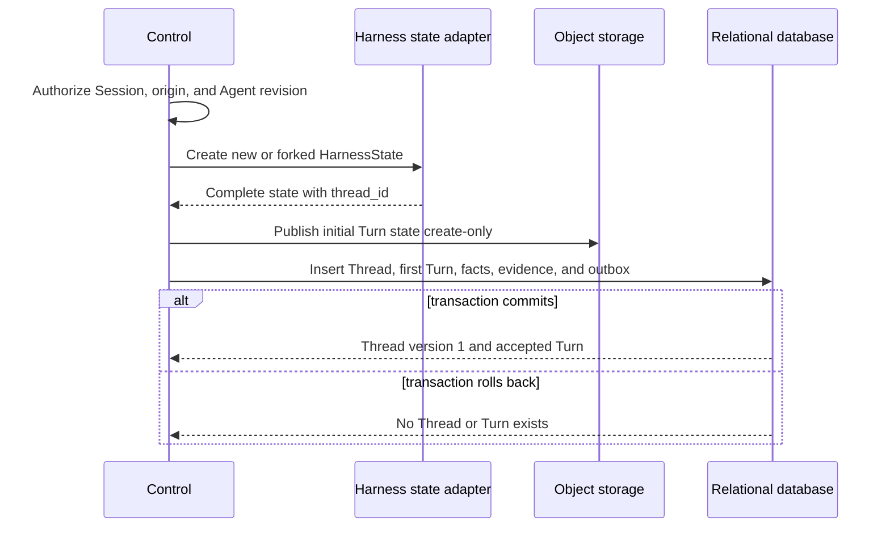

# Durable Thread Persistence

## Design Position

Foundation persists every hosted `Thread` as an independent versioned
relational resource. The Thread row is the authority for Session membership,
Thread origin, the currently advancing Turn, the selected continuation head,
and compare-and-swap serialization of accepted advancement. A Thread is not a
grouping inferred from Turn timestamps or a `thread_id` copied into otherwise
unrelated rows.

The shared [Platform Interaction Model](../interaction-model.md) owns the
cross-platform meaning of Thread. The Harness owns creation and preservation of
the matching `HarnessState.thread_id`. Foundation stores that exact ID rather
than generating a parallel Host Thread identity. [Durable Turn State](14-turn-persistence.md)
owns Turn fields, state objects, parent edges, and outcomes; this contract owns
which Turn is active for a Foundation Thread and which sealed Turn is selected
as its continuation head.

Foundation never creates an empty Thread. Root, fork, and child acceptance each
create one Thread together with its first Turn, initial complete Turn state,
idempotency evidence, lifecycle facts, and outbox intents. Later bounded-input
submission, authenticated feedback, and retry acceptance create another Turn
and advance the existing Thread under its current version.

## Boundaries

| Concern                                                                  | Owner                                                              | Contract                                                                                                                                    |
| ------------------------------------------------------------------------ | ------------------------------------------------------------------ | ------------------------------------------------------------------------------------------------------------------------------------------- |
| Session, Thread, Turn, and Item meaning                                  | [Platform Interaction Model](../interaction-model.md)              | Defines identity and cross-platform relationships                                                                                           |
| `thread_id` creation, preservation, and fork transformation              | [Harness State](../agent-harness/10-snapshot-and-resume.md)        | Supplies one stable ID inside complete continuation state                                                                                   |
| Durable Thread resource, version, origin, active Turn, and selected head | This contract                                                      | Serializes Foundation Thread advancement and supplies read authority                                                                        |
| Persisted Session membership and root selection                          | This contract                                                      | Requires one existing Session container and exactly one retained root Thread; other Session product metadata remains outside the Thread row |
| Turn row, state object, parent edge, scheduling, and outcome             | [Durable Turn State](14-turn-persistence.md)                       | Owns one accepted advancement and its resumable state                                                                                       |
| TurnAttempt lease, generation, and stale-writer fence                    | [Durable Turn Attempt Persistence](15-turn-attempt-persistence.md) | Authorizes worker mutation of the active Turn                                                                                               |
| Public routes and wire read models                                       | [Management API](21-management-api.md)                             | Exposes authorized Thread reads, advancement, and fork commands                                                                             |
| Agent-facing history retrieval                                           | [Agent Interaction Retrieval](22-agent-interaction-retrieval.md)   | Projects authorized Thread and Turn data without becoming authority                                                                         |

A Thread row contains no message history, Harness state, Item payload, provider
state, credential, worker lease, queue entry, replay cursor, or live process
object. Those values retain their owning stores and lifecycles.

## Durable Thread Model

The following schema is conceptual. It defines durable field meaning rather
than a public wire representation or concrete ORM class.

```python
type ThreadRole = Literal["root", "child"]
type ThreadOriginKind = Literal["new", "fork", "child"]


class Thread:
    id: str
    version: int
    tenant_id: str
    session_id: str

    role: ThreadRole
    origin_kind: ThreadOriginKind
    origin_thread_id: str | None
    origin_turn_id: str | None

    head_turn_id: str | None
    active_turn_id: str | None
    latest_turn_id: str

    created_at: datetime
    updated_at: datetime
```

`id` equals the `thread_id` in the Thread's first complete `HarnessState` and in
every later Turn state for that Thread. It retains the Harness-owned `thread-`
format and is not re-encoded as another Foundation identifier. The ID grants no
authority.

`version` is the positive Foundation domain-object version. It starts at `1`
when the Thread and first Turn commit and increases by one for every accepted
Thread advancement and every transition that clears `active_turn_id` or selects
a new `head_turn_id`. Idempotent replay resolves before comparing an expected
version. Worker recovery inside the same active Turn does not change the Thread
version.

`session_id`, `role`, origin fields, and `created_at` are immutable. Exactly one
Thread with `role="root"` belongs to a retained Session. A child Thread remains
inside its parent's Session. A Session fork creates a new Session whose root
Thread has `origin_kind="fork"`; an in-Session fork creates a child Thread with
the same origin kind.

Origin fields preserve structural provenance without granting authority or
replacing Turn state lineage:

| Origin  | Required fields                                                         | Meaning                                                                          |
| ------- | ----------------------------------------------------------------------- | -------------------------------------------------------------------------------- |
| `new`   | Both origin references absent; role is `root`                           | New Session root with no source history                                          |
| `fork`  | `origin_thread_id` and completed `origin_turn_id` present               | New history initialized through `HarnessState.fork()` from the exact source Turn |
| `child` | Parent `origin_thread_id` and `origin_turn_id` present; role is `child` | Host-managed child history caused by the selected parent Turn                    |

`origin_turn_id` is the source Turn for a fork and structural cause for a child.
Only a fork uses that source as its first Turn's state parent. A child that
starts with empty history has a root Turn with `parent_turn_id=null`; its
structural relationship remains in the Thread origin and child relationship
records.

### Head, Active, and Latest Turns

The three Turn references have distinct meanings:

| Field            | Meaning                                                                                                                                                        |
| ---------------- | -------------------------------------------------------------------------------------------------------------------------------------------------------------- |
| `head_turn_id`   | Exact sealed `waiting` or `completed` Turn whose frozen state is the currently selected continuation head; null until the Thread first selects such an outcome |
| `active_turn_id` | Sole Turn currently in `accepted` or `running`; null when no advancement owns the Thread                                                                       |
| `latest_turn_id` | Most recently accepted Turn, including one that later becomes `failed` or `cancelled`                                                                          |

Foundation never derives any of these values from timestamps, event order,
object listings, or replay data. Every non-null reference names a Turn with the
same `tenant_id`, `session_id`, and `thread_id` as the Thread row.

While a Turn is active, `active_turn_id=latest_turn_id`. A `waiting` or
`completed` outcome clears `active_turn_id`, selects that Turn as
`head_turn_id`, retains it as `latest_turn_id`, and advances the Thread version
in the same short transaction that seals the Turn. A `failed` or `cancelled`
outcome clears `active_turn_id`, preserves the prior head, retains the terminal
Turn as `latest_turn_id`, and advances the Thread version.

This separation lets an explicit retry start from the last selected complete
head rather than pretending that a failed or cancelled Turn is an eligible
state parent. The retry operation records its terminal source separately,
reuses the exact accepted intent under the retry contract, and advances the
Thread like any other accepted Turn. If the Thread has no head because its
initial Turn failed, retry initializes another root Turn from the same accepted
root intent and no parent state.

## Relational Thread Table

The conceptual model materializes as one row in `threads`. Supported relational
backends preserve the same validation and query semantics.

| Column group       | Columns                                                     | Relational contract                                                                                     |
| ------------------ | ----------------------------------------------------------- | ------------------------------------------------------------------------------------------------------- |
| Identity and scope | `id`, `version`, `tenant_id`, `session_id`                  | `id` is the primary key; version is positive; Session membership is immutable                           |
| Origin             | `role`, `origin_kind`, `origin_thread_id`, `origin_turn_id` | Immutable validated provenance; origin references can cross Session only for an authorized Session fork |
| Advancement        | `head_turn_id`, `active_turn_id`, `latest_turn_id`          | Same-Thread Turn references updated only by accepted advancement or outcome commit                      |
| Time               | `created_at`, `updated_at`                                  | UTC instants; `updated_at` follows authoritative Thread mutation, not stream activity                   |

The relational contract preserves these constraints:

1. `(tenant_id, id)` is unique, and every Turn has a same-tenant foreign key to
   its Thread.
2. `(tenant_id, session_id, id)` is unique, and every Thread references one
   persisted Session in the same tenant.
3. A partial unique constraint on `(tenant_id, session_id)` for `role="root"`
   enforces one root Thread per Session.
4. `latest_turn_id` is always present. `head_turn_id` and `active_turn_id` follow
   their status-specific nullability and same-Thread constraints.
5. At most one Turn per Thread is `accepted` or `running`; the Thread's
   `active_turn_id` and the Turn table's partial uniqueness constraint enforce
   the same rule at both owners.
6. Origin reference combinations match `origin_kind`; malformed or
   cross-tenant origins are rejected.
7. A committed Thread row and its first Turn always exist together. Neither
   becomes independently visible without the other.

The accepted access paths are:

| Access path                        | Index or uniqueness contract                                              |
| ---------------------------------- | ------------------------------------------------------------------------- |
| Exact Thread read and version lock | Unique `(tenant_id, id)`                                                  |
| Session Thread listing             | `(tenant_id, session_id, created_at, id)`                                 |
| Updated Thread listing             | `(tenant_id, session_id, updated_at, id)`                                 |
| Current or latest Turn join        | Same-tenant unique Turn references stored on the Thread                   |
| Origin traversal                   | `(tenant_id, origin_turn_id, id)` and `(tenant_id, origin_thread_id, id)` |
| One root Thread per Session        | Partial unique `(tenant_id, session_id)` for root role                    |

Turn-table indexes for scheduler claims, Turn listing, search, and DAG traversal
remain owned by the Turn contract. They do not replace the Thread row or its
version.

## Thread Creation

Thread creation is part of Turn acceptance and has no standalone empty-resource
operation.



Root creation validates Session policy and creates the Session root Thread.
Fork creation authorizes and reads one exact completed source Turn, applies the
Harness fork transformation outside a database transaction, and records the
source in both Thread origin and the first fork Turn's `parent_turn_id`. Child
creation validates the current parent Turn and TurnAttempt fence, creates a
distinct child Thread, and commits the child relationship with its first Turn.

The initial state object and any object-backed input publish before the
relational transaction. The transaction revalidates the exact state digest,
Thread ID, Session, origin, idempotency evidence, and source Turn version. If it
rolls back, published objects are non-authoritative cleanup candidates.

## Reads and History Selection

An exact Thread read comes from `threads` under current authorization. It
returns safe identity, version, Session, role, currently authorized origin
references, the three Turn references, and timestamps. A concealed origin
reference is omitted rather than exposing another Session or Turn by possession.
A Session Thread listing pages authorized Thread rows directly and can join
bounded current Turn summaries. It never groups Turn rows to invent a Thread
resource.

Thread Turn listing filters authorized Turn rows by the selected durable Thread
identity. Exact lineage still starts from an explicitly selected Turn and
follows `parent_turn_id`; `head_turn_id` is a continuation selector, not a
replacement for an explicit lineage head. Item and event replay remain separate
projections and cannot repair or advance Thread state.

## Retention and Deletion

Foundation exposes no independent hard-delete mutation for a Thread. Session and
interaction-retention policy can remove a Thread only after no retained Turn,
state object, Item, event, usage record, child relationship, fork origin, or
idempotency evidence requires it. Removing presentation detail never removes
the Thread row or changes its head.

A retained origin reference keeps the minimum safe source identity required by
lineage policy. Retention can redact inaccessible content without rewriting
Thread, Session, or Turn identities or making an incomplete lineage appear
complete.

## Security and Authorization

Every create, read, advance, fork, retry, feedback, and retention operation
authorizes the Thread through its current tenant, Session, Workspace policy, and
action. Origin and Turn references grant no access by possession. A concealed
Thread returns the same bounded not-found behavior as another concealed
resource.

The Thread row contains correlation and control state only. It never exposes
raw prompts, outputs, Harness state, pending payloads, credentials, provider
state, private child content, or storage locators. Cross-Session fork validates
both source read authority and destination mutation authority before publishing
the new state.

## Failure Semantics

| Failure                                                            | Durable outcome                                                 | Retry or reconciliation                                             |
| ------------------------------------------------------------------ | --------------------------------------------------------------- | ------------------------------------------------------------------- |
| Authorization, origin, parent, or version validation fails         | No Thread or Turn mutation                                      | Caller refreshes authority or resource version                      |
| Initial state publication fails                                    | No Thread or Turn is accepted                                   | Retry with the same idempotency key                                 |
| State publishes but relational creation or advancement rolls back  | Existing Thread is unchanged; new objects are non-authoritative | Same-key retry or orphan cleanup after ownership proof              |
| Response is lost after commit                                      | Thread and Turn may already exist                               | Repeat the same idempotency key and canonical request               |
| Concurrent advancement wins                                        | Losing request changes nothing                                  | Read the current Thread and decide against its new version and head |
| Active Turn seals while another command uses an older version      | Sealing wins and increments Thread version                      | Stale command conflicts and rereads the Thread                      |
| Referenced head, active, or latest Turn is missing or mismatched   | Thread fails closed as relational corruption                    | Readiness or repair restores a verified consistent relational state |
| Stale TurnAttempt tries to select a head or clear active ownership | Mutation is fenced and rejected                                 | Current TurnAttempt or control-plane recovery owns the transition   |

## Compatibility

Thread identity, Session membership, role, origin meaning, version semantics,
and the meanings of head, active, and latest Turn references are durable and API
compatibility facts. Changing any of those meanings requires an incompatible
API contract and a reviewed relational migration.

Adding safe read-only fields or indexes is compatible when authorization,
ordering, version checks, and mutation semantics remain unchanged. Storage
query shape, ORM organization, and transaction helper boundaries remain private
implementation details.

## Trade-offs

The independent Thread row duplicates relationships that are also present on
Turn rows and requires atomic cross-row updates at acceptance and outcome
commit. Foundation accepts that cost to provide one explicit owner for Thread
existence, Session membership, optimistic concurrency, active advancement, and
continuation-head selection. Turn rows remain the immutable work and state DAG;
the Thread row is a compact mutable selector rather than another transcript or
checkpoint store.

## Invariants

01. Every Foundation Thread is one independently versioned relational resource and belongs to exactly one persisted Session.
02. A Thread is created atomically with its first Turn and never exists as an empty resource.
03. Thread ID equals the stable `HarnessState.thread_id` for every Turn state in that Thread.
04. Exactly one retained root Thread belongs to a Session; child and fork histories use distinct Thread IDs.
05. `active_turn_id` names at most one accepted or running Turn, while `head_turn_id` names only a selected waiting or completed Turn.
06. `latest_turn_id` names the most recently accepted Turn and is never inferred from time or event order.
07. Thread version changes on accepted advancement and on outcome transitions that clear active ownership or select a head; worker recovery inside one Turn does not change it.
08. Ordinary continuation uses the exact selected head as `parent_turn_id`; feedback, retry, fork, and child creation apply their explicit owning contracts.
09. Idempotency replay resolves before `expected_thread_version`, and a losing concurrency check changes neither Thread nor Turn state.
10. No Thread mutation transaction spans Harness execution, object I/O, provider calls, Redis, streaming, sleeps, or other external work.
11. Thread identity, origin, Turn references, cursors, and object locators grant no authority by possession.
12. Turn state, Items, events, provider state, and presentation history never substitute for the durable Thread row.
