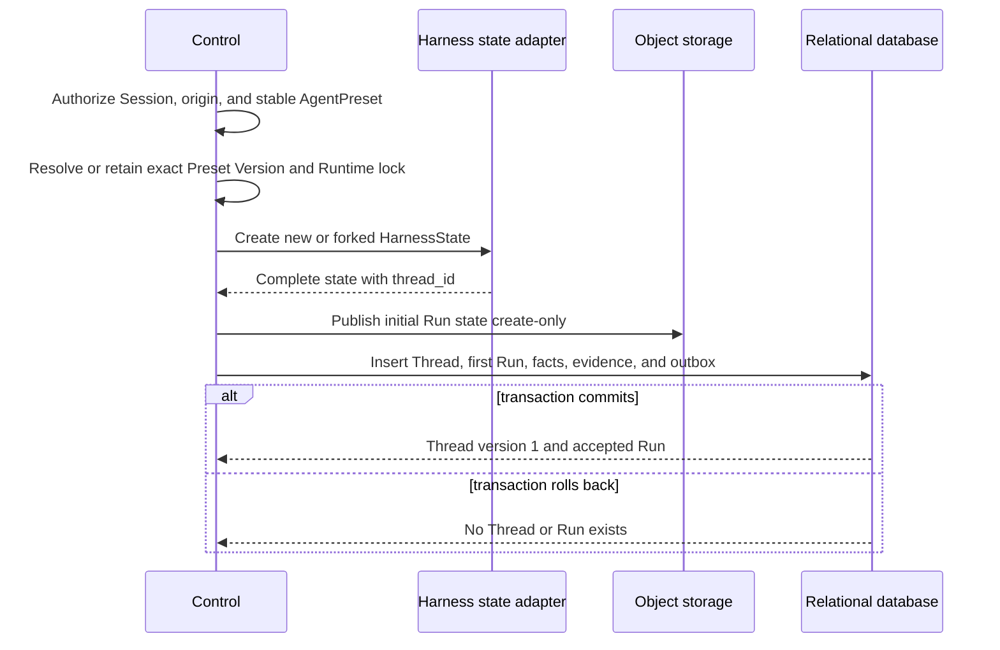

# Durable Thread Persistence

## Design Position

Foundation persists every hosted `Thread` as an independent versioned relational resource. The Thread row is the authority for Session membership, Thread origin, the most recently accepted Run, the selected continuation head, compare-and-swap serialization of accepted advancement, and an independent queue revision. A Thread is not a grouping inferred from Run timestamps or a `thread_id` copied into otherwise unrelated rows.

The shared [Platform Interaction Model](../interaction-model.md) owns the cross-platform meaning of Thread. The Harness owns creation and preservation of the matching `HarnessState.thread_id`. Foundation stores that exact ID rather than generating a parallel Host Thread identity. [Durable Run State](14-run-persistence.md) owns Run fields, state objects, parent edges, and outcomes; this contract owns which Run is current for a Foundation Thread and which sealed Run is selected as its continuation head. Whether the current Run is active derives from its own status rather than another stored Thread pointer.

Foundation never creates an empty Thread. Root, fork, and child acceptance each create one Thread together with its first Run, initial complete Run state, idempotency evidence, lifecycle facts, and outbox intents. Later immediate submission, queued-submission consumption, authenticated feedback, and retry acceptance create another Run and advance the existing Thread under its current version; queue-only admission does not.

## Boundaries

| Concern                                                                   | Owner                                                                               | Contract                                                                                                                                    |
| ------------------------------------------------------------------------- | ----------------------------------------------------------------------------------- | ------------------------------------------------------------------------------------------------------------------------------------------- |
| Session, Thread, Run, and Item meaning                                    | [Platform Interaction Model](../interaction-model.md)                               | Defines identity and cross-platform relationships                                                                                           |
| `thread_id` creation, preservation, and fork transformation               | [Harness State](../agent-harness/10-snapshot-and-resume.md)                         | Supplies one stable ID inside complete continuation state                                                                                   |
| Durable Thread resource, versions, origin, current Run, and selected head | This contract                                                                       | Serializes Foundation Thread advancement and queued-submission mutation and supplies read authority                                         |
| Persisted Session membership and root selection                           | This contract                                                                       | Requires one existing Session container and exactly one retained root Thread; other Session product metadata remains outside the Thread row |
| Run row, state object, parent edge, scheduling, and outcome               | [Durable Run State](14-run-persistence.md)                                          | Owns one accepted advancement and its resumable state                                                                                       |
| RunAttempt lease, generation, and stale-writer fence                      | [Durable Run Attempt Persistence](15-run-attempt-persistence.md)                    | Authorizes worker mutation of the current Run while it is active                                                                            |
| Agent invocation and advancement commands                                 | [Agent Control: Input and Continuation](34-agent-control-input-and-continuation.md) | Accepts start, existing-Thread continuation, atomic waiting feedback, fork, and retry                                                       |
| Queue-if-busy ordinary input                                              | [Agent Control: Queued Submissions](36-agent-control-queued-submissions.md)         | Owns immediate-versus-queued admission, queue rows, ordering, editing, and atomic consumption into a Run                                    |
| Thread inbox entries, steer, interrupt, and control wakeups               | [Agent Control: Active Execution](35-agent-control-active-execution.md)             | Persists kind-owned inbound work separately from the Thread row and keeps Redis cursors outside relational state                            |
| Public resource catalog and wire read models                              | [Management API](21-management-api.md)                                              | Exposes authorized Thread reads and common API behavior                                                                                     |
| Agent-facing history retrieval                                            | [Agent Interaction Retrieval](22-agent-interaction-retrieval.md)                    | Projects authorized Thread and Run data without becoming authority                                                                          |

A Thread row contains no message history, Thread inbox payload, Harness state, Item payload, provider state, credential, worker lease, queue entry, Redis consumer-group cursor, replay cursor, or live process object. Those values retain their owning stores and lifecycles.

## Durable Thread Model

The following schema is conceptual. It defines durable field meaning rather than a public wire representation or concrete ORM class.

```python
type ThreadRole = Literal["root", "child"]
type ThreadOriginKind = Literal["new", "fork", "child"]


class Thread:
    id: str
    version: int
    queue_version: int
    tenant_id: str
    session_id: str

    role: ThreadRole
    origin_kind: ThreadOriginKind
    origin_thread_id: str | None
    origin_run_id: str | None

    head_run_id: str | None
    current_run_id: str

    created_at: datetime
    updated_at: datetime
```

`id` equals the `thread_id` in the Thread's first complete `HarnessState` and in every later Run state for that Thread. It retains the Harness-owned `thread-` format and is not re-encoded as another Foundation identifier. The ID grants no authority.

`version` is the positive Foundation domain-object version. It starts at `1` when the Thread and first Run commit and increases by one for every accepted Thread advancement and every transition that seals the current Run. Idempotent replay resolves before comparing an expected version. Claim, execution, and worker recovery inside the same current Run use the Run's own version and do not change the Thread version. A state-first combined completion and queued successor acceptance applies both logically ordered changes in one transaction and therefore increments `version` by two.

`queue_version` is a non-negative revision of the Thread's queued-submission collection. It starts at `0` and increases for every add, edit, delete, reorder, or consume mutation. Queue-only mutation does not change `version`, `current_run_id`, or `head_run_id`. Consuming an entry increments both `queue_version` and `version` because the same transaction changes the queue and accepts another Run. When that consumption is combined with completion of the prior current Run, `queue_version` still increments once while `version` increments twice: once for the seal and once for the advancement.

`session_id`, `role`, origin fields, and `created_at` are immutable. Exactly one Thread with `role="root"` belongs to a retained Session. A child Thread remains inside its parent's Session. A Session fork creates a new Session whose root Thread has `origin_kind="fork"`; an in-Session fork creates a child Thread with the same origin kind.

Origin fields preserve structural provenance without granting authority or replacing Run state lineage:

| Origin  | Required fields                                                        | Meaning                                                                         |
| ------- | ---------------------------------------------------------------------- | ------------------------------------------------------------------------------- |
| `new`   | Both origin references absent; role is `root`                          | New Session root with no source history                                         |
| `fork`  | `origin_thread_id` and completed `origin_run_id` present               | New history initialized through `HarnessState.fork()` from the exact source Run |
| `child` | Parent `origin_thread_id` and `origin_run_id` present; role is `child` | Host-managed child history caused by the selected parent Run                    |

`origin_run_id` is the source Run for a fork and structural cause for a child. Only a fork uses that source as its first Run's state parent. A child that starts with empty history has a root Run with `parent_run_id=null`; its structural relationship remains in the Thread origin and child relationship records.

### Head and Current Runs

The two Run references have distinct meanings:

| Field            | Meaning                                                                                                                                                       |
| ---------------- | ------------------------------------------------------------------------------------------------------------------------------------------------------------- |
| `head_run_id`    | Exact sealed `waiting` or `completed` Run whose frozen state is the currently selected continuation head; null until the Thread first selects such an outcome |
| `current_run_id` | Most recently accepted Run, regardless of whether it is active, waiting, completed, failed, or cancelled; always present                                      |

Foundation never derives either value from timestamps, event order, object listings, or replay data. Both references name Runs with the same `tenant_id`, `session_id`, and `thread_id` as the Thread row.

The current Run's status supplies the Thread's current execution and latest outcome projection. A current Run in `accepted` or `running` is the Thread's sole active Run. A current Run in `waiting`, `completed`, `failed`, or `cancelled` is sealed and the Thread has no active Run. The Thread stores no separate status or active-Run pointer. Intermediate claim and recovery transitions remain Run lifecycle facts and do not advance the Thread version.

Existing-Thread acceptance sets `current_run_id` to the new Run. Ordinary Continue, Feedback, Retry, and queued-submission consumption preserve the prior head. When that head is null after a failed or cancelled current Run, Continue or queue consumption can accept a root-like Run and preserve the null head until the successor seals. Continue From instead sets `head_run_id` to its explicit completed source in the same transaction that creates the new Run; ordinary Continue and Feedback already use the selected head, so applying the same rule would not change their visible head selection. A `waiting` or `completed` outcome requires that the sealing Run is still current at transaction entry and selects it as `head_run_id`. An ordinary seal also retains it as `current_run_id` and advances the Thread version once. A completed outcome using the queued-submission contract's [state-first combined handoff](36-agent-control-queued-submissions.md#completion-time-combined-handoff) instead inserts an already-state-backed successor, leaves the completed source as head, selects the successor as current, advances the Thread version twice, and advances the queue version once in the same transaction. A `failed` or `cancelled` outcome likewise requires the current Run, retains it as `current_run_id`, preserves the prior head, and advances the Thread version.

`head_run_id` selects an eligible frozen state base, not a generic permission to submit any input. A completed head can serve ordinary continuation. A null head after a failed or cancelled current Run permits root-like acceptance with empty state in the same Thread. A waiting head can serve only the exact authenticated feedback or other operation allowed by its pending-state contract. Authorization, consumed pending facts, compatibility, and operation-specific policy remain independently required.

This separation lets the [terminal-intent retry contract](34-agent-control-input-and-continuation.md#retry-of-terminal-intent) use the current failed or cancelled Run as its intent source while copying that Run's exact eligible `parent_run_id` and lineage transformation. The selected head normally names that same state base; an initial failed root or fork can have no local head. The terminal source never becomes an eligible parent.

## Relational Thread Table

The conceptual model materializes as one row in `threads`. Supported relational backends preserve the same validation and query semantics.

| Column group       | Columns                                                     | Relational contract                                                                                                      |
| ------------------ | ----------------------------------------------------------- | ------------------------------------------------------------------------------------------------------------------------ |
| Identity and scope | `id`, `version`, `queue_version`, `tenant_id`, `session_id` | `id` is the primary key; advancement version is positive; queue version is non-negative; Session membership is immutable |
| Origin             | `role`, `origin_kind`, `origin_thread_id`, `origin_run_id`  | Immutable validated provenance; origin references can cross Session only for an authorized Session fork                  |
| Advancement        | `head_run_id`, `current_run_id`                             | Same-Thread Run references updated only by accepted advancement or outcome commit                                        |
| Time               | `created_at`, `updated_at`                                  | UTC instants; `updated_at` follows authoritative Thread mutation, not stream activity                                    |

The relational contract preserves these constraints:

1. `(tenant_id, id)` is unique, and every Run has a same-tenant foreign key to its Thread.
2. `(tenant_id, session_id, id)` is unique, and every Thread references one persisted Session in the same tenant.
3. A partial unique constraint on `(tenant_id, session_id)` for `role="root"` enforces one root Thread per Session.
4. `current_run_id` is always present and names the most recently accepted same-Thread Run. `head_run_id` is null until a same-Thread Run seals as `waiting` or `completed`, and otherwise names only such a selected Run.
5. At most one Run per Thread is `accepted` or `running`; when such a Run exists it is `current_run_id`. The Run table's partial uniqueness constraint enforces the single-active rule.
6. Origin reference combinations match `origin_kind`; malformed or cross-tenant origins are rejected.
7. A committed Thread row and its first Run always exist together. Neither becomes independently visible without the other.
8. `queue_version` starts at zero, is non-negative, and changes only under the queued-submission mutation contract; consumption updates it in the same transaction that advances the Thread.

The accepted access paths are:

| Access path                        | Index or uniqueness contract                                             |
| ---------------------------------- | ------------------------------------------------------------------------ |
| Exact Thread read and version lock | Unique `(tenant_id, id)`                                                 |
| Session Thread listing             | `(tenant_id, session_id, created_at, id)`                                |
| Updated Thread listing             | `(tenant_id, session_id, updated_at, id)`                                |
| Queue mutation lock                | Unique `(tenant_id, id)` plus `queue_version`                            |
| Current or head Run join           | Same-tenant unique Run references stored on the Thread                   |
| Origin traversal                   | `(tenant_id, origin_run_id, id)` and `(tenant_id, origin_thread_id, id)` |
| One root Thread per Session        | Partial unique `(tenant_id, session_id)` for root role                   |

Run-table indexes for Worker claims, Run listing, search, and DAG traversal remain owned by the Run contract. They do not replace the Thread row or its version.

## Thread Creation

Thread creation is part of Run acceptance and has no standalone empty-resource operation.



Root creation validates Session policy and creates the Session root Thread. Fork creation authorizes and reads one exact completed source Run, applies the Harness fork transformation outside a database transaction, and records the source in both Thread origin and the first fork Run's `parent_run_id`. Child creation validates the current parent Run and RunAttempt fence, creates a distinct child Thread, and commits the child relationship with its first Run. Every creation sets `current_run_id` to that first accepted Run and leaves `head_run_id` null until the first waiting or completed outcome seals.

The initial state object and any object-backed input publish before the relational transaction. The transaction revalidates the exact state digest, Thread ID, Session, origin, idempotency evidence, and source Run version. If it rolls back, published objects are non-authoritative cleanup candidates.

## Reads and History Selection

An exact Thread read comes from `threads` under current authorization. It returns safe identity, advancement and queue versions, Session, role, currently authorized origin references, the head and current Run references, and timestamps. A concealed origin reference is omitted rather than exposing another Session or Run by possession. A Session Thread listing pages authorized Thread rows directly and can join the exact current Run for bounded current-status and latest-outcome summaries. It never groups Run rows to invent a Thread resource. Continuation eligibility comes from the selected head, its status, and the owning operation contract; it is not inferred from the current Run summary alone.

Thread Run listing filters authorized Run rows by the selected durable Thread identity. Exact lineage still starts from an explicitly selected Run and follows `parent_run_id`; `head_run_id` is a continuation selector, not a replacement for an explicit lineage head. Item and event replay remain separate projections and cannot repair or advance Thread state.

## Retention and Deletion

Foundation exposes no independent hard-delete mutation for a Thread. Session and interaction-retention policy can remove a Thread only after no retained Run, state object, queued submission, Thread inbox entry, Item, event, usage record, child relationship, fork origin, or idempotency evidence requires it. Expiry of the Thread's Redis control Stream and consumer group does not remove the Thread or its inbox. Removing presentation detail never removes the Thread row or changes its head.

A retained origin reference keeps the minimum safe source identity required by lineage policy. Retention can redact inaccessible content without rewriting Thread, Session, or Run identities or making an incomplete lineage appear complete.

## Security and Authorization

Every create, read, advance, queue mutation, fork, retry, feedback, and retention operation authorizes the Thread through its current tenant, Session, Workspace policy, and action. Origin and Run references grant no access by possession. A concealed Thread returns the same bounded not-found behavior as another concealed resource.

The Thread row contains correlation and control state only. It never exposes raw prompts, outputs, Harness state, pending payloads, credentials, provider state, private child content, or storage locators. Cross-Session fork validates both source read authority and destination mutation authority before publishing the new state.

## Failure Semantics

| Failure                                                                | Durable outcome                                                 | Retry or reconciliation                                                        |
| ---------------------------------------------------------------------- | --------------------------------------------------------------- | ------------------------------------------------------------------------------ |
| Authorization, origin, parent, or version validation fails             | No Thread or Run mutation                                       | Caller refreshes authority or resource version                                 |
| Initial state publication fails                                        | No Thread or Run is accepted                                    | Retry with the same idempotency key                                            |
| State publishes but relational creation or advancement rolls back      | Existing Thread is unchanged; new objects are non-authoritative | Same-key retry or orphan cleanup after ownership proof                         |
| Response is lost after commit                                          | Thread and Run may already exist                                | Repeat the same idempotency key and canonical request                          |
| Concurrent advancement wins                                            | Losing request changes nothing                                  | Read the current Thread and decide against its new version and head            |
| Current Run seals while another command uses an older version          | Sealing wins and increments Thread version                      | Stale command conflicts and rereads the Thread                                 |
| Combined completion and queued acceptance loses any final precondition | No part of that combined transaction mutates the Thread         | Re-evaluate ordinary completion; later terminal recovery can consume the queue |
| Referenced head or current Run is missing or mismatched                | Thread fails closed as relational corruption                    | Readiness or repair restores a verified consistent relational state            |
| Stale RunAttempt tries to seal a non-current Run or select a head      | Mutation is fenced and rejected                                 | Current RunAttempt or transactional Worker takeover owns the transition        |

## Compatibility

Thread identity, Session membership, role, origin meaning, advancement and queue-version semantics, and the meanings of the head and current Run references are durable API compatibility facts. Changing any of those meanings requires an incompatible API contract and a reviewed relational migration.

Adding safe read-only fields or indexes is compatible when authorization, ordering, version checks, and mutation semantics remain unchanged. Storage query shape, ORM organization, and transaction helper boundaries remain private implementation details.

## Trade-offs

The independent Thread row duplicates relationships that are also present on Run rows and requires atomic cross-row updates at acceptance and outcome commit. Foundation accepts that cost to provide one explicit owner for Thread existence, Session membership, optimistic concurrency, current-Run selection, and continuation-head selection. Reads join the current Run to derive execution and latest-outcome state instead of maintaining another mutable active pointer. Run rows remain the immutable work and state DAG; the Thread row is a compact mutable selector rather than another transcript or checkpoint store.

## Invariants

01. Every Foundation Thread is one independently versioned relational resource and belongs to exactly one persisted Session.
02. A Thread is created atomically with its first Run and never exists as an empty resource.
03. Thread ID equals the stable `HarnessState.thread_id` for every Run state in that Thread.
04. Exactly one retained root Thread belongs to a Session; child and fork histories use distinct Thread IDs.
05. `current_run_id` always names the most recently accepted Run and is never inferred from time or event order; it is the sole active Run exactly while its status is `accepted` or `running`.
06. `head_run_id` is null until the Thread selects a sealed waiting or completed Run and never names a failed or cancelled Run.
07. Thread version changes once on accepted advancement and once whenever the current Run seals; a combined completed seal and queued acceptance applies both increments in one transaction, while claim, execution, worker recovery, and queue-only mutation do not change it.
08. Ordinary continuation uses the exact selected completed head as `parent_run_id`, except that a null head after a failed or cancelled current Run permits root-like acceptance with no parent; Continue From atomically reselects its exact completed historical source as head while creating the successor; feedback uses the exact waiting head, retry copies its terminal source's eligible state-parent edge, and fork and child creation apply their explicit owning contracts.
09. Idempotency replay resolves before `expected_thread_version`, and a losing concurrency check changes neither Thread nor Run state.
10. No Thread mutation transaction spans Harness execution, object I/O, provider calls, Redis, streaming, sleeps, or other external work.
11. Thread identity, origin, Run references, cursors, and object locators grant no authority by possession.
12. Run state, Items, events, provider state, and presentation history never substitute for the durable Thread row.
13. Thread inbox rows and Redis control-group cursors remain separate from the Thread resource; neither changes current-Run or continuation-head meaning.
14. `queue_version` changes on every queued-submission mutation; consuming an entry atomically increments the queue version and creates one accepted Run. It increments the advancement version once, or twice when the same transaction also seals the completed source; no queue-only mutation creates a Run.
15. A state-first combined handoff can atomically select a completed source as head and an accepted queued successor as current. If that path is unavailable, terminal Thread state and a non-empty queue can coexist until recovery drain or while consumption validation is blocked; direct Continue never bypasses that queue.
