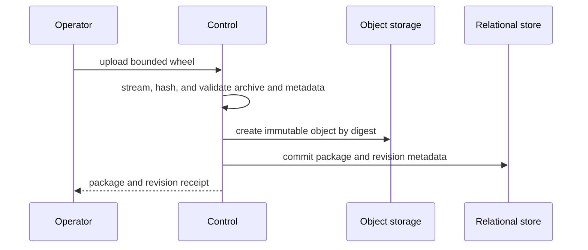

# Harness Plugin Artifacts and Runtime Loading

## Design Position

Foundation can manage trusted Harness plugins without baking them into the
Foundation image. An authenticated internal operator uploads one immutable
pure-Python wheel containing exactly one Harness plugin. Foundation stores the
plugin identity and revision metadata in the relational store and the wheel
bytes in object storage. A Worker materializes and imports an exact revision on
demand when an AgentRevision that locks that plugin is selected for work.

Managed-plugin availability is durable, but loaded-plugin state is not. Each
Worker keeps a process-local registry of the exact plugin revisions imported by
that interpreter. The registry is rebuilt on demand after process restart and
never becomes a relational resource, runtime generation, routing authority, or
AgentRevision field.

Runtime loading is additive. A Worker can import a previously unloaded plugin,
but it never unloads, reloads, or replaces an already imported plugin key,
distribution, or top-level package. Work requiring a conflicting revision is
left unclaimed for another Worker or for capacity created by ordinary Worker
replacement. Existing executables and active Runs retain their constructed
plugin graphs.

## Boundaries

| Concern                                                    | Owner                                                                     | Contract                                                                                                 |
| ---------------------------------------------------------- | ------------------------------------------------------------------------- | -------------------------------------------------------------------------------------------------------- |
| Plugin factory, configuration, construction, and runtime   | [Harness plugin system](../agent-harness/05-plugin-system.md)             | Loads one explicitly selected entry-point key and keeps each constructed executable graph fixed          |
| Package identity, wheel publication, digest, and retention | This document                                                             | Stores one trusted plugin per immutable wheel revision                                                   |
| Process-local materialization, import, and conflict checks | This document                                                             | Loads exact revisions on demand and never treats process memory as durable authority                     |
| Relational and object capabilities                         | [Foundation storage](03-storage.md)                                       | Supplies metadata authority and immutable artifact bytes                                                 |
| Agent plugin configuration and dependency locks            | [Agent revisions](12-agent-revisions-and-reconstruction.md)               | Freezes the exact package revision and digest for every enabled managed plugin                           |
| Turn claim, lease, and recovery                            | [Scheduling](16-scheduling-workers-and-recovery.md)                       | Lets a Worker decline incompatible work before claim and preserves durable eligibility                   |
| Worker process replacement and replica count               | Deployment                                                                | Supplies fresh interpreters when loaded revisions conflict; it does not become plugin lifecycle state    |
| Foundation distribution capabilities and schema            | [Distribution composition](02-distribution-composition-and-extensions.md) | Remains fixed by the service artifact; a plugin cannot add Foundation routes, tables, or role components |

Managed Harness plugins do not replace direct trusted plugins reconstructed by
an adapter, Connector Providers, Environment providers, Capabilities, Tools, or
distribution extensions. Foundation persists no plugin object, factory class,
arbitrary Python import target, loaded-plugin registry, or import path.

## Package and Revision Model

`HarnessPluginPackage` is the stable deployment-scoped identity of one managed
Harness plugin. Its plugin key, normalized Python distribution name, and Python
top-level package are immutable and unique. It is created by the first accepted
revision upload and is not owned by an Organization or Workspace.

`HarnessPluginPackageRevision` is one immutable wheel for that package. A
revision exists only after the complete non-executing validation succeeds and
the immutable object is published.

The following schemas are conceptual:

```python
class HarnessPluginPackage:
    id: HarnessPluginPackageId
    plugin_key: str
    distribution_name: str
    top_level_package: str
    created_at: datetime
    created_by_operator: str


class HarnessPluginPackageRevision:
    id: HarnessPluginPackageRevisionId
    package_id: HarnessPluginPackageId
    plugin_key: str
    distribution_name: str
    distribution_version: str
    top_level_package: str
    wheel_sha256: str
    wheel_size_bytes: int
    expanded_size_bytes: int
    object_ref: ObjectRef
    requires_python: str | None
    required_distributions: tuple[str, ...]
    created_at: datetime
    created_by_operator: str
```

The revision projection repeats package identity fields for bounded API reads;
the stable package row remains their relational authority. The exact wheel
metadata contains one `a13n_harness.plugins` entry point whose name equals
`plugin_key` and whose module is inside `top_level_package`. Its import target
is derived from the verified wheel at runtime and is never accepted from an API
request, AgentRevision, or relational execution field.

The normalized `(distribution_name, distribution_version)` pair identifies one
exact SHA-256 digest. Uploading the same pair and digest returns the existing
revision. Uploading the same pair with different bytes conflicts. A new package
release creates another revision under the same package identity.

## Relational Schema

The common Foundation schema adds two tables:

| Table                              | Columns                                                                                                                                                                                                    | Contract                                                          |
| ---------------------------------- | ---------------------------------------------------------------------------------------------------------------------------------------------------------------------------------------------------------- | ----------------------------------------------------------------- |
| `harness_plugin_packages`          | `id`, `plugin_key`, `distribution_name`, `top_level_package`, `created_at`, `created_by_operator`                                                                                                          | Stable one-plugin identity; all columns are immutable             |
| `harness_plugin_package_revisions` | `id`, `package_id`, `distribution_version`, `wheel_sha256`, `wheel_size_bytes`, `expanded_size_bytes`, `object_ref`, `requires_python`, `required_distributions_json`, `created_at`, `created_by_operator` | Immutable artifact metadata; wheel bytes remain in object storage |

The relational contract preserves these constraints:

1. Package `id`, `plugin_key`, normalized `distribution_name`, and
   `top_level_package` are independently unique.
2. A revision's `package_id` is a non-null foreign key to
   `harness_plugin_packages.id`.
3. `(package_id, distribution_version)` identifies at most one revision. Since
   every package owns one unique normalized distribution name, a distribution
   name and version also resolve to at most one revision.
4. `wheel_sha256` and `object_ref` each identify one immutable wheel object.
5. Compressed and expanded sizes are positive and remain within the fixed
   upload limits.
6. `required_distributions_json` is a canonical bounded array of normalized
   `Requires-Dist` declarations and contains no credential or package-index
   location.
7. Package and revision rows are never updated in place. A revision cannot be
   deleted while an AgentRevision or retained non-terminal Turn depends on it.

There is no `plugin_runtime_generations`, `plugin_runtime_bindings`, or durable
Worker-loaded-plugin table. An AgentRevision's owning persistence stores its
exact package-revision lock and digest under the
[Agent revision contract](12-agent-revisions-and-reconstruction.md).

## Internal Operator API

The internal operator surface is served by the `control` and `all` roles under
`/internal/v1`. It is excluded from the public `/api/v1` contract, public
OpenAPI, Foundation SDKs, remote CLI, tenant RoleBindings, and browser sessions.
The selected distribution exposes it only when a deployment-owned operator
authenticator is configured.

The minimum operations are:

| Operation                                                | Contract                                                                                                              |
| -------------------------------------------------------- | --------------------------------------------------------------------------------------------------------------------- |
| `POST /internal/v1/harness-plugin-package-revisions`     | Accepts one bounded wheel, validates and publishes it, and returns the stable package plus immutable revision receipt |
| `GET /internal/v1/harness-plugin-package-revisions/{id}` | Reads safe package and revision metadata; it never returns code through a public content URL                          |

Creates follow the shared durable idempotency and unknown-response contract.
Operator audit records contain only safe operator identity, package and revision
identity, digest, action, and outcome. They contain no wheel body, import target,
credential, or private cache path.

```python
class HarnessPluginUploadReceipt:
    package: HarnessPluginPackage
    revision: HarnessPluginPackageRevision
    already_available: bool
    existing_worker_processes_changed: Literal[False]
```

Uploading a revision makes an exact artifact available for AgentRevision
selection. It does not import code, mutate a Worker, activate a global runtime,
or prove that current Worker capacity can load that revision.

## Wheel Contract and Validation

One upload contains exactly one standards-conforming pure-Python
`py3-none-any` wheel. Foundation performs no source build, package-index lookup,
runtime `pip install`, or transitive dependency download.

The wheel contains one regular non-namespace top-level Python package and
exactly one entry in the `a13n_harness.plugins` group. The entry-point name is
the stable `plugin_key`; its target module is the top-level package or one of
its descendants. The wheel contains no other Agent Foundation extension entry
point, native extension, executable `.pth` file, second import package, or
wheel data relocation that would mutate an ambient environment.

A conforming source package has this shape:

```text
acme-audit-plugin/
├── pyproject.toml
└── src/
    └── acme_harness_audit/
        ├── __init__.py
        ├── factory.py
        ├── plugin.py
        └── configuration.py
```

Its packaging metadata registers one factory:

```toml
[project]
name = "acme-audit-plugin"
version = "1.2.0"
requires-python = ">=3.13"
dependencies = ["a13n-harness"]

[project.entry-points."a13n_harness.plugins"]
"acme.audit" = "acme_harness_audit.factory:AuditPluginFactory"

[tool.hatch.build.targets.wheel]
packages = ["src/acme_harness_audit"]
```

The resulting wheel contains the one import package and its one metadata root:

```text
acme_harness_audit/
├── __init__.py
├── factory.py
├── plugin.py
└── configuration.py
acme_audit_plugin-1.2.0.dist-info/
├── METADATA
├── WHEEL
├── entry_points.txt
└── RECORD
```

The entry point loads a concrete `HarnessPluginFactory` subclass with a safe
no-argument constructor. The factory's `plugin_key()` equals the entry-point
name and `create_plugin()` returns an `AbstractHarnessPlugin` whose `plugin_id`
equals the supplied `HarnessPluginFactoryContext.plugin_id`. Module import and
factory construction perform no external I/O, start no task or thread, open no
resource, and mutate no process-global state outside ordinary module definition.

The fixed artifact limits are:

| Limit                               | Maximum |
| ----------------------------------- | ------: |
| Uploaded wheel bytes                |  50 MiB |
| Total declared expanded bytes       | 200 MiB |
| One archive member's expanded bytes |  64 MiB |
| Archive members                     |  10,000 |

The service streams the request while enforcing the compressed limit and
computing SHA-256. Before publication it rejects malformed ZIP structure,
encrypted members, duplicate member names, absolute or parent-traversing names,
links and non-regular entries, invalid UTF-8 metadata, size declarations above
the limits, missing or multiple distribution metadata roots, invalid `WHEEL`,
`METADATA`, `entry_points.txt`, or `RECORD`, and every violation of the
single-plugin package shape.

`Requires-Python` includes the Foundation Worker's Python 3.13 runtime. Every
declared `Requires-Dist` dependency is already present in the reviewed Worker
release and satisfies its installed version. Plugin-owned modules live beneath
the unique top-level package; the wheel does not vendor another top-level
dependency, and that package name does not collide with a package already owned
by the reviewed Worker runtime. A plugin requiring a new third-party or native
dependency requires a reviewed Worker image change before its revision can be
selected.

Passing archive validation proves package structure and integrity only. It does
not execute or trust-evaluate plugin code.

## Publication and Durable Storage

Upload follows the external-I/O boundary from
[Durable Operations and Outbox](06-durable-operations-and-outbox.md):



No relational session or transaction spans request streaming, archive
inspection, or object-store I/O. The final object is published create-only and
addressed internally by SHA-256. A retry reconciles an existing object, package,
and revision by identity and digest. A cancelled or failed upload creates no
revision; staged or unreferenced objects are safe reconciliation and
garbage-collection candidates.

The relational revision and digest are selection authority. Object storage owns
the immutable bytes. Worker-local files are derived cache and never become
artifact, AgentRevision, Turn, or execution authority.

## Worker On-Demand Loading

A Worker does not choose a plugin set at startup. When a dispatch signal names
an eligible Turn, the Worker reads the exact AgentRevision and managed-plugin
locks in bounded relational sessions, closes those sessions, and ensures that
each required revision can be loaded before claiming the Turn.

The process-local registry is conceptually a mapping from `plugin_key` to this
immutable loaded provenance:

```python
class LoadedHarnessPlugin:
    package_revision_id: HarnessPluginPackageRevisionId
    plugin_key: str
    distribution_name: str
    distribution_version: str
    top_level_package: str
    wheel_sha256: str
    factory_registration: HarnessPluginFactoryRegistration
```

The registry also indexes distribution and top-level-package identity for
collision detection. It retains factory provenance, not a concrete plugin
instance; each Agent definition receives freshly constructed plugin instances.

For each required plugin, the Worker performs this process-local sequence under
a lock that serializes import-path publication and factory discovery:

1. compare the exact package revision ID and SHA-256 digest with the
   process-local loaded-plugin registry;
2. reuse the loaded factory provenance when the exact revision already matches;
3. decline the Turn without claiming it when the same plugin key, distribution,
   or top-level package is already pinned to another revision;
4. otherwise materialize the exact wheel into a content-addressed local cache,
   revalidate its digest and package shape, and publish its extracted package
   and metadata root atomically to the Worker's dedicated import search path;
5. invalidate Python's import caches, discover the exact entry point through
   Harness metadata discovery, and build the selected Harness factory catalog;
6. verify the actual plugin key, distribution name and version, factory class,
   import module, and wheel digest against the durable package revision; and
7. record the verified revision and `HarnessPluginFactoryRegistration` in the
   process-local registry.

The Worker derives the import target only from the verified wheel entry point.
It never calls an arbitrary `module:object` value obtained from an Agent, API
request, queue message, or database execution field.

After exact plugin preflight succeeds, the Worker claims the Turn under the
ordinary lease and fence contract. Agent-specific plugin construction occurs
after claim: Foundation supplies the locked Harness plugin document through an
explicit `HarnessBuildContext`, and a new `HarnessBuilder` constructs fresh
plugin instances for that Agent definition. Reusing a loaded distribution and
its verified factory provenance never shares a concrete plugin instance between
Agent definitions.

The loaded-plugin registry is process-local and monotonic. It is cleared by
process exit, is not restored from telemetry, and is not written to PostgreSQL,
Redis, object storage, or queue messages. Worker logs and metrics may report
bounded loaded provenance, but those observations never become routing or
execution authority.

If target import or factory validation fails after the import path is published,
the Worker fails readiness and terminates after bounded cleanup. It does not
continue serving from an interpreter that may contain a partially imported
module. Because preflight precedes claim, the Turn remains durable and
unclaimed.

## Worker Cache and Version Conflicts

Each Worker owns a confined local content-addressed cache with a configured byte
budget. Cache identity includes the verified wheel SHA-256. Download uses a
temporary location and publishes an extracted entry atomically only after
verification succeeds.

Every artifact whose target entered the interpreter is pinned for that
process's lifetime because Python may import another module from it later.
Eviction removes only verified cache entries that have never been imported by
the current process. Cache loss never deletes the durable object or changes an
AgentRevision lock.

One Worker can accumulate distinct plugin keys over time. It cannot serve two
revisions that share a plugin key, distribution name, or top-level package.
Workers in separate interpreters may pin different revisions concurrently; no
durable runtime generation groups them. If all current Workers conflict with an
eligible Turn, the Turn remains eligible while the deployment starts or
recycles capacity. The scheduler never substitutes another plugin revision.

## Agent Selection and Execution

Agent materialization resolves every enabled managed `plugin_key` to one
explicit `HarnessPluginPackageRevisionId` and copies that ID and its SHA-256
digest into the immutable AgentRevision dependency lock. It never resolves an
unqualified `latest`, package name similarity, module path, or artifact URL.

Turn acceptance verifies that every locked revision remains retained and is
structurally compatible with the selected Foundation, Python, and Harness
releases. It does not require a global plugin activation record or prove that a
specific Worker process is immediately available. A TurnAttempt does not store
a plugin runtime generation ID; the Turn's exact AgentRevision owns the durable
plugin locks, and `worker_generation` identifies the process that verified and
executed them.

Publishing another revision never mutates an AgentRevision, accepted Turn,
loaded Worker, existing executable, or active Run. A new AgentRevision may lock
the new package revision. Old and new revisions coexist only in compatible
Worker processes whose independent in-memory registries reflect what each
interpreter actually imported.

## Failure Semantics

| Failure                                                              | Outcome                                                                                                |
| -------------------------------------------------------------------- | ------------------------------------------------------------------------------------------------------ |
| Upload exceeds a bound or wheel validation fails                     | No package revision is created; staged bytes are cleaned or reconciled                                 |
| Object publication succeeds but relational commit is unknown         | Retry or read by digest; never publish another semantic revision blindly                               |
| Existing package identity conflicts with wheel metadata              | Upload fails; the stable package identity is unchanged                                                 |
| Same distribution name and version has another digest                | Upload conflicts; the existing revision remains authoritative                                          |
| Worker already imported a conflicting revision                       | Worker declines the Turn before claim; durable work remains eligible for another or replacement Worker |
| Pre-import digest, dependency, or metadata mismatches                | Worker does not claim the Turn and discards the unimported cache entry                                 |
| Plugin target import, factory validation, or loaded provenance fails | Worker becomes unready and terminates; no TurnAttempt is created                                       |
| Agent-specific plugin construction fails                             | Claimed Turn fails before Harness execution under the reconstruction contract                          |
| Cache has no evictable capacity                                      | Worker does not claim the Turn; no pinned or durable artifact is deleted                               |
| Compatible Worker capacity is unavailable                            | Turn remains durable and eligible; no other revision is substituted                                    |
| Forced shutdown interrupts active work                               | Ordinary TurnAttempt lease-loss and unknown-outcome recovery apply; it is not a plugin reload success  |

## Security and Compatibility

The internal upload operation is executable-code deployment authority. Tenant
User, Service Account, Builder, Workspace Admin, Organization Admin, Agent
input, model output, plugin configuration, and identifier possession never
grant it. Uploaded code is trusted in-process Python and receives the authority
of the Worker process. Validation and exact digests prevent accidental or
unauthorized selection; they do not sandbox the plugin.

Wheel format, size limits, digest algorithm, stable package identity,
package-revision identity, one-plugin entry-point shape, AgentRevision lock
semantics, and additive process-local loading are compatibility facts. Cache
layout, eviction algorithm, download buffer size, process-local lock
implementation, and object-key layout remain implementation-private when they
preserve these facts.

## Trade-offs

On-demand loading avoids a durable deployment-generation resource and lets a
Worker serve any exact plugin it has not yet conflicted with. The cost is that
Worker compatibility is process-local rather than centrally routable. A mixed
workload can pin different Workers to different revisions, and deployment may
need to recycle capacity when every live interpreter has an incompatible
revision.

Restricting each upload to one pure-Python plugin whose dependencies already
exist in the reviewed Worker runtime excludes arbitrary binary and dependency
bundles. It keeps runtime loading bounded, portable, offline, identifiable from
standard wheel metadata, and independent from package indexes or another
environment solver.

## Invariants

01. One managed wheel contains exactly one Harness plugin entry point and one unique top-level Python package.
02. Plugin wheel bytes live in immutable object storage; relational metadata and exact digests own selection; local files are cache only.
03. One package identity owns one plugin key, normalized distribution name, and top-level package for all revisions.
04. One distribution name and version denotes one SHA-256 digest.
05. Upload and archive inspection never hold a relational transaction open.
06. An AgentRevision locks an exact package revision and digest; no worker substitutes a newer or similarly named artifact.
07. A Worker derives the import target from the verified wheel and loads managed plugins only on demand for exact AgentRevision locks.
08. Loaded-plugin state is process-local, monotonic, and non-durable.
09. A Worker never unloads, reloads, or replaces an imported plugin key, distribution, or top-level package.
10. A conflicting Worker declines work before claim; plugin import failure terminates the affected Worker rather than preserving a partially imported interpreter.
11. Cache eviction never removes an artifact imported by the current process and never changes durable availability.
12. Internal operator authority is separate from tenant IAM roles and public Foundation clients.
13. Harness and managed plugins execute in the same Worker process; Foundation introduces no per-plugin execution service or remote-plugin protocol.
