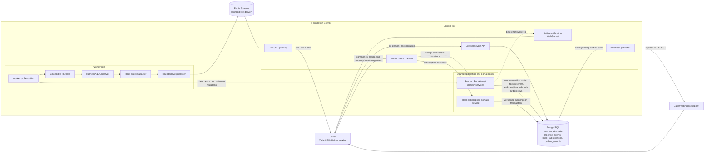
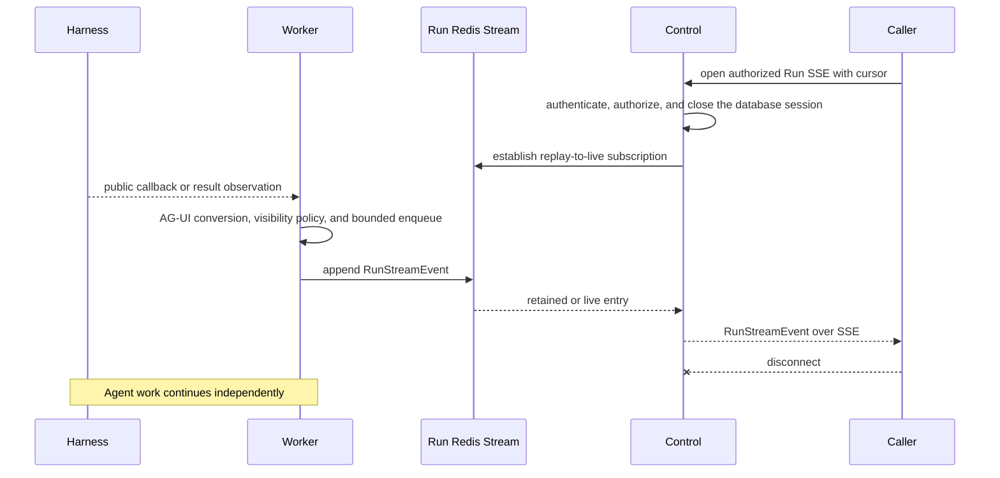
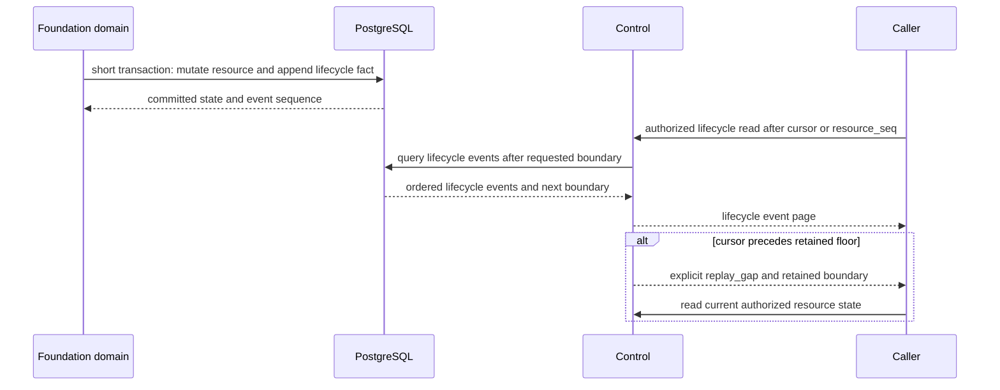
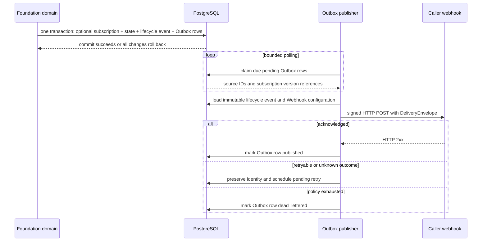

# Foundation Hook Notifications

## Design Position

A Foundation hook is a stable, filterable notification name for an existing Foundation fact or public run observation. It is not a remote execution extension point, another Agent loop, or another lifecycle authority. The Worker embeds Harness in-process, consumes its public callbacks through `HarnessAguiObserver`, and combines those process-local observations with Foundation-owned lifecycle and projection sources.

Hook delivery preserves the authority of its source:

- a Harness or Environment-binding callback is a live observation;
- a Run or RunAttempt hook represents a committed relational lifecycle fact;
- an Item hook represents a presentation projection; and
- delivery acknowledgement records transport progress only.

No caller-supplied callback executes inside the Harness call stack. Foundation does not offer a synchronous remote pre-hook or post-hook protocol. A business decision that must stop Agent progress uses the owning authorization or deferred interaction contract rather than a blocking webhook.

## Overall Architecture



The shared-domain box is a logical code layer, not an independently deployed service. A `control` process invokes the Run and RunAttempt domain services in-process for Run acceptance and caller control commands, and invokes the Hook subscription service for subscription mutations. Inline creation composes both domain services inside the same short Run-acceptance transaction. A `worker` process invokes the same Run and RunAttempt contracts in-process for claim, fencing, Attempt transitions, and Run outcome commits. Separate roles coordinate through authoritative PostgreSQL records and do not call a Domain network endpoint. The `all` role loads both call paths in one process.

The Worker invokes Harness through its public process-local API rather than a Foundation SDK or network hop. The Hook source adapter assigns Foundation correlation and routing names without changing the meaning of an AG-UI event. The [Lifecycle and Stream Persistence](23-lifecycle-and-stream-persistence.md) contract owns PostgreSQL lifecycle facts and the Run-scoped Redis Stream. [Events, Interaction Projection, Usage, and Delivery](24-events-usage-and-delivery.md) owns the common delivery envelope and source-authority separation. [Durable Operations and Outbox](06-durable-operations-and-outbox.md) owns reliable external publication. [Native Streaming and Notifications](21-native-streaming-and-notifications.md) owns Run SSE, Workspace lifecycle event reads, and the best-effort Native notification WebSocket. Those three surfaces keep their own envelopes, filters, cursors, and delivery guarantees.

The diagram contains no database-to-caller push path. Control reads `lifecycle_events` only when a caller invokes the event API. It does not poll the lifecycle table for new hooks. The only PostgreSQL polling loop shown is the Webhook publisher claiming `pending` Outbox rows. Ordinary resource or large-content retrieval is outside this Hook contract.

An Outbox is the PostgreSQL `outbox_records` table, not another middleware service. When active Webhook subscriptions match a Run or RunAttempt transition, the owning short transaction writes the state change, immutable lifecycle event, and one Outbox row per destination together. Data is not copied from PostgreSQL into a later Outbox process; the Outbox row is part of the original atomic commit. A Webhook publisher is a bounded background task in a `control` or `all-in-one` process. It claims due Outbox rows, loads their immutable lifecycle source and destination configuration, performs the signed HTTP POST outside the database transaction, and then records success, retry, or dead-letter state in another short transaction.

## Boundaries and Hook Model

| Concern                                                | Owner                                | Hook relationship                                               |
| ------------------------------------------------------ | ------------------------------------ | --------------------------------------------------------------- |
| Model, tool, and Harness Run observation               | Harness and Pydantic AI              | Supplies process-local source observations                      |
| Harness-to-AG-UI conversion                            | Agent Stream Protocol                | Supplies standard AG-UI types and complete `CUSTOM` fallback    |
| Run and RunAttempt state                               | Foundation owning domain             | Supplies authoritative committed lifecycle facts                |
| Item state                                             | Foundation presentation projection   | Supplies live, non-lifecycle semantic units                     |
| Managed Environment state and backing-target lifecycle | Foundation Host and Provider adapter | Supplies bounded Run-local entry and finalization observations  |
| Environment adapter operations                         | Fresh process-local Environment      | Never makes a live observation durable authority                |
| Hook name registry and subscription matching           | This contract                        | Selects existing source semantics without changing them         |
| Transport, retry, and destination acknowledgement      | Foundation delivery                  | Never changes the source fact or Agent outcome                  |
| Caller business workflow                               | Caller                               | Reacts to notifications and reconciles from authoritative reads |

Every durable Hook delivery over Webhook uses the common `DeliveryEnvelope`. This contract owns the finite hook-name registry; the delivery contract owns the durable envelope fields and transport meaning. Native Run SSE uses `RunStreamEvent`, Workspace lifecycle reads use `LifecycleEvent`, and the notification WebSocket uses `NotificationFrame`; none is translated into the durable Hook envelope. Common correlation for durable Hook delivery includes the Workspace and, when applicable, Session, Thread, Run, RunAttempt, Harness Run, source, owning resource, resource sequence and version, schema version, occurrence time, subscription, and delivery identity. A field is absent rather than guessed when the source does not own it.

Hook names use lowercase dot-separated segments. Names beginning with `run.` and `run_attempt.` preserve the exact Foundation lifecycle-event names. Names beginning with `agui.` preserve the exact AG-UI event type in lowercase. A `CUSTOM` event retains its exact custom name and public payload rather than being translated into another Foundation event vocabulary.

### Durable Hook Subscriptions

Native delivery clients select resources and filters through their owning request or subscription protocol. An external Webhook instead uses a durable Workspace-scoped Hook subscription. The following schema is conceptual:

```python
class WebhookDestinationConfig:
    endpoint_url: str
    signing_secret_id: str
    signature_profile: Literal["hmac_sha256_v1"] = "hmac_sha256_v1"


class HookSubscription:
    id: str
    version: int
    workspace_id: str
    status: Literal["active", "paused"]
    hook_names: tuple[str, ...]
    session_id: str | None
    thread_id: str | None
    run_id: str | None
    webhook: WebhookDestinationConfig
    created_at: datetime
    updated_at: datetime


class CreateHookSubscriptionRequest:
    hook_names: tuple[str, ...]
    session_id: str | None
    thread_id: str | None
    run_id: str | None
    webhook: WebhookDestinationConfig


class InlineHookSubscriptionInput:
    hook_names: tuple[str, ...]
    webhook: WebhookDestinationConfig
```

`hook_names` is a non-empty bounded set of exact registry names. Scope filters are optional, tenant-consistent, and conjunctive. The authorized subscription read returns the configured endpoint URL and managed Secret reference, never the signing value. A Hook event and an Outbox record contain neither the callback URL nor a Secret value.

Durable Hook subscriptions have two creation paths that produce the same resource and versioned table record:

1. the Workspace management API accepts `CreateHookSubscriptionRequest` for a long-lived Workspace-, Session-, Thread-, or known-Run-scoped subscription; and
2. every input-bearing command that can accept a new Run can carry one optional `hook_subscription: InlineHookSubscriptionInput` for that exact new Run; an existing-Thread Run submission that queues retains this input without creating the resource until consumption accepts the Run.

The inline form does not accept caller-supplied scope IDs. Foundation assigns the accepted Run's `workspace_id`, `session_id`, `thread_id`, and `run_id` as conjunctive filters, creates one active `HookSubscription`, and returns its ID in the Run acceptance receipt. Callers that need multiple destinations or a subscription spanning later Runs use the management API instead.

Both forms accept exact `hook_names`, `endpoint_url`, `signing_secret_id`, and `signature_profile`. The signing value itself is never inline: the caller must be authorized to use the referenced managed Secret. The Foundation retry policy and delivery limits are service policy rather than caller-supplied destination parameters.

Foundation validates the inline Hook names, destination, Secret authority, and request bounds before immediate acceptance or queue admission. Queue admission stores the exact inline input as part of the queued Run intent but creates no HookSubscription or Outbox row. Queue editing revalidates the replacement input. At immediate or delayed Run acceptance, Foundation repeats current authorization and validation; in the final short acceptance transaction it inserts the first immutable subscription version before appending `run.accepted` and its matching Outbox row. Failure rolls back the subscription and Run together; no Webhook HTTP request runs in that transaction. The complete inline input participates in the submitting command's idempotency, so same-key replay returns the original immediate or queued outcome, while reuse with different Hook configuration conflicts.

To receive `run.accepted`, a managed subscription must already match when Run acceptance commits, or the command must supply the inline form. A known-Run subscription created through the management API after acceptance receives only later matching events because subscription changes are not retroactive.

Creating, changing, pausing, or deleting a subscription uses ordinary Workspace authorization and optimistic concurrency. Every mutation appends a new immutable version in `hook_subscriptions` and supersedes the prior current version. Workspace limits keep the active matching destination set bounded for every source. For a lifecycle event, the subscription version observed by the source transaction determines which Outbox rows are created. A later change does not alter an already committed Outbox row or retroactively deliver older sources. Authorized redrive reuses the original delivery identity and exact subscription version.

Subscription List and Get authorize `hook_subscription.read`; creation
authorizes `hook_subscription.create`; configuration or pause changes authorize
`hook_subscription.update`; deletion authorizes `hook_subscription.delete`; and
redrive authorizes `hook_subscription.redrive`. Exact Run-inline creation is the
only Runner-level create grant and still requires current authority for the
signing Secret. Long-lived creation and every later mutation require Builder or
Admin. The IAM
[stable action registry](32-identity-and-access-management.md#stable-action-registry)
owns these grants; subscription scope, Secret, destination, version, and source
eligibility remain additional checks owned here.

Only committed lifecycle events are eligible for durable Webhook subscription delivery. Live-only Run Stream entries, Items, token deltas, diagnostics, Environment-binding observations, and telemetry never create Outbox rows.

## Storage Model

Hook delivery introduces one Hook-owned relational table, `hook_subscriptions`, and uses the shared `outbox_records` table. It reuses the existing `lifecycle_events` source without redefining that schema. It adds no Hook-specific Redis key, object-storage object, notification table, or caller-owned persistence schema.

Both tables participate in the service's explicitly assembled [schema and migration graph](04-relational-schema.md). Runtime code never creates them opportunistically, and a Worker-only process verifies but never applies their migrations.

### `hook_subscriptions`

One table stores the subscription identity, exact Hook-name set, scope filters, and Webhook configuration. Configuration is versioned so an Outbox row can keep using the exact destination selected when its source event committed.

```python
type HookSubscriptionStorageStatus = Literal["active", "paused", "deleted"]


class HookSubscriptionRecord:
    version_id: HookSubscriptionVersionId
    id: HookSubscriptionId
    version: int
    workspace_id: WorkspaceId
    status: HookSubscriptionStorageStatus
    hook_names: tuple[str, ...]
    session_id: SessionId | None
    thread_id: ThreadId | None
    run_id: RunId | None
    endpoint_url: str
    signing_secret_id: SecretId
    signature_profile: Literal["hmac_sha256_v1"]
    subscription_created_at: datetime
    version_created_at: datetime
    replaced_at: datetime | None
```

`version_id` is the primary key for one immutable configuration version. `(workspace_id, id, version)` is unique, versions are positive and contiguous, and exactly one row per `(workspace_id, id)` has `replaced_at=null`. Creating a subscription inserts version `1`. Updating Hook names, filters, status, or Webhook configuration sets the prior current row's `replaced_at` and inserts the next version in one short transaction. A `deleted` current version is the retained tombstone and never matches a new event.

`hook_names` is stored as one bounded, duplicate-free JSON array. A GIN index on that field plus partial B-tree indexes over the current active Workspace and non-null Session, Thread, and Run filters support source-transaction matching. All filters are conjunctive and tenant-consistent.

Each version contains the callback URL but no URL user information or plaintext signing value. `signing_secret_id` is resolved through the managed Secret authorization boundary at delivery time. Ordinary reads project the current version as `HookSubscription`, with `created_at` from `subscription_created_at` and `updated_at` from `version_created_at`. Historical versions remain internal and retained while an Outbox row can still reference them.

### `outbox_records`

The shared Outbox table is the durable work queue claimed by Webhook publishers. Its complete state machine and generic retry rules are owned by [Durable Operations and Outbox](06-durable-operations-and-outbox.md#outbox-contract). A Hook delivery uses this exact specialization of the shared row, not another table:

```python
class HookOutboxRecord:
    id: DeliveryId
    source_kind: Literal["lifecycle_event"]
    source_id: LifecycleEventId
    destination_kind: Literal["webhook"]
    destination_ref: HookSubscriptionVersionId
    status: Literal["pending", "publishing", "published", "dead_lettered"]
    available_at: datetime
    claim_generation: int
    lease_expires_at: datetime | None
    attempt_count: int
    created_at: datetime
    updated_at: datetime
    published_at: datetime | None
    dead_lettered_at: datetime | None
    last_error_code: str | None
```

`source_id` references the immutable lifecycle event and `destination_ref` references the exact `hook_subscriptions.version_id` selected by matching. The Outbox row copies neither lifecycle payload nor callback configuration. The publisher derives the envelope from the lifecycle event and resolves the URL, Secret reference, and signature profile from that immutable subscription version.

`id` is the stable `delivery_id`. The tuple `(source_kind, source_id, destination_kind, destination_ref)` is unique, so a source-transaction retry cannot create a duplicate delivery. An index on `(status, available_at, id)` supports bounded claims. Claim generation, lease, retry, publication, dead-letter, retention, and redrive follow the shared Outbox contract.

The owning Run or RunAttempt mutation, lifecycle event, and one Outbox row per matching current active subscription commit in one short transaction. A managed subscription version exists before that transaction; an inline version is inserted earlier in the same transaction before `run.accepted` matching. A later subscription version does not alter an existing Outbox row. Neither the lifecycle event nor referenced subscription version is removed while a retained Outbox row can still be delivered or redriven.

## Notification Methods

| Method                         | Eligible hooks                                | Delivery meaning                                                 |
| ------------------------------ | --------------------------------------------- | ---------------------------------------------------------------- |
| Run SSE over Redis Stream      | Harness, Item, and Environment live hooks     | Detailed bounded live delivery; reconnect uses the stream cursor |
| Native notification WebSocket  | Coarse Thread or Workspace lifecycle wake-ups | Best effort, no Hook payload, acknowledgement, or replay         |
| Webhook over PostgreSQL Outbox | Committed Run and RunAttempt lifecycle hooks  | Durable, signed, asynchronous, at least once, and unordered      |

Lifecycle event pages, resource reads, and content reads are reconciliation or retrieval APIs rather than Hook notification methods. Message queues are not a supported Hook destination in this version.

### Run SSE and Native Wake-Ups

Native clients use two notification surfaces owned by [Native Streaming and Notifications](21-native-streaming-and-notifications.md): detailed observations for one Run use Run SSE, while lightweight Thread or Workspace wake-ups use the best-effort notification WebSocket. There is no combined Workspace stream, no detailed Run WebSocket, and no shared Hook envelope across those surfaces.



The Worker performs no caller network I/O while processing a Harness callback. Bounded queues isolate Harness progress from Redis and client speed. Overflow or a slow client closes the affected attachment or produces an explicit replay gap; it never cancels or seals the Run. Live-only AG-UI observations do not advance the durable lifecycle replay cursor.

The caller owns the Run SSE consumption cursor. It durably records the `id` of the last event that its local processing completely applied, and sends that value as `Last-Event-ID` when reconnecting. Receiving bytes alone does not advance the caller checkpoint. The Native notification WebSocket has no cursor or replay contract; after a disconnect or missed wake-up, the caller reconciles through the lifecycle or resource APIs.

The Native notification WebSocket carries only coarse registered wake-up topics and no Hook payload. After disconnect, overflow, or a wake-up, the caller reads the authorized resource or Workspace lifecycle collection. A Hook name can identify the source event that caused a wake-up internally, but it does not change the `NotificationFrame` wire contract or create replay.

### Lifecycle Reconciliation APIs (Not Hook Notifications)

The Workspace and resource-scoped event collections are ordinary pull APIs, not another Hook notification channel. Callers use the Workspace collection's opaque lifecycle cursor for broad catch-up and audit. A Webhook consumer uses the Run or RunAttempt collection's contiguous `resource_seq` to fill an exact resource-local gap. Resource reads remain the final authority for current state.

Both collections use bounded continuation pagination; neither accepts an end cursor:

| Collection          | Request boundary                   | Continue with                         | Stop condition                                  |
| ------------------- | ---------------------------------- | ------------------------------------- | ----------------------------------------------- |
| Workspace lifecycle | `cursor=<opaque>&limit=<bounded>`  | response `next_cursor`                | desired checkpoint or reported high watermark   |
| Run or RunAttempt   | `after_resource_seq=<n>&limit=<n>` | response `next_resource_seq` boundary | target Webhook `resource_seq` or high watermark |

For gap recovery, the received Webhook sequence is the caller's local end target; it is not sent as an `end_cursor`. This keeps each database read bounded and lets the caller stop as soon as all sequences through that target have been consumed.



Workspace replay ordering follows the global lifecycle cursor. Resource recovery ordering follows `resource_seq`; callers never use gaps in the global Workspace sequence as resource gaps. Neither order invents a global causal order. A caller deduplicates by stable source identity and does not infer missing state transitions from timestamps or transport order.

### Webhook Delivery

Webhook delivery applies only to a matching active durable subscription. A lifecycle event and one Outbox row per destination commit atomically with the owning state transition. The HTTP request occurs later outside every source transaction and Agent execution scope.

The publisher resolves the endpoint and signing configuration from the exact immutable HookSubscription version referenced by the Outbox row. This is identical for subscriptions created through the management API and subscriptions created inline with a Run command; inline creation never performs delivery on the request path.

For this contract, each row uses `source_kind = lifecycle_event`, the stable `source_id`, `destination_kind = webhook`, and `destination_ref = hook_subscriptions.version_id`. It carries routing identity and delivery state, not a copied event payload, callback URL, or Secret. The publisher derives the envelope from the immutable lifecycle event when it delivers the row.

The resulting envelope includes `hook_subscription_id`, `delivery_id`, `resource_type`, `resource_id`, contiguous `resource_seq`, and `resource_version`. Webhook transport does not preserve event order, including for one subscription and resource. Parallel claims and retry backoff can deliver a later `resource_seq` first.



Webhook requests carry a bounded timestamp and signature over the canonical request bytes. Receivers validate freshness and signature, then deduplicate by `delivery_id` or stable source identity before applying effects. Delivery is at least once. A successful HTTP acknowledgement proves only destination receipt; it does not prove that a user processed the event.

Destination URL validation, redirect policy, address resolution, network egress policy, body and response limits, deadlines, TLS verification, and Secret resolution fail closed against server-side request forgery and credential disclosure. Response bodies and endpoint errors are reduced to bounded safe delivery diagnostics.

### Caller-Side Duplicate Suppression and Gap Recovery

The recommended receiver pattern is:

1. validate the signature and durably record unique `delivery_id` before returning `2xx`;
2. ignore duplicate deliveries and any `resource_seq <= last_applied_resource_seq`;
3. apply `resource_seq == last_applied_resource_seq + 1` together with the business effect and sequence advancement in one caller transaction; and
4. when a sequence is missing, retain the received event, return `2xx`, and page the resource lifecycle API after the last applied sequence, or after `0` for a new resource, until the received sequence is reached.

Reconciliation advances through every returned `resource_seq`, including Hook names the subscription did not select, and never lets `resource_version` regress materialized state. If the missing history is below the retention floor, the caller reboots from current resource state and records that complete historical recovery was impossible. Webhook is the low-latency signal; the lifecycle API is the completeness path.

Message-queue delivery is not part of this contract. The only durable external Hook destination in this version is an authorized Webhook.

### SDK Notification Surface

Foundation SDKs expose idiomatic asynchronous iterators, callbacks, or polling helpers over Run SSE, Workspace event reads, Native notification subscriptions, and durable Hook-subscription management. These are client conveniences, not another delivery method or event schema. An SDK callback runs in the caller process and cannot block the Foundation Worker or Harness Run.

## Hook Sources and Trigger Semantics

### Harness and Agent Stream Protocol Hooks

The Worker consumes each public Harness stream item once through `HarnessAguiObserver`. Standard AG-UI mappings retain their upstream type and payload. Observations without a standard mapping retain the exact `CUSTOM` name and public source representation. Foundation adds only envelope correlation, authorization, visibility processing, Item projection, retention, and delivery.

| Hook name or family                                                 | Trigger                                                                 | Information                                                                                 |
| ------------------------------------------------------------------- | ----------------------------------------------------------------------- | ------------------------------------------------------------------------------------------- |
| `agui.text_message_start`                                           | Assistant text part begins                                              | Thread, Run, message and part correlation, role, timestamp                                  |
| `agui.text_message_content`                                         | Assistant text delta arrives                                            | Correlation and bounded text delta under visibility policy                                  |
| `agui.text_message_end`                                             | Assistant text part ends                                                | Correlation and completion boundary; no Run-completion claim                                |
| `agui.reasoning_*`                                                  | Public reasoning part starts, changes, or ends                          | Correlation and policy-permitted public reasoning fields                                    |
| `agui.tool_call_start`, `agui.tool_call_args`, `agui.tool_call_end` | A complete model-requested tool call is assembled                       | Tool-call identity, public tool name, and policy-permitted arguments; not dispatch evidence |
| `agui.tool_call_result`                                             | A successful public tool return is observed                             | Tool-call identity and policy-permitted result; not a provider receipt                      |
| `agui.run_finished`                                                 | Harness emits a successful terminal result after run cleanup            | Harness Run identity and JSON-safe result when representable; not durable Run completion    |
| `agui.run_error`                                                    | Harness emits a failed or cancelled terminal result after run cleanup   | Harness Run identity and bounded public failure or cancellation code                        |
| `agui.custom`                                                       | A public Harness or Pydantic observation has no direct standard mapping | Exact custom name, source correlation, source sequence, occurrence time, and public payload |

`agui.tool_call_start` describes the standard AG-UI presentation lifecycle of a fully assembled model request. It does not mean that Foundation has authorized or dispatched the tool, and Foundation creates no generic relational dispatch evidence from this observation. Likewise, `agui.run_finished` and `agui.run_error` are process-local Harness outcomes until Foundation commits the owning Run and RunAttempt transitions.

Important `agui.custom` names include:

| Custom name               | Trigger and meaning                                                                                        | Information                                                                                                      |
| ------------------------- | ---------------------------------------------------------------------------------------------------------- | ---------------------------------------------------------------------------------------------------------------- |
| `a13n.harness.run_result` | Harness suspends with deferred calls or approvals                                                          | Run correlation and bounded public deferred summary; complete continuation authority remains in sealed Run state |
| `a13n.harness.lifecycle`  | Harness observes a model-request boundary                                                                  | Request index and ID, started/completed/failed action, message count or bounded safe error code                  |
| `a13n.harness.invocation` | Managed-tool preparation, authorization, approval, dispatch, result-safety, or unknown-outcome observation | Invocation, tool-call and tool correlation, phase, bounded status and safe evidence                              |
| `a13n.harness.delegation` | Inline or Host-managed delegation observation                                                              | Invocation and child correlation, selected subagent, action, bounded status                                      |
| `a13n.harness.usage`      | Harness emits a bounded usage report                                                                       | Stable report and record identities, chunk position, bounded usage records                                       |
| `a13n.harness.context`    | Context or Environment-topology observation changes                                                        | Bounded source-owned context change without credential or private state                                          |
| `a13n.harness.state`      | Harness emits a public state observation                                                                   | Bounded revisioned delta; not a durable Foundation state commit                                                  |
| `a13n.harness.recovery`   | Internal ModelAttempt recovery progresses                                                                  | Interrupted boundary, backoff, restart, exhaustion, or cancellation observation                                  |
| `a13n.harness.diagnostic` | Harness emits safe implementation detail                                                                   | Bounded public diagnostic without lifecycle authority                                                            |
| `a13n.pydantic_ai.*`      | Another public Pydantic event has no standard AG-UI mapping                                                | Exact public event kind and serialized public source representation                                              |

All Harness-derived hooks use Run SSE only. A caller that needs a reliable business completion notification creates a durable subscription for the corresponding Foundation `run.*` hook rather than `agui.run_*`.

### Foundation Run Hooks

Run hooks originate only from the relational transition that owns the fact. The transition and required lifecycle event commit in the same short transaction. The exact Run state machine and fields remain owned by [Durable Run State](12-run-persistence.md#run-lifecycle).

| Hook name       | Trigger                                                                               | Information                                                                                                                                                                                   |
| --------------- | ------------------------------------------------------------------------------------- | --------------------------------------------------------------------------------------------------------------------------------------------------------------------------------------------- |
| `run.accepted`  | A complete Run, accepted input, selections, scheduling data, and initial state commit | Session, Thread, Run, parent and lineage correlation, AgentPresetRevision, effective-config digest and Runtime lock, safe trigger correlation, resource version, availability and commit time |
| `run.running`   | The first RunAttempt is leased and fenced and the Run leaves `accepted`               | Run version, current RunAttempt, claim time, safe Agent/model observation                                                                                                                     |
| `run.waiting`   | A deferred result and complete waiting state are sealed                               | Wait reason, bounded pending-action summary, sealed time and authorized resource links; no full deferred payload                                                                              |
| `run.completed` | Complete state and output are sealed successfully                                     | Output or object reference under content policy, final Item references, usage summary reference, version and sealed time                                                                      |
| `run.failed`    | A terminal pre-run or running failure seals the Run                                   | Bounded `SafeFailure`, final attempt correlation, version and sealed time                                                                                                                     |
| `run.cancelled` | Authorized cancellation or normalized run cancellation seals the Run                  | Cancellation actor or source when safe, reason code, final attempt correlation, version and sealed time                                                                                       |

Every accepted asynchronous child is an ordinary child Run. Its `run.*` hooks carry parent AgentPresetRevision, delegation, parent tool-call, Session, Thread, and parent-Run correlation when authorized; Foundation defines no competing `child_run.*` lifecycle.

### Foundation RunAttempt Hooks

RunAttempt hooks describe one fenced Worker generation. Attempt failure does not imply Run failure. A replacement attempt emits another `run_attempt.leased` while the Run can remain `running`. The exact authority, lease, fence, usage, and recovery behavior remain owned by [Run Attempts, Scheduling, and Recovery](13-run-attempt-scheduling-and-recovery.md#runattempt-lifecycle).

| Hook name               | Trigger                                                                                          | Information                                                                                                                    |
| ----------------------- | ------------------------------------------------------------------------------------------------ | ------------------------------------------------------------------------------------------------------------------------------ |
| `run_attempt.leased`    | A Worker transactionally creates or replaces the current fenced attempt                          | Run and attempt identity, attempt number, fence, replacement correlation, bounded recovery reason, lease expiry and claim time |
| `run_attempt.running`   | Harness Run entry atomically binds `harness_run_id` and start time                               | Attempt version, Harness Run identity, safe model observation and start time                                                   |
| `run_attempt.succeeded` | The current attempt commits the owning Run outcome                                               | Attempt and Run correlation, bounded usage summary, finish time and resulting Run hook identity when available                 |
| `run_attempt.yielded`   | The owner confirms a complete safe checkpoint and voluntarily releases execution authority       | Yield reason, prior `worker_build_id`, bounded usage summary, finish time, and planned-handoff replacement eligibility         |
| `run_attempt.failed`    | Preparation, run, lease replacement, or fenced publication failure makes the generation terminal | Bounded `SafeFailure`, recovery reason, replacement eligibility and finish time                                                |
| `run_attempt.cancelled` | Cancellation makes the current generation terminal                                               | Bounded cancellation reason, Run cancellation correlation and finish time                                                      |

Agent tool calls and results can appear through Harness live observations, but Foundation does not convert those observations into a generic RunAttempt invocation ledger, durable tool lifecycle, or provider-receipt hook. A Capability that owns a durable task or provider receipt exposes its lifecycle through that domain's explicit hooks rather than this generic family.

### Item Projection Hooks

Items are presentation projections, not Run lifecycle facts. Foundation emits their incremental and terminal changes through the Run Stream.

| Hook name          | Trigger                                                         | Information                                                                                                         |
| ------------------ | --------------------------------------------------------------- | ------------------------------------------------------------------------------------------------------------------- |
| `item.completed`   | One semantic Item closes successfully                           | Item identity and kind, parent Item, first and last stream cursors, bounded content or authorized content reference |
| `item.failed`      | One semantic Item closes with a presentation failure            | Item identity and kind, parent Item, cursors and bounded safe failure projection                                    |
| `item.interrupted` | One semantic Item remains incomplete at the closed Run boundary | Item identity and kind, parent Item, cursors and bounded interruption projection                                    |

An Item hook never proves model, tool, provider, or Run completion. Item hooks use the live stream and are never promoted into the Outbox. Fetching complete Item content is ordinary resource API behavior outside this Hook contract.

### Environment and Sandbox-Related Hooks

Foundation owns current state, finalization, and backing-target cleanup, while each RunAttempt uses fresh process-local adapters. The Worker can emit these live observations:

| Hook name                              | Trigger                                                                                                   | Information                                                                                 |
| -------------------------------------- | --------------------------------------------------------------------------------------------------------- | ------------------------------------------------------------------------------------------- |
| `environment.entry.started`            | A fenced RunAttempt begins entering an exact desired Environment                                          | Environment/revision/Provider and RunAttempt correlation                                    |
| `environment.entry.ready`              | The fresh adapter enters successfully and exposes its bounded descriptor                                  | Correlation plus bounded safe capability and readiness summary                              |
| `environment.entry.failed`             | Construction, authorization, state validation, entry, or compatibility fails                              | Correlation and bounded safe failure; no state payload, target credential, or provider body |
| `environment.state.publication_failed` | Unconditional finalization cannot publish a known changed state                                           | Correlation, bounded safe failure, and independent RunAttempt classification                |
| `environment.adapter.closed`           | Non-destructive local close finishes or fails after success, cancellation, lease loss, or Worker shutdown | Correlation and bounded close outcome; no claim that a backing target was destroyed         |

These hooks are live Run SSE observations only. They are not current-state, cleanup, or prune authority. Explicit Host destruction and prune use Foundation lifecycle jobs and do not follow Harness close automatically. A missing, incompatible, or unavailable backing target appears through `environment.entry.failed` and the authoritative RunAttempt outcome. The boundary remains owned by [Environment Configuration and Re-entry](28-environment-management.md#runattempt-construction-and-finalization).

## Execution, Backpressure, and Blocking

| Processing boundary                               | Effect on Agent progress                                                                                                         |
| ------------------------------------------------- | -------------------------------------------------------------------------------------------------------------------------------- |
| Harness callback adaptation                       | Performs only bounded in-process conversion and enqueue; never invokes a caller                                                  |
| Redis publication and live client delivery        | Uses bounded decoupling; failure or overflow affects observation availability, not Run authority                                 |
| Lifecycle event and matching Outbox intent commit | Blocks only the owning short state transaction; the transition is not visible as committed until both exist                      |
| Webhook network delivery                          | Runs asynchronously after commit and never blocks Harness, tool, Run, or API acceptance                                          |
| SDK callback execution                            | Runs in the caller process and cannot block Foundation execution                                                                 |
| Human, client-tool, or external approval          | Seals the Run as `waiting`, releases run resources, and resumes through a newly accepted Run rather than holding a callback open |

A Hook subscription cannot modify input, output, tool arguments, tool results, Run state, or retry policy. A failed subscriber, publisher, or Webhook never changes the already committed source outcome. Foundation does not hold a database session or transaction across Harness execution, Redis subscription, Webhook delivery, or an external wait.

## Complete Hook Catalog

The following table is the public Foundation hook routing registry. Subscription configuration contains exact names supported by the selected API version.

| Hook name                              | Source                                | Trigger time                                              | Notification methods    | Information summary                                                      |
| -------------------------------------- | ------------------------------------- | --------------------------------------------------------- | ----------------------- | ------------------------------------------------------------------------ |
| `agui.text_message_start`              | Harness through Agent Stream Protocol | Public assistant text begins                              | Run SSE                 | Run/message/part correlation, role, time                                 |
| `agui.text_message_content`            | Harness through Agent Stream Protocol | Public assistant text delta                               | Run SSE                 | Correlation and bounded visible delta                                    |
| `agui.text_message_end`                | Harness through Agent Stream Protocol | Public assistant text ends                                | Run SSE                 | Correlation and part completion                                          |
| `agui.reasoning_message_start`         | Harness through Agent Stream Protocol | Public reasoning begins                                   | Run SSE                 | Run/message/part correlation and time                                    |
| `agui.reasoning_message_content`       | Harness through Agent Stream Protocol | Public reasoning delta                                    | Run SSE                 | Correlation and policy-permitted reasoning delta                         |
| `agui.reasoning_encrypted_value`       | Harness through Agent Stream Protocol | Public encrypted reasoning value is observed              | Run SSE                 | Correlation and policy-permitted encrypted value                         |
| `agui.reasoning_message_end`           | Harness through Agent Stream Protocol | Public reasoning ends                                     | Run SSE                 | Correlation and reasoning-part completion                                |
| `agui.tool_call_start`                 | Harness through Agent Stream Protocol | Complete requested tool call begins AG-UI projection      | Run SSE                 | Tool-call ID and public tool name                                        |
| `agui.tool_call_args`                  | Harness through Agent Stream Protocol | Complete public tool arguments are projected              | Run SSE                 | Tool-call ID and policy-permitted arguments                              |
| `agui.tool_call_end`                   | Harness through Agent Stream Protocol | Requested tool call projection closes                     | Run SSE                 | Tool-call correlation; not dispatch proof                                |
| `agui.tool_call_result`                | Harness through Agent Stream Protocol | Successful public tool return is observed                 | Run SSE                 | Tool-call correlation and visible result                                 |
| `agui.run_finished`                    | Harness through Agent Stream Protocol | Successful terminal Harness result after cleanup          | Run SSE                 | Harness Run identity and JSON-safe result when available                 |
| `agui.run_error`                       | Harness through Agent Stream Protocol | Failed or cancelled terminal Harness result after cleanup | Run SSE                 | Harness Run identity and bounded public code                             |
| `agui.custom`                          | Harness through Agent Stream Protocol | Public observation lacks a standard AG-UI mapping         | Run SSE                 | Exact custom name, source correlation, sequence and public payload       |
| `run.accepted`                         | Foundation Run domain                 | Run acceptance commits                                    | Native wake-up, Webhook | Run lineage, selections, version and scheduling summary                  |
| `run.running`                          | Foundation Run domain                 | First Attempt is leased and the Run leaves `accepted`     | Native wake-up, Webhook | Current Attempt, claim time and safe model observation                   |
| `run.waiting`                          | Foundation Run domain                 | Deferred outcome and waiting state seal                   | Native wake-up, Webhook | Wait reason and bounded pending summary                                  |
| `run.completed`                        | Foundation Run domain                 | Output and final state seal                               | Native wake-up, Webhook | Output/reference, Items, version and sealed time                         |
| `run.failed`                           | Foundation Run domain                 | Terminal failure seals Run                                | Native wake-up, Webhook | Safe failure, final Attempt and sealed time                              |
| `run.cancelled`                        | Foundation Run domain                 | Cancellation seals Run                                    | Native wake-up, Webhook | Safe cancellation, actor/source and sealed time                          |
| `run_attempt.leased`                   | Foundation RunAttempt domain          | Worker generation is claimed and fenced                   | Native wake-up, Webhook | Attempt number, fence, replacement, lease and recovery summary           |
| `run_attempt.running`                  | Foundation RunAttempt domain          | Harness Run identity commits                              | Native wake-up, Webhook | Attempt/Harness Run correlation, model observation and start time        |
| `run_attempt.succeeded`                | Foundation RunAttempt domain          | Attempt commits owning Run outcome                        | Native wake-up, Webhook | Usage summary, finish time and Run correlation                           |
| `run_attempt.yielded`                  | Foundation RunAttempt domain          | Planned handoff commits from a complete safe boundary     | Native wake-up, Webhook | Yield reason, prior `worker_build_id`, usage and replacement eligibility |
| `run_attempt.failed`                   | Foundation RunAttempt domain          | Attempt generation becomes terminal failed                | Native wake-up, Webhook | Safe failure, recovery reason, usage and replacement eligibility         |
| `run_attempt.cancelled`                | Foundation RunAttempt domain          | Attempt generation becomes terminal cancelled             | Native wake-up, Webhook | Safe cancellation and finish time                                        |
| `item.completed`                       | Foundation Item projection            | Semantic Item closes successfully                         | Run SSE                 | Item identity, kind, parent, cursors and bounded content/reference       |
| `item.failed`                          | Foundation Item projection            | Semantic Item closes failed                               | Run SSE                 | Item correlation and safe failure projection                             |
| `item.interrupted`                     | Foundation Item projection            | Closed Run contains an incomplete Item                    | Run SSE                 | Item correlation and interruption projection                             |
| `environment.entry.started`            | Foundation Worker                     | Exact RunAttempt Environment entry begins                 | Run SSE                 | Environment/revision/Provider and Attempt correlation                    |
| `environment.entry.ready`              | Foundation Worker                     | Fresh Environment adapter is ready                        | Run SSE                 | Correlation and safe readiness/capability summary                        |
| `environment.entry.failed`             | Foundation Worker                     | Construction, state validation, or entry fails            | Run SSE                 | Correlation and bounded safe failure                                     |
| `environment.state.publication_failed` | Foundation Host                       | Changed-state publication fails in finalization           | Run SSE                 | Correlation, safe failure and independent Attempt classification         |
| `environment.adapter.closed`           | Foundation Worker                     | Non-destructive process-local close finishes or fails     | Run SSE                 | Correlation and bounded close outcome                                    |

## Failure Semantics

| Failure                                                              | Observable outcome                                                                                           | Source authority                                                                            |
| -------------------------------------------------------------------- | ------------------------------------------------------------------------------------------------------------ | ------------------------------------------------------------------------------------------- |
| Harness callback conversion or visibility processing fails           | Affected live observation is unavailable and the Worker emits a safe diagnostic when possible                | Does not invent or roll back a Harness or Run outcome                                       |
| Redis append outcome is unknown                                      | Publisher reconciles by stable event identity or reports a replay gap                                        | PostgreSQL and Harness state remain unchanged                                               |
| Live client is slow or disconnects                                   | Attachment closes; caller reconnects with its cursor when retained                                           | Agent and Run continue                                                                      |
| Inline Hook configuration is invalid or unauthorized                 | The entire Run-acceptance transaction rejects or rolls back                                                  | No Run, HookSubscription, lifecycle event, or Outbox record partially commits               |
| Lifecycle mutation cannot append its required event or Outbox intent | Entire short transaction rolls back                                                                          | No lifecycle hook exists                                                                    |
| Webhook delivery is duplicated                                       | Receiver deduplicates by stable delivery or source identity                                                  | Source fact remains single and immutable                                                    |
| Webhook delivery arrives out of resource order                       | Receiver durably accepts it and fills the gap through the resource lifecycle API                             | Source sequence remains ordered and immutable                                               |
| Receiver returns `2xx` before durable inbox commit                   | Foundation may legitimately stop retrying an event the receiver later loses                                  | Receiver violates the acknowledgement contract and must reconcile through the lifecycle API |
| Webhook retries exhaust                                              | Outbox row becomes dead-lettered and is eligible for authorized redrive                                      | Source lifecycle event remains unchanged                                                    |
| Subscription changes race with source commitment                     | Locked transaction order selects whether an intent exists                                                    | No partial or retroactive match is inferred                                                 |
| Replay cursor precedes retention                                     | API returns explicit `replay_gap` and retained boundary                                                      | Caller reads current authorized resources                                                   |
| Planned handoff closes a local Harness Run                           | `run_attempt.yielded` may deliver; no `agui.run_finished`, `agui.run_error`, or fake cancellation is emitted | The Attempt lifecycle fact is durable while the Run and its stream remain running           |

## Compatibility

Hook names, hook payload schemas, subscription matching, signature input, delivery identity, resource identity, resource-sequence semantics, resource version, and channel eligibility are compatibility contracts. Adding a hook name or an optional payload field is additive. Renaming a hook, changing its source authority, moving a live-only hook to durable delivery, weakening redaction, or changing duplicate, ordering, or gap-recovery semantics requires an incompatible API or explicit migration contract.

AG-UI payload compatibility follows the selected Agent Stream Protocol release. Foundation preserves unknown additive AG-UI and `CUSTOM` variants on the live stream without automatically making them eligible for durable subscriptions.

## Invariants

01. A Hook notification preserves the authority and semantics of its source; it never manufactures a lifecycle transition.
02. No external Hook subscriber executes inside the Harness or Worker call stack.
03. All Webhook delivery occurs after source commitment through the shared Outbox and is at least once.
04. Only committed lifecycle events are eligible for durable Webhook subscriptions.
05. Harness, Environment-binding, and live Item observations use bounded stream delivery and cannot block or cancel Agent execution.
06. `agui.run_finished` is not `run.completed`, and `agui.run_error` is not `run.failed` or `run.cancelled` until Foundation commits that fact.
07. Attempt failure does not imply Run failure; replacement attempts retain their own Hook identities and correlation.
08. Foundation emits no external Sandbox lifecycle Hook because it owns no external Sandbox lifecycle.
09. Hook payloads, destinations, logs, and diagnostics contain no credentials, Secret values, arbitrary provider bodies, private state, or unbounded content.
10. Subscriber receipt, delivery acknowledgement, and end-user processing are independent from source commitment and from one another.
11. Webhook delivery is at least once and unordered; every durable Webhook envelope carries the resource identity, contiguous resource sequence, and resource version required for caller reconciliation.
12. A caller returns `2xx` only after durable receipt. Gap-free business application depends on caller-side sequence progress and lifecycle API recovery within the retained event horizon.
13. Run and RunAttempt domain services are shared in-process application code, not an independently deployed network service and not a Worker-private authority.
14. Hook delivery adds no Hook-specific Redis stream or object-storage object; durable Webhook source and progress remain in PostgreSQL.
15. Inline creation produces the same versioned HookSubscription record as management-API creation, commits before matching `run.accepted` in the same transaction, and never performs Webhook delivery on the acceptance path.
16. Expected planned handoff emits `run_attempt.yielded` only; it does not fabricate an AG-UI terminal Run hook, close the Run Stream, or repeat a Run lifecycle transition.
