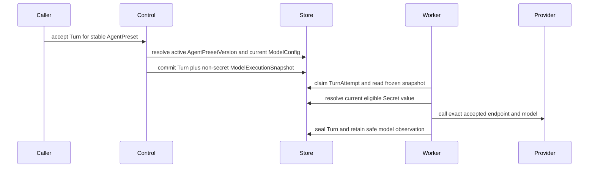

# Model Management

## Design Position

Foundation manages the configuration required for an Agent to call one primary generative model. A `ModelConfig` is a mutable Workspace resource selected by `model_id` from an `AgentPresetVersion`. It combines one trusted provider type, the provider's model name, non-secret connection configuration, one credential requirement, and advisory capability metadata.

Model configuration has no published revision or version history. Editing a `ModelConfig` changes the configuration used by every AgentPresetVersion that references it for each newly accepted Turn. Foundation does not expose pinned and follow-latest modes, model aliases, rollback, deployment promotion, traffic splitting, load balancing, fallback routing, or provider-account failover. Provider infrastructure remains responsible for balancing and routing behind the configured endpoint.

Foundation freezes a non-secret `ModelExecutionSnapshot` when it accepts a new Turn. This snapshot is an execution input, not a model-configuration revision or a management resource. Every replacement TurnAttempt for that Turn uses the same snapshot so a concurrent edit cannot change accepted work. A continuation, feedback, fork, child, or retry is a new Turn and resolves the current `ModelConfig` again at its own acceptance boundary.

This contract covers only the primary text or multimodal generative model used by an Agent. Embedding, reranking, moderation, speech, image generation, video generation, and other specialized model resources are outside this domain.

## Boundaries

| Concern                            | Owner                                                          | Contract                                                                                 |
| ---------------------------------- | -------------------------------------------------------------- | ---------------------------------------------------------------------------------------- |
| Model configuration and lifecycle  | This document                                                  | Owns `ModelConfig`, provider discovery, testing, updating, enabling, and disabling       |
| Agent model selection and behavior | [Agent Management](12-agent-management.md)                     | Stores one `model_id`, concrete Harness model characteristics, and native model settings |
| Turn-time model selection          | This document and [Durable Turn State](14-turn-persistence.md) | Resolves the current enabled configuration and freezes one non-secret execution snapshot |
| Secret values and use eligibility  | [Secret Management](11-secret-management.md)                   | Stores, authorizes, resolves, rotates, and deletes credential values                     |
| Provider API and balancing         | Selected model provider                                        | Owns provider-native routing, capacity, quotas, and availability                         |
| Trusted provider code              | Distribution composition                                       | Installs and allows provider adapters; public APIs never import caller-selected code     |
| Harness model behavior             | Agent Harness and selected adapter                             | Constructs the process-local native Model and performs model calls                       |
| Usage identity and measures        | [Events, Usage, and Delivery](20-events-usage-and-delivery.md) | Retains immutable usage facts with model and provider attribution                        |

`ModelConfig` is not a Provider account, connection pool, deployment, gateway, or credential container. Foundation exposes no independent Provider Connection resource for models. Connection fields live directly in the configuration and credential values remain in managed Secrets.

## Provider Registry

The control plane exposes a read-only registry of trusted installed model providers. Each entry is a safe `ProviderDefinition`:

```python
class ProviderDefinition:
    key: str
    display_name: str
    credential_schema: JsonObject
    connection_schema: JsonObject
    model_catalog: tuple[ProviderModelCatalogEntry, ...]
    capability_catalog: tuple[ProviderModelCapabilityEntry, ...]
```

The schemas define the accepted credential modes, typed connection fields, required fields, defaults, display hints, and bounds. They contain no Secret values or operator-private configuration. Unknown provider keys, unknown input fields, and configuration that does not satisfy the selected provider schema are rejected.

The provider registry is assembled from trusted adapters selected by the running distribution. Installing a package does not make it trusted. Public requests cannot register a provider, provide an import path, or execute remote adapter code.

The distribution includes these provider definitions:

| Provider key           | Product label               | Connection fields beyond common model and credential fields             |
| ---------------------- | --------------------------- | ----------------------------------------------------------------------- |
| `openai`               | OpenAI                      | None; uses the official Responses API endpoint                          |
| `anthropic`            | Anthropic                   | None; uses the official Messages API endpoint                           |
| `google_gemini`        | Google Gemini               | None; uses the official endpoint                                        |
| `google_vertex`        | Google Vertex AI            | `project_id`, `location`                                                |
| `azure_openai`         | Azure OpenAI                | `resource_endpoint`, `api_protocol`                                     |
| `aws_bedrock`          | AWS Bedrock                 | `region`                                                                |
| `alibaba_model_studio` | Alibaba Model Studio / Qwen | `region`, `domain_type`, optional `alibaba_workspace_id`                |
| `deepseek`             | DeepSeek                    | None; uses the official endpoint                                        |
| `moonshot`             | Moonshot / Kimi             | None; uses the official endpoint                                        |
| `zhipu`                | Zhipu / GLM                 | None; uses the official endpoint                                        |
| `openai_compatible`    | OpenAI-Compatible           | `base_url`, `api_protocol`, `auth_mode`, optional `api_key_header_name` |

An official direct provider uses an adapter-owned fixed or derived endpoint and does not accept an arbitrary base URL. A proxy, gateway, or self-hosted service uses `openai_compatible` unless its authentication or protocol requires a separate trusted adapter.

For `openai_compatible`, `api_protocol` is `chat_completions` or `responses` and defaults to `chat_completions`. `auth_mode` is `bearer` or `api_key_header`. `api_key_header_name` is accepted only for `api_key_header`; the header value always comes from the selected Secret. Arbitrary extra headers, multi-header credentials, request signing, and caller-defined request transformations are not supported by this generic adapter.

Provider model and capability catalogs ship with the adapter or Foundation release. Foundation performs no background Internet discovery or catalog synchronization. The model catalog is an autocomplete aid rather than a whitelist: a caller can enter a model name absent from the catalog, subject to the same bounded syntax and provider validation.

## ModelConfig

`ModelConfig` has one opaque `ModelConfigId` with the allocated `mdl` kind prefix. Its name is non-empty, bounded, and unique within one Workspace. The resource has this conceptual safe representation:

```python
type ModelCredential = (
    WorkspaceSecretCredential
    | InvokingUserSecretCredential
    | NoCredential
)


class WorkspaceSecretCredential:
    source: Literal["workspace_secret"]
    secret_id: SecretId


class InvokingUserSecretCredential:
    source: Literal["invoking_user_secret"]
    secret_key: str


class NoCredential:
    source: Literal["none"]


class ModelCapabilities:
    input_modalities: tuple[str, ...]
    context_window_tokens: int | None
    max_output_tokens: int | None
    tool_calling: bool | None
    structured_output: bool | None
    reasoning: bool | None


class ModelConfig:
    id: ModelConfigId
    workspace_id: WorkspaceId
    version: int
    name: str
    description: str | None
    provider_type: str
    model_name: str
    base_url: str | None
    credential: ModelCredential
    provider_config: JsonObject
    capabilities: ModelCapabilities
    capability_source: Literal["catalog", "manual_override"]
    enabled: bool
    created_by: PrincipalRef
    updated_by: PrincipalRef
    created_at: datetime
    updated_at: datetime
```

`base_url` is the normalized effective endpoint exposed when it is safe to do so. It is null when the provider derives its endpoint from typed fields such as region or project. `provider_config` contains only the fields declared by the selected provider definition and never contains a credential.

Concrete `HarnessModelCharacteristics`, native `ModelSettings`, temperature, maximum output requested for one invocation, reasoning effort, tool choice, structured-output policy, timeouts, and other Agent behavior are not `ModelConfig` fields. The immutable `AgentPresetVersion` owns those values because two Presets can use the same model configuration differently.

Capabilities describe catalog knowledge or an explicit Workspace override. They are informational for authoring and display. They do not gate Agent save, Turn acceptance, tool calling, structured output, or execution. Unknown facts are represented as unknown rather than false. Provider behavior and runtime errors remain authoritative. They do not populate, default, or validate an AgentPresetVersion's concrete `HarnessModelCharacteristics`.

## Credential Requirements

A configuration declares exactly one credential source allowed by its provider schema:

- `workspace_secret` names an exact active Workspace-owned Secret in the same Workspace;
- `invoking_user_secret` names a Secret key resolved for the active invoking User; a Service Account cannot satisfy this requirement; or
- `none` supplies no credential and is accepted only when the provider schema explicitly permits unauthenticated use.

There is no fallback order. A missing, inactive, unauthorized, or ineligible Secret fails closed. Model APIs never accept or return plaintext credentials. An authoring UI can offer existing Secrets or create a Secret inline through the Secret API, but it stores only the resulting reference in `ModelConfig`.

AWS Bedrock, Google Vertex AI, and other authenticated providers use the same Workspace or invoking-User Secret boundary. Their adapter defines the expected credential content. Foundation does not add a deployment-identity or ambient workload-identity credential mode.

A Google Vertex AI service-account credential must declare the exact official `https://oauth2.googleapis.com/token` token endpoint. Foundation validates that value and pins the same endpoint when constructing credentials; Secret content cannot select another token destination or bypass the outbound network policy.

The `ModelExecutionSnapshot` retains only the non-secret credential requirement. Every TurnAttempt resolves and decrypts the current eligible Secret value into fresh process-local bindings after closing its database transaction. Rotation therefore applies to the next resolution, including a replacement TurnAttempt, without changing the accepted model endpoint or model name.

## Endpoint Safety

Every configurable endpoint is validated as an outbound network destination:

- only `http` and `https` are accepted;
- user information, fragments, and credential-bearing or otherwise sensitive query parameters are rejected;
- loopback, link-local, cloud-metadata, and non-allowlisted private destinations are denied by default;
- only deployment operators can allow private domains or CIDR ranges; a Workspace mutation cannot expand this policy;
- DNS answers are revalidated when connecting, and every redirect target is validated under the same policy; and
- official adapter endpoints use the deployment's trusted allowlist.

Validation is applied on create, update, test, and execution. A hostname that passed at save time does not bypass DNS or redirect validation later.

## Turn Selection and Reconstruction

Turn acceptance reads the exact immutable `AgentPresetVersion`, obtains its `model_id`, authorizes and validates the current enabled `ModelConfig`, and freezes this conceptual value:

```python
class ModelExecutionSnapshot:
    schema_version: Literal["1"]
    model_id: ModelConfigId
    provider_type: str
    model_name: str
    base_url: str | None
    credential: ModelCredential
    provider_config: JsonObject
    adapter_key: str
    adapter_version: str


class ModelExecutionObservation:
    model_id: ModelConfigId
    provider_type: str
    model_name: str
```

The snapshot contains no Secret value and is not independently addressable. The Turn row retains it while the Turn is `accepted` or `running`. Every claim copies the safe observation to its new TurnAttempt and reconstructs the native provider and Model from the same snapshot. A replacement attempt never reads the current `ModelConfig` as a fallback.

When a Turn seals as `waiting`, `completed`, `failed`, or `cancelled`, Foundation removes the execution snapshot and retains only `ModelExecutionObservation` on the Turn and each started TurnAttempt. The observation supports history and usage attribution but cannot reconstruct a provider client or reveal an endpoint or Secret reference. A feedback or other successor Turn resolves the current configuration and receives a new snapshot.



`adapter_key` and `adapter_version` identify the trusted adapter compatibility contract required to reconstruct the snapshot. The version changes only for an incompatible adapter change; it is not a package or transitive-dependency lock. If that compatibility identity is unavailable, the Turn fails before model dispatch. Foundation never substitutes another model, provider, endpoint, or current configuration.

## Management API

Provider discovery is deployment-scoped and read-only:

```http
GET /api/v1/model-providers
```

Workspace model resources use:

```http
GET    /api/v1/workspaces/{workspace_id}/models
POST   /api/v1/workspaces/{workspace_id}/models
GET    /api/v1/workspaces/{workspace_id}/models/{model_id}
PATCH  /api/v1/workspaces/{workspace_id}/models/{model_id}
POST   /api/v1/workspaces/{workspace_id}/models/test
```

The model collection uses cursor pagination, deterministic `updated_at desc, id desc` order, bounded name search, and explicit `provider_type` and `enabled` filters.

Create is a synchronous database mutation and retains no separate idempotency or replay record. It does not accept `Idempotency-Key`. Repeating it is a new request; the Workspace name uniqueness constraint returns `409 model_name_conflict` when the requested name already exists.

`ModelConfig.version` starts at `1` and increments once for each effective update. `PATCH` requires `expected_version`; a mismatch returns `409 model_version_conflict` with the safe current version and changes nothing. A no-op update retains the same version. This counter is optimistic concurrency evidence, not configuration history, a provider model version, a revision selector, or a rollback handle.

Create and update perform complete provider-schema, endpoint-policy, credential-reference, and static compatibility validation. Saving does not require a remote provider call. A PATCH that changes any execution field takes effect only for Turns accepted after its atomic commit and requires no approval workflow.

## Candidate Connection Test

The test command accepts a complete unsaved candidate with the same fields and validation as create. It supports both new and edited forms and accepts only Secret references, never inline credential values. It performs one bounded synchronous adapter-defined connectivity and authentication check outside any database transaction.

The result contains success or failure, elapsed milliseconds, and a stable safe error code and message. It contains no raw provider response, request headers, credential material, prompt, or model output. The response states that the check can consume provider quota or incur cost. Timeout returns a bounded failure rather than leaving a durable job.

Testing creates no `ModelTest` resource, verification status, health status, history, or save precondition. Only the security audit event is durable. A test of an invoking-User Secret can use only the active User's own Secret; a Service Account cannot perform that test.

## Lifecycle

An enabled model is available for Agent authoring and new Turn acceptance. Disabling it removes it from new selection and causes a new Turn using any referencing AgentPresetVersion to fail with `model_disabled`. A Turn already accepted with a snapshot continues, including its replacement TurnAttempts. Re-enabling the model restores new-Turn execution for all existing references.

Model Management exposes no hard delete. A configuration that should no longer be selected is disabled and retained so existing `AgentPresetVersion` references remain resolvable. Foundation exposes no server-side copy, model import, export, tag, or bulk-mutation surface. Creating a similar configuration uses the ordinary create contract with safe fields obtained from an authorized read.

## Authorization and Audit

Workspace Viewer can read safe provider and model metadata. Workspace Builder and Admin can create, update, test, enable, and disable model configurations. Agent-scoped grants do not confer Workspace model-management or Workspace Secret-management permission. Running an authorized Agent permits runtime use of its selected ModelConfig but does not permit reading a Secret value or changing the configuration.

Create, update, enable, disable, and test attempts emit security audit events with Workspace, model when present, actor, request, outcome, and time. A successful update includes only a bounded sorted list of changed field names. Audit data contains no old or new field values, Secret reference or value, endpoint, raw provider error, prompt, or output. Audit is evidence and cannot restore an overwritten configuration.

## Failure Semantics

| Failure                                                      | Outcome                                                                                   |
| ------------------------------------------------------------ | ----------------------------------------------------------------------------------------- |
| Unknown provider or invalid provider fields                  | Reject create, update, test, or Turn acceptance before provider I/O                       |
| Endpoint violates outbound policy                            | Reject the operation; no network request is sent                                          |
| Secret reference is missing or unauthorized                  | Fail closed without disclosing whether a concealed Secret exists                          |
| User credential is selected for a Service Account invocation | Turn or test fails before provider dispatch                                               |
| Model is disabled                                            | New Turn acceptance fails with `model_disabled`; accepted Turns continue                  |
| `expected_version` is stale                                  | Update returns `model_version_conflict` with the safe current version and changes nothing |
| Provider test fails or times out                             | Return a safe synchronous result; saved configuration is unchanged                        |
| Accepted adapter identity is unavailable                     | Turn fails before model dispatch; no current-config fallback occurs                       |
| Provider rejects a call                                      | Current TurnAttempt records a bounded safe failure under the owning runtime contract      |

## Invariants

01. `ModelConfig` is a mutable Workspace resource for an Agent's primary generative model and has no configuration revision history.
02. Every `AgentPresetVersion` selects exactly one `model_id`; per-Preset-Version runtime model settings remain in the immutable AgentPresetVersion.
03. Every new Turn resolves the current enabled configuration once and freezes a non-secret execution snapshot; replacement TurnAttempts reuse it.
04. A model edit affects old and new AgentPresetVersions only for Turns accepted after the edit commits.
05. Every credential requirement has exactly one source, and no durable model or Turn record contains a credential value.
06. Provider and capability catalogs are advisory trusted metadata, and manual model names remain valid input.
07. Capability metadata never becomes an execution gate.
08. Official providers do not accept arbitrary endpoints; custom endpoints use a trusted adapter and the outbound network policy.
09. Foundation does not balance, fail over, or silently substitute providers or model configurations.
10. Disabling blocks new Turn acceptance without invalidating existing `AgentPresetVersion` references or accepted Turn snapshots.
