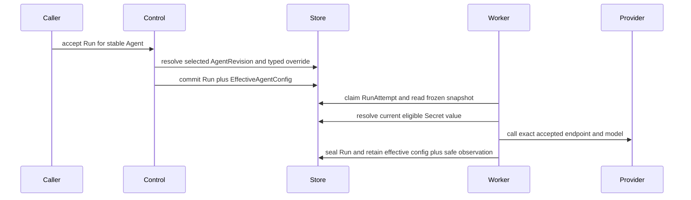

# Model Management

## Design Position

Foundation manages the configuration required for an Agent to call one primary generative model. `Model` is the stable Workspace identity and `ModelRevision` is one immutable provider configuration. An Agent selects an exact `model_revision_id`.

Creating a Model atomically creates v1. A complete provider-configuration change appends a Revision and advances both the Model head and Revision to the same `version`; a semantic no-op does not advance either. Metadata and enabled-state changes use strong ETags and do not change `version`. Existing AgentRevisions and accepted Runs retain their exact ModelRevision.

One ordinary Run inherits the selected Revision's frozen model snapshot and concrete settings. A typed model override may select another current enabled `Model` or replace bounded model settings and characteristics; acceptance resolves the result once into `EffectiveAgentConfig`. The snapshot is execution data, not a model-configuration revision or management resource. Every replacement attempt for that Run uses the same resolved value.

This contract covers only the primary text or multimodal generative model used by an Agent. Embedding, reranking, moderation, speech, image generation, video generation, and other specialized model resources are outside this domain.

## Boundaries

| Concern                            | Owner                                                          | Contract                                                                                    |
| ---------------------------------- | -------------------------------------------------------------- | ------------------------------------------------------------------------------------------- |
| Model configuration and lifecycle  | This document                                                  | Owns `Model`, provider discovery, testing, updating, enabling, and disabling                |
| Agent model selection and behavior | [Agent Management](12-agent-management.md)                     | Stores one exact `model_revision_id`, concrete Harness characteristics, and native settings |
| Run-time model selection           | This document and [Durable Run State](14-run-persistence.md)   | Reuses the Revision snapshot or resolves one typed override into effective configuration    |
| Secret values and use eligibility  | [Secret Management](11-secret-management.md)                   | Stores, authorizes, resolves, rotates, and deletes credential values                        |
| Provider API and balancing         | Selected model provider                                        | Owns provider-native routing, capacity, quotas, and availability                            |
| Trusted provider code              | Distribution composition                                       | Installs and allows provider adapters; public APIs never import caller-selected code        |
| Harness model behavior             | Agent Harness and selected adapter                             | Constructs the process-local native Model and performs model calls                          |
| Usage identity and measures        | [Events, Usage, and Delivery](20-events-usage-and-delivery.md) | Retains immutable usage facts with model and provider attribution                           |

`Model` is not a Provider account, connection pool, deployment, gateway, or credential container. Foundation exposes no independent Provider Connection resource for models. Connection fields live directly in the configuration and credential values remain in managed Secrets.

## Provider Registry

The control plane exposes a read-only registry of trusted installed model providers. Each entry is a safe `ProviderDefinition`:

```python
class ProviderDefinition:
    key: str
    display_name: str
    credential_schema: JsonObject
    connection_schema: JsonObject
    model_catalog: tuple[ProviderModelCatalogEntry, ...]
    capability_catalog: tuple[ProviderModelCapabilityEntry, ...]
```

The schemas define the accepted credential modes, typed connection fields, required fields, defaults, display hints, and bounds. They contain no Secret values or operator-private configuration. Unknown provider keys, unknown input fields, and configuration that does not satisfy the selected provider schema are rejected.

The provider registry is assembled from trusted adapters selected by the running distribution. Installing a package does not make it trusted. Public requests cannot register a provider, provide an import path, or execute remote adapter code.

The distribution includes these provider definitions:

| Provider key           | Product label               | Connection fields beyond common model and credential fields             |
| ---------------------- | --------------------------- | ----------------------------------------------------------------------- |
| `openai`               | OpenAI                      | None; uses the official Responses API endpoint                          |
| `anthropic`            | Anthropic                   | None; uses the official Messages API endpoint                           |
| `google_gemini`        | Google Gemini               | None; uses the official endpoint                                        |
| `google_vertex`        | Google Vertex AI            | `project_id`, `location`                                                |
| `azure_openai`         | Azure OpenAI                | `resource_endpoint`, `api_protocol`                                     |
| `aws_bedrock`          | AWS Bedrock                 | `region`                                                                |
| `alibaba_model_studio` | Alibaba Model Studio / Qwen | `region`, `domain_type`, optional `alibaba_workspace_id`                |
| `deepseek`             | DeepSeek                    | None; uses the official endpoint                                        |
| `moonshot`             | Moonshot / Kimi             | None; uses the official endpoint                                        |
| `zhipu`                | Zhipu / GLM                 | None; uses the official endpoint                                        |
| `openai_compatible`    | OpenAI-Compatible           | `base_url`, `api_protocol`, `auth_mode`, optional `api_key_header_name` |

An official direct provider uses an adapter-owned fixed or derived endpoint and does not accept an arbitrary base URL. A proxy, gateway, or self-hosted service uses `openai_compatible` unless its authentication or protocol requires a separate trusted adapter.

For `openai_compatible`, `api_protocol` is `chat_completions` or `responses` and defaults to `chat_completions`. `auth_mode` is `bearer` or `api_key_header`. `api_key_header_name` is accepted only for `api_key_header`; the header value always comes from the selected Secret. Arbitrary extra headers, multi-header credentials, request signing, and caller-defined request transformations are not supported by this generic adapter.

Provider model and capability catalogs ship with the adapter or Foundation release. Foundation performs no background Internet discovery or catalog synchronization. The model catalog is an autocomplete aid rather than a whitelist: a caller can enter a model name absent from the catalog, subject to the same bounded syntax and provider validation.

## Model

`Model` has one opaque `ModelId` with the allocated `mdl` kind prefix. Its name is non-empty, bounded, and unique within one Workspace. The resource has this conceptual safe representation:

```python
type ModelCredential = (
    SecretCredentialSource | NoCredential
)


class NoCredential:
    source: Literal["none"]


class ModelCapabilities:
    input_modalities: tuple[str, ...]
    context_window_tokens: int | None
    max_output_tokens: int | None
    tool_calling: bool | None
    structured_output: bool | None
    reasoning: bool | None


class Model:
    id: ModelId
    workspace_id: WorkspaceId
    name: str
    description: str | None
    version: int
    current_revision_id: ModelRevisionId
    enabled: bool
    created_by: PrincipalRef
    updated_by: PrincipalRef
    created_at: datetime
    updated_at: datetime


class ModelRevision:
    id: ModelRevisionId
    model_id: ModelId
    workspace_id: WorkspaceId
    version: int
    provider_type: str
    model_name: str
    base_url: str | None
    credential: ModelCredential
    provider_config: JsonObject
    capabilities: ModelCapabilities
    capability_source: Literal["catalog", "manual_override"]
    content_digest: str
    created_by: PrincipalRef
    created_at: datetime
```

`SecretCredentialSource` and its variants come from the shared [Secret credential-reference contract](11-secret-management.md#credential-references). `NoCredential` remains Model-specific because only a provider schema can declare that a model needs no credential.

`base_url` is the normalized effective endpoint exposed when it is safe to do so. It is null when the provider derives its endpoint from typed fields such as region or project. `provider_config` contains only the fields declared by the selected provider definition and never contains a credential.

Concrete `HarnessModelCharacteristics`, native `ModelSettings`, temperature, maximum output requested for one invocation, reasoning effort, tool choice, structured-output policy, timeouts, and other Agent behavior are not `Model` fields. The immutable `AgentRevision` owns those values because two Agents can use the same model configuration differently.

Capabilities describe catalog knowledge or an explicit Workspace override. They are informational for authoring and display. They do not gate Agent save, Run acceptance, tool calling, structured output, or execution. Unknown facts are represented as unknown rather than false. Provider behavior and runtime errors remain authoritative. They do not populate, default, or validate an AgentRevision's concrete `HarnessModelCharacteristics`.

## Credential Requirements

A configuration declares exactly one credential source allowed by its provider schema:

- `workspace_secret` names an exact active Workspace-owned Secret in the same Workspace;
- `invoking_user_secret` names a Secret key resolved for the active invoking User; a Service Account cannot satisfy this requirement; or
- `none` supplies no credential and is accepted only when the provider schema explicitly permits unauthenticated use.

There is no fallback order. A missing, inactive, unauthorized, or ineligible Secret fails closed. Model APIs never accept or return plaintext credentials. An authoring UI can offer existing Secrets or create a Secret inline through the Secret API, but it stores only the resulting reference in `Model`.

AWS Bedrock, Google Vertex AI, and other authenticated providers use the same Workspace or invoking-User Secret boundary. Their adapter defines the expected credential content. Foundation does not add a deployment-identity or ambient workload-identity credential mode.

A Google Vertex AI service-account credential must declare the exact official `https://oauth2.googleapis.com/token` token endpoint. Foundation validates that value and pins the same endpoint when constructing credentials; Secret content cannot select another token destination or bypass the outbound network policy.

The `ModelExecutionSnapshot` retains only the non-secret credential requirement. Every RunAttempt resolves and decrypts the current eligible Secret value into fresh process-local bindings after closing its database transaction. Rotation therefore applies to the next resolution, including a replacement RunAttempt, without changing the accepted model endpoint or model name.

## Endpoint Safety

Every configurable endpoint is validated as an outbound network destination:

- only `http` and `https` are accepted;
- user information, fragments, and credential-bearing or otherwise sensitive query parameters are rejected;
- loopback, link-local, cloud-metadata, and non-allowlisted private destinations are denied by default;
- only deployment operators can allow private domains or CIDR ranges; a Workspace mutation cannot expand this policy;
- DNS answers are revalidated when connecting, and every redirect target is validated under the same policy; and
- official adapter endpoints use the deployment's trusted allowlist.

Validation is applied on create, update, test, and execution. A hostname that passed at save time does not bypass DNS or redirect validation later.

## Revision creation, Run Selection, and Reconstruction

Agent Revision creation reads the selected enabled `Model`, authorizes it, and freezes this conceptual value. Run acceptance normally reuses it; a typed model override performs the same resolution for the effective Run configuration:

```python
class ModelExecutionSnapshot:
    schema_version: Literal["1"]
    model_id: ModelId
    provider_type: str
    model_name: str
    base_url: str | None
    credential: ModelCredential
    provider_config: JsonObject
    adapter_key: str
    adapter_version: str


class ModelExecutionObservation:
    model_id: ModelId
    provider_type: str
    model_name: str
```

The snapshot contains no Secret value and is not independently addressable. The `AgentRevision.resolved_model` and accepted `EffectiveAgentConfig.model` pair it with exact `ModelSettings` and `HarnessModelCharacteristics`. Every claim copies the safe observation to its new execution attempt and reconstructs the native provider and Model from the same snapshot. A replacement attempt never reads the current `Model` as a fallback.

The complete non-secret snapshot remains part of the retained effective configuration required for retry, resume, historical exact-Revision invocation, and audit. `ModelExecutionObservation` is the smaller safe projection exposed on Run and attempt reads. Waiting feedback and explicit Retry reuse the source Run's effective model; an ordinary new continuation inherits the newly selected Revision or applies its own typed override.



`adapter_key` and `adapter_version` identify the trusted adapter compatibility contract required to reconstruct the snapshot. The adapter version changes only for an incompatible adapter change; it is not a package or transitive-dependency lock. If that compatibility identity is unavailable, the Run fails before model dispatch. Foundation never substitutes another ModelRevision, provider, or endpoint.

## Management API

Provider discovery is deployment-scoped and read-only:

```http
GET /api/v1/model-providers
```

Workspace model resources use:

```http
GET    /api/v1/workspaces/{workspace_id}/models
POST   /api/v1/workspaces/{workspace_id}/models
GET    /api/v1/workspaces/{workspace_id}/models/{model_id}
PATCH  /api/v1/workspaces/{workspace_id}/models/{model_id}
POST   /api/v1/workspaces/{workspace_id}/models/{model_id}/revisions
GET    /api/v1/workspaces/{workspace_id}/models/{model_id}/revisions
GET    /api/v1/workspaces/{workspace_id}/model-revisions/{revision_id}
POST   /api/v1/workspaces/{workspace_id}/models/test
```

The model collection uses cursor pagination, deterministic `updated_at desc, id desc` order, bounded name search, and explicit `provider_type` and `enabled` filters.

Create is a synchronous mutation that atomically inserts the Model head and immutable revision `1`; it retains no separate idempotency or replay record. Repeating it is a new request, and the Workspace name uniqueness constraint returns `409 model_name_conflict` when the requested name already exists.

Revision publication accepts a complete replacement configuration and `expected_version`. A different normalized configuration appends one `ModelRevision`, advances `Model.version`, and selects that revision atomically. Content equal to the current revision returns the current revision without advancing either value. A stale precondition returns `409 model_version_conflict` and changes nothing.

`PATCH` changes only `name`, `description`, or `enabled`. It requires the current strong Model `ETag` in `If-Match`; a stale tag returns `412` and changes nothing. Metadata and lifecycle changes never append a revision or advance `Model.version`.

Create, revision publication, and candidate test perform complete provider-schema, endpoint-policy, credential-reference, and static compatibility validation. Saving does not require a remote provider call. A new Revision affects only future Agent Revision creation and model overrides accepted after its atomic commit.

## Candidate Connection Test

The test command accepts a complete unsaved candidate with the same fields and validation as create. It supports both new and edited forms and accepts only Secret references, never inline credential values. It performs one bounded synchronous adapter-defined connectivity and authentication check outside any database transaction.

The result contains success or failure, elapsed milliseconds, and a stable safe error code and message. It contains no raw provider response, request headers, credential material, prompt, or model output. The response states that the check can consume provider quota or incur cost. Timeout returns a bounded failure rather than leaving a durable job.

Testing creates no `ModelTest` resource, verification status, health status, history, or save precondition. Only the security audit event is durable. A test of an invoking-User Secret can use only the active User's own Secret; a Service Account cannot perform that test.

## Lifecycle

An enabled model is available for Agent authoring and new Run acceptance. Disabling it removes it from new selection and causes a new Run using any referencing AgentRevision to fail with `model_disabled`. A Run already accepted with a snapshot continues, including its replacement RunAttempts. Re-enabling the model restores new-Run execution for all existing references.

Model Management exposes no hard delete. A configuration that should no longer be selected is disabled and retained so existing `AgentRevision` references remain resolvable. Foundation exposes no server-side copy, model import, export, tag, or bulk-mutation surface. Creating a similar configuration uses the ordinary create contract with safe fields obtained from an authorized read.

## Authorization and Audit

Workspace Viewer can read safe provider, Model, and ModelRevision metadata. Workspace Builder and Admin can create Models, publish revisions, update metadata, test candidates, enable, and disable Models. Agent-scoped grants do not confer Workspace Model-management or Workspace Secret-management permission. Running an authorized Agent permits runtime use of its selected ModelRevision but does not permit reading a Secret value or changing the configuration.

Provider and Model reads authorize `models.read`; create, update, test,
enable, and disable authorize `models.manage`. These stable actions and
built-in grants are owned by the IAM
[registry](10-identity-and-access-management.md#stable-action-registry). Runtime
model use is accepted Agent execution under the Run's current authority and
grants, not another public Model action.

Create, revision publication, metadata update, enable, disable, and test attempts emit security audit events with Workspace, Model when present, actor, request, outcome, and time. A successful metadata update includes only a bounded sorted list of changed field names; publication records the selected immutable revision identity. Audit data contains no old or new field values, Secret reference or value, endpoint, raw provider error, prompt, or output.

## Failure Semantics

| Failure                                                      | Outcome                                                                             |
| ------------------------------------------------------------ | ----------------------------------------------------------------------------------- |
| Unknown provider or invalid provider fields                  | Reject create, revision publication, test, or Run acceptance before provider I/O    |
| Endpoint violates outbound policy                            | Reject the operation; no network request is sent                                    |
| Secret reference is missing or unauthorized                  | Fail closed without disclosing whether a concealed Secret exists                    |
| User credential is selected for a Service Account invocation | Run or test fails before provider dispatch                                          |
| Model is disabled                                            | New Run acceptance fails with `model_disabled`; accepted Runs continue              |
| Revision `expected_version` is stale                         | Publication returns `model_version_conflict` and changes nothing                    |
| Model metadata `If-Match` is stale                           | Metadata mutation returns `412` and changes nothing                                 |
| Provider test fails or times out                             | Return a safe synchronous result; saved configuration is unchanged                  |
| Accepted adapter identity is unavailable                     | Run fails before model dispatch; no current-config fallback occurs                  |
| Provider rejects a call                                      | Current RunAttempt records a bounded safe failure under the owning runtime contract |

## Invariants

01. `Model` is the stable Workspace resource and `ModelRevision` is one immutable provider configuration.
02. `Model.version` always equals its selected `ModelRevision.version` and advances only when a different immutable revision is appended.
03. Every `AgentRevision` freezes exactly one `model_revision_id`, non-secret execution snapshot, settings, and characteristics.
04. Every new Run inherits that resolved revision or freezes one typed model override inside `EffectiveAgentConfig`; replacement RunAttempts reuse it.
05. A new ModelRevision affects only future Agent Revision creation and model overrides accepted after publication commits.
06. Every credential requirement has exactly one source, and no durable Model, ModelRevision, or Run record contains a credential value.
07. Provider and capability catalogs are advisory trusted metadata, and manual model names remain valid input.
08. Capability metadata never becomes an execution gate.
09. Official providers do not accept arbitrary endpoints; custom endpoints use a trusted adapter and the outbound network policy.
10. Foundation does not balance, fail over, or silently substitute providers or ModelRevisions.
11. Disabling blocks new Run acceptance without invalidating existing `AgentRevision` references or accepted Run snapshots.
