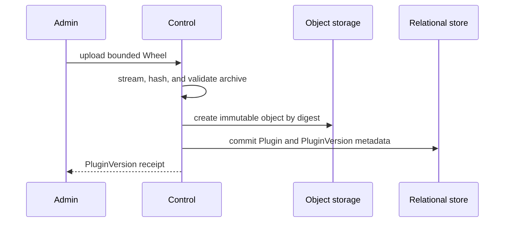

# Harness Plugin Artifacts and Runtime Loading

## Design Position

Foundation manages trusted Harness plugins as immutable standard Python Wheels. The [Agent Management contract](12-agent-management.md) owns the user-visible `Plugin`, `PluginVersion`, Preset binding, lifecycle commands, and runner-profile task receipts. This document owns artifact validation, Runtime locks, Worker materialization, and the two accepted execution profiles.

Every deployment fixes one `plugin_runtime.mode` before it stores Plugin, AgentPresetVersion, or Turn data:

- `on_demand` is the default. AgentPresetVersion locks exact PluginVersions, and each Worker imports compatible Plugin artifacts into its own interpreter before claiming a Turn. A conflicting Worker declines the Turn and leaves it eligible.
- `runner` uses one deployment-wide active PluginVersion set. Stable Worker Supervisors stage clean lock-scoped Runner children and atomically cut over after every serviceable Worker is ready.

Both profiles persist immutable Runtime locks and every accepted Turn pins one exact lock digest. Neither profile unloads, reloads, silently substitutes, or interprets caller-supplied Python targets. The profiles intentionally have different PluginVersion selection and availability guarantees; mode is not an implementation-private optimization.

## Boundaries

| Concern                                                                  | Owner                                                               | Contract                                                                     |
| ------------------------------------------------------------------------ | ------------------------------------------------------------------- | ---------------------------------------------------------------------------- |
| Plugin identity, Version, Preset binding, lifecycle, and commands        | [Agent Management](12-agent-management.md)                          | Defines the product and HTTP-visible behavior                                |
| Runtime mode initialization and process lifecycle                        | [Runtime Configuration](01-runtime-configuration-and-deployment.md) | Fixes one durable deployment profile and owns readiness, drain, and shutdown |
| Wheel shape, digest, Runtime lock, and artifact retention                | This document                                                       | Makes exact trusted Plugin environments identifiable and verifiable          |
| On-demand registry, import preflight, and conflict behavior              | This document                                                       | Keeps incompatible work unclaimed without another routing authority          |
| Runner materialization, staging, cutover, and drain                      | This document                                                       | Replaces Python interpreters without replacing the Worker container          |
| Plugin factory, configuration, construction, and Capability contribution | [Harness plugin system](../agent-harness/05-plugin-system.md)       | Builds fresh plugin instances from an explicitly selected catalog            |
| Turn acceptance and exact lock-digest persistence                        | [Durable Turn State](14-turn-persistence.md)                        | Pins one Runtime with one accepted Preset Version                            |
| Turn claim, lease, fence, and recovery                                   | [Scheduling](16-scheduling-workers-and-recovery.md)                 | Applies the profile-specific pre-claim compatibility gate                    |
| Relational and object capabilities                                       | [Foundation storage](03-storage.md)                                 | Supplies metadata authority and immutable artifact bytes                     |

`PluginRuntime` means the Python, Harness, Pydantic AI, Plugin Wheels, and third-party distributions selected by one Runtime lock. It contains no Prompt, Secret value, Turn state, Agent work files, shell workspace, browser, or Agent `Environment`.

Plugin code executes with Worker authority in both profiles. A Runner supports interpreter replacement and fault containment; it is not a security sandbox. A deployment that does not trust Plugin code must place the complete Worker outside the trust boundary.

## Deployment Mode Contract

The effective configuration contains:

```toml
[plugin_runtime]
mode = "on_demand" # or "runner"
```

Omitting `mode` selects `on_demand`. Control persists the selected mode as an internal compatibility fact and may replace it only while no Plugin, AgentPresetVersion, or Turn exists. Every Control, Worker, and all-in-one process verifies the same value before readiness. A non-empty configuration mismatch fails startup; the service never reinterprets stored Preset Versions under another profile.

Changing the persisted mode after any Plugin, AgentPresetVersion, or Turn exists is not a configuration update. Foundation exposes no mode mutation or migration API. A migration between profiles requires a separately reviewed data migration that rebinds mutable Preset config, publishes new Versions, establishes the runner active set when applicable, and preserves every retained Turn lock.

## Plugin Wheel Contract

One `PluginVersion` contains exactly one standards-conforming `.whl` artifact. The Wheel contains exactly one entry in the `a13n_harness.plugins` entry-point group. Its entry-point name equals the stable `plugin_key`; its target is derived from verified Wheel metadata and is never supplied through an Agent config, Turn, queue message, or execution field.

The Wheel contains one unique top-level Python package. Its normalized name must match the stable `top_level_package` established by the Plugin's first Version; another Plugin cannot claim the same package.

The Wheel's normalized distribution name remains stable across every Version of one Plugin. Its PEP 440 `Version` supplies `PluginVersion.version`. The platform-generated PluginVersion ID, normalized package version, and full-byte content digest are distinct identities.

Uploading the same Plugin and normalized package version with the same digest is idempotent and returns the existing Version. Reusing that version with different bytes fails with `plugin_version_conflict`. A corrected artifact uses another package version; no upload overwrites an immutable Version.

Foundation rejects:

- a raw `.py` file or custom ZIP plugin format;
- a missing or second Harness Plugin entry point;
- a missing, second, or conflicting top-level Python package;
- another Agent Foundation extension entry-point group in the same Wheel;
- a distribution name or plugin key that conflicts with an existing stable Plugin;
- an entry-point target outside the Wheel's declared import packages;
- malformed, encrypted, duplicated, linked, absolute, or parent-traversing archive members;
- invalid or inconsistent `WHEEL`, `METADATA`, `entry_points.txt`, or `RECORD` data; and
- compressed or expanded content outside the configured bounded upload limits.

The service streams upload bytes while enforcing the compressed limit and computing the digest. Archive validation performs no Plugin import, package-index lookup, dependency installation, or source build. Passing validation proves package structure and integrity, not code safety or profile eligibility.

## Artifact Publication and Retention

Upload follows the external-I/O boundary from [Durable Operations and Outbox](06-durable-operations-and-outbox.md):



No relational session or transaction spans request streaming, archive inspection, package-index access, or object-store I/O. Objects are create-only and addressed internally by digest. A retry reconciles an existing object and Version by identity and digest. A failed upload creates no PluginVersion; staged unreferenced bytes are safe reconciliation and garbage-collection candidates.

The authoritative store retains:

- every successful PluginVersion Wheel;
- every dependency artifact selected by a retained runner Runtime lock;
- each canonical Runtime lock manifest and digest;
- the runner active lock and active PluginVersion pointers when that profile is selected;
- bounded runner command receipts and audit facts; and
- all artifacts required by a retained Preset Version or non-terminal Turn.

Worker-local files are derived cache only. Plugin Archive, runner Deactivate, Preset Rollback, process exit, or local eviction never deletes authoritative artifacts required to reconstruct retained work.

## Runtime Lock

A Runtime lock is an internal canonical manifest identified by a digest over its complete normalized representation. It is not exposed through Create, List, Patch, Delete, or direct selection APIs.

The conceptual manifest contains:

```python
type PluginRuntimeMode = Literal["on_demand", "runner"]
type DistributionSource = Literal["worker_release", "artifact"]


class LockedDistribution:
    distribution_name: str
    version: str
    source: DistributionSource
    artifact_digest: str | None
    artifact_ref: ObjectRef | None


class LockedPlugin:
    plugin_id: str
    plugin_version_id: str
    plugin_key: str
    distribution_name: str
    distribution_version: str
    top_level_package: str
    wheel_digest: str


class PluginRuntimeLock:
    schema_version: str
    mode: PluginRuntimeMode
    runtime_target: RuntimeTarget
    worker_release: str
    harness_version: str
    plugins: tuple[LockedPlugin, ...]
    distributions: tuple[LockedDistribution, ...]
    digest: str
```

The digest covers the profile, exact Runtime target, Worker release identity, Harness version, Plugin locks, distribution sources, versions, and artifact digests. One deployment has one homogeneous target containing Python implementation and minor version, operating system, CPU architecture, and Wheel ABI. The initial contract does not mix heterogeneous Worker targets.

An `on_demand` AgentPreset Publish builds the lock from the complete resolved Preset and subagent graph. Every selected PluginVersion must be a compatible pure-Python Wheel. Every declared dependency must already exist at a compatible exact version in the reviewed Worker release manifest and is recorded with `source=worker_release`; Publish never queries a package index. A Plugin top-level package cannot collide with the standard library or a package owned by that Worker release. Conflicting plugin keys, distributions, top-level packages, or dependency requirements reject Publish.

A `runner` Activate jointly resolves every active PluginVersion plus the candidate. Operator-configured public or private package indexes may supply third-party dependency Wheels. Requirements cannot use direct URLs, Git or other VCS references, local paths, or arbitrary remote Wheel URLs. Foundation, Harness, Pydantic AI, and other platform-owned distributions are fixed by the service release and cannot be upgraded or downgraded by Plugin requirements.

The current runner lock is the preferred solution. A new activation preserves every locked distribution that still satisfies all constraints and changes only the necessary packages. Re-activating the active PluginVersion is idempotent and does not query indexes. Foundation exposes no command that changes dependencies without an explicit PluginVersion activation or deactivation.

## On-demand Preset Selection

The `on_demand` mutable Preset config supplies an exact `plugin_version_id` binding for every enabled `plugin_key` in its Harness Plugin Configuration Document. Several instances of one key share one binding. Publish rejects a missing, duplicate, inaccessible, archived, key-mismatched, structurally incompatible, or dependency-ineligible Version.

Publish resolves the complete transitive subagent graph, verifies one compatible Plugin set, persists its Runtime lock, and stores the exact PluginVersion locks plus lock digest on the immutable AgentPresetVersion. Later Plugin uploads or archives do not mutate that Version. New Turn acceptance copies its lock digest; Worker claim never resolves `latest`, a Plugin head, or another Version.

`on_demand` has no global Plugin active set. Upload changes no Worker and no Preset. Activate and Deactivate have no successful semantics in this profile, create no receipt, and return `plugin_runtime_mode_unsupported` through the stable command routes.

## On-demand Worker Loading

Every non-draining on-demand Worker periodically scans all eligible Turns. Before claiming one, it reads the exact Turn lock and checks a process-local monotonic registry containing verified loaded provenance by plugin key, distribution, and top-level package.

For each required Plugin, the Worker:

1. reuses loaded provenance when the exact PluginVersion and digest match;
2. declines the Turn without claiming when an imported plugin key, distribution, or top-level package conflicts;
3. otherwise downloads the authoritative Wheel to a confined content-addressed cache and revalidates its digest and package shape;
4. verifies every `worker_release` dependency against the running process;
5. publishes the extracted package and metadata root atomically to the dedicated import path;
6. invalidates import caches, discovers the exact entry point, and verifies factory provenance; and
7. records the immutable loaded provenance before Agent construction.

The Worker derives import targets only from verified Wheel entry points. It never imports a module path from Preset config, Turn data, queue data, or an API field. After preflight succeeds, it claims the Turn under the ordinary short transactional lease and fence contract. Agent-specific plugin construction occurs after claim and uses fresh Plugin instances for each reconstructed Agent definition.

The registry is process-local, monotonic, and cleared by process exit. It is not stored in PostgreSQL, Redis, object storage, telemetry, or a routing table. If import or factory validation fails after import-path publication, the Worker becomes unready and exits; it never continues serving from a partially imported interpreter. Because preflight precedes claim, the Turn remains durable and unclaimed.

One Worker can accumulate compatible distinct plugin keys. It cannot serve two locks that require conflicting versions of the same key, distribution, or top-level package. Other clean Worker interpreters may load those locks independently. If all Workers conflict, the Turn remains eligible until compatible capacity appears or a Worker is externally replaced. A single-Worker deployment has no finite service guarantee for such a conflict.

## Runner Dependency Resolution

Runner Activate resolves every active PluginVersion and the candidate as one set. An incompatible platform requirement fails with `plugin_platform_incompatible`; an unsatisfiable joint set fails with `plugin_dependency_conflict`; a missing target artifact fails with `plugin_runtime_incompatible`. Universal Wheels can satisfy compatible targets, while native Wheels must match the deployment target.

Control persists the complete candidate lock and all dependency artifacts before Worker staging. It also reconstructs every enabled Preset's active transitive Version graph that uses the changed key against the candidate Plugin catalog; configuration or factory incompatibility fails before staging. Workers never query package indexes or solve dependencies while starting a Runner or claiming work. Activating a historical immutable PluginVersion is the explicit rollback path for that Plugin.

## Worker Supervisor and Runner

In `runner`, one Worker container contains a stable Supervisor and one or more long-lived Runner child processes:

```text
Worker container
└── Worker Supervisor
    ├── Runner(active lock)
    ├── Runner(draining old lock)
    └── Runner(candidate lock during staging)
```

The Supervisor imports no Harness Plugin, Plugin dependency, or candidate Runtime path. It owns bounded process startup, liveness observation, claim gating, drain, shutdown, and exit handling. The Supervisor-to-Runner protocol carries lifecycle control only; Harness execution does not become a remote Plugin or Agent RPC contract.

Each Runner starts in a clean Python interpreter from exactly one materialized lock. It owns the ordinary Worker loop for compatible work: periodic scan, claim, takeover, lease renewal, fenced persistence, Agent reconstruction, Harness execution, and event production. It creates fresh Plugin instances for every reconstructed Agent definition and never shares a concrete Plugin instance between definitions.

The Runner derives imports only from verified lock entry points. It verifies every artifact digest before publishing the immutable directory to the child process. It never unloads, reloads, or replaces modules in a live interpreter and never renames arbitrary Wheel modules or installs a custom multi-version importer.

## Runner Activation and Cutover

Activate and Deactivate use the same staging flow:

```mermaid
sequenceDiagram
    participant Admin
    participant Control
    participant W1 as Worker Supervisor 1
    participant W2 as Worker Supervisor 2

    Admin->>Control: command with Idempotency-Key
    Control-->>Admin: running receipt
    Control->>Control: resolve and persist candidate lock
    par stage every serviceable Worker
        Control->>W1: stage candidate lock
        W1->>W1: materialize and start gated Runner
        W1-->>Control: staged
    and
        Control->>W2: stage candidate lock
        W2->>W2: materialize and start gated Runner
        W2-->>Control: staged
    end
    Control->>Control: atomically commit active Plugin pointers and lock digest
    Control->>W1: activate candidate; drain old Runner
    Control->>W2: activate candidate; drain old Runner
    W1-->>Control: cutover observed
    W2-->>Control: cutover observed
    Control-->>Admin: succeeded receipt
```

While staging, the old active lock continues accepting all new work and candidate Runners claim nothing. Command acceptance captures registered, non-draining Workers whose operational liveness lease is current. This internal membership is not a product resource. Every captured Worker must stage the candidate before one atomic control-plane commit changes the active Plugin pointers and active lock digest.

A captured Worker that disappears before commit fails the command. A Worker that registers or rejoins during staging remains outside the serviceable set and cannot claim work until the command settles; after success it materializes the new active lock, and after failure it materializes the unchanged lock. An offline Worker is not serviceable until it materializes the then-current active lock.

If any serviceable Worker fails staging, the command fails, candidate Runners exit, and the old selection remains active. After commit, new Turns pin the new lock. The receipt becomes `succeeded` only after every still-serviceable staged Supervisor observes the commit and enables its candidate Runner.

An old Runner stops claiming new work and lets Attempts it already owns finish under ordinary timeout, cancellation, lease, and shutdown rules. Activation adds no short drain deadline. Several old-lock Runners can drain while one active Runner serves new work. Insufficient local capacity fails a later command without terminating existing Attempts.

A staged Worker that loses its liveness lease after commit leaves the serviceable set and cannot reverse cutover. On rejoin it reconstructs the committed active lock before claim. An active Runner crash causes the Supervisor to reconstruct the same lock and never silently roll back.

## Turn Pinning and Historical Reconstruction

In `on_demand`, the selected AgentPresetVersion already owns its immutable Runtime lock digest. In `runner`, Control atomically reads the active deployment lock at Turn acceptance. Both profiles persist that exact digest on the Turn, and a TurnAttempt never replaces it with another lock.

An on-demand Worker preflights the lock against its registry before claim. A Runner scans and claims only work whose digest equals its own. The runner Supervisor can observe an eligible historical lock and start a compatible Runner on demand; waiting Turns do not keep a process resident. An on-demand waiting Turn similarly keeps no process or cache entry resident and waits for a compatible Worker when it becomes eligible.

Claim-time code performs no package-index access or dependency solving. Missing artifacts, digest mismatch, target mismatch, dependency mismatch, import failure, or factory validation failure prevents claim or Harness entry without substituting another PluginVersion. A retained on-demand Turn can become unserviceable after an incompatible Worker image upgrade; the deployment must retain or restore a Worker release compatible with the Turn lock.

## Worker Cache

Each Worker owns a confined content-addressed cache with a configured byte budget. Downloads use temporary locations and publish verified artifacts and materialized directories atomically.

An imported on-demand artifact is pinned for that process lifetime because another loaded module may import it later. A live Runner pins its materialized directory and artifacts. Eviction removes only entries unused by the on-demand registry and every local Runner. Cache loss never changes Plugin state, a Preset lock, the runner active lock, or a Turn's pinned digest.

## Runner Plugin Deactivation

Deactivate exists only in `runner`. It first applies the reference policy from [Agent Management](12-agent-management.md): an enabled Preset's active transitive Version graph cannot reference the target key. Historical Versions, disabled or archived Presets, and non-terminal Turns do not block Deactivate.

Control then builds a candidate lock without the Plugin and uses the ordinary all-Worker staging flow. Accepted Turns pinned to an older lock continue or resume through a Runner for that lock. Successful cutover clears the Plugin's `active_version_id` and never mutates or deletes a PluginVersion.

## Failure Semantics

| Failure                                                         | Observable outcome                                                                              |
| --------------------------------------------------------------- | ----------------------------------------------------------------------------------------------- |
| Upload exceeds a bound or Wheel validation fails                | No PluginVersion is created                                                                     |
| Object publication succeeds but relational commit is unknown    | Retry reconciles by identity and digest                                                         |
| Package identity or same-version digest conflicts               | Upload fails; existing immutable identity remains authoritative                                 |
| On-demand Preset selects absent Worker dependency               | Publish fails; no AgentPresetVersion or Runtime lock is created                                 |
| On-demand Worker already imported a conflicting Version         | Worker declines before claim; Turn remains eligible for compatible or replacement capacity      |
| On-demand import or factory verification fails after path use   | Worker becomes unready and exits; Turn remains unclaimed                                        |
| Runner dependency resolution or compatibility fails             | Task receipt fails; old Plugin pointers and lock remain active                                  |
| Any serviceable Worker cannot stage a runner candidate          | Task receipt fails; candidate Runners exit and old lock remains active                          |
| Agent-specific Plugin construction fails                        | Claimed Attempt fails before Harness execution under the reconstruction contract                |
| Local cache lacks evictable capacity                            | Preflight or staging fails without deleting a pinned or authoritative artifact                  |
| Historical lock artifact or compatible Worker release is absent | Affected Turn remains unserviceable or fails closed; another PluginVersion is never substituted |
| Forced process or container shutdown interrupts active work     | Ordinary TurnAttempt lease-loss and unknown-outcome recovery apply                              |

Normal API and logs expose only bounded safe codes and identities. They never expose package-index credentials, raw resolver output, Wheel content, Plugin configuration, import traceback, private paths, or arbitrary exception text.

## Security and Compatibility

Plugin Upload and runner runtime commands are executable-code deployment authority. Agent input, model output, Plugin configuration, identifier possession, and Preset editing never grant upload authority. An authorized on-demand Preset publisher may select a retained PluginVersion but cannot publish new Python bytes.

Stable Plugin identity, immutable PluginVersion identity, full-byte digest, one-plugin entry-point shape, Runtime lock schema, deployment mode, and Turn lock pinning are compatibility facts. On-demand conflict-before-claim and runner all-serviceable-Worker cutover are profile-specific compatibility facts. Cache layout, local directory names, process-control transport, resolver implementation, and object-key layout remain implementation-private when they preserve those contracts.

## Trade-offs

`on_demand` keeps the default Worker topology small and permits different Presets to lock different PluginVersions. It cannot add third-party distributions outside the reviewed Worker release, and a process that imported one Version cannot serve conflicting work. Multiple clean Workers can coexist, but a single-Worker deployment may require external replacement and provides no bounded liveness for conflicts.

`runner` supports package-index dependencies, deterministic deployment-wide activation, historical lock reconstruction, and online interpreter replacement. It costs additional processes, memory, artifact retention, and an all-serviceable-Worker staging protocol. Its active Plugin set must have one jointly solvable dependency environment.

## Invariants

01. One deployment durably fixes exactly one Plugin Runtime mode; omitted configuration selects `on_demand`.
02. One PluginVersion owns one immutable standard Wheel, exactly one Harness Plugin entry point, and one unique top-level Python package.
03. One Plugin identity owns one plugin key, normalized distribution name, and top-level package for all Versions.
04. One distribution name and version denotes one content digest.
05. Runtime locks are immutable internal manifests and are not public management resources.
06. Every accepted Turn pins one exact Runtime lock digest in addition to one exact AgentPresetVersion.
07. A TurnAttempt never substitutes a current, active, latest, or otherwise available Runtime for its Turn's pinned lock.
08. `on_demand` Preset Publish locks exact PluginVersions and uses only dependencies already supplied by the Worker release.
09. An on-demand Worker declines conflicting work before claim; its process-local loaded registry is never durable authority.
10. `runner` Activate succeeds only after every serviceable Worker stages the candidate and one atomic cutover commits it.
11. The runner Supervisor imports no Plugin code; every Runner starts from one exact lock in a clean interpreter.
12. Old Runners drain existing Attempts without accepting new work after cutover, and Runner failure never causes implicit rollback.
13. Neither profile unloads, reloads, or replaces Python modules in a live interpreter.
14. Archive, Deactivate, process exit, and cache eviction never delete artifacts required by a retained Version or Turn.
15. Plugin code executes with Worker authority; neither profile creates a security sandbox.
