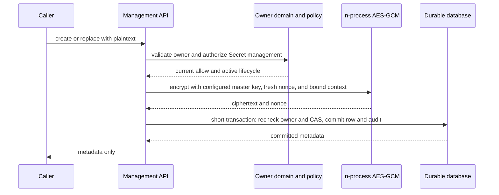

# Secret Management

## Design Position

Foundation Service owns a durable managed Secret resource for opaque values supplied by an authorized caller. The public management API accepts a Secret value on creation or replacement and never returns that value after acceptance, including in the mutation response. It exposes only identity, ownership, key, version, and timestamps.

Secret management is distinct from login credentials, credential selection, resolution, and injection. A Model or another Agent input can bind an exact Workspace-owned Secret reference or declare a User-owned Secret key that is resolved for the invoking User, but it contains no Secret value. Ingresses, Connectors, and MCPConnections can own lifecycle-managed credentials under the [Connectivity subsystem](40-connectivity/README.md). A Connector-managed third-party account token never enters Foundation Secrets, while the credential used to call the Connector service does. MCPConnection bearer values, bounded static-header values, and OAuth credential bundles are Foundation-owned because Foundation acts as the MCP client. This contract owns each accepted Secret's scope and use eligibility; Model Management, Agent authoring, and Connectivity contracts own how non-secret requirements and Foundation-to-provider credentials enter their resources. The management API exposes no public plaintext-read or comparison operation.

A typed `AgentRunOverride` may contain sensitive values only at leaves explicitly declared by a trusted Provider schema, such as bounded runtime Connector headers. Acceptance removes those values from `EffectiveAgentConfig`, encrypts them into one Run-owned payload under the same protection profile, and records only protected binding keys and a protected digest in ordinary state. This payload is not a `Secret`, has no management lifecycle or plaintext-read route, and is reused exactly for retry or resume of that accepted Run. Foundation accepts no generic secret bag, arbitrary sensitive path, or untyped provider dictionary.

Managed Secrets are recoverable encrypted values rather than password verifiers. Foundation therefore encrypts them directly with AES-256-GCM under one operator-configured master key instead of applying one-way hashing. The service is not a zero-knowledge system: the write path observes plaintext transiently, and any process holding the configured master key is cryptographically capable of recovering stored values. The public management API exposes no plaintext-read operation.

Managed Secret identity and versions follow [Platform Data Conventions](../data-conventions.md), and its HTTP surface follows [Platform API Conventions](../api-conventions.md). Host or product policy authenticates callers and authorizes every operation against the selected owner. Provider-side credential rotation and revocation remain issuer or operator responsibilities and are never implied by replacing or deleting a Foundation Secret.

## Ownership

Every Secret belongs to one immutable Organization and Workspace boundary and has exactly one immutable owner reference:

```python
# Conceptual domain schema; not a wire model.
class SecretOwnerRef:
    owner_type: Literal[
        "workspace",
        "user",
        "ingress",
        "connector",
        "mcp_connection",
        "a2a_push_configuration",
    ]
    owner_id: str
```

`SecretOwnerType` is a string enum owned by Foundation IAM and serialized as lowercase `snake_case`. OSS supports `workspace`, `user`, `ingress`, `connector`, `mcp_connection`, and `a2a_push_configuration`. Adding another enum value is additive; removing, renaming, or repurposing one is incompatible while durable data refers to it.

`owner_id` is interpreted according to `owner_type`. A Workspace-owned Secret uses the stored `workspace_id` as `owner_id`. A User-owned Secret uses the User ID and remains bounded to the stored Organization and Workspace. An Ingress-, Connector-, MCPConnection-, or A2A push-configuration-owned Secret uses that exact resource ID and the resource's stored tenant boundary. The pair determines ownership and key uniqueness, while the explicit tenant fields determine isolation and routing. Foundation validates the owner, Organization, Workspace, current RoleBindings, and lifecycle before accepting a mutation. An owner reference grants no authority, and the service infers no tenant or routing fact from the identifier string.

A Workspace Builder or Admin manages Workspace-owned Secrets. Only the owning User manages a User-owned Secret; another Builder or Admin cannot list, inspect, replace, transfer, or delete it. Workspace deletion still performs tenant-owned cleanup. A User-owned Secret is eligible for run-time use only when the active invoking Principal is that User, the User currently has access to the Workspace, and the selected Model or other Agent input declares the matching User Secret key. A Service Account cannot use a User-owned Secret.

Ingress-, Connector-, MCPConnection-, and A2A push-configuration-owned Secrets are internal lifecycle data. Generic Secret routes never create, enumerate, replace, or delete them. The owning operation creates or rotates their values and returns only its safe resource projection. Runtime resolution permits an Ingress-owned Secret only for that exact authorized native provider operation, a Connector-owned Secret only for calls to that Connector service, an MCPConnection-owned Secret only for the exact selected Remote MCP endpoint and authorization identity, and an A2A push Secret only for the exact active configuration and fenced delivery generation. Connector and Ingress credentials never satisfy a third-party account ConnectorConnection, and none of these values becomes Agent input.

Secret keys, owner references, timestamps, and versions are protected metadata even though they are not plaintext Secret values. Management operations disclose them only after current authorization. Management authority and runtime resolution authority remain separate.

The relational Secret table cannot directly foreign-key one polymorphic owner reference to several owner tables, so Foundation domain logic enforces owner referential integrity and cleanup. Database constraints still foreign-key the explicit Organization and Workspace fields. Owner transfer is not a Secret mutation: moving a value requires a separately authorized create under the destination and deletion under the source.

## Credential References

Model, Environment, and other Agent-input contracts reuse one non-secret credential-source model when they select a Workspace Secret by ID or an invoking User Secret by key:

```python
class WorkspaceSecretCredential:
    source: Literal["workspace_secret"]
    secret_id: SecretId


class InvokingUserSecretCredential:
    source: Literal["invoking_user_secret"]
    secret_key: str


type SecretCredentialSource = (
    WorkspaceSecretCredential | InvokingUserSecretCredential
)
```

The source records lookup intent rather than a Secret value or authorization grant. The consuming contract decides which variants it permits and where the source is stored. Every resolution still applies the current owner, tenant, Principal, lifecycle, and use-eligibility rules from this contract.

## Secret Resource

The public resource uses the following wire representation:

```json
{
  "id": "sec_opaque",
  "organization_id": "org_opaque",
  "workspace_id": "ws_opaque",
  "owner_type": "workspace",
  "owner_id": "opaque-owner-id",
  "key": "openai_api_key",
  "version": 1,
  "created_at": "2026-08-25T08:00:00Z",
  "value_updated_at": "2026-08-25T08:00:00Z"
}
```

`sec` is the allocated Foundation object-ID prefix for a managed Secret. The ID is stable, unpredictable, never reused, and is the only supported durable reference to this Secret. `organization_id`, `workspace_id`, `owner_type`, `owner_id`, and `key` are immutable.

`key` is a caller-selected lookup key unique among active Secrets in the same `(organization_id, workspace_id, owner_type, owner_id)`. It is metadata rather than a cryptographic key or bearer credential. It is between 1 and 128 ASCII characters, begins and ends with a lowercase letter or digit, and otherwise contains only lowercase letters, digits, periods, underscores, and hyphens. Foundation performs no case folding, whitespace trimming, Unicode normalization, or environment-variable interpretation.

`version` is a positive integer beginning at `1`. Every accepted value replacement increments it exactly once. Replacing a value with the same bytes is still an accepted replacement and advances the version; the management plane does not decrypt or compare the old value to detect a no-op. Re-encryption under a replacement master key, ciphertext migration that preserves the same plaintext, audit export, and metadata reads do not change the domain version. Prior versions are not addressable or recoverable through this contract.

The request `value` is a non-empty JSON string whose UTF-8 encoding is at most 65,536 bytes. Its decoded string is encrypted exactly as supplied without trimming or normalization. It is marked `writeOnly` in OpenAPI, has no example or default, and exists only in create and replace request models. It is absent, rather than `null`, masked, hashed, truncated, or summarized, from every resource, response, receipt, cursor, error, event, and audit representation.

## Public Management API

All routes use the shared `/api/v1` JSON contract and are exposed only by `control` and `all` service roles. A `worker` or `connectivity` role never serves the public management API. Secret values appear only in authenticated request bodies; they never appear in a URL, query parameter, header, or multipart filename.

Metadata Get and List authorize `secrets.read`. Workspace-owned create,
replace, and delete authorize `secrets.manage`; selecting an existing Secret in
Agent or other authoring configuration authorizes `secrets.bind` in
addition to the consuming resource's update action. User-owned routes instead
require exact authenticated User equality. Internal owner lifecycle and runtime
resolution use their owning resource authority plus the run grant `secret.use`;
they do not turn `secrets.read` or `secrets.manage` into a plaintext-read action.
The action names and built-in grants are owned by the IAM
[stable action registry](33-identity-and-access-management.md#stable-action-registry).

### Create

```http
POST /api/v1/workspaces/{workspace_id}/secrets
POST /api/v1/workspaces/{workspace_id}/users/me/secrets
Content-Type: application/json
```

```json
{
  "key": "openai_api_key",
  "value": "opaque plaintext"
}
```

The first route derives `owner_type = workspace` and `owner_id = workspace_id`. The second derives `owner_type = user` and the authenticated User ID. Both derive Organization from the stored Workspace and reject owner or tenant fields in the request body. Creation resolves and authorizes the owner and returns the metadata-only Secret resource with `201`. Reusing an active key under the same owner and boundary returns `409 secret_key_conflict`; the API does not provide create-or-replace upsert behavior.

### Read Metadata

```http
GET /api/v1/secrets/{secret_id}
GET /api/v1/workspaces/{workspace_id}/secrets?limit=50&cursor=opaque
GET /api/v1/workspaces/{workspace_id}/secrets?key=openai_api_key
GET /api/v1/workspaces/{workspace_id}/users/me/secrets?limit=50&cursor=opaque
GET /api/v1/workspaces/{workspace_id}/users/me/secrets?key=openai_api_key
```

Each collection fixes one owner from its route and never enumerates Secrets across owners or Workspaces. It includes only active resources, supports an optional exact `key` filter, orders unfiltered results by `(key, id)`, and uses the shared opaque cursor contract. Because active key uniqueness holds within one owner and boundary, an exact-key query returns zero or one item. The single-resource route resolves the stored tenant and owner before authorization. Absence, unsupported owner type, owner absence, and concealed denial return the same `404 secret_not_found` result when revealing the distinction is not authorized.

There is no public value-read, value-export, value-comparison, or bulk-copy route.

### Replace Value

```http
PATCH /api/v1/secrets/{secret_id}
Content-Type: application/json
```

```json
{
  "expected_version": 1,
  "value": "replacement plaintext"
}
```

Replacement requires `expected_version`. It changes only the encrypted value and `value_updated_at`, increments `version` exactly once, and returns the metadata-only resource with `200`. A stale precondition returns `409 version_conflict` and makes no change. Owner and key changes are rejected as unknown or immutable request fields rather than interpreted as a transfer or rename.

### Delete

```http
DELETE /api/v1/secrets/{secret_id}?expected_version=2
```

Deletion requires the current `expected_version`. It atomically makes the resource inactive, removes its live ciphertext, nonce, and encryption-key identifier, and returns `204`. A later read observes the resource as absent. Deletion does not revoke the submitted credential at its external issuer.

## Durable Relational Contract

The logical relational model is normative for persisted meaning and constraints; physical column types, ORM classes, and migration mechanics remain implementation details except where stated below.

### `secrets`

| Column              | Durable meaning and constraint                                                                                                            |
| ------------------- | ----------------------------------------------------------------------------------------------------------------------------------------- |
| `id`                | Primary key; immutable `sec_` Foundation object ID                                                                                        |
| `organization_id`   | Immutable owning Organization; foreign-keyed tenant boundary                                                                              |
| `workspace_id`      | Immutable owning Workspace; constrained to the same Organization                                                                          |
| `owner_type`        | Immutable `SecretOwnerType` enum value                                                                                                    |
| `owner_id`          | Immutable opaque owner identifier                                                                                                         |
| `key`               | Immutable validated lookup key                                                                                                            |
| `version`           | Positive current value version                                                                                                            |
| `ciphertext`        | AES-256-GCM ciphertext including the authentication tag; present only while active                                                        |
| `nonce`             | Unique 96-bit AES-GCM nonce for this encrypted value version; present only while active                                                   |
| `encryption_key_id` | Non-secret identifier copied from service configuration; it is not a foreign key and causes no database lookup; present only while active |
| `created_at`        | Immutable UTC creation time                                                                                                               |
| `value_updated_at`  | UTC time of the accepted create or latest replacement                                                                                     |
| `deleted_at`        | UTC tombstone time; absent while active                                                                                                   |

The row enforces these consistency rules:

- `version >= 1`;
- an active row has `deleted_at IS NULL` and non-null `ciphertext`, `nonce`, and `encryption_key_id`;
- a tombstone has `deleted_at IS NOT NULL` and null `ciphertext`, `nonce`, and `encryption_key_id`;
- one partial unique index covers `(organization_id, workspace_id, owner_type, owner_id, key)` only for active rows;
- owner-scoped listing uses an index beginning with `(organization_id, workspace_id, owner_type, owner_id, key, id)`;
- a Workspace owner has `owner_id = workspace_id`, a User owner must be a current platform User eligible for the stored Workspace, and an Ingress, Connector, MCPConnection, or A2A push configuration owner must be that active resource in the same stored tenant boundary;
- no update can change `id`, `organization_id`, `workspace_id`, `owner_type`, `owner_id`, `key`, or `created_at`.

Bounded text columns preserve the validated public limits. `version` uses a non-overflowing positive integer domain, timestamps preserve UTC instants, and `ciphertext` and `nonce` use binary columns rather than text or JSON encoding. `encryption_key_id` is bounded and non-blank; it identifies key material but never contains that material.

A deleted key may be used for a newly generated Secret ID under the same owner. The tombstone retains only non-Secret lifecycle metadata and prevents ID reuse. Ordinary collection reads exclude tombstones.

Replacement updates the active row in place under a row lock. The new ciphertext, nonce, encryption-key identifier, incremented version, and `value_updated_at` commit atomically; the previous encrypted value is not retained as an application-visible version.

Secret creation, replacement, deletion, master-key re-encryption, and denied management attempts emit bounded [IAM security audit events](33-identity-and-access-management.md#security_audit_events). These events contain no Secret key, value-derived data, request body, ciphertext, nonce, master-key material, or raw authorization claims. Their persistence, retention, and export are not part of the Secret relational schema.

## Protection Boundary

Every active Secret value is encrypted directly under one operator-configured 256-bit master key using the fixed `aes_256_gcm_v1` storage profile. Each create or replacement generates a fresh unpredictable 96-bit nonce, and the stored ciphertext includes the 128-bit authentication tag. The service configuration supplies the master-key bytes together with a non-secret `encryption_key_id`; the row records only that identifier. There is no per-Secret data key, key wrapping, or external protector in this contract.

Authenticated additional data uses a stable length-prefixed encoding that binds the exact `id`, `organization_id`, `workspace_id`, `owner_type`, `owner_id`, `key`, `version`, and `encryption_key_id`. Copying ciphertext to another tenant, row, owner, key, version, or key identifier therefore fails authentication rather than returning another Secret's plaintext.

Every role that includes Secret management or runtime Secret resolution loads the configured master key. A `control` process uses it for accepted Secret writes, MCP OAuth setup and refresh, exact Connector credentials required by authorized management adapter operations, and key migration. A `worker` process uses it only to resolve authorized Agent inputs and exact MCPConnection credentials for a fenced RunAttempt. A `connectivity` process uses it only for exact authorized Ingress credentials and Connector runtime dispatch. An `all` process owns all three paths. Worker and Connectivity processes expose no Secret management route, and no role receives decryption authority merely from a public API permission.

Possessing the symmetric key gives each such process cryptographic decryption capability. The distinction between management and runtime resolution is therefore an API, authorization, and code-path boundary rather than cryptographic separation.

The master key is required runtime secret configuration and is never stored in the application database, source tree, or container image. A missing or malformed key, a key that is not exactly 256 bits, or a blank key identifier prevents any role that includes Secret management or resolution from becoming ready. The service has no generated default, plaintext fallback, or alternate ambient key source.

Changing the master-key bytes requires a new `encryption_key_id` and a coordinated decrypt-and-re-encrypt migration of every active ciphertext before the old key becomes unavailable. Reusing one key identifier for different key bytes and replacing the configured key without migrating existing rows are invalid operations. A plaintext-preserving master-key migration changes only `ciphertext`, `nonce`, and `encryption_key_id`; it does not change the Secret domain version or `value_updated_at`.

Plaintext values are retained in process memory only for the bounded cryptographic operation and are released or overwritten on a best-effort basis immediately afterward. Managed runtimes do not promise complete erasure from language-runtime, kernel, crash-dump, or hardware memory. Crash dumps and diagnostic memory capture are therefore disabled or protected in deployments that handle real Secrets.

## Mutation Flows

AES-GCM encryption is process-local, performs no external service I/O, and completes before the database mutation transaction begins.



### Create

1. The API validates the bounded request without rendering the rejected value in an error.
2. Foundation validates the `SecretOwnerType` enum, authoritative owner, current lifecycle, and management authorization.
3. Foundation allocates a fresh `sec_` ID and encrypts version `1` outside a database transaction.
4. One short transaction rechecks that the owner remains eligible, reserves the active owner/key uniqueness constraint, and commits the Secret and security audit event.
5. The response serializes only committed metadata. Uncommitted plaintext, ciphertext, and nonce buffers are discarded on every exit path.

### Replace

1. The API resolves the active Secret and authorizes management against its stored owner.
2. It computes `expected_version + 1` and encrypts the replacement outside a database transaction with that exact version in the authenticated context.
3. One short transaction locks the active row, rechecks owner eligibility and exact `expected_version`, then atomically swaps the ciphertext, nonce, and encryption-key identifier, advances the version, and commits the security audit event.
4. A lost race discards the unused ciphertext and nonce and returns `409 version_conflict`; it never retries against a newly observed version without a new caller request.

### Delete and Owner Cleanup

Direct deletion locks the active row, rechecks authorization and `expected_version`, nulls `ciphertext`, `nonce`, and `encryption_key_id`, sets `deleted_at`, and commits the tombstone and security audit event atomically. It performs no cryptographic operation.

Owner deletion first makes the owner ineligible for Secret creation and replacement. It then tombstones owned Secrets in bounded, restartable batches. Durable batch progress makes interruption and replay safe. Owner deletion is complete only after an authoritative query finds no active owned Secret, and reconciliation repeats cleanup after interruption. Ingress, Connector, or MCPConnection deletion and A2A push-configuration fencing apply their owning lifecycle before tombstoning associated Secrets. Secret resolution denies as soon as any owner is disabled, revoked, deleting, or otherwise ineligible even if physical cleanup has not completed.

## Failure, Cancellation, and Retry Semantics

| Failure or interruption                                              | Observable outcome                                                                             | Mutation effect and retry rule                                                                  |
| -------------------------------------------------------------------- | ---------------------------------------------------------------------------------------------- | ----------------------------------------------------------------------------------------------- |
| Invalid owner type, owner ID, key, value, or request shape           | Safe `400 invalid_request`, or concealed `404` for owner existence policy                      | No mutation; errors omit the submitted value                                                    |
| Missing or denied authentication/authorization                       | `401`, `403`, or concealed `404` under Host policy                                             | No mutation; denial is audited without revealing protected metadata                             |
| Active owner/key already exists on create                            | `409 secret_key_conflict`                                                                      | No mutation; caller selects another key or explicitly replaces the known Secret                 |
| `expected_version` differs from the locked row                       | `409 version_conflict`                                                                         | No mutation; caller must inspect current metadata and make a new decision                       |
| Configured master key or key identifier is missing or invalid        | A role requiring Secret management or resolution fails startup or readiness                    | No Secret route or runtime resolution is available; there is no fallback key or plaintext mode  |
| Secure nonce generation or AES-GCM encryption fails                  | Safe `500 secret_protection_failed`                                                            | No database mutation; transient buffers are discarded; the caller may retry                     |
| Cancellation before database commit begins                           | Request is cancelled                                                                           | No committed mutation; transient buffers are discarded best-effort                              |
| Timeout, disconnect, or cancellation during possible database commit | Unknown to the caller                                                                          | Read current metadata before deciding whether to issue another mutation                         |
| Database failure before commit                                       | Safe `503` or `500` according to dependency class                                              | The Secret row remains uncommitted                                                              |
| Stored ciphertext, nonce, or key identifier cannot authenticate      | Metadata remains readable to an authorized manager; value is unavailable to runtime resolution | Fail closed, emit a security observation, and never return partial or unauthenticated plaintext |
| Delete races with replace                                            | Row lock, owner lifecycle state, and CAS select one committed order                            | Losing mutation receives absence or version conflict; it does not recreate the value            |

The service retains no mutation replay evidence. After a possibly committed create, the caller queries the exact owner/key; after replacement, it reads the Secret and compares `version`; after deletion, it reads the Secret and observes whether it is absent. These reads establish current metadata but do not reveal the configured value or prove which concurrent caller supplied it. A caller issues another mutation only as a new decision against the state it observed, and replacement remains protected by `expected_version`.

## Observability and Disclosure Controls

Request bodies, validation inputs, authorization headers, encryption contexts, ciphertext, nonces, master-key material, and SQL bind values never enter ordinary logs, error details, traces, metrics labels, profiling samples, or durable events. Stable event names may include Secret operation, outcome class, service role, request ID, and latency; they exclude Secret key and value-derived data.

Validation and exception mapping sanitize framework error structures that would otherwise retain or serialize the rejected input. Production diagnostics do not include local variables or request bodies. First-party SDK request objects redact the value from string, debug, and exception representations and use response types that have no value field.

The public OpenAPI document marks `value` as `writeOnly` but includes no example or default Secret. Interactive documentation, browser forms, analytics, session replay, and client telemetry do not retain the entered value after request construction.

## Compatibility

Adding a `SecretOwnerType` enum value is additive. Removing, renaming, repurposing, or weakening the tenant, validation, authorization, or public-visibility semantics of a value is incompatible while any durable row, tombstone, or cursor refers to it.

The Secret domain `version` is independent from HTTP `v1`, `encryption_key_id`, the `aes_256_gcm_v1` storage profile, and database schema revision. Public clients treat additive response fields and new owner types according to the shared API compatibility rules. No compatible change can add plaintext to an existing response, error, event, SDK debug representation, or management permission.

The `aes_256_gcm_v1` ciphertext layout, nonce size, authentication-tag size, additional-data codec, and `encryption_key_id` meaning are durable storage compatibility facts. The service fails closed when a row names a key identifier unavailable to the decrypting process or cannot authenticate under the exact stored context. Changing the algorithm, encoding, or master key requires a coordinated storage migration; such a migration may preserve Secret ID, owner, resource key, and domain version only when it proves the plaintext meaning unchanged.

## Trade-offs

Polymorphic `(owner_type, owner_id)` ownership supports Workspace-shared, User-personal, Ingress, Connector, MCPConnection, and A2A push values without parallel Secret tables. Explicit Organization and Workspace columns preserve tenant filtering and relational tenant consistency, while Foundation domain logic and each owner lifecycle enforce polymorphic owner existence, visibility, cleanup, and reconciliation.

Write-only management sharply limits accidental human and API disclosure but cannot prove that a process or operator holding the master key never accesses the value. Direct AES-256-GCM encryption avoids an external key-service dependency and keeps the row and write path small. In exchange, compromise of both the database and master key exposes every active Secret, a compromised process holding the key can decrypt stored values, and master-key replacement requires decrypting and re-encrypting all active rows rather than rewrapping small per-Secret keys.

Retaining no application-visible value history reduces exposure and makes rollback impossible. Rotation mistakes are repaired by another authorized replacement or at the credential issuer, not by revealing or restoring an older Foundation value.

## Invariants

1. Every managed Secret has one immutable `sec_` ID, Organization, Workspace, `SecretOwnerType`, `owner_id`, and key.
2. Unsupported owner enum values and owner IDs that fail existence, lifecycle, or authorization checks are rejected.
3. The public management API never resolves plaintext, although every process holding the symmetric master key is cryptographically capable of decryption.
4. A Secret value appears only in bounded create or replace request memory and never in any management response or durable non-ciphertext record.
5. Every replacement requires exact CAS against `expected_version` and advances the positive Secret version exactly once.
6. Active owner/key uniqueness is enforced durably, and the management API provides no implicit upsert.
7. Direct or owner-driven deletion removes the live ciphertext, nonce, and encryption-key identifier and preserves a metadata-only tombstone; it does not claim issuer revocation.
8. Logs, errors, traces, metrics, cursors, audit events, and SDK debug representations contain no plaintext, reversible value derivative, ciphertext, nonce, or master-key material.
9. A User-owned Secret is managed only by that User and can be used only for an Agent invocation whose active User Principal is the same owner and whose accepted configuration declares the matching key.
