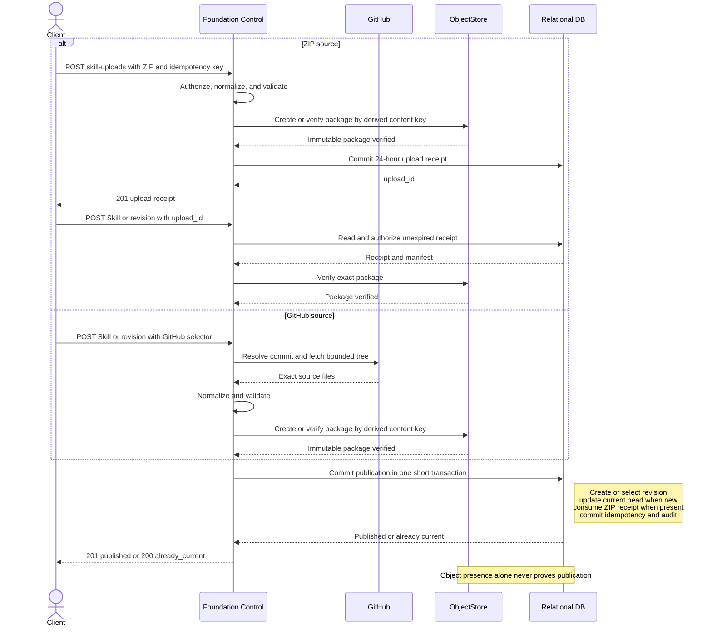

# Foundation Skill Management

## Design Position

Foundation manages Skills as Workspace-owned resources with immutable revisions. A Builder publishes a revision from a staged ZIP package or a typed GitHub selector, then selects exact revisions while authoring an Agent. Package bytes live in object storage; identity, revisions, authorization, provenance, and AgentPresetVersion locks live in Foundation's durable control state.

Foundation follows the shared [Managed Skill Package Contract](../managed-skill-packages.md)
and never executes from an upload, repository, mutable ref, object URL, or Worker
cache. A Worker materializes only the effective Run selection from the revisions
locked by the selected `AgentPresetVersion`, then uses the public Harness `SkillManager`
and `SkillsCapability`. Managed Skills are content resources, not trusted Harness
plugins. Foundation validates package `SKILL.md` metadata with its own admission
parser; it does not import a Harness parser API.

## Boundaries

| Concern                                                           | Owner                                                                            |
| ----------------------------------------------------------------- | -------------------------------------------------------------------------------- |
| Package shape, metadata projection, normalization, digest, limits | [Managed Skill Package Contract](../managed-skill-packages.md)                   |
| Harness discovery, selection, instructions, and paths             | [Harness Skills](../agent-harness/09-context-and-memory.md#skills-and-discovery) |
| Workspace resource, revision, API, authorization, and retention   | This document                                                                    |
| Idempotency and unknown mutation outcomes                         | [Durable Operations](06-durable-operations-and-outbox.md)                        |
| GitHub credential value and eligibility                           | [Secret Management](11-secret-management.md)                                     |
| Exact Agent composition                                           | [Agent Management](12-agent-management.md)                                       |
| Environment attachment and write authority                        | [Environment Management](19-environment-management.md)                           |

Foundation accepts no server-native source path, arbitrary URL, executable extension, or ambient Skill directory through this API.

## Resource Model

The following schemas are conceptual domain and public read shapes:

```python
class WorkspaceSkill:
    id: SkillId
    organization_id: OrganizationId
    workspace_id: WorkspaceId
    display_name: str
    version: int
    current_revision_id: SkillRevisionId
    created_at: datetime
    created_by: PrincipalRef
    updated_at: datetime
    deleted_at: datetime | None


class WorkspaceSkillRevision:
    id: SkillRevisionId
    skill_id: SkillId
    workspace_id: WorkspaceId
    revision_number: int
    manifest: ManagedSkillPackageManifest
    imported_from: ZipSkillImportProvenance | GitHubSkillImportProvenance
    created_at: datetime
    created_by: PrincipalRef
```

`sk_`, `skr_`, and `sku_` prefix stable Skills, immutable revisions, and staged ZIP receipts. A Skill is created atomically with revision `1`. Publishing a revision appends the next number, selects it as current, and increments the Skill `version`. Changing only `display_name` also increments `version`.

`manifest.skill_name` and `manifest.description` are verified projections of `SKILL.md`. A later revision can change them; existing AgentPresetVersions remain bound to their exact old revision and name. Workspace Skills can share a model-facing name; AgentPreset Publish rejects duplicates only within one selected catalog.

Foundation stores each normalized package as one immutable ZIP object. For package contract version `1`, its internal object key is derived exactly as follows:

```text
tenants/{organization_id}/workspaces/{workspace_id}/skills/packages/version-1/{content_digest}.zip
```

The ZIP contains only the files named by the revision manifest. ZIP byte encoding is not content identity; every read verifies the expanded files against the manifest. Foundation derives the key only after an authorized Workspace and revision lookup. It is not stored in `WorkspaceSkillRevision`, accepted from a caller, exposed by the API, or treated as access authority. `imported_from` records source provenance only and is never used to locate package content.

Objects and revisions remain while referenced by a retained AgentPresetVersion, Run, or current Skill head. Tombstoning a Skill prevents new revisions and AgentPreset bindings but does not rewrite retained Agents or Runs.

## Service Bounds

Foundation enforces the shared package maxima. It additionally fixes these public bounds:

| Value                                       |                          Limit |
| ------------------------------------------- | -----------------------------: |
| Staged ZIP lifetime                         |                       24 hours |
| `Idempotency-Key` evidence                  | 24 hours after accepted commit |
| GitHub acquisition deadline                 |                     60 seconds |
| Available Skill revisions in one Agent node |                            512 |

Deployments can impose lower quotas on active Skills, revisions, or concurrent uploads. Reaching a quota rejects the operation; it never evicts retained content. `display_name` is NFC, contains 1 through 256 Unicode scalar values, has no leading or trailing whitespace, and contains no control character.

Foundation retains `Idempotency-Key` evidence for ZIP staging, Skill creation, and revision publication for 24 hours after the accepted commit. A replay within that horizon returns the original bounded result before evaluating current resource state. After expiry, Foundation no longer promises replay, and absent evidence does not prove that the earlier request never committed.

## Public Management API

All routes are under `/api/v1`, follow [Platform API Conventions](../api-conventions.md), and are exposed by `control` and `all`, not `worker`.

### Stage a ZIP

```http
POST /api/v1/workspaces/{workspace_id}/skill-uploads
Content-Type: application/zip
Idempotency-Key: opaque-caller-key

GET /api/v1/skill-uploads/{upload_id}
DELETE /api/v1/skill-uploads/{upload_id}
```

The POST body is exactly one ZIP. Foundation streams, hashes, fully normalizes, and
validates it under the shared contract with its own package-admission implementation,
stores the resulting candidate package, then creates an expiring receipt. It does
not accept multipart metadata, base64, or a client-selected storage path.

```python
class SkillUploadReceipt:
    upload_id: SkillUploadId
    workspace_id: WorkspaceId
    archive_sha256: str
    manifest: ManagedSkillPackageManifest
    expires_at: datetime
    consumed_by_revision_id: SkillRevisionId | None
```

POST returns `201`; GET returns `200`; deleting an unconsumed receipt returns `204`. The receipt is scoped to the Workspace and uploading Principal, grants no package or Agent authority, and can be consumed once. The same idempotency key and archive bytes return the same receipt; different bytes conflict. Expired candidates are removed without affecting published revisions.

### Create a Skill or Revision

```python
class ZipUploadSkillSource:
    kind: Literal["zip_upload"]
    upload_id: SkillUploadId


class GitHubRevisionSource:
    kind: Literal["github"]
    repository_url: str
    ref: str | None = None
    subdirectory: str = ""
    expected_commit_sha: str | None = None
    credential_secret_id: SecretId | None = None


FoundationSkillRevisionSource = Annotated[
    ZipUploadSkillSource | GitHubRevisionSource,
    Field(discriminator="kind"),
]


class CreateSkillRequest:
    display_name: str
    source: FoundationSkillRevisionSource


class CreateSkillRevisionRequest:
    expected_version: int
    source: FoundationSkillRevisionSource
```

```http
POST /api/v1/workspaces/{workspace_id}/skills
POST /api/v1/skills/{skill_id}/revisions
Content-Type: application/json
Idempotency-Key: opaque-caller-key
```

Create returns the Skill and revision `1` with `201`. Revision publication compares `expected_version`; different content appends and selects one revision with `201`, while content equal to the current revision returns it with `200` and does not advance the Skill. Consuming a staged upload verifies its unexpired receipt. A GitHub source is resolved and normalized during the request before durable publication.

`credential_secret_id` selects a current authorized Workspace Secret for this GitHub acquisition. Foundation does not store the selector or value in the revision, package, provenance, logs, or errors. Re-importing a private source requires the caller to submit another revision with an eligible Secret.

### Read, Update, and Delete

```http
GET /api/v1/workspaces/{workspace_id}/skills?limit=50&cursor=opaque
GET /api/v1/skills/{skill_id}
GET /api/v1/skills/{skill_id}/revisions?limit=50&cursor=opaque
GET /api/v1/skill-revisions/{skill_revision_id}
GET /api/v1/skill-revisions/{skill_revision_id}/content
PATCH /api/v1/skills/{skill_id}
DELETE /api/v1/skills/{skill_id}?expected_version=3
```

```python
class UpdateSkillRequest:
    expected_version: int
    display_name: str


class SkillPublicationReceipt:
    skill: WorkspaceSkill
    revision: WorkspaceSkillRevision
    outcome: Literal["published", "already_current"]
```

Reads expose safe provenance and manifest metadata, never Secret selectors, object keys, or provider responses. The authorized `/content` route streams a normalized ZIP as `application/zip` with `ETag: W/"sha256:<content_digest>"`; it is not the original upload or a public object-storage URL. Skill collections order by `(display_name, id)` and revision collections by `(revision_number desc, id)` under the shared cursor contract.

PATCH changes only `display_name` under the expected version. Clients re-import a GitHub source by submitting another revision with the recorded selector. Delete tombstones the Skill under its expected version and returns `204`.

Stable error codes include `skill_not_found`, `skill_version_conflict`, `skill_upload_not_found`, `skill_upload_expired`, `skill_upload_consumed`, `skill_package_invalid`, `skill_package_limit`, `github_source_invalid`, `github_commit_mismatch`, `github_auth_failed`, `github_rate_limited`, and `github_unavailable`. Invalid inputs use `400`; absent or concealed resources use `404`; version, upload, and idempotency conflicts use `409`; GitHub rate limiting uses `429`; retryable dependencies use `503`. Errors never include package bodies, credentials, object keys, or private paths.

## Authorization and Audit

The domain contributes `skill.read`, `skill.create`, `skill.update`, `skill.delete`, and `skill.bind`. Viewer can read safe metadata and content. Builder and Admin can manage and bind Skills. Direct Agent Builder can bind an otherwise readable Skill while authoring that Agent but cannot manage the Workspace resource without a Workspace role.

Every request reauthorizes its Workspace and resource. AgentPreset Publish reauthorizes `skill.bind` for every selected revision. Workers read packages under internal Run authority; invoking an Agent does not grant the caller package download permission.

Skill creation, revision publication, metadata update, deletion, and denied management attempts emit bounded [IAM security audit events](10-identity-and-access-management.md#security_audit_events). Common event fields record the actor, Workspace, action, primary Skill resource when known, and success-or-failure outcome. The stable actions are `skill.create`, `skill.revision.publish`, `skill.update`, and `skill.delete`; a denied attempt uses the same action with failure outcome. Action-owned `details` use this additional allowlist:

- Successful Skill creation records `selected_revision_id` and `source_kind`.
- Successful revision publication records `previous_revision_id`, `selected_revision_id`, `source_kind`, and `publication_outcome`, whose value is `published` or `already_current`. The two revision IDs are equal when the selected content is already current; otherwise they identify the immutable transition that an authorized caller can compare.
- Successful metadata update records only `changed_fields`; it never records the old or new `display_name`.

`source_kind` is the submitted source discriminator, `zip_upload` or `github`.

The audit event never copies a GitHub repository, requested ref, resolved commit, subdirectory, archive digest, package content digest, manifest or file metadata, object key, or package bytes. Those facts remain under the authorized Skill revision and object-storage contracts. Security audit is operation evidence, not Skill value history; reading an audit event grants no authority to read either referenced revision.

## Publication



The ZIP upload operation ends when its receipt commits; the later Skill request is the publication operation. An unconsumed receipt expires after 24 hours, and only a package object with no published reference can then be reclaimed. GitHub acquisition joins the same flow after source resolution and normalization.

Source acquisition, validation, and object storage occur without a database session. Foundation publishes or verifies the immutable package object before the final short transaction. A failed or unknown commit creates no authoritative revision and is reconciled by the same idempotency key.

## AgentPresetVersion Selection

Agent authoring accepts this value per Agent node:

```python
class FoundationAgentSkillSelectionRequest:
    available_revision_ids: tuple[SkillRevisionId, ...]
    materialization_mount: str | None
    default_mode: Literal["all", "exact"]
    default_names: tuple[str, ...]


class FoundationSkillRevisionLock:
    skill_revision_id: SkillRevisionId
    skill_name: str
    content_digest: str


class FoundationAgentSkillSelection:
    available: tuple[FoundationSkillRevisionLock, ...]
    materialization_mount: str | None
    default_mode: Literal["all", "exact"]
    default_names: tuple[str, ...]
```

The request selects immutable revision IDs, including an authorized retained non-current revision. It accepts no `latest`, upload receipt, GitHub selector, object URL, or source path. AgentPreset Publish resolves and copies the complete locks.

`materialization_mount` is absent exactly when no Skills are available. `all`
exposes the complete unique-name catalog and has empty `default_names`; `exact`
exposes the exact possibly-empty set. Publication rejects inaccessible or deleted
Skills, duplicate final names, unknown exact names, a catalog over the service limit,
and an Environment mount whose access is not `read_write` or `full`. Later Skill publication or deletion never mutates the AgentPresetVersion or
an accepted Run.

Root, ordinary continuation, fork, and equivalent Host-owned initial Run submissions can optionally carry `selected_skill_names`. Absence uses the selected AgentPresetVersion's `default_mode` and `default_names`; a present JSON array is the exact selection for that Run, including an empty array that selects no Skills. JSON `null` is invalid. The array contains at most 512 distinct names, and every name must occur in the AgentPresetVersion's `available` locks. The override can choose any subset of that locked catalog but cannot add a revision, change a digest or materialization mount, or select a source or mutable Skill head. Waiting feedback and explicit retry preserve the source Run's effective tuple: those operations continue frozen deferred work or accepted intent rather than accepting a new run override.

Run acceptance orders the resulting names by their order in `available` and stores that complete effective tuple as `RunStateEnvelope.selected_skill_names`. It is immutable for the Run and is included in the canonical idempotency request. An invalid shape, null, oversized array, unknown name, or duplicate name fails before Run creation with `400` and `skill_selection_invalid`. The effective tuple is Foundation Host state, not Harness portable Capability state.

## Worker Materialization and Harness Use

Before Harness entry, the Worker verifies the state selection against the complete AgentPresetVersion catalog, then reads and verifies only the selected locked revisions and package content. It constructs an explicit `SkillManager` with the exact Host materializer and supplies `SkillSelectionRunCapability(names=frozenset(selected_skill_names))` from the Run state. After Harness enters the fresh Environment, but before model or tool work, `SkillsCapability`:

1. invokes the materializer to write those files through the current version-pinned `FileOperator` into a Host-reserved content-addressed root;
2. verifies the complete root and writes a Host completion manifest last;
3. scans only the verified package roots with the explicit `SkillManager`; and
4. applies the already supplied exact-name selection before publishing model instructions or Skill paths.

The completion manifest is Host-owned materialization metadata, not a package file. It remains outside every directory scanned as a Skill package and is excluded from the normalized file payloads, revision manifest, content digest, and model-visible Skill resources.

An existing root is reused only after complete verification. An interrupted root has no valid completion manifest; a later attempt verifies a complete root or materializes the exact bytes again. Harness never scans partial content or falls back to a project, home, package, or Worker-cache directory.

Materialization outcomes are:

| Outcome                             | Semantics                                                                                                                           |
| ----------------------------------- | ----------------------------------------------------------------------------------------------------------------------------------- |
| `skill_materialization_invalid`     | A locked revision, object, digest, or package contract is invalid; fail closed until another AgentPresetVersion is selected         |
| `skill_materialization_unavailable` | Object storage or Environment access is temporarily unavailable; retry only through a new fenced RunAttempt under ordinary ceilings |
| `skill_materialization_stale`       | The attachment, provider generation, or RunAttempt fence changed; abandon the attempt and reacquire authority                       |
| `skill_materialization_cancelled`   | Cancellation or shutdown won; preserve the ordinary cancelled or interrupted lifecycle                                              |

Materialization is content-addressed Host preparation, not an Agent tool call or a provider-resource recovery record. A replacement attempt uses its fresh Environment, verifies or recreates the same exact root when available, and never substitutes the current Skill head. No failure above publishes Skill instructions, paths, model requests, or Agent tool calls.

## Compatibility

Stable Skill/revision meaning, source union, shared package contract, public API, Agent lock fields, Run override and effective-selection meaning, completion-manifest boundary, and internal package-key derivation are compatibility facts. Changing that persisted key layout requires migration; object-storage backend and GitHub acquisition implementations remain private.

## Invariants

1. Every Skill belongs to one immutable Organization and Workspace, and every revision selects one immutable package and provenance record.
2. Uploads, GitHub refs, object URLs, caches, and package content grant no runtime authority by themselves.
3. AgentPresetVersions lock the available Skill catalog and defaults; each Run freezes one exact effective name tuple within that catalog.
4. Later Skill mutations do not change AgentPresetVersion locks or an accepted Run's effective selection.
5. No database transaction spans source acquisition, object storage, Environment I/O, or Harness work.
6. Harness scanning begins only after the complete materialized root verifies.
