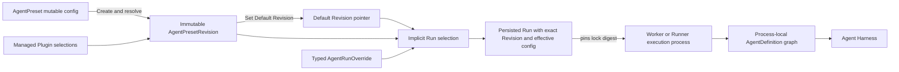

# Agent Management

## Design Position

Foundation exposes `AgentPreset` as the stable Workspace-owned resource for Agent authoring, authorization, lifecycle, and invocation. An `AgentPreset` contains one mutable complete `config`. Create Revision resolves that config into an immutable executable `AgentPresetRevision`; Set Default Revision independently selects which Revision an invocation uses when it omits an exact Revision. Foundation does not persist a separate product `Agent` or `AgentRevision`.

A Run selects one exact `AgentPresetRevision` at durable acceptance. A Worker reconstructs process-local Harness `AgentDefinition`, `SubagentDefinition`, `ExecutableAgent`, and Plugin objects from the Revision's frozen effective configuration. Those Python values are never management resources or durable payloads.

[Managed Harness Plugins and Runtime](36-managed-harness-plugins-and-runtime.md) owns the deployment-level Plugin catalog, selection variants, immutable Versions, lifecycle, commands, artifacts, and Runtime behavior. Agent Management only embeds those typed selections and exact resolved locks into Preset configuration and Revisions.



## Boundaries

| Concern                                                                                              | Owner                                                                                                        | Relationship                                                                |
| ---------------------------------------------------------------------------------------------------- | ------------------------------------------------------------------------------------------------------------ | --------------------------------------------------------------------------- |
| Preset identity, config, Revisions, default selection, lifecycle, Duplicate, and typed Run overrides | This document                                                                                                | Defines the durable Agent management model                                  |
| Plugin identity, Versions, selection, lifecycle, commands, artifacts, and Runtime                    | [Managed Harness Plugins and Runtime](36-managed-harness-plugins-and-runtime.md)                             | Supplies typed selections and exact resolved locks to Presets               |
| Plugin factories, configured instances, ordering, middleware, and Capability contribution            | [Harness Plugin System](../agent-harness/05-plugin-system.md)                                                | Builds concrete process-local plugins from an explicitly selected catalog   |
| Agent execution, state, and process-local subagent graph                                             | Agent Harness                                                                                                | Receives reconstructed definitions and fresh run bindings                   |
| Run acceptance, persistence, recovery, and lineage                                                   | [Interactions and Runs](10-interactions-runs-and-attempts.md) and [Durable Run State](12-run-persistence.md) | Persist the exact selected Revision and effective config                    |
| Agent input wire, canonicalization, and adapter mapping                                              | [Agent Input](17-agent-input.md)                                                                             | AgentPresetConfig stores adapter configuration and each Revision freezes it |
| Product authorization and executable-code administration                                             | [Foundation IAM](33-identity-and-access-management.md)                                                       | Separates Preset authoring from deployment code authority                   |
| Secret values and run-time eligibility                                                               | [Secret Management](27-secret-management.md)                                                                 | Revisions store requirements and references, never plaintext values         |
| Public HTTP paths and common mutation behavior                                                       | [Management API](16-management-api.md) and [Platform API Conventions](../api-conventions.md)                 | Expose the resources and commands defined here                              |

## AgentPreset Resource Model

An `AgentPreset` is the complete user-visible Agent configuration identity:

```python
type AgentPresetSource = Literal["builtin", "custom"]
type AgentPresetLifecycleState = Literal[
    "enabled",
    "disabled",
    "archived",
]


class AgentPreset:
    id: str
    organization_id: str
    workspace_id: str
    source: AgentPresetSource
    name: str
    description: str | None
    lifecycle_state: AgentPresetLifecycleState
    resource_version: int
    config: AgentPresetConfig
    default_revision_id: str | None
    config_base_revision_id: str | None
    config_changed_since_revision: bool
    duplicated_from_preset_id: str | None
    duplicated_from_revision_id: str | None
    created_by: PrincipalRef | SystemActorRef
    created_at: datetime
    updated_at: datetime
```

`config` is a complete, mutable authoring document. It is not named Draft and is not independently addressable. Saving it changes neither `default_revision_id` nor running behavior. `resource_version` is the optimistic concurrency token for mutable Preset state; it is distinct from a Revision number, configuration schema version, package version, and content digest.

`config_base_revision_id` records the most recent Revision created from `config`. `config_changed_since_revision` is a derived comparison between normalized config and that Revision's authoring content; it is not a validation or test state. Setting another default Revision changes neither field.

A custom Preset is created as `enabled` with no default Revision. Its complete config is editable immediately. Exact Revision invocation becomes available after Revision creation; invocation that omits an exact Revision fails with `preset_default_revision_missing` until Set Default Revision succeeds.

## AgentPresetConfig

`AgentPresetConfig` is finite Foundation-owned serializable data. The following conceptual types define its public domain boundary; referenced resource schemas remain owned by their management documents:

```python
class AgentModelConfig:
    model_config_id: ModelConfigId
    settings: ModelSettings
    characteristics: HarnessModelCharacteristics


class SkillSelection:
    skill_revision_id: SkillRevisionId


class ConnectorConnectionToolSelection:
    connector_connection_id: ConnectorConnectionId
    tools: tuple[str, ...] | None
    exposure: MCPExposureMode = "direct"


class MCPConnectionToolSelection:
    mcp_connection_id: MCPConnectionId
    tools: tuple[str, ...] | None
    exposure: MCPExposureMode = "direct"


class EnvironmentSelection:
    environment_revision_id: EnvironmentRevisionId


class ChildEnvironmentPolicy:
    mode: Literal["none", "shared_root", "dedicated"]


class SubagentSelection:
    agent_preset_id: AgentPresetId
    revision: int | None
    description: str | None
    context: DelegationContextPolicy
    usage_limits: UsageLimits | None
    environment: ChildEnvironmentPolicy


class OutputVariant:
    name: str
    description: str | None
    schema: JsonSchema
    resources: dict[str, JsonSchema]

class OutputSpec:
    name: str | None
    description: str | None
    schema: JsonSchema | None
    resources: dict[str, JsonSchema]
    variants: tuple[OutputVariant, ...] | None


class RetryConfig:
    tools: int
    output: int


class InputAdapterConfig:
    adapter_key: str
    config: JsonObject


class AssetPublicationConfig:
    enabled: Literal[True]


class ProtocolConfig:
    schema_version: Literal["1"]
    public_name: str
    public_description: str | None
    output_modes: tuple[str, ...]
    input_data_schema: JsonObject | None
    state_schema: JsonObject | None
    context_schema: JsonObject | None
    client_tools: tuple[ClientToolPolicy, ...]
    event_visibility: tuple[str, ...]
    a2a_skills: tuple[A2ASkillProjection, ...]
    extended_agent_card: ExtendedAgentCardPolicy | None
    limits: ProtocolLimits


class AgentPresetConfig:
    model: AgentModelConfig
    instructions: str
    input_adapter: InputAdapterConfig
    plugins: tuple[PluginSelection, ...]
    skills: tuple[SkillSelection, ...]
    connector_tools: dict[str, ConnectorConnectionToolSelection]
    mcp_tools: dict[str, MCPConnectionToolSelection]
    environment: EnvironmentSelection | None
    subagents: dict[str, SubagentSelection]
    client_tools: tuple[ClientToolDefinition, ...]
    output_spec: OutputSpec | None
    retries: RetryConfig | None
    secret_requirements: tuple[SecretRequirement, ...]
    asset_publication: AssetPublicationConfig | None
    protocol: ProtocolConfig
```

The [`PluginSelection` contract](36-managed-harness-plugins-and-runtime.md#preset-selection-and-revision-locking) determines which Plugin selection variant is legal under the deployment's fixed Runtime profile. `instructions` is the Agent's stable system prompt; Foundation- and Harness-generated runtime context is not stored in this field. `skills` selects exact Skill Revisions rather than a mutable catalog plus defaults. `environment` selects at most one primary exact EnvironmentRevision. Connector-tool, MCP-tool, and subagent map keys are stable local names within the Agent. Each child edge freezes Harness delegation context, usage ceilings, and its Host Environment association policy. `client_tools` stores only serializable declarations; executable handlers and callbacks remain SDK-local.

`OutputSpec` permits either one top-level `schema` with optional local `resources`, or at least two mutually exclusive `variants`; it never permits nested variants or runtime retrieval of schema resources. `None` means free-text output. `RetryConfig` contains bounded non-negative tool-argument and structured-output model-correction budgets. It does not configure provider transport retry, Worker recovery, whole-Run retry, or business-workflow retry.

The config contains no Python class, import target, callable, native Model, Toolset, Capability instance, Plugin object, client, credential value, plaintext Secret, Environment adapter, current Environment state, entered facade, live controller, arbitrary artifact URL, or process-local value. Python extension selection and construction follow the [managed Plugin contract](36-managed-harness-plugins-and-runtime.md); Agent Management stores only its typed selection. `asset_publication` is the one dedicated platform Capability selection required by the [Asset publication contract](32-asset-management.md#agent-publication-capability), not an extensible Capability list.

Saving config performs only request-schema structure, type, size, and bounds validation. Foundation exposes no independent Validate resource, preview state, warning collection, or partially valid config lifecycle. Create Revision is the sole authoritative resolve-and-build validation path.

`input_adapter` selects one trusted adapter key and bounded configuration. Revision creation validates and freezes it inside the Revision. The Revision carries no declaration of allowed input block types, media types, sources, deliveries, or per-input limits; every Revision accepts the common [`AgentInput`](17-agent-input.md) wire contract. Run acceptance validates and canonicalizes that input, and the Worker verifies the pinned Runtime lock before invoking the adapter. A replacement execution attempt reuses the same Revision, adapter configuration, accepted input, and Runtime lock.

When `asset_publication` is present, the trusted Foundation `AssetCapability` exposes `publish_asset`. Each execution attempt binds only its current authorized Environment; the tool fails closed when no readable default binding can supply the selected path. Package presence or general Environment file access does not enable the tool, and the Capability adds no durable Capability-state schema.

## Run Capability Overlay

Agent authoring defines the default model-visible managed capability surface. A direct invocation or trusted input owner such as an Ingress Route can supply one bounded overlay without mutating the AgentPresetRevision:

```python
class RunCapabilityOverlay:
    inherit_agent: bool = True
    include: tuple[ManagedCapabilitySelection, ...] = ()
    exclude: tuple[CapabilityKey, ...] = ()
```

`ManagedCapabilitySelection` is a tagged union owned by the corresponding managed Skill, MCPConnection, ConnectorConnection tool, or native Ingress action contract. An MCPConnection or ConnectorConnection selection includes its `direct` or `catalog` exposure and exact tool allowlist; an Ingress native action is always direct. Every selection has one stable `CapabilityKey`, exact configuration or managed-resource references, and all required compatibility evidence. The overlay contains no Python object, import target, arbitrary local function tool, Plugin, credential, endpoint, or unversioned remote schema.

Resolution is deliberately small:

```text
candidate = (Agent defaults when inherit_agent else empty) + include - exclude
effective = candidate intersect current authorization and deployment policy
```

`include` can select an authorized managed capability absent from the Agent defaults. `exclude` removes one exact selectable key and cannot remove mandatory Harness safety, Identity, policy, usage, output, or Environment behavior. `inherit_agent=false` replaces only the Agent's selectable managed capability surface; it does not replace the Agent, model, instructions, output contract, Plugins, subagents, Runtime lock, or security ceiling. Duplicate keys, conflicting selections, an unknown exclusion, unavailable compatibility evidence, or an unauthorized addition fail Run acceptance.

The accepted Run retains the complete effective selection and the exact [`MCPToolSnapshot`](40-connectivity/04-agent-facing-tools.md#mcp-toolsnapshot), digests, or revision locks produced from it. Replacement RunAttempts reconstruct that same surface with fresh authority and fail closed instead of silently adding, removing, or substituting a capability. Model input and tool output cannot create or modify an overlay.

## Protocol Configuration

Every `AgentPresetConfig` embeds one finite `protocol` configuration. It is Preset-owned authoring data rather than an independently addressable resource, and it has no separate lifecycle, API, enable switch, or content digest.

The bounded nested types are Foundation-owned serializable values. Revision creation validates JSON Schemas, public metadata, MIME modes, event names, client-tool policies, A2A projections, and per-protocol limits against finite registries and deployment hard ceilings. Configuration can narrow a permitted surface but cannot expose raw reasoning, credentials, private execution identities, unregistered events, arbitrary code, or a capability that the deployment does not support.

`input_data_schema`, when present, is the self-contained JSON Schema Draft 2020-12 contract projected for `AgentInput.structured_content`. Revision creation validates and freezes it. Run acceptance applies it only when `structured_content` is non-null; absent structured content is always valid. The schema does not restrict text or binary blocks, media types, sources, or deliveries.

Safe defaults impose no structured-content schema, expose bounded text output and the standard Run, text, and client-visible tool event families, accept no protocol client tools, require empty state and context, generate a minimal public-safe A2A Agent Card, and expose no extended Card. Native and Hosted AG-UI remain available for every callable Preset. The deployment-wide `gateway.a2a_enabled` setting is the only A2A availability switch; ProtocolConfig does not enable or disable a protocol.

Revision creation freezes normalized ProtocolConfig in the immutable Revision, whose `content_digest` covers the complete config. Hosted AG-UI Run and A2A Task acceptance persist the exact `agent_preset_revision_id`; retry, feedback, recovery, and replay therefore use the same protocol configuration without storing a redundant protocol digest. Creating and selecting another default Revision changes Cards and implicit acceptance policy only for later work. Continuation additionally follows the state and input compatibility rules of the selected Revision.

## AgentRunOverride and Effective Configuration

One Run request may carry a finite typed `config_override`. It is request data, not a management resource, and has no identity or lifecycle:

```python
class InlineEnvironmentSelection:
    provider: EnvironmentProviderSpec
    credential_bindings: tuple[EnvironmentCredentialBinding, ...]
    access: EnvironmentAccess = "full"


type EnvironmentOverride = EnvironmentSelection | InlineEnvironmentSelection


class ModelOverride:
    model_config_id: ModelConfigId | None
    settings: ModelSettings | None
    characteristics: HarnessModelCharacteristics | None


class ConnectorConnectionToolOverride:
    connector_connection_id: ConnectorConnectionId | None
    tools: tuple[str, ...] | None
    exposure: MCPExposureMode | None


class MCPConnectionToolOverride:
    mcp_connection_id: MCPConnectionId | None
    tools: tuple[str, ...] | None
    exposure: MCPExposureMode | None


class SubagentOverride:
    agent_preset_id: AgentPresetId | None
    revision: int | None
    description: str | None
    context: DelegationContextPolicy | None
    usage_limits: UsageLimits | None
    environment: ChildEnvironmentPolicy | None


class RetryOverride:
    tools: int | None
    output: int | None


class AgentRunOverride:
    model: ModelOverride | None
    instructions: str | None
    plugins: tuple[PluginSelection, ...] | None
    skills: tuple[SkillSelection, ...] | None
    connector_tools: dict[str, ConnectorConnectionToolOverride | None] | None
    mcp_tools: dict[str, MCPConnectionToolOverride | None] | None
    environment: EnvironmentOverride | None
    subagents: dict[str, SubagentOverride | None] | None
    client_tools: tuple[ClientToolDefinition, ...] | None
    output_spec: OutputSpec | None
    retries: RetryOverride | None
```

The wire schema preserves the distinction between an absent field and an explicit null. Top-level absence inherits the selected Revision. Scalar and string fields replace; an empty `instructions` string clears the base prompt. List fields replace as a whole and `[]` clears. `output_spec` replaces as a whole and explicit null selects free text. `environment` replaces the one primary Environment and explicit null clears it. `retries` patches only its explicitly present children, and zero disables the corresponding correction retry.

`connector_tools`, `mcp_tools`, and `subagents` are name-keyed patches. An absent map inherits, an explicit null clears all entries, and `{}` changes nothing. A new name adds an entry, an existing object changes only explicitly present typed fields, and a name mapped to null deletes that entry. Tool changes can replace only their managed ConnectorConnection, exposure, or exact allowlist; they cannot supply an endpoint, credential, Connector service, or arbitrary header. Subagent entries may select only managed Presets; inline child Agent definitions are not accepted.

Plugin override replacement and exact resolution follow the [managed Plugin selection contract](36-managed-harness-plugins-and-runtime.md#preset-selection-and-revision-locking).

The caller may select resources it is currently authorized to use even when they were not present in the base Revision. Every replacement remains subject to resource authorization, schema validation, deployment compatibility, and platform security ceilings. Typed sensitive leaves may contain inline credential values; acceptance extracts them into a Run-owned encrypted payload and excludes them from ordinary config projections. No generic arbitrary-path secret bag is accepted.

The resolved non-secret result has this conceptual shape:

```python
class EffectiveAgentConfig:
    schema_version: str
    model: ResolvedAgentModelConfig
    instructions: str
    input_adapter: InputAdapterConfig
    plugins: tuple[ResolvedPluginVersion, ...]
    runtime_lock_digest: str
    skills: tuple[ResolvedSkillSelection, ...]
    connector_tools: tuple[ConnectorConnectionToolSelection, ...]
    mcp_tools: tuple[MCPConnectionToolSelection, ...]
    environment: EnvironmentExecutionConfig | None
    subagents: tuple[ResolvedSubagentEdge, ...]
    client_tools: tuple[ClientToolDefinition, ...]
    output_spec: OutputSpec | None
    retries: RetryConfig | None
    secret_requirements: tuple[SecretRequirement, ...]
    asset_publication: AssetPublicationConfig | None
    protocol: ProtocolConfig
    content_digest: str
```

The resolved types are defined with `AgentPresetRevision` below and use the same exact reconstruction facts. The digest covers the complete normalized snapshot and excludes only sensitive plaintext, which has a separately protected digest in acceptance idempotency evidence.

The SDK may store one local default override on an Agent Handle and merge it with a one-Run override before submission. Foundation receives only the resulting `config_override`, does not persist the SDK merge layers, and never inherits an override from a previous Run or Thread. Input, attachments, timeout, usage budget, metadata, priority, idempotency, and scheduling mode remain Run fields rather than Agent config overrides.

Acceptance merges and resolves the selected Revision and request exactly once, then persists a complete immutable `EffectiveAgentConfig` plus its digest. It does not retain a separately addressable normalized Override. Retry, resume, deferred-action completion, and Worker replacement reconstruct from that exact effective snapshot and never re-read mutable Preset config or reapply merge rules. Serializable client-tool declarations are part of the snapshot; their actual callable handlers remain with the SDK, and a missing handler is surfaced through the durable Action Required contract.

## Immutable AgentPresetRevision

Create Revision creates this immutable resource:

```python
class ResolvedSubagentEdge:
    name: str
    child_agent_preset_id: AgentPresetId
    child_agent_preset_revision_id: AgentPresetRevisionId
    description: str | None
    context: DelegationContextPolicy
    usage_limits: UsageLimits | None
    environment: ChildEnvironmentPolicy


class ResolvedAgentModelConfig:
    execution: ModelExecutionSnapshot
    settings: ModelSettings
    characteristics: HarnessModelCharacteristics


class ResolvedSkillSelection:
    skill_revision_id: SkillRevisionId
    skill_name: str
    content_digest: str


class AgentPresetRevision:
    id: str
    organization_id: str
    workspace_id: str
    agent_preset_id: str
    revision_number: int
    plugin_runtime_mode: Literal["on_demand", "runner"]
    config: AgentPresetConfig
    resolved_model: ResolvedAgentModelConfig
    resolved_plugin_versions: tuple[ResolvedPluginVersion, ...]
    runtime_lock_digest: str
    resolved_skills: tuple[ResolvedSkillSelection, ...]
    connector_tools: tuple[ConnectorConnectionToolSelection, ...]
    mcp_tools: tuple[MCPConnectionToolSelection, ...]
    resolved_environment: EnvironmentExecutionConfig | None
    resolved_subagents: tuple[ResolvedSubagentEdge, ...]
    content_digest: str
    source_revision_id: str | None
    created_by: PrincipalRef | SystemActorRef
    created_at: datetime
```

`revision_number` starts at one and increases monotonically within one Preset. It is never reused and is not a CAS token. `content_digest` covers the normalized immutable Revision representation, including every resolved snapshot, lock, exact managed-resource reference, and subagent Revision. `source_revision_id` records Duplicate provenance without creating inheritance.

A Revision is complete and executable but carries no mutable lifecycle state. It cannot be patched, archived independently, deleted, overwritten, or replaced. Historical Revisions remain readable while their Preset and referencing Run records are retained.

`plugin_runtime_mode`, `resolved_plugin_versions`, and `runtime_lock_digest` embed the exact result of the [Managed Harness Plugin selection and locking contract](36-managed-harness-plugins-and-runtime.md#preset-selection-and-revision-locking). They are immutable Revision content; later Plugin lifecycle or Runtime commands never rewrite them. Worker, Harness, and Foundation service versions remain deployment compatibility facts rather than Preset artifacts.

The other `resolved_*` fields freeze the non-secret Model execution snapshot, exact Skill content and materialization facts, managed ConnectorConnection and MCPConnection selections, the optional primary Environment lock, and the complete exact child Revision graph. Secret values, current authorization, live Connector availability, and remote MCP catalogs are deliberately not frozen. Run acceptance derives its authoritative ConnectorConnection and MCPConnection selections plus the immutable model-facing tool snapshot under the [Connectivity contract](40-connectivity/README.md). This separation makes the Revision independently reconstructible without turning credentials or mutable operational eligibility into immutable content.

## Revision Creation and Default Selection

Create Revision synchronously performs the authoritative reconstruction preflight and then atomically:

1. verifies authorization and the Preset `resource_version`;
2. resolves the non-secret Model snapshot, exact managed-resource revisions, managed Plugin selection, and each unpinned child Preset's current default Revision;
3. verifies the finite acyclic subagent graph, Plugin resolution evidence, schemas, and reconstruction compatibility;
4. allocates the next `revision_number` and creates the complete immutable Revision;
5. updates `config_base_revision_id` to that Revision without changing `default_revision_id`; and
6. increments `resource_version` and records the audit and outbox facts.

Resolution and process-local build preflight occur outside an open database transaction. The final short transaction rechecks the mutable Preset, selected references, profile-specific Plugin evidence, and concurrency evidence before committing all durable facts. A failure creates no Revision, changes no default pointer, and does not rewrite config.

The [Managed Harness Plugins and Runtime contract](36-managed-harness-plugins-and-runtime.md) owns profile-specific selection, dependency validation, factory configuration, exact Version resolution, and Runtime lock composition. AgentPreset Revision creation consumes that complete result and rechecks its immutable selection and lock evidence in the final transaction so concurrent Plugin commands cannot produce mixed Revision content.

Set Default Revision takes one exact retained `revision_id`, verifies that it belongs to the Preset, and revalidates its exact dependencies and complete transitive subagent graph under current rules. It then atomically changes only `default_revision_id`, Preset audit metadata, and `resource_version`. It creates no Revision, does not copy or replace mutable config, does not change `config_base_revision_id`, and does not enable a disabled Preset. A historical Revision becomes the default by pointing to that existing Revision directly; Foundation exposes no separate Rollback command and does not clone history to express pointer movement.

Revision existence is the complete creation fact. A Revision has no published, active, tested, staged, or promoted state. `default_revision_id` is only the fallback selector for invocations that omit an exact Revision; it is not a lifecycle state, health signal, deployment status, or statement that the Revision has been tested.

## Built-in Presets and Duplicate

Every Foundation distribution includes built-in Presets that are immediately executable after registration. A distribution release manifest owns their stable identities and content and supplies Plugin selections valid under the [managed Plugin contract](36-managed-harness-plugins-and-runtime.md#preset-selection-and-revision-locking). Registration uses the ordinary Revision-creation validation, then atomically creates and selects the required default Revision. Repeated registration of unchanged resolved content is idempotent; changed content creates the next Revision and selects it as default. Built-in Presets are read-only to users: they cannot edit config, create or select Revisions, or Archive.

Duplicate is the customization boundary for either a built-in or custom Preset. In one atomic operation it:

1. reads the source Preset's exact default Revision;
2. creates a new independent custom Preset with copied config;
3. creates its immutable Revision 1 with identical resolved content;
4. selects Revision 1 as default and enables the new Preset; and
5. records source Preset and Revision provenance.

The duplicate is immediately callable and never follows, overlays, or automatically merges later source changes. A source without a default Revision or an archived source cannot be duplicated.

## Preset Lifecycle

Lifecycle and default Revision selection are independent:

- `enabled` opens the new root invocation gate; an omitted exact Revision additionally requires a default Revision;
- `disabled` preserves config and the default pointer, blocks new root, Ingress, and Schedule acceptance, and still permits config editing, Revision creation, and default selection;
- `archived` is read-only, hidden from default collections, and blocks invocation, enablement, config mutation, Revision creation, default selection, Duplicate, and selection by newly authored subagent edges.

Enable revalidates the default Revision's retained exact dependencies and complete transitive subagent graph when a default exists. It does not reinterpret that Revision through the current runner active catalog. A Preset without a default Revision may still be enabled so an authorized caller can select an exact Revision; default selection remains unavailable until the pointer is set. Disable does not cancel or rewrite accepted Runs. Disable fails with `preset_in_use` while an enabled Preset's default transitive graph references the target; accepted historical Runs do not add another lifecycle block.

Only a disabled custom Preset can be archived. Unarchive changes it to `disabled` and never activates or enables it. Built-in Presets cannot be archived. Neither Presets nor Preset Revisions expose hard delete.

## Subagent Composition

A parent config declares each named child edge with a stable child `agent_preset_id`, optional child-local `revision` number, Harness context and usage policy, and one explicit Host Environment policy. Parent Revision creation resolves an omitted selector to the child's default Revision and stores one exact `child_agent_preset_revision_id`. It rejects a missing, default-less, disabled, archived, unauthorized, unretained, or unexecutable child, duplicate sibling name, excessive graph size or depth, incompatible Environment policy, unbuildable dependency, or any structural cycle. A `shared_root` edge requires the child and root to freeze the same Provider configuration and lock with no wider child access; `dedicated` uses the child's frozen configuration with new Host state; `none` requires the child not to require an Environment.

Creating or selecting another child Revision later does not change an existing parent Revision. The parent adopts the new child behavior only after another parent Revision is created. A parent Revision may execute its pinned historical child Revision; exact historical selection is also available to authorized root Runs as described below.

The Worker recursively reconstructs the exact finite graph into Harness `SubagentDefinition` and `SubagentCollection` values. Root and child definitions use the same Harness build and Plugin contracts. A Run Override may patch the managed child roster by stable local name; acceptance recursively resolves and freezes the complete resulting graph before work starts. An asynchronous hosted child receives its own Thread, Run, RunAttempts, fresh `RunBindings`, fresh Environment adapters selected through its frozen Host association policy, the already selected exact child Revision, and a compatible Runtime lock under [Async Subagents](34-async-subagents.md). An inline child remains process-local Harness execution and borrows the active Environment facade. The first version does not accept inline child Agent definitions in Preset configuration or Run overrides.

## Run Selection and Reconstruction

A new root Run always supplies `agent_preset_id`. Omission of `agent_preset_revision_id` selects the default Revision; supplying it selects that exact Revision even when it is historical. SDKs may expose the Preset-local `revision_number` as a convenience but resolve it to the globally unique Revision ID at the wire boundary. An optional `expected_default_revision_id` is a separate optimistic precondition and never doubles as the exact selector.

Durable acceptance:

1. authorizes invocation of the stable Preset and use of every selected managed resource;
2. requires `lifecycle_state=enabled` and, for default selection, a non-null default Revision;
3. validates that an exact Revision belongs to the Preset, remains retained and executable, and satisfies current authorization and compatibility requirements;
4. applies the typed `config_override`, resolves every final resource selection and any runner Plugin key, and validates the complete finite subagent graph;
5. freezes the complete non-secret `EffectiveAgentConfig`, its digest, any encrypted Run-owned sensitive payload, and one exact Runtime lock; and
6. persists `agent_preset_id`, exact `agent_preset_revision_id`, selector kind, effective-config digest, and internal `runtime_lock_digest` on the accepted execution state.

Exact selection never falls back to the default Revision. A retained historical Revision may therefore start new work without duplicating its Preset, but disabling or archiving the stable Preset still blocks new root invocation. Ingress and Schedule definitions store only `agent_preset_id`, accept no direct `config_override`, and resolve the current default Revision for each occurrence. An Ingress Route can instead supply the independently authorized `RunCapabilityOverlay` defined above.

Retry, resume after Worker loss, waiting feedback lineage, and already accepted asynchronous child work use the exact Revision graph and `EffectiveAgentConfig` pinned by their owning Run. They never resolve mutable config, a default Revision, an active Plugin pointer, or an SDK Handle again. A new continuation Run follows the state-compatibility contract owned by the execution model; Agent Management does not imply state migration merely because another Revision becomes the default.

For each execution attempt, the Worker or Runner:

1. reads the accepted Run's exact Revision graph and `EffectiveAgentConfig`;
2. verifies and materializes its exact `runtime_lock_digest` under the [managed Plugin Runtime contract](36-managed-harness-plugins-and-runtime.md);
3. records that lock digest, Harness version, and bounded selected Plugin distribution identities on the attempt;
4. reauthorizes current credentials, RoleBindings, invocation grants, Secret eligibility, Provider availability, and current Host Environment state without changing the frozen non-secret configuration;
5. constructs the optional fresh primary Environment adapter and default Harness mount, reconstructs concrete `HarnessModelCharacteristics`, native `ModelSettings`, fresh native Models, definition-selected Capabilities, Plugins, `AgentDefinition` values, and `RunBindings`, then appends mandatory Foundation Worker infrastructure Capabilities such as the fenced inbox-delivery hook without changing the accepted model or tool surface; and
6. enters the Harness only after the current execution-attempt fence authorizes effects.

Deployment code can change between attempts, but one accepted Run never silently changes Plugin code, dependencies, managed-resource Revisions, child graph, tool surface, output contract, Environment desired configuration, or retry budgets. The [managed Plugin Runtime contract](36-managed-harness-plugins-and-runtime.md) owns profile-specific claim compatibility and exact lock reconstruction. Current credentials, authorization, Secret eligibility, Provider availability, and Host Environment state remain fresh per attempt; every attempt constructs fresh `RunBindings` and, when selected, one fresh Environment adapter.

## Managed Harness Plugin Reference

`AgentPresetConfig.plugins`, `AgentRunOverride.plugins`, `AgentPresetRevision.plugin_runtime_mode`, `resolved_plugin_versions`, and `runtime_lock_digest` use the canonical [Managed Harness Plugins and Runtime](36-managed-harness-plugins-and-runtime.md) contract. That document exclusively owns Plugin and PluginVersion identity, selection variants, lifecycle, commands, Wheel and dependency artifacts, Runtime locks, loading, activation, and failure semantics. This document owns only where those selections and immutable results are embedded in AgentPreset authoring, Revision creation, Run overrides, and reconstruction.

## Agent Management API Contract

The AgentPreset `/api/v1` routes are cataloged by [Management API](16-management-api.md). AgentPreset commands are synchronous and return their committed result:

Preset and Revision List or Get authorize `agent_preset.read`; Create authorizes
`agent_preset.create`; metadata or config replacement authorizes
`agent_preset.update`; Create Revision authorizes `agent_preset.revision.create`;
Set Default Revision authorizes `agent_preset.default_revision.set`; Enable,
Disable, Archive, and Unarchive authorize `agent_preset.lifecycle`;
Duplicate authorizes `agent_preset.duplicate`; and new Run acceptance authorizes
`agent_preset.invoke`. The IAM
[stable action registry](33-identity-and-access-management.md#stable-action-registry)
owns their role grants. Create Revision additionally authorizes every referenced
Workspace resource action, such as `skill.bind` or `secrets.bind`, rather than
treating Preset update permission as ambient access.

```python
class AgentPresetRevisionCreateResult:
    preset: AgentPreset
    revision: AgentPresetRevision
```

| Operation                           | Request fields                                                 | Result                                                           |
| ----------------------------------- | -------------------------------------------------------------- | ---------------------------------------------------------------- |
| Create                              | `name`, optional `description`, complete `config`              | `201` with the complete custom Preset without a default Revision |
| Patch metadata                      | `expected_resource_version`, optional `name` and `description` | `200` with the complete Preset                                   |
| Replace config                      | `expected_resource_version`, complete `config`                 | `200` with the complete Preset                                   |
| Create Revision                     | `expected_resource_version`                                    | `201` with the complete Preset and new complete Revision         |
| Set Default Revision                | `expected_resource_version`, `revision_id`                     | `200` with the complete Preset                                   |
| Duplicate                           | `expected_resource_version`, `name`, optional `description`    | `201` with the complete new Preset                               |
| Enable, Disable, Archive, Unarchive | `expected_resource_version`                                    | `200` with the complete Preset                                   |

Create and every command require `Idempotency-Key`. Clients cannot write `source`, `lifecycle_state`, `default_revision_id`, `revision_number`, Revision content, or server audit fields directly. Preset Revisions support Create, List, and Get; only Set Default Revision changes the Preset pointer.

Preset List and Get use the same complete representation, including the mutable config. Revision List and Get likewise use the same complete immutable representation, including config, resolved snapshots, digests, exact references, and audit fields. Both collections use opaque cursor pagination. Revision List defaults to descending `revision_number` with a stable ID tie-breaker.

## Compatibility

The canonical Foundation v1 resources are `AgentPreset` and `AgentPresetRevision`. Foundation does not expose parallel `/presets`, `/agents`, `/agents/{id}/revisions`, `Agent`, or `AgentRevision` aliases with overlapping meaning. Durable Run and state schemas use `agent_preset_id` and `agent_preset_revision_id` directly. `AgentRunOverride` is accepted request data and `EffectiveAgentConfig` is a Run-owned snapshot; neither creates a second Agent identity. A distribution importing data from another product translates that data before it enters this contract.

## Failure Semantics

AgentPreset operations use this bounded domain code set:

| Code                              | Meaning                                                                  |
| --------------------------------- | ------------------------------------------------------------------------ |
| `preset_not_found`                | Preset is absent or concealed                                            |
| `preset_revision_not_found`       | Revision is absent, concealed, or does not belong to the required Preset |
| `preset_default_revision_missing` | No default Revision exists                                               |
| `preset_disabled`                 | New root work is blocked                                                 |
| `preset_archived`                 | The requested operation is unavailable for an archived Preset            |
| `preset_in_use`                   | A lifecycle mutation would invalidate an enabled default graph           |
| `preset_revision_not_executable`  | The exact retained Revision cannot currently be executed                 |
| `default_revision_conflict`       | `expected_default_revision_id` does not match the default Revision       |
| `preset_revision_create_failed`   | Resolve-and-build validation failed before Revision creation commits     |
| `preset_state_conflict`           | The requested lifecycle transition is not legal                          |

`preset_revision_create_failed` can include only a bounded safe `reason` and config field path. Schema, authorization, concurrent mutation, and idempotency reuse continue to use `validation_error`, `forbidden`, `resource_version_conflict`, and `idempotency_conflict`.

## Trade-offs

### Preset as the Stable Resource

Using one stable Preset plus immutable Revisions removes the otherwise overlapping Agent, Preset, and AgentRevision identities and matches the product's authoring language. It requires the contract to state explicitly that a Preset is complete Agent configuration rather than a partial template.

### Revision Creation Separate from Default Selection

Separating immutable Revision creation from default selection lets clients validate and address a new Revision without changing implicit traffic. It adds one explicit pointer command to the common edit path, while avoiding a second Revision lifecycle or an ambiguous meaning of active.

### Typed Run Overrides

A finite typed override lets an SDK bind application-specific Model, Plugin, Skill, Connector, Environment, subagent, client-tool, output, and correction behavior without creating another managed Agent resource. Persisting only the resolved effective snapshot simplifies recovery but deliberately does not preserve a reversible audit of which SDK layer supplied each field.

## Invariants

1. `AgentPreset` is the only durable Agent authoring, authorization, lifecycle, and invocation resource; Foundation persists no product `Agent` or `AgentRevision`.
2. Mutable config never executes. Create Revision alone resolves it into an immutable `AgentPresetRevision`, and this operation never changes the default pointer.
3. Every accepted Run pins one exact Preset Revision and one immutable `EffectiveAgentConfig`; claim, retry, waiting, and recovery never remerge mutable state.
4. Authorized invocation may select the default Revision or one exact retained executable historical Revision; exact selection never falls back.
5. Revision and effective-config content contain only serializable Foundation data and exact references, never Python objects, callable handlers, credential values, arbitrary import targets, or Plugin artifacts.
6. Current credentials, authorization, Secret eligibility, Provider availability, Host Environment state, `RunBindings`, and Environment adapters are resolved or constructed freshly for every execution attempt without changing frozen non-secret configuration.
7. Preset lifecycle changes never rewrite Revisions or accepted Runs.
8. ProtocolConfig is Preset-owned authoring data frozen by AgentPresetRevision; it is not another resource, digest, or per-Preset protocol switch.
