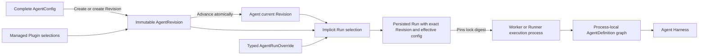

# Agent Management

## Design Position

Foundation exposes `Agent` as the stable Workspace-owned identity for authoring, authorization, lifecycle, and invocation. Each `AgentRevision` is one immutable executable configuration. The Agent head contains metadata, lifecycle state, a canonical `version`, and `current_revision_id`; it contains no mutable draft configuration.

Creating an Agent atomically creates Revision v1. Creating a genuinely different Revision appends immutable content and advances the Agent and current Revision to the same next `version`. Metadata and lifecycle mutations use strong ETags and do not change that version. Foundation exposes no `AgentPreset` compatibility resource or independently mutable default-Revision pointer.

A Run selects one exact `AgentRevision` at durable acceptance. A Worker reconstructs process-local Harness `AgentDefinition`, `SubagentDefinition`, `ExecutableAgent`, and Plugin objects from the Revision's frozen effective configuration. Those Python values are never management resources or durable payloads.

[Managed Harness Plugins and Runtime](36-managed-harness-plugins-and-runtime.md) owns Plugin and PluginVersion identity, selection, lifecycle, commands, artifacts, and Runtime behavior. Agent Management embeds only typed Plugin selections and exact resolved locks into Agent configuration and Revisions.



## Boundaries

| Concern                                                                           | Owner                                                                                                                                                                                                                                                               | Relationship                                                                |
| --------------------------------------------------------------------------------- | ------------------------------------------------------------------------------------------------------------------------------------------------------------------------------------------------------------------------------------------------------------------- | --------------------------------------------------------------------------- |
| Agent identity, Revisions, current selection, lifecycle, Duplicate, and overrides | This document                                                                                                                                                                                                                                                       | Defines the durable Agent management model                                  |
| Plugin identity, Versions, selection, lifecycle, commands, artifacts, and Runtime | [Managed Harness Plugins and Runtime](36-managed-harness-plugins-and-runtime.md)                                                                                                                                                                                    | Supplies typed selections and exact resolved locks to Agents                |
| Plugin factories, configured instances, middleware, and Capability contribution   | [Harness Plugin System](../agent-harness/05-plugin-system.md)                                                                                                                                                                                                       | Builds concrete process-local plugins from an explicitly selected catalog   |
| Agent execution, state, and process-local subagent graph                          | Agent Harness                                                                                                                                                                                                                                                       | Receives reconstructed definitions and fresh run bindings                   |
| Run identity, acceptance, persistence, lineage, and recovery                      | [Agent Interaction and Execution Model](10-agent-interaction-and-execution-model.md), [Agent Control](18-agent-control-input-and-continuation.md), [Durable Run State](12-run-persistence.md), and [RunAttempt Recovery](13-run-attempt-scheduling-and-recovery.md) | Persist and reuse the exact selected Revision and effective config          |
| Agent input wire, canonicalization, and adapter mapping                           | [Agent Input](17-agent-input.md)                                                                                                                                                                                                                                    | AgentConfig stores adapter configuration and each Revision freezes it       |
| Managed capability and ConnectorConnection schemas                                | Their owning Skill and [Connectivity](40-connectivity/README.md) contracts                                                                                                                                                                                          | Agent configuration and Run overlays reference them without redefining them |
| Product authorization and executable-code administration                          | [Foundation IAM](33-identity-and-access-management.md)                                                                                                                                                                                                              | Separates Agent authoring from deployment code authority                    |
| Secret values and run-time eligibility                                            | [Secret Management](27-secret-management.md)                                                                                                                                                                                                                        | Revisions store requirements and references, never plaintext values         |
| Public HTTP paths and common mutation behavior                                    | [Management API](16-management-api.md) and [Platform API Conventions](../api-conventions.md)                                                                                                                                                                        | Expose the resources and commands defined here                              |

## Agent Resource Model

The following schemas are conceptual. They define durable field meaning rather than concrete ORM classes.

```python
class Agent:
    id: AgentId
    organization_id: OrganizationId
    workspace_id: WorkspaceId
    source: Literal["builtin", "custom"]
    name: str
    description: str | None
    version: int
    current_revision_id: AgentRevisionId
    enabled: bool
    archived_at: datetime | None
    duplicated_from_agent_id: AgentId | None
    duplicated_from_revision_id: AgentRevisionId | None
    created_by: PrincipalRef
    updated_by: PrincipalRef
    created_at: datetime
    updated_at: datetime
```

`Agent.version` starts at `1` and always equals the current `AgentRevision.version`. It advances only when a genuinely new immutable Revision becomes current. `current_revision_id` is always present; Foundation never exposes an Agent without an executable Revision.

`name` and `description` are mutable head metadata. `enabled` and `archived_at` are independent lifecycle axes. Their mutations change `updated_at` and the representation ETag without advancing `version` or rewriting a Revision.

## AgentConfig

`AgentConfig` is finite Foundation-owned serializable data. A caller supplies one complete config when creating an Agent or Agent Revision; Foundation stores no independently editable draft. Referenced resource schemas remain owned by their management documents.

```python
class AgentModel:
    model_key: str
    model_api: str
    settings: ModelSettings
    characteristics: HarnessModelCharacteristics


class ResolvedAgentModel:
    model_id: ModelId
    model_key: str
    model_api: str
    settings: ModelSettings
    characteristics: HarnessModelCharacteristics


class EffectiveAgentModel:
    execution: ModelExecutionSnapshot
    settings: ModelSettings
    characteristics: HarnessModelCharacteristics


class SkillSelection:
    skill_revision_id: SkillRevisionId


class ConnectorConnectionToolSelection:
    connector_connection_id: ConnectorConnectionId
    tools: tuple[str, ...] | None
    exposure: MCPExposureMode = "direct"


class MCPConnectionToolSelection:
    mcp_connection_id: MCPConnectionId
    tools: tuple[str, ...] | None
    exposure: MCPExposureMode = "direct"


class EnvironmentSelection:
    environment_revision_id: EnvironmentRevisionId


class ChildEnvironmentPolicy:
    mode: Literal["none", "shared_root", "dedicated"]


class SubagentSelection:
    agent_id: AgentId
    version: int | None
    description: str | None
    context: DelegationContextPolicy
    usage_limits: UsageLimits | None
    environment: ChildEnvironmentPolicy


class OutputVariant:
    name: str
    description: str | None
    schema: JsonSchema
    resources: dict[str, JsonSchema]


class OutputSpec:
    name: str | None
    description: str | None
    schema: JsonSchema | None
    resources: dict[str, JsonSchema]
    variants: tuple[OutputVariant, ...] | None


class RetryConfig:
    tools: int
    output: int


class InputAdapterConfig:
    adapter_key: str
    config: JsonObject


class AssetPublicationConfig:
    enabled: Literal[True]


class ProtocolConfig:
    schema_version: Literal["1"]
    public_name: str
    public_description: str | None
    output_modes: tuple[str, ...]
    input_data_schema: JsonObject | None
    state_schema: JsonObject | None
    context_schema: JsonObject | None
    client_tools: tuple[ClientToolPolicy, ...]
    event_visibility: tuple[str, ...]
    a2a_skills: tuple[A2ASkillProjection, ...]
    extended_agent_card: ExtendedAgentCardPolicy | None
    limits: ProtocolLimits


class AgentConfig:
    model: AgentModel
    instructions: str
    input_adapter: InputAdapterConfig
    plugins: tuple[PluginSelection, ...]
    skills: tuple[SkillSelection, ...]
    connector_tools: dict[str, ConnectorConnectionToolSelection]
    mcp_tools: dict[str, MCPConnectionToolSelection]
    environment: EnvironmentSelection | None
    subagents: dict[str, SubagentSelection]
    client_tools: tuple[ClientToolDefinition, ...]
    output_spec: OutputSpec | None
    retries: RetryConfig | None
    secret_requirements: tuple[SecretRequirement, ...]
    asset_publication: AssetPublicationConfig | None
    protocol: ProtocolConfig
```

The [`PluginSelection` contract](36-managed-harness-plugins-and-runtime.md#agent-selection-and-revision-locking) determines which variant is legal under the deployment's fixed Runtime profile. `instructions` is the Agent's stable system prompt; Foundation- and Harness-generated runtime context is not stored in this field. Skills select exact Skill Revisions, the model selects one stable Model key and one explicit calling API, and the primary Environment selects at most one exact EnvironmentRevision. Agent Revision creation resolves and retains the Model's internal identity but does not freeze its mutable Model configuration; every Run resolves the latest Model under [Model Management](30-model-management.md#agent-selection-and-run-snapshot). Connector-tool, MCP-tool, and subagent map keys are stable local names within the Agent.

`OutputSpec` permits either one top-level schema with optional local resources or at least two mutually exclusive variants; it never permits nested variants. `RetryConfig` contains bounded non-negative tool-argument and structured-output correction budgets, not provider transport, Worker recovery, whole-Run, or business-workflow retries.

The config contains no Python class, import target, callable, native Model, Toolset, Capability instance, Plugin object, client, credential value, plaintext Secret, Environment adapter, current Environment state, entered facade, arbitrary artifact URL, or other process-local value. Revision creation is the sole authoritative resolve-and-build validation path.

`input_adapter` selects one trusted adapter key and bounded configuration. Every Revision accepts the common [`AgentInput`](17-agent-input.md) wire contract. Run acceptance validates and canonicalizes that input, and the Worker verifies the pinned Runtime lock before invoking the adapter. Replacement execution attempts reuse the same Revision, adapter configuration, accepted input, and Runtime lock.

When `asset_publication` is present, the trusted Foundation `AssetCapability` exposes `publish_asset`. Each execution attempt binds only its current authorized Environment; the tool fails closed when no readable default binding can supply the selected path. Package presence or general Environment file access does not enable it.

## Run Capability Overlay

Agent authoring defines the default model-visible managed capability surface. A direct invocation or trusted input owner such as an Ingress Route can supply one bounded overlay without mutating the AgentRevision:

```python
class RunCapabilityOverlay:
    inherit_agent: bool = True
    include: tuple[ManagedCapabilitySelection, ...] = ()
    exclude: tuple[CapabilityKey, ...] = ()
```

`ManagedCapabilitySelection` is a tagged union owned by the corresponding managed Skill, MCPConnection, ConnectorConnection tool, or native Ingress action contract. A ConnectorConnection or MCPConnection selection includes its `direct` or `catalog` exposure and exact tool allowlist; an Ingress native action is always direct. Every selection has one stable `CapabilityKey`, exact configuration or managed-resource references, and all required compatibility evidence. The overlay contains no Python object, import target, arbitrary local function tool, Plugin, credential, endpoint, or unversioned remote schema.

```text
candidate = (Agent defaults when inherit_agent else empty) + include - exclude
effective = candidate intersect current authorization and deployment policy
```

`include` can select an authorized managed capability absent from the Agent defaults. `exclude` removes one exact selectable key and cannot remove mandatory Harness safety, Identity, policy, usage, output, or Environment behavior. `inherit_agent=false` replaces only the selectable managed capability surface; it does not replace the Agent, model, instructions, output contract, Plugins, subagents, Runtime lock, or security ceiling. Duplicate keys, conflicting selections, unknown exclusions, unavailable compatibility evidence, and unauthorized additions fail Run acceptance.

The accepted Run retains the complete effective selection and exact [`MCPToolSnapshot`](40-connectivity/04-agent-facing-tools.md#mcp-toolsnapshot), digests, or revision locks produced from it. Replacement RunAttempts reconstruct that same surface with fresh authority and fail closed instead of silently changing capabilities. Model input and tool output cannot create or modify an overlay.

## Protocol Configuration

Every `AgentConfig` embeds one finite `protocol` configuration. It is Agent-owned Revision content rather than an independently addressable resource and has no separate lifecycle, API, enable switch, or content digest.

Revision creation validates JSON Schemas, public metadata, MIME modes, event names, client-tool policies, A2A projections, and per-protocol limits against finite registries and deployment hard ceilings. Configuration can narrow a permitted surface but cannot expose raw reasoning, credentials, private execution identities, unregistered events, arbitrary code, or unavailable capabilities.

`input_data_schema`, when present, is the self-contained JSON Schema Draft 2020-12 contract projected for non-null `AgentInput.structured_content`. Safe defaults impose no structured-content schema, expose bounded text output and standard public event families, accept no protocol client tools, generate a minimal public-safe A2A Agent Card, and expose no extended Card. Native and Hosted AG-UI remain available for every callable Agent; `gateway.a2a_enabled` is the deployment-wide A2A availability switch.

Revision creation freezes normalized ProtocolConfig in the immutable Revision, whose `content_digest` covers it. Hosted AG-UI Run and A2A Task acceptance persist the exact `agent_revision_id`; retry, feedback, recovery, and replay therefore use the same protocol configuration. Advancing the Agent to another Revision changes Cards and implicit acceptance policy only for later work.

## AgentRunOverride and Effective Configuration

One Run request may carry a finite typed `config_override`. It is request data, not a management resource, and has no identity or lifecycle:

```python
class InlineEnvironmentSelection:
    provider: EnvironmentProviderSpec
    credential_bindings: tuple[EnvironmentCredentialBinding, ...]
    access: EnvironmentAccess = "full"


type EnvironmentOverride = EnvironmentSelection | InlineEnvironmentSelection


class ModelOverride:
    model_key: str | None
    model_api: str | None
    settings: ModelSettings | None
    characteristics: HarnessModelCharacteristics | None


class ConnectorConnectionToolOverride:
    connector_connection_id: ConnectorConnectionId | None
    tools: tuple[str, ...] | None
    exposure: MCPExposureMode | None


class MCPConnectionToolOverride:
    mcp_connection_id: MCPConnectionId | None
    tools: tuple[str, ...] | None
    exposure: MCPExposureMode | None


class SubagentOverride:
    agent_id: AgentId | None
    version: int | None
    description: str | None
    context: DelegationContextPolicy | None
    usage_limits: UsageLimits | None
    environment: ChildEnvironmentPolicy | None


class RetryOverride:
    tools: int | None
    output: int | None


class AgentRunOverride:
    model: ModelOverride | None
    instructions: str | None
    plugins: tuple[PluginSelection, ...] | None
    skills: tuple[SkillSelection, ...] | None
    connector_tools: dict[str, ConnectorConnectionToolOverride | None] | None
    mcp_tools: dict[str, MCPConnectionToolOverride | None] | None
    environment: EnvironmentOverride | None
    subagents: dict[str, SubagentOverride | None] | None
    client_tools: tuple[ClientToolDefinition, ...] | None
    output_spec: OutputSpec | None
    retries: RetryOverride | None
```

The wire schema preserves absent fields separately from explicit nulls. Top-level absence inherits the selected Revision. Scalar and string fields replace; list fields replace as a whole and an empty list clears them. `output_spec` and `environment` can be explicitly cleared. `retries` patches only explicitly present children.

`connector_tools`, `mcp_tools`, and `subagents` are name-keyed patches. An absent map inherits, explicit null clears all entries, and an empty object changes nothing. A mapped null deletes one entry. Tool changes can replace only a managed ConnectorConnection, exposure, or exact allowlist; they cannot supply endpoints, credentials, Connector services, or arbitrary headers. Subagent entries select managed Agents only.

Plugin override replacement and resolution follow the [managed Plugin selection contract](36-managed-harness-plugins-and-runtime.md#agent-selection-and-revision-locking). Every selected resource remains subject to current authorization, schema validation, deployment compatibility, and platform security ceilings. Typed sensitive leaves are extracted into a Run-owned encrypted payload and excluded from ordinary config projections.

The resolved non-secret result has this conceptual shape:

```python
class EffectiveAgentConfig:
    schema_version: str
    model: EffectiveAgentModel
    instructions: str
    input_adapter: InputAdapterConfig
    plugins: tuple[ResolvedPluginVersion, ...]
    runtime_lock_digest: str
    skills: tuple[ResolvedSkillSelection, ...]
    connector_tools: tuple[ConnectorConnectionToolSelection, ...]
    mcp_tools: tuple[MCPConnectionToolSelection, ...]
    environment: EnvironmentExecutionConfig | None
    subagents: tuple[ResolvedSubagentEdge, ...]
    client_tools: tuple[ClientToolDefinition, ...]
    output_spec: OutputSpec | None
    retries: RetryConfig | None
    secret_requirements: tuple[SecretRequirement, ...]
    asset_publication: AssetPublicationConfig | None
    protocol: ProtocolConfig
    content_digest: str
```

Acceptance merges and resolves the selected Revision and request exactly once, then persists a complete immutable `EffectiveAgentConfig` plus its digest. Retry, resume, deferred-action completion, and Worker replacement reconstruct from that snapshot and never re-read the Agent head or reapply merge rules. Input, attachments, timeout, usage budget, metadata, priority, idempotency, and scheduling mode remain Run fields rather than Agent config overrides.

## Immutable AgentRevision

```python
class ResolvedSubagentEdge:
    name: str
    child_agent_id: AgentId
    child_agent_revision_id: AgentRevisionId
    description: str | None
    context: DelegationContextPolicy
    usage_limits: UsageLimits | None
    environment: ChildEnvironmentPolicy


class AgentRevision:
    id: AgentRevisionId
    organization_id: OrganizationId
    workspace_id: WorkspaceId
    agent_id: AgentId
    version: int
    plugin_runtime_mode: Literal["on_demand", "runner"]
    config: AgentConfig
    config_digest: str
    resolved_model: ResolvedAgentModel
    resolved_plugin_versions: tuple[ResolvedPluginVersion, ...]
    runtime_lock_digest: str
    resolved_skills: tuple[ResolvedSkillSelection, ...]
    connector_tools: tuple[ConnectorConnectionToolSelection, ...]
    mcp_tools: tuple[MCPConnectionToolSelection, ...]
    resolved_environment: EnvironmentExecutionConfig | None
    resolved_subagents: tuple[ResolvedSubagentEdge, ...]
    content_digest: str
    source_revision_id: AgentRevisionId | None
    created_by: PrincipalRef
    created_at: datetime
```

Revision rows are append-only. `config_digest` identifies the canonical complete authoring config; `content_digest` also covers every resolved snapshot, exact managed-resource reference, Runtime lock, and subagent Revision. A Revision has no mutable lifecycle state and cannot be patched, archived independently, deleted, overwritten, or repointed after creation.

`plugin_runtime_mode`, `resolved_plugin_versions`, and `runtime_lock_digest` embed the exact result of the [managed Plugin contract](36-managed-harness-plugins-and-runtime.md#agent-selection-and-revision-locking). The resolved Model field retains only stable Model identity, explicit calling API, settings, and characteristics; Run acceptance resolves its latest Model execution snapshot. The other resolved fields freeze Skill content, ConnectorConnection and MCPConnection selections, optional primary Environment lock, and complete child Revision graph. Secret values, current authorization, current Model and Provider configuration/lifecycle, live Connector availability, and remote MCP catalogs remain fresh facts rather than immutable Agent Revision content.

## Creation, Revision, and Restore

Create Agent accepts `name`, optional `description`, and one complete `config`. Foundation authorizes and resolves every referenced dependency, then atomically creates the Agent and Revision v1. It never exposes an Agent without a current Revision.

Create Revision accepts `expected_version` and one complete replacement `config`:

1. authorize the operation and every referenced resource;
2. verify the expected Agent version;
3. resolve exact Model, Plugin, Skill, Environment, ConnectorConnection, and subagent dependencies;
4. verify schemas, the finite acyclic subagent graph, Plugin evidence, and reconstruction compatibility;
5. canonicalize the frozen content and compute its digests;
6. return the current Agent and Revision unchanged for a semantic no-op; or
7. create immutable version `current + 1` and advance the Agent head in the same transaction.

Resolution and process-local build preflight occur outside an open database transaction. The final short transaction rechecks the Agent, selected references, profile-specific Plugin evidence, authorization, and concurrency evidence before committing. Failure creates no Revision and does not advance the head.

Restore Revision revalidates retained dependencies and copies the selected historical content into a new later Revision. It never moves the head backward or repoints it to an older row. `source_revision_id` records the restored source.

Duplicate revalidates the exact current Revision and atomically creates an independent custom Agent with its own v1 Revision. The new head records source Agent and Revision IDs. It never follows or merges later source changes.

Built-in Agents use the same Revision validation and exact dependency freezing. Distribution registration creates v1 or advances to another Revision only when resolved content changes. Built-ins are invocable and readable but cannot be renamed, duplicated in place, archived, or otherwise mutated by ordinary users; Duplicate creates a custom Agent.

## Metadata and Lifecycle

`name` and `description` are mutable metadata. `enabled` and `archived_at` are independent lifecycle axes:

- Disable sets `enabled=false` and blocks new invocation without cancelling accepted Runs.
- Enable revalidates the current Revision and sets `enabled=true`.
- Archive requires the Agent to be disabled and sets `archived_at`.
- Unarchive clears `archived_at` without enabling the Agent.

GET returns a strong ETag. Metadata and lifecycle mutations require exact strong `If-Match`; weak validators and `*` are rejected. These mutations never advance `version` or rewrite Revisions. Historical Revisions remain readable and can be invoked while the stable Agent is enabled and unarchived and their exact artifacts remain executable.

## Subagent Composition

A parent config declares each named child edge with a stable `agent_id`, optional child-local `version`, Harness context and usage policy, and one explicit Host Environment policy. Parent Revision creation resolves an omitted version to the child's current Revision and stores one exact `child_agent_revision_id`. It rejects missing, disabled, archived, unauthorized, unretained, unexecutable, cyclic, excessively large, or Environment-incompatible graphs.

Advancing a child Agent later does not change an existing parent Revision. The parent adopts new child behavior only through another parent Revision. Workers recursively reconstruct the exact finite graph into Harness `SubagentDefinition` values. A Run Override may patch the managed child roster by stable local name; acceptance resolves and freezes the complete resulting graph before work starts.

An asynchronous hosted child receives its own Thread, Run, RunAttempts, fresh `RunBindings`, Environment adapters selected through its frozen Host association policy, exact child Revision, and compatible Runtime lock under [Async Subagents](34-async-subagents.md). An inline child remains process-local Harness execution and borrows the active Environment facade.

## Run Selection and Reconstruction

A new root Run supplies an `agent_id` and may supply an exact `agent_revision_id`. Omission selects `current_revision_id`; exact selection never falls back. An optional `expected_current_revision_id` is an independent optimistic precondition rather than the selector itself.

Durable acceptance:

1. authorizes invocation of the stable Agent and every selected managed resource;
2. requires the Agent to be enabled and unarchived;
3. validates that the exact Revision belongs to the Agent, remains retained and executable, and satisfies current authorization and compatibility requirements;
4. applies the typed config override and capability overlay and resolves every final selection;
5. freezes the complete non-secret `EffectiveAgentConfig`, encrypted sensitive payload, and exact Runtime lock; and
6. persists `agent_id`, exact `agent_revision_id`, selector kind, effective-config digest, and `runtime_lock_digest` on the accepted execution state.

Historical AgentRevisions remain invocable under the stable Agent's current lifecycle gate. Ingress and Schedule definitions store the stable Agent identity and resolve the current Revision for each occurrence. Retry, waiting feedback, recovery, and accepted child work use the exact Revision and effective configuration pinned by their Run.

For each outbound model request, the Worker or Runner rechecks the current Model and Model Provider lifecycle and resolves the Provider's current configuration and credential as defined by Model Management. For each execution attempt it also verifies the exact Runtime lock, reauthorizes current resource eligibility, constructs fresh Plugins, `RunBindings`, and Environment adapters, and enters the Harness only after the current attempt fence authorizes effects. Deployment code may change between attempts, but one accepted Run never silently changes its snapshotted upstream model, calling API, model profile/limits, Plugin code, dependencies, other managed-resource Revisions, child graph, tool surface, output contract, Environment configuration, or retry budgets.

## Managed Harness Plugin Reference

`AgentConfig.plugins`, `AgentRunOverride.plugins`, `AgentRevision.plugin_runtime_mode`, `resolved_plugin_versions`, and `runtime_lock_digest` use the canonical [Managed Harness Plugins and Runtime](36-managed-harness-plugins-and-runtime.md) contract. That document exclusively owns Plugin and PluginVersion identity, selection variants, lifecycle, commands, Wheel and dependency artifacts, Runtime locks, loading, activation, and failure semantics. This document owns only where selections and immutable results are embedded in Agent configuration, Revision creation, Run overrides, and reconstruction.

## Persistence

The `agents` table stores stable identity, tenancy, name, description, `version`, `current_revision_id`, lifecycle axes, duplication provenance, actors, and timestamps. `(workspace_id, normalized_name)` is unique.

The `agent_revisions` table stores complete config, frozen resolution, digests, provenance, actor, and creation time. `(agent_id, version)` is unique. The Agent head and current Revision advance atomically. Runs and downstream records store `agent_revision_id`, not only an Agent ID or version.

## Agent Management API Contract

- `POST /api/v1/workspaces/{workspace_id}/agents`
- `GET /api/v1/workspaces/{workspace_id}/agents`
- `GET /api/v1/agents/{agent_id}`
- `PATCH /api/v1/agents/{agent_id}`
- `POST /api/v1/agents/{agent_id}/revisions`
- `GET /api/v1/agents/{agent_id}/revisions`
- `GET /api/v1/agent-revisions/{revision_id}`
- `POST /api/v1/agents/{agent_id}/revisions/{revision_id}/restore`
- `POST /api/v1/agents/{agent_id}/duplicate`
- `POST /api/v1/agents/{agent_id}/{enable|disable|archive|unarchive}`

Create, Create Revision, Restore, Duplicate, and lifecycle commands require `Idempotency-Key`. Versioned Revision creation uses `expected_version`; metadata and lifecycle mutations use strong `If-Match`. Agent and Revision collections use opaque cursor pagination, and Revision List defaults to descending `version` with a stable ID tie-breaker.

Agent actions are authorized against the stable Agent identity. Role bindings use `resource_type="agent"`. List and Get authorize `agent.read`; Create authorizes `agent.create`; metadata changes authorize `agent.update`; Create and Restore Revision authorize `agent.revision.create`; lifecycle changes authorize `agent.lifecycle`; Duplicate authorizes `agent.duplicate`; and Run acceptance authorizes `agent.invoke`. Every successful mutation records exact Agent and Revision references in security audit and outbox evidence without secret values or resolved credentials.

## Failure Semantics

| Code                            | Meaning                                                                 |
| ------------------------------- | ----------------------------------------------------------------------- |
| `agent_not_found`               | Agent is absent or concealed                                            |
| `agent_revision_not_found`      | Revision is absent, concealed, or does not belong to the required Agent |
| `agent_disabled`                | New invocation is blocked                                               |
| `agent_archived`                | The requested operation is unavailable for an archived Agent            |
| `agent_revision_not_executable` | The exact retained Revision cannot currently execute                    |
| `current_revision_conflict`     | `expected_current_revision_id` does not match the current Revision      |
| `agent_version_conflict`        | `expected_version` does not match the Agent version                     |
| `agent_revision_create_failed`  | Resolve-and-build validation failed before Revision creation commits    |
| `etag_mismatch`                 | Strong `If-Match` does not match mutable head metadata                  |

Revision-creation failure can expose only a bounded safe reason and config field path. Schema, authorization, and idempotency failures retain the common Platform API codes.

## Compatibility and Trade-offs

The canonical Foundation v1 resources are `Agent` and `AgentRevision`. Foundation exposes no parallel AgentPreset resources or aliases. Durable Run and state schemas use `agent_id` and `agent_revision_id` directly. `AgentRunOverride` is request data and `EffectiveAgentConfig` is a Run-owned snapshot; neither creates another Agent identity.

Atomically creating and advancing immutable Revisions removes a mutable draft/default-pointer lifecycle and gives `version` one canonical meaning. It requires callers to submit complete replacement configuration and use Restore to copy historical content into a new head. Finite typed overrides preserve application-specific composition without introducing arbitrary patch paths or a second managed Agent resource.

## Invariants

01. `Agent` is the only durable Agent authoring, authorization, lifecycle, and invocation identity; every Agent has one current immutable `AgentRevision`.
02. `Agent.version` always equals its current Revision version and advances only when a genuinely different Revision becomes current.
03. Metadata and lifecycle mutations use strong ETags and never advance the Agent version or rewrite Revisions.
04. Every accepted Run pins one exact AgentRevision and one immutable `EffectiveAgentConfig`; retry, waiting, recovery, and Worker replacement never remerge current Agent state.
05. Revision and effective-config content contain only serializable Foundation data and exact references, never Python objects, callable handlers, credential values, arbitrary import targets, or Plugin artifacts.
06. Current credentials, authorization, Secret eligibility, Provider availability, Host Environment state, `RunBindings`, and Environment adapters are resolved or constructed freshly for every execution attempt without changing frozen non-secret configuration.
07. Historical Revision invocation is exact and never falls back or follows a mutable dependency head.
08. Restore copies retained content into a new later Revision and never moves the Agent head backward.
09. ProtocolConfig is Agent-owned Revision content rather than another resource, digest, or per-Agent protocol switch.
10. Plugin identity and lifecycle remain owned exclusively by the managed Plugin contract; Agent Management stores only typed selections and resolved locks.
