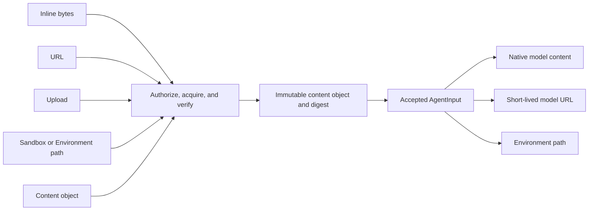

# Agent Input

## Design Position

`AgentInput` is Foundation's versioned wire and accepted-value protocol for one
unit of ordinary semantic Agent input. Root invocation, continuation, fork,
managed Trigger acceptance, asynchronous child submission, and active-run
steering use the same protocol rather than defining operation-specific input
shapes.

This contract owns content blocks, structured content, binary acquisition and
delivery, accepted canonicalization, the AgentRevision input declaration, and
deterministic mapping to the Harness native input boundary. [Agent Control:
Input and Continuation](28b-agent-control-input-and-continuation.md) owns Turn
acceptance, lineage, retry, and deferred feedback; [Agent Control: Active
Execution](28c-agent-control-active-execution.md) owns durable cancellation of
already accepted work. Neither control contract defines another ordinary input
protocol.

## Boundaries

| Concern                                                 | Owner                                                                                                                                                       | Relationship                                                                                            |
| ------------------------------------------------------- | ----------------------------------------------------------------------------------------------------------------------------------------------------------- | ------------------------------------------------------------------------------------------------------- |
| `AgentInput`, content blocks, sources, and delivery     | This contract                                                                                                                                               | Defines the stable submission and accepted-value protocol                                               |
| Agent input declaration and adapter contract            | This contract and [Agent Revisions and Reconstruction](12-agent-revisions-and-reconstruction.md)                                                            | This contract defines the declaration; the immutable AgentRevision stores it and its exact adapter lock |
| Accepted input persistence and binary object references | [Durable Turn State](14-turn-persistence.md)                                                                                                                | Persists the complete accepted value and immutable payload references                                   |
| Environment binding and path materialization            | [Environment Configuration](19-environment-management.md)                                                                                                   | Supplies authorized bindings and fresh runtime attachments                                              |
| Native process-local input and steering                 | [Harness Input, Model, and Output](../agent-harness/16-input-model-and-output.md) and [Harness Public API](../agent-harness/14-public-api-and-packaging.md) | Receives native `RunInputValue` after the Foundation adapter resolves durable input                     |
| Turn acceptance, retry, and waiting feedback            | [Agent Control: Input and Continuation](28b-agent-control-input-and-continuation.md)                                                                        | Determines when input creates a Turn and when correlated feedback is a distinct protocol                |
| Durable cancellation of already accepted work           | [Agent Control: Active Execution](28c-agent-control-active-execution.md)                                                                                    | Owns cancellation ordering, fencing, and durable outcome independently of input content                 |
| Idempotency evidence and unknown acceptance             | [Durable Operations and Outbox](06-durable-operations-and-outbox.md)                                                                                        | Owns request evidence and reconciliation around accepted input                                          |

## Agent Input Protocol

`AgentInput` is Foundation's versioned JSON wire format for one unit of
user-authored or caller-authored semantic Agent input. It is independent of the
command that carries it. Control preconditions, Agent selection, Skill selection,
Environment selection, authorization, and trigger metadata remain outside
`AgentInput`.

The following definitions are the serialized wire schema. JSON arrays represent
the tuple fields. Unknown fields, unknown discriminators, an unsupported
`schema_version`, malformed JSON, non-finite numbers, and duplicate object keys
are invalid.

```python
class AgentInput:
    schema_version: Literal["1"]
    content: tuple[ContentBlock, ...] = ()
    structured_content: JsonValue | None = None


type ContentBlock = TextContent | BinaryContent


class TextContent:
    type: Literal["text"]
    text: str


class BinaryContent:
    type: Literal["binary"]
    source: BinaryContentSource
    filename: str | None = None
    media_type: str | None = None
    delivery: BinaryContentDelivery = "auto"


type BinaryContentSource = (
    InlineBinarySource
    | UrlBinarySource
    | UploadBinarySource
    | PathBinarySource
    | ContentObjectBinarySource
)


class InlineBinarySource:
    type: Literal["inline"]
    data: Base64Bytes


class UrlBinarySource:
    type: Literal["url"]
    url: str


class UploadBinarySource:
    type: Literal["upload"]
    upload_id: UploadId


class PathBinarySource:
    type: Literal["path"]
    environment_binding: str
    path: str


class ContentObjectRef:
    object_key: str
    digest_sha256: str
    size_bytes: int


class ContentObjectBinarySource:
    type: Literal["content_object"]
    content_ref: ContentObjectRef


type BinaryContentDelivery = Literal[
    "auto",
    "model_content",
    "model_url",
    "environment_path",
]
```

The source union covers submission and accepted-value phases. Public callers can
submit only `inline`, `url`, `upload`, or `path`; `content_object` is the
Foundation-managed normalized form and is rejected as caller-supplied storage
authority. This phase restriction is part of the wire contract even though both
forms share the same `BinaryContent` block shape.

For example, one request can combine direct text, a URL-backed binary, and
Agent-specific structured data without turning source or control metadata into
message roles:

```json
{
  "schema_version": "1",
  "content": [
    {
      "type": "text",
      "text": "Summarize the report in Chinese."
    },
    {
      "type": "binary",
      "source": {
        "type": "url",
        "url": "https://example.com/report.pdf"
      },
      "filename": "report.pdf",
      "media_type": "application/pdf",
      "delivery": "model_content"
    }
  ],
  "structured_content": {
    "language": "zh-CN",
    "style": "executive"
  }
}
```

`content` is an ordered sequence representing one user-authored message boundary;
it never accepts system, assistant, or tool roles. A `TextContent.text` value is
non-empty and retains its exact Unicode value and position. `structured_content`
is the independent Agent-specific machine-readable channel. It is not a JSON
content block, cannot carry control or authority fields, and enters model context
only through the selected AgentRevision's locked input adapter.

An input can contain only text, only structured content, only binary content, or
any combination permitted by the selected AgentRevision. An empty `content`
together with null `structured_content` is valid only when that revision declares
`allow_empty=true`. Active-run steering always requires a non-empty effective
input because the Harness native steering boundary rejects an empty value.

`filename` is bounded display metadata and is never interpreted as an object key
or Environment path. A submitted `media_type` is only a hint. Foundation derives
and freezes the accepted canonical media type from verified content bytes; a
filename extension or caller claim is never authoritative. Images, audio, video,
PDFs, archives, source files, and other byte sequences all remain
`BinaryContent`; their media type and delivery policy determine later handling.

## Binary Source and Delivery

`source` and `delivery` are independent axes:

| Axis       | Question answered                                | Values                                                                          |
| ---------- | ------------------------------------------------ | ------------------------------------------------------------------------------- |
| `source`   | Where does Foundation acquire the exact bytes?   | inline data, URL import, upload, Sandbox or Environment path, or managed object |
| `delivery` | How does the Worker expose accepted bytes later? | native model content, model URL, or an Environment path                         |

Source forms have these contracts:

| Source           | Submission contract                                                                                                                                                                                |
| ---------------- | -------------------------------------------------------------------------------------------------------------------------------------------------------------------------------------------------- |
| `inline`         | `data` is bounded canonical RFC 4648 base64 without line breaks. Foundation bounds the encoded body before decoding and the decoded bytes afterward.                                               |
| `url`            | `url` is a credential-free absolute HTTP(S) URL. Foundation imports it through bounded egress policy, validates every redirect and resolved destination, and accepts no caller headers.            |
| `upload`         | `upload_id` names an authorized, complete, immutable upload in the same tenant scope. The reference grants no authority and is revalidated at acceptance.                                          |
| `path`           | `environment_binding` selects an authorized configured Sandbox or Environment binding and `path` is a normalized relative POSIX path. Foundation snapshots exact bytes before accepting the input. |
| `content_object` | Accepted durable form only. `content_ref` identifies the exact immutable bytes and is the only source retained in an accepted `AgentInput`; it is not caller-supplied object-store authority.      |

URL acquisition rejects credential-bearing URLs, disallowed schemes, unsafe
destinations, unsafe redirects, excessive response bodies, and content that
changes while its verified representation is being imported. Content requiring
remote authentication is imported through its owning Connector or another
authorized content-ingress operation rather than by adding credentials to
`AgentInput`.

A submitted `path` is relative to the named Foundation binding, never a Worker
host path or an unscoped Sandbox path. Resolution rejects absolute paths,
traversal, symlink escape, directories, unsupported file kinds, inaccessible
bindings, and files that cannot be snapshotted consistently. An operation cannot
accept a path source merely because a process-local worker can see it;
acceptance requires an immutable byte snapshot that another TurnAttempt can
materialize after worker loss.

Delivery forms have these contracts:

| Delivery           | Worker behavior                                                                                                                                                                                  |
| ------------------ | ------------------------------------------------------------------------------------------------------------------------------------------------------------------------------------------------ |
| `model_content`    | Reads the immutable object and supplies native media content to the Harness. Provider encoding, upload, or transport remains with the selected native Model adapter.                             |
| `model_url`        | Mints a short-lived, audience-restricted URL for the immutable object and supplies the matching native image, audio, video, or document URL type. The generated URL is never durable Turn input. |
| `environment_path` | Materializes the immutable object under the selected Environment binding and supplies the adapter-defined stable logical path reference; the model uses the Environment's authorized file tools. |

`auto` is a submission preference, not an accepted delivery value. Acceptance
resolves it to one concrete delivery using the exact AgentRevision declaration,
frozen Model execution snapshot, selected Environment configuration, media type,
size, and current policy. A caller-requested concrete delivery is accepted only
when those same constraints permit it. A replacement TurnAttempt uses the frozen
delivery mode and does not silently choose another mode. A fresh signed URL or
physical Environment path is process-local materialization of that mode, not a
change to accepted input.



## Accepted Input and Canonicalization

Before durable Turn acceptance, Foundation resolves every submitted binary source
to a `ContentObjectBinarySource`, replaces every media-type hint with the verified
canonical media type, resolves `delivery="auto"`, and verifies that every exact
object remains authorized and retained. The resulting accepted `AgentInput` has
the same `schema_version`, `ContentBlock` ordering, text, structured content, and
`type` discriminators as the submission, but every `BinaryContent` has:

- `source.type="content_object"` with exact digest and size;
- a non-null verified `media_type`; and
- one concrete delivery other than `auto`.

`ContentObjectRef.object_key` is an internal durable locator, not a public
download URL, credential, or authorization token. API reads disclose binary
metadata and authorized content access through their owning read surface rather
than treating the stored object key as caller authority.

The accepted value is immutable. A Worker never re-fetches a submitted URL,
re-reads a submitted path, re-resolves an upload, or decodes submitted inline
bytes. Retry and replacement TurnAttempts reuse the exact accepted content
objects. Missing or digest-mismatched content fails closed rather than falling
back to the original source.

Foundation canonicalizes the complete accepted value as UTF-8 RFC 8785 JSON. A
bounded value can remain inline on the Turn; a larger value uses the immutable
[Turn payload object](14-turn-persistence.md#turn-payload-object). Binary bodies
always remain separate content objects referenced by that JSON. The canonical
submitted command supplies the idempotency request fingerprint; the canonical
accepted value and referenced byte digests supply durable input integrity. Source
acquisition or object creation before the final short acceptance transaction does
not prove that a Turn was accepted, and unreferenced prepared objects are eligible
for bounded cleanup.

## Agent Input Declaration and Harness Mapping

Every immutable AgentRevision stores one declaration governed by this contract:

```python
class AgentInputDeclaration:
    schema_version: Literal["1"]
    agent_input_schema_version: Literal["1"]
    allow_empty: bool
    allow_text: bool
    allowed_media_types: tuple[str, ...]
    allowed_deliveries: tuple[Literal[
        "model_content",
        "model_url",
        "environment_path",
    ], ...]
    max_content_blocks: int
    max_total_text_bytes: int
    max_binary_items: int
    max_total_binary_bytes: int
    max_structured_content_bytes: int
    structured_content_schema: JsonObject | None
    structured_content_schema_digest_sha256: str | None
    input_adapter_key: str
    input_adapter_config: JsonObject
```

Media entries are normalized exact media types or type wildcards such as
`image/*`. `max_content_blocks` is positive; binary item and byte bounds are
non-negative so a declaration can reject all binary content. No declaration can
exceed Foundation hard limits. When `structured_content_schema` is absent,
`structured_content` must be null and its digest is null. Otherwise Foundation
validates it using self-contained JSON Schema Draft 2020-12 with no remote
references, stores the canonical schema digest, and requires it to match.
`allow_text=false` rejects every `TextContent`; empty media and delivery tuples
reject every `BinaryContent`. Materializing a revision validates the complete
declaration. Turn acceptance enforces its exact text, binary, structured-content,
and aggregate bounds and revalidates the actual structured value against that
exact schema.

The immutable AgentRevision stores the exact trusted adapter key and dependency
locks owned by [Agent Revisions and Reconstruction](12-agent-revisions-and-reconstruction.md).
The Worker verifies those locks and maps the complete accepted `AgentInput` to
the Harness `RunInputValue`. It preserves content-block order and applies these
delivery semantics:

- `TextContent` becomes native user text content;
- `model_content` becomes native Pydantic `BinaryContent` with verified media type;
- `model_url` becomes the matching native image, audio, video, or document URL value;
- `environment_path` becomes the adapter-defined user-visible logical path after exact materialization; and
- `structured_content` is incorporated only by the locked adapter, never by an implicit generic JSON dump.

The adapter returns `None` only for an accepted empty input. It carries no
credential or ambient authority and cannot widen the accepted AgentRevision,
Model, Environment, Skill, Connector, or content policy. A replacement Worker
uses the same accepted input, exact AgentRevision, and adapter locks; incompatible
or unavailable adapters fail before model or tool work rather than changing the
input representation.

## Use by Control Operation

| Operation                         | Ordinary `AgentInput` behavior                                                                                                              |
| --------------------------------- | ------------------------------------------------------------------------------------------------------------------------------------------- |
| Root invocation                   | Caller supplies input; acceptance stores its normalized accepted form on the root Turn.                                                     |
| Ordinary continuation             | Caller supplies input; acceptance stores it on the successor Turn.                                                                          |
| Fork                              | Caller supplies input; the new Thread's first Turn stores it after validation against the selected compatible AgentRevision.                |
| Managed Trigger                   | The Trigger constructs the same protocol, placing its schema-validated machine-readable value in `structured_content`.                      |
| Asynchronous child                | The authorized parent or Host supplies the same protocol for the child Turn.                                                                |
| Retry                             | Caller supplies no new input; the successor reuses the source Turn's exact accepted input and content references.                           |
| Active-run steering               | The steering command carries the same protocol and adapter mapping but does not replace the Turn's initial accepted input or create a Turn. |
| Waiting-action response or result | Uses the [correlated typed feedback protocol](28b-agent-control-input-and-continuation.md#deferred-interaction), not `AgentInput`.          |

This protocol defines the payload accepted by active-run steering, not the
steering command's durable ordering, fencing, delivery receipt, terminal race,
or retry semantics. Those active-control facts are independent of content
acquisition and Harness input mapping.

## Failure Semantics

| Condition                                                         | Outcome                                                                                |
| ----------------------------------------------------------------- | -------------------------------------------------------------------------------------- |
| Invalid input schema, content block, bound, or declaration        | Request is rejected before Turn or steering acceptance                                 |
| Binary source is absent, unauthorized, unsafe, or changes         | Request is rejected without retaining an accepted source or exposing private existence |
| Binary acquisition succeeds but command acceptance fails          | No command is accepted; unreferenced prepared content is eligible for bounded cleanup  |
| Requested or resolved delivery is incompatible                    | Request is rejected rather than relying on Worker fallback                             |
| Accepted content is later absent or digest-mismatched             | Execution fails before model or tool work; Worker never re-fetches submitted source    |
| Locked input adapter is missing, incompatible, or rejects mapping | Execution fails before model or tool work; Worker does not substitute another adapter  |

## Compatibility

`AgentInput.schema_version` versions the complete wire and accepted-value
contract; public type names do not contain version suffixes. AgentRevision input
declarations pin one supported version, accepted values retain that version, and
Workers never upgrade retained input during reconstruction. A new content block,
source discriminator, delivery value, required field, canonicalization rule, or
changed field meaning requires another schema version. Unknown versions and
unknown discriminators fail closed. SDKs may expose convenience upload or import
methods, but they serialize the same wire values and do not create another input
protocol.

## Invariants

1. `AgentInput` is the single ordinary semantic-input protocol for root invocation, continuation, fork, managed Trigger input, asynchronous child input, and active-run steering.
2. Input-source acquisition and model delivery are independent; every accepted binary source is immutable and every accepted delivery is concrete.
3. Accepted binary content retains verified bytes, digest, media type, order, and delivery without retaining inline data, submitted URLs, uploads, or mutable paths as runtime dependencies.
4. `structured_content` is Agent-specific data validated by the exact AgentRevision and never carries authority or becomes implicit model JSON.
5. Retry accepts no new `AgentInput` and reuses the exact accepted value.
6. Waiting-action feedback and client-tool results are correlated typed values, not ordinary `AgentInput`.
