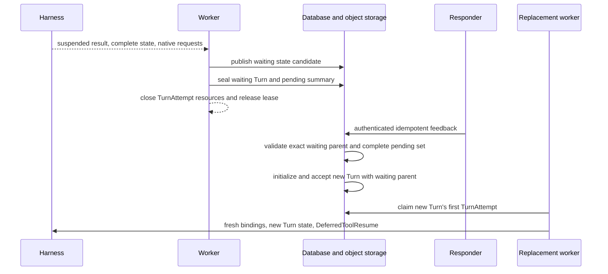

# Agent Control: Input and Continuation

## Design Position

Foundation accepts every new semantic unit of Agent work as a durable Turn
belonging to exactly one Session and Thread. Root invocation, ordinary
continuation, authenticated waiting feedback, fork, and retry of terminal
intent are distinct acceptance forms over that same boundary. None reopens or
mutates a sealed Turn.

This contract owns those acceptance forms, their public command surfaces, and
deferred-interaction feedback. [Agent Input](28a-agent-input.md) owns the
ordinary semantic input carried by those commands. [Durable Thread
Persistence](24-thread-persistence.md) owns Thread identity, version,
current-Turn selection, and continuation-head selection; [Durable Turn
State](14-turn-persistence.md) owns the resulting Turn row, state object, parent
edge, and sealing; [Durable Turn Attempt
Persistence](15-turn-attempt-persistence.md) owns later worker generations.
Worker takeover and automatic checkpoint recovery do not accept another
semantic unit of work and remain outside this contract.

## Boundaries

| Concern                                                     | Owner                                                                                                                                             | Relationship                                                                     |
| ----------------------------------------------------------- | ------------------------------------------------------------------------------------------------------------------------------------------------- | -------------------------------------------------------------------------------- |
| Session, Thread, Turn, and Item meaning                     | [Platform Interaction Model](../interaction-model.md)                                                                                             | Supplies the shared interaction identities                                       |
| Ordinary semantic Agent input                               | [Agent Input](28a-agent-input.md)                                                                                                                 | Supplies the versioned `AgentInput` accepted by input-bearing commands           |
| Invocation, continuation, fork, retry, and waiting feedback | This contract                                                                                                                                     | Accepts one new Turn or rejects the operation without advancing the Thread       |
| Thread version, current Turn, and selected head             | [Durable Thread Persistence](24-thread-persistence.md)                                                                                            | Supplies the exact advancement precondition and commits selected Turn references |
| Turn state, lineage, input persistence, and outcome         | [Durable Turn State](14-turn-persistence.md)                                                                                                      | Persists the complete accepted input and its deterministic state key             |
| Worker claim and recovery inside one Turn                   | [Durable Turn Attempt Persistence](15-turn-attempt-persistence.md) and [Scheduling, Workers, and Recovery](16-scheduling-workers-and-recovery.md) | Creates replacement TurnAttempts without accepting another Turn                  |
| Public API conventions and mutation evidence                | [Platform API Conventions](../api-conventions.md) and [Durable Operations and Outbox](06-durable-operations-and-outbox.md)                        | Own shared version, idempotency, retry, and unknown-commit behavior              |

## Acceptance and Lineage

Turn acceptance authenticates and authorizes the caller or internal principal,
validates the selected Session and Thread, resolves exact revisions and policy,
freezes the current enabled ModelConfig as a non-secret execution snapshot under
[Model Management](25-model-management.md), applies the scoped idempotency
contract, publishes the initial Turn state, and atomically creates or advances
the versioned Thread together with the accepted Turn and its lifecycle
publication intent. The Turn becomes schedulable only after the complete initial
state object is durably available.

The accepted operation chooses exactly one lineage form:

- a root invocation creates a root Turn for a selected or newly created Session and Thread;
- ordinary continuation accepts a new Turn that preserves `thread_id`, selects the Thread's exact completed `head_turn_id` as `parent_turn_id`, and initializes state from that parent;
- authenticated feedback accepts a new Turn that sets `parent_turn_id` to the exact sealed waiting Turn and consumes its complete pending set;
- fork atomically accepts a new Turn and independent Thread row, sets `parent_turn_id` to the selected completed source Turn, and applies the Harness fork contract; and
- retry of terminal intent requires the failed or cancelled Turn to remain the Thread's current Turn, creates an explicit successor Turn, advances the same Thread under its version, and never mutates the terminal record.

The same principal, scope, idempotency key, and canonical request return the
original acceptance receipt. Reuse with different content conflicts. A lost
response after possible acceptance remains unknown until the caller repeats the
same key or reads authoritative Turn state.

## Invocation Options

Root and ordinary continuation requests carry an
[`AgentInput`](28a-agent-input.md#agent-input-protocol), a selected Agent
authoring reference when permitted, optional `selected_skill_names`, an optional
policy-permitted Environment topology selection, and optional policy-supported
metadata. Root submission additionally carries declared trigger metadata. The
fields other than `AgentInput` are command options and never enter its content or
`structured_content`.

The accepted Environment topology forms, reference resolution, and exact
`state.json` representation are owned by [Environment
Configuration](19-environment-management.md#environment-selection-and-turn-state).

`selected_skill_names` follows the
[Foundation Skill selection contract](27-skill-management.md#agent-revision-selection).
Only root, ordinary continuation, fork, and equivalent Host-owned initial Turn
submission can supply `selected_skill_names`. Waiting-action response commands
and explicit retry accept no Skill override; they preserve the source Turn's
effective Skill selection.

## Root and Ordinary Continuation

Root submission accepts an Agent invocation that does not continue an existing
Thread:

```http
POST /api/v1/workspaces/{workspace_id}/turns
Idempotency-Key: opaque-caller-key
```

It selects an immutable Agent revision and accepts the supplied `AgentInput`, then
selects or creates one Session and its root Thread under current policy.
Acceptance initializes that Thread's root state and atomically commits the
version `1` Thread row, one root Turn, lifecycle events, idempotency evidence,
and outbox intents. Foundation exposes no standalone empty-Thread create
operation.

Ordinary continuation advances an existing Thread:

```http
POST /api/v1/threads/{thread_id}/turns
Idempotency-Key: opaque-caller-key
```

The request carries `expected_thread_version` and an `AgentInput`. Foundation
reads the independent Thread row, requires the current Turn not to be `accepted`
or `running`, selects its exact completed `head_turn_id` as the parent, and never
infers a parent from Turn timestamps. Acceptance atomically sets
`current_turn_id` to the new accepted Turn, preserves the head, increments
Thread version, and creates the Turn, first user Item, lifecycle events,
idempotency evidence, and outbox intents.

Both routes return `202` with an acceptance receipt containing the exact
Session, Thread, and Turn references plus the resource versions committed by
acceptance. The response does not wait for a Worker or Harness result.
Schedules, webhooks, service requests, and Host-managed asynchronous children
use the same Turn acceptance application contract even when their owning ingress
is not one of these public routes.

## Fork

Foundation exposes an explicit in-Session Thread fork from one selected
completed Turn:

```http
POST /api/v1/turns/{turn_id}/fork
Idempotency-Key: opaque-caller-key
```

The request carries an `AgentInput`, an optional policy-permitted compatible
Agent revision selection, optional `selected_skill_names`, and fork metadata.
Foundation authorizes the source Turn and Session, verifies the source's frozen
state, applies `HarnessState.fork()`, and atomically creates a child-role Thread
with `origin_kind="fork"` plus its first accepted Turn. The first Turn's
`parent_turn_id` names the source Turn. The response is the same Session, Thread,
and Turn acceptance receipt used by root and continuation submission.

Fork idempotency is scoped to the source Turn, principal, and canonical request.
Repeating the same key returns the original Thread and Turn. A Session fork that
creates a new Session and root Thread remains a distinct Session-domain
operation and is never implied by this route.

## Retry of Terminal Intent

```http
POST /api/v1/turns/{turn_id}/retry
Idempotency-Key: opaque-caller-key
```

The target must be the Thread's current failed or cancelled Turn. The command
carries the expected Thread version and no new `AgentInput`, preserves the source
Turn's effective Skill selection and exact accepted input or feedback intent,
advances the same Thread with an explicit successor Turn, and never reopens the
terminal record. It never reacquires a submitted binary source. If the Thread
has a selected sealed head, retry initializes from that state; if its initial
Turn failed before any head existed, retry initializes another root Turn from
the same accepted root intent and no parent state.

## Deferred Interaction

Approval, client-tool execution, structured user input, and awaited child
results are frozen pending facts inside one sealed waiting Turn and its complete
state object. They are not independent mutable resources or relational rows.

Pending kinds remain distinct:

- `approval` asks an authorized human or service to permit a proposed action;
- `client_tool` asks an external client to perform a named effect and return its native result;
- `user_input` requests structured information without authorizing another effect; and
- `child_result` waits for the exact immutable outcome of one accepted asynchronous child Turn.

The exact requests live in `TurnStateEnvelope.host.deferred`; the Turn row stores
only the matching bounded `TurnPendingSummary` owned by
[Durable Turn State](14-turn-persistence.md#turn-state-object). Feedback supplies
resolutions against that immutable request set:

```python
class PendingResolution:
    call_id: str
    kind: PendingCallKind
    result: JsonValue


class WaitingTurnFeedback:
    schema_version: Literal["1"]
    waiting_turn_id: TurnId
    sealed_state_digest_sha256: str
    resolutions: tuple[PendingResolution, ...]
```

The native deferred envelope preserves the complete request and suspended
message/tool-surface identity. It carries no credential or ambient authority.
Foundation separately authorizes who may inspect, approve, reject, execute,
answer, or incorporate each call.

Feedback names the exact waiting Turn and sealed-state digest, covers every
pending call exactly once under `resolution_policy="all"`, and uses the native
result type required by that call kind. Approval denial is a native approval
result, not a mutation of the parent pending summary. Expiration and cancellation
create no successful resolution and no new Turn. Scoped idempotency maps repeated
equivalent feedback to the same accepted new Turn; different content conflicts.

The public response commands are:

| Command                      | Route                                                | Required mutation contract                                                  |
| ---------------------------- | ---------------------------------------------------- | --------------------------------------------------------------------------- |
| Approve pending action       | `POST /pending-actions/{pending_action_id}/approve`  | Expected pending and Thread versions plus idempotency key                   |
| Reject pending action        | `POST /pending-actions/{pending_action_id}/reject`   | Expected pending and Thread versions plus idempotency key                   |
| Submit client-tool result    | `POST /pending-actions/{pending_action_id}/complete` | Expected Thread version, exact native result envelope, and idempotency key  |
| Supply structured user input | `POST /pending-actions/{pending_action_id}/respond`  | Expected Thread version, schema-valid bounded response, and idempotency key |

## Suspension and Feedback Turn



Suspension first conditionally publishes the complete waiting state candidate at
the Turn's deterministic state key. One fenced relational transition then
verifies that the Turn remains current, seals it, terminalizes the source
TurnAttempt, copies the bounded pending summary to the Turn row, selects the
exact state digest and checkpoint sequence, retains the waiting Turn as current,
selects it as the Thread head, increments Thread version, and commits lifecycle
facts. The worker closes Harness, Environment connector, credential, socket, and
database resources; connector keep-alive stops with that scope.

Feedback authenticates the responder, authorizes every exact pending action in
the frozen request set, checks expiration and the expected Thread and
pending-action versions, and applies an idempotency key. The waiting parent
remains immutable. Once the complete set is resolved, Foundation initializes a
new Turn in the same Thread from the parent's sealed state and, in one short
transaction, revalidates the Thread's waiting head, current Turn, and version,
sets `parent_turn_id` to that waiting Turn, records the consumed pending
identities, selects the new Turn as current, increments Thread version, accepts
the new Turn, and associates any response Items with it. Its `accepted` status
makes it the sole active Turn.

The next worker reconstructs the exact Agent revision and tool surface, supplies
fresh bindings, and passes the authoritative request and complete results
through native `DeferredToolResume`. Approval and external execution remain
separate facts: approval does not prove the client effect occurred, and client
success does not retroactively prove approval.

Invalid, incomplete, stale, expired, or unauthorized feedback creates no new
Turn and leaves the waiting parent unchanged.

## Failure Semantics

| Condition                                                         | Outcome                                                                                         |
| ----------------------------------------------------------------- | ----------------------------------------------------------------------------------------------- |
| Worker lost after waiting commit                                  | Waiting Turn remains sealed without worker ownership                                            |
| Feedback duplicated                                               | Original feedback or the new Turn's acceptance receipt is returned                              |
| Feedback targets stale or closed action                           | Request conflicts without changing the waiting Turn                                             |
| Feedback responder unauthorized                                   | Request is denied without disclosing private pending content                                    |
| Resume surface differs from suspended surface                     | New feedback Turn fails before Harness continuation                                             |
| Parent is absent, unauthorized, unsealed, ineligible, or advanced | Turn acceptance fails without changing the Thread                                               |
| Acceptance response is lost after commit                          | Repeating the same idempotency key and canonical submitted command returns the original receipt |

## Invariants

01. Root invocation, ordinary continuation, waiting feedback, fork, and terminal retry accept another Turn rather than reopening a sealed Turn.
02. Public Turn acceptance returns before Worker claim or Harness completion.
03. Ordinary continuation preserves the Thread ID; fork creates a distinct Thread ID.
04. Retry accepts no new `AgentInput`, preserves terminal history, and creates an explicit successor record.
05. Waiting-action feedback and client-tool results are correlated typed values, not ordinary `AgentInput`.
06. Waiting for approval, client tools, user input, or child completion holds no TurnAttempt lease.
07. A waiting Turn is sealed; feedback creates a new Turn whose `parent_turn_id` names that waiting Turn.
08. Pending requests and feedback remain native typed values associated with one exact sealed waiting state.
09. Every feedback continuation receives a fresh TurnAttempt and Harness Run under the new Turn.
10. Approval and external client effect are independent facts.
