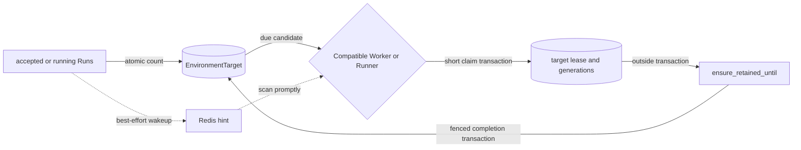

# Environment Connections, Targets, and Runtime Attachments

## Design Position

Foundation manages references to customer-owned Environments and the bounded
retention required to keep an already-existing provider target alive while accepted
or running Runs use it. It does not own general provider-side target lifecycle.

Every Foundation Environment, named or inline, identifies an already-existing target.
Foundation validates and freezes that connection, globally correlates the target,
authorizes its use, opens a process-local attachment for each independent RunAttempt,
and closes only the local attachment. When the selected Foundation integration
declares bounded retention, Foundation can extend an existing target's alive-until
deadline while at least one associated Run is `accepted` or `running`. It never
creates, starts, resumes, replaces, pauses, stops, or destroys the provider target.

The shared [`a13n-environment-provider`](../agent-environment-provider/README.md)
contract remains broader. An `EnvironmentProvider` can support creation, re-entry,
warmup, replacement, destruction, and state export for other Hosts. Foundation does
not narrow or modify that contract and does not call those lifecycle paths.
Foundation owns separate attachment, target-identity, and retention integration
adapters. Those adapters may delegate bounded provider-specific operations to a
selected provider package without adding Foundation policy to the shared package.

Harness receives one fresh process-local `Environment` adapter as its default
`workspace` mount. The adapter's entry attaches to the exact accepted target, and its
close releases only process-local clients, sessions, carriers, and handles.

## Boundaries

| Concern                                                    | Owner                                        | Contract                                                                                   |
| ---------------------------------------------------------- | -------------------------------------------- | ------------------------------------------------------------------------------------------ |
| Workspace Environment identity and immutable revisions     | Foundation                                   | Reusable connection definitions, credential references, and access ceilings                |
| Global external-target correlation and active-use count    | Foundation                                   | One tenant-neutral `EnvironmentTarget` per canonical provider identity                     |
| Provider-side target creation and general lifecycle        | Customer and provider                        | Outside Foundation; Foundation performs only declared bounded retention                    |
| Generic Provider capabilities                              | `a13n-environment-provider`                  | May include create, re-entry, warmup, replacement, state, and destroy                      |
| Foundation attachment capability                           | Foundation integration adapter               | Validates a connection and constructs an adapter that can only attach to the exact target  |
| Foundation target identity and retention policy            | Foundation integration adapter               | Canonicalizes global identity and declares whether bounded keepalive is required           |
| Foundation retention capability                            | Foundation integration adapter               | Idempotently extends one existing target's bounded alive-until deadline                    |
| Provider catalog and exact package lock                    | Foundation distribution or operator boundary | Trusted code selection; catalog presence grants no Workspace authority                     |
| Workspace Provider selection                               | Foundation authorization                     | Enables one exact trusted provider package lock                                            |
| Secret storage and current eligibility                     | [Secret Management](27-secret-management.md) | Resolves fresh values without persisting them in a connection                              |
| Agent selection and immutable Run execution configuration  | Foundation                                   | At most one primary connection, exact provider lock, Secret references, and access ceiling |
| Run-to-Environment correlation and active-count transition | Foundation                                   | One immutable binding per Run; accepted/running membership updates the target atomically   |
| Fresh runtime collaborators and attachment adapters        | Worker                                       | Constructed for one independent RunAttempt and never persisted                             |
| Target keepalive claim and external operation              | Worker                                       | Per-target PostgreSQL lease and fenced, transaction-free Provider call                     |
| Multi-mount routing, entry, portable snapshots, and close  | Harness                                      | Run-local bound facade; close never mutates the provider-side target lifecycle             |
| Background process control and active completion readiness | Harness                                      | Run-owned controller; killed and released before adapter close                             |
| EIP session and daemon enforcement                         | Agent-envd and its client                    | Daemon generation and bounded Environment operations                                       |

Provider discovery, package upload, schema validity, target-identifier possession,
or a prior successful attachment does not authorize Provider or target use. API input
and stored data never supply an arbitrary Python import target.

## Foundation Provider Capabilities

Foundation exposes a safe catalog of deployment-trusted Environment provider
packages and Foundation-owned integration adapters. A package can implement the
generic `EnvironmentProvider` contract and any other capabilities it needs without
declaring Foundation target identity or retention policy. To be selectable by
Foundation, an integration adapter exposes the following Foundation-owned
capability:

```python
# Conceptual Foundation integration protocol; not part of
# a13n-environment-provider.
class FoundationEnvironmentAttachProvider(Protocol):
    provider_key: str
    connection_versions: frozenset[str]
    identity_schema_version: str
    retention_behavior: Literal["none", "while_execution_active"]

    def validate_connection(
        self,
        *,
        schema_version: str,
        parameters: JsonObject,
    ) -> BaseModel: ...

    def target_identity(
        self,
        *,
        connection: BaseModel,
    ) -> FoundationEnvironmentTargetIdentity: ...

    def create_attachment_environment(
        self,
        *,
        connection: BaseModel,
        runtime: object,
    ) -> Environment: ...


class FoundationEnvironmentTargetIdentity(BaseModel):
    namespace: JsonObject
    target_key: str


class FoundationEnvironmentRetentionProvider(Protocol):
    async def ensure_retained_until(
        self,
        *,
        connection: BaseModel,
        runtime: object,
        deadline: datetime,
        operation_id: str,
    ) -> datetime: ...
```

`validate_connection()`, `target_identity()`, and
`create_attachment_environment()` are deterministic and perform no filesystem,
subprocess, daemon, network, SDK, or provider API I/O. The returned value is a fresh,
single-use implementation of the shared `Environment` interface. Its `enter()` path:

1. resolves and inspects only the exact target named by the validated connection;
2. establishes fresh operation clients, an EIP session, readiness, and provider
   facets;
3. fails if the target is missing, stopped, paused, inaccessible, incompatible, or
   otherwise unavailable; and
4. never falls back to generic Provider create, start, resume, replacement, or
   recovery behavior.

Foundation never calls the generic Provider's `create_environment()`, `warmup()`, or
`destroy()` methods. `a13n-environment-provider` does not define
`identity_schema_version`, `target_identity()`, `retention_behavior`, or
`ensure_retained_until()`. Foundation ships adapters for the shared built-ins; an
extension can ship its Foundation integration separately from its generic Provider.
An adapter may delegate existing pure validation, target-key, and attach-only
operations to a provider implementation, but attachment and retention remain
separate conformance boundaries. The attachment's `dump_state()` output is not
Foundation authority. A Foundation attachment returns `None` from `dump_state()`
because the exact connection is already frozen in `EnvironmentExecutionConfig`;
Harness therefore publishes no provider target state for this mount.

`target_identity()` returns the bounded canonical identity of the external target.
`provider_key`, `identity_schema_version`, canonical `namespace`, and `target_key`
together identify one target across the whole Foundation deployment. For E2B the
target key is the Sandbox ID. A Provider whose native ID is not globally unique must
include every non-secret provider namespace component required for global
unambiguity; Organization, Workspace, package revision, credentials, and mutable
connection options must not enter the identity. The target key is not a credential,
ownership proof, authorization token, or tenant boundary.

For the shared Direct Local, Local Envd, and Docker built-ins, Foundation's adapter
uses identity schema `1`, maps the Provider's existing pure `target_key()` result to
an empty namespace, and declares `retention_behavior="none"`. The shared Provider
package remains unchanged and owns none of these Foundation metadata declarations.

`retention_behavior="none"` means Foundation never invokes a retention operation for
that integration. `while_execution_active` means Foundation automatically retains
the target while at least one associated Run is `accepted` or `running`; this is
Foundation integration policy and has no per-Run or per-Workspace override. Such an
integration must expose `FoundationEnvironmentRetentionProvider`, or registration
and selection fail closed.

`ensure_retained_until()` performs external I/O and has these constraints:

1. `operation_id` is idempotent, and repeating it never shortens a previously
   requested deadline;
2. a later request is monotonic and can only extend bounded retention;
3. the returned instant is the Provider's acknowledged alive-until observation and
   is no earlier than the acknowledged request;
4. it operates only on the exact target in `connection`; and
5. it never creates, starts, resumes, replaces, pauses, stops, or destroys a target.

A timeout or unknown result is retried with the same operation identity. Operation
generation changes only when Foundation intentionally issues a later deadline, not
because an acknowledgement was lost.

## Provider Catalog and Workspace Selection

Each Foundation catalog entry contains bounded display metadata, supported
connection versions and JSON Schemas, identity-schema version, retention behavior,
non-secret runtime credential requirements, operation families, and an exact
dependency lock. Reading the catalog performs no import, credential, filesystem,
daemon, network, or provider-target I/O.

Provider code comes from fixed
[distribution composition](02-distribution-composition-and-extensions.md) or an
immutable managed Environment Provider package revision. Managed revisions reuse the
upload, hashing, immutable object storage, dependency validation, content-addressed
cache, and conflict handling defined for
[managed Harness plugins](36-managed-harness-plugins-and-runtime.md), but remain a
separate extension kind with their own identities, entry point, locks,
authorization, and runtime contract.

Foundation reuses the artifact substrate, not the `HarnessPluginPackage` product
identity or Harness plugin SPI. One selected package contributes exactly one
Foundation attachment capability and, when it declares
`while_execution_active`, one retention capability. It may also contribute the
generic `EnvironmentProvider` entry point, but Foundation selection does not grant
authority to call its broader lifecycle methods. Publication validates non-executing
metadata, including the required retention entry point, without importing code. A
Worker loads only the exact verified artifact on demand and rejects conflicting
Provider keys, distributions, or top-level packages; a process never reloads an
implementation.

The deployment-authenticated operator API publishes and reads package revisions:

```http
POST /internal/v1/environment-provider-package-revisions
GET /internal/v1/environment-provider-package-revisions/{package_revision_id}
```

These routes are outside `/api/v1`, public OpenAPI, SDKs, tenant RoleBindings, and
browser sessions. Upload grants trusted in-process code-execution authority.
Untrusted Providers require a separate out-of-process protocol and security boundary.

Workspace users view the safe catalog and enable an exact entry:

```python
# Conceptual Foundation domain schema; not a wire or ORM model.
class EnvironmentProviderSelection:
    organization_id: OrganizationId
    workspace_id: WorkspaceId
    provider_key: str
    provider_package_revision_id: EnvironmentProviderPackageRevisionId | None
    provider_lock: DependencyLock
    enabled: bool
    updated_at: datetime
```

The Workspace selection is the user-management surface for an uploaded package. GET
returns a strong ETag and changes require `If-Match`; it has no generic version
counter. Users can inspect catalog revisions, enable or disable one exact lock, and
later select it from Environment revisions. Selection never mutates or deletes the
operator-published package revision.

Only an enabled selection can create a revision, accept a Run configuration, test a
revision, or reconstruct a RunAttempt. Disabling it does not delete retained
connections or bindings, but later use fails closed without substituting another
package, Provider, or target.

## Connection Definition

Foundation owns the serializable connection envelope:

```python
class EnvironmentConnectionSpec:
    provider_key: str
    schema_version: str
    parameters: JsonObject
```

`parameters` is validated by the selected Foundation attachment capability. It
contains the exact non-secret provider target reference and any non-secret namespace
or connection options required to attach. Unlike generic
`EnvironmentProviderSpec.configuration`, it can and normally does contain an existing
provider target ID.

The envelope and provider-owned parameter model reject unknown fields. Values are
bounded canonical JSON. Every supported schema identifies exactly one existing target;
it cannot describe a target to create, a fallback target, or a target-selection query.

The connection contains no credential value, SDK client, bearer URL, resolved
short-lived endpoint, EIP session, PID, process handle, Harness mount ID, RunAttempt
authority, lifecycle receipt, or Foundation record identity. A target ID can still be
sensitive tenant data and follows the protected projection rules below.

## Global Environment Target Model

`EnvironmentTarget` is Foundation's internal, deployment-global correlation and
keepalive-coordination record for one external target. It is not a tenant resource,
an authorization object, or a public Environment. In particular it contains no
`organization_id`, `workspace_id`, owning Principal, credential reference, or
Provider package version.

```python
type EnvironmentTargetRetentionBehavior = Literal[
    "none",
    "while_execution_active",
]
type EnvironmentTargetStatus = Literal["active", "idle", "retired"]


class EnvironmentTarget:
    id: EnvironmentTargetId
    provider_key: str
    identity_schema_version: str
    target_key: str
    target_identity_digest_sha256: str
    retention_behavior: EnvironmentTargetRetentionBehavior

    status: EnvironmentTargetStatus
    active_run_count: int
    idle_at: datetime | None
    retire_after: datetime | None

    keeper_claim_generation: int
    keeper_owner_worker_generation: str | None
    keeper_lease_expires_at: datetime | None
    keeper_source_binding_id: RunEnvironmentBindingId | None

    operation_generation: int
    operation_id: str | None
    requested_alive_until: datetime | None
    acknowledged_alive_until: datetime | None
    next_keepalive_at: datetime | None
    last_error: SafeProviderError | None

    created_at: datetime
    updated_at: datetime
```

The canonical target-identity document contains `provider_key`,
`identity_schema_version`, canonical `namespace`, and canonical `target_key`.
Foundation stores its SHA-256 digest and enforces uniqueness on
`(provider_key, identity_schema_version, target_identity_digest_sha256)`.
`target_key` remains protected data used for exact correlation; the canonical
namespace stays in the immutable connection rather than becoming another public
target projection. Digest equality neither grants access nor reveals the target to a
caller.

The same row owns the materialized active-Run count, lifecycle status, Keeper lease,
and latest external-operation observation. There is no separate retention, Keeper,
target-owner, or target-state table. Claim generation fences Worker ownership;
operation generation and `operation_id` fence and deduplicate one external deadline
extension. Lease fields and source binding are either all absent or describe the
current claim. `operation_id` is a stable Foundation-generated `envkop_...` identity
for one operation generation. A stale generation cannot update operation
observations.

`active_run_count` is non-negative. It is greater than zero exactly when
`status="active"`; both `idle` and `retired` require zero. `idle_at` is set when the
last active Run leaves the active set. `retire_after` is a Foundation record-lifecycle
deadline chosen to cover the current Keeper lease, any in-flight requested deadline,
Provider timeout, and a bounded safety margin. `acknowledged_alive_until` is only the
latest Provider observation. Those instants have different meanings and never
collapse into one `expires_at` field.

Revision creation calls the integration adapter's pure `target_identity()` function and upserts the target
in the same short transaction that publishes the revision. Inline selection performs
the same idempotent short upsert during Run-admission preflight so the immutable
execution configuration can contain the resolved target ID; the final acceptance
transaction revalidates and activates that row. A newly inserted zero-count row starts
`idle` with bounded retirement fields. If acceptance later fails, the unreferenced row
is only a safe cleanup candidate and grants no Run authority. The upsert discloses
neither whether another tenant already referenced the target nor any other tenant
fact. A package whose retention behavior conflicts with an existing row under the
same identity schema is incompatible; it must use a reviewed identity-schema
migration rather than silently reinterpret the row.

## Workspace Environment and Revision Model

The API resource named `Environment` is a Foundation-owned reusable connection
definition, not the shared process-local adapter and not the provider target itself.
It has stable identity for naming, authorization, archival, and current-revision
selection. An `EnvironmentRevision` is an immutable connection revision.

```python
class FoundationEnvironment:
    id: EnvironmentId
    organization_id: OrganizationId
    workspace_id: WorkspaceId
    name: str
    description: str | None
    version: int
    current_revision_id: EnvironmentRevisionId
    archived_at: datetime | None


type EnvironmentAccess = Literal["read_only", "read_write", "full"]


class EnvironmentRevision:
    id: EnvironmentRevisionId
    environment_id: EnvironmentId
    workspace_id: WorkspaceId
    version: int
    environment_target_id: EnvironmentTargetId
    target_key: str
    connection: EnvironmentConnectionSpec
    provider_package_revision_id: EnvironmentProviderPackageRevisionId | None
    provider_lock: DependencyLock
    credential_bindings: tuple[EnvironmentCredentialBinding, ...]
    access: EnvironmentAccess = "full"
    logical_digest_sha256: str
```

Creation atomically creates revision `1`. Connection, credential-reference, exact
package-lock, or access changes create a higher revision. Mutable display metadata
changes do not. Restoring old configuration copies it into a new revision, and
canonical semantic no-ops create nothing. Existing Runs retain their accepted
revision or inline execution configuration; an edit never mutates active or resumable
work in place.

Revision creation resolves the enabled Workspace selection, validates the exact
connection schema and access ceiling, derives the canonical target identity, upserts
and references its `EnvironmentTarget`, and captures the exact package lock without
performing external I/O. Trusted capability loading follows the selected
distribution's runtime boundary and never uses a caller-supplied import target.
Validation proves only that the connection is well-formed. Target existence and
readiness are checked when a test or RunAttempt attaches. A revision contains no live
adapter, generic Provider state, Harness state, or lifecycle operation; mutable
target coordination remains owned by the referenced `EnvironmentTarget`. A
referenced revision cannot be deleted.

## Credential Bindings

Connection parameters contain no credential values. Each catalog-declared runtime
credential requirement is bound to exactly one non-secret source:

```python
class EnvironmentCredentialBinding:
    requirement_key: str
    credential: SecretCredentialSource
```

`SecretCredentialSource` is the shared non-secret selector defined by the
[Secret credential-reference contract](27-secret-management.md#credential-references).
Environment bindings add only the Provider requirement key; they do not create
Environment-specific variants of the same Secret reference.

Every RunAttempt and connection test reauthorizes the Workspace selection,
Environment use, credential source, owning principal, and current Secret eligibility.
Foundation decrypts values only after closing the authorization transaction and
supplies them to one process-local runtime builder. Secret rotation therefore affects
the next independent attachment without creating another revision.

Secret values and value-derived data never enter revisions, bindings, Run state,
events, Items, logs, traces, metric labels, or API responses. Missing or denied
credentials fail closed.

## Environment Selection and Inline Parameters

An `AgentConfig` selects at most one primary exact Environment revision:

```python
class EnvironmentSelection:
    environment_revision_id: EnvironmentRevisionId
```

A typed Run override can replace that selection with another exact revision or one
inline connection. Explicit null clears the Environment; omission inherits the Agent
Revision:

```python
class InlineEnvironmentSelection:
    connection: EnvironmentConnectionSpec
    credential_bindings: tuple[EnvironmentCredentialBinding, ...] = ()
    access: EnvironmentAccess = "full"
```

The value of `config_override.environment` for an inline selection has exactly these
fields:

| Field                                   | Required | Meaning                                                                                  |
| --------------------------------------- | -------- | ---------------------------------------------------------------------------------------- |
| `connection.provider_key`               | yes      | Selected namespaced provider key                                                         |
| `connection.schema_version`             | yes      | Version of the Foundation connection schema                                              |
| `connection.parameters`                 | yes      | Provider-specific existing-target reference and non-secret attachment options            |
| `credential_bindings`                   | no       | One non-secret Secret source per declared runtime credential requirement; defaults empty |
| `credential_bindings[].requirement_key` | yes      | Catalog-declared credential requirement name                                             |
| `credential_bindings[].credential`      | yes      | `workspace_secret` or `invoking_user_secret` reference                                   |
| `access`                                | no       | `read_only`, `read_write`, or `full`; defaults to `full`                                 |

There is no Foundation `environment_id` or `environment_revision_id` in an inline
selection. The provider-side target identifier is inside
`connection.parameters`. The complete Run request fragment for E2B attachment version
`1` is:

```json
{
  "config_override": {
    "environment": {
      "connection": {
        "provider_key": "a13n.e2b",
        "schema_version": "1",
        "parameters": {
          "sandbox_id": "customer-created-sandbox-id"
        }
      },
      "credential_bindings": [
        {
          "requirement_key": "api_key",
          "credential": {
            "source": "workspace_secret",
            "secret_id": "sec_0123456789abcdef"
          }
        }
      ],
      "access": "full"
    }
  }
}
```

`sandbox_id` is required and names an already-created E2B Sandbox. Foundation does
not accept an image, template, CPU, memory, timeout, auto-pause, or creation option in
this schema. An E2B attachment that requires a non-secret region or account namespace
uses an explicit connection-schema field or a new schema version; Foundation never
infers that namespace from credentials.

Inline selection passes the same provider-selection, schema, credential-reference,
access, and authorization validation as a named revision, but creates no reusable
`Environment` or `EnvironmentRevision`. Foundation exposes no public multi-Environment
topology, mount-name map, default-mount selector, mutable Environment-head selector,
or per-Agent Environment policy document in the first version.

## Accepted Execution Configuration and Run Binding

Agent Revision creation resolves an exact named selection into an immutable execution
configuration. Run acceptance resolves the final exact or inline selection into
`EffectiveAgentConfig.environment`:

```python
class EnvironmentExecutionConfig:
    schema_version: Literal["1"]
    source_environment_revision_id: EnvironmentRevisionId | None
    environment_target_id: EnvironmentTargetId
    target_key: str
    connection: EnvironmentConnectionSpec
    provider_package_revision_id: EnvironmentProviderPackageRevisionId | None
    provider_lock: DependencyLock
    credential_bindings: tuple[EnvironmentCredentialBinding, ...]
    access: EnvironmentAccess
    logical_digest_sha256: str
```

This immutable value is the authority for the exact connection used by the Run. A
named selection records its source revision; an inline selection records `None`.
Neither form follows a later Environment revision, package selection, or Workspace
default.

Every accepted Run with a non-null Environment also receives one immutable relational
binding:

```python
class RunEnvironmentBinding:
    id: RunEnvironmentBindingId
    organization_id: OrganizationId
    workspace_id: WorkspaceId
    run_id: RunId
    mount_name: Literal["workspace"]
    source_environment_revision_id: EnvironmentRevisionId | None
    environment_target_id: EnvironmentTargetId
    provider_key: str
    target_key: str
    environment_execution_config_digest_sha256: str
    created_at: datetime
```

The binding is inserted atomically with the Run. `id` is a Foundation-generated
`envb_...` identity and is the unique identity of this Run's binding, including for
inline selections. The exact target identity is owned by the referenced
`EnvironmentTarget`; `target_key` is a protected immutable correlation snapshot kept
for rolling compatibility and attachment verification, not a second identity or
authorization boundary. The exact connection and credential references remain owned
by `EffectiveAgentConfig.environment`. The binding stores only the immutable Run
relation and matching execution-config correlation, so it is not a second mutable
configuration authority.

There is no uniqueness constraint that prevents multiple Organizations, Workspaces,
Runs, Threads, revisions, or inline selections from binding to the same target.
Provider concurrency rules are checked when each RunAttempt attaches. Possessing a
binding ID, target ID, target key, or identity digest grants no authority.

A replacement RunAttempt reuses the same Run binding and exact execution
configuration. Retry creates another Run and therefore another binding while copying
the accepted execution configuration. An ordinary continuation or fork creates a new
binding from its own accepted effective configuration, even when it points to the
same customer-owned target.

The relational responsibilities are therefore:

| Table                             | Information owned                                                                                                      |
| --------------------------------- | ---------------------------------------------------------------------------------------------------------------------- |
| `environment_provider_selections` | One Workspace's enabled exact trusted attachment-provider package lock                                                 |
| `environment_targets`             | Global target identity, active-Run count, lifecycle status, Keeper lease, and latest bounded retention observation     |
| `environments`                    | Stable reusable name, metadata, lifecycle, version, and current revision                                               |
| `environment_revisions`           | Immutable exact connection, credential references, access ceiling, provider package lock, target reference, and digest |
| `run_environment_bindings`        | Immutable Run relation, optional source revision, target reference, provider correlation, and execution-config digest  |

No Foundation table represents target creation, complete provider runtime state,
attachment sessions, target ownership, or destructive cleanup. `environment_targets`
records only correlation and the bounded retention coordination defined here.

The relational schema preserves these constraints and access paths:

1. `(provider_key, identity_schema_version, target_identity_digest_sha256)` is
   unique, while Provider package revision and tenant IDs are absent from that key;
2. `active_run_count >= 0`, `status="active"` exactly when the count is positive, and
   `idle` or `retired` exactly when it is zero;
3. Keeper owner, lease expiry, and source binding are all present or all absent, and
   every generation is non-negative and monotonic;
4. a source binding references the same target and is merely operation provenance,
   not a foreign-key transfer of tenant authority;
5. one binding exists at most once for `(run_id, mount_name)`, and its target and
   execution-config digest are immutable; and
6. the due-target index begins with retention behavior, status,
   `next_keepalive_at`, and lease expiry, while the source-selection path begins with
   binding target ID and joins indexed Run status and creation order.

## Active Run Accounting and Target Lifecycle

A Run contributes one unit to its binding's `EnvironmentTarget` exactly while the
Run status is `accepted` or `running`. The count is a transactionally maintained
aggregate over immutable bindings, not a periodic `EXISTS` query and not a count of
RunAttempts, Harness Runs, Workers, attachments, Threads, or Workspaces.

| Run operation or transition                              | Target count effect                                                 |
| -------------------------------------------------------- | ------------------------------------------------------------------- |
| Accept a Run with an Environment                         | Increment its target once; activate an idle or retired row          |
| `accepted -> running`                                    | None                                                                |
| RunAttempt replacement, retryable backoff, or handoff    | None; these remain the same `running` Run                           |
| `accepted/running -> waiting/completed/failed/cancelled` | Decrement once                                                      |
| Retry, Continue, fork, or automatic successor            | A new Run and binding increment their selected target independently |
| Async child with `shared_root`                           | The independent child Run increments the same target                |
| Async child with `dedicated`                             | The independent child Run increments its different target           |
| Async child with `none`, or an inline Harness child      | No new binding and no target-count change                           |

Run acceptance inserts the binding and increments the target in the same final short
transaction. A sealing or pre-execution terminal transaction changes the Run status
and decrements its target in that same transaction. Updates derive the delta from the
locked old and requested new Run status, so replaying an accepted acceptance identity
or terminal transition cannot increment or decrement twice. A failed transaction
changes neither fact, and the count cannot become negative.

When a decrement changes the count to zero, the same transaction sets
`status="idle"`, records `idle_at`, clears `next_keepalive_at`, and sets a bounded
`retire_after` late enough to cover the current Keeper lease, the requested external
deadline and call timeout, and a safety margin. It does not call the Provider or
cancel an in-flight external operation. A later Run acceptance locks and reuses the
same row, increments the count, sets `status="active"`, clears the idle retirement
fields, and makes `next_keepalive_at` immediately due when retention is required.

After `retire_after`, a bounded Worker scan can change an unchanged zero-count idle
row to `retired`; this is a Foundation tombstone transition and performs no Provider
operation. A retired row can still reactivate if the same target is referenced again.
Physical deletion is handled by the Environment domain's ordinary control-role
retention reconciler only after all of these are true:

- no EnvironmentRevision references the target;
- no retained `RunEnvironmentBinding` references the target;
- no unexpired Keeper lease or operation result-acceptance window remains; and
- the target's audit and tombstone retention periods have elapsed.

Run lifecycle transactions extend the repository's canonical lock order: lock the
relevant Thread, Run, and RunAttempt rows first, then every affected
`EnvironmentTarget` in stable target-ID order, and only then lock Thread-inbox
counters, inbox entries, or queued-submission rows. A Keeper never locks a target and
then a Run. It selects a source optimistically and revalidates the Run before locking
the target in the claim transaction.

## Environment Keepalive Execution

The `worker` role owns a supervised `EnvironmentKeepaliveLoop` alongside the
`WorkerExecutionLoop`; it is not a RunAttempt child task and uses separately bounded
concurrency so keepalive cannot consume Agent execution slots. There is no fixed
Keeper instance and no deployment-wide leader. Every compatible Worker, or every
compatible lock-scoped Runner in `runner` mode, competes for a lease on one target at
a time.



The due scan reads only target-row state:

```text
status = active
AND active_run_count > 0
AND retention_behavior = while_execution_active
AND next_keepalive_at <= now
AND keeper lease is absent or expired
```

PostgreSQL is authoritative for demand, claim, fencing, acknowledgement, idle, and
retirement. Run acceptance and active-set exit can publish a best-effort Redis wakeup
hint, but every Worker performs a bounded periodic scan so lost hints cannot strand a
target.

The claiming Worker discovers credentials and exact executable code from active Run
bindings rather than storing either on the global target. It considers bindings whose
Runs are currently `accepted` or `running`, ordered by `(Run.created_at, binding.id)`,
and selects the first candidate for which the Run Principal, Workspace Provider
selection, exact package lock, connection, and every Secret reference remain valid.
This authorization grants one operation through that binding only; it does not make
the target belong to the candidate's tenant. If all candidates are invalid, the loop
records a bounded safe error and a bounded retry time on the target without exposing
candidate or tenant data.

In `on_demand` mode the Worker verifies and loads the source binding's exact Provider
lock before claim. In `runner` mode only the Runner for that exact lock scans and
claims the candidate; the Supervisor treats a due compatible Keeper candidate as a
reason to start or retain the corresponding Runner even when it has no RunAttempt.
An incompatible Worker or Runner never claims and never substitutes another package.

The operation follows three boundaries:

1. Detached preparation chooses and authorizes a candidate without retaining a
   database session across package loading, Secret resolution, or other external I/O.
2. A short claim transaction locks and revalidates the source Run before the target,
   verifies that both are still eligible, increments `keeper_claim_generation`, and
   writes owner Worker generation, lease expiry, source binding, requested deadline,
   and operation identity. A fresh deadline increments `operation_generation`; a
   retry or lease takeover of an unknown outcome preserves the same operation
   generation, ID, and deadline while changing only claim ownership.
3. The Worker resolves fresh Secret values, calls `ensure_retained_until()` outside
   every transaction, and uses a short compare-and-swap transaction over target ID,
   claim generation, operation generation, operation ID, and owner to record the
   acknowledgement or bounded failure and compute `next_keepalive_at`.

Immediately before the external call, invalid source authority causes the Worker to
release or replace the source under another short claim transaction. It never borrows
a non-active Run, another target, a disabled package, or another tenant's credentials
without that tenant's still-active authorized binding. The requested alive-until
window, call timeout, lease, retry backoff, and scheduling safety margin are finite
deployment bounds; successful scheduling refreshes before the acknowledged deadline.

A Provider timeout or unknown outcome retains and retries the same operation
identity. Worker loss permits takeover only after the recorded lease expires. A stale
or late caller cannot commit after a newer claim generation, although its monotonic
Provider call may produce one bounded extra retention window. It can never terminate
the target or accumulate an unbounded extension.

Worker drain stops new keepalive claims. An owned call may finish and commit while
the Worker remains within its drain deadline; otherwise the Worker stops extending
the lease and another compatible instance takes over after expiry. Per-target
Provider errors affect only that target and do not make the Worker unready. An
unexpected exit of the supervised `EnvironmentKeepaliveLoop` is a critical Worker
component failure.

## RunAttempt Attachment

Run acceptance performs no provider-target I/O. For each claimed independent
RunAttempt, the Worker:

1. reads the optional exact `EnvironmentExecutionConfig` and corresponding
   `RunEnvironmentBinding`, verifies their digests and common target reference, and
   recomputes the connection's canonical identity against the protected target row;
2. when the configuration is absent, supplies no Environment mount and performs no
   Environment, Provider, credential, or attachment work;
3. when present, reauthorizes Environment use, Workspace Provider selection, access,
   principal eligibility, and every credential source;
4. resolves fresh Secret values and process-local runtime collaborators outside the
   authorization transaction;
5. resolves the exact trusted Foundation attachment capability, revalidates the
   connection, and constructs one fresh attach-only `Environment` adapter without
   external I/O;
6. wraps it in a lightweight Harness `EnvironmentMount` with the accepted access
   ceiling and supplies it as the default `workspace` mount;
7. lets Harness allocate a fresh opaque mount ID, enter the exact target, route
   operations, and close the adapter; and
8. releases any still-open process-local resources during unconditional finalization.

Foundation persists no `EnvironmentState`, current Thread-to-target association,
attachment session, SDK client, EIP session, mount ID, or complete Provider health
record. The target row's bounded retention observation is not attachment state and is
never used to retarget a Run. `HarnessState.environment_states` is not used to select
or retarget a Foundation attachment. Worker loss discards only process-local
attachment state; a replacement Attempt attaches again to the same frozen target.

Foundation does not supply `HostedProcessRunCapability`. When effective Environment
actions expose background shell, Harness tracks the process only inside that logical
Run, enqueues final-completion readiness while the Run remains active, and
kills/releases remaining process-local work before adapter close. Foundation stores
no process reference, output cursor, status, result, or wake fact in Run state and
starts no successor Run for process completion.

## Continuation, Fork, and Child Semantics

A new Run that inherits an Environment configuration receives a new binding to the
same exact external target and contributes its own active count while accepted or
running. Foundation never creates a target to isolate a continuation, fork, or child
automatically.

- `none` gives the child no Environment.
- `shared_root` requires the root's exact connection and provider lock and permits
  only an equal or narrower access ceiling. The child receives its own Run binding to
  the same target and increments that target when child acceptance commits.
- `dedicated` requires the child Agent's frozen configuration to name another exact
  customer-created target. It means independently selected, not
  Foundation-provisioned or Foundation-destroyed, and increments that target.
- Inline child execution borrows the already-entered parent Harness facade and creates
  no separate binding, count contribution, or attachment.

A fork that inherits the source effective configuration binds to the same target. A
fork that must use a different sandbox supplies an explicit compatible Environment
override naming that already-existing target.

## Agent Input and Managed Skill Preparation

Managed Skill materialization is Host preparation, not an Agent tool call. It uses the
fresh entered Harness Environment facade, is content-addressed, writes a completion
manifest last, and may be repeated after a later attachment without exposing a
partial catalog.

[`environment_path` Agent input delivery](17-agent-input.md#binary-source-and-delivery)
requires a writable default mount. The Worker reads the accepted URL, authorized
source binding path, or exact immutable Asset into private local staging and transfers
it through the active default Environment's authorized file-write operation to the
deterministic logical path below `/workspace/.a13n/inputs/`. Only that Environment path
enters Agent input; the Worker staging path is never exposed.

A replacement RunAttempt derives whether to rewrite the path from the Run's existing
charged model-request usage. Zero prior model requests causes another bounded source
read and deterministic replacement; a positive total assumes that input preparation
already wrote the path and performs no file inspection or rewrite. Foundation stores
no separate materialization status.

External Environment effects absent from the latest complete Run or continuation
publication are not recoverable execution state and can repeat after replacement.
Foundation does not infer rollback from RunAttempt cancellation, reconstruct external
effects from message history, or maintain a generic tool invocation ledger.

## Management API

The public `/api/v1` surface follows the shared
[Management API](16-management-api.md):

| Resource                     | Route shape                                                                                                 |
| ---------------------------- | ----------------------------------------------------------------------------------------------------------- |
| Provider catalog             | `GET /environment-providers`, `GET /environment-providers/{provider_key}`                                   |
| Workspace Provider selection | `GET/PUT /workspaces/{workspace_id}/environment-providers/{provider_key}`                                   |
| Environments                 | `POST/GET /workspaces/{workspace_id}/environments`, `GET/PATCH /environments/{environment_id}`              |
| Revisions                    | `POST/GET /environments/{environment_id}/revisions`, `GET /environment-revisions/{environment_revision_id}` |
| Attachment test              | `POST /environment-revisions/{environment_revision_id}/test`                                                |

`EnvironmentTarget` has no public list, detail, mutation, retirement, or
keepalive API. Users observe an association only through an Environment revision or
Run they are independently authorized to read. No response reveals whether another
Organization or Workspace references the same target.

Provider catalog reads authorize `environment_provider.read`; Workspace selection
mutation authorizes `environment_provider.select`; Environment and revision reads
authorize `environment.read`; create, metadata mutation, revision publication, and
archive mutation authorize `environment.manage`; an attachment test authorizes
`environment.test`; and an explicit Run selection authorizes `environment.use` in
addition to Agent invocation. These stable actions and built-in grants are owned by
the IAM [registry](33-identity-and-access-management.md#stable-action-registry).

The synchronous `test` endpoint reauthorizes the exact revision and current
credential sources, opens an attachment to the exact existing target, verifies
bounded readiness, and closes local resources. It performs external I/O but never
creates, starts, resumes, replaces, pauses, stops, destroys, or keepalives the target,
and it retains no health or attachment state.

An authorized revision-detail read can return its protected non-secret connection so
that the user can manage it. That detail can therefore contain the provider target ID
inside `connection.parameters`; returning it requires `environment.read` on the exact
resource and private no-store handling. Collection, event, Run, and model-facing
projections contain only safe summaries and expose no Secret value, target key,
target identity digest, global target ID, connection parameter, runtime object,
adapter, attachment detail, Keeper error, or import path.

## Built-in Provider Consequences

- Foundation's Direct Local adapter declares `retention_behavior="none"`, attaches an explicitly
  authorized existing Host root, never interprets it as sandbox isolation, and does
  not delete its files.
- Foundation's Local Envd adapter declares `retention_behavior="none"` and attaches an explicitly
  authorized existing workspace. A process-local envd carrier can be opened and
  closed as transport, but Foundation does not create, delete, or own the workspace.
- Foundation's Docker adapter declares `retention_behavior="none"` and requires an exact existing
  container ID. Foundation does not create, start, restart, replace, stop, or remove
  the container.
- Foundation's E2B integration declares `retention_behavior="while_execution_active"` and requires an exact
  existing Sandbox ID. Foundation may only extend its bounded timeout through
  `ensure_retained_until()`; it does not create, start, resume, pause, replace, stop,
  or destroy the Sandbox.

The generic providers may still support broader lifecycle behavior outside
Foundation. Their generic behavior does not weaken these Foundation consequences.

## Verification

Specification examples and later implementation tests cover at least:

- global identity deduplication across Organizations, Workspaces, named revisions,
  and inline selections without tenant-data disclosure;
- parent and child concurrency, parent-first completion, accepted queueing, Retry,
  Continue, waiting, and every terminal Run transition;
- exact `shared_root`, `dedicated`, `none`, and inline-child count behavior;
- duplicate terminal submissions and concurrent transitions without a negative or
  repeated count delta;
- simultaneous multi-Worker claims, lease-expiry takeover, stale acknowledgement,
  and unknown Provider outcomes retried with one operation identity;
- deterministic source-binding selection and safe switching after Principal,
  Provider selection, package lock, or Secret invalidation;
- idle reactivation, retired tombstones, and reference-aware physical deletion;
- `on_demand`, `runner`, `all`, and drain behavior, including independent keepalive
  capacity and Runner materialization for a due historical lock; and
- missing, stopped, or paused targets failing without create, start, resume,
  replacement, stop, pause, or destroy.

## Failure Semantics

| Failure                                                        | Foundation outcome                                                                                                    |
| -------------------------------------------------------------- | --------------------------------------------------------------------------------------------------------------------- |
| Invalid Provider key, connection schema, lock, or access       | No Environment revision or Run is accepted                                                                            |
| Target identity or retention metadata is inconsistent          | Publication, selection, revision creation, or admission fails without merging different targets                       |
| Archived, disabled, denied, or raced selection                 | Acceptance, test, Attempt reconstruction, or Keeper source selection fails closed without substitution                |
| Missing, inactive, or denied credential                        | Test, Attempt, or Keeper source records a bounded safe credential failure                                             |
| Canonical target identity differs from the frozen reference    | Fail before attachment or keepalive; do not retarget                                                                  |
| Target missing, stopped, paused, inaccessible, or incompatible | Test or Attempt fails; Keeper records a safe error and never creates, starts, resumes, replaces, or mutates lifecycle |
| Provider reports unknown attachment outcome                    | Attempt fails; retry attaches again only to the same target                                                           |
| Provider reports unknown keepalive outcome                     | Preserve the operation identity and retry under the lease and fencing contract                                        |
| All active source bindings are currently unusable              | Record a bounded target error and back off; do not borrow inactive or unauthorized credentials                        |
| Keeper Worker disappears                                       | Its lease expires and another compatible Worker or Runner can take over                                               |
| Late Keeper acknowledgement                                    | Generation CAS rejects the write; at worst the monotonic call caused one bounded extra extension                      |
| Provider rejects concurrent attachment                         | The affected Attempt fails with a bounded conflict                                                                    |
| Harness checkpoint or continuation publication fails           | Attachment finalization still closes process-local resources                                                          |
| Adapter close fails                                            | Report bounded cleanup failure; never escalate to provider-target destruction                                         |
| Agent Environment result is absent from the latest checkpoint  | Recovery cannot classify the external operation outcome; re-driven Agent work can repeat                              |

## Security and Compatibility

Provider publication, Workspace selection, Environment authoring, Environment use,
Secret access, Keeper execution, and Agent tool access are separate authorities. A
model cannot select Providers, revisions, Secrets, target identities, Keeper sources,
runtime collaborators, or attachment parameters.

Provider code is trusted in-process code with worker-role authority. Exact locks and
operator-only publication do not sandbox it. Connection parameters, target keys,
target IDs, identity digests, source-binding correlation, and safe Keeper errors are
protected data. Secret values, native clients, and EIP sessions remain process-local.
The global target row is never a cross-tenant discovery or authorization surface.

The Foundation connection schema, target identity schema, retention behavior,
retention-operation contract, package lock, Run binding schema, Harness mount
contract, EIP, and Foundation APIs evolve independently from the generic Provider
configuration and `EnvironmentState` codecs. An incompatible exact lock, identity,
or connection version fails before model, tool, or Keeper work and never falls back
to another revision, Provider, target, or generic lifecycle path.

This contract retains the existing-target and attach-only boundary while adding one
Foundation-specific bounded retention operation. It does not restore the pre-release
Foundation desired-configuration or current Host `EnvironmentState` design, and it
does not remove or deprecate broader capabilities from
`a13n-environment-provider`.

## Invariants

01. Every Foundation Environment connection names an already-existing customer-owned target.
02. Foundation never creates, starts, resumes, replaces, pauses, stops, or destroys a provider target; its only target-lifecycle operation is monotonic bounded retention declared by the Provider.
03. The generic Environment Provider contract remains broader and independently reusable.
04. One deployment-global, tenant-neutral `EnvironmentTarget` represents each canonical provider target identity.
05. Named revisions and inline selections use the same `EnvironmentConnectionSpec` and pure target-identity derivation.
06. Inline selection creates no reusable Environment or EnvironmentRevision, but it upserts and references the global target during Run admission.
07. Every accepted Run with an Environment has one immutable `RunEnvironmentBinding` and contributes exactly one active count until it leaves `accepted` or `running`.
08. A binding ID identifies the Run relation; a target ID, target key, or identity digest identifies correlation; none grants authority.
09. `active_run_count > 0` exactly when target status is `active`, and replayed Run transitions never apply the count delta twice.
10. An AgentRevision and accepted Run select at most one primary Environment; Harness receives it as the default `workspace` mount.
11. Validation, target-identity derivation, and fresh adapter construction perform no external I/O; target observation begins only during test or entry.
12. Every independent RunAttempt receives a fresh attach-only adapter for the same frozen target.
13. Harness entry and close are Run-local; close releases only process-local resources.
14. Foundation persists no complete current Provider state, attachment session, client, EIP session, or mount ID; target retention observations cannot retarget a Run.
15. Secret values, live clients, and native handles never enter connections, targets, bindings, Run state, or continuation.
16. A Keeper derives current authority from an active binding, executes outside database transactions, and can commit only under its current PostgreSQL generation and lease.
17. Missing or unavailable targets fail closed without creation, recovery, destructive lifecycle mutation, or substitution.
