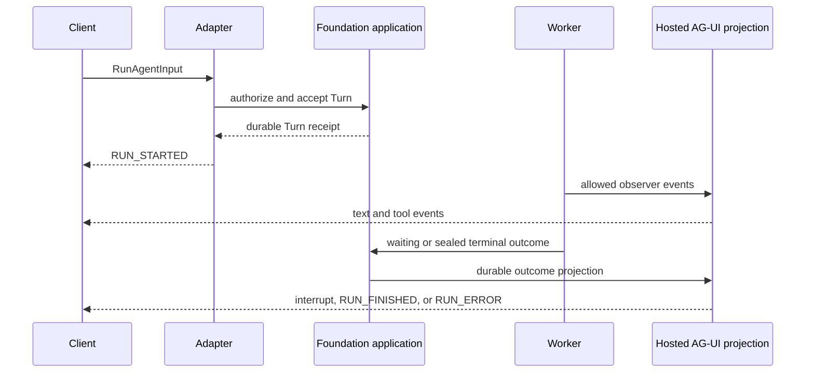

# Hosted AG-UI

## Design Position

Foundation Service hosts an AG-UI HTTP/SSE adapter for every callable
AgentPreset. The adapter accepts standard `RunAgentInput`, maps it to the
canonical [`AgentInput`](33-agent-input.md) and the existing
Session/Thread/Turn control contract, and delivers
standard AG-UI `BaseEvent` values derived from the selected Harness release
group and durable Foundation facts. It is not another Agent runtime or lifecycle
authority.

Hosted AG-UI is always present on `control` and `all` roles. It has no deployment
or AgentPreset-level enable switch and does not require a Foundation SDK. A
standard AG-UI client can call it using the wire profile defined here.

## Boundaries

| Concern                                                                              | Owner                                                                                        |
| ------------------------------------------------------------------------------------ | -------------------------------------------------------------------------------------------- |
| Standard AG-UI input and event models                                                | Pinned upstream AG-UI dependency selected by the Foundation-compatible Harness release group |
| Harness-to-AG-UI observation                                                         | [`HarnessAguiObserver`](../agent-stream-protocol/00-overview.md)                             |
| Canonical accepted input                                                             | [Agent Input](33-agent-input.md)                                                             |
| Durable Turn acceptance and waiting feedback                                         | [Agent Control](34-agent-control-input-and-continuation.md)                                  |
| Durable cancellation                                                                 | [Active Execution](35-agent-control-active-execution.md)                                     |
| Hosted external bindings, input validation, lifecycle projection, retention, and SSE | This document                                                                                |
| Current Principal and AgentPreset authorization                                      | [Foundation IAM](10-identity-and-access-management.md)                                       |
| Preset-specific schemas, visibility, and limits                                      | [Protocol configuration](12-agent-management.md#protocol-configuration)                      |

The adapter never reconstructs AG-UI events from Native notification envelopes
and never implements a second Harness event converter.

## HTTP Surface

```http
POST /ag-ui/v1/agent-presets/{agent_preset_id}/runs
Content-Type: application/json
Accept: text/event-stream
Last-Event-ID: <hosted-agui-cursor>
```

The request body is one standard `RunAgentInput` under the pinned AG-UI schema.
Its `agent_preset_id` comes only from the route. No body field, `context`, or
`forwardedProps` value can select another Foundation AgentPreset, Workspace,
Model, Secret, Connection, or Principal.

The response is SSE. Each AG-UI event is serialized as one standard JSON
`BaseEvent` in a `data` field. Foundation can add an SSE `id` for retained
delivery and reconnect; that ID is a Hosted AG-UI delivery cursor, not a
standard AG-UI identity or Native Turn Stream cursor. `Last-Event-ID` resumes
exclusively after the last completely applied hosted event.

The adapter also exposes explicit durable cancellation:

```http
POST /ag-ui/v1/agent-presets/{agent_preset_id}/cancel
Content-Type: application/json
```

The body names the external `threadId` and `runId`. Cancellation resolves their
persisted binding, reauthorizes the current AgentPreset and Turn, and invokes
the same durable Turn cancellation command used by Native clients. Closing the
run SSE does not call this command.

## External Binding

Hosted AG-UI persists a binding with this conceptual meaning:

```python
class AguiThreadBinding:
    client_identity: str
    agent_preset_id: str
    external_thread_id: str
    session_id: SessionId
    root_thread_id: ThreadId
    active_thread_id: ThreadId


class AguiRunBinding:
    client_identity: str
    agent_preset_id: str
    agent_preset_version_id: str
    external_thread_id: str
    external_run_id: str
    turn_id: TurnId
```

The schemas are conceptual durable records, not another public resource model.
External IDs are opaque bounded correlation chosen by the client. They grant no
read, continuation, cancellation, or stream authority.

The first accepted run for a previously unbound `(client identity, AgentPreset, threadId)` creates a Session, root Thread, and root Turn through the ordinary
application contract. A later run continues the binding's current active
Thread. `parentRunId` equal to the active completed Run is an ordinary
continuation; an authorized earlier completed Run creates an explicit
Foundation fork and atomically selects that fork as the binding's active
Thread. Cross-Preset, cross-client, incomplete, or concealed sources fail.

`runId` is the idempotency identity within one client, AgentPreset, and external
Thread. Repeating the same `runId` and canonical accepted input returns or
reattaches to the original Turn. Reuse with different input conflicts. A lost
HTTP response never causes the client to invent another `runId` for the same
intent.

## Input Authority

Hosted input is append-only relative to Foundation history:

- a new `user` message can become accepted input for a new Turn;
- a new `tool` message must resolve one exact unconsumed waiting client-tool
  call;
- assistant, system, developer, reasoning, and prior tool history are never
  imported or overwritten by a client snapshot; and
- a full `messages` array is a compatibility snapshot whose known prefix must
  equal the current authorized presentation and whose only accepted difference
  is a valid new tail.

An initial call does not import an arbitrary prior transcript. Historical import
is a separate Native operation with its own authority and validation.

The adapter maps the accepted new user tail into one canonical `AgentInput`.
Text and binary parts retain their order, media type, acquisition, and delivery
semantics; structured AG-UI data maps to `structured_content`. The selected
AgentPresetVersion declaration validates the resulting value before the control
operation accepts a Turn. AG-UI protocol fields that express state, context,
client tools, or feedback remain command options or correlated feedback and
never enter `AgentInput` implicitly.

Standard `state`, `context`, and `tools` plus Foundation extensions are bounded
untrusted inputs:

| Input                   | Accepted meaning                                                                                                    |
| ----------------------- | ------------------------------------------------------------------------------------------------------------------- |
| empty or absent `state` | Always valid                                                                                                        |
| non-empty `state`       | Product context validated by the selected Version's public JSON schema; never `HarnessState` or a resource mutation |
| `context`               | Bounded semantic context validated by the selected Version's policy; never authentication or resource selection     |
| `tools`                 | Client-executable tool declarations validated against the selected Version's policy and frozen at acceptance        |
| `forwardedProps.a13n`   | Versioned Foundation extension object containing only fields declared below                                         |

`forwardedProps.a13n` can contain a structured `resume` array. Each element
names one pending call, its exact kind, and a native bounded result or
`status="cancelled"`. The array must resolve the complete pending set exactly
once and calls the same pending-action feedback command as Native input. It
accepts a new child Turn and never reopens the waiting parent. Unknown
Foundation extension fields fail validation.

The normalized client tool surface and exact `agent_preset_version_id` are
frozen with the accepted Turn. A feedback run reuses the waiting Turn's exact
surface; it cannot change tool names, schemas, or pending-call identity.

## Lifecycle Projection

One external `runId` binds one Foundation Turn. It never binds a TurnAttempt or
Harness Run.



`RUN_STARTED` comes from durable Turn acceptance. `RUN_FINISHED` and
`RUN_ERROR` come only from the selected sealed Turn outcome. An observer's
Harness terminal event is suppressed as an external lifecycle authority and is
replaced by the matching durable projection. Worker takeover creates a new
Harness Run and fresh observer without changing external `runId` or producing
another `RUN_STARTED`.

A waiting Turn emits the versioned custom
`a13n.foundation.turn_status` event with `status="waiting"` and a complete
authorized pending contract, then closes the current delivery attachment. It
does not emit a false success or error. A later new `runId` carrying valid
`resume` accepts and observes the feedback Turn.

Transport abort, HTTP cancellation, EOF, timeout, and SSE disconnect terminate
delivery only. The Turn continues according to durable state.

## Event Visibility

The Hosted profile always permits these standard event families when their
source exists:

- Run lifecycle produced by the Hosted adapter;
- text message lifecycle; and
- client-visible tool-call and tool-result lifecycle.

The selected Version's ProtocolConfig can select supported state, message snapshot,
activity, subagent, and safe reasoning-summary projections from the Gateway's
registered allowlist. It cannot expose raw chain-of-thought, encrypted reasoning
values, raw provider frames, internal tool payloads, or Foundation execution
identities.

`RAW`, raw `a13n.harness.*` fallback, TurnAttempt, Worker, Redis, internal
Harness Run, provider-native events, and unprocessed exceptions are never
delivered. The stable Foundation custom registry initially contains only:

| Name                          | Meaning                                                                                |
| ----------------------------- | -------------------------------------------------------------------------------------- |
| `a13n.foundation.turn_status` | Accepted, running, waiting, cancellation, or other safe durable Turn status projection |
| `a13n.foundation.artifact`    | Stable authorized result or content-reference projection                               |
| `a13n.foundation.replay_gap`  | Hosted delivery history is unavailable and client reconciliation is required           |

Each custom `value` contains its own `schema_version`. ProtocolConfig can
select from this finite registry but cannot invent an event name or schema.

## Replay and Failure

Foundation retains a Hosted AG-UI projection with stable event identities and a
bounded cursor independently from `HarnessAguiObserver.snapshot()`. Reconnect
replays that projection and crosses to live delivery without skipping an event.
`HarnessAguiObserver.resume()` can reconstruct one fresh observer from exact
source history for one Harness Run; it is never the client replay mechanism and
never spans Worker-created Harness Runs.

If the requested Hosted cursor is outside retained history, attachment fails
before SSE with a bounded conflict when known. A gap discovered after streaming
starts emits `a13n.foundation.replay_gap` and closes. The client reads current
Foundation state or starts another supported reconciliation flow; it never
continues from an arbitrary surviving event.

| Failure                                     | Observable outcome                         | Durable consequence                     |
| ------------------------------------------- | ------------------------------------------ | --------------------------------------- |
| Invalid snapshot or extension               | Bounded AG-UI request failure              | No Turn accepted                        |
| Duplicate `runId`, same input               | Reattach or replay original Run            | No duplicate Turn                       |
| Duplicate `runId`, different input          | Conflict                                   | Original Turn unchanged                 |
| Observer conversion fails                   | Hosted delivery fails safely               | Durable Turn authority remains separate |
| Client disconnects or overflows             | Attachment closes                          | Turn continues                          |
| Cancellation command races terminal outcome | Owning Turn transition selects one outcome | External Run projects the winner        |

## Compatibility and Invariants

Foundation selects one published Harness release group, which pins the Harness,
Agent Stream Protocol, Environment Provider, and compatible AG-UI Python schema.
Foundation manifests and compatibility tests select exact package versions;
this specification defines behavior and does not hard-code a release artifact
version. Breaking changes to Foundation extensions require a new extension
schema or Hosted route compatibility line.

1. Hosted AG-UI uses `HarnessAguiObserver` as its only Harness event converter.
2. One external Run binds one Turn; Worker recovery does not change that
   identity.
3. Client messages append accepted input and never overwrite Foundation
   history.
4. Durable acceptance and sealed outcome, not transport or Harness observation,
   produce external Run lifecycle.
5. A waiting Turn is resumed by accepting another Turn under another `runId`.
6. Hosted disconnect never cancels a Turn.
7. Every delivered event belongs to the stable Hosted visibility registry and
   contains no private execution payload.
