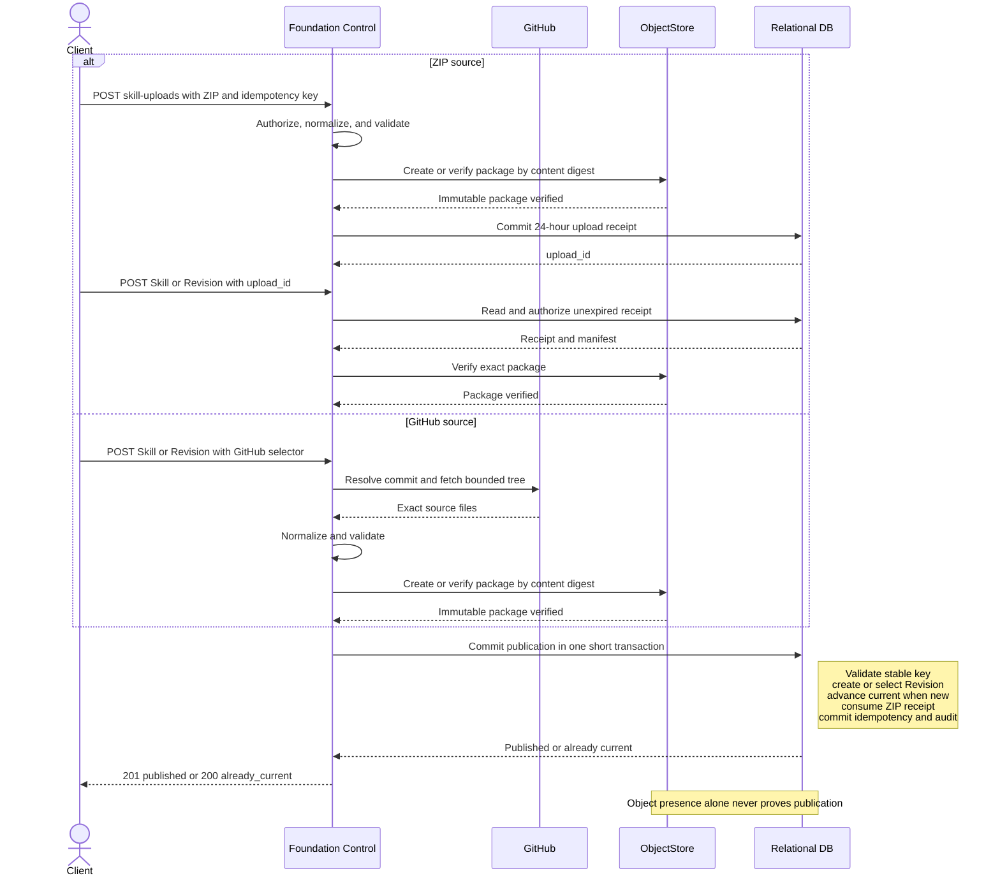

# Foundation Skill Management

## Design Position

Foundation manages a Skill as one stable Workspace-owned identity with an immutable technical `key`, mutable user-visible `name`, one current Revision, and an immutable Revision lineage. The initial package derives the key from the root `SKILL.md` `name`; every later Revision must declare that exact same value. The key is the Harness runtime name and is unique among non-deleted Skills in the Workspace.

A Builder publishes Revision content from a staged ZIP package or an explicit GitHub import. Publishing distinct content appends the next integer `version` and atomically advances `current_revision_id`, which always identifies the highest published version.

An AgentRevision freezes which stable Skill identity each selection means. A selection can pin one integer version or omit it so each newly accepted ordinary Run resolves that Skill's current Revision. Every accepted Run stores exact Revision locks; execution and recovery never follow a mutable head.

Foundation follows the shared [Managed Skill Package Contract](../managed-skill-packages.md) and never executes from an upload, repository, mutable ref, object URL, or Worker cache. A Worker materializes only the exact Skill locks in the Run's `EffectiveAgentConfig`, then uses the public Harness `SkillManager` and `SkillsCapability`. Managed Skills are content resources, not trusted Harness plugins. Foundation validates package `SKILL.md` metadata with its own admission parser; it does not import a Harness parser API.

## Boundaries

| Concern                                                           | Owner                                                                            |
| ----------------------------------------------------------------- | -------------------------------------------------------------------------------- |
| Package shape, metadata projection, normalization, digest, limits | [Managed Skill Package Contract](../managed-skill-packages.md)                   |
| Harness discovery, selection, instructions, and paths             | [Harness Skills](../agent-harness/09-context-and-memory.md#skills-and-discovery) |
| Workspace identity, stable key, Revision, API, and retention      | This document                                                                    |
| Idempotency and unknown mutation outcomes                         | [Durable Operations](06-durable-operations-and-outbox.md)                        |
| GitHub credential value and eligibility                           | [Secret Management](27-secret-management.md)                                     |
| AgentRevision bindings and Run effective configuration            | [Agent Management](28-agent-management.md)                                       |
| Entered Environment and write authority                           | [Environment Management](29-environment-management.md)                           |

Foundation accepts package content through staged ZIP and explicit GitHub import.

## Resource Model

The following schemas are conceptual domain and public read shapes:

```python
class Skill:
    id: SkillId
    organization_id: OrganizationId
    workspace_id: WorkspaceId
    key: str
    name: str
    version: int
    current_revision_id: SkillRevisionId
    created_at: datetime
    created_by: PrincipalRef
    updated_by: PrincipalRef
    updated_at: datetime
    deleted_at: datetime | None


class SkillRevision:
    id: SkillRevisionId
    skill_id: SkillId
    workspace_id: WorkspaceId
    version: int
    manifest: SkillPackageManifest
    imported_from: ZipSkillImportProvenance | GitHubSkillImportProvenance
    created_at: datetime
    created_by: PrincipalRef
```

`sk_`, `skr_`, and `sku_` prefix stable Skills, immutable Revisions, and staged ZIP receipts. A `SkillId` is permanent and never reused. A Skill is created atomically with Revision `1`, which is current immediately.

`Skill.key` is derived from Revision `1`'s `manifest.skill_name`; a caller never supplies it. It is immutable for that Skill and must contain 1 through 64 lowercase ASCII letters or digits separated by single hyphens:

```text
[a-z0-9]+(?:-[a-z0-9]+)*
```

Every later Revision must have `manifest.skill_name == Skill.key`; mismatch rejects the complete publication. Because the same value is passed to Harness, the stable key, root `SKILL.md` `name`, and runtime catalog key cannot diverge.

At most one non-deleted Skill can own a key in one Workspace. Tombstoning releases that key, so a later create can establish a new Skill with the same key and a new `skill_id` and v1 lineage. The new identity never inherits or merges the deleted Skill's Revisions, Agent bindings, provenance, or idempotency evidence.

`Skill.name` is mutable human-readable metadata. It need not be unique and does not affect the key, Revision content, current pointer, or integer version. If create omits it, Foundation sets it to the derived key. `manifest.description` remains Revision content and is not copied into mutable Skill-head metadata.

Publishing content whose normalized digest differs from the current Revision appends `version + 1` and advances the head in one transaction. Equality with the current Revision is a semantic no-op even when the ZIP encoding or submitted source differs; the existing Revision retains its original provenance. Content equal to a non-current historical Revision is still a new later Revision when it differs from current. Republishing historical content therefore appends a new later Revision and makes it current.

Foundation stores each normalized package as one immutable ZIP object. For package contract version `1`, its internal object key is derived exactly as follows:

```text
organizations/{organization_id}/workspaces/{workspace_id}/skills/packages/version-1/{content_digest}.zip
```

The ZIP contains only files named by the Revision manifest. ZIP byte encoding is not content identity; every read verifies the expanded files against the manifest. Foundation derives the object key only after an authorized Workspace and Revision lookup. It is not stored in `SkillRevision`, accepted from a caller, exposed by the API, or treated as access authority. `imported_from` records one acquisition only and is never used to locate package content.

## Service Bounds

Foundation enforces the shared package maxima and additionally fixes these public bounds:

| Value                                        |                          Limit |
| -------------------------------------------- | -----------------------------: |
| Staged ZIP lifetime                          |                       24 hours |
| `Idempotency-Key` evidence                   | 24 hours after accepted commit |
| GitHub acquisition deadline                  |                     60 seconds |
| Available Skill selections in one Agent node |                            512 |

Deployments can impose lower quotas on active Skills, Revisions, or concurrent uploads. Reaching a quota rejects the operation and never evicts retained content. `name` is NFC, contains 1 through 256 Unicode scalar values, has no leading or trailing whitespace, and contains no control character.

Foundation retains `Idempotency-Key` evidence for ZIP staging, Skill creation, and Revision publication for 24 hours after the accepted commit. Replay within that horizon returns the original bounded result before current resource state is evaluated. After expiry, Foundation no longer promises replay, and absent evidence does not prove that the earlier request never committed.

## Persistence

The `skills` relation stores stable identity and organization ownership, immutable `key`, mutable `name`, `version`, `current_revision_id`, actors, timestamps, and the tombstone. It enforces exact `(workspace_id, key)` uniqueness only where `deleted_at` is null. The `skill_revisions` relation stores immutable manifest, safe provenance, actor, and creation time with unique `(skill_id, version)`. The Skill head and a newly published Revision advance atomically.

AgentRevision storage contains the ordered `ResolvedSkillBinding` values defined below. Run state contains exact `SkillRevisionLock` values. Package object keys and source credentials stay outside both structures.

## Public Management API

All routes are under `/api/v1`, follow [Platform API Conventions](../api-conventions.md), and are exposed by `control` and `all`, not `worker`.

### Stage a ZIP

```http
POST /api/v1/workspaces/{workspace_id}/skill-uploads
Content-Type: application/zip
Idempotency-Key: opaque-caller-key

GET /api/v1/skill-uploads/{upload_id}
DELETE /api/v1/skill-uploads/{upload_id}
```

The POST body is exactly one ZIP. Foundation streams, hashes, fully normalizes, and validates it under the shared contract with its own package-admission implementation, stores the resulting candidate package, then creates an expiring receipt. It does not accept multipart metadata, base64, or a client-selected storage path.

```python
class SkillUploadReceipt:
    upload_id: SkillUploadId
    workspace_id: WorkspaceId
    archive_sha256: str
    manifest: SkillPackageManifest
    expires_at: datetime
    consumed_by_revision_id: SkillRevisionId | None
```

POST returns `201`; GET returns `200`; deleting an unconsumed receipt returns `204`. The receipt is scoped to the Workspace and uploading Principal, grants no package or Agent authority, and can be consumed once. The same idempotency key and archive bytes return the same receipt; different bytes conflict. Expired candidates are removed without affecting published Revisions.

### Create a Skill or Revision

```python
class ZipUploadSkillSource:
    kind: Literal["zip_upload"]
    upload_id: SkillUploadId


class GitHubRevisionSource:
    kind: Literal["github"]
    repository_url: str
    ref: str | None = None
    subdirectory: str = ""
    expected_commit_sha: str | None = None
    credential_secret_id: SecretId | None = None


SkillRevisionSource = Annotated[
    ZipUploadSkillSource | GitHubRevisionSource,
    Field(discriminator="kind"),
]


class CreateSkillRequest:
    name: str | None = None
    source: SkillRevisionSource


class CreateSkillRevisionRequest:
    expected_version: int
    source: SkillRevisionSource
```

```http
POST /api/v1/workspaces/{workspace_id}/skills
POST /api/v1/skills/{skill_id}/revisions
Content-Type: application/json
Idempotency-Key: opaque-caller-key
```

Create derives the key from the normalized package and atomically returns the Skill and Revision `1` with `201`. Another active Skill with that key returns `409 skill_key_conflict`, including when its content is equal. An exact `Idempotency-Key` replay returns the earlier result.

Revision publication compares `expected_version`. Different current content appends and selects one Revision with `201`; content equal to current returns it with `200` and does not advance the Skill. Both create and publish validate the stable key invariant before commit. Consuming a staged upload verifies its unexpired receipt.

A GitHub source is a one-time acquisition performed during this request. Every create or later publication submits its own repository, ref, and subdirectory; Foundation resolves that selector once to one commit and stores safe provenance.

`credential_secret_id` selects a current authorized Workspace Secret only for this GitHub acquisition. Foundation stores neither the selector nor its value in the Revision, package, provenance, logs, or errors. Re-importing private content requires another explicit request with an eligible Secret.

### Read, Update, References, and Delete

```http
GET /api/v1/workspaces/{workspace_id}/skills?limit=50&cursor=opaque
GET /api/v1/skills/{skill_id}
GET /api/v1/skills/{skill_id}/revisions?limit=50&cursor=opaque
GET /api/v1/skill-revisions/{skill_revision_id}
GET /api/v1/skill-revisions/{skill_revision_id}/content
GET /api/v1/skills/{skill_id}/references?limit=50&cursor=opaque
PATCH /api/v1/skills/{skill_id}
DELETE /api/v1/skills/{skill_id}
```

```python
class UpdateSkillRequest:
    name: str


class SkillAgentReference:
    agent_id: AgentId
    agent_revision_id: AgentRevisionId
    agent_name: str


class SkillPublicationReceipt:
    skill: Skill
    revision: SkillRevision
    outcome: Literal["published", "already_current"]
```

Reads expose safe provenance and manifest metadata, never Secret selectors, object keys, or provider responses. Skill head reads return a strong representation `ETag`. The authorized `/content` route streams a normalized ZIP as `application/zip` with `ETag: W/"sha256:<content_digest>"`; it is not the original upload or a public object-storage URL. Skill collections order by `(name, id)`, Revision collections by `(version desc, id)`, and reference collections by `(agent_name, agent_id)` under the shared cursor contract.

PATCH changes only `name` and requires the current strong `ETag` in `If-Match`. It does not append a Revision or advance `Skill.version`; `key` is never patchable.

The references route returns exactly the unarchived Agents whose current AgentRevision contains a binding to this `skill_id`. Pinned and unpinned bindings both count. It excludes archived Agents, historical non-current AgentRevisions, and accepted Runs. DELETE uses the same query and returns `409 skill_in_use` when any item exists. The reference list is an observation, not a precondition token; DELETE always reevaluates the set in its own transaction.

DELETE otherwise requires the current strong `ETag`, tombstones the Skill, and releases its Workspace key. It appends no Revision and advances no version. After commit, the Skill is absent from collections and every ordinary public read for that Skill, its Revisions, and its content returns `404`. An exact mutation replay within its idempotency-evidence horizon remains operation evidence and follows the shared replay contract.

Stable error codes include `skill_not_found`, `skill_key_conflict`, `skill_key_mismatch`, `skill_in_use`, `skill_version_conflict`, `skill_upload_not_found`, `skill_upload_expired`, `skill_upload_consumed`, `skill_package_invalid`, `skill_package_limit`, `github_source_invalid`, `github_commit_mismatch`, `github_auth_failed`, `github_rate_limited`, and `github_unavailable`. Invalid inputs use `400`; absent or concealed resources use `404`; key, lifecycle, version, upload, and idempotency conflicts use `409`; GitHub rate limiting uses `429`; retryable dependencies use `503`. Errors never include package bodies, credentials, object keys, or private paths.

## Deletion, Retention, and Concurrency

Skill lifecycle has two states: active and deleted. Deletion is terminal; availability while active is determined by authorization and package validity.

Deletion prevents every later Run acceptance that would use the deleted `skill_id`, whether the binding is pinned or unpinned. An AgentRevision frozen to that identity never switches to a newly created Skill with the same key. A fresh Run override resolves its `skill_key` among currently active Skills and can therefore select a later Skill identity; adopting that identity in the Agent's base Skill configuration requires a new AgentRevision.

A Run already durably accepted before deletion continues with its exact internal `SkillRevisionLock`. Worker replacement and recovery of that same Run retain internal read authority. A Retry, waiting Continue, or any other successor is a new Run: it preserves the source selection where its operation requires that, but acceptance fails if the referenced Skill has since been deleted.

Deletion and Run acceptance lock the applicable Skill row and linearize at commit:

- when Run acceptance commits first, the Run retains its exact locks and deletion can proceed subject to the blocking-reference check;
- when deletion commits first, Run acceptance fails.

AgentRevision publication, Agent unarchive, and Skill deletion likewise linearize against the Skill row. When an operation that makes a Skill binding current on an unarchived Agent commits first, deletion sees the blocking reference. When deletion commits first, publication or unarchive fails validation. A disabled but unarchived Agent still blocks deletion.

Unpinned current resolution and Revision publication use the same boundary:

- when Run acceptance locks and resolves first, it records the old current Revision;
- when publication advances the head first, acceptance records the new current Revision.

Once Run acceptance commits, its exact locks never change.

Tombstone rows, immutable Revision metadata, and package objects are retained internally without a purge deadline to preserve identity, accepted-Run reconstruction, and audit integrity.

## Authorization and Audit

The domain contributes `skill.read`, `skill.create`, `skill.revision.publish`, `skill.update`, `skill.delete`, and `skill.bind`. Viewer can read safe metadata and content. Builder and Admin can manage and bind Skills. Direct Agent Builder can bind an otherwise readable Skill while authoring that Agent but cannot manage the Workspace resource without a Workspace role.

Every request reauthorizes its Workspace and resource. AgentRevision creation reauthorizes `skill.bind` for every selected active Skill. Run acceptance reauthorizes every final selection. Workers read exact packages only under internal authority of an already accepted Run; invoking an Agent does not grant the caller package-download permission.

Skill creation, Revision publication, metadata update, deletion, and denied management attempts emit bounded [IAM security audit events](33-identity-and-access-management.md#security_audit_events). Common event fields record the actor, Workspace, action, primary Skill resource when known, and success-or-failure outcome. Stable actions are `skill.create`, `skill.revision.publish`, `skill.update`, and `skill.delete`; denied attempts use the same action with failure outcome. Action-owned `details` use this allowlist:

- successful Skill creation records `selected_revision_id` and `source_kind`;
- successful Revision publication records `previous_revision_id`, `selected_revision_id`, `source_kind`, and `publication_outcome`, whose value is `published` or `already_current`;
- successful metadata update records only `changed_fields`; it never records the old or new `name`;
- rejected deletion due to references records only bounded `blocking_agent_count`.

`source_kind` is `zip_upload` or `github`. The audit event never copies a GitHub repository, requested ref, resolved commit, subdirectory, archive digest, package content digest, manifest or file metadata, object key, or package bytes. Security audit is operation evidence, not Skill value history.

## Publication



The ZIP upload operation ends when its receipt commits; the later Skill request is the publication operation. An unconsumed receipt expires after 24 hours, and only a package object with no published reference can then be reclaimed. GitHub acquisition joins the same flow after source resolution and normalization.

The [control upload and orphan collector](07-control-background-tasks.md#objects-and-upload-evidence) periodically removes eligible expired receipts and unowned package objects. It checks other live candidates and retained Revision or Run references to the same package and excludes concurrent publication before object deletion.

Source acquisition, validation, and object storage occur without a database session. Foundation publishes or verifies the immutable package object before the final short transaction. A failed or unknown commit creates no authoritative Revision and is reconciled by the same idempotency key.

## Agent Selection and Run Locking

Public Agent authoring and Run overrides use the same selection shape:

```python
class SkillSelection:
    skill_key: str
    version: int | None = None


class ResolvedSkillBinding:
    skill_id: SkillId
    skill_key: str
    version: int | None


class SkillRevisionLock:
    skill_id: SkillId
    skill_revision_id: SkillRevisionId
    skill_key: str
    version: int
    content_digest: str
```

`SkillSelection.version` is the positive integer Skill version, not a Revision ID. When present, it selects that historical version within the active Skill. When absent or null, Run acceptance resolves the bound Skill's current Revision. The AgentRevision retains that policy, and the Worker receives only the Run's exact lock.

AgentRevision creation resolves each `skill_key` to one active Skill, verifies an explicit version when present, and freezes the resulting `ResolvedSkillBinding`. The internal `skill_id` prevents later key reuse from retargeting that Revision. Its content digest covers the ordered selection policy, not the eventual exact content of an unpinned Skill.

An Agent selection list cannot contain the same `skill_key` or resolved `skill_id` more than once. One Agent or Run cannot expose several versions of the same Skill simultaneously. The selected list is the Agent's base Skill configuration.

For an ordinary Run without a Skill override, acceptance resolves each frozen AgentRevision binding by `skill_id`: a pinned binding selects its exact version and an unpinned binding selects that Skill's current Revision. This rule applies to every newly accepted ordinary Run, including a later turn in the same Thread. The same AgentRevision can therefore produce different exact locks across Runs when an unpinned Skill advances.

A present `AgentRunOverride.skills` whole-replaces the Agent list using fresh active-key resolution; `[]` selects no Skills and omission inherits the AgentRevision bindings. Waiting feedback, waiting Continue, and Retry accept no new override and preserve the source Run's exact locks, subject to current lifecycle authorization for accepting a new Run.

When the common `RunCapabilityOverlay` includes a Skill, its tagged Skill variant uses this same `SkillSelection` and active-key resolution. The final post-overlay list still obeys the one-version-per-Skill constraint.

Run acceptance stores the final exact ordered `SkillRevisionLock` tuple in `EffectiveAgentConfig.skills`. All five fields participate in its canonical content digest. Invalid, inaccessible, deleted, oversized, duplicate, or multi-version selections fail before Run creation with `skill_selection_invalid`. The effective list is Foundation Host configuration, not Harness portable Capability state.

## Worker Materialization and Harness Use

Before Harness entry, the current `RunAttemptExecutor` verifies the exact locks in `EffectiveAgentConfig.skills`, then reads and verifies their package content. It constructs an explicit `SkillManager` with the exact Host materializer and supplies `SkillSelectionRunCapability` with every `skill_key`. After Harness enters the fresh primary Environment, but before model or tool work, `SkillsCapability`:

1. invokes the materializer to write those files through the current version-pinned `FileOperator` into a Host-reserved content-addressed root;
2. verifies the complete root and writes a Host completion manifest last;
3. scans only the verified package roots with the explicit `SkillManager`; and
4. applies the already supplied exact-key selection before publishing model instructions or Skill paths.

The completion manifest is Host-owned materialization metadata, not a package file. It remains outside every directory scanned as a Skill package and is excluded from normalized payloads, Revision manifests, content digests, and model-visible Skill resources.

An existing root is reused only after complete verification. An interrupted root has no valid completion manifest; a later Attempt verifies a complete root or materializes the exact bytes again. Harness never scans partial content or falls back to a Project, home, package, or Worker-cache directory.

Materialization outcomes are:

| Outcome                             | Semantics                                                                                                                           |
| ----------------------------------- | ----------------------------------------------------------------------------------------------------------------------------------- |
| `skill_materialization_invalid`     | A locked Revision, object, digest, or package contract is invalid; fail closed                                                      |
| `skill_materialization_unavailable` | Object storage or Environment access is temporarily unavailable; retry only through a new fenced RunAttempt under ordinary ceilings |
| `skill_materialization_stale`       | The Environment mount incarnation, Provider generation, or RunAttempt fence changed; abandon the Attempt and reacquire authority    |
| `skill_materialization_cancelled`   | Cancellation or shutdown won; preserve the ordinary cancelled or interrupted lifecycle                                              |

Materialization is content-addressed Host preparation, not an Agent tool call or Environment attachment record. A replacement Attempt for the same accepted Run uses the same locks even when the Skill is later deleted. No failure above publishes partial Skill instructions, paths, model requests, or Agent tool calls.

## Compatibility

Stable Skill and Revision identity, active-key uniqueness and reuse, the relation between `key` and root `SKILL.md` `name`, source union, immutable-current lineage, Agent selection policy, exact Run lock fields, whole-list override semantics, deletion boundary, completion-manifest boundary, and internal package-key derivation are compatibility facts. Object-storage and GitHub acquisition implementations remain private.

## Invariants

1. A Skill has one permanent opaque ID and one immutable key derived from Revision `1`; every Revision's root `SKILL.md` declares that key.
2. A Workspace has at most one non-deleted Skill per key; deletion releases the key but never reuses or retargets the old Skill identity.
3. Publishing distinct current content appends and selects the next immutable Revision, so current always identifies the highest published version.
4. AgentRevisions freeze stable Skill identities and pinned-or-current selection policy; accepted Runs freeze exact Revision locks.
5. An Agent or Run selects at most one version of a Skill.
6. Deleted Skills are publicly unreadable and block every new Run, while already accepted Runs retain exact internal reconstruction authority.
7. Uploads, GitHub refs, object URLs, caches, and package content grant no runtime authority by themselves.
8. No database transaction spans source acquisition, object storage, Environment I/O, or Harness work.
9. Harness scanning begins only after the complete materialized root verifies.
