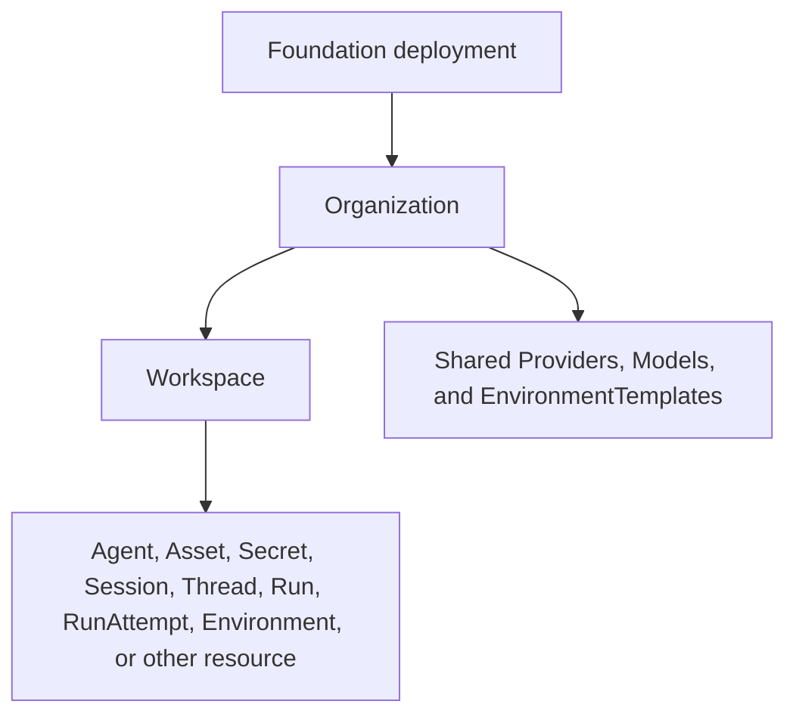

# Identity and Access Management

## Design Position

Foundation Service owns one Identity and Access Management (IAM) contract for Organization isolation and Workspace ownership, human and service identities, authentication credentials, built-in roles, RoleBindings, and security audit. The [OSS distribution](02-distribution-composition-and-extensions.md#oss-composition) presents one Organization while retaining real Organization identifiers and organization constraints in the common data model. Deployment topology, process role, license, and edition are not IAM resources or authorization shortcuts.

IAM authorizes a caller to inspect, change, invoke, or administer Foundation resources. Harness run authority separately constrains what an executing Agent may do through tools, Secrets, and Environments. Allowing a User or Service Account to invoke an Agent does not grant the resulting model arbitrary side effects.

## Boundaries

| Concern                                                         | Owner                                                                  | Relationship                                                                     |
| --------------------------------------------------------------- | ---------------------------------------------------------------------- | -------------------------------------------------------------------------------- |
| Organization, Workspace, User, and Service Account identity     | This document                                                          | Defines durable identity, ownership, and lifecycle                               |
| Password, browser session, invitation, reset token, and API key | This document                                                          | Defines authentication and credential lifecycle                                  |
| RoleBinding, built-in roles, and product authorization          | This document                                                          | Defines the only durable product grant model                                     |
| Managed Secret value protection                                 | [Secret Management](27-secret-management.md)                           | Uses IAM scope and authorization without treating a Secret as a login credential |
| Agent, AgentRevision, Asset, Run, and RunAttempt identity       | Their owning Foundation documents                                      | Remain authorization targets and audit subjects, not IAM Principals              |
| Model-triggered tool and Environment authority                  | Harness run grants and providers                                       | Narrows an authorized invocation independently from product RBAC                 |
| OSS, EE, and Cloud capability composition                       | [Distribution boundary](02-distribution-composition-and-extensions.md) | Adds capabilities without edition fields or bypassing common IAM checks          |
| Native, Hosted AG-UI, and A2A authentication                    | [Protocol Gateway](15-protocol-gateway.md)                             | Maps protocol credentials to this document's Principals and authorizer           |

The canonical resource hierarchy is:



An Organization is the customer isolation boundary. A Workspace is the collaboration, role-assignment, resource-isolation, and default usage-attribution boundary. Project is not a product concept. Deployment is an operational topology and trust boundary, not a customer resource, Principal, membership, or RoleBinding scope.

Organization is the canonical name for Foundation customer isolation in domain identifiers, persistence, and storage keys. Upstream protocol fields and provider-specific configuration retain their original names, including `tenant` where defined by that external contract. Host-defined claims and generic multi-tenant concepts in the embeddable Harness, Environment Provider, and EIP contracts do not imply a Foundation Organization model.

## Organization-owned configuration

ModelProvider, Model, ConnectorProvider, EnvironmentProvider, and EnvironmentTemplate have one immutable Organization owner and an optional immutable Workspace owner. A null `workspace_id` denotes Organization ownership. Organization-owned configuration is automatically available from every Workspace in that Organization; there is no sharing grant, allowlist, activation binding, or local copy. A Workspace-owned resource is available only in its own Workspace. Cross-Organization references and sibling-Workspace references are rejected.

Organization Admin manages Organization-owned configuration. Workspace roles retain their domain-specific read, use, authoring, and management permissions for local resources. Those roles can read and use Organization configuration through the consuming Workspace but cannot mutate it. Organization membership alone does not grant a Workspace role. A Workspace API key remains bounded to its Workspace: it can consume parent configuration there but cannot manage Organization configuration. Organization management requires an Organization-bounded human session and current Organization Admin authority; this does not introduce Organization API keys or Organization Service Accounts.

Workspace Models, Templates, and ConnectorConnections may reference an eligible Provider in the same Workspace or the parent Organization. Organization Models and Templates may reference only Organization Providers. Provider sharing permits the existing domain operations, including creation of Workspace configurations that reference it; it does not grant credential plaintext access. Model naming follows the stronger [visible-key uniqueness contract](30-model-management.md#model).

ConnectorConnections, actual Environments, Threads, Runs, and usage attribution remain Workspace-owned. A shared Template allocates a new Environment in the consuming Workspace, retaining its exact Organization TemplateRevision and Provider references. Sharing a ConnectorProvider does not share authorized ConnectorConnections or their external account identity. Runtime admission and later outbound operations retain current eligibility and credential checks under their owning contracts.

Organization collections enumerate Organization-owned resources. Workspace collections for these five configuration resources enumerate local and parent resources together, expose their actual ownership, and never select a same-name override. Creation paths determine ownership; mutation must address the owning scope. Cursors bind the selected organization scope and filters. Resource-owned credential protection binds actual ownership independently from the consuming Workspace.

## Distribution Capability Boundary

The common relational model permits several Organizations so EE and Cloud can use the same durable contracts. The OSS application presents exactly one Organization:

- startup creates the Organization when none exists;
- Organization creation, deletion, transfer, switching, and joining are absent from the OSS API and UI;
- startup fails explicitly if the OSS database contains more than one Organization;
- every Organization creation atomically creates one mutable Workspace named `default`;
- an Organization Admin may create and delete additional Workspaces.

OSS supplies local email-and-password authentication, invitations, browser sessions, Workspace-bound User and Service Account API keys, built-in roles, and direct User or Service Account RoleBindings. It does not supply SSO, OIDC, external identity records, Groups, custom roles, Organization-bound API keys, product quotas, billing, or platform-operator elevation.

Native, Hosted AG-UI, and A2A use these same credential and Principal kinds. Hosted AG-UI can use the current browser session or bearer API key. A2A runtime security schemes resolve to a User or Service Account through the existing credential boundary. Foundation defines no AG-UI or A2A Principal, role, API key, or implicit Agent identity. Public A2A Agent Card reads are the deliberate anonymous discovery exception and return only the safe projection owned by the [A2A contract](23-a2a.md#agent-card-projection).

EE and Cloud distributions add capabilities through the explicit composition contract while preserving the identifiers, Organization and Workspace scope fields, Principal meaning, credential boundary, and authorizer contract defined here. Core rows contain no `edition`, `plan`, `license`, or deployment-placement field.

## Organization and Identity Model

Every Foundation-owned ID follows [Platform Data Conventions](../data-conventions.md). IDs are globally unique, immutable, and encode no organization, parent, authorization, region, or deployment information. Names are mutable labels and never replace IDs in a durable reference or policy decision.

Every resource row scoped to an Organization stores `organization_id`. Every ordinary Workspace-owned row also stores `workspace_id`, and a database constraint or composite foreign key proves that the Workspace belongs to the same Organization. The API-key table is the deliberate exception: it stores `organization_id`, `boundary_type`, and `boundary_id` so a later boundary kind does not require a schema rewrite. The service derives Organization and Workspace scope fields from the selected parent and stored resource; it ignores or rejects client-supplied duplicates. Organization ownership is immutable for an existing resource.

The Workspace table exposes a unique `(id, organization_id)` key for composite references. Organization-scoped repository operations receive an explicit Organization and optional Workspace scope and include those predicates in the authoritative query. A later authorization check does not justify an unscoped organization read.

Foundation recognizes exactly these OSS Principal kinds:

- `user` is one platform-wide human identity;
- `service_account` is one non-human identity owned by a Workspace.

A Principal receives authority only through current RoleBindings. A credential authenticates one Principal and can narrow its usable boundary; it never owns a role or expands that Principal's authority. Agent, AgentRevision, Session, Thread, Run, RunAttempt, credential, and Secret identities are not Principals. Product authorization targets the stable Agent ID, while an accepted Run selects the exact immutable AgentRevision separately.

The conceptual references are:

```python
PrincipalType = Literal["user", "service_account"]


class PrincipalRef:
    principal_type: PrincipalType
    principal_id: str


class ResourceRef:
    resource_type: str
    resource_id: str
    organization_id: str
    workspace_id: str | None
```

These schemas are conceptual domain values, not wire or ORM models.

## Core Relational Contract

The tables below define durable meaning and constraints. Physical column types, index names, ORM classes, and migration mechanics remain implementation details. All timestamps are UTC instants. Mutable resources use a positive `version` for stale-write protection where exposed through the management API.

### `organizations`

| Column       | Durable meaning and constraint                      |
| ------------ | --------------------------------------------------- |
| `id`         | Primary key; immutable Organization ID              |
| `name`       | Mutable non-blank display name; not platform-unique |
| `version`    | Positive mutable-resource version                   |
| `created_at` | Immutable creation time                             |
| `updated_at` | Latest accepted metadata mutation time              |

The OSS capability never deletes an Organization. The schema does not encode the OSS singleton as a fixed identifier or a global constant.

### `workspaces`

| Column            | Durable meaning and constraint                    |
| ----------------- | ------------------------------------------------- |
| `id`              | Primary key; immutable Workspace ID               |
| `organization_id` | Immutable foreign key to `organizations.id`       |
| `name`            | Mutable non-blank display name                    |
| `normalized_name` | Service-derived case-insensitive uniqueness value |
| `version`         | Positive mutable-resource version                 |
| `created_at`      | Immutable creation time                           |
| `updated_at`      | Latest accepted metadata mutation time            |
| `deleted_at`      | Terminal logical-deletion time; null while active |

Active Workspaces are unique by `(organization_id, normalized_name)`. Logical deletion immediately denies new access and work, revokes bounded credentials, removes live descendant RoleBindings, revokes Service Account and Personal API Keys in the boundary, and starts separately managed physical cleanup. IDs are never reused. Deleted names may be reused by a new Workspace with a new ID.

[Control Background Tasks](07-control-background-tasks.md#task-catalogue) owns periodic recovery of that cleanup under each descendant's deletion and retention rules. Physical cleanup progress does not restore eligibility or shorten independent security-audit retention.

### `users`

| Column              | Durable meaning and constraint                                         |
| ------------------- | ---------------------------------------------------------------------- |
| `id`                | Primary key; immutable platform User ID                                |
| `email`             | Current verified or claimed display form of the required email address |
| `normalized_email`  | Service-derived globally unique email lookup value                     |
| `name`              | Mutable display name; defaults to the email local part                 |
| `status`            | `active` or `disabled`                                                 |
| `email_verified_at` | Time control of the current email was verified; null when unverified   |
| `version`           | Positive mutable-resource version                                      |
| `created_at`        | Immutable creation time                                                |
| `updated_at`        | Latest accepted profile or status mutation time                        |

`id`, not email, is the identity used by RoleBindings, credentials, audit, and ownership. Changing email requires proof of control of the new address and atomically reserves its normalized uniqueness. An unverified email cannot drive password reset or automatic linking by an external identity extension.

An Organization Admin manages Organization RoleBindings, not the platform User record. It cannot change another User's profile, password, email, or status. A User may disable itself; deployment break-glass administration may disable or re-enable a User. Disabling revokes active browser sessions and causes all User API key authentication to fail while preserving unrevoked key records and RoleBindings. Re-enabling does not restore revoked sessions but makes otherwise valid, unrevoked keys usable again. OSS exposes no platform User deletion.

### `password_credentials`

| Column                | Durable meaning and constraint                                         |
| --------------------- | ---------------------------------------------------------------------- |
| `user_id`             | Primary key and foreign key to `users.id`; one local password per User |
| `password_hash`       | Encoded Argon2id verifier; never plaintext or reversible material      |
| `password_changed_at` | Time the current verifier became authoritative                         |
| `created_at`          | Initial password creation time                                         |

A User supplied only by an external identity extension can omit this row. OSS Users obtain it when accepting their initial invitation. Foundation does not use a generic credential supertable for passwords, API keys, and browser sessions.

Passwords contain 15 through 128 printable ASCII non-space characters (`0x21` through `0x7e`). Foundation requires no mandatory uppercase, lowercase, digit, or symbol mixture. It accepts no space, Unicode, tab, newline, or control character. OSS applies no password blocklist, login rate limit, account lockout, or periodic password expiration. Authentication failures use one generic public error and emit bounded audit evidence.

Changing a password with the current password preserves the current browser session and revokes the User's other sessions. Completing a forgot-password reset revokes all browser sessions. Neither operation revokes Personal API Keys.

### `auth_sessions`

| Column       | Durable meaning and constraint                                          |
| ------------ | ----------------------------------------------------------------------- |
| `id`         | Primary key; immutable browser-session ID                               |
| `user_id`    | Foreign key to the authenticated User                                   |
| `token_hash` | Unique non-reversible verifier for the opaque cookie token              |
| `created_at` | Authentication time                                                     |
| `expires_at` | Fixed deployment-configurable expiry; default seven days after creation |
| `revoked_at` | Explicit revocation time; null while unrevoked                          |

The plaintext token appears only in an `HttpOnly`, `Secure` cookie. Sessions do not use a long-lived self-contained JWT, sliding renewal, a remember-me mode, or a durable current-Workspace field. Browser closure does not itself revoke a session. Every request rechecks User status, session validity, selected resource scope, and current RoleBindings.

### `invitations` and `invitation_grants`

| `invitations` column  | Durable meaning and constraint                                           |
| --------------------- | ------------------------------------------------------------------------ |
| `id`                  | Primary key; immutable invitation ID                                     |
| `organization_id`     | Organization the recipient is invited to join                            |
| `email`               | Recipient display email                                                  |
| `normalized_email`    | Recipient lookup and conflict value                                      |
| `token_hash`          | Verifier for the current single-use invitation token                     |
| `verification_mode`   | `email` when acceptance verifies email control; `out_of_band` otherwise  |
| `expires_at`          | Deployment-configurable expiry; default seven days after issue or resend |
| `accepted_at`         | Successful acceptance time; null before acceptance                       |
| `accepted_by_user_id` | Existing or newly created User; null before acceptance                   |
| `revoked_at`          | Revocation time; null while unrevoked                                    |
| `created_by_user_id`  | Inviting User; null only for deployment bootstrap                        |
| `created_at`          | Initial creation time                                                    |
| `updated_at`          | Latest token rotation or terminal transition time                        |

| `invitation_grants` column | Durable meaning and constraint                                         |
| -------------------------- | ---------------------------------------------------------------------- |
| `invitation_id`            | Foreign key to the owning invitation                                   |
| `organization_id`          | Same Organization as the invitation                                    |
| `workspace_id`             | Target Workspace for a Workspace grant; null for an Organization grant |
| `resource_type`            | `organization` or `workspace`                                          |
| `resource_id`              | Exact target resource ID                                               |
| `role_key`                 | Valid built-in role for the target resource                            |

One grant exists per `(invitation_id, resource_type, resource_id)`. The stored Organization and Workspace scope fields must match both the Invitation and target resource.

An invitation is pending exactly when it is unaccepted, unrevoked, and unexpired. Resend keeps the invitation ID, rotates `token_hash`, and invalidates the old link. Pending invitations create neither a User nor a RoleBinding.

Acceptance locks the invitation and atomically creates or links the User, creates `password_credentials` when local setup is required, creates the Organization Member or Admin RoleBinding, creates the authorized Workspace RoleBindings, and sets `accepted_at`. A Workspace Admin can invite only to its own Workspace; acceptance also creates an Organization Member binding when needed. An Organization Admin can invite to the Organization and several Workspaces. Adding an existing Organization member to a Workspace creates the RoleBinding directly and may send a notification without creating an Invitation.

### `password_reset_tokens` and `email_change_tokens`

| Column        | Durable meaning and constraint                    |
| ------------- | ------------------------------------------------- |
| `id`          | Primary key; immutable single-use token record ID |
| `user_id`     | Target User                                       |
| `token_hash`  | Unique non-reversible token verifier              |
| `expires_at`  | Bounded expiry time                               |
| `consumed_at` | Successful use time; null before use              |
| `created_at`  | Issue time                                        |

An `email_change_tokens` row additionally stores `new_email` and `new_normalized_email` and reserves their uniqueness at completion. SMTP delivery is required for self-service password reset and email change. Without SMTP, deployment break-glass administration can issue a one-time password-reset link; an Organization or Workspace Admin cannot set or reset another User's password.

### `service_accounts`

| Column            | Durable meaning and constraint                    |
| ----------------- | ------------------------------------------------- |
| `id`              | Primary key; immutable Service Account ID         |
| `organization_id` | Immutable owning Organization                     |
| `workspace_id`    | Immutable owning Workspace                        |
| `name`            | Mutable non-blank display name                    |
| `normalized_name` | Service-derived case-insensitive uniqueness value |
| `description`     | Optional bounded description                      |
| `status`          | `active` or `disabled`                            |
| `version`         | Positive mutable-resource version                 |
| `created_at`      | Immutable creation time                           |
| `updated_at`      | Latest accepted mutation time                     |
| `deleted_at`      | Terminal logical-deletion time; null while active |

Active Service Accounts are unique by `(workspace_id, normalized_name)`. A Service Account has no email, password, username, or Organization RoleBinding. It receives exactly one direct Workspace role of Viewer, Runner, or Builder. Workspace Admin and inherited Organization Admin authority create, update, disable, re-enable, delete, and manage its API keys. Builder cannot manage Service Accounts. Disablement temporarily blocks all keys; re-enablement restores otherwise valid keys. Deletion is terminal, revokes all keys, and retains the tombstone and audit history. A deleted name may be reused under a new ID.

### `role_bindings`

| Column               | Durable meaning and constraint                               |
| -------------------- | ------------------------------------------------------------ |
| `id`                 | Primary key; immutable RoleBinding ID                        |
| `organization_id`    | Organization owning both Principal relationship and resource |
| `workspace_id`       | Target Workspace; null only for an Organization binding      |
| `principal_type`     | `user` or `service_account`                                  |
| `principal_id`       | Exact User or Service Account ID                             |
| `resource_type`      | `organization`, `workspace`, or `agent`                      |
| `resource_id`        | Exact authorization target ID                                |
| `role_key`           | Valid built-in role for this target and Principal kind       |
| `created_by_user_id` | User whose authority created the binding                     |
| `created_at`         | Immutable creation time                                      |
| `updated_at`         | Latest role replacement time                                 |

One direct binding exists per `(principal_type, principal_id, resource_type, resource_id)`. A role change updates `role_key`; removal deletes the row. RoleBinding has no status. There is no OrganizationMembership or WorkspaceMembership table; member views are authorized projections of current RoleBindings. Durable security audit retains history independently from the live grant.

The relational model uses polymorphic Principal and resource references without a universal Principal or Resource registry table. The service validates existence, kind, organization, lifecycle, and allowed role before insert. Resource deletion removes descendant bindings. A missing or mismatched reference never grants authority.

The finite `(principal_type, resource_type, role_key)` compatibility set is also a portable relational `CHECK` constraint rather than application validation alone:

| Principal type    | Resource type  | Allowed role keys                      |
| ----------------- | -------------- | -------------------------------------- |
| `user`            | `organization` | `member`, `admin`                      |
| `user`            | `workspace`    | `viewer`, `runner`, `builder`, `admin` |
| `user`            | `agent`        | `viewer`, `runner`, `builder`          |
| `service_account` | `workspace`    | `viewer`, `runner`, `builder`          |
| `service_account` | `agent`        | `viewer`, `runner`, `builder`          |

Every other combination is invalid, including every Service Account `admin` binding and every Service Account Organization binding. The database constraint prevents direct writes and application defects from persisting such a row. Organization ancestry, Principal existence, Service Account owning-Workspace equality, User Organization membership, and resource lifecycle still require transactional domain validation because they depend on other rows.

The service enforces these organization constraints:

- Organization bindings target a User, have `workspace_id = null`, and use `admin` or `member`;
- Workspace bindings target a User or same-Workspace Service Account and carry that Workspace ID;
- Agent bindings carry the owning Agent's Workspace ID;
- a User must have an Organization binding before receiving a descendant Workspace or Agent binding;
- a Service Account can bind only within its owning Workspace and can never use an Admin role;
- inherited Organization Admin authority creates no redundant Workspace rows.

Role loading validates every persisted binding against the same finite compatibility set before mapping it to actions. An impossible historical or corrupted row fails the authorization decision closed and emits bounded security evidence; the authorizer never treats an unknown combination as a broader known role. A schema transition that introduces this constraint cannot silently coerce, ignore, or preserve an invalid grant as effective authority.

### `api_keys`

| Column            | Durable meaning and constraint                                          |
| ----------------- | ----------------------------------------------------------------------- |
| `id`              | Stable public key identifier retained across rotation                   |
| `principal_type`  | `user` or `service_account`                                             |
| `principal_id`    | Owning Principal                                                        |
| `organization_id` | Organization containing the credential boundary                         |
| `boundary_type`   | `workspace` in OSS; extension enum owned by IAM                         |
| `boundary_id`     | Exact Workspace ID for an OSS key                                       |
| `name`            | Mutable non-blank display label                                         |
| `secret_hash`     | Non-reversible verifier for the current high-entropy secret             |
| `expires_at`      | Optional expiry; OSS creation defaults to 90 days and permits no expiry |
| `rotated_at`      | Latest successful rotation time; null before first rotation             |
| `revoked_at`      | Permanent revocation time; null while unrevoked                         |
| `created_at`      | Immutable creation time                                                 |
| `updated_at`      | Latest name, rotation, or revocation mutation time                      |

Credential boundary is represented by `boundary_type + boundary_id`; the row does not duplicate a `workspace_id`. For a Workspace key, Foundation validates that `boundary_id` belongs to `organization_id`. OSS accepts only `workspace`.

A Personal API Key belongs to a User. Only that User can create or rotate it. A Workspace Admin can inspect safe metadata and revoke it but cannot create it for the User or observe its secret. A Service Account API Key is created, rotated, and revoked only by Workspace Admin or inherited Organization Admin authority. Several active keys per Principal and boundary are allowed for zero-downtime caller migration.

Creation returns a bearer value once. Its shape contains a stable public key ID and an independent high-entropy secret, for example `afk_key-7m4q9x2c.<high-entropy-secret>`. Storage retains only the public ID and secret verifier. Authentication accepts it only as `Authorization: Bearer <value>`; query, cookie, body, and alternate API-key headers are rejected.

Rotation atomically replaces `secret_hash`, retains the same key ID, name, owner, and boundary, sets `rotated_at`, and immediately invalidates the old secret. It does not create a grace period or another key ID. A caller needing overlap creates a second key and later revokes the first. Revoked or expired keys remain tombstones and are never hard-deleted through the API.

API key state is derived rather than stored: an unrevoked key before its optional expiry is `active`; a past expiry is `expired`; and any `revoked_at` is `revoked`. Revocation is terminal even when expiry would also apply.

Removing a User's access to a key boundary permanently revokes that boundary's Personal API Keys. Removing a Service Account's Workspace binding or deleting the Service Account revokes all of its keys. Role changes do not rotate or revoke a key; the next request observes the new effective permissions.

An OSS API Key carries no per-key capability or permission toggles. It authenticates its existing User or Service Account Principal and narrows only to its credential boundary; every management or direct Agent invocation authorizes the current RoleBindings and target resource again. Agent-facing in-process a13n MCP handlers bind the current RunAttempt authority and reauthorize each external action; they require neither a product API key nor a separate internal MCP credential.

### `security_audit_events`

| Column            | Durable meaning and constraint                                                           |
| ----------------- | ---------------------------------------------------------------------------------------- |
| `id`              | Primary key; immutable event ID                                                          |
| `organization_id` | Organization for Organization or Workspace activity; null for platform identity activity |
| `workspace_id`    | Workspace for Workspace activity; otherwise null                                         |
| `actor_type`      | `anonymous`, `user`, `service_account`, or `system`                                      |
| `actor_id`        | Actor identity when known; otherwise null                                                |
| `action`          | Stable namespaced security action                                                        |
| `resource_type`   | Affected resource kind when known                                                        |
| `resource_id`     | Affected resource ID when known                                                          |
| `auth_method`     | `password`, `session`, `api_key`, `bootstrap`, or `system`                               |
| `credential_id`   | Safe credential ID when applicable; never secret material                                |
| `outcome`         | `success` or `failure`                                                                   |
| `occurred_at`     | Immutable event time                                                                     |
| `request_id`      | Safe request correlation ID when applicable                                              |
| `details`         | Optional bounded action-specific safe JSON under the rules below                         |

Security audit events are append-only and distinct from Run and RunAttempt lifecycle events, application logs, traces, and UsageRecords. Login, password, email, User status, invitation, RoleBinding, API key, Service Account, Workspace, Secret, Skill, Asset, Model Provider, and Model security mutations and management commands emit events. `details` uses an action-owned allowlist. It can record organization-scoped related resource IDs, stable enum outcomes, and changed field names needed to correlate an operation; those identifiers grant no authority. A Model Provider or Model update can record only changed field names. Events contain no secret material, credential verifier, old or new resource value, endpoint, or raw provider error.

A successful security-sensitive mutation commits its audit event in the same short transaction as the authoritative state change under [Durable Operations and Outbox](06-durable-operations-and-outbox.md#atomic-durable-commit). Authentication failures and denied attempts emit through a separate bounded path because no resource mutation transaction exists; audit unavailability never converts a denial into an allow.

Audit actor, credential, and resource IDs are retained evidence rather than cascading ownership references.

Organization Admin can read its Organization's events. Workspace Admin can read events scoped to its Workspace. Builder, Runner, Viewer, and Service Account cannot read security audit. A User can read its own login, session, and Personal API Key activity.

## Bootstrap and Invitation Flow

The OSS distribution supplies an IAM bootstrap control component under the shared [runtime lifecycle](01-runtime-configuration-and-deployment.md). Deployment configuration contains only the initial Admin email. The component idempotently creates the singleton Organization, its `default` Workspace, and one bootstrap Invitation granting Organization Admin, then generates a single-use initialization link. Concurrent control or all-in-one replicas serialize the same bootstrap facts and cannot create another Organization or invitation identity. Worker-only and Connectivity-only processes never perform IAM bootstrap.

SMTP delivery sends the link to the configured email and marks successful acceptance as email verification; without SMTP, the service emits the link once through the protected startup-log boundary and acceptance does not verify the email.

The initialization endpoint requires the complete token, sets the initial name and password, creates the User and grants atomically, and permanently closes the bootstrap surface. There is no unauthenticated first-visitor claim. Until bootstrap succeeds, ordinary authenticated product routes are unavailable.

The acceptance transaction follows this conceptual application flow:

```python
async def accept_invitation(token: str, profile: NewUserProfile) -> UserRef:
    token_digest = hash_one_time_token(token)
    async with short_transaction() as tx:
        invitation = await tx.lock_valid_invitation(token_digest)
        user = await tx.find_user_by_normalized_email(invitation.normalized_email)
        if user is None:
            user = await tx.create_user(profile, invitation.email)
            await tx.create_password_credential(user.id, profile.password)
        await tx.apply_invitation_grants(invitation, user)
        await tx.mark_invitation_accepted(invitation, user.id)
        await tx.append_security_audit_event("invitation.accept", user.id)
    return UserRef(user.id)
```

The transaction revalidates every grant and the last-Admin invariant. It performs no external I/O while open.

## Built-in Roles and Permissions

Roles are immutable keys mapped centrally to stable resource actions. This document owns the exhaustive OSS action registry and built-in role grants; each owning resource contract owns the operation semantics, target resolution, and additional resource predicates behind its registered actions. Authorization code checks those actions, never numeric role ordering or scattered role-name conditionals. OSS has no persisted permission catalog, custom RoleDefinition table, or custom-role API.

Self-service actions such as editing one's own profile, managing one's own browser sessions and Personal API Keys, or leaving a role scope require exact subject equality and the relevant credential in addition to their registered action; they are not grants over another User through a Workspace role. Invitation acceptance instead authenticates the exact single-use invitation token before a Principal session exists.

### Stable action registry

Every protected public route declares exactly one primary action from this registry when the route is registered. A command that reads or binds other protected resources also declares its additional actions. For example, Run continuation requires `run.continue` on the source Thread or Run plus `agent.invoke` on the selected Agent; binding a Workspace Secret while creating a Agent Revision additionally requires `secrets.bind`. One allow never implies an unlisted cross-resource allow.

Unknown action strings, a protected route without a registered primary action, an action without a built-in or exact-subject mapping, and an unsupported resource/action pair fail closed. Distribution assembly validates that every protected Management API, Native stream, native provider ingress, Hosted AG-UI, and A2A operation selects a registered action before the surface becomes ready. Login, bootstrap, password-reset-token use, and invitation-token acceptance authenticate their exact pre-Principal credentials rather than inventing anonymous roles. Worker lifecycle writes and outbound tool dispatch use trusted in-process capabilities and still reauthorize any persisted product Principal required by the owning operation.

The organization, identity, and operator actions are:

| Stable actions                                                               | Target and OSS grant                                                                                                                                                                                              |
| ---------------------------------------------------------------------------- | ----------------------------------------------------------------------------------------------------------------------------------------------------------------------------------------------------------------- |
| `user_profile.read`, `user_profile.update`, `user_credentials.manage`        | Exact authenticated User reads or changes its own profile, email, password, or self-disable state under the operation's proof and last-Admin rules                                                                |
| `auth_session.read`, `auth_session.revoke`                                   | Exact authenticated User lists or revokes only its own browser sessions; logout revokes the current session                                                                                                       |
| `organization.read`, `organization.update`                                   | Organization Member reads safe metadata; Organization Admin additionally updates it                                                                                                                               |
| `workspace.read`, `workspace.create`, `workspace.update`, `workspace.delete` | A Workspace role reads its Workspace; Organization Admin creates and deletes Workspaces; Workspace Admin or inherited Organization Admin updates one                                                              |
| `role_binding.read`, `role_binding.manage`                                   | Exact Principal reads its own bindings and a User can leave an eligible scope; Organization Admin manages Organization grants; Workspace Admin or inherited Organization Admin manages Workspace and Agent grants |
| `invitation.read`, `invitation.manage`                                       | Organization Admin manages Organization invitations; Workspace Admin or inherited Organization Admin manages its Workspace invitations                                                                            |
| `service_account.read`, `service_account.manage`                             | Workspace Admin or inherited Organization Admin manages Service Accounts in that Workspace                                                                                                                        |
| `api_key.read`, `api_key.manage`                                             | Exact Personal API Key owner manages its own key; Workspace Admin has safe metadata and revoke-only authority; Service Account keys are Admin-managed                                                             |
| `security_audit.read`                                                        | Organization Admin reads Organization events; Workspace Admin reads Workspace events; exact User self-service reads only that User's security activity                                                            |
| `plugin.read`, `plugin.manage`, `plugin.runtime.manage`                      | Workspace Viewer can read safe trusted Plugin metadata; effective Organization Admin manages OSS upload/lifecycle and runner-profile activation                                                                   |

The Workspace product actions and built-in role additions are exhaustive below. Each row is cumulative from left to right; Admin receives every Builder action. Scope, ownership, lifecycle, and referenced-resource checks remain mandatory even when the role includes the action.

| Resource family                | Viewer actions                                                                                                          | Runner additions                                                                                                                             | Builder additions                                                                                                                                | Admin-only additions or predicates                                                                                                                                                                 |
| ------------------------------ | ----------------------------------------------------------------------------------------------------------------------- | -------------------------------------------------------------------------------------------------------------------------------------------- | ------------------------------------------------------------------------------------------------------------------------------------------------ | -------------------------------------------------------------------------------------------------------------------------------------------------------------------------------------------------- |
| Agent authoring and invocation | `agent.read`                                                                                                            | `agent.invoke`                                                                                                                               | `agent.create`, `agent.update`, `agent.revision.create`, `agent.current_revision.set`, `agent.lifecycle`, `agent.duplicate`                      | None beyond Builder; built-in Agents remain read-only                                                                                                                                              |
| Secret management              | `secrets.read` for Workspace-owned metadata only                                                                        | None; invocation can use already-bound Secrets only through current Run authority                                                            | `secrets.manage` for Workspace-owned create, replace, and delete plus `secrets.bind` for selecting an existing Secret; neither returns plaintext | User-owned Secrets use exact User authority; resource-owned Application Account, ConnectorProvider, MCPConnection, and push credentials use their owner lifecycle and operation-specific authority |
| Model management               | `models.read`                                                                                                           | None                                                                                                                                         | `models.manage` for create, update, test, enable, and disable                                                                                    | None beyond Builder                                                                                                                                                                                |
| Environment management         | `environment_provider.read`, `environment_template.read`, `environment.read`                                            | `environment_template.use`, `environment.use` for authorized Thread/Run selection and automatic template allocation                          | `environment_provider.manage`, `environment_template.manage`, `environment.manage`                                                               | None beyond Builder; executable Provider code is deployment-selected                                                                                                                               |
| Skill management               | `skill.read`                                                                                                            | None                                                                                                                                         | `skill.create`, `skill.revision.publish`, `skill.update`, `skill.delete`, `skill.bind`                                                           | None beyond Builder                                                                                                                                                                                |
| Asset management               | `asset.read`                                                                                                            | `asset.create`, `asset.use`                                                                                                                  | `asset.delete`                                                                                                                                   | None beyond Builder                                                                                                                                                                                |
| Application Accounts           | `application_account.read` for safe metadata                                                                            | `application_account.use` only through an accepted Run                                                                                       | None                                                                                                                                             | `application_account.manage` for Workspace Admin; credentials remain write-only                                                                                                                    |
| AccountTargets                 | `account_target.read` for safe metadata                                                                                 | None                                                                                                                                         | `account_target.manage` for exact object Agent, narrow override and reception policy                                                             | Current referenced Agent, execution Service Account and capability authorization is mandatory                                                                                                      |
| Connector Providers            | `connector_provider.read` for safe visible metadata, Provider-type definitions, and Provider-scoped Connector discovery | None                                                                                                                                         | None                                                                                                                                             | `connector_provider.manage` for Workspace Admin, including Provider testing; ConnectorProvider credentials remain write-only                                                                       |
| ConnectorConnections           | `connector_connection.read` for safe Workspace metadata                                                                 | None                                                                                                                                         | None                                                                                                                                             | `connector_connection.manage` for Workspace Admin; write-only Provider credentials retain their separate owner                                                                                     |
| MCPConnections                 | `mcp_connection.read` for safe Workspace metadata                                                                       | None                                                                                                                                         | None                                                                                                                                             | `mcp_connection.manage` for Workspace Admin; credentials remain write-only                                                                                                                         |
| Interaction reads              | `session.read`, `thread.read`, `run.read`, `lifecycle_event.read`, `notification.subscribe`, `usage.read`, `trace.read` | None                                                                                                                                         | None                                                                                                                                             | Reads remain limited to currently visible resources; `run.read` also covers Items, RunAttempts, pending projections, steer receipts, lineage, and Run SSE                                          |
| Run control                    | None                                                                                                                    | `run.continue`, `run.fork`, `run.retry`, `run.feedback`, `run.steer`, `run.interrupt`                                                        | None                                                                                                                                             | Operation-specific actor-versus-Run-Principal rules remain mandatory                                                                                                                               |
| Queued submissions             | `queued_submission.read`                                                                                                | `queued_submission.create`, `queued_submission.update`, `queued_submission.delete`, `queued_submission.reorder`, `queued_submission.consume` | None                                                                                                                                             | Update additionally requires exact equality with the queued authority Principal; consumption never impersonates it                                                                                 |
| Hook subscriptions             | `hook_subscription.read`                                                                                                | `hook_subscription.create` only for an exact Run-inline subscription and with separate signing-Secret authority                              | `hook_subscription.create`, `hook_subscription.update`, `hook_subscription.delete`, `hook_subscription.redrive` for managed subscriptions        | Redrive preserves the original subscription Revision and destination                                                                                                                               |
| A2A push configurations        | `a2a_push_configuration.read` for an authorized Task                                                                    | `a2a_push_configuration.manage` for create, update, delete, and redrive on a Task the caller may operate                                     | None                                                                                                                                             | Public Agent Card discovery uses no product action; extended Card reads use `agent.read`                                                                                                           |

The following action strings belong to Harness run grants rather than product RoleBindings: `tool.call`, `connector.use`, and `secret.use`. They never appear in a built-in role permission set. An authorized invocation derives them only by intersecting the exact AgentRevision, accepted capability selections, current `authority_principal`, selected resource eligibility, and provider grants. Product actions such as `environment.use`, `asset.use`, and `skill.bind` authorize caller selection or authoring; they do not themselves reveal a Secret or grant an Agent tool effect.

Adding a protected operation is compatible only when it reuses a registered action with the same meaning or additively registers a new namespaced action and its role mapping. Renaming, repurposing, or broadening an existing action is incompatible while clients, audit events, RoleBindings, or extensions depend on its meaning.

### Organization roles

| Role key | Permissions                                                                                                                                                                                                                                                         |
| -------- | ------------------------------------------------------------------------------------------------------------------------------------------------------------------------------------------------------------------------------------------------------------------- |
| `member` | Read safe Organization metadata and own Organization binding; list only Workspaces the User can access                                                                                                                                                              |
| `admin`  | Member permissions; update Organization settings; manage Organization User RoleBindings and invitations; create and delete Workspaces; inherit Workspace Admin in every active Workspace; manage Organization-owned configuration; read Organization security audit |

An Organization role applies only to a User. The last effective Organization Admin cannot be removed, demoted, disabled by a product operation, or leave. This includes self-disable by the last Admin. Pending invitations and disabled Users do not satisfy this invariant. Deployment break-glass recovery can disable the last Admin only as an explicit operational override and remains responsible for restoring an effective Admin. Organization Member alone grants no Workspace resource access and cannot list the complete Organization user directory.

### Workspace roles

| Role key  | Permissions                                                                                                                                                                                                                                                                                                                                                                                                                                                                                                   |
| --------- | ------------------------------------------------------------------------------------------------------------------------------------------------------------------------------------------------------------------------------------------------------------------------------------------------------------------------------------------------------------------------------------------------------------------------------------------------------------------------------------------------------------- |
| `viewer`  | Read safe Workspace metadata and currently visible Agent, Secret metadata, Model Provider, Model, Environment, Skill, Asset, Application Account, AccountTarget, ConnectorProvider, ConnectorConnection, MCPConnection, Hook, interaction, lifecycle, usage, and trace projections; subscribe only to currently visible Native notifications; never read Secret or Provider credential values                                                                                                                 |
| `runner`  | Viewer permissions; create eligible empty root Threads and invoke every eligible Agent; use authorized Connectivity capabilities only through accepted Runs; submit, continue, fork, retry, finalize feedback, steer, and interrupt eligible Runs; manage queued submissions; create and use Assets; select an eligible Environment or template for Thread/Run execution; create an exact Run-inline Hook only with separate signing-Secret authority                                                         |
| `builder` | Runner permissions; create and update Agents, create and select their Revisions, duplicate them, and change lifecycle and Agent-owned configuration, including protocol metadata, policy, and managed capability selections; create, revise, delete, and bind Workspace Skills; delete Assets; manage Workspace Model Providers and Models, Environment Providers, Templates and lifecycle configuration, AccountTargets, and durable Hook subscriptions; create, replace, delete, and bind Workspace Secrets |
| `admin`   | Builder permissions; update Workspace settings; manage Workspace and Agent User or Service Account RoleBindings and invitations; manage Service Accounts and their keys; manage Application Accounts, Connector Providers, and Workspace ConnectorConnections and MCPConnections; inspect and revoke Personal API Keys; read Workspace security audit                                                                                                                                                         |

The role table does not decide whether Tool, ConnectorProvider, Environment, or another Agent input is an independent Workspace resource. The [Skill Management contract](31-skill-management.md#authorization-and-audit) defines Skills, and [Asset Management](32-asset-management.md#authorization-and-audit) defines immutable binary Assets and their exact actions. Other owning product contracts define their resources. Builder has complete Agent-authoring, managed-Skill, and Asset-deletion authority but cannot install executable code, expand deployment capability availability, manage identity, or change RoleBindings.

[Inline Hook successor selection](26-hook-notifications.md#successor-inline-subscriptions) rechecks the new Run's stored Principal for `hook_subscription.create` and signing-Secret binding authority even when configuration is inherited. The command actor retains the owning Feedback, Continue, or Retry action; explicitly supplying Hook configuration also requires that actor's create and Secret-binding authority. Inheritance grants no additional subscription or Secret read access. Automatic inline expiry is part of Run sealing under its existing authority, not a caller delete operation or a new Runner management grant. For inline subscriptions, `hook_subscription.update` permits enablement changes only; no role permits configuration updates or additional Revisions after acceptance.

A Runner can invoke an Agent that uses configured Secrets but cannot inspect a Secret value, change Secret metadata, or change a Agent-to-Secret binding. Secret plaintext is never a role permission.

Direct Agent RoleBindings reuse `viewer`, `runner`, and `builder` as resource-level permission bundles. At Agent scope:

- Viewer grants `agent.read` plus `session.read`, `thread.read`, `run.read`, `lifecycle_event.read`, `notification.subscribe`, and `trace.read` only for projections associated with that Agent.
- Runner adds `agent.invoke`, `run.continue`, `run.fork`, `run.retry`, `run.feedback`, `run.steer`, `run.interrupt`, `queued_submission.read`, `queued_submission.create`, `queued_submission.update`, `queued_submission.delete`, `queued_submission.reorder`, and `queued_submission.consume` for work using that Agent. Referenced Workspace resources, including Assets, Environment Templates, Environments, Hooks, ConnectorConnections, and Secrets, remain separately authorized.
- Builder adds `agent.update`, `agent.revision.create`, `agent.current_revision.set`, `agent.lifecycle`, `skill.bind`, and `secrets.bind` only as part of authoring that Agent.

The direct bundle grants no `agent.create` or `agent.duplicate`, Workspace Secret value management, Workspace resource creation or mutation, direct ConnectorProvider invocation, executable-code administration, or identity management. The common schema lets management surfaces restrict a Principal to selected Agents without introducing another authorization model.

An Agent-scoped Runner or Builder binding authorizes only that Agent and its Runs. It does not grant management authority over an Account, AccountTarget, ConnectorProvider, ConnectorConnection, or MCPConnection, and it cannot use one outside the accepted Agent capability surface.

## Authorization Contract

Applicable grants form a pure allow union. Foundation defines no deny binding, specificity override, or implicit ownership grant. A direct narrow binding never subtracts a broader grant: Workspace Runner plus Agent Viewer can still invoke the Agent, while Workspace Viewer plus Agent Runner can invoke only that Agent.

The conceptual decision contract is:

```python
class AuthorizationInput:
    principal: PrincipalRef
    credential_id: str
    credential_boundary: ResourceRef | None
    action: str
    resource: ResourceRef


class AuthorizationDecision:
    allowed: bool
    reason_code: str
```

Every protected operation calls one authorizer. A request loads current Principal, credential, and applicable RoleBindings from the database once, then reuses that immutable request-local snapshot. A stream continuation or later operation authorizes again. OSS performs no cross-request authorization caching.

The core evaluation is equivalent to:

```python
async def authorize(request: AuthorizationInput) -> AuthorizationDecision:
    async with short_session() as session:
        principal = await session.require_active_principal(request.principal)
        credential = await session.require_valid_credential(request.credential_id)
        resource = await session.require_resource(request.resource)

        require_same_principal(credential, principal)
        require_boundary_contains(credential.boundary, resource)
        require_organization_consistency(principal, resource)

        bindings = await session.load_applicable_role_bindings(principal, resource)
        require_supported_binding_combinations(bindings)
        permissions = union(role_permissions(binding) for binding in bindings)
        if resource.workspace_id is not None and principal_is_organization_admin(
            bindings, resource.organization_id
        ):
            permissions |= workspace_admin_permissions(resource.workspace_id)

    return decision(request.action in permissions)
```

The code is semantic pseudocode for a credential-authenticated request. Implementations centralize these checks but use canonical short-session helpers and never retain a database session across streaming, agent execution, or external I/O.

An internal Worker, queue drain, Ingress admission, feedback continuation, retry, or asynchronous-result reconciliation does not possess or replay the original caller credential. Its owning application capability loads the persisted `PrincipalRef`, validates active Principal and organization consistency, validates every applicable RoleBinding combination, and evaluates the same registered product actions and resource predicates. Internal caller authentication authorizes use of that application path but never replaces the stored product Principal or bypasses its current grants.

No credential contains a role snapshot. Identifier possession, an earlier allow, a cursor, an idempotency key, a queue message, or an existing Harness checkpoint never preserves authority for another operation.

Persisted Hosted AG-UI `threadId`/`runId` bindings and A2A Context, Task, Message, Artifact, or push-configuration IDs are also non-authoritative selectors. Every operation and stream continuation resolves their owning Foundation resource and evaluates current authority again.

## Product Authorization and Run Grants

Product RBAC decides whether a User or Service Account may invoke an Agent. Every accepted Run persists that exact User or Service Account as its immutable [`authority_principal`](12-run-persistence.md#durable-run-model). Run grants separately constrain model-triggerable tool, Secret, and Environment operations. Effective run authority intersects the persisted Principal's current `agent.invoke` permission, the immutable AgentRevision, current resource eligibility, and current provider grants; a product role never reveals Secret plaintext or directly grants a model side effect. Every newly claimed RunAttempt and every accepted child or retry Run re-evaluates the persisted Principal instead of retaining a credential or role snapshot.

`agent.invoke` permits selection of the current Revision or an exact retained executable historical Revision of that authorized Agent. A typed `AgentRunOverride` and the independent Environment selection have no separate broad override action: acceptance authorizes every final selected Model, Plugin, Skill, ConnectorProvider, ConnectorConnection, Environment or EnvironmentTemplate, subagent Agent, Secret reference, and dedicated platform Capability through its owning action and predicate. The override can add only resources the caller could select directly; it never inherits authoring authority from the base Revision.

An Ingress-triggered Run uses the Account's current same-Workspace execution Service Account as its invoking Principal. The authenticated external provider actor is retained only as bounded audit and input context. Ingress admission and every replacement RunAttempt reauthorize the Service Account's current Agent invocation and capability grants; disabling it or removing its required RoleBinding blocks new work and external dispatch immediately.

The [External Connectivity subsystem](40-connectivity/README.md) defines Account, AccountTarget, ConnectorProvider, ConnectorConnection, MCPConnection, and Agent-facing tool authority. Workspace roles map those actions explicitly. Ingress-triggered and external-tool-backed Agent work reauthorizes current resource eligibility and the current RunAttempt authority; no role snapshot or role name enters Harness.

## Lifecycle and Revocation

User and Service Account removal from a resource deletes the live RoleBinding. Removing a User's Organization binding also removes descendant User bindings and revokes its Personal API Keys within that Organization. Removing a Workspace binding revokes Personal API Keys bounded to that Workspace when the User has no remaining effective access through Organization Admin inheritance. Rejoining does not resurrect revoked keys.

A User can leave a Workspace or Organization subject to the last-Admin invariant. A Workspace Admin can remove Workspace User bindings but cannot remove Organization membership. Organization Admin can remove Organization membership and its descendants. A Service Account cannot leave or move to another Workspace.

Authorization changes take effect on the next request or stream continuation. Revocation cannot undo an external effect already dispatched under an earlier allow.

## Failure and Security Semantics

| Condition                                          | Outcome                                                                            |
| -------------------------------------------------- | ---------------------------------------------------------------------------------- |
| Missing, malformed, expired, or revoked credential | Authentication fails before protected resource disclosure or mutation              |
| Disabled User or Service Account                   | Authentication fails; live RoleBindings remain stored                              |
| Authenticated but unauthorized Principal           | Operation is denied; policy may conceal resource existence with `404`              |
| Credential boundary does not contain resource      | Operation is denied before reading or binding the target                           |
| Cross-Organization or sibling-Workspace reference  | Operation fails before target data is returned or mutated                          |
| Stale RoleBinding or resource version              | Current authority and version are re-evaluated; stale client intent grants nothing |
| Unsupported persisted RoleBinding combination      | Authorization fails closed; no actions are mapped from the invalid row             |
| Unknown or unregistered protected-route action     | Route registration or authorization fails closed                                   |
| Invitation or reset token is replayed              | Operation fails without changing the prior successful result                       |
| Last effective Organization Admin would be lost    | Mutation fails atomically                                                          |
| Authorization dependency is unavailable            | Protected operation fails closed                                                   |

Passwords, session tokens, invitation and reset tokens, API key secrets, Secret values, authorization headers, and credential verifiers never enter ordinary logs, traces, metrics, events, errors, model payloads, or API responses. Public authentication failures do not distinguish absent email, wrong password, disabled status, or unverified recovery eligibility.

## Compatibility

User, Service Account, Organization, Workspace, and RoleBinding IDs; Principal kind; resource identity; organization ownership; credential boundary; the finite built-in Principal/resource/role compatibility set; and registered action meanings are durable compatibility facts. Email, name, and display labels are mutable. OSS rejects unknown persisted Principal kinds, boundary kinds, role keys, resource types, action strings, and RoleBinding combinations rather than guessing their meaning. A selected distribution may add values and behavior but cannot reinterpret existing rows or broaden an existing action.

## Application Account Authority

[Application Accounts](40-connectivity/01a-application-accounts.md) are Workspace-owned external identities. `application_account.read` is safe metadata access for Viewer, Runner, Builder, and Admin. `application_account.manage` is Admin-only resource and credential management. `application_account.use` is available to Runner, Builder, and Admin and permits only accepted account operations within their validated tool and target scope. Trusted entry binding and runtime dispatch each reauthorize that action and resource eligibility. Possession of an Account ID grants no authority.

Ingress input executes as its configured Foundation Service Account. Account ownership does not transfer the external provider identity into Foundation IAM. Every accepted inbound reply fixes the Account and target; disabling reception does not revoke that reply, while disabling the Account or losing current Principal authority blocks later dispatch.
