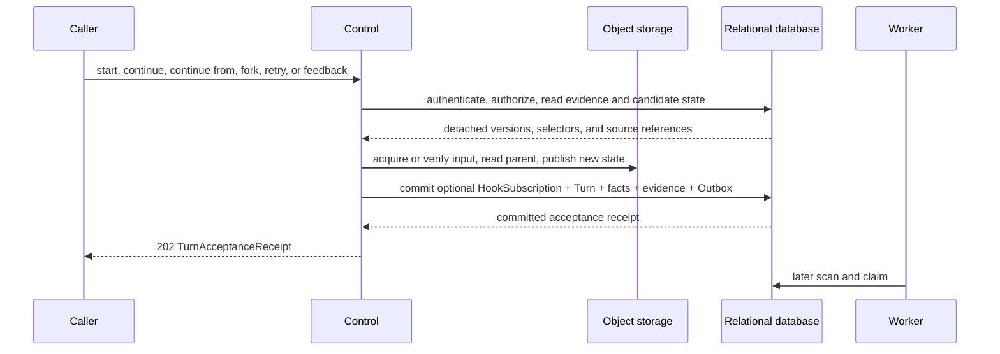
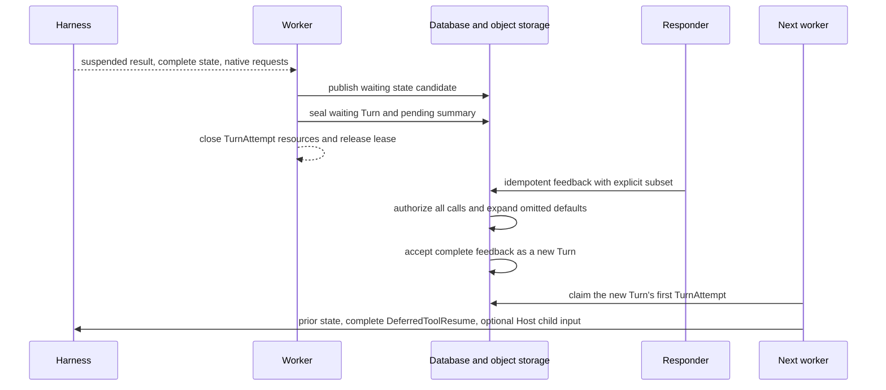

# Agent Control: Input and Continuation

## Design Position

Foundation accepts every new semantic unit of Agent work as a durable Turn
belonging to exactly one Session and Thread. Start, continue, continue from an
explicit historical Turn, waiting feedback, fork, and retry are distinct
acceptance forms over that same boundary. Every successful form creates a new
Turn; none reopens or mutates a sealed Turn.

This contract owns those acceptance forms, their public command surfaces, and
deferred-interaction feedback. Adjacent input, Thread, Turn, TurnAttempt, and
recovery concerns remain with the owners below. Worker takeover and automatic
checkpoint recovery do not accept another semantic unit of work and remain
outside this contract.

## Boundaries

| Concern                                                           | Owner                                                                                                                                             | Relationship                                                                                 |
| ----------------------------------------------------------------- | ------------------------------------------------------------------------------------------------------------------------------------------------- | -------------------------------------------------------------------------------------------- |
| Session, Thread, Turn, and Item meaning                           | [Platform Interaction Model](../interaction-model.md)                                                                                             | Supplies the shared interaction identities                                                   |
| Ordinary semantic Agent input                                     | [Agent Input](33-agent-input.md)                                                                                                                  | Supplies the versioned `AgentInput` accepted by input-bearing commands                       |
| Start, continue, continue from, fork, retry, and waiting feedback | This contract                                                                                                                                     | Accepts one new Turn or rejects the operation without advancing the Thread                   |
| Queue-if-busy ordinary input                                      | [Agent Control: Queued Submissions](36-agent-control-queued-submissions.md)                                                                       | Chooses immediate acceptance or stores editable input whose later consumption creates a Turn |
| Thread version, current Turn, and selected head                   | [Durable Thread Persistence](24-thread-persistence.md)                                                                                            | Supplies the exact advancement precondition and commits selected Turn references             |
| Turn state, lineage, accepted intent, and outcome                 | [Durable Turn State](14-turn-persistence.md)                                                                                                      | Persists the complete accepted input and its deterministic state key                         |
| Worker claim and recovery inside one Turn                         | [Durable Turn Attempt Persistence](15-turn-attempt-persistence.md) and [Scheduling, Workers, and Recovery](16-scheduling-workers-and-recovery.md) | Creates replacement TurnAttempts without accepting another Turn                              |
| Asynchronous child acceptance and retained delivery               | [Async Subagents](18-async-subagents.md)                                                                                                          | Supplies Host-owned child-result facts without redefining native deferred calls              |
| Common Thread inbox persistence                                   | [Agent Control: Active Execution](35-agent-control-active-execution.md#thread-inbox)                                                              | Stores available async-subagent results and their later consumption evidence                 |
| Public API conventions and durable mutation evidence              | [Platform API Conventions](../api-conventions.md) and [Durable Operations and Outbox](06-durable-operations-and-outbox.md)                        | Own shared version, idempotency, retry, and unknown-commit behavior                          |

## Acceptance and Lineage

The accepted operation determines the new Turn identity, state source, input
protocol, and explicit retry correlation:

| Operation     | Public command                                  | Thread effect                                                    | State and lineage                                                                                                                                                  | Accepted Turn input                                    |
| ------------- | ----------------------------------------------- | ---------------------------------------------------------------- | ------------------------------------------------------------------------------------------------------------------------------------------------------------------ | ------------------------------------------------------ |
| Start         | `POST /api/v1/workspaces/{workspace_id}/turns`  | Creates a root Thread with its first Turn                        | `lineage_kind="root"`, `parent_turn_id=null`                                                                                                                       | New `AgentInput`                                       |
| Continue      | `POST /api/v1/threads/{thread_id}/turns`        | Advances an idle existing Thread                                 | Completed head: `lineage_kind="continue"` and exact head parent; null head after failed/cancelled current Turn: root-like with `lineage_kind="root"` and no parent | New `AgentInput`                                       |
| Continue From | `POST /api/v1/turns/{source_turn_id}/continue`  | Re-selects one completed historical Turn and advances its Thread | `lineage_kind="continue"`, parent is the exact completed source Turn                                                                                               | New `AgentInput`                                       |
| Feedback      | `POST /api/v1/turns/{waiting_turn_id}/feedback` | Advances the existing Thread                                     | `lineage_kind="continue"`, parent is the exact waiting Turn                                                                                                        | Complete normalized `WaitingTurnFeedback`              |
| Fork          | `POST /api/v1/turns/{turn_id}/fork`             | Creates an independent in-Session Thread with its first Turn     | `lineage_kind="fork"`, parent is the exact completed source Turn                                                                                                   | New `AgentInput`                                       |
| Retry         | `POST /api/v1/turns/{turn_id}/retry`            | Advances the existing Thread                                     | Copies the failed or cancelled source Turn's lineage and state-source edge and records `retry_of_turn_id`                                                          | Copies the source Turn's accepted input kind and value |

Start, continue, continue from, feedback, and fork have
`retry_of_turn_id=null`. Retry never uses the failed or cancelled source as
`parent_turn_id`: that field continues to name only the exact sealed state
source. A retry of a failed root therefore has no parent; a retry of a failed
continue, continue from, feedback, or fork copies the source Turn's exact
`parent_turn_id` and `lineage_kind`.

Turn acceptance authenticates and authorizes the caller or internal principal,
validates the selected Session and Thread, resolves or preserves the exact
AgentPresetVersion and profile-compatible Runtime lock required by the
operation, resolves other exact revisions and current authority, freezes the
new Turn's non-secret model execution snapshot under [Model
Management](25-model-management.md), applies scoped idempotency, publishes the
complete initial Turn state, and atomically creates or advances the Thread
together with the accepted Turn and its lifecycle publication intent. The Turn
becomes schedulable only after the complete initial state object is durably
available.

Every successful command returns `202` with the same conceptual receipt:

```python
class TurnAcceptanceReceipt:
    schema_version: Literal["1"]
    session_id: SessionId
    thread_id: ThreadId
    thread_version: int
    turn_id: TurnId
    turn_version: int
    status: Literal["accepted"]
    hook_subscription_id: HookSubscriptionId | None
```

The response does not wait for Worker claim or Harness completion. The same
principal, operation kind, resource scope, idempotency key, and canonical
semantic request return the original receipt. Reuse with different content
conflicts. A lost response after possible acceptance remains unknown until the
caller repeats the same key or reads authoritative Turn state.

### Common Acceptance Flow



No relational transaction spans input acquisition, object storage, Harness
state transformation, or Worker execution. The final short transaction repeats
every authority, version, current/head, source, digest, and idempotency
precondition needed by the operation. Objects published before a losing or
rolled-back transaction are non-authoritative cleanup candidates.

Every direct acceptance command in this contract can carry the optional inline
`hook_subscription` owned by [Hook
Notifications](20a-hook-notifications.md#durable-hook-subscriptions). It
participates in the canonical command request, commits atomically with the
accepted Turn, and returns its ID in the receipt, but it is neither Agent input
nor an invocation option and cannot affect execution. Hook shape,
authorization, scope, delivery, and idempotency semantics remain with that
owner.

## Input-Bearing Operations

Start, continue, and continue-from requests carry an
[`AgentInput`](33-agent-input.md#agent-input-protocol), a selected stable
AgentPreset when permitted, an optional active-Version precondition, optional
`selected_skill_names`, an optional policy-permitted tuple of
[`EnvironmentSelectionEntry`](19-environment-management.md#environment-selection-and-turn-state),
and, for start, an optional Session selector. Fork accepts the same ordinary
input and policy-permitted selections against its source. Managed trigger
provenance is supplied only by its trusted ingress, not as caller-declared
metadata on the public start command. Fields other than `AgentInput` are
command options and never enter its `content` or `structured_content`.

`selected_skill_names` follows the [Foundation Skill selection
contract](27-skill-management.md#agentpresetversion-selection). Acceptance
stores its normalized effective selection in `state.json`; that effective value
participates in the canonical request digest.

Only start, continue, continue from, fork, and equivalent Host-owned initial
Turn submission can supply ordinary invocation options. Feedback and retry
accept no AgentPreset, Version, Skill, Environment, or input override; they
preserve the exact selections and accepted intent required by their source
Turn.

### Start and Continue

Start accepts Agent work that does not continue an existing Thread:

```http
POST /api/v1/workspaces/{workspace_id}/turns
Idempotency-Key: opaque-caller-key
```

The request names one stable `agent_preset_id`, can carry
`agent_preset_version_id` only as an active-Version precondition, and supplies
one `AgentInput`. Acceptance resolves the Preset's current active Version and
Runtime lock, validates the complete request against that exact Version, then
selects or creates one Session and creates its root Thread. It initializes
`HarnessState.new()` and atomically commits the version `1` Thread row, its first
root Turn, lifecycle facts, idempotency evidence, and Outbox records. Foundation
exposes no standalone empty-Thread create operation.

Continue advances an existing Thread:

```http
POST /api/v1/threads/{thread_id}/turns
Idempotency-Key: opaque-caller-key
```

The request carries `expected_thread_version`, one `AgentInput`, an optional
stable `agent_preset_id`, and an optional active-Version precondition.
Foundation locks the Thread, requires no current `accepted` or `running` Turn,
and requires the queued-submission collection to be empty. A non-empty queue
conflicts so direct input cannot bypass an earlier queued submission.

When `head_turn_id` names an exact completed Turn, Foundation never infers a
parent from timestamps. The selected Preset defaults to that parent's stable
Preset. Acceptance resolves its current active Version and Runtime lock,
rejects incompatible parent-state or input migration, initializes a new
Turn-owned state from the completed parent, creates the Turn with
`lineage_kind="continue"`, sets `current_turn_id` to it, preserves the head
until the successor seals, increments Thread version, and commits the Turn and
its related durable facts.

When `head_turn_id=null` and the current Turn is `failed` or `cancelled`, the
same route performs root-like acceptance in the existing Thread. The new Turn
has `lineage_kind="root"`, `parent_turn_id=null`, and
`retry_of_turn_id=null`. A trusted Foundation state adapter constructs a
complete empty Harness state carrying the existing Thread's exact `thread_id`;
it does not call `HarnessState.new()`, which would create another Thread ID.
When omitted, the stable Preset defaults to the current failed or cancelled
Turn's stable Preset; acceptance resolves its current active Version and the
ordinary policy-permitted selections. The acceptance transaction selects the
new Turn as current, leaves the head null until a waiting or completed outcome
seals, and increments Thread version. This is new input rather than Retry of the
failed or cancelled intent.

A waiting head is not equivalent to an absent head and is eligible only for
Feedback, Retry of an already accepted failed/cancelled feedback successor, or
an explicit operation such as Continue From that selects another completed
source. Ordinary Continue conflicts without accepting a Turn.

Schedules, Webhooks, service requests, managed Triggers, and Host-managed
asynchronous children use the same Turn-acceptance application boundary even
when their owning ingress is not one of these public routes.

### Continue From an Explicit Turn

Continue From accepts another same-Thread continuation from one caller-selected
historical state:

```http
POST /api/v1/turns/{source_turn_id}/continue
Idempotency-Key: opaque-caller-key
```

The request has the same `expected_thread_version`, `AgentInput`, Preset,
Version-precondition, Skill, Environment, and optional Hook fields as ordinary
Continue. The source must be a retained, readable `completed` Turn in the
target Thread, but it need not be that Thread's current Turn or selected head.
Foundation also requires that the Thread have no current `accepted` or
`running` Turn.

Acceptance initializes state from the exact source and creates a same-Thread
Turn with `lineage_kind="continue"` and
`parent_turn_id=source_turn_id`. In the final short transaction it sets
`current_turn_id` to the new Turn, sets `head_turn_id` to the selected source,
increments the Thread version, and commits the accepted Turn and related facts.
If the successor later seals as `waiting` or `completed`, it becomes the new
head. If it seals as `failed` or `cancelled`, the selected source remains the
head.

Selecting a source other than the prior head intentionally abandons that prior
branch as the Thread's active continuation selection. In particular, a
historical waiting Turn that is no longer both current and head is not eligible
for Feedback. The operation does not synthesize rejection or no-response values
for that abandoned pending set; the sealed Turn remains retained history.

Several retained successors can therefore share the same completed parent over
time. The single-active-Turn constraint serializes execution, while
`parent_turn_id` preserves every accepted branch. Continue From preserves the
Thread ID and is distinct from Fork, which creates another Thread, and from
automatic recovery, which creates no Turn.

### Fork

Foundation exposes an explicit in-Session Thread fork from one selected
completed Turn:

```http
POST /api/v1/turns/{turn_id}/fork
Idempotency-Key: opaque-caller-key
```

Any retained and readable completed Turn is eligible, including a historical
Turn that is neither the source Thread's `current_turn_id` nor `head_turn_id`.

The request carries an `AgentInput` and the compatible policy-permitted
selections defined above. Foundation authorizes the source Turn and Session,
verifies the source's exact frozen state, applies `HarnessState.fork()`, and
atomically creates a `role="child"`, `origin_kind="fork"` Thread plus its first
accepted Turn. The new Turn's `parent_turn_id` names the source Turn even though
the Turn belongs to the new Thread. Omitting the Preset selection reuses the
source Turn's exact Preset Version and Runtime lock; an explicit compatible
selection resolves its current active Version under the fork policy.

The source Turn is part of fork's common idempotency scope. A Session fork that
creates a new Session and root Thread remains a distinct Session-domain
operation and is never implied by this route.

## Retry of Terminal Intent

```http
POST /api/v1/turns/{turn_id}/retry
Idempotency-Key: opaque-caller-key
```

The target must be the Thread's current failed or cancelled Turn. The request
carries `expected_thread_version` and accepts no new `AgentInput` or invocation
option. Acceptance copies the source Turn's `input_kind`, exact normalized
accepted input or feedback value, `parent_turn_id`, `lineage_kind`,
AgentPresetVersion, Runtime lock, effective Skill selection, and Environment
execution configuration. The copied accepted input retains each binary URL or
Environment-path source description; Retry acceptance reauthorizes that
description but does not read or copy its file body. Acceptance records the
source in `retry_of_turn_id`, reauthorizes every retained selector, creates a new
Turn-owned state from the same eligible state source, and obtains fresh
credentials, bindings, recovery authority, and model execution snapshot for the
new Turn. Execution treats Retry as a new Turn with zero prior model requests
and reacquires any binary bytes required by its frozen delivery.

Retry never re-runs a client-side effect, changes an accepted feedback decision,
or makes the failed source an eligible state parent. If the failed source was a
root, the retry initializes another root state. Otherwise it repeats the source
operation's state transformation from the same frozen parent. Once another Turn
advances the Thread, the old terminal Turn is no longer retryable.

## Deferred Interaction

Approval, client-tool execution, structured user input, and awaited child
results are frozen pending facts inside one sealed waiting Turn and its complete
state object. They are not independent mutable resources or relational rows.
Provider-owned continuation can also seal a Turn as waiting, but it is resumed
only when its owning internal integration supplies a complete provider result
through the same new-Turn feedback acceptance boundary. It is not accepted by
the public feedback command. A pending set containing `provider_continuation`
is therefore ineligible for this route rather than being partially finalized
around it.

Feedback-eligible pending kinds remain distinct:

- `approval` asks an authorized human or service to permit a proposed action;
- `client_tool` asks an external client to perform a named effect and return its declared result;
- `user_input` requests structured information without authorizing another effect; and
- `child_result` waits for the exact immutable outcome of one accepted asynchronous child Turn.

The exact native deferred requests and Host-owned child wait requests live in
`TurnStateEnvelope.host.deferred`; the Turn row stores only the matching bounded
`TurnPendingSummary` owned by [Durable Turn
State](14-turn-persistence.md#turn-state-object). The public route exposes those
facts as read projections beneath the waiting Turn and accepts one atomic
feedback command:

```http
POST /api/v1/turns/{waiting_turn_id}/feedback
Idempotency-Key: opaque-caller-key
```

The submitted resolution union is a serialized wire schema:

```python
class ApprovePendingResolution:
    call_id: str
    action: Literal["approve"]


class RejectPendingResolution:
    call_id: str
    action: Literal["reject"]


class CompletePendingResolution:
    call_id: str
    action: Literal["complete"]
    result: JsonValue


class RespondPendingResolution:
    call_id: str
    action: Literal["respond"]
    response: JsonValue


type SubmittedPendingResolution = (
    ApprovePendingResolution
    | RejectPendingResolution
    | CompletePendingResolution
    | RespondPendingResolution
)


class WaitingTurnFeedbackRequest:
    expected_thread_version: int
    sealed_state_digest_sha256: str
    resolutions: tuple[SubmittedPendingResolution, ...] = ()
    hook_subscription: InlineHookSubscriptionInput | None = None
```

The frozen pending kind determines which action and result schema are legal:
`approve` and `reject` apply only to approval, `complete` applies to an exact
client-tool or authorized child-result request, and `respond` applies only to
structured user input. `result` and `response` use the versioned JSON encoding
declared by the exact pending request and its locked adapter. The request cannot
repeat a call ID, name an unknown call, supply a mismatched action, or override
the pending kind.

Submitting this route finalizes the entire feedback-eligible pending set. The
caller can supply any subset explicitly; Foundation expands every omitted call
in frozen request order before acceptance:

| Pending kind   | Explicit action       | Omitted outcome |
| -------------- | --------------------- | --------------- |
| `approval`     | `approve` or `reject` | `reject`        |
| `client_tool`  | `complete`            | `no_response`   |
| `user_input`   | `respond`             | `no_response`   |
| `child_result` | authorized `complete` | `no_response`   |

An empty `resolutions` tuple therefore rejects every approval and records no
response for every other feedback-eligible call. This is fail-closed
finalization, not a partial update. The principal or internal caller must be
authorized to finalize every pending call because omission also changes the
continuation result.

The accepted Turn stores the complete normalized value, not only the submitted
subset:

```python
type PendingResolutionOutcome = Literal[
    "approve",
    "reject",
    "complete",
    "respond",
    "no_response",
]


class AcceptedPendingResolution:
    call_id: str
    kind: Literal[
        "approval",
        "client_tool",
        "user_input",
        "child_result",
        "provider_continuation",
    ]
    outcome: PendingResolutionOutcome
    result: JsonValue | None


class WaitingTurnFeedback:
    schema_version: Literal["1"]
    waiting_turn_id: TurnId
    sealed_state_digest_sha256: str
    resolutions: tuple[AcceptedPendingResolution, ...]
```

Every accepted `WaitingTurnFeedback` covers its complete owning pending set
exactly once and preserves frozen request order. For the public route that set
contains only feedback-eligible kinds; an internal provider continuation
supplies every exact provider-owned result without omission defaults.
Foundation expands public defaults and validates the complete typed value
before computing the canonical semantic request digest. Explicitly rejecting
an approval is therefore equivalent to omitting it; non-approval `no_response`
arises only through omission. The accepted feedback is the immutable input of
the new Turn; the waiting parent and its pending summary never change.

### Harness and Child-Result Mapping

The Worker maps the accepted batch by owning boundary:

| Pending kind            | Mapping                                                                                                                                                                      |
| ----------------------- | ---------------------------------------------------------------------------------------------------------------------------------------------------------------------------- |
| `approval`              | Native `ToolApproved` or `ToolDenied`.                                                                                                                                       |
| `client_tool`           | `complete` becomes the declared native result; `no_response` becomes an explicit failed external-call result, never a missing entry or successful `null`.                    |
| `user_input`            | `respond` is validated against the exact request; `no_response` uses the locked interaction adapter's explicit representation.                                               |
| `child_result`          | Enters through the Host-owned fresh-run input seam in [Async Subagents](18-async-subagents.md), never through `DeferredToolResume` or under the original spawn tool-call ID. |
| `provider_continuation` | Enters through its owning Host/model integration and is never synthesized by the public omission policy.                                                                     |

For native Pydantic requests, Foundation constructs one `DeferredToolResults`
whose `calls` and `approvals` maps exactly cover the authoritative
`DeferredToolRequests`, then passes both through the Harness
[`DeferredToolResume`](../agent-harness/16-input-model-and-output.md#input)
with the prior state and fresh bindings. Defaults are
therefore explicit results by the time Harness preflight runs. A batch that also
contains child-result feedback can supply its Host-owned fresh-run input at the
same new Harness Run boundary without reinterpreting that result as a native
deferred call.

A child-result `no_response` closes this waiting batch but does not prove child
cancellation, consume its Thread inbox entry, or discard an independently
retained result. The child relationship and any available inbox entry continue
under the asynchronous-child cancellation, retention, and later-incorporation
policy.

## Suspension and Feedback Turn



Suspension first conditionally publishes the complete waiting state candidate at
the Turn's deterministic state key. One fenced relational transition verifies
that the Turn remains current, seals it, terminalizes the source TurnAttempt,
copies the bounded pending summary to the Turn row, selects the exact state
digest and checkpoint sequence, retains the waiting Turn as current, selects it
as the Thread head, increments Thread version, and commits lifecycle facts. The
worker then closes Harness, Environment connector, credential, socket, and
database resources.

Feedback authenticates the responder, locks the Thread, requires both
`current_turn_id` and `head_turn_id` to name the target waiting Turn, verifies
the expected Thread version and sealed-state digest, authorizes the complete
pending set, validates and expands the submitted subset, and applies scoped
idempotency. After publishing the new Turn's complete initial state and any
object-backed feedback, one short transaction repeats those preconditions,
inserts a Turn with `input_kind="waiting_feedback"` and
`parent_turn_id=waiting_turn_id`, selects it as current, increments Thread
version, and commits lifecycle facts, idempotency evidence, response Items when
applicable, and outbox intents. When an explicit child result is selected, that
same transaction marks its exact Thread inbox entry consumed with the new Turn
and initialized state digest at checkpoint zero. The accepted feedback itself
records the exact consumed pending identities; no mutable pending-action row is
updated.

If the feedback Turn later fails or is cancelled, retry can only reaccept that
same normalized feedback intent. The waiting parent remains frozen, but it is no
longer the Thread's current Turn, so another feedback command with different
content cannot race the accepted successor.

## Persistence Impact

Related persistence integration is:

| Persistence owner        | Required contract                                                                                                                                                                                                                                                                |
| ------------------------ | -------------------------------------------------------------------------------------------------------------------------------------------------------------------------------------------------------------------------------------------------------------------------------- |
| `turns`                  | Stores `input_kind` to distinguish `agent_input` from `waiting_feedback`, and nullable `retry_of_turn_id` to correlate exact terminal intent without changing the state-parent edge. Existing inline or object-backed JSON columns store the complete accepted descriptor value. |
| Turn lineage constraints | Permit several retained same-Thread successors to share one completed `parent_turn_id`; only the partial unique constraint for one `accepted` or `running` Turn per Thread serializes active advancement.                                                                        |
| Waiting pending data     | No `pending_actions` table. The waiting Turn row stores only `pending_json`; its sealed state stores exact native and Host requests.                                                                                                                                             |
| Async child delivery     | The child relationship and common `thread_inbox` entry remain authoritative; explicit selection consumes the exact entry while batch feedback never turns it into a native deferred call.                                                                                        |
| Inline Hook delivery     | Optional creation commits atomically under [Hook Notifications](20a-hook-notifications.md); no Turn column stores callback configuration.                                                                                                                                        |
| Durable command evidence | Existing idempotency, lifecycle, Item, and outbox records commit with the accepted Turn under their owning contracts.                                                                                                                                                            |

`input_kind`, `retry_of_turn_id`, the exact parent edge, Thread head selection,
and the source or current Turn's status make every acceptance form queryable
without adding an `agent_control_operations` table or another execution
resource.

## Failure Semantics

| Condition                                                                                    | Outcome                                                                                                                  |
| -------------------------------------------------------------------------------------------- | ------------------------------------------------------------------------------------------------------------------------ |
| Start, continue, continue from, fork, retry, or feedback validation fails before commit      | No Thread or Turn advancement occurs                                                                                     |
| Continue finds an earlier queued submission or a waiting selected head                       | Continue conflicts without creating or consuming a Turn                                                                  |
| Concurrent Thread advancement or sealing wins                                                | The stale command conflicts and changes nothing                                                                          |
| Retry target is not the current failed or cancelled Turn                                     | Retry conflicts without creating a Turn                                                                                  |
| Feedback contains a duplicate, unknown, wrong-action, invalid-result, stale, or expired call | No feedback Turn is created; the waiting parent remains unchanged                                                        |
| Feedback responder cannot finalize every pending call                                        | Request is denied without disclosing concealed pending content                                                           |
| Native deferred requests and normalized results do not exactly cover one another             | Feedback is rejected before acceptance when detectable; otherwise the accepted feedback Turn fails before new model work |
| Resume surface differs from the suspended surface                                            | The accepted feedback Turn fails before Harness continuation                                                             |
| Child result is omitted                                                                      | The batch records `no_response`; child execution and retained delivery follow their independent policy                   |

## Invariants

01. Start, continue, continue from, feedback, fork, and terminal retry accept another Turn; acceptance returns before later Worker claim, TurnAttempt allocation, or Harness execution.
02. Continue and Continue From preserve the Thread ID; Fork creates a distinct Thread ID. Continue with a null head initializes empty state under that existing ID rather than calling `HarnessState.new()`.
03. Retry accepts no new input or invocation option, copies the exact accepted intent and state-source edge, and records `retry_of_turn_id`.
04. Ordinary Agent work uses `AgentInput`; waiting feedback uses the separate complete normalized `WaitingTurnFeedback` protocol.
05. Feedback finalizes the complete eligible pending set; omitted approvals reject and omitted non-approval calls record no response.
06. A waiting Turn is sealed and holds no TurnAttempt lease; feedback creates a new Turn whose `parent_turn_id` names it.
07. Native deferred values remain exactly correlated, Host-owned child delivery never impersonates a native deferred call, and approval, external effect, and child completion remain independent facts.
08. Pending actions are immutable projections of one waiting Turn, not independently mutable resources or relational rows.
09. Continue From accepts any retained and readable completed Turn in the same Thread, atomically selects it as head while creating its successor, and does not require that source to be the prior current Turn or head.
10. Direct Continue never bypasses a queued submission; with an empty queue it uses the exact completed head or, only after a failed or cancelled current Turn with `head_turn_id=null`, accepts a root-like Turn with no parent.
