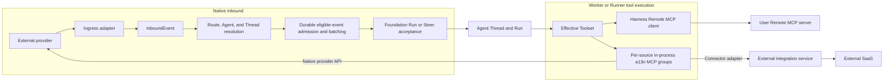

# External Connectivity Overview

## Design Position

Connectivity is Foundation-owned configuration and authorization around provider-specific adapters. It preserves provider-native behavior at the edge and standardizes only the minimum concepts required to admit external input, select one Agent, select an authorized tool scope, and dispatch authorized external actions.

Native event receipt, Connector-backed SaaS actions, and user-configured Remote MCP are separate even when they concern the same external product. A Slack Account can receive through its Ingress and reply as its Bot identity without a second OpenConnector or Composio ConnectorConnection. A separate ConnectorConnection is used only for broader Connector-provided Slack actions or another account. A user Remote MCP endpoint is represented independently by `MCPConnection`.

## Boundaries

| Concern                                          | Owner                                           | Boundary                                                                                |
| ------------------------------------------------ | ----------------------------------------------- | --------------------------------------------------------------------------------------- |
| Native provider identity                         | Application Account                             | One concrete provider identity in one Foundation Workspace                              |
| Event authentication and normalization           | Ingress adapter                                 | Produces one bounded `InboundEvent`; raw provider data creates no runtime authority     |
| Event matching, Agent override, and input policy | Route                                           | Selects one allowed Agent and one new or existing Agent Thread destination              |
| External-to-Agent Thread correlation             | AgentThreadBinding                              | Fixes one adapter-declared stable external reference to one Agent and Agent Thread      |
| Durable Run acceptance and active input          | [Foundation Service](../README.md)              | Owns Run creation, Ingress Steer, deduplication acceptance, and Thread lifecycle        |
| General outbound connector service               | ConnectorProvider                               | Configures one OpenConnector, Composio, or another installed Connector Provider adapter |
| Safe externally managed account reference        | ConnectorConnection                             | Refers to one account whose real credentials remain in its external integration service |
| User-configured remote MCP access                | MCPConnection                                   | Combines one Streamable HTTP endpoint, one authorization identity, and one lifecycle    |
| Foundation-owned in-process tool groups          | a13n MCP                                        | Serves Account actions, Ingress replies, and Connector tools for the current RunAttempt |
| Model-facing discovery and loading               | Harness                                         | Discovers selected sources and uses native capability loading                           |
| Provider and remote tool names, schemas, result  | Their adapter, ConnectorProvider, or MCP server | Retain source-specific meaning; Foundation creates no universal action vocabulary       |

## Core Concepts

[Application Account](01a-application-accounts.md) is one concrete provider user, Bot, or installation identity that Foundation operates directly. It owns credentials and availability independently of reception and can serve several Agents.

`Ingress` is the optional reception configuration of one Account. Each Account has at most one Ingress. It binds a same-Workspace Service Account as the Foundation execution Principal and routes authenticated external input. An external sender remains context, never Foundation authority. Independently authorized Account actions do not require inbound input. The trusted entry supplies default native tools through protected Run contexts; Agents select Connector and Remote MCP tools separately.

`Route` is provider-specific matching plus Foundation-owned Agent override, safe input mapping, input batching, provider policy, and per-Agent capability policy under one Ingress. A Route can match a Slack channel, Lark chat, Gmail label, GitHub repository event, or another provider-native scope without pretending those resources share one universal conversation model.

`AgentThreadBinding` is exact durable correlation from one adapter-declared stable external reference to one fixed Agent and Foundation Thread. It never uses semantic similarity or model inference.

`ConnectorProvider` is one configured external integration service account or endpoint such as OpenConnector Self-host, OpenConnector Cloud, or Composio. Its `type` selects an implementation, while its `id` identifies the independent configuration and credential. Several Providers can have the same type.

`Connector` is one integration discovered through that configured Provider, such as GitHub or Slack. It is a safe Provider-scoped catalog value, not a separate Workspace resource. Its setup requirements and available tools retain Provider-specific semantics. [Connector discovery](03-connectors-and-connections.md#connector-discovery) owns this boundary.

`ConnectorConnection` is Foundation's safe reference to one external account held by one ConnectorProvider. It is not that account's credential. The longer name is intentional: `ConnectorConnection` and `MCPConnection` are distinct resources with different credential custody, transports, and execution paths. Public collection routes use `/connector-connections`, while fields that coexist with another connection kind use `connector_connection_id`.

`MCPConnection` is one configured authorization identity for one user-supplied Remote MCP endpoint. The same endpoint used with two different identities creates two MCPConnections rather than a separate server resource and another connection layer.

## Object Identity

Connectivity allocates these Foundation object-ID prefixes under the shared [Platform Data Conventions](../../data-conventions.md#object-identity):

| Object kind                        | Prefix   | Addressability           |
| ---------------------------------- | -------- | ------------------------ |
| Application Account                | `acct_`  | Public resource          |
| Ingress                            | `ing_`   | Public resource          |
| Route                              | `rte_`   | Public resource          |
| ConnectorProvider                  | `cnr_`   | Public resource          |
| ConnectorConnection                | `cconn_` | Public resource          |
| MCPConnection                      | `mcpc_`  | Public resource          |
| AgentThreadBinding                 | `atb_`   | Internal durable object  |
| Inbound event admission            | `iadm_`  | Internal durable object  |
| Input batch                        | `ibat_`  | Internal durable object  |
| Connector Connection setup attempt | `csa_`   | Internal expiring object |
| MCP OAuth authorization session    | `mos_`   | Internal expiring object |

An allocated prefix identifies the object kind only. It conveys no provider, tenant, owner, lifecycle, routing, or authority fact. Connector Provider resources retain the allocated `cnr_` prefix; discovered Connector catalog values have no Foundation object ID.

## Outbound Endpoint Policy

Every ConnectorProvider and Remote MCP request uses one Connectivity-subsystem-owned outbound endpoint policy in whichever role performs the request, including Control, Worker, and Runner. Production endpoints use HTTPS. Plain HTTP is accepted only for an exact operator-allowed development or private self-hosted origin. DNS is resolved and every resulting address is checked before each request; loopback, link-local, multicast, unspecified, cloud-metadata, and private addresses are denied unless the exact origin or network is operator-allowed under this policy. Model endpoint allowlists and their management permissions do not apply.

Redirects are followed manually for at most three hops. Every destination is normalized, resolved, and checked independently; an HTTPS-to-HTTP downgrade is denied. A bearer value, static application header, ConnectorProvider API key, cookie, or other credential is sent only to the exact origin for which it was resolved and is never forwarded after an origin-changing redirect. Standards-discovered MCP authorization endpoints and operator-configured Lark or GitHub Enterprise origins are subject to the same checks. Endpoint query strings, discovery headers, redirect locations, and remote bodies remain bounded and are omitted from ordinary diagnostics.

## End-to-End Flow

The `connectivity` process role receives provider traffic and invokes shared application operations for durable admission. The current `RunAttemptExecutor` in a Worker or Runner invokes Harness, constructs per-source MCP capabilities, and executes outbound native and Connector actions. Remote clients connect directly to selected MCP endpoints. These roles share durable authority without a private cross-pod Foundation API; Connectivity does not execute Agents or own a parallel Run lifecycle.

Inbound completion means that an event was rejected safely, ignored by policy, or durably admitted for Foundation input processing. It never waits for Agent execution. Outbound completion is one independently authorized tool outcome.

## Stable Principles

1. Provider adapters can differ completely before `InboundEvent`; external integration services and Remote MCP servers can differ completely behind their own boundaries.
2. Foundation standardizes identity, authorization, routing, input acceptance, and model exposure, not provider business APIs.
3. Raw external data never creates an Agent, Tool, ConnectorConnection, MCPConnection, Secret, Principal, Route, or Run grant.
4. One Ingress can route to several allowed Agents; one inbound event activates at most one.
5. Agent selection and effective Skills, Tools, MCPConnections, ConnectorConnections, and native actions are independent decisions.
6. An accepted Run fixes its Agent, Agent Thread, effective capability selection, protected native tool contexts, ConnectorConnection choices, MCPConnection choices, and tool scopes. Recovery preserves those choices while discovering current external tool definitions.
7. Connectivity retains only bounded event-admission, deduplication, correlation, and external-resource facts; it persists no transcript, Agent inbox, or execution state beside Foundation Threads, Runs, and the Thread inbox.
8. Provider credentials are typed and owned at the edge; the common model never forces Slack, Lark, GitHub, Gmail, ConnectorProvider, and MCP authorization into one credential schema.
