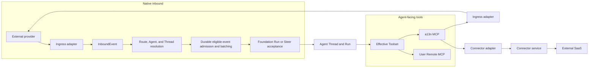

# External Connectivity Overview

## Design Position

Connectivity is Foundation-owned configuration and authorization around provider-specific adapters. It preserves provider-native behavior at the edge and standardizes only the minimum concepts required to admit external input, select one Agent, freeze a safe tool surface, and dispatch authorized external actions.

Native event receipt, Connector-backed SaaS actions, and user-configured Remote MCP are separate even when they concern the same external product. A Slack Ingress can receive and reply as its Bot identity without a second OpenConnector or Composio ConnectorConnection. A separate ConnectorConnection is used only for broader Connector-provided Slack actions or another account. A user Remote MCP endpoint is represented independently by `MCPConnection`.

## Boundaries

| Concern                                          | Owner                                   | Boundary                                                                                |
| ------------------------------------------------ | --------------------------------------- | --------------------------------------------------------------------------------------- |
| Native inbound provider identity                 | Ingress                                 | One installed inbound-capable external identity in one Foundation Workspace             |
| Event authentication and normalization           | Ingress adapter                         | Produces one bounded `InboundEvent`; raw provider data creates no runtime authority     |
| Event matching, Agent override, and input policy | Route                                   | Selects one allowed Agent and one new or existing Agent Thread destination              |
| External-to-Agent Thread correlation             | AgentThreadBinding                      | Fixes one adapter-declared stable external reference to one Agent and Agent Thread      |
| Durable Run acceptance and active input          | [Foundation Service](../README.md)      | Owns Run creation, Ingress Steer, deduplication acceptance, and Thread lifecycle        |
| General outbound connector service               | Connector                               | Configures one OpenConnector, Composio, or another installed Connector adapter          |
| Safe Connector-managed account reference         | ConnectorConnection                     | Refers to one account whose real credentials remain in its Connector service            |
| User-configured remote MCP access                | MCPConnection                           | Combines one Streamable HTTP endpoint, one authorization identity, and one lifecycle    |
| Foundation-owned Agent tool server               | a13n MCP                                | Serves authorized Ingress native actions and Connector tools for the current RunAttempt |
| Model-facing aggregation                         | Foundation Worker                       | Exposes selected Connector and Remote MCP tools directly or through three catalog tools |
| Provider and remote tool names, schemas, result  | Their adapter, Connector, or MCP server | Retain source-specific meaning; Foundation creates no universal action vocabulary       |

## Core Concepts

`Ingress` is one concrete inbound-capable provider identity that Foundation operates directly. Depending on the provider, it can represent a Slack App installation, Lark App installation, Discord Bot installation, GitHub App installation, Gmail account, or another provider-defined identity. It binds one same-Workspace Service Account as the Foundation execution Principal; the external provider actor remains context, not authority. An Ingress can be receive-only or receive plus bounded same-identity native actions; a send-only identity is not an Ingress.

`Route` is provider-specific matching plus Foundation-owned Agent override, safe input mapping, input batching, provider policy, and per-Agent capability policy under one Ingress. A Route can match a Slack channel, Lark chat, Gmail label, GitHub repository event, or another provider-native scope without pretending those resources share one universal conversation model.

`AgentThreadBinding` is exact durable correlation from one adapter-declared stable external reference to one fixed Agent and Foundation Thread. It never uses semantic similarity or model inference.

`Connector` is one configured external connector service such as OpenConnector Self-host, OpenConnector Cloud, or Composio. Its adapter, endpoint, access credential, provider coverage, and action schemas are Connector-specific.

`ConnectorConnection` is Foundation's safe reference to one external account held by one Connector. It is not that account's credential.

`MCPConnection` is one configured authorization identity for one user-supplied Remote MCP endpoint. The same endpoint used with two different identities creates two MCPConnections rather than a separate server resource and another connection layer.

## End-to-End Flow

The `connectivity` process role receives provider traffic, operates the a13n MCP, dispatches Connector calls, and invokes the same Foundation application operations used by the control role. It does not call another Foundation pod's private API, execute Agents, or own Run lifecycle. The Worker invokes Harness and constructs the effective Toolset from the accepted Run selections.

Inbound completion means that an event was rejected safely, ignored by policy, or durably admitted for Foundation input processing. It never waits for Agent execution. Outbound completion is one independently authorized tool outcome.

## Stable Principles

1. Provider adapters can differ completely before `InboundEvent`; Connector services and Remote MCP servers can differ completely behind their own boundaries.
2. Foundation standardizes identity, authorization, routing, input acceptance, and model exposure, not provider business APIs.
3. Raw external data never creates an Agent, Tool, ConnectorConnection, MCPConnection, Secret, Principal, Route, or Run grant.
4. One Ingress can route to several allowed Agents; one inbound event activates at most one.
5. Agent selection and effective Skills, Tools, MCPConnections, ConnectorConnections, and native actions are independent decisions.
6. An accepted Run fixes its Agent, Agent Thread, effective capability selection, protected Ingress context, ConnectorConnection choices, MCPConnection choices, and exact tool snapshot. Recovery never silently substitutes another Agent, target, account, endpoint, or tool contract.
7. Connectivity retains only bounded event-admission, deduplication, correlation, and external-resource facts; it persists no transcript, Agent inbox, or execution state beside Foundation Threads, Runs, and the Thread inbox.
8. Provider credentials are typed and owned at the edge; the common model never forces Slack, Lark, GitHub, Gmail, Connector, and MCP authorization into one credential schema.
