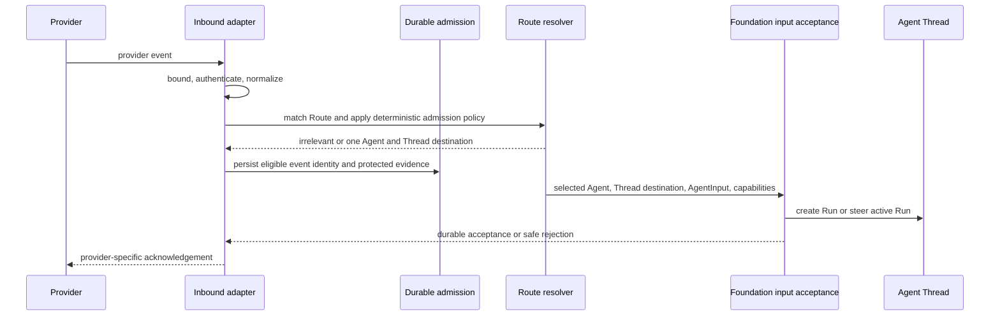

# Ingress and Routing

## Design Position

Native Ingresses receive provider events, authenticate and normalize them, route them to one Agent input destination, and submit them through Foundation's existing durable input contracts. They do not execute an Agent, send provider messages, or own another inbox.

Provider configuration is intentionally typed by each adapter. Slack signing secrets, Lark app credentials, Discord gateway configuration, Gmail watch state, and GitHub App installation data do not enter one universal credential or event schema. The stable contract begins with Foundation-owned Ingress identity and the normalized event envelope.

## Ingress and Route

The following conceptual schemas are not wire or ORM models:

```python
class IngressAgent:
    agent_preset_id: AgentPresetId
    aliases: tuple[str, ...]


class Ingress:
    id: IngressId
    organization_id: OrganizationId
    workspace_id: WorkspaceId
    name: str
    provider_key: str
    provider_config_version: str
    provider_config: IngressProviderConfig
    execution_principal_ref: PrincipalRef
    agents: tuple[IngressAgent, ...]
    default_agent_preset_id: AgentPresetId
    status: Literal["active", "disabled", "attention_required"]
    version: int
    created_by: PrincipalRef
    created_at: datetime
    updated_at: datetime


class Route:
    id: RouteId
    ingress_id: IngressId
    name: str
    provider_config_version: str
    match: RouteMatchConfig
    agent_preset_id: AgentPresetId | None
    input_mapping: InputMapping | None
    input_batching: InputBatchingPolicy
    capability_overlays: Mapping[AgentPresetId, RunCapabilityOverlay]
    provider_policy: RouteProviderPolicy
    enabled: bool
    version: int
```

`IngressProviderConfig` and `RouteMatchConfig` are adapter-owned tagged unions of strong provider-specific types, such as `SlackIngressConfig` and `GitHubRouteMatch`. They are not arbitrary JSON dictionaries and have no universal credential or matching schema.

An Ingress is one concrete installed or authorized inbound-capable external identity in one Foundation Workspace. A provider's reusable application definition can support many tenant installations, but routes, allowed Agents, and current credentials belong to each concrete Ingress. An Ingress can be receive-only or receive plus bounded same-identity native actions; a send-only identity belongs in the Connector or Remote MCP path.

`execution_principal_ref` is an immutable reference to one active Service Account in the same Workspace. It is the Foundation Principal for every Run or Steer initiated by that Ingress. The external Slack, Lark, Discord, Teams, GitHub, Gmail, or other provider actor remains authenticated audit and model context but never becomes a Foundation Principal by identifier, username, or email coincidence. Admission and every later RunAttempt reauthorize the Service Account's current Agent invocation and shared capability grants. Disabling or deleting it, removing a required RoleBinding, or losing authority for the selected Agent blocks new input without rewriting accepted work.

Organization, Workspace, provider key, execution Principal, and the adapter-declared external installation, tenant, or account identity are immutable. Changing any of them creates another Ingress so retained bindings and event identity never change meaning. Credential rotation, event-subscription state, display configuration, allowed Agents, default Agent, status, and other identity-preserving provider settings update the existing Ingress under exact version preconditions.

Aliases are unique within an Ingress after provider-appropriate normalization. The default Agent, every Route-selected Agent, and every Agent named by `capability_overlays` must occur in the Ingress's `agents`. A Route-selected Agent overrides the Ingress default only for events matched by that Route.

`match` and `provider_policy` are provider-specific typed data validated by the adapter under the exact `provider_config_version`. Messaging `provider_policy` has the common bounded shape owned by [Messaging Ingress](02-messaging-ingress.md#messaging-policy); other providers retain their own typed policy. `capability_overlays` uses the common [Run Capability Overlay](../12-agent-management.md#run-capability-overlay) contract and is never interpreted by the provider adapter. The selected Agent's entry applies when present; absence means no Route overlay for that Agent. Foundation does not pretend that a Slack channel, Gmail label, GitHub repository, and webhook path share one native resource model.

One event resolves to zero or one Route. Route matchers under one Ingress must be non-overlapping for every provider event type; configuration validation rejects overlap it can prove, and runtime ambiguity fails closed. An unmatched event uses the Ingress default Agent, the provider's bounded default policy, input mapping, and input batching, and no Route capability overlay. An event never fans out because several Routes match.

Disabling an Ingress rejects new event admission after authentication and prevents native action use. An event in the scope of a disabled Route is ignored or rejected under provider policy and never falls through to the unmatched Ingress defaults. Disablement rewrites no retained event, Binding, Thread, or Run fact.

## Normalized Event

```python
class ExternalRef:
    kind: str
    id: str


class InboundEvent:
    ingress_id: IngressId
    external_event_id: str
    type: str
    occurred_at: datetime | None
    received_at: datetime
    text: str | None
    actor: BoundedJsonObject | None
    context: BoundedJsonObject
    refs: Mapping[str, ExternalRef]
    data: BoundedJsonObject
    raw_ref: ProtectedObjectRef | None
```

The outer fields have common meaning; `actor`, `context`, `data`, and protected raw bytes retain provider-specific schemas. Safe actor and context projections include provider IDs plus available display names, workspace or tenant labels, channel or resource names, mention information, and reply relationships so the Agent receives useful context without parsing protected raw bytes. Each event type has a provider-owned normalization version. The adapter, not a user template or model, owns:

- body and header bounds;
- signature, gateway, poller, or provider-session authentication;
- stable external event identity;
- provider timestamp interpretation;
- trusted actor and external reference extraction; and
- redaction and classification before protected raw retention.

Users cannot redefine these security or correlation facts from arbitrary raw JSON. `refs` contains only stable references the adapter declares, such as a Slack discussion, Gmail thread, GitHub pull request, or repository. Missing stable provider identity remains missing; Foundation does not hash mutable display text or ask a model to invent one.

Raw provider data is never included in Agent input by default. When policy retains it, it is bounded protected evidence with independent access and retention; logs, errors, metrics, and ordinary event reads omit it.

## Input Mapping

Every provider supplies a useful default mapping to the canonical [AgentInput](../33-agent-input.md). A Route can replace that default with a bounded declarative mapping over this safe view:

```python
class EventInputView:
    type: str
    occurred_at: datetime | None
    text: str | None
    actor: BoundedJsonObject | None
    context: BoundedJsonObject
    data: BoundedJsonObject


class EventInputBatch:
    events: tuple[EventInputView, ...]
```

The mapping receives one ordered `EventInputBatch`, including a one-element batch when no coalescing occurred. It can select complete values or fields from the safe event views and add bounded static JSON values. The mapping language is explicitly versioned; an added operator cannot expose the protected event envelope or change event authority. One mapping therefore owns both single-event and bounded-burst transformation rather than requiring a second batch-to-input contract.

The mapping supports no Jinja, string interpolation, JSONPath, executable code, network call, Secret lookup, or arbitrary expression. It is compiled when the Route changes and its result is validated against the selected Agent input schema again when the single event or completed batch is prepared for submission. Provider data remains untrusted input and cannot add an Agent, Tool, Skill, MCP server, Connection, Principal, permission, or Run grant.

Protected source metadata such as Ingress, Route, event identity, correlation refs, and `raw_ref` is not part of `EventInputView` and remains outside model-controlled input. A mapping can expose safe normalized values to the model, but doing so does not make those values authority. A new Run accepted from this event retains the exact protected [`IngressRunContext`](04-agent-facing-tools.md#ingressruncontext); an event accepted as Steer remains correlated to its durable Ingress admission and Steer receipts without becoming a second Run source.

## Input Batching and Frequency

```python
class InputBatchingPolicy:
    min_interval_ms: int
    max_batch_events: int
```

Both values are positive and constrained by deployment safety bounds. A Route can choose them within those bounds; an unmatched event uses the provider's bounded default. They regulate Foundation input submission, not provider receipt.

After Route, Agent, and Agent Thread resolution, eligible events are coalesced by destination Agent Thread while preserving exact Ingress, Route, mapping, target, and capability compatibility. The first event when no submission interval is active is submitted immediately. Further compatible events within `min_interval_ms` append in provider order to the one logical pending batch for that Agent Thread. At the interval boundary, the selected `InputMapping` converts the complete batch into one canonical `AgentInput`. A batch never exceeds `max_batch_events` or the platform byte bound; overflow forms later ordered batches and is neither discarded nor summarized by the infrastructure. An incompatible event retains its admission until it can be submitted without changing the active Run's context or tools. An active or current/head waiting Run receives a batch only through one Steer. An inactive Thread accepts one ordinary Run.

This mechanism bounds Run and Steer frequency without weakening receipt durability. Workspace and Ingress pending-event and byte budgets are deployment safety limits rather than additional Route knobs. When durable capacity is exhausted, the adapter applies provider-specific backpressure, withholds an HTTP acknowledgement, or does not advance a gateway or poller cursor. It never acknowledges an unretained eligible event and then drops it silently.

## Agent and Agent Thread Routing

```python
class AgentThreadBinding:
    ingress_id: IngressId
    external_ref: ExternalRef
    agent_preset_id: AgentPresetId
    agent_thread_id: ThreadId
    version: int
    created_at: datetime
    updated_at: datetime
```

`(ingress_id, external_ref.kind, external_ref.id, agent_preset_id)` is unique. The same stable external reference can therefore retain a distinct Agent Thread for each explicitly selected Agent. Creating the first Binding and accepting the first Run for its Agent Thread is atomic from the caller's perspective: a concurrent duplicate reuses the winning identity and does not create another Binding for that Agent.

Provider routing first selects one Agent, then can select a new Agent Thread or the exact Binding for that Agent. A provider-specific correlation rule can choose only one adapter-declared stable reference from `refs`; it cannot query arbitrary raw paths or use fuzzy matching. If the selected reference is absent, correlation fails safely rather than silently creating an unrelated history.

Routing first chooses one allowed Agent, then independently resolves the Run's effective capability configuration. Event content cannot select either. An accepted routing result contains zero or one matched Route, one Agent, and one new or existing Agent Thread. The Connectivity subsystem does not fan out one event; independent multi-Agent work begins only when the selected Agent explicitly creates it through the ordinary Agent runtime.

## Reliable Admission and Service Input



After authentication and bounded normalization, the adapter and Route can reject an event through deterministic policy before durable admission. Examples include an unbound messaging Discussion whose explicit activation policy sees neither the App mention nor a valid Agent selector, a disabled Route, or an unsupported event type. Such an event creates no Agent input and needs no durable retry record; the adapter can acknowledge it under provider policy.

Every event that can create Agent input is durably admitted before acknowledgement. The admission is an internal transport fact, not a public resource, second Agent inbox, or execution lifecycle. Its retained meaning includes unique `(ingress_id, external_event_id)` identity, the bounded normalized event or protected object reference, `pending`, `accepted`, `ignored`, or `failed` outcome, retry evidence, and the final Run or Steer receipt when one exists. Implementations can store that fact with the common durable-operation facilities as long as these semantics remain true.

The adapter acknowledges an eligible HTTP webhook only after durable local admission or durable Foundation input acceptance. A separately deployed adapter can use its own durable spool before acknowledging; an in-process adapter does not create a second spool merely for layering. A gateway or poller advances its provider cursor only after the same durable boundary. Pending payloads are retained until accepted or terminally resolved. Completed and ignored identities retain only bounded deduplication evidence through the adapter-declared maximum provider retry or replay horizon; protected raw evidence follows its independent retention. Once that horizon expires, the contract makes no unbounded historical deduplication claim.

Event identity makes provider retries idempotent through the declared retention horizon. Provider receipt is at-least-once; accepted Foundation input for one retained Ingress event identity is at-most-once. Neither claim makes model or external tool side effects exactly once.

After routing, the Ingress delegates completely to Foundation Service:

- a new destination uses ordinary new-Thread and root Run acceptance;
- an idle existing Thread uses ordinary existing-Thread Run acceptance;
- a compatible current running or current/head waiting Run uses only the common active [Steer contract](../35-agent-control-active-execution.md#public-steer-api) and never creates a queued submission;
- when a busy Run lacks the same Ingress context or accepted capability surface, the durably admitted event remains pending at the Ingress admission boundary until the Thread can accept a compatible Run rather than changing the active Run's tools; and
- any bounded burst coalescing occurs before one canonical Steer or Run submission and never replaces the durable Foundation Thread inbox.

If a Steer loses the race with a Run transition, routing rereads the Thread: it Steers the then-current compatible running or current/head waiting Run, retains the admission while work is accepted but not yet running, or accepts an ordinary successor Run when the Thread is inactive. The original external event identity makes this retry idempotent.

## Failure Semantics

| Condition                                                      | Outcome                                                                                                 |
| -------------------------------------------------------------- | ------------------------------------------------------------------------------------------------------- |
| Invalid signature, gateway identity, or payload bounds         | Event is rejected before routing and no Run authority is created                                        |
| Duplicate external event                                       | Prior admission or accepted input receipt is reused                                                     |
| Ingress or Route disabled                                      | Event is safely ignored or rejected according to provider acknowledgement policy; no Run is accepted    |
| Execution Service Account is inactive or unauthorized          | Event remains unaccepted; no external actor or creator authority is substituted                         |
| More than one Route matches                                    | Routing fails closed and no Run is accepted                                                             |
| No allowed Agent can be selected                               | Routing fails safely and creates no AgentThreadBinding                                                  |
| Correlation reference is absent or incompatible                | Existing-thread routing fails; no fuzzy or fallback Binding is created                                  |
| Active Run is incompatible with the Ingress context            | Event remains durably admitted and is retried after the Thread can accept a compatible Run              |
| Eligible event exceeds current durable admission capacity      | Adapter applies provider-specific backpressure and does not acknowledge or advance a replayable cursor  |
| Foundation input acceptance unavailable before acknowledgement | Adapter fails the delivery so the provider retries, unless an independent durable spool already owns it |
| Acknowledgement is lost after durable acceptance               | Provider retry resolves through the same external event identity                                        |

## Invariants

1. Provider authentication and normalization precede Route and Agent selection.
2. One normalized envelope permits provider-specific data without creating a universal provider payload schema.
3. User mapping controls the safe Agent input projection, not event identity, correlation, credentials, routing authority, or capabilities.
4. AgentThreadBinding uses one exact adapter-declared external reference and Agent pair and never model inference.
5. Native ingress owns no parallel Agent inbox, Run queue, or Agent-execution retry lifecycle; its bounded admission retry ends at Run or Steer acceptance.
6. Every activation-eligible provider event is durable before acknowledgement; deterministically irrelevant traffic creates no admission record.
7. One inbound messaging event activates at most one Agent.
8. Ingress input never creates a queued submission; a compatible current running or current/head waiting Run receives only Steer.
9. Input batching preserves eligible event order and bounds Run or Steer frequency without silently dropping acknowledged input.
